# 3: Conformation and stereochemistry

(Credit: https://www.flickr.com/photos/nate/)

In 1848, a 25 year old chemist named [Louis
Pasteur](http://www.bbc.co.uk/timelines/z9kj2hv) made a startling - and
some thought brash - claim to the scientific community. Pasteur was
inexperienced, to say the least: he had only earned his doctorate the
previous year, and had just started his first job as an assistant to a
professor at the *Ecole normale superieure*, a university in Paris.
[Jean-Baptiste
Biot](http://www-groups.dcs.st-and.ac.uk/history/Biographies/Biot.html),
a highly respected physicist who had already made major contributions to
scientific fields as diverse as meteorites, magnetism, and optics, was
intrigued but unconvinced by Pasteur's claim. He invited the young man
to come to his laboratory and reproduce his experiments.

Decades earlier, Biot had discovered that aqueous solutions of some
biologically-derived substances, such as tartaric acid, quinine,
morphine, and various sugars, were optically active: that is, plane
polarized light would rotate in either a positive (clockwise, or
right-handed) or negative (counter-clockwise, or left-handed) direction
when passed through the solutions. Nobody understood the source of this
optical property.

One of the biological substances known to be optically active was a salt
of tartaric acid, a compound found in abundance in grapes and a major
by-product of the wine-making industry.

fig 1b

The compound was dextrorotatory in solution – in other words, it rotated
plane-polarized light in the positive (right-handed, or clockwise)
direction. Curiously, though, chemists had also found that another form
of processed tartaric acid was optically *in*active, despite that fact
that it appeared to be identical to the optically active acid in every
other respect. The optically inactive compound was called '*acide
racemique*', from the Latin *racemus*, meaning 'bunch of grapes'.

Louis Pasteur's claims had to do with experiments he said he had done
with the 'racemic' acid. Jean-Babtise Biot summoned Pasteur to his
laboratory, and presented him with a sample of racemic acid which he
himself had already confirmed was optically inactive. With Biot watching
over his shoulder, and using Biot's reagents, Pasteur prepared the salt
form of the acid, dissolved it in water, and left the aqueous solution
in an uncovered flask to allow crystals to slowly form as the water
evaporated.

Biot again summoned Pasteur to the lab a few days later when the
crystallization was complete. Pasteur placed the crystals under a
microscope, and began to painstakingly examine their shape, just as he
had done in his original experiments. He had recognized that the
crystals, which had a regular shape, were asymmetric: in other words,
they could not be superimposed on their mirror image. Scientists
referred to asymmetric crystals and other asymmetric objects as being
'chiral', from the Greek word for 'hand'. Your hands are chiral objects,
because although your right hand and your left hand are mirror images of
one another, they cannot be superimposed. That is why you cannot fit
your right hand in a left-handed glove.

More importantly, Pasteur had claimed that the chiral crystals he was
seeing under the lens of his microscope were of two different types, and
the two types were mirror images of each other: about half were what he
termed 'right handed' and half were 'left-handed'. He carefully
separated the right and left-handed crystals from each other, and
presented the two samples to Biot. The eminent scientist then took what
Pasteur told him were the left-handed crystals, dissolved them in water,
and put the aqueous solution in a polarimeter, an instrument that
measures optical rotation. Biot knew that the processed tartaric acid he
had provided Pasteur had been optically inactive. He also knew that
unprocessed tartaric acid from grapes had right-handed optical activity,
whereas left-handed tartaric acid was unheard of. Before his eyes,
however, he now saw that the solution was rotating light to the left. He
turned to his young colleague and exclaimed, " *Mon cher enfant, j’ai
tant aime ́ les sciences dans ma vie que cela me fait battre le coeur*!’
(My dear child, I have loved science so much during my life that this
makes my heart pound!)

Biot had good reason to be so profoundly excited. Pasteur had just
conclusively demonstrated, for the first time, the concept of
**molecular chirality**: molecules themselves - not just macroscopic
objects like crystals - could exhibit chirality, and could be separated
into distinct right-handed and left-handed 'stereoisomers'. Tying
together ideas from physics, chemistry, and biology, he had shown that
nature could be chiral *at the molecular level*, and in doing do he had
introduced to the world a new subfield which came to be known as
'stereochemistry'.

About ten years after his demonstration of molecular chirality, Pasteur
went on to make another observation with profound implications for
biological chemistry. It was already well known that 'natural' tartaric
acid (the right-handed kind from grapes) could be fermented by bacteria.
Pasteur discovered that the bacteria were selective with regard to the
chirality of tartaric acid: no fermentation occurred when the bacteria
were provided with pure left-handed acid, and when provided with racemic
acid they specifically fermented the right-handed component, leaving the
left-handed acid behind.

Pasteur was not aware, at the time of the discoveries described here,
the details of the structural features of tartaric acid at the molecular
level that made the acid chiral, although he made some predictions
concerning the bonding patterns of carbon which turned out to be
remarkably accurate. In the more than 150 years since Pasteur's initial
tartaric acid work, we have greatly expanded our understanding of
molecular chirality, and it is this knowledge that makes up the core of
this chapter. Put simply, stereochemistry is the study of how bonds are
oriented in three-dimensional space. It is difficult to overstate the
importance of stereochemistry in nature, and in the fields of biology
and medicine in particular. As Pasteur so convincingly demonstrated,
life itself is chiral: living things recognize different stereoisomers
of organic compounds and process them accordingly.

(*Acta. Cryst*. **2009**, *A65*, 371; *Chirality* **2008**, *20*, 5;
*Chirality* **2008**, *20*, 1072)

**Molecular models are your friend!**

*Because this chapter deals extensively with concepts that are
inherently three-dimensional in nature, it will be very important for
you to use a molecular modeling kit that is specifically intended for
organic chemistry. Many of the ideas we will be exploring can be
extremely confusing if you are limited to the two dimensions of this
page. Be prepared to follow along with these discussions in **three**
dimensions, with a molecular model in your hands!*

**  
**

## Section 3.1: Conformations of open-chain organic molecules

Before we begin our exploration of stereochemistry and chirality, we
first need to consider the subject of **conformational isomerism**,
which has to do with rotation about single bonds.

We learned in section 2.1B that single bonds in organic molecules are
free to rotate, due to the 'end-to-end' (σ) nature of their orbital
overlap. Consider the carbon-oxygen bond in ethanol, for example: with a
180o rotation about this bond, the shape of the molecule
would look quite different:

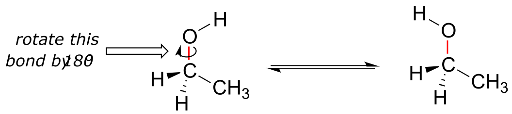

fig 1a

Or ethane: rotation about the carbon-carbon σ bond results in many
different possible three-dimensional arrangements of the atoms.

fig 1

These different arrangements, resulting from σ bond rotation, are
referred to in organic chemistry as **conformations**. Any one specific
conformation is called a **conformational isomer**, or **conformer**.

In order to better visualize different conformations of a molecule, it
is convenient to use a drawing convention called the **Newman
projection**. In a Newman projection, we look lengthwise down a specific
bond of interest – in this case, the carbon-carbon bond in ethane. We
depict the ‘front’ atom as a dot, and the ‘back’ atom as a larger
circle.

fig 2

[Interactive model](http://www.chemtube3d.com/STethanenewman.html)

The six carbon-hydrogen bonds are shown as solid lines protruding from
the two carbons. Note that we do *not* draw bonds as solid or dashed
wedges in a Newman projection.

Looking down the C-C bond in this way, the angle formed between a C-H
bond on the front carbon and a C-H bond on the back carbon is referred
to as a **dihedral angle**. (The dihedral angle between the hour hand
and the minute hand on a clock is 0o at noon, 90o
at 3:00, and so forth).

The lowest energy conformation of ethane, shown in the figure above, is
called the ‘**staggered’** conformation: all of the dihedral angles are
60o, and the distance between the front and back C-H bonds is
maximized.

If we now rotate the front CH3 group 60° clockwise, the
molecule is in the highest energy ‘**eclipsed'** conformation, where the
dihedral angles are all 0o (we stagger the bonds slightly in
our Newman projection drawing so that we can see them all).

fig 3

The energy of the eclipsed conformation, where the electrons in the
front and back C-H bonds are closer together, is approximately 12 kJ/mol
higher than that of the staggered conformation.

Another 60° rotation returns the molecule to a second staggered
conformation. This process can be continued all around the 360° circle,
with three possible eclipsed conformations and three staggered
conformations, in addition to an infinite number of conformations in
between these two extremes.

[video tutorial: conformations of
ethane](https://www.youtube.com/watch?v=jUqb-KD9SuY)

Now let's consider butane, with its four-carbon chain. There are now
three rotating carbon-carbon bonds to consider, but we will focus on the
middle bond between C2 and C3. Below are two
representations of butane in a conformation which puts the two
CH3 groups (C1 and C4) in the eclipsed
position, with the two C-C bonds at a 0o dihedral angle.

fig 4

If we rotate the front, (blue) carbon by 60° clockwise, the butane
molecule is now in a staggered conformation.

fig 5

This is more specifically referred to as the **gauche** conformation of
butane. Notice that although they are staggered, the two methyl groups
are not as far apart as they could possibly be.

A further rotation of 60° gives us a second eclipsed conformation (B) in
which both methyl groups are lined up with hydrogen atoms.

fig 6

One more 60 rotation produces another staggered conformation called the
**anti** conformation, where the two methyl groups are positioned
opposite each other (a dihedral angle of 180o).

fig 7

As with ethane, the staggered conformations of butane are energy
'valleys', and the eclipsed conformations are energy 'peaks'. However,
in the case of butane there are two different valleys, and two different
peaks. The gauche conformation is a higher energy valley than the anti
conformation due to **steric strain**, which is the repulsive
interaction caused by the two bulky methyl groups being forced too close
together. Clearly, steric strain is lower in the anti conformation. In
the same way, steric strain causes the eclipsed A conformation - where
the two methyl groups are as close together as they can possibly be - to
be higher in energy than the two eclipsed B conformations.

The diagram below summarizes the relative energies for the various
eclipsed, staggered, and gauche conformations of butane.

[Interactive model of
butane](http://www.chemtube3d.com/STbutanenewman.html)

[Video tutorial: conformations of
butane](https://www.youtube.com/watch?v=hykVHqZ40RQ)

Because the anti conformation is lowest in energy (and also simply for
ease of drawing), it is conventional to draw open-chain alkanes in a
'zigzag' form, which implies anti conformation at all carbon-carbon
bonds. The figure below shows, as an example, a Newman projection
looking down the C2-C3 bond of octane.

fig 8

<u>Exercise 3.1:</u> Draw Newman projections of the lowest and highest
energy conformations of propane.

<u>Exercise 3.2:</u> Draw a Newman projection, looking down the
C2-C3 bond, of 1-butene in the conformation shown
below (C2 should be your *front* carbon).

## Section 3.2: Conformations of cyclic organic molecules

Browse through a biochemistry textbook and you will see any number of
molecules with cyclic structures. Many of these cyclic structures are
aromatic, and therefore planar. Many others, though, are composed of
sp3-hybridized atoms, and it is these cyclic structures that
are the topic of discussion in this section.

When discussing cyclic organic molecules, we will often use sugars as
examples, because they are such important molecules in biological
chemistry. It is important to recall (section 1.3C) that many sugars
exist in aqueous solution as both open-chain and cyclic forms. You need
not worry at this point about understanding how the cyclic form is
named, or the reaction by which the cyclization occurs - this will be
covered in chapter 10.

fig 9

One thing that you should notice in the cyclic structure shown above is
that atoms or groups bonded to tetrahedral ring carbons are either
pointing up (out of the plane of the page) or down (into the plane of
the page), as indicated by the use of dashed or solid wedge bonds. When
two substituents on the same ring are both pointing toward the same side
of the ring, they are said to be ***cis*** to each other. When they are
pointed to opposite sides, they are said to be ***trans*** to each
other.

fig 10

Ring structures in organic molecules are usually five-membered or
six-membered. Three-and four-membered rings are occasionally found in
nature, but are significantly higher in energy. The relative instability
of these smaller ring structures can be explained by a concept called
**angle strain**, in which the four bonds around the
sp3-hybridized carbons are forced out of their preferred
tetrahedral angles.

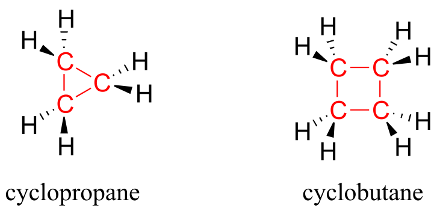

fig 11

If one of the carbon-carbon bonds is broken, the ring will ‘spring’
open, releasing energy as the bonds reassume their preferred tetrahedral
geometry. The effectiveness of two antibiotic drugs, fosfomycin and
penicillin, is due in large part to the high reactivity of the three-
and four-membered rings in their structures.

fig 12

In six-membered cycloalkane structures, bonding angles are close to
tetrahedral, and thus ring strain is not a factor – these rings are in
fact very stable. However, the ‘flat’ drawings we have been using up to
now do not accurately show the actual three-dimensional shape of a five-
or six-membered ring. If cyclohexane were indeed flat, the bond angles
would have to be distorted from 109.5° to 120°. If you build a model,
though, you will find that when you rotate the carbon-carbon bonds so as
to put the ring into a shape that resembles a reclining beach chair, all
of the carbon-carbon bonds are able to assume tetrahedral bonding
angles.

fig 13)

[Interactive
model](http://www.chemtube3d.com/STcyclohexane%20ring%20flip.html)

This **chair conformation** is the lowest energy conformation for
cyclohexane and other six-membered rings.

An alternate conformation for a six-membered ring is called the
**‘boat**’:

fig 14

In the boat conformation, two of the substituents – those on the ‘bow’
and the ‘stern’ if you will – are brought close enough to each other to
cause steric strain. An additional cause of the higher energy of the
boat conformation is that adjacent hydrogen atoms on the 'bottom of the
boat' are forced into eclipsed positions. For these reasons, the boat
conformation is a high energy conformation of cyclohexane, about 30
kJ/mol less stable than the chair conformation.

If you look carefully at your model of cyclohexane in the chair
conformation, you will see that all twelve hydrogens are not equivalent
in terms of their three-dimensional arrangement in space. Six hydrogens
are **axial** – that is, they are pointing either straight up or
straight down relative to the ring. The other six hydrogens are
**equatorial**, meaning that they are pointing away from the perimeter
of the ring, either slightly up or slightly down*. (The equatorial vs
axial distinction is often hard to see at first - it would be a very
good idea at this point to sit down with your instructor or tutor and
work with a modeling kit).*

fig 15

This is not the only possible chair conformation for cyclohexane. On
your model, rotate one of the ‘up’ carbons down, and one of the ‘down'
carbons up. You now have a new, alternate chair conformation – this
process is called **ring inversion**.

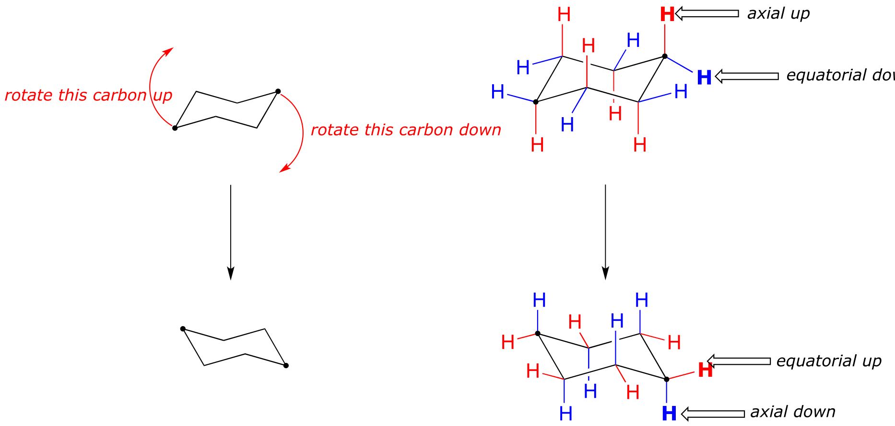

fig 16

What you should recognize here is that, as a result of the ring
inversion process, all of the axial and equatorial hydrogens have traded
positions – axial hydrogens have become equatorial, and vice-versa.
Notice, however, that the ‘down’ hydrogens are still pointing down, and
the ‘up’ hydrogens are still pointing up regardless of whether they are
axial or equatorial. At room temperature, cyclohexane is constantly
inverting between two chair forms of equal energy – it is a rapid
equilibrium situation. Thus, except at very low temperatures, we are not
able to distinguish between axial and equatorial hydrogens, as they are
constantly switching back and forth.

**axial/equatorial *vs* *cis/trans***

A very common error made by organic chemistry students as they begin to
learn about chair conformations is to confuse the terms axial and
equatorial with the terms *cis* and *trans*. **These are completely
different things!** For example, when two substituents on a ring are
*cis* in relation to one another, it means that they are pointed to the
same side of the ring (both up or both down). Depending on their
positions on the ring, they might both be axial, both be equatorial, or
one of each.

Do not make the mistake of calling two substituents *trans* to each
other merely because one is equatorial and one is axial, or *cis*
because the are both axial or both equatorial.

fig 17

**How to draw the cyclohexane chair conformation:**

As an organic chemistry student, you will be expected to be able to draw
an accurate representation of the chair conformations of six-membered
cycloalkanes, which includes being able to draw axial and equatorial
substituents with their correct orientations. Here, then, are some
guidelines to follow:

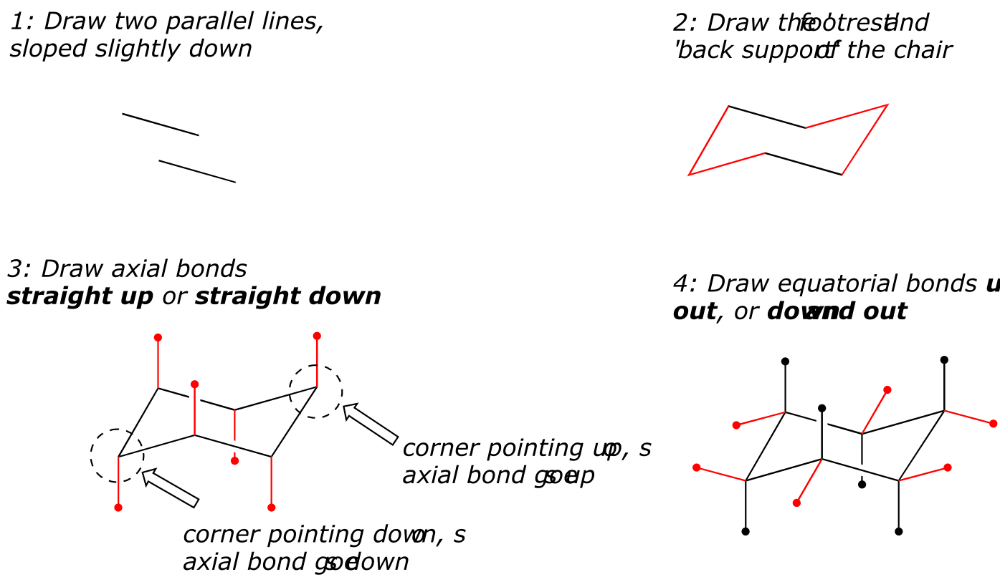

*  
*

*(How **not** to draw the chair):*

fig 19 fig 18

What happens to the relative energies of chair conformations when the
ring has a large substituent, such as a methyl group? Now, the two chair
conformations are quite different: in one, the methyl group is
equatorial and in the other it is axial.

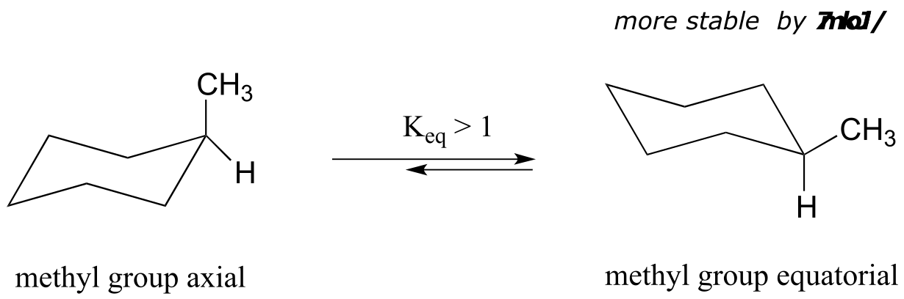

fig 20

When the methyl group is in the axial position, it is brought close
enough to the axial hydrogens on carbons two bonds away to cause
destabilizing steric repulsion: this is referred to as **1,3-diaxial
repulsion**.

fig 21

When in the equatorial position, the methyl group is pointing up and
*away* from the rest of the ring, eliminating the unfavorable
1,3-diaxial interaction. As a consequence, the conformation in which the
methyl group is in the equatorial position is more stable, by
approximately 7 kJ/mol. At room temperature, methylcyclohexane exists as
a rapid equilibrium between the two chair forms (and many other
intermediate conformations), but the equilibrium constant
(Keq) favors the conformation where the methyl group is
equatorial.

**  
**

<u>Exercise 3.3</u>: Here's some General Chemistry review: what is the
value of Keq at 25 oC for the axial to equatorial
interconversion of methylcyclohexane as shown in the previous figure?

The importance of the steric strain factor increases with the increasing
size of a substituent. For example, the difference in energy between the
two chair conformations of *tert*-butyl cyclohexane (24 kJ/mol) is much
larger than for methylcyclohexane (7 kJ/mol), because a *tert*-butyl
group is larger than a methyl group and results in more energetically
unfavorable 1,3-diaxial interactions.

fig 22

In the case of a disubstituted cyclohexane ring in which both
substituents cannot be equatorial, the lower energy conformation
generally places the bulkier substituent in the equatorial position.

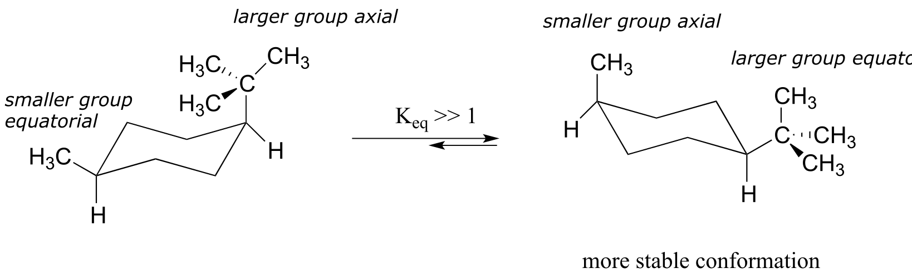

fig 23

***As a general rule, the most stable chair conformation of a
six-membered ring will be that in which the bulkiest groups are in the
equatorial position*.**

<u>Exercise 3.4</u>: Draw the lower energy chair conformations of a)
*trans*-1,2-dimethylcyclohexane, and b)
*trans*-1-isopropyl-3-methylcyclohexane. Draw all substituents on all
carbons (including hydrogens), being sure that the axial or equatorial
orientation is clear. Be sure to check your drawing with your instructor
or tutor.

<u>Exercise 3.5</u>: Predict which of the following disubstituted
hexanes has a greater energy difference between its two chair
conformations, and state your reasons for your choices.

> a\) *cis*-1,3-dimethylcyclohexane or *cis*-1,4-dimethylcyclohexane
>
> b\) *cis*-1,2-dimethylcyclohexane or *trans*-1,2-dimethylcyclohexane
>
> c\) *trans*-1,2-dimethylcyclohexane or
> *trans*-1-isopropyl-2-methylcyclohexane

<u>Exercise 3.6</u>: Can a 'ring inversion' change a *cis*-disubstituted
cyclohexane to *trans*? Explain.

Recall that five- and six-carbon sugars such as glucose and fructose
exist in solution in open chain and cyclic forms. Glucose, in its most
abundant form in solution, is a six-membered ring adopting a chair
conformation with all substituents equatorial.

fig 24

The most abundant form of fructose in aqueous solution is also a
six-membered ring.

fig 25

The lower energy chair conformation is the one with three of the five
substituents (including the bulky –CH2OH group) in the
equatorial position.

<u>Exercise 3.7</u>: Draw the two chair conformations of the six-carbon
sugar mannose, being sure to clearly show each non-hydrogen substituent
as axial or equatorial. Predict which conformation is likely to be more
stable, and explain why.

>  style="width:1.21111in;height:1.38889in" />

fig 26

[Video tutorial: conformations of
cyclohexane](https://www.khanacademy.org/science/organic-chemistry/bond-line-structures-alkanes-cycloalkanes/conformations/v/chair-and-boat-shapes-for-cyclohexane)

The lowest energy conformation of cyclopentane and other five-membered
rings is known as the ‘envelope’, with four of the ring atoms in the
same plane and one out of plane (notice that this shape resembles an
envelope with the flap open). The out-of-plane carbon is said to be in
the ***endo*** position (‘*endo’* means ‘inside’).

fig 27

The 'equatorial' vs 'axial' distinction discussed in the context of
6-membered rings does not apply to five-membered rings.

At room temperature, cyclopentane undergoes a rapid **pseudorotation**
process in which each of the five carbons takes turns being in the
*endo* position.

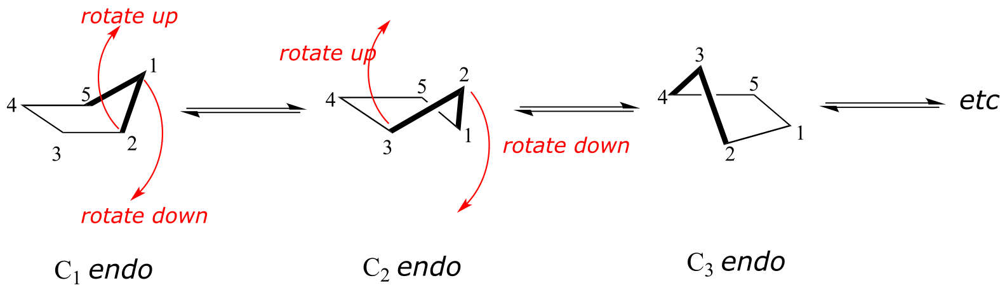

fig 28

One of the most important five-membered rings in nature is a sugar
called ribose – recall from section 1.3E that DNA and RNA are both
constructed upon ‘backbones’ derived from ribose. Pictured below is one
thymidine (T) deoxy-nucleotide from a stretch of DNA:

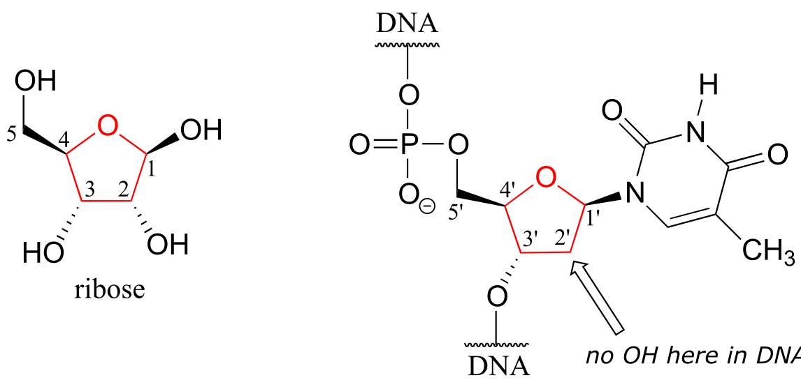

fig 29

The lowest-energy conformations for ribose are envelope forms in which
either the 3' or 2' carbons are *endo*. This has
very important implications for oligonucleotide structure – in a DNA
double helix, it is C2 that is in the *endo* position, while
in RNA it is C3.

## Section 3.3: Chirality and stereoisomers

We turn now to concept of chirality that formed the basis of the story
about Louis Pasteur in the beginning of this chapter. Recall that the
term **chiral**, from the Greek work for 'hand', refers to anything
which cannot be superimposed on its own mirror image. Your hands, of
course, are chiral - you cannot superimpose your left hand on your
right, and you cannot fit your left hand into a right-handed glove
(which is also a chiral object). Another way of saying this is that your
hands do not have a **mirror plane of symmetry**: you cannot find any
plane which bisects your hand in such a way that one side of the plane
is a mirror image of the other side. *Chiral objects do not have a plane
of symmetry*.

Your face, on the other hand is **achiral** - lacking chirality -
because, some small deviations notwithstanding, you could superimpose
your face onto its mirror image. If someone were to show you a mirror
image photograph of your face, you could line the image up,
point-for-point, with your actual face. Your face has a plane of
symmetry, because the left side is the mirror image of the right side.

What Pasteur, Biot, and their contemporaries did not yet fully
understand when Pasteur made his discovery of molecular chirality was
the *source* of chirality at the molecular level. It stood to reason
that a chiral molecule is one that does not contain a plane of symmetry,
and thus cannot be superimposed on its mirror image. We now know that
chiral molecules contain one or more **chiral centers**, which are
almost always tetrahedral (*sp3*-hybridized) carbons with
four different substituents. Consider the cartoon molecule A below: a
tetrahedral carbon, with four different substituents denoted by balls of
four different colors (for the time being, don't worry about exactly
what these substituents could be - we will see real examples very soon).

fig 3

[another
image](http://astrobiology.berkeley.edu/Mars101/pix/image003.jpg)

The mirror image of A, which we will call B, is drawn on the right side
of the figure, and an imaginary mirror is in the middle. Notice that
every point on A lines up through the mirror with the same point on B:
in other words, if A looked in the mirror, it would see B looking back.

Now, if we flip compound A over and try to superimpose it point for
point on compound B, we find that we cannot do it: if we superimpose any
two colored balls, then the other two are misaligned.

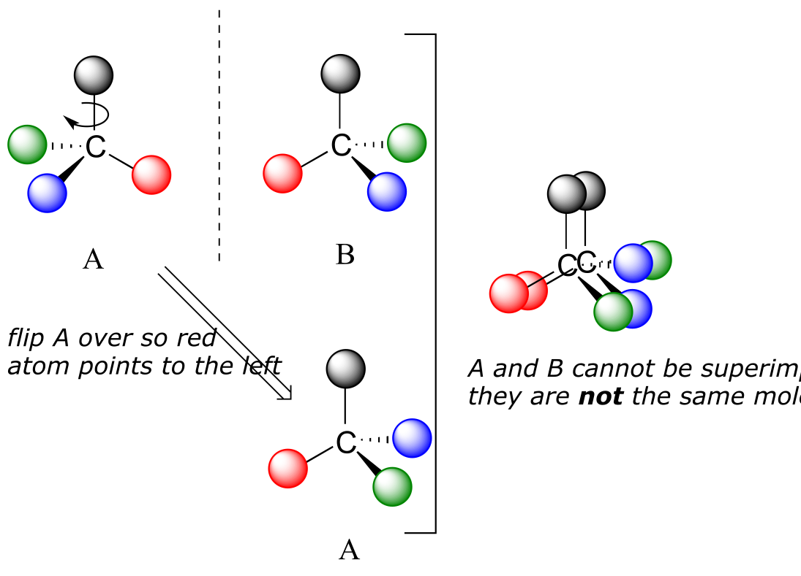

32

A is not superimposable on its mirror image (B), thus by definition A is
a chiral molecule. It follows that B also is not superimposable on *its*
mirror image (A), and thus it is also a chiral molecule. Also notice in
the figure below (and convince yourself with models) that neither A nor
B has an internal plane of symmetry.

A and B are **stereoisomers**: molecules with the same molecular formula
and the same bonding arrangement, but *a different arrangement of atoms
in space*. There are two types of stereoisomers: enantiomers and
diastereomers. **Enantiomers** are pairs of stereoisomers which are
mirror images of each other: thus, A and B are enantiomers. It should be
self-evident that a chiral molecule will always have one (and *only*
one) enantiomer: enantiomers come in pairs. Enantiomers have identical
physical properties (melting point, boiling point, density, and so on).
However, enantiomers do differ in how they interact with polarized light
(we will learn more about this soon) and they may also interact in very
different ways with other chiral molecules - proteins, for example. We
will begin to explore this last idea in later in this chapter, and see
many examples throughout the remainder of our study of biological
organic chemistry.

**Diastereomers** are stereoisomers which are *not* mirror images of
each other. For now, we will concentrate on understanding enantiomers,
and come back to diastereomers later.

We defined a chiral center as a tetrahedral carbon with four different
substituents. If, instead, a tetrahedral carbon has two identical
substituents (two black atoms in the cartoon figure below), then of
course it still has a mirror image (*everything* has a mirror image,
unless we are talking about a vampire!) However, it is superimposable on
its mirror image, and has a plane of symmetry.

fig 33

This molecule is **achiral** (lacking chirality). Using the same
reasoning, we can see that a trigonal planar
(*sp2*-hybridized) carbon is also not a chiral center.

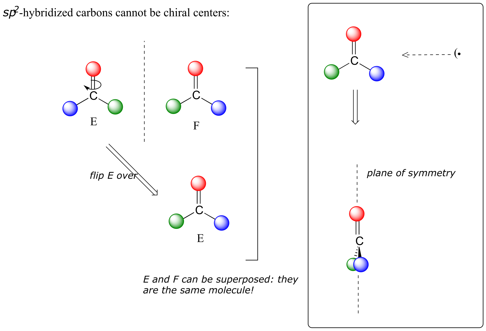

fig 34

Notice that structure E can be superimposed on F, its mirror image - all
you have to do is pick E up, flip it over, and it is the same as F. This
molecule has a plane of symmetry, and is achiral.

Let's apply our general discussion to real molecules. For now, we will
limit our discussion to molecules with a single chiral center. It turns
out that tartaric acid, the subject of our chapter introduction, has
*two* chiral centers, so we will come back to it later.

Consider 2-butanol, drawn in two dimensions below.

fig 35

Carbon \#2 is a chiral center: it is *sp3*-hybridized and
tetrahedral (even though it is not drawn that way above), and the four
things attached to is are different: a hydrogen, a methyl
(-CH3) group, an ethyl (-CH2CH3) group,
and a hydroxyl (OH) group. Let's draw the bonding at C2 in
three dimensions, and call this structure A. We will also draw the
mirror image of A, and call this structure B.

fig 36

When we try to superimpose A onto B, we find that we cannot do it. A and
B are both chiral molecules, and they are enantiomers of each other.

2-propanol, unlike 2-butanol, is *not* a chiral molecule. Carbon \#2 is
bonded to two identical substituents (methyl groups), and so it is not a
chiral center.

fig 37

Notice that 2-propanol is superimposable on its own mirror image.

When we look at very simple molecules like 2-butanol, it is not
difficult to draw out the mirror image and recognize that it is not
superimposable. However, with larger, more complex molecules, this can
be a daunting challenge in terms of drawing and three-dimensional
visualization. The easy way to determine if a molecule is chiral is
simply to look for the presence of one or more chiral centers: molecules
with chiral centers will (almost always) be chiral. We insert the
'almost always' caveat here because it is possible to come up with the
exception to this rule - we will have more to say on this later, but
don't worry about it for now.

Here's another trick to make your stereochemical life easier: if you
want to draw the enantiomer of a chiral molecule, it is not necessary to
go to the trouble of drawing the point-for-point mirror image, as we
have done up to now for purposes of illustration. Instead, keep the
carbon skeleton the same, and simply reverse the solid and dashed wedge
bonds on the chiral carbon: that accomplishes the same thing. You should
use models to convince yourself that this is true, and also to convince
yourself that swapping *any two substituents* about the chiral carbon
will result in the formation of the enantiomer.

fig 38

Here are four more examples of chiral biomolecules, each one shown as a
pair of enantiomers, with chiral centers marked by red dots.

fig 39

Here are some examples of achiral biomolecules - convince yourself that
none of them contains a chiral center:

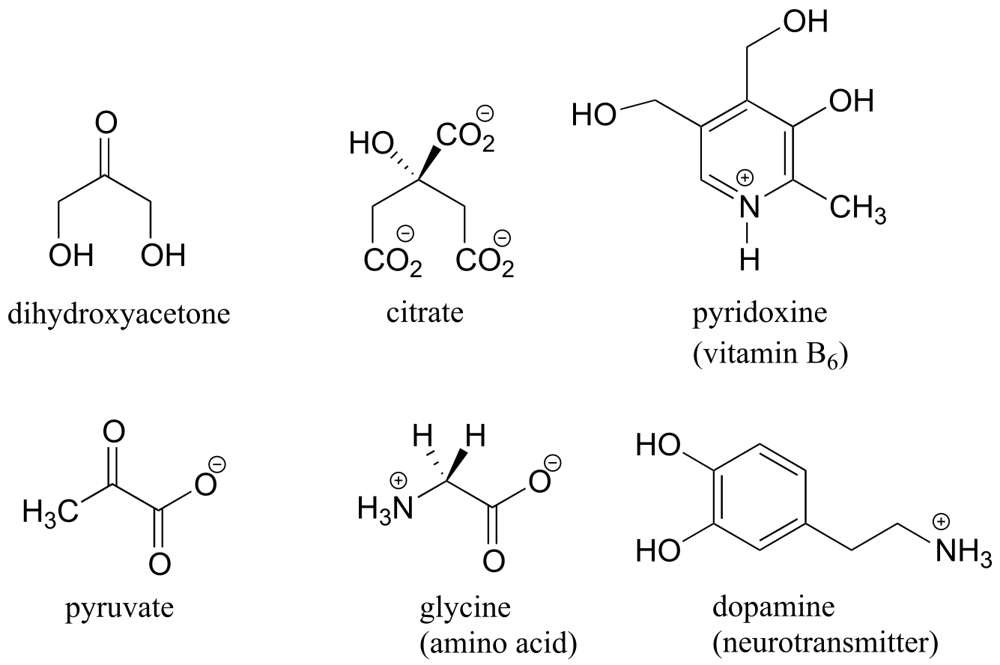

fig 40

When looking for chiral centers, it is important to recognize that the
question of whether or not the dashed/solid wedge drawing convention is
used is irrelevant. Chiral molecules are sometimes drawn without using
wedges (although obviously this means that stereochemical information is
being omitted). Conversely, wedges may be used on carbons that are *not*
chiral centers – look, for example, at the drawings of glycine and
citrate in the figure above.

Can a chiral center be something other than a tetrahedral carbon with
four different substituents? The answer to this question is 'yes' -
however, these alternative chiral centers are very rare in the context
of biological organic chemistry, and outside the scope of our discussion
here.

You may also have wondered about amines: shouldn't we consider a
secondary or tertiary amine to be a chiral center, as they are
tetrahedral and attached to four different substituents, if the
lone-pair electrons are counted as a 'substituent'? Put another way,
isn't an amine non-superimposable on its mirror image?

The answer: yes it is, in the static picture, but in reality, the
nitrogen of an amine is rapidly and reversibly inverting, or turning
inside out, at room temperature.

fig 42

If you have trouble picturing this, take an old tennis ball and cut it
in half. Then, take one of the concave halves and flip it inside out,
then back again: this is what the amine is doing. The end result is that
the two 'enantiomers' if the amine are actually two rapidly
interconverting forms of the same molecule, and thus the amine itself is
not a chiral center. This inversion process does *not* take place on a
tetrahedral carbon, which of course has no lone-pair electrons.

<u>Exercise 3.8</u>: Locate all of the chiral centers (there may be more
than one in a molecule). Remember, hydrogen atoms bonded to carbon
usually are not drawn in the line structure convention - but they are
still there!

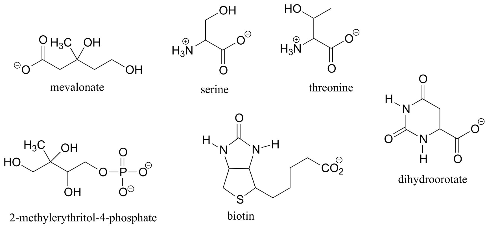

fig 41

<u>Exercise 3.9</u>:

a\) Draw two enantiomers of i) mevalonate and ii) serine.

b\) Are the two 2-butanol structures below enantiomers?

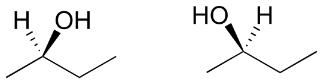

<u>Exercise 3.10</u>: Label the molecules below as chiral or achiral,
and locate all chiral centers.

> 

fig 43

[Video tutorials:
chirality](https://www.khanacademy.org/science/organic-chemistry/stereochemistry-topic/chirality-r-s-system/v/introduction-to-chirality)

[Video tutorials:
enantiomers](https://www.khanacademy.org/science/organic-chemistry/stereochemistry-topic/optical-activity/v/drawing-enantiomers)

## Section 3.4: Labeling chiral centers

Chemists need a convenient way to distinguish one stereoisomer from
another. The **Cahn-Ingold-Prelog system** is a set of rules that allows
us to unambiguously define the stereochemical configuration of any
stereocenter, using the designations ‘***R***’ (from the Latin *rectus*,
meaning right-handed) or ‘***S***’ (from the Latin *sinister*, meaning
left-handed).

The rules for this system of stereochemical nomenclature are, on the
surface, fairly simple.

<u>Rules for assigning an R/S designation to a chiral center:</u>

1: Assign priorities to the four substituents, with \#1 being the
highest priority and \#4 the lowest. Priorities are based on the atomic
number.

2: Trace a circle from \#1 to \#2 to \#3.

3: Determine the orientation of the \#4 priority group. If it is
oriented into the plane of the page (away from you), go to step 4a. If
it is oriented out of the plane of the page (toward you) go to step 4b.

4a: *(#4 group pointing away from you*): a clockwise circle in part 2
corresponds to the *R* configuration, while a counterclockwise circle
corresponds to the *S* configuration.

4b: *(#4 group pointing toward you*): a clockwise circle in part 2
corresponds to the *S* configuration, while a counterclockwise circle
corresponds to the *R* configuration.

We’ll use the 3-carbon sugar glyceraldehyde as our first example. The
first thing that we must do is to assign a **priority** to each of the
four substituents bound to the chiral center. We first look at the atoms
that are directly bonded to the chiral center: these are H, O (in the
hydroxyl), C (in the aldehyde), and C (in the CH2OH group).

<u>Assigning R/S configuration to glyceraldehyde</u>

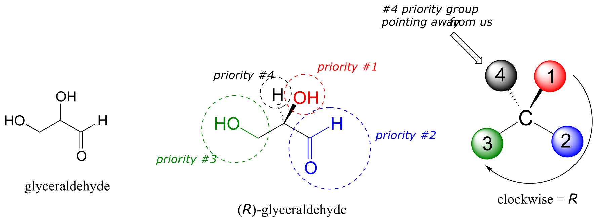

fig 44

Two priorities are easy: hydrogen, with an atomic number of 1, is the
lowest (#4) priority, and the hydroxyl oxygen, with atomic number 8, is
priority \#1. Carbon has an atomic number of 6. Which of the two ‘C’
groups is priority \#2, the aldehyde or the CH2OH? To
determine this, we move one more bond away from the chiral center: for
the aldehyde we have a *double* bond to an oxygen, while on the
CH2OH group we have a *single* bond to an oxygen. If the atom
is the same, double bonds have a higher priority than single bonds.
Therefore, the aldehyde group is assigned \#2 priority and the
CH2OH group the \#3 priority.

With our priorities assigned, we look next at the \#4 priority group
(the hydrogen) and see that it is pointed back away from us, into the
plane of the page - thus step 4a from the procedure above applies. Then,
we trace a circle defined by the \#1, \#2, and \#3 priority groups, in
increasing order. The circle is clockwise, which by step 4a tells us
that this carbon has the ‘*R*’ configuration, and that this molecule is
(*R*)-glyceraldehyde. Its enantiomer, by definition, must be
(*S*)-glyceraldehyde.

Next, let's look at one of the enantiomers of lactic acid and determine
the configuration of the chiral center. Clearly, H is the \#4
substituent and OH is \#1. Owing to its three bonds to oxygen, the
carbon on the acid group takes priority \#2, and the methyl group takes
\#3. The \#4 group, hydrogen, happens to be drawn pointing *toward* us
(out of the plane of the page) in this figure, so we use step 4b: The
circle traced from \#1 to \#2 to \#3 is clockwise, which means that the
chiral center has the *S* configuration.

fig 45

[Interactive model:
(S)-alanine](http://www.chemtube3d.com/STchiralcentersRS.html)

[Video tutorial: Cahn-Ingold-Prelog (R/S) naming
system](https://www.khanacademy.org/science/organic-chemistry/stereochemistry-topic/optical-activity/v/cahn-ingold-prelog-system-for-naming-enantiomers)

The drug thalidomide is an interesting - but tragic - case study in the
importance of stereochemistry in drug design. First manufactured by a
German drug company and prescribed widely in Europe and Australia in the
late 1950's as a sedative and remedy for morning sickness in pregnant
women, thalidomide was soon implicated as the cause of devastating birth
defects in babies born to women who had taken it. Thalidomide contains a
chiral center, and thus exists in two enantiomeric forms. It was
marketed as a **racemic** **mixture**: in other words, a 50:50 mixture
of both enantiomers.

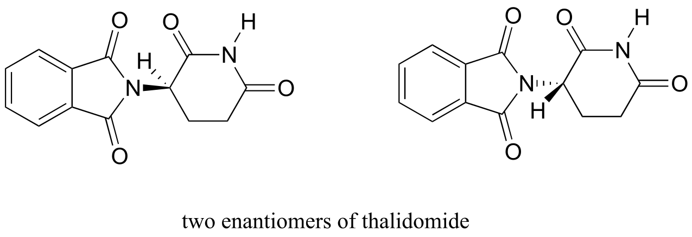

fig 45b

Let’s try to determine the stereochemical configuration of the
enantiomer on the left. Of the four bonds to the chiral center, the \#4
priority is hydrogen. The nitrogen group is \#1, the carbonyl side of
the ring is \#2, and the –CH2 side of the ring is \#3.

fig 45a

The hydrogen is shown pointing away from us, and the prioritized
substituents trace a clockwise circle: this is the *R* enantiomer of
thalidomide. The other enantiomer, of course, must have the *S*
configuration.

[Interactive model of
(*S*)-thalidomide](https://chemapps.stolaf.edu/jmol/jmol.php?title=Thalidomide&model=InChI%3D1%2FC13H10N2O4%2Fc16-10-6-5-9(11(17)14-10)15-12(18)7-3-1-2-4-8(7)13(15)19%2Fh1-4%2C9H%2C5-6H2%2C(H%2C14%2C16%2C17))

Although scientists are still unsure today how thalidomide works,
experimental evidence suggests that it was actually the *R* enantiomer
that had the desired medical effects, while the *S* enantiomer caused
the birth defects. Even with this knowledge, however, pure
(*R*)-thalidomide is not safe, because enzymes in the body rapidly
convert between the two enantiomers - we will see how that happens in
chapter 12. (J. Pharmacokinet. Biopharm. 1998, 26, 363; Arch. Toxicol.
1988, 62, 205).

As a historical note, thalidomide was never approved for use in the
United States. This was thanks in large part to the efforts of [Dr.
Frances
Kelsey](https://cfmedicine.nlm.nih.gov/physicians/biography_182.html), a
Food and Drug officer who, at peril to her career, blocked its approval
due to her concerns about the lack of adequate safety studies,
particularly with regard to the drug's ability to enter the bloodstream
of a developing fetus. Unfortunately, though, at that time clinical
trials for new drugs involved widespread and unregulated distribution to
doctors and their patients across the country, so families in the U.S.
were not spared from the damage caused.

Very recently a close derivative of thalidomide has become legal to
prescribe again in the United States, with strict safety measures
enforced, for the treatment of a form of blood cancer called multiple
myeloma. In Brazil, thalidomide is used in the treatment of leprosy -
but despite safety measures, children are still being born with
thalidomide-related defects.

<u>Exercise 3.11:</u> Determine the stereochemical configurations of the
chiral centers in the biomolecules shown below.

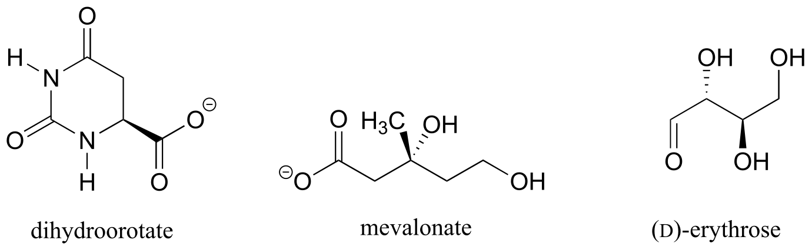

<u>Exercise 3.12</u>: Should the (*R*) enantiomer of malate have a solid
or dashed wedge for the C-O bond in the figure below?

> 

fig 46

<u>Exercise 3.13</u>: Using solid or dashed wedges to show
stereochemistry, draw the (*R*) enantiomer of ibuprofen and the (*S*)
enantiomer of 2-methylerythritol-4-phosphate (structures are shown
earlier in this chapter without stereochemistry).

## Section 3.5: Optical activity

Chiral molecules, as we learned in the introduction to this chapter,
have an interesting optical property. You may know from studying physics
that light waves are oscillating electric and magnetic fields. In
ordinary light, the oscillation is randomly oriented in an infinite
number of planes. When ordinary light is passed through a polarizer, all
planes of oscillation are filtered out except one, resulting in
**plane-polarized light**.

fig 47

A beam of plane-polarized light, when passed through a sample of a
chiral compound, interacts with the compound in such a way that the
angle of oscillation will rotate. This property is called **optical
activity**.

fig 48

[another
image](http://chemed.chem.purdue.edu/genchem/topicreview/bp/1organic/graphics/24_19.gif)

If a compound rotates plane polarized light in the clockwise (+)
direction, it is said to be **dextrorotatory**, while if it rotates
light in the counterclockwise (-) direction it is **levorotatory**. (We
mentioned L- and D-amino acids in the previous section: the L-amino
acids are levorotatory). The magnitude of the observed optical activity
is dependent on temperature, the wavelength of light used, solvent,
concentration of the chiral sample, and the path length of the sample
tube (path length is the length that the plane-polarized light travels
through the chiral sample). Typically, optical activity measurements are
made in a 1 decimeter (10 cm) path-length sample tube at 25 °C, using as
a light source the so-called “D-line” from a sodium lamp, which has a
wavelength of 589 nm. The **specific rotation** \[α\] of a pure chiral
compound at 25° is expressed by the expression:

fig 49

. . . where αb is the observed rotation, *l* is path length
in decimeters), and *c* is the concentration of the sample in grams per
100 mL. In other words, the specific rotation of a chiral compound is
the optical rotation that is observed when 1g of the compound is
dissolved in enough of a given solvent to make 100 mL solution, and the
rotation is measured in a 1dm cuvette at 25 oC using light
from a sodium lamp.

Every chiral molecule has a characteristic specific rotation, which is
recorded in the chemical literature as a physical property just like
melting point or density. Different enantiomers of a compound will
always rotate plane-polarized light with an equal but opposite
magnitude. (*S*)-ibuprofen, for example, has a specific rotation of
+54.5o (dextrorotatory) in methanol, while (*R*)-ibuprofen
has a specific rotation of -54.5o. *There is no relationship
between chiral compound's R/S designation and the direction of its
specific rotation.* For example, the *S* enantiomer of ibuprofen is
dextrorotatory, but the *S* enantiomer of glyceraldehyde is
levorotatory.

A 50:50 mixture of two enantiomers (a racemic mixture) will have no
observable optical activity, because the two optical activities cancel
each other out. In a structural drawing, a 'squigly' bond from a chiral
center indicates a mixture of both *R* and *S* configurations.

fig 50

Chiral molecules are often labeled according to whether they are
dextrorotatory or levorotatory as well as by their *R/S* designation.
For example, the pure enantiomers of ibuprofen are labeled
(*S*)-(+)-ibuprofen and (*R*)-(-)-ibuprofen, while (±)-ibuprofen refers
to the racemic mixture, which is the form in which the drug is sold to
consumers.

[Video tutorial: optical
activity](https://www.khanacademy.org/science/organic-chemistry/stereochemistry-topic/optical-activity/v/optical-activity-new)

<u>Exercise 3.14</u>: The specific rotation of (*R*)-limonene is
+11.5o in ethanol. What is the expected observed rotation of
a sample of 6.00 g (*S*)-limonene dissolved in ethanol to a total volume
of 80.0 mL in a 1.00 dm (10.0 cm) pathlength cuvette?

<u>Exercise 3.15</u>: The specific rotation of (*S*)-carvone is +61°,
measured 'neat' (pure liquid sample, no solvent). The optical rotation
of a mixture of *R* and *S* carvone is measured at

-23°. Which enantiomer is in excess in the mixture?

All of the twenty natural amino acids except glycine have a chiral
center at their α-carbon (recall that basic amino acid structure and
terminology was introduced in section 1.3D). Virtually all of the amino
acids found in nature, both in the form of free amino acids or
incorporated into peptides and proteins, have what is referred to in the
biochemical literature as the 'L' configuration:

fig 45c

The 'L' indicates that these amino acid stereoisomers are levorotatory.
All but one of the 19 L-amino acids have *S* stereochemistry at the
α−carbon, using the rules of the *R/S* naming system.

[Interactive model:
(S)-alanine](http://www.chemtube3d.com/STchiralcentersRS.html)

D-amino acids (the D stands for dextrorotatory) are very rare in nature,
but we will learn about an interesting example of a peptide containing
one D-amino acid residue later in chapter 12.

<u>Exercise 3.16</u>: Which L-amino acid has the *R* configuration? Use
Table 5 at the end of the book to refer to the structures of all 20
common amino acids.

## Section 3.6: Compounds with multiple chiral centers

So far, we have been analyzing compounds with a single chiral center.
Next, we turn our attention to those which have multiple chiral centers.
We'll start with some stereoisomeric four-carbon sugars with two chiral
centers.

fig 51

To avoid confusion, we will simply refer to the different stereoisomers
by capital letters.

Look first at compound A, below. Both chiral centers in have the *R*
configuration (you should confirm this for yourself!). The mirror image
of Compound A is compound B, which has the *S* configuration at both
chiral centers. If we were to pick up compound A, flip it over and put
it next to compound B, we would see that they are *not* superimposable
(again, confirm this for yourself with your models!). A and B are
nonsuperimposable mirror images: in other words, enantiomers.

fig 51

Now, look at compound C, in which the configuration is *S* at chiral
center 1 and *R* at chiral center 2. Compounds A and C are
stereoisomers: they have the same molecular formula and the same bond
connectivity, but a different arrangement of atoms in space (recall that
this is the definition of the term 'stereoisomer). However, they are
*not* mirror images of each other (confirm this with your models!), and
so they are *not* enantiomers. By definition, they are **diastereomers**
of each other.

Notice that compounds C and B also have a diastereomeric relationship,
by the same definition.

So, compounds A and B are a pair of enantiomers, and compound C is a
diastereomer of both of them. Does compound C have its own enantiomer?
Compound D is the mirror image of compound C, and the two are not
superimposable. Therefore, C and D are a pair of enantiomers. Compound D
is also a diastereomer of compounds A and B.

This can also seem very confusing at first, but there some simple
shortcuts to analyzing stereoisomers:

**Stereoisomer shortcuts**

If ***all*** of the chiral centers are of opposite R/S configuration
between two stereoisomers, they are enantiomers.

If ***at least one, but not all*** of the chiral centers are opposite
between two stereoisomers, they are diastereomers.

(*Note: these shortcuts to not take into account the possibility of
additional stereoisomers due to alkene groups: we will come to that
later)*

Here's another way of looking at the four stereoisomers, where one
chiral center is associated with red and the other blue. Pairs of
enantiomers are stacked together.

fig 51

<u>The four possible configurations:</u>

*RR RS*

*SS SR*

We know, using the shortcut above, that the enantiomer of RR must be
SS - both chiral centers are different. We also know that RS and SR are
diastereomers of RR, because in each case one - but not both - chiral
centers are different.

Now, let's extend our analysis to a sugar molecule with three chiral
centers. Going through all the possible combinations, we come up with
eight total stereoisomers - four pairs of enantiomers.

fig 52

RRR RRS RSR RSS

SSS SSR SRS SRR

Let's draw the *RRR* stereoisomer. Being careful to draw the wedge bonds
correctly so that they match the *RRR* configurations, we get:

fig 53a

Now, using the above drawing as our model, drawing any other
stereoisomer is easy. If we want to draw the enantiomer of *RRR,* we
don't need to try to visualize the mirror image, we just start with the
*RRR* structure and invert the configuration at *every* chiral center to
get *SSS*.

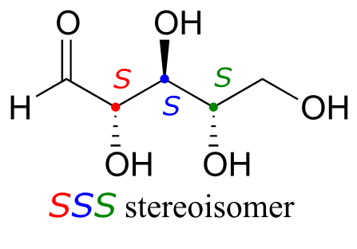

fig 54

Try making models of *RRR* and *SSS* and confirm that they are in fact
nonsuperimposable mirror images of each other.

There are six diastereomers of *RRR*. To draw one of them, we just
invert the configuration of at least one, but not all three, of the
chiral centers. Let's invert the configuration at chiral center 1 and 2,
but leave chiral center 3 unchanged. This gives us the *SSR*
configuration.

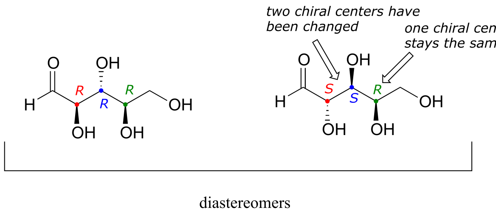

fig 53

One more definition at this point: diastereomers which differ at only a
single chiral center are called **epimers**. For example, *RRR* and
*SRR* are epimers*:*

The *RRR* and *SSR* stereoisomers shown earlier are diastereomers but
*not* epimers because they differ at *two* of the three chiral centers.

<u>Exercise 3.17</u>:

a\) Draw the structure of the *enantiomer* of the *SRS* stereoisomer of
the sugar used in the previous example.

b\) List (using the *XXX* format, not drawing the structures) all of the
epimers of *SRS.*

c\) List all of the stereoisomers that are diastereomers, but not
epimers, of *SRS.*

The epimer term is useful because in biochemical pathways, compounds
with multiple chiral centers are isomerized at one specific center by
enzymes known as **epimerases**. Two examples of epimerase-catalyzed
reactions are below.

fig 55

We know that enantiomers have identical physical properties and equal
but opposite magnitude specific rotation. Diastereomers, in theory at
least, have *different* physical properties – we stipulate ‘in theory’
because sometimes the physical properties of two or more diastereomers
are so similar that it is very difficult to distinguish between them. In
addition, the specific rotation values of diastereomers are unrelated –
they could be the same sign or opposite signs, similar in magnitude or
very dissimilar.

<u>Exercise 3.18:</u> The sugar below is one of the stereoisomers that
we have been discussing.

fig 55h

The only problem is, it is drawn with the carbon backbone in a different
orientation from what we have seen. Determine the configuration at each
chiral center to determine which stereoisomer it is.

<u>Exercise 3.19</u>: Draw the enantiomer of the xylulose-5-phosphate
structure in the previous figure.

<u>Exercise 3.20</u>: The structure of the amino acid D-threonine, drawn
without stereochemistry, is shown below. D-threonine has the (S)
configuration at both of its chiral centers. Draw D-threonine, it's
enantiomer, and its two diastereomers.

Here is some more practice in identifying isomeric relationships.
D-glucose is the monosaccharide that serves as the entrance point for
the glycolysis pathway and as a building block for the carbohydrate
biopolymers starch and cellulose. The 'D' in D-glucose stands for
*dextrarotatory* and is part of the specialized nomenclature system for
sugars, which we will not concern ourselves with here. The open-chain
structure of the sugar is shown below.

fig 55f

Because D-glucose has four chiral centers, it can exist in a total of
24 = 16 different stereoisomeric forms: it has one enantiomer
and 14 diastereomers.

Now, let's compare the structures of the two sugars D-glucose and
D-gulose, and try to determine their relationship.

fig 55a

The two structures have the same molecular formula and the same
connectivity, therefore they must be stereoisomers. They each have four
chiral centers, and the configuration is different at two of these
centers (at carbons \#3 and \#4). They are diastereomers.

Now, look at the structures of D-glucose and D-mannose.

fig 55b

Here, everything is the same except for the configuration of the chiral
center at carbon \#2. The two sugars differ at only one of the four
chiral centers, so again they are diastereomers, and more specifically
they are epimers.

D-glucose and L-glucose are enantiomers, because they differ at all four
chiral centers.

fig 55c

D-glucose is the enantiomer commonly found in nature.

D-glucose and D-fructose are not stereoisomers, because they have
different bonding connectivity: glucose has an aldehyde group, while
fructose has a ketone. The two sugars do, however, have the same
molecular formula, so by definition they are constitutional isomers.

D-glucose and D-ribose are not isomers of any kind, because they have
different molecular formulas.

<u>Exercise 3.21</u>: Identify the relationship between each pair of
structures. Your choices are: not isomers, constitutional isomers,
diastereomers but not epimers, epimers, enantiomers, or same molecule.

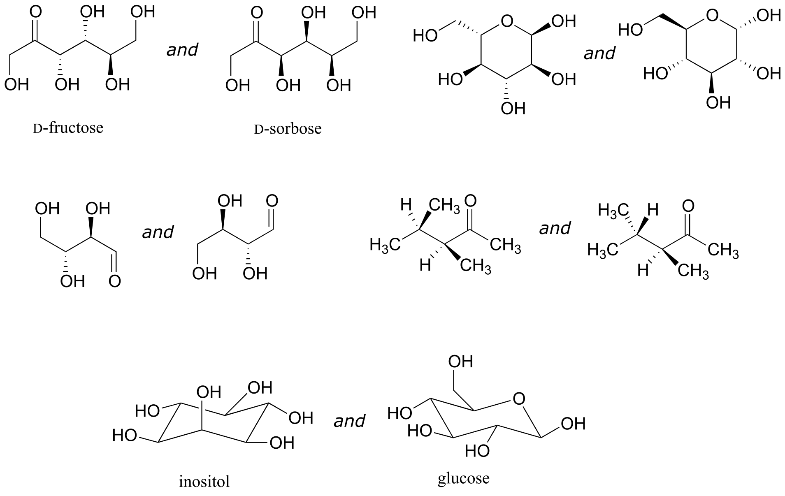

fig 55g

<u>Exercise 3.22</u>: Identify the relationship between each pair of
structures. *Hint* - figure out the configuration of each chiral center.

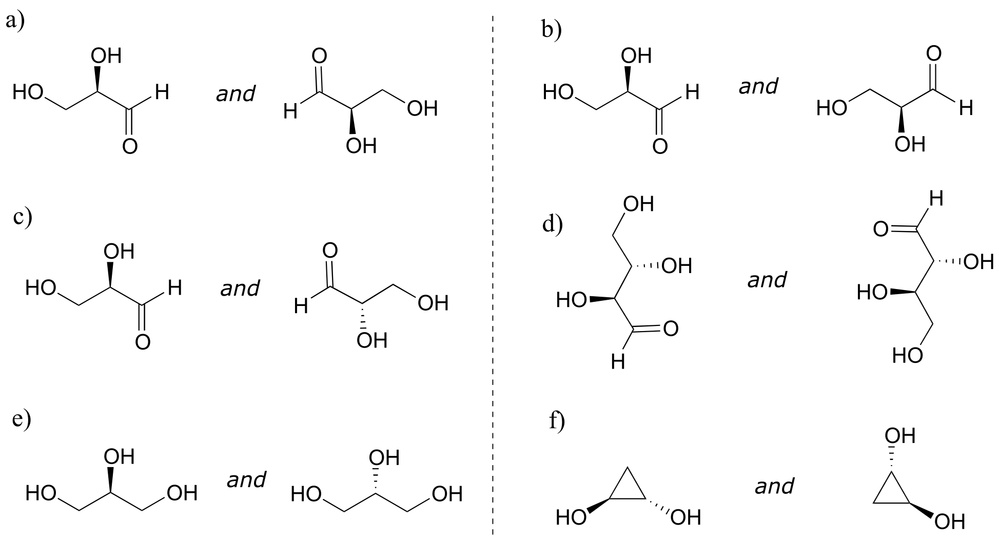

fig 55h

## Section 3.7: *Meso* compounds

The levorotatory and dextrorotatory forms of tartaric acid studied by
Louis Pasteur were, as we now know, the (*S,S*) and (*R,R*) enantiomers,
respectively:

fig 56a

What the 19th century chemists referred to as *'acide racemique'* was
just that: a racemic mixture of the *R,R* and *S,S* enantiomers, the
racemization a result of how the natural *R,R* isomer had been
processed.

But tartaric acid has two chiral centers: shouldn't there be another
pair of enantiomers?

[interactive model](http://www.chemtube3d.com/STtartaricacid.html)

fig 56c

There in fact is another stereoisomer of tartaric acid: *but only one*.
The two structures above are actually superimposable on one another:
they are the exact same molecule. The figure below illustrates this, and
also that the structure has a plane of symmetry. However, you should be
sure to build models and confirm these assertions for yourself.

fig 56d

This tartaric acid isomer is an *achiral* diastereomer of the both the
levorotatory and dextrorotatory isomers. It is a special case, called a
***meso*** compound: it has two apparent chiral centers but due to its
internal symmetry it is not in fact chiral, and does not exhibit optical
activity. Note that the *meso* form of tartaric acid did not play a part
in Pasteur's experiments.

There are many more possible examples of *meso* compounds, but they
really can be considered 'exceptions to the rule' and quite rare in
biologically relevant chemistry.

<u>Exercise 3.23</u>: Which of the following compounds are *meso*? Hint:
build models, and then try to find a conformation in which you can see a
plane of symmetry.

[Video tutorial: stereoisomeric
relationships](https://www.khanacademy.org/science/organic-chemistry/stereochemistry-topic/diastereomers-meso-compounds/v/stereoisomers-enantiomers-diastereomers-constitutional-isomers-and-meso-compounds)

## Section 3.8: Fischer and Haworth projections 

When reading the chemical and biochemical literature, you are likely to
encounter several different conventions for drawing molecules in three
dimensions, depending on the context of the discussion. While organic
chemists prefer to use the dashed/solid wedge convention to show
stereochemistry, biochemists often use drawings called **Fischer
projections** and **Haworth projections** to discuss and compare the
structure of sugar molecules.

Fisher projections show sugars in their open chain form. In a Fischer
projection, the carbon atoms of a sugar molecule are connected
vertically by solid lines, while carbon-oxygen and carbon-hydrogen bonds
are shown horizontally. Stereochemical information is conveyed by a
simple rule: vertical bonds point into the plane of the page, while
horizontal bonds point out of the page.

fig 66

Below are two different representations of (R)-glyceraldehyde, the
smallest sugar molecule (also called D-glyceraldehyde in the
stereochemical nomenclature used for sugars):

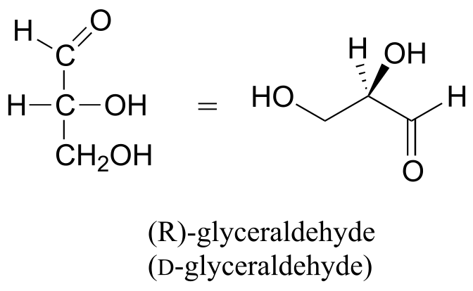

fig 67

Below are three representations of the open chain form of D-glucose: in
the conventional Fischer projection (A), in the “line structure”
variation of the Fischer projection in which carbons and hydrogens are
not shown (B), and finally in the 'zigzag' style (C) that is preferred
by organic chemists.

fig 68

Care must be taken when ‘translating’ Fischer projection structures
into' zigzag' format

– it is easy to get the stereochemistry wrong. Probably the best way to
make a translation is to simply assign *R*/*S* configurations to each
stereocenter, and proceed from there. When deciding whether a
stereocenter in a Fischer projection is *R* or *S*, realize that the
hydrogen, in a horizontal bond, is pointing *towards* you – therefore, a
counterclockwise circle means *R*, and a clockwise circle means *S* (the
opposite of when the hydrogen is pointing away from you).

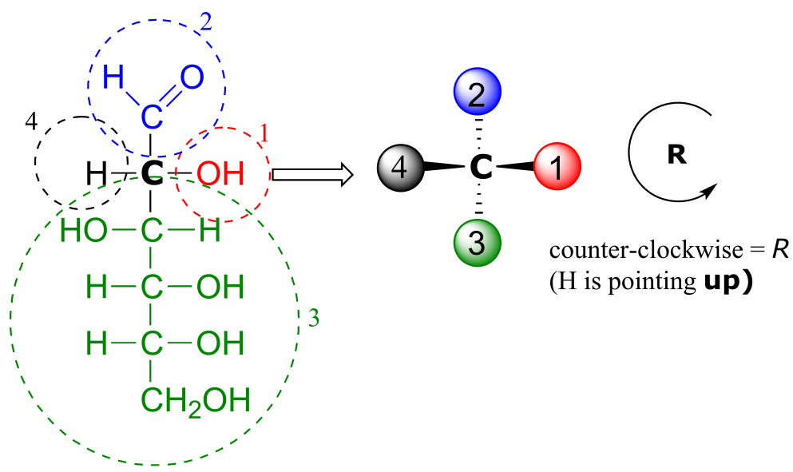

fig 69

Fischer projections are useful when looking at many different
diastereomeric sugar structures, because the eye can quickly pick out
stereochemical differences according to whether a hydroxyl group is on
the left or right side of the structure.

fig 70

[Video tutorial: Fischer
projections](https://www.youtube.com/watch?v=kPwWtdUkPxM)

<u>Exercise 3.24</u>: Draw 'zigzag' structures (using the solid/dash
wedge convention to show stereochemistry) for the four sugars in the
figure above. Label all stereocenters *R* or *S*. To make it easy to
check your answers, draw your structures using the framework below.

While Fischer projections are used for sugars in their open-chain form,
Haworth projections are often used to depict sugars in their cyclic
forms. The β diastereomer of the cyclic form of glucose is shown below
in three different depictions, with the Haworth projection in the
middle.

fig 71

Notice that although a Haworth projection is a convenient way to show
stereochemistry, it does not provide a realistic depiction of
conformation. To show *both* conformation and stereochemistry, you must
draw the ring in the chair form, as in structure C above.

## Section 3.9: Stereochemistry of alkenes

When we talk about stereochemistry, we are not always talking about
chiral compounds and chiral centers. Consider *cis*- and
*trans*-2-butene:

fig 57

Each can be superimposed on its own mirror image, and neither is chiral
(also, note the lack of a chiral center!) However, they both have the
same molecular formula and the same bonding connectivity, so by
definition they are stereoisomers of each other. Because they are not
mirror images, they must be diastereomers. An alkene group which can
exist in two stereoisomeric forms is referred to as **stereogenic**.

Alkene groups in natural unsaturated fatty acids are normally *cis*, but
*trans*-fatty acids (which are thought to be associated with heart
disease and other health problems) are found in some food products.

fig 58

Retinal is a light-sensitive molecule, derived from vitamin A, that is
found in the rod cells of the eye. When light enters the eye through the
retina, one form of retinal is converted to a diastereomer when a *cis*
double bond is converted to *trans* (we''ll learn how this happens in
chapter x). This changes the shape of the molecule and the way that it
binds to the vision protein rhodopsin, which in turn initiates a chain
of events that leads to a signal being sent to the vision center of the
brain.

fig 59

While the terms *cis* and *trans* are quite clear in the examples above,
in some cases they can be ambiguous, and a more rigorous stereochemical
designation is required. To unambiguously designate alkene
stereochemistry, it is best to use the designators '*E*' and 'Z' rather
than *trans* and *cis*. To use this naming system, we first decide which
is the higher priority group on each carbon of the double bond, using
the same priority rules that we learned for the *R/S* system. If the
higher-priority groups are one the same side of the double bond, it is a
*Z*-alkene, and if they are on the opposite side it is an *E*-alkene. A
memory device that many students find helpful is the phrase *'Z = zame
zide'*.

Shown below is an example of an *E*-alkene: notice that, although the
two methyl groups are on the same side relative to one another, the
alkene has *E* stereochemistry according to the rules of the *E/Z*
system because one of the methyl groups takes a higher priority
(relative to a hydrogen) and the other takes lower priority (relative to
a primary alcohol). The *cis/trans* terms would be ambiguous for this
compound.

fig 14

fig 60

Not all alkenes can be labeled *E* or *Z:* if one (or both) of the
double-bonded carbons has identical substituents, the alkene is not
stereogenic, and thus cannot be assigned an E or Z configuration.
Terminal alkenes, in which one of the alkene carbons is bonded to two
hydrogen atoms, are the most commonly seen type of nonstereogenic
alkene.

fig 60a

[Video tutorial: the E/Z naming for
alkenes](https://www.khanacademy.org/science/organic-chemistry/alkenes-alkynes/naming-alkenes-jay/v/e-z-system-new)

Natural rubber is a polymer composed of five-carbon isoprenoid building
blocks (see section 1.3A) linked with *Z* stereochemistry. The same
isoprenpoid building blocks can also be connected with *E*
stereochemistry, leading to a polymer that is a precursor to cholesterol
and many other natural isoprenoid compounds found in all forms of life.

fig 61

Alkenes located inside a five- or six-membered ring, such as in
cyclohexene, are not generally labeled *E* or *Z*, simply because the
closed geometry of the ring allows for only one stereochemical
possibility. (*E*)-cyclohexene is not physically possible, so it is not
necessary to include the (*Z*) designator for cyclohexene. Larger rings,
however, can hypothetically have *E* or *Z* alkene groups: two actual
examples are included in exercise 3.26 below.

As a general rule, alkenes with the bulkiest groups on opposite sides of
the double bond are more stable, due to reduced steric strain. The
*trans* (*E)* diastereomer of 2-butene, for example, is slightly lower
in energy than the *cis (Z)* diastereomer, as seen by their relative
heats of hydrogenation to butane (see section 2.2B for a reminder of the
meaning of 'heat of hydrogenation'.)

<u>Exercise 3.25:</u> Label the alkene groups below as *E*, *Z*, or *N*
(for a nonstereogenic alkene).

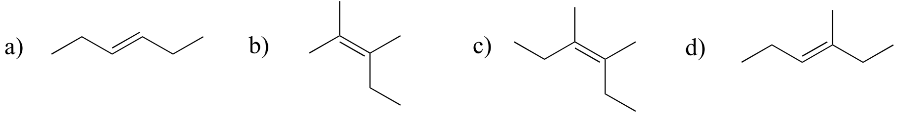

<u>Exercise 3.26</u>: The compounds shown below were all isolated from
natural sources and their structures reported in a 2007 issue of the
*Journal of Natural Products*, an American Chemical Society publication.
Label all alkene groups that are not inside 5- or 6-membered rings as
*E*, *Z*, or *N* (for a nonstereogenic alkene).

How do we know how many stereoisomers are possible for a given
structure? There is actually a straightforward way to figure this out.
All we need to do is count the number of chiral centers and stereogenic
alkene groups, the use this following rule:

number of stereoisomeric forms = 2*n*

. . . where *n* = the number of chiral centers ***plus*** the number of
stereogenic alkene groups

*(the rare exception to this rule is when a* meso *form is possible - in
this case, the rule becomes 2n-1)*

Consider for example a molecule with two chiral centers and one
stereogenic alkene. By the rule stated above, we know right away that
there must be eight possible stereoisomers. Drawing out all the
possibilities, we see:

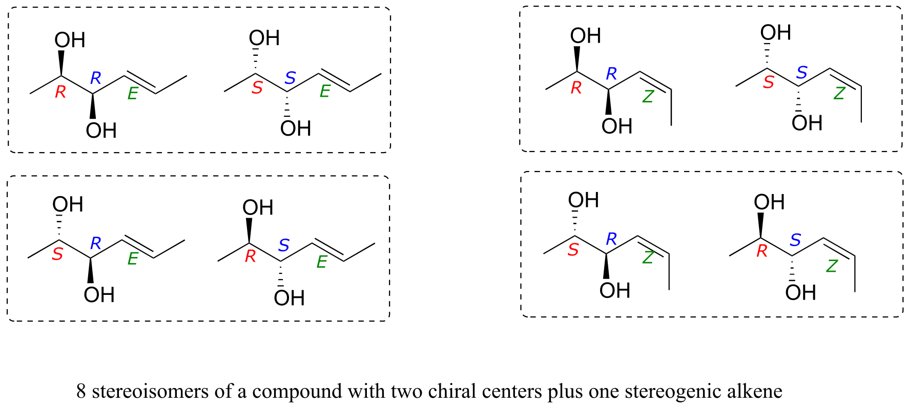

fig 61b

We see that, for example, *RRE* has one enantiomer, the *SSE* compound.
The six other stereoisomers are all diastereomers of *RRE*.

It needs to be stressed that the enantiomer of the *RRE* compound is the
*SSE* compound, ***not*** the *SSZ* compound. Remember, the *E/Z*
relationship is diastereomeric, not enantiomeric. Use models to convince
yourself that the *RRE* and the *SSE* isomers are mirror images of each
other, while *RRE* and *SSZ* compounds are not. In general, to get the
enantiomer of a compound, we invert all chiral centers *but leave all
stereogenic alkenes the same.*

<u>Exercise 3.27:</u> Draw the enantiomer of each the compounds below,
and assign configurations to all chiral centers and stereogenic alkenes.
How many diastereomers are possible for each of the structures you drew?

fig 61c

## Section 3.10: Stereochemistry in biology and medicine

While challenging to understand and visualize, the stereochemistry
concepts we have explored in this chapter are integral to the study of
living things. The vast majority of biological molecules contain chiral
centers and/or stereogenic alkene groups. Most importantly, proteins are
chiral, which of course includes all of the enzymes which catalyze the
chemical reactions of a cell, the receptors which transmit information
within or between cells, and the antibodies which bind specifically to
potentially harmful invaders. You know from your biology classes that
proteins, because they fold up into a specific three dimensional shape,
are able to very specifically recognize and bind to other organic
molecules. The ligand or substrate bound by a particular protein could
be a small organic molecule such as pyruvate all the way up to a large
biopolymer such as a specific region of DNA, RNA, or another protein.
Because they are chiral molecules, *proteins are very sensitive to the
stereochemistry of their ligands*: a protein may bind specifically to
(*R*)-glyceraldehyde, for example, but not bind to (*S*)-glyceraldehyde,
just as your right hand will not fit into a left-handed baseball glove.

The over-the-counter painkiller ibuprofen is currently sold as a racemic
mixture, but only the *S* enantiomer is effective, due to the specific
way it is able to bind to and inhibit the action of prostaglandin
H2 synthase, an enzyme in the body's inflammation response
process.

fig 62

The *R* enantiomer of ibuprofen does not bind to prostaglandin
H2 synthase in the same way as the *S* enantiomer, and as a
consequence does not exert the same inhibitory effect on the enzyme's
action (*Nature Chemical Biology* **2011**, *7*, 803). Fortunately,
(*R*)-ibuprofen apparently does not cause any harmful side effects, and
is in fact isomerized gradually by an enzyme in the body to
(*S*)-ibuprofen.

Earlier in this chapter we discussed the tragic case of thalidomide, and
mentioned that it appears that it is specifically the *S* enantiomer
which caused birth defects. Many different proposals have been made over
the past decades to try to explain the teratogenic (birth
defect-causing) effect of the drug, but a clear understanding still
evades the scientific community. In 2010, however, a [team in Japan
reported
evidence](http://news.sciencemag.org/2010/03/thalidomides-partner-crime)
that thalidomide binds specifically to a protein called 'thereblon'.
Furthermore, when production of thereblon is blocked in female zebra
fish, developmental defects occur in her offspring which are very
similar to the defects caused by the administration of thalidomide,
pointing to the likelihood that thalidomide binding somehow inactivates
the protein, thus initiating the teratogenic effect.

You can, with a quick trip to the grocery store, directly experience the
biological importance of stereoisomerism. Carvone is a chiral,
plant-derived molecule that contributes to the smell of spearmint in the
*R* form and caraway (a spice) in the *S* form.

fig 63

Although details are not known, the two enantiomers presumably interact
differently with one or more smell receptor proteins in your nose,
generating the transmission of different chemical signals to the
olfactory center of your brain.

<u>Exercise 3.28</u>: Ephedrine, found in the Chinese traditional
medicine *ma huang*, is a stimulant and appetite suppressant. Both
pseudoephedrine and levomethamphetamine are active ingredients in
over-the-counter nasal decongestants. Methamphetamine is a highly
addictive and illegal stimulant, and is usually prepared in illicit
'meth labs' using pseudoephedrine as a starting point.

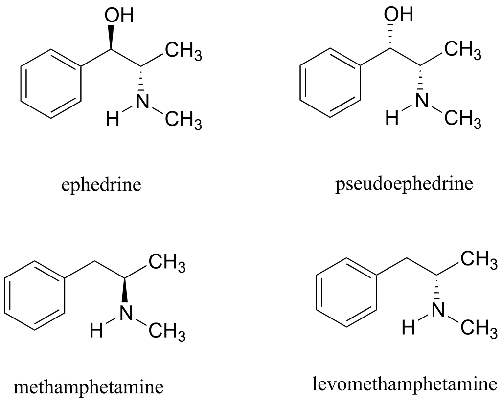

What is the relationship between ephedrine and pseudoephedrine? Between
methamphetamine and levomethamphetamine? Between pseudoephedrine and
methamphetamine? Your choices are: not isomers, constitutional isomers,
diastereomers, enantiomers, or same molecule.

Enzymes are very specific with regard to the stereochemistry of the
reactions they catalyze. *When the product of a biochemical reaction
contains a chiral center or a stereogenic alkene, with very few
exceptions only one stereoisomer of the product is formed*. In the
glycolysis pathway, for example, the enzyme triose-phosphate isomerase
catalyzes the reversible interconversion between dihydroxyacetone (which
is achiral) and (*R*)-glyceraldehyde phosphate. The (*S*)-glyceraldehyde
enantiomer is not formed by this enzyme in the left-to-right reaction,
and is not used as a starting compound in the right-to-left reaction -
it does not 'fit' in the active site of the enzyme.

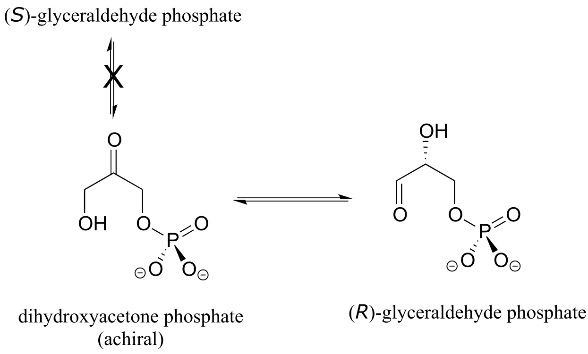

fig 64

In the isoprenoid biosynthesis pathway, two five-carbon building-block
molecules combine to form a ten-carbon chain containing an *E*-alkene
group. The enzyme does *not* catalyze formation of the *Z* diastereomer.

fig 65

In chapters 9-17 of this book, and continuing on into your study of
biological and organic chemistry, you will be learning about how enzymes
are able to achieve these feats of stereochemical specificity. If you
take a more advanced class in organic synthesis, you will also learn how
laboratory chemists are figuring out ingenious ways to exert control
over the stereochemical outcomes of nonenzymatic reactions, an area of
chemistry that is particularly important in the pharmaceutical industry.

##  Section 3.11: Prochirality

### 3.11A: <u>P</u>rochiral carbons 

When a tetrahedral carbon can be converted to a chiral center by
changing only one of the attached groups, it is referred to as a
‘**prochiral'** carbon. The two hydrogens on the prochiral carbon can be
described as 'prochiral hydrogens'.

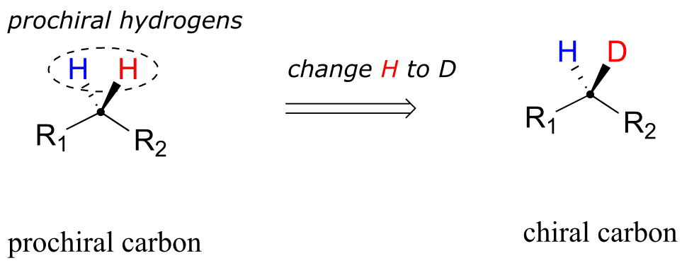

fig 72

Note that if, in a 'thought experiment', we were to change either one of
the prochiral hydrogens on a prochiral carbon center to a deuterium (the
2H isotope of hydrogen), the carbon would now have four
different substituents and thus would be a chiral center.

Prochirality is an important concept in biological chemistry, because
enzymes can distinguish between the two ‘identical’ groups bound to a
prochiral carbon center due to the fact that *they occupy different
regions in three-dimensional space*. Consider the isomerization reaction
below, which is part of the biosynthesis of isoprenoid compounds. We do
not need to understand the reaction itself (it will be covered in
chapter 14); all we need to recognize at this point is that the
isomerase enzyme is able to distinguish between the prochiral 'red' and
the 'blue' hydrogens on the isopentenyl diphosphate (IPP) substrate. In
the course of the left to right reaction, IPP specifically loses the
'red' hydrogen and keeps the 'blue' one.

fig 73

Prochiral hydrogens can be unambiguously designated using a variation on
the *R/S* system for labeling chiral centers. For the sake of clarity,
we'll look at a very simple molecule, ethanol, to explain this system.
To name the 'red' and 'blue' prochiral hydrogens on ethanol, we need to
engage in a thought experiment. If we, in our imagination, were to
arbitrarily change red H to a deuterium, the molecule would now be
chiral and the chiral carbon would have the *R* configuration (D has a
higher priority than H).

fig 74

For this reason, we can refer to the red H as the *pro-R* hydrogen of
ethanol, and label it H*R*. Conversely, if we change the blue
H to D and leave red H as a hydrogen, the configuration of the molecule
would be *S*, so we can refer to blue H as the *pro-S* hydrogen of
ethanol, and label it H*S*.

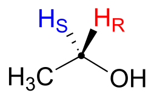

fig 75

Looking back at our isoprenoid biosynthesis example, we see that it is
specifically the *pro-R* hydrogen that the isopentenyl diphosphate
substrate loses in the reaction.

fig 76

Prochiral hydrogens can be designated either enantiotopic or
diastereotopic. If either HR or HS on ethanol were
replaced by a deuterium, the two resulting isomers would be enantiomers
(because there are no other stereocenters anywhere on the molecule)

fig 77

Thus, these two hydrogens are referred to as **enantiotopic**.

In (*R*)-glyceraldehyde-3-phosphate ((*R*)-GAP), however, we see
something different:

fig 78

(*R*)-GAP already has one chiral center. If either of the prochiral
hydrogens HR or HS is replaced by a deuterium, a
second chiral center is created, and the two resulting molecules will be
diastereomers (one is *S,R,* one is *R,R*). Thus, in this molecule,
HR and HS are referred to as diastereotopic
hydrogens.

Finally, hydrogens that can be designated neither enantiotopic nor
diastereotopic are called **homotopic**. If a homotopic hydrogen is
replaced by deuterium, a chiral center is *not* created. The three
hydrogen atoms on the methyl (CH3) group of ethanol (and on
*any* methyl group) are homotopic.

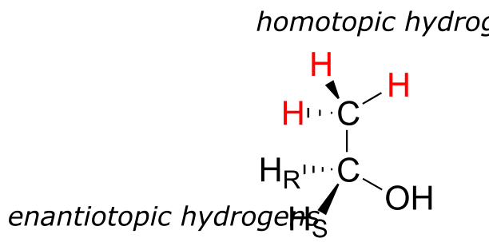

fig 79

An enzyme cannot distinguish among homotopic hydrogens.

<u>Exercise 3.29</u>: Identify in the molecules below all pairs/groups
of hydrogens that are homotopic, enantiotopic, or diastereotopic. When
appropriate, label prochiral hydrogens as H*R* or
H*S*.

fig 79a

Groups other than hydrogens can be considered prochiral. The alcohol
below has two prochiral methyl groups - the red one is *pro-R*, the blue
is *pro-S*. How do we make these designations? Simple - just arbitrarily
assign the red methyl a higher priority than the blue, and the compound
now has the *R* configuration - therefore red methyl is *pro-R*.

fig 80

Citrate is another example. The central carbon is a prochiral center
with two 'arms' that are identical except that one can be designated
*pro-R* and the other *pro-S*.

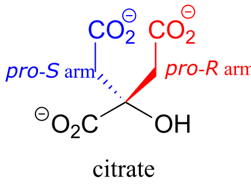

fig 81

In an isomerization reaction of the citric acid (Krebs) cycle, a
hydroxide is shifted specifically to the *pro-R* arm of citrate to form
isocitrate: again, the enzyme catalyzing the reaction distinguishes
between the two prochiral arms of the substrate (we will study this
reaction in chapter 13).

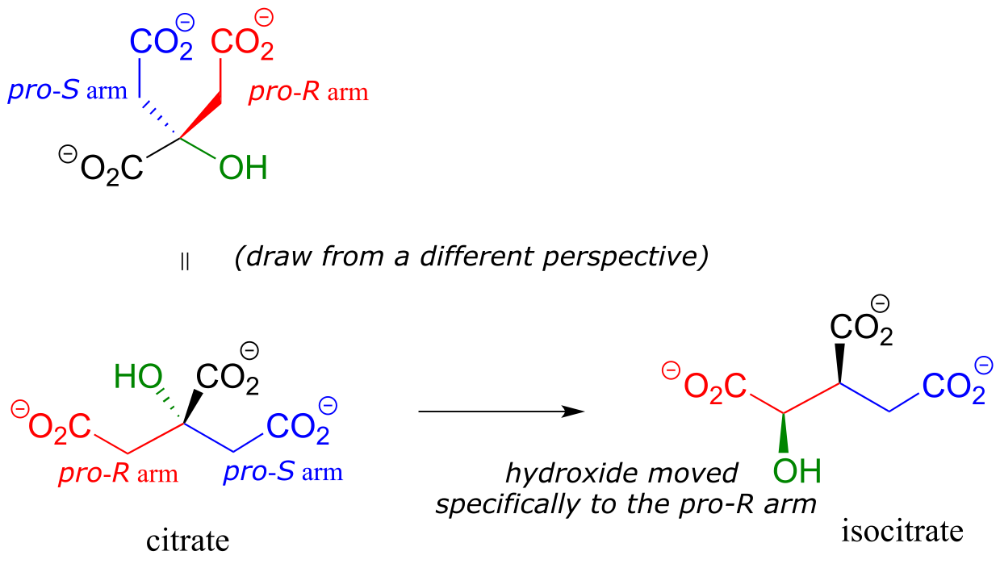

fig 82

<u>Exercise 3.30</u>: Assign *pro-R* and *pro-S* designations to all
prochiral groups in the amino acid leucine. (*Hint*: there are two pairs
of prochiral groups!). Are these prochiral groups diastereotopic or
enantiotopic?

>  style="width:0.91667in;height:1.13889in" />

fig 82a

Although an alkene carbon bonded to two identical groups is *not*
considered a prochiral center, these two groups *can* be diastereotopic.
Ha and Hb on the alkene below, for example, are
diastereotopic: if we change one, and then the other, of these hydrogens
to deuterium, the resulting compounds are *E* and *Z* diastereomers.

fig 83

### 3.11B: Prochiral carbonyl and imine groups

Trigonal planar, sp2-hybridized carbons are not, as we well
know, chiral centers– but they can be prochiral centers if they are
bonded to three different substitutuents. We (and the enzymes that
catalyze reactions for which they are substrates) can distinguish
between the two planar ‘faces’ of a prochiral sp2 -
hybridized group. These faces are designated by the terms ***re*** and
***si***. To determine which is the *re* and which is the *si* face of a
planar organic group, we simply use the same priority rankings that we
are familiar with from the R/S system, and trace a circle: *re* is
clockwise and *si* is counterclockwise.

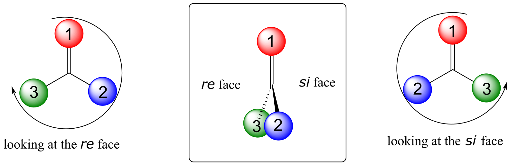

fig 84

Below, for example, we are looking down on the *re* face of the ketone
group in pyruvate:

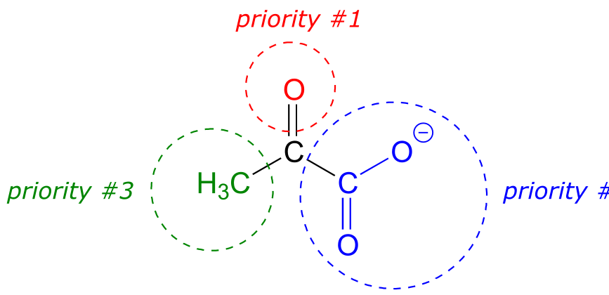

fig 85

If we flipped the molecule over, we would be looking at the *si* face of
the ketone group. Note that the carboxylate group does not have *re* and
*si* faces, because two of the three substituents on that carbon are
identical (when the two resonance forms of carboxylate are taken into
account).

As we will see in chapter 10, enzymes which catalyze reactions at
carbonyl carbons act specifically from one side or the other.

fig 86

We need not worry about understanding the details of the reaction
pictured above at this point, other than to notice the stereochemistry
involved. The *pro-R* hydrogen (along with the two electrons in the C-H
bond) is transferred to the *si* face of the ketone (in green), forming,
in this particular example, an alcohol with the *R* configuration. If
the transfer had taken place at the *re* face of the ketone, the result
would have been an alcohol with the *S* configuration.

The *re* and *si* designations can also be applied to planar,
sp2-hybridized carbons in alkene groups. Keep in mind that a
carbon-carbon double bond has a higher priority than a carbon-carbon
single bond, but a *lower* priority than a carbon-oxygen bond.

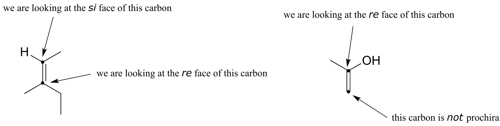

<u>Exercise 3.31</u>: Assign a designation of *re*, *si*, or *N* (not
prochiral) to indicate which face we are looking down on for each of the
sp2-hybridized carbons in the structure below.

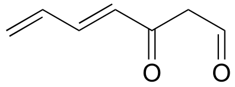

fig 86a

## Summary of Key Concepts

*Before you move on to the next chapter, you should be confortable with
the following concepts:*

<u>Conformations of open-chain compounds</u>:

Be able to distinguish between **eclipsed, staggered, gauche, and anti
conformations**, and the rational for trends in stability.

Be able to draw and interpret **Newman projections**.

<u>Conformations of cyclic compounds:</u>

Understand the concept of **angle strain** in 3- and 4-membered rings.

Be able to draw the **envelope conformation** of five-membered rings

Be able to draw the **chair and boat conformations** of six-membered
rings.

In the chair conformation, be able to draw **equatorial** and **axial**
substituents. Understand that large groups in the axial position
experience considerable 1**,3-diaxial repulsion**, and thus are more
stable in the equatorial position.

<u>Stereochemistry</u>:

Hierarchy of isomeric relationships:

You should understand the relevant terms and concepts:

A **chiral** object or molecule is cannot be superimposed on its mirror
image.

A **chiral center** is an sp3-hybridized (tetrahedral) carbon
bonded to four different groups. A chiral center can be labeled *R* or
*S*.

A **stereogenic alkene** is an alkene is one in which both sides of the
alkene are asymmetric, and which can therefore be labeled *E* or *Z*.

**Stereoisomers** have the same molecular formula and same connectivity,
but a different orientation of atoms in space.

> **Enantiomers** are stereoisomers which are mirror images.
>
> In practice, the enantiomer of a compound is the one in which
> ***all*** chiral centers are in the opposite configuration.
>
> Every chiral molecule has one and only one enantiomer.
>
> Achiral molecules are superimposable on their mirror image, and thus
> cannot have an enantiomer.
>
> Enantiomers have equal but opposite specific rotations, but identical
> physical properties otherwise.
>
> **Diastereomers** are stereoisomers which are *not* mirror images.
> They have different physical properties.
>
> In practice, a diastereomer of a chiral molecule with have ***at least
> one, but not all*** chiral centers in the opposite configuration.
>
> Alternatively, two diastereomers may contain a stereogenic alkene with
> the opposite *E/Z* configuration.
>
> A molecule has 2n-2 diastereomers, where *n* is the number
> of chiral centers plus stereogenic alkene groups. *Meso* compounds are
> an exception to this rule.

**Epimers** are diastereomers which differ at only one chiral center.

A **racemic mixture** is a 50:50 mixture of two enantiomers.

> A ***meso* compound** has multiple chiral centers but, because it has
> a plane of symmetry, is achiral.

You should know how to assign **R/S and E/Z configuration** to chiral
centers and stereogenic alkenes, respectively.

You should understand the concept of **optical rotation** and the
definition of **specific rotation.**

You should recognize that in general, a protein can distinguish between
its natural ligand and a stereoisomer of that ligand.

You should also recognize that enzymes are highly specific with respect
to stereochemistry, catalyzing the formation of only one stereoisomer of
their products.

You should be able to recognize and label *pro-R* and *pro-S* groups on
prochiral tetrahetral carbons.

You should be able to recognize *re* and *si* faces of carbonyl and
imine groups

## Problems

**P3.1:** Draw an energy vs dihedral angle graph for rotations about the
C2-C3 bond of 2-methylbutane. Start with the
highest-energy conformation as the 0o point. For each energy
peak and valley, draw a corresponding Newman projection.

**P3.2**:

a\) Which has the highest energy diaxial chair conformation:
*trans*-1,2-dimethylcyclohexane, *cis*-1,3-dimethylcyclohexane, or
*trans*-1,4-dimethylcyclohexane? Explain.

b\) Which of the following are *trans* disubstituted cyclohexanes?

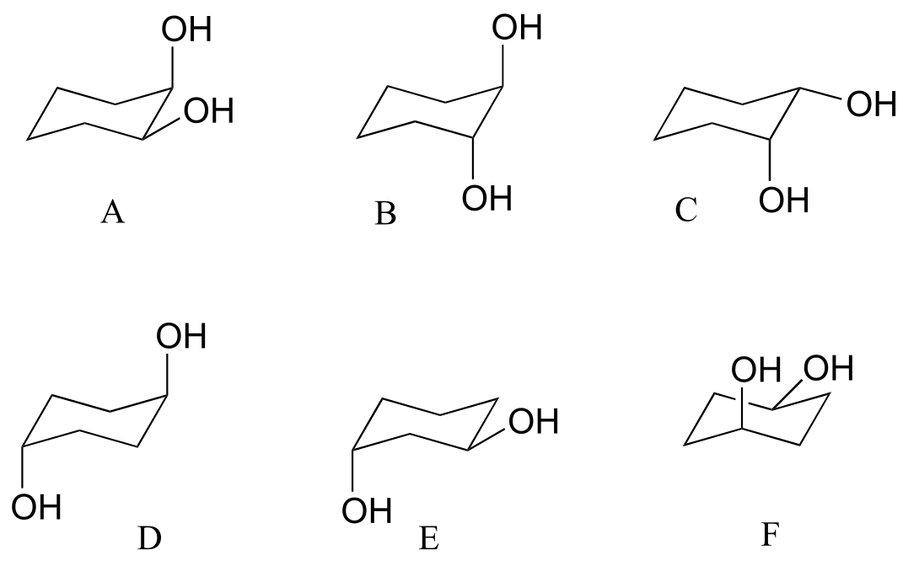

c\) Draw A-F above in two dimensions (rings in the plane of the page,
substituents drawn as solid or dashed wedges).

d\) Structure D does not have any chiral centers. Explain.

e\) Draw a diastereomer of structure D (in two dimensions, as in part
c).

f\) Are structure D and its diastereomer chiral?

g\) Assign R/S designations to the two chiral centers in structure B
(hint: making a model will be *very* helpful!)

**P 3.3**: The following are structures, drawn in two dimensions, of
drugs listed on the products web page of Merck Pharmaceutical. One of
the compounds is achiral.

a\) Circle all chiral centers. (Hint: *Don't panic*! Remember - you are
looking for *sp3*-hybridized carbons with four different
substituents.)

b\) How many diastereomers are possible for desogestrel?

c\) Draw two epimeric forms of simvastatin

**P3.4:** Three of the four structures below are chiral. Assign R/S
designations to all chiral centers, and identify the achiral molecule.

**P3.5:** Draw the *R,R* stereoisomers of the structures below.

**P3.6**: Below are the structures of sucralose, the artificial
sweetener with the brand name Splenda (TM), and the cancer drug
Paclitaxel. Give an *R* or *S* designation to chiral centers indicated
with an arrow.

**P3.7**: The four drugs below were featured in a *Chemical &
Engineering News* article (April 16, 2007, p. 42) on new drugs that had
been developed in university labs.

a\) Identify each as chiral or achiral, and identify all chiral centers
(in most cases, specific stereochemistry is not shown in the structures
below). Also, state how many possible stereoisomers exist for each
structure.

b\) Visualization challenge: two fluorinated derivatives of Epivir were
also mentioned in the article. The structures are below, drawn in what
is referred to as a 'Haworth projection'. What is the relationship
between them? (Your choices: not isomers, constitutional isomers,
diastereomers but not epimers, epimers, enantiomers, identical)

**  
P3.8**: Redraw the following structures in the flat ring, solid/dash
wedge convention (the drawings have been started for you).

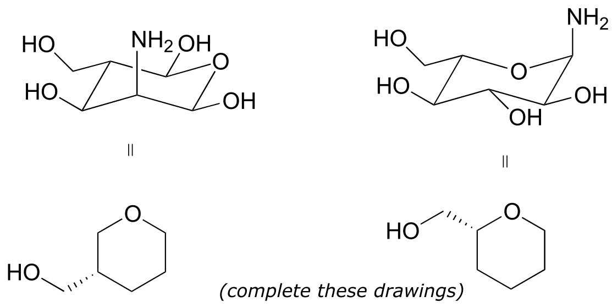

**P3.9**: Below is an experimental drug for Alzheimer's disease that was
mentioned in the March 13, 2007 issue of *Chemical and Engineering
News*.

a\) Label the chiral center(s) *R* or *S.*

b\) Draw the enantiomer of the molecule shown.

**P3.10**: The molecules below are potential new drugs for the treatment
of Duchenne muscular dystrophy (molecule A) and skin cancer (molecule B)
(*Chemical and Engineering News* Sept 26, 2005, p. 39). Given the *R/S*
designations, redraw the structure showing the correct stereochemistry.

**P3.11**: Draw the structure of the following molecules:

a\) (*R*)-3-methyl-3-hexanol

b\) (*R*)-1-chloro-1-phenylethane

c\) (2*R*, 3*R*)-2,3-dihydroxybutanedioic acid (tartaric acid)

d\) (*S*)-(*E*)-4-chloro-3-ethyl-2-pentenoic acid

e\) (1*S*, 3*R*)-1-chloro-3-ethylcyclohexane

**P3.12**: Coelichelin (the structure below to the left) is a natural
product from soil bacteria that was identified using a technique known
as 'genome mining' (*Chemical and Engineering News* Sept. 19, 2005, p.
11). What is the relationship between coelichelin and the compound shown
to the right? (Note: the two structures are drawn with the same
conformation of the carbon backbone - just trace them through from end
to end and identify where they are different!)

**P3.13**: Identify the relationships between the following pairs of
structures (Not isomers, constitutional isomers, diastereomers but *not*
epimers, epimers, enantiomers, identical)

**P3.14**: Identify the relationships between each of the following
pairs of pentose sugars (not isomers, constitutional isomers,
diastereomers but *not* epimers, epimers, enantiomers, identical).

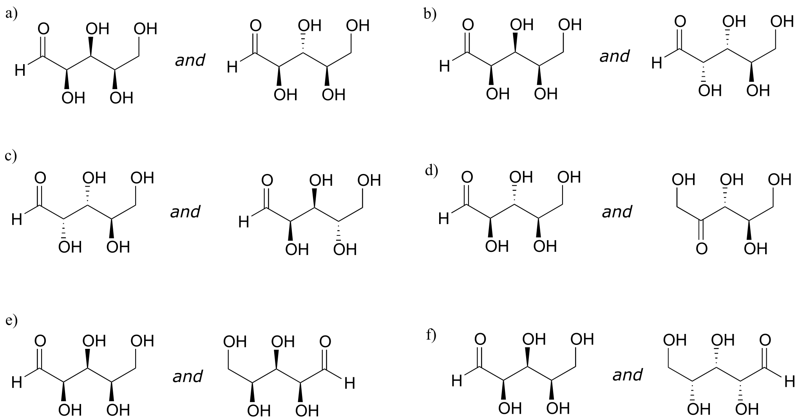

**P3.15**: Identify the relationships between each of the following
pairs of hexose sugars (not isomers, constitutional isomers,
diastereomers but *not* epimers, epimers, enantiomers, identical).

**P3.16**: The compound drawn below (not showing stereochemistry) has
been identified as a potential anti-inflammatory agent by scientists at
Schering-Plough a pharmaceutical company (see *Chemical and Engineering
News* Nov. 28, 2005 p. 29). How many stereoisomers are possible for the
compound?

**P3.17**: Secramine is a synthetic compound that has been shown to
interfere with the transport of newly synthesized proteins in the cell
(see *Chemical and Engineering News* Nov. 28, 2005, p. 27). Also drawn
below is a (hypothetical) isomer of secramine.

a\) Identify the relationship between the two isomers: are they
consitutional isomers, confomational isomers, enantiomers, or
diastereomers?

b\) Locate a five-membered ring in the secramine structure.

**P3.18**: The natural product bistramide A has been shown to bind to
actin, an important structural protein in the cell, and suppress cell
proliferation (see *Chemical and Engineering News* Nov. 21, 2005, p.
10).

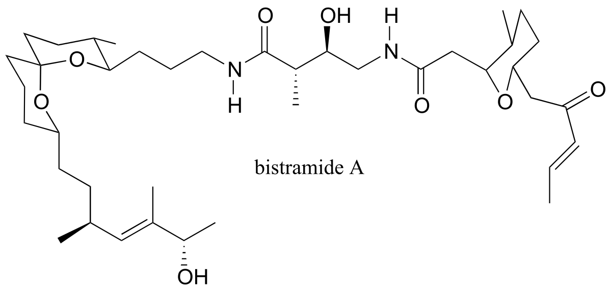

a\) Label the alkene functional groups as *E*, *Z*, or *N* (no *E/Z*
designation possible)

b\) Theoretically, how many diastereomers are possible for bistramide A?

**P3.19**:

a\) Draw Newman projections of the *gauche* and the *anti* conformations
of 1,2-ethanediol.

b\) Why might the *gauche* conformation be expected to be the more
stable of the two?

c\) Do you think that *gauche* is also the most stable conformation of
1,2-dimethoxyethane? Explain.

**P3.20**: Draw the chair conformation of *cis*-1,2-dimethylcyclohexane.

a\) Label the stereochemical configuration at C1 and
C2 for the structure you drew.

b\) Build a model of your molecule, and try out different possible boat
conformations. Can you find one in which there is a plane of symmetry?

c\) Is *cis*-1,2-dimethylcyclohexane a chiral molecule?

d\) is *cis* -1,4-dimethylcyclohexane chiral? How about
*trans*-1,4-dimethylcyclohexane? How about
*trans*-1-chloro-4-fluorocyclohexane?

**P3.21**: In some special cases, a 'chiral center' can be composed of
several atoms instead of just one, and molecules which contain such
multi-atom chiral centers are indeed chiral. What is the relationship
between the two two difluorallene compounds below? It will be very
helpful to make models, and review the fundamental definitions in this
chapter.

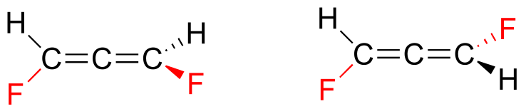

