# 5: Structure determination, part II: Nuclear magnetic resonance spectroscopy

revise: add

(credit: https://www.flickr.com/photos/reighleblanc/)

One morning in a suburb of Edinburgh, Scotland, an active, athletic
teenager named Charli found that she did not have her usual appetite for
breakfast. She figured she was just feeling a little under the weather,
and was not to worried. But as the days passed, her appetite did not
return. Before long, she stopped eating lunch as well, and eventually
she was hardly eating anything at all. She had to withdraw from her
soccer team because she didn't have enough energy to make it through the
practices. When her weight began to drop alarmingly and she began to
suffer from crippling headaches, her parents took her to her doctor, who
diagnosed a glandular disorder.

To make things worse, Charli started getting teased at her school,
enduring constant comments from other kids about her weight loss and
gossip about an eating disorder. Almost two years went by, filled with
doctors visits and various diagnoses and treatments, none of which were
effective.

Finally, on a September day when Charli was fifteen, things came to a
head. She was rushed to the hospital after suffering a massive stroke.
Once she was stabilized, her doctors ordered an MRI scan of her brain.
The images showed that she had a large tumor in her brain – it was
benign, but its sheer size and the pressure it exerted had been enough
to cause the devastating symptoms that Charli had been suffering for the
past year and a half. Her doctors told her that if the tumor had not
been detected, it could eventually have been fatal. After enduring an
8-hour brain surgery, Charli finally was able to start down her road to
recovery. Speaking later to a journalist, Charli said of her stroke, “it
was the best thing that ever happened to me”.

\*\*\*

In Austin, Texas, a 28 year-old man named Alex was fed up with the back
pain he had been suffering, the result, he assumed, of the damage from
some old sports injuries catching up to him. His friend John, who was a
radiological technician, convinced him to come in for an MRI scan on the
chance that doctors might be able to spot something that could lead to a
treatment. Alex agreed, and took a day off work to come in to his
friend's clinic. With John at the controls, Alex tried to relax as he
was slowly rolled into the claustrophobic MRI chamber. After finishing
the scan of his friend's back and saving the images, John decided to ask
a little favor. He had just installed some new software for head scans
and needed to test it out on an actual subject, so he asked Alex if he
would mind lying still for just a few minutes more so that he could take
a test scan of his head. Unlike x-rays and CAT scans, the MRI procedure
does not subject patients to potentially harmful radiation - just strong
but harmless magnetic fields combined with radio waves – so there was no
risk to undergoing an unnecessary scan. Alex agreed, and John proceeded
with the test scan.

When the first image appeared, John was alarmed by what he saw. The new
software was working just fine, but there was an ominous-looking lump
behind Alex's right eye that should not have been there. Not wanted to
scare his friend unduly, he merely mentioned that he thought he might
have seen something that should be checked out by a neurologist. Alex
was feeling fine other than the back pain – no headaches, blurred
vision, or dizziness, so it was probably nothing at all to worry about.

It turned out that Alex had a golf ball-sized brain tumor. His
neurologist told him that because it happened to be located in an area
of the brain that was not responsible for any critical functions, he was
not yet experiencing any symptoms. But if the tumor had remained
undetected for a few more years, it would have continued to grow and
begun to press on other areas of Alex's brain - and at that point, it
probably would have been very difficult to remove safely.

Alex underwent a successful surgery to remove the tumor and was able to
go on with his life, thanks to having an observant friend in the right
place at the right time, with access to a powerful diagnostic
technology.

\*\*\*

The common denominator in these two stories – and in countless others
from around the world – is the power of MRI to detect hidden but deadly
medical problems, without causing any harm or pain to the patient. In
this chapter, we are going to learn about an analytical tool used by
organic chemists called nuclear magnetic resonance (NMR) spectroscopy,
which works by the same principles as an MRI scanner in a hospital.
While doctors use MRI peer inside the human body, we will see how NMR
allows chemists to piece together, atom by atom and bond by bond, the
structure of an organic molecule.

## Section 5.1: The source of the NMR signal

### 5.1A: The magnetic moment

Nuclear magnetic resonance spectroscopy is an incredibly powerful tool
for organic chemists because it allows us to analyze the connectivity of
carbon and hydrogen atoms in molecules. The basis for NMR is the
observation that many atomic nuclei generate their own magnetic field,
or **magnetic moment**, as they spin about their axes. Not all nuclei
have a magnetic moment. Fortunately for organic chemists, though,
hydrogen (1H), the 13C isotope of carbon, the
19F isotope of fluorine, and the 31P isotope of
phosphorus all have magnetic moments and therefore can be observed by
NMR – they are, in other words, NMR-active. Other nuclei - such as the
common 12C and 16O isotopes of carbon and oxygen -
do not have magnetic moments, and cannot be directly observed by NMR.
Still other nuclei such as the hydrogen isotope deuterium
(2H) and nitrogen (14N) have magnetic moments and
are NMR-active, but the nature of their magnetic moments is such that
analysis of these nuclei by NMR is more complex.

In practice it is 1H and 13C nuclei that are most
commonly observed by NMR spectroscopy, and it is on those techniques
that we will focus in this chapter, beginning with 1H-NMR.
The terms ‘proton’ and ‘hydrogen’ are used interchangeably when
discussing because the 1H nucleus is just a single proton.

**Some examples of magnetic and nonmagnetic nuclei relevant**

**to biological organic chemistry**

| **Magnetic nuclei** | **Nonmagnetic nuclei** |
|---------------------|------------------------|
| 1H       | 12C         |
| 2H       | 16O         |
| 13C      | 32S         |
| 14N      |                        |
| 19F      |                        |
| 31P      |                        |

### 5.1B: Spin states and the magnetic transition

When a sample of an organic compound is sitting in a flask on a
laboratory bench, the magnetic moments of all of its protons are
randomly oriented. However, when the same sample is placed within the
field of a very strong superconducting magnet (this field is referred to
by NMR spectroscopists as the **applied field**, abbreviated
**B0** ) each proton will assume one of two possible
**quantum** **spin states**. In the +½ spin state, the proton's magnetic
moment is aligned *with* the direction of B0, while in the -½
spin state it is aligned *opposed to* the direction of B0.

fig 1

The +½ spin state is slightly lower in energy than the -½ state, and the
energy gap between them, which we will call ∆E, depends upon the
strength of B0: a stronger applied field results in a larger
∆E. For a large population of organic molecules in an applied field,
slightly *more* than half of the protons will occupy the lower energy +½
spin state, while slightly *less* than half will occupy the higher
energy -½ spin state. It is this population difference (between the two
spin states) that is exploited by NMR, and the difference increases with
the strength of the applied magnetic field.

At this point, we need to look a little more closely at how a proton
spins in an applied magnetic field. You may recall playing with spinning
tops as a child. When a top slows down a little and the spin axis is no
longer completely vertical, it begins to exhibit **precessional
motion**, as the spin axis rotates slowly around the vertical. In the
same way, hydrogen atoms spinning in an applied magnetic field also
exhibit precessional motion about a vertical axis. It is this axis
(which is either parallel or antiparallel to B0) that defines
the proton’s magnetic moment.

Watch the first minute or so of this [video of spinning
tops](https://www.youtube.com/watch?v=uf-UFu-lACY):

look for the precessional motion

The **frequency of precession** (also called the **Larmour frequency,**
abbreviated νL) is simply the number of times per second that
the proton precesses in a complete circle. A　proton\`s precessional
frequency increases with the strength of B0.

If a proton that is precessing in an applied magnetic field is exposed
to electromagnetic radiation of a frequency ν that matches its
precessional frequency νL, we have a condition called
**resonance**. *In the resonance condition, a proton in the lower-energy
+½ spin state (aligned with B0) will transition (flip) to the
higher energy –½ spin state (opposed to B0). In doing so, it
will absorb radiation at this resonance frequency ν* - *and this
frequency corresponds to ∆E, the energy difference between the proton’s
two spin states*. With the strong magnetic fields generated by the
superconducting magnets used in modern NMR instruments, the resonance
frequency for protons falls within the radio-wave range, anywhere from
100 MHz to 800 MHz depending on the strength of the magnet.

fig 2

Think back for a moment to the other two spectroscopic techniques we
have learned about: IR and UV-Vis spectroscopy. Recall from section 4.2
that photons of electromagnetic radiation of a given frequency
correspond to energy (E) given by E = *h*ν, where *h* is Plank's
constant and ν is the frequency in waves per second, or Hz. Recall also
from section 4.3 that the energy gap between *vibrational* states
corresponds to the energy associated with infrared radiation, and from
section 4.4 that the energy gap between *electronic* states in
conjugated π-bonding systems corresponds to the energy associated with
light in the ultraviolet and visible regions of the electromagnetic
spectrum. Now, we know that in NMR, the energy gap ∆E between the +½ and
-½ *spin* states of an atomic nucleus in a strong magnetic field
corresponds to the energy associated with radiation in the radio
frequency (Rf) region of the spectrum.

By detecting the frequency of Rf radiation that is absorbed, we can gain
information about the chemical environment of protons in an organic
molecule.

<u>Exercise 5.1</u>: In a general sense, how big is the energy gap for
the nuclear spin transition observed in NMR compared to the energy gap
for the vibrational transition observed in IR spectroscopy? Much bigger?
Much smaller? Slightly bigger or smaller? About the same? How can you
tell from the information presented in this section?

## Section 5.2: Chemical equivalence

The frequency of radiation absorbed by a proton (or any other nucleus)
during a spin transition in an NMR experiment is called its '**resonance
frequency**'. If all protons in all organic molecules had the same
resonance frequency, NMR spectroscopy but would not be terribly useful
for chemists. Fortunately for us, however, resonance frequencies are not
uniform for different protons in a molecule - rather, the resonance
frequency varies according to the electronic environment that a given
proton inhabits. In methyl acetate, for example, there are two distinct
‘sets’ of protons.

fig 3

The three methyl acetate protons labeled Ha above have a
different resonance frequency compared to the three Hb
protons, because the two sets of protons are in non-identical electronic
environments: the Ha protons are on a carbon next to a
carbonyl carbon, while the Hb protons or on a carbon next to
the an oxygen. In the terminology of NMR, all three Ha
protons are **chemically equivalent** to each other, as are all three
Hb protons. The Ha protons are, however,
**chemically nonequivalent** to the Hb protons. As a
consequence, the resonance frequency of the Ha protons is
different from that of the Hb protons. For now, do not worry
about *why* the different electronic environment gives rise to different
resonance frequencies - we will get to that soon.

The ability to recognize chemical equivalancy and nonequivalency among
atoms in a molecule will be central to understanding NMR. Each of the
molecules below contains only one set of chemically equivalent protons:
all six protons on benzene, for example, are equivalent to each other
and have the same resonance frequency in an NMR experiment. Notice that
any description of the bonding and position of one proton in benzene
applies to all five other protons as well.

fig 4

Each of the molecules in the next figure contains *two* sets of
chemically equivalent protons, just like our previous example of methyl
acetate, and again in each case the resonance frequency of the
Ha protons will be different from that of the Hb
protons.

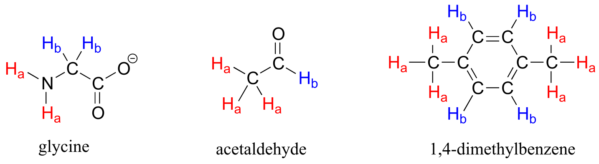

fig 5

Take acetaldehyde as an example: a description of the bonding and
position of the Hb proton does *not* apply to the three
Ha protons: Hb is bonded to an
*sp2-*hybridized carbonyl carbon while the Ha
protons are bonded to an *sp3*-hybridized methyl carbon.

Note that while all four aromatic protons in 1,4-dimethylbenzene are
chemically equivalent, its constitutional isomer 1,2 dimethylbenzene has
*two* sets of aromatic protons in addition to the six methyl
(Ha) protons. The 1,3-substituted isomer, on the other hand,
has *three* sets of aromatic protons.

fig 5b

In 1,2-dimethylbenzene, both Hb protons are adjacent to a
methyl substituent, while both Hc protons are two carbons
away. In 1,3-dimethylbenzene, Hb is situated between two
methyl groups, the two Hc protons are one carbon away from a
methyl group, and Hd is two carbons away from a methyl group.

As you have probably already realized, chemical equivalence or
non-equivalence in NMR is closely related to *symmetry*. Different
planes of symmetry in the three isomers of dimethylbenzene lead to
different patterns of equivalence.

Stereochemistry can play a part in determining equivalence or
nonequivalence of nuclei in NMR. In the chloroethene (commonly known as
vinyl chloride, the compound used to make polyvinyl chloride or PVC),
Ha and Hb are in nonequivalent electronic
environments, because Ha is *cis* to the chlorine atom while
Hb is *trans*. Likewise, Ha and Hb in
chlorocyclopropane are nonequivalent due to their positions either on
the same or opposite side of the ring relative to chlorine.

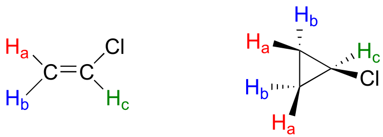

fig 5a

**<u>Note</u>**: If you think back to our discussion of prochirality in
section 3.11, you should recognize that the Ha and
Hb protons in the examples above are diastereotopic pairs. In
fact, *all* diastereotopic protons are technically non-equivalent in
terms of their chemical shift in an NMR experiment. For example, the
*pro-R* and *pro-S* protons in (R)-2-butanol (below) are diastereotopic,
and for reasons that are beyond the scope of our discussion here, it
turns out that they are in slightly different electronic environments,
and thus have slightly different chemical shifts - they are chemically
*non*-equivalent.

However, in actual practice, the difference in chemical shift between
two diastereotopic protons such as these - bonded to the same
sp3-hybridized carbon and *not* part of a ring - is usually
so small that they *appear* to be equivalent. There are exceptions, of
course, but for the sake of simplicity, in this book we will consider
such protons to be chemically equivalent. The chemical non-equivalence
of diastereotopic protons usually only becomes pronounced when they are
bonded to alkene or ring carbons, as in the previous examples.

Most organic molecules have several sets of protons in different
chemical environments, and each set will have a different resonance
frequency in 1H-NMR spectroscopy. Below we see some examples
of multiple sets of protons in biological molecules.

fig 6

*(Note that protons Ha and Hb in isopentenyl diphosphate, and Hg and Hi
in serotonin are all pairs of diastereotopic protons, but for the reason
discussed in the shaded box above we are considering them to be
chemically equivalent. We **do** consider the diastereotopic protons Hc
and Hd in isopentenyl diphosphate, however, to be chemically
nonequivalent.)*

<u>Exercise 5.2:</u> How many sets of equivalent protons do the
following molecules contain?

 

 fig 7

## Section 5.3: The 1H-NMR experiment

In an NMR experiment, a sample compound (we'll again use methyl acetate
as our example) is placed inside a very strong applied magnetic field
(B0) generated by a superconducting magnet in the instrument.
(The magnetic fields generated by modern NMR instruments are strong
enough that users must take care to avoid carrying any magnetics objects
anywhere near them. They are also notorious for erasing the magnetic
strips on credit cards!)

fig 3

At first, the magnetic moments of (slightly more than) half of the
protons in the sample are aligned with B0, and half are
aligned against B0. Then, the sample is exposed to a range of
radio frequencies. Out of all of the frequencies which hit the sample,
only two - the resonance frequencies for Ha and
Hb - are absorbed, causing those protons which are aligned
*with* B0 to 'spin flip' so that they align themselves
*against* B0. When the 'flipped' protons flip back down to
their ground state, they emit energy, again in the form of
radio-frequency radiation. The NMR instrument detects and records the
frequency and intensity of this radiation, making using of a
mathematical technique known as a 'Fourier Transform'.

*Note*: the above description of an NMR experiment is an
oversimplification of what is happening in a modern NMR instrument, but
is adequate for our purpose here. If you take a more advanced course in
molecular spectroscopy you will learn about the process is much greater
detail.

In most cases, a sample being analyzed by NMR is in solution. If we use
a common laboratory solvent (diethyl ether, acetone, dichloromethane,
ethanol, water, etc.) to dissolve our NMR sample, however, we run into a
problem – there many more solvent protons in solution than there are
sample protons, so the signals from the sample protons will be
overwhelmed. To get around this problem, we use special NMR solvents in
which all protons have been replaced by deuterium. Deuterium is
NMR-active, but its resonance frequency is far outside of the range in
which protons absorb, so it is \`invisible\` in 1H-NMR. Some
common NMR solvents are shown below.

<u>Common NMR solvents</u>

fig 8

Let's look at an actual 1H-NMR spectrum for methyl acetate.
Just as in IR and UV-vis spectroscopy, the vertical axis corresponds to
intensity of absorbance, the horizontal axis to frequency. However, you
will notice right away that a) there is no *y*-axis line or units drawn
in the figure, and b) the *x*-axis units are not Hz, which you would
expect for a frequency scale. Both of these mysteries will become clear
very soon.

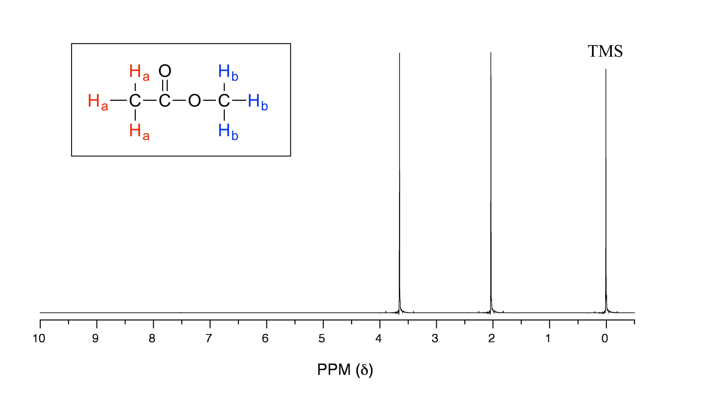

The 1H-NMR spectrum of methyl acetate

ig 9

We see three absorbance signals: two of these correspond to
Ha and Hb (don't worry yet which is which), while
the peak at the far right of the spectrum corresponds to the 12
chemically equivalent protons in tetramethylsilane (**TMS**), a standard
reference compound that was added to our sample.

First, let's talk about the *x*-axis. The **'ppm'** label stands for
'parts per million', and simply tells us that the two sets of equivalent
protons in our methyl acetate sample have resonance frequencies about
2.0 and 3.6 parts per million higher than the resonance frequency of the
TMS protons, which we are using as our reference standard. This is
referred to as their **chemical shift**.

The reason for using a relative value (chemical shift expressed in ppm)
rather than the actual resonance frequency (expressed in Hz) is that
every NMR instrument will have a different magnetic field strength, so
the actual value of resonance frequencies expressed in Hz will be
different on different instruments - remember that ∆E for the magnetic
transition of a nucleus depends upon the strength of the externally
applied magnetic field. However, the resonance frequency values
*relative to the TMS standard* will always be the same, regardless of
the strength of the applied field. For example, if the resonance
frequency for the TMS protons in a given NMR instrument is exactly 300
MHz (300 million Hz), then a chemical shift of 2.0 ppm corresponds to an
actual resonance frequency of 300,000,600 Hz (2 parts per million of 300
million is 600). In another instrument (with a stronger magnet) where
the resonance frequency for TMS protons is 400 MHz, a chemical shift of
2.0 ppm corresponds to a resonance frequency of 400,000,800 Hz.

A frequently used symbolic designation for chemical shift in ppm is the
lower-case Greek letter δ (*delta*). Most protons in organic compounds
have chemical shift values between 0 and 10 ppm relative to TMS,
although values below 0 ppm and up to 12 ppm and above are occasionally
observed. By convention, the left-hand side of an NMR spectrum (higher
chemical shift) is called **downfield**, and the right-hand direction is
called **upfield**.

In modern research-grade NMR instruments, it is no longer necessary to
actually add TMS to the sample: the computer simply calculates where the
TMS signal *should* be, based on resonance frequencies of the solvent.
So, from now on you will not see a TMS peak on NMR spectra - but the 0
ppm point on the *x*-axis will always be defined as the resonance
frequency of TMS protons.

**A Chemical Shift Analogy**

If you are having trouble understanding the concept of chemical shift
and why it is used in NMR, try this analogy: imagine that you have a job
where you travel frequently to various planets, each of which has a
different gravitational field strength. Although your body mass remains
constant, your measured weight is variable - the same scale may show
that you weigh 60 kg on one planet, and 75 kg on another. You want to be
able to keep track your body mass in a meaningful, reproducible way, so
you choose an object to use as a standard: a heavy iron bar, for
example. You record the weight of the iron bar and yourself on your home
planet, and find that the iron bar weighs 50 kg and you weigh 60 kg. You
are 20 percent (or pph, parts per hundred) heavier than the bar. The
next day you travel (with the iron bar in your suitcase) to another
planet and find that the bar weighs 62.5 kg, and you weigh 75 kg.
Although your measured weight is different, you are still 20% heavier
than the bar: you have a 'weight shift' of 20 pph relative to the iron
bar, no matter what planet you are on.

<u>Exercise 5.3:</u>

a\) What is the chemical shift, *expressed in Hz*, of proton signals at
2.0 ppm and 3.6 ppm for an NMR instrument in which the TMS protons have
a resonance frequency of exactly 500 MHz?

b\) What is the *actual resonance frequency* (in Hz) of these two
protons in that same instrument?

We have already pointed out that, on our spectrum of methyl acetate,
there is there is no *y*-axis scale indicated. With *y*-axis data it is
*relative* values, rather than absolute values, that are important in
NMR. The computer in an NMR instrument can be instructed to
mathematically integrate the area under a signal or group of signals.
The **signal integration** process is very useful, because *in
1H-NMR spectroscopy the area under a signal is proportional
to the number of protons to which the signal corresponds*. When we
instruct the computer to integrate the areas under the Ha and
Hb signals in our methyl acetate spectrum, we find that they
have approximately the same area. This makes sense, because each signal
corresponds to a set of *three* equivalent protons.

Be careful not to assume that you can correlate apparent peak *height*
to number of protons - depending on the spectrum, relative peak heights
will not always be the same as relative peak *areas*, and it is the
relative areas that are meaningful. Because it is difficult to compare
relative peak area by eye, we rely on the instrument's computer to do
the calculations.

Take a look next at the spectrum of 1,4-dimethylbenzene:

fig 10

As we discussed earlier, this molecule has two sets of equivalent
protons: the six methyl (Ha) protons and the four aromatic
(Hb) protons. When we instruct the instrument to integrate
the areas under the two signals, we find that the area under the peak at
2.6 ppm is 1.5 times greater than the area under the peak at 7.4 ppm.
The ratio 1.5 to 1 is of course the same as the ratio 6 to 4. This
integration information (along with the actual chemical shift values,
which we'll discuss soon) tells us that the peak at 7.4 ppm must
correspond to Hb, and the peak at 2.6 ppm to Ha.

The integration function can also be used to determine the relative
amounts of two or more compounds in a *mixed* sample. If we take a
1H-NMR spectrum of a sample that is a equimolar mixture of
benzene and acetone, for example, we will see two signals, one for the
six equivalent acetone protons and one for the six equivalent benzene
protons. The integrated area under the acetone signal will be the same
as the area under the benzene sample, because both signals represent six
protons. If we have an equimolar mixture of acetone and cyclopentane, on
the other hand, the ratio of the acetone peak area to the cylopentane
peak area will be 3:5 (or 6:10), because the cyclopentane signal
represents ten protons.

<u>Exercise 5.4</u>: You take a 1H-NMR spectrum of a mixed
sample of acetone and dichloromethane. The integral ratio of the two
signals (acetone to dichloromethane) is 2.3 to 1. What is the molar
ratio of the two compounds in the sample?

<u>Exercise 5.5</u>: You take the 1H-NMR spectrum of a mixed
sample of 36% 1,4-dimethylbenzene and 64% acetone (these are mole
percentages). What is the expected integration ratio of the signals that
you would observe? Order the ratio from highest to lowest numbers.

## Section 5.4: The basis for differences in chemical shift 

### 5.4A: Diamagnetic shielding and deshielding

We come now to the question of *why* nonequivalent protons have
different resonance frequencies and thus different chemical shifts. The
chemical shift of a given proton is determined primarily by interactions
with the nearby electrons. The most important thing to understand is
that *when electrons are subjected to an external magnetic field, they
form their own small **induced magnetic fields** in [opposition to the
external
field](http://teaching.shu.ac.uk/hwb/chemistry/tutorials/molspec/espin.gif).*

Consider the methane molecule (CH4) in which the four
equivalent protons have a chemical shift of 0.23 ppm (this is a value we
can look up in any chemistry reference source). The valence electrons
around the methyl carbon, when subjected to B0, generate
their own very small induced magnetic field that opposes B0.
This induced field, to a small but significant degree, *shields* the
nearby protons from experiencing the full force of B0, an
effect known as **local diamagnetic shielding**. In other words, the
methane protons do not quite experience the full force of
B0 - what they experience is called **Beff**, or
the **effective field**, which is slightly *weaker* than B0
due to the influence of the nearby electrons.

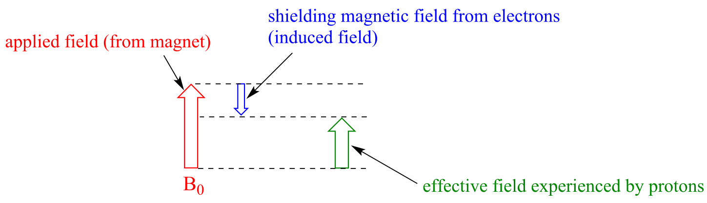

fig 11

Because Beff is slightly weaker than B0, the
resonance frequency (and thus the chemical shift) of the methane proton
is slightly lower than what it would be if it did not have electrons
nearby and was feeling the full force of B0. (You should note
that the figure above is not to scale: the applied field is generated by
a superconducting magnet and is *extremely* strong, while the opposing
induced field from the electrons is comparatively very small.)

Now consider methyl fluoride, CH3F, in which the protons have
a chemical shift of 4.26 ppm, significantly higher than that of methane.
This is caused by something called the **deshielding effect**. Recall
that fluorine is very electronegative: it pulls electrons towards
itself, effectively *decreasing* the electron density around each of the
protons. For the protons, being in a lower electron density environment
means less diamagnetic shielding, which in turn means a greater overall
exposure to B0, a stronger Beff, and a higher
resonance frequency. Put another way, the fluorine, by pulling electron
density away from the protons, is *deshielding* them, leaving them more
exposed to B0. As the electronegativity of the substituent
increases, so does the extent of deshielding, and so does the chemical
shift. This is evident when we look at the chemical shifts of methane
and three halomethane compounds (remember that electronegativity
increases as we move up a column in the periodic table, so flourine is
the most electronegative and bromine the least).

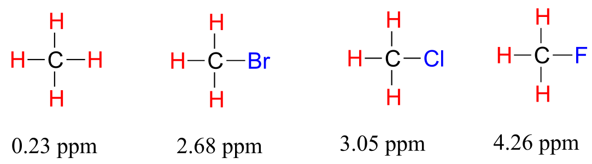

fig 12

To a large extent, then, we can predict trends in chemical shift by
considering how much deshielding is taking place near a proton. The
chemical shift of trichloromethane (common name chloroform) is, as
expected, higher than that of dichloromethane, which is in turn higher
than that of chloromethane.

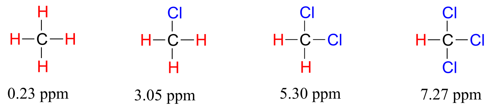

fig 13

The deshielding effect of an electronegative substituent diminishes
sharply with increasing distance:

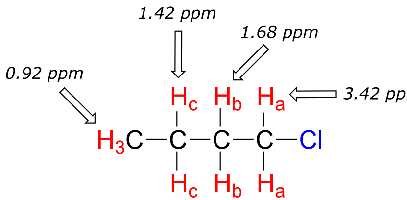

fig 14

The presence of an electronegative oxygen, nitrogen, sulfur, or
*sp*2-hybridized carbon also tends to shift the NMR signals
of nearby protons slightly downfield:

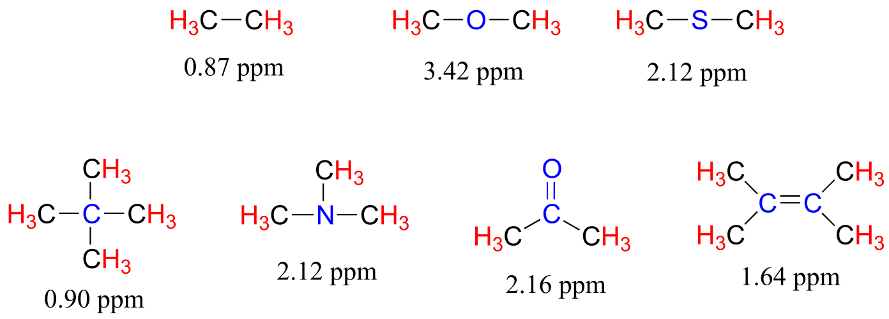

fig 15

Now we can finally assign the two peaks in the the 1H-NMR
spectrum of methyl acetate. We can predict that the methyl ester protons
(Hb), which are deshielded by the adjacent oxygen atom, will
have a higher chemical shift than the acetate protons (Ha),
which are deshielded to a lesser extent by the carbonyl group.
Therefore, the signal at 3.7 must correspond to Hb, and the
signal at 2.0 to Ha.

fig 16

### 5.4B: Diamagnetic anisotropy

Vinylic protons (those directly bonded to an alkene carbon) and aromatic
protons resonate much further downfield than can be accounted for simply
by the deshielding effect of nearby electronegative atoms. Note the
chemical shifts of the vinylic and aromatic protons in cyclohexene and
benzene:

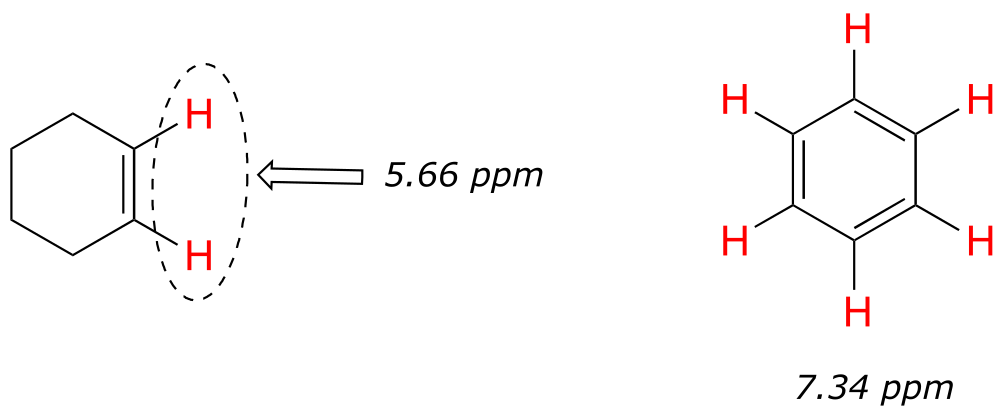

fig 17

We'll consider the aromatic proton first. Recall that in benzene and
many other aromatic structures, a sextet of π electrons is delocalized
around the ring. When the molecule is exposed to B0, these π
electrons begin to circulate in a **ring current**, generating their own
induced magnetic field that opposes B0. In this case,
however, the induced field of the π electrons does not shield the
aromatic protons from B0 as you might expect– rather, it
causes the protons to experience a *stronger* magnetic field in the
direction of B0 – in other words, it *adds* to B0
rather than subtracting from it.

To understand how this happens, we need to understand the concept of
**diamagnetic anisotropy** (anisotropy means \`non-uniformity\`). So
far, we have been picturing magnetic fields as being oriented in a
uniform direction. This is only true over a small area. If we step back
and take a wider view, however, we see that the lines of force in a
magnetic field are actually anisotropic. They start in the 'north'
direction, then loop around like a snake biting its own tail.

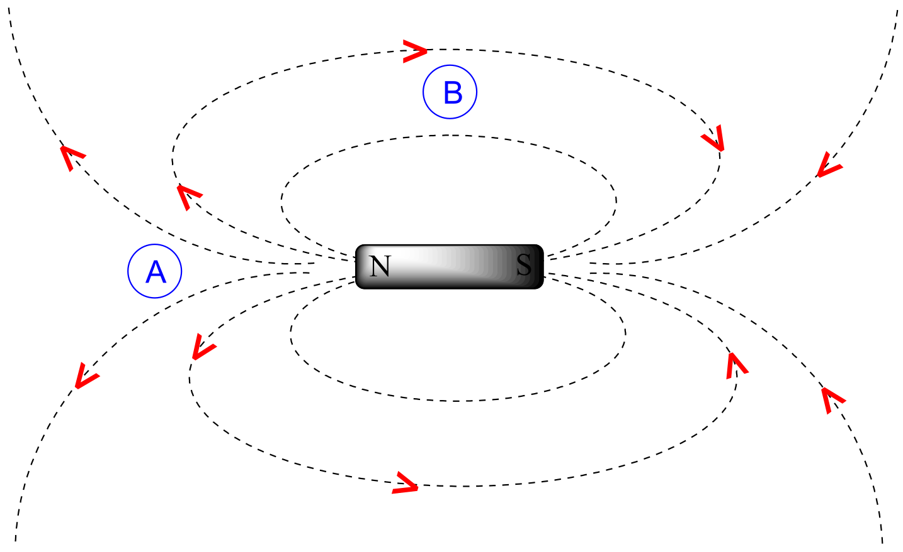

fig 18

If we are at point A in the figure above, we feel a magnetic field
pointing in a northerly direction. If we are at point B, however, we
feel a field pointing to the south.

In the induced field generated by the aromatic ring current, the
aromatic protons are at the equivalent of ‘point B’ – this means that
the induced current in this region of space is oriented in the *same*
direction as B0, so it *adds* to B0 rather than
subtracting from it.

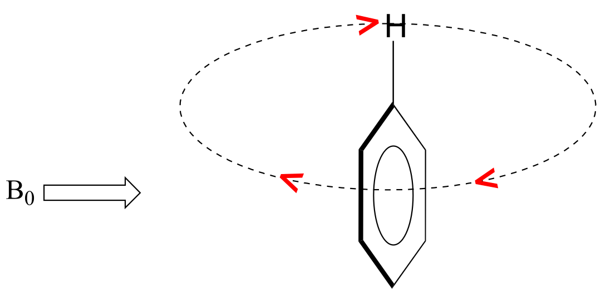

[another
image](https://image.slidesharecdn.com/nuclearmagneticresonance-protonnmr-130126001343-phpapp02/95/nuclear-magnetic-resonance-proton-nmr-62-638.jpg?cb=1359159618)

fig 19

The end result is that aromatic protons, due to the anisotropy of the
induced field generated by the π ring current, appear to be highly
deshielded. Their chemical shift is far downfield, in the 6.5-8 ppm
region.

Diamagnetic anisotropy is also responsible for the downfield chemical
shifts of vinylic protons (4.5-6.5 ppm) and aldehyde protons (9-10 ppm).
These groups are not aromatic and thus do not generate ring currents
does benzene, but the π electrons circulate in such a way as to generate
a magnetic field that *adds* to B0 in the regions of space
occupied by the protons. Carboxylic acid protons are very far downfield
(10-12 ppm) due to the combined influence of the electronegative oxygen
atom and the nearby π bond.

### 5.4C: Hydrogen bonded protons

Protons that are directly bonded to oxygen or nitrogen have chemical
shifts that can vary widely depending on solvent and concentration.
These protons can participate to varying degrees in hydrogen bonding
interactions, and the degree hydrogen bonding greatly influences the
electron density around the proton - and thus the chemical shift.
Signals for hydrogen bonding protons also tend to be *broader* than
those of hydrogens bonded to carbon, a phenomenon that is also due to
hydrogen bonding.

Alcohol protons, for example, will usually show broad signals anywhere
between 1-5 ppm. The signal for Ha in the spectrum of
1-heptanol is a typical example of a broadened NMR signal for an alcohol
proton.

fig 19a

The table below provides a summary of approximate chemical shift ranges
for protons in different bonding arrangements. A more detailed table can
be found in the appendix.

**Typical chemical shift ranges in 1H-NMR**

| **type of proton**                | **chemical shift range (ppm)** |
|-----------------------------------|--------------------------------|
| bonded to *sp3* carbon | 0.5 - 4                        |
| bonded to N (amine)               | 1 - 3                          |
| bonded to O (alcohol)             | 1 - 5                          |
| alkene/ vinylic                   | 3.5 - 6.5                      |
| terminal alkyne                   | 2 - 3                          |
| bonded to N (amide)               | 5 - 9                          |
| aromatic                          | 6 - 9                          |
| aldehyde                          | 9.5 - 10                       |
| carboxylic acid                   | 10 - 13                        |

<u>Exercise 5.6</u>: For each pair of protons colored red
(Ha) and blue (Hb) in the structures below, state
which is expected to have the *higher* chemical shift in
1H-NMR. For some of these it will be helpful to consult Table
2 at the back of the book.

fig 16a

<u>Exercise 5.7</u>: The 1H-NMR spectrum of the aromatic
compound \[18\] annulene has two peaks, at 8.9 ppm and -1.8 ppm (a
*negative* chemical shift, upfield of TMS!) with an integration ratio of
2:1. Explain the unusual chemical shift of the latter peak.

 

## Section 5.5: Spin-spin coupling

The 1H-NMR spectra that we have seen so far (of methyl
acetate and 1,4-dimethylbenzene) are somewhat unusual in the sense that
in both of these molecules, each set of protons generates a single NMR
signal. In fact, the 1H-NMR spectra of most organic molecules
contain proton signals that are 'split' into two or more sub-peaks.
Rather than being a complication, however, this splitting behavior is
actually very useful because it provides us with more information about
our sample molecule.

Consider the spectrum for 1,1,2-trichloroethane. In this and in many
spectra to follow, we show enlargements of individual signals so that
the signal splitting patterns are recognizable.

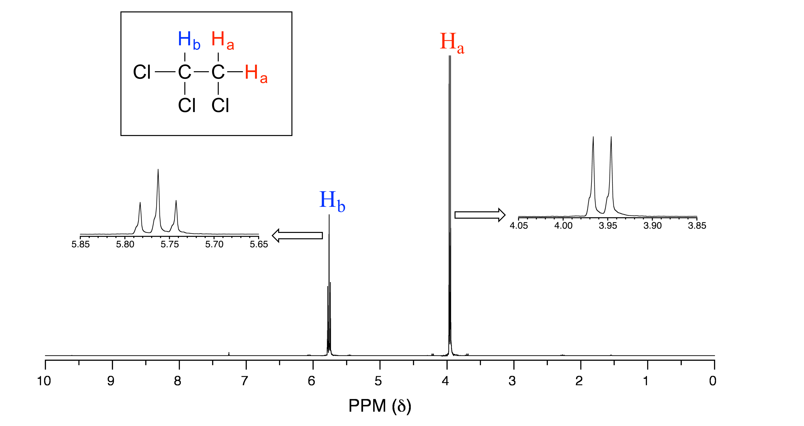

fig 20

The signal at 3.96 ppm, corresponding to the two Ha protons,
is split into two subpeaks of equal height (and area) – this is referred
to as a **doublet**. The Hb signal at 5.76 ppm, on the other
hand, is split into three sub-peaks, with the middle peak higher than
the two outside peaks - if we were to integrate each subpeak, we would
see that the area under the middle peak is twice that of each of the
outside peaks. This is called a **triplet**.

The source of signal splitting is a phenomenon called **spin-spin
coupling**, a term that describes the magnetic interactions between
neighboring, non-equivalent NMR-active nuclei. (The terms 'splitting'
and 'coupling' are often used interchangeably when discussing NMR.) In
our 1,1,2 trichloromethane example, the Ha and Hb
protons are spin-coupled to each other. Here's how it works, looking
first at the Ha signal: in addition to being shielded by
nearby valence electrons, each of the Ha protons is also
influenced by the small magnetic field generated by Hb next
door (remember, each spinning proton is like a tiny magnet). The
magnetic moment of Hb will be aligned *with* B0 in
slightly more than half of the molecules in the sample, while in the
remaining molecules it will be opposed to B0. The
Beff ‘felt’ by Ha is a slightly weaker if
Hb is aligned against B0, or slightly stronger if
Hb is aligned with B0. In other words, in half of
the molecules Ha is *shielded* by Hb (thus the NMR
signal is shifted slightly upfield) and in the other half Ha
is *deshielded* by Hb (and the NMR signal shifted slightly
downfield). What would otherwise be a single Ha peak has been
split into two sub-peaks (a doublet), one upfield and one downfield of
the original signal. These ideas an be illustrated by a **splitting
diagram**, as shown below.

fig 21

Now, let's think about the Hb signal. The magnetic
environment experienced by Hb is influenced by the fields of
both neighboring Ha protons, which we will call
Ha1 and Ha2. There are four possibilities here,
each of which is equally probable. First, the magnetic fields of both
Ha1 and Ha2 could be aligned with B0,
which would deshield Hb, shifting its NMR signal slightly
downfield. Second, both the Ha1 and Ha2 magnetic
fields could be aligned opposed to B0, which would shield
Hb, shifting its resonance signal slightly upfield. Third and
fourth, Ha1 could be with B0 and Ha2
opposed, or Ha1 opposed to B0 and Ha2
with B0. In each of the last two cases, the shielding effect
of one Ha proton would cancel the deshielding effect of the
other, and the chemical shift of Hb would be unchanged.

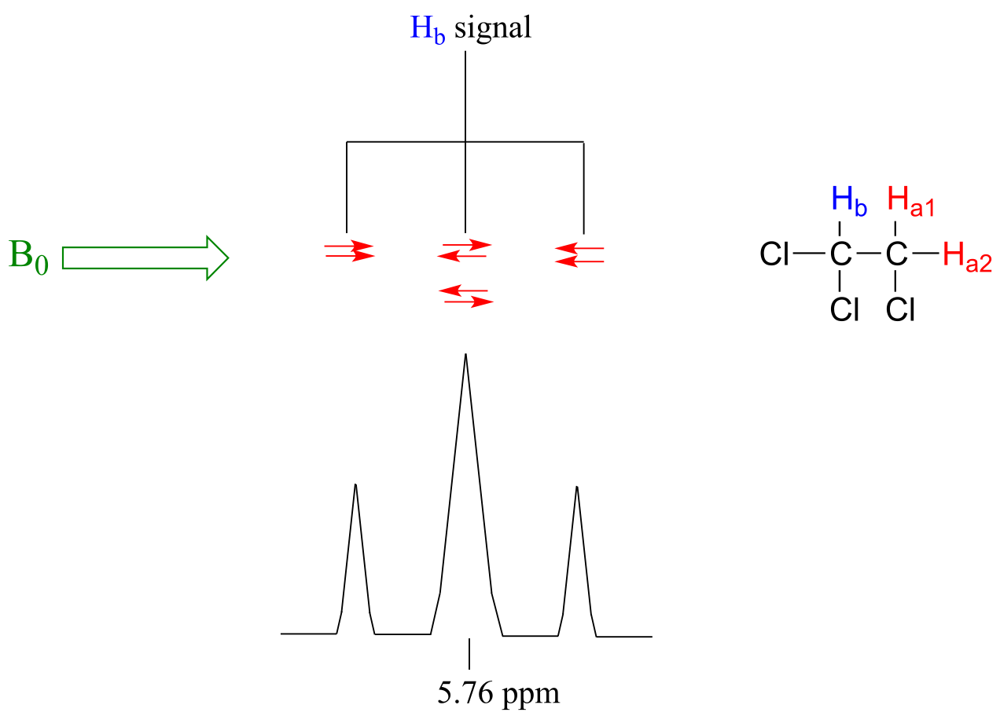

fig 22

So in the end, the signal for Hb is a **triplet**, with the
middle peak twice as large as the two outer peaks because there are
*two* ways that Ha1 and Ha2 can cancel each other
out.

Consider the spectrum for ethyl acetate:

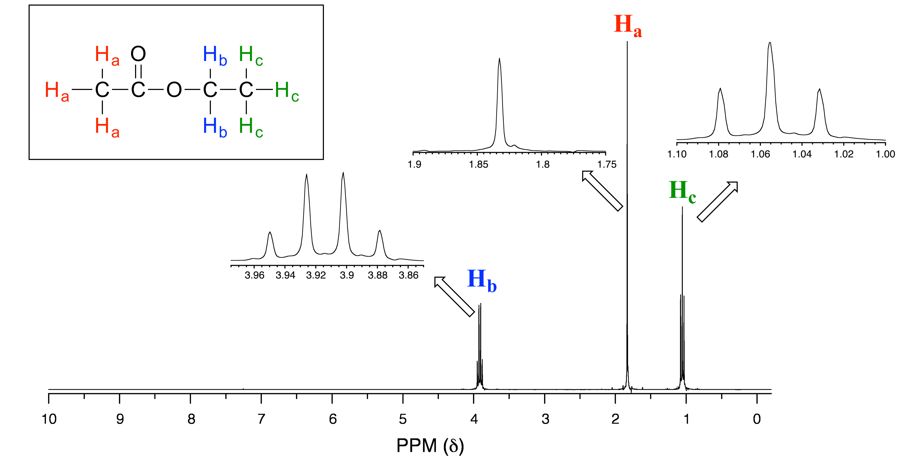

fig 23

We see an unsplit **'singlet'** peak at 1.83 ppm that corresponds to the
acetyl (Ha) protons – this is similar to the signal for the
acetate protons in methyl acetate that we considered earlier. This
signal is unsplit because there are no adjacent protons on the molecule.
The signal at 1.06 ppm for the Hc protons is split into a
triplet by the two Hb protons next door. The explanation here
is the same as the explanation for the triplet peak we saw previously
for 1,1,2-trichloroethane.

The Hb protons give rise to a **quartet** signal at 3.92 ppm
– notice that the two middle peaks are taller then the two outside
peaks. This splitting pattern results from the spin-coupling effect of
the *three* adjacent Hc protons, and can be explained by an
analysis similar to that which we used to explain the doublet and
triplet patterns.

<u>Exercise 5.8</u>:

a\) Explain, using a splitting diagram, the possible combinations of
nuclear spin states for the Hc protons in ethyl acetate, and
why the Hb signal is split into a quartet.

b\) The integration ratio of the two 'sub-peaks' in a doublet is 1:1,
and in triplets it is 1:2:1. What is the integration ratio of the
Hb quartet in ethyl acetate? (Hint – use the illustration
that you drew in part a to answer this question.)

By now, you probably have recognized the pattern which is usually
referred to as the ***n* + 1 rule**: if a set of protons has *n*
neighboring, non-equivalent protons, it will be split into *n* + 1
subpeaks. Thus the two Hb protons in ethyl acetate split the
Hc signal into a triplet, and the three Hc protons
split the Hb signal into a quartet. Ha, with zero
neighboring protons, is a singlet. This is very useful information if we
are trying to determine the structure of an unknown molecule: if we see
a triplet signal, we know that the corresponding proton or set of
protons has two \`neighbors\`. When we begin to determine structures of
unknown compounds using 1H-NMR spectral data, it will become
more apparent how this kind of information can be used.

Four important points need to be emphasized at this point.

First, signal splitting only occurs between non-equivalent protons – in
other words, Ha1 in 1,1,2-trichloroethane is *not* split by
Ha2, and vice-versa.

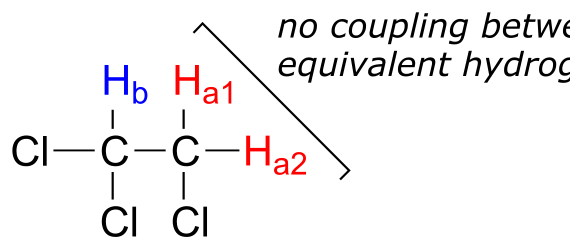

fig 24

Second, splitting occurs primarily between protons that are separated by
three or fewer bonds. This is why the Ha protons in ethyl
acetate form a singlet– the nearest proton neighbors are five bonds
away, too far for coupling to occur.

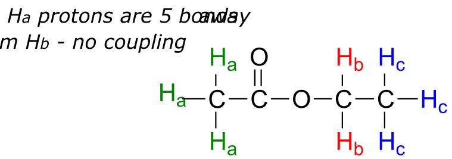

fig 25

With more sensitive instruments we will sometimes see 4-bond and even
5-bond splitting, but in our treatment of NMR, for the sake of
simplicity we will always assume that only three-bond splitting is seen.

Third, protons that are bonded to oxygen or nitrogen generally do not
split - and are not split by - adjacent protons. OH and NH protons are
acidic enough to rapidly exchange between different molecules, so the
neighboring protons never actually 'feels' their influence.

The spectrum of 1-heptanol has a characteristically broad alcohol proton
signal at 3.7 ppm (labeled Ha below).

fig 31

Notice in this spectrum that Hb is a triplet, coupled to the
two Hc protons but *not* coupled to Ha. The
signals corresponding to Hc through Hh are complex
due to overlapping - when this happens (as it often does!), detailed
analysis becomes more challenging.

Below are a few more examples of chemical shift and splitting pattern
information for some relatively simple organic molecules.

<u>Exercise 5.9</u>: How many proton signals would you expect to see in
the 1H-NMR spectrum of triclosan (a common antimicrobial
agent in soap)? For each of the proton signals, predict the splitting
pattern, assuming that you can see only 3-bond splitting.

fig 27

<u>Exercise 5.10:</u> How many proton signals would you expect to see in
the 1H-NMR spectrum of the neurotransmitter serotonin? For
each of the proton signals, predict the splitting pattern, again
assuming only 3-bond splitting.

fig 28

In an ideal world, all NMR spectra would be as easy to interpret as
those we have seen so far: every peak would be separated from the
others, the peak integration would be obvious, and the multiplicity
(singlet, doublet, etc.) would be easy to recognize. The real world,
unfortunately, is not always so pretty: peaks with similar chemical
shifts overlap, making interpretation much more difficult. We have
already seen this is the spectrum of 1-heptanol above. In the spectrum
of methylbenzene, we would expect the signal for Ha to be a
singlet, Hb to be a doublet, and Hc and
Hd to be triplets. Looking at relative integration values for
the four peaks, we would expect to see a 3:2:2:1 ratio.

fig 29

In practice, however, the three aromatic proton sets Hb,
Hc and Hd have very similar chemical shifts so
their signals overlap substantially, and we cannot recognize doublet or
triplet splitting patterns. In this case, we would refer to the aromatic
part of the spectrum as a **multiplet**. We can report the integration
ratio of the Ha peak compared to the combined aromatic peaks
as 3 to 5, or the equivalent 1 to 1.67.

The magnitude of spin-spin coupling can be expressed using the
**coupling constant**, abbreviated with the capital letter J. The
coupling constant is simply the difference, expressed in Hz, between two
adjacent sub-peaks in a split signal, and is a measure of the extent to
which one nucleus 'feels' the magnetic dipole of its neighbor.

For our doublet in the 1,1,2-trichloroethane spectrum, for example, the
two subpeaks are separated by 6.1 Hz, and thus we write
3Ja-b = 6.1 Hz.

fig 31a

The superscript '3' tells us that this is a three-bond coupling
interaction, and the 'a-b' subscript tells us that we are talking about
coupling between Ha and Hb. Unlike the chemical
shift value, ***the coupling constant, expressed in Hz, is the same
regardless of the applied field strength of the NMR magnet***. The
strength of the magnetic moment of a neighboring proton, which is the
source of the spin-spin coupling phenomenon, does *not* depend on the
applied field strength. For this reason, coupling constants are normally
given in Hz, *not* ppm.

When we look closely at the triplet signal in 1,1,2-trichloroethane, we
see that the coupling constant - the 'gap' between subpeaks - is 6.1 Hz,
the same as for the doublet. The coupling constant
3Ja-b quantifies the magnetic interaction between
the Ha and Hb hydrogen sets, and *this interaction
is of the same magnitude in either direction*. In other words, spin-spin
coupling is *reciprocal*: Ha influences Hb to the
same extent that Hb influences Ha.

Coupling constants between proton sets on neighboring
*sp*3-hybridized carbons is typically in the region of 6-8
Hz. Coupling constants for neighboring vinylic protons can range from 0
Hz (no coupling at all) to 18 Hz, depending on the bonding arrangement.

Typical proton-proton coupling constants

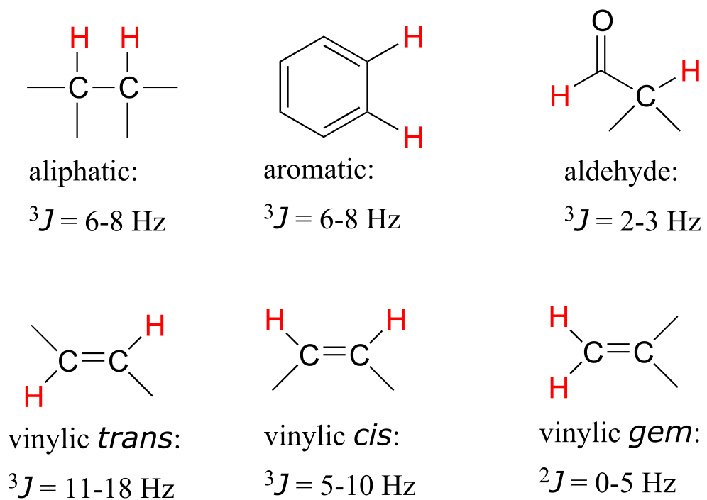

fig 31b

For vinylic protons in a *trans* configuration, we see coupling
constants in the range of 3*J* = 11-18 Hz, while *cis*
protons couple in the 3*J* = 5-10 Hz range. The 2-bond
coupling between protons on the same alkene carbon (referred to as
*geminal* protons) is very fine, generally 5 Hz or lower.

Fine coupling (2-3 Hz) is often seen between an aldehyde proton and a
three-bond neighbor.

<u>Exercise 5.11</u>: Give the expected splitting patterns and
approximate coupling constants for the labeled protons in the compound
below.

fig 31f

<u>Presenting NMR data in table format</u>

Information from NMR can be recorded conveniently in a condensed form
without having to reproduce the actual spectrum. For example, the
information from the 1H-NMR specta of ethyl acetate and
methylbenzene (see earlier figures) can be presented in tabular format,
listing the chemical shift, the peak splitting pattern, and the relative
area under peaks (usually, the smallest peak is set to 1). Coupling
constant information is not shown in the example tables below.

**  
**

**1H-NMR spectrum of ethyl acetate:**

| **δ (ppm)** | **splitting** | **integration** |
|-------------|---------------|-----------------|
| 3.92        | q             | 1               |
| 1.83        | s             | 1.5             |
| 1.06        | t             | 1.5             |

**1H-NMR spectrum of methylbenzene**:

| **δ (ppm)** | **splitting** | **integration** |
|-------------|---------------|-----------------|
| 7.45-7.63   | m             | 1.67            |
| 2.64        | s             | 1               |

*(abbreviations: s = singlet, d = doublet, t = triplet, q = quartet, m =
multiplet)*

<u>Exercise 5.12</u>: Match the 1H-NMR spectrum below to its
corresponding compound, and assign all of the signals.

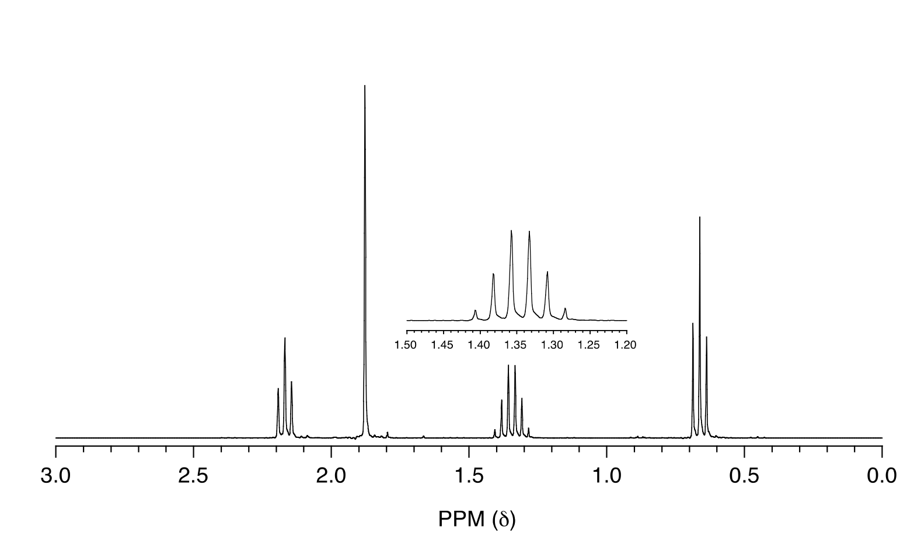

fig 29a

a\) cyclopentanone b) 3-pentanone c) butaldehyde

d\) 2-pentanone e) 4-heptanone f) 1-butene

<u>  
</u>

<u>Exercise 5.13</u>:

a\) Which of the compounds in the previous exercise is expected to have
an 1H-NMR spectrum consisting of two triplets and a sextet?

b\) Which would have a spectrum consisting of two triplets?

c\) Which would have a spectrum that includes a signal above 8 ppm?

<u>Exercise 5.14</u>: Explain how you could distinguish among the
1H-NMR spectra of the three isomers below.

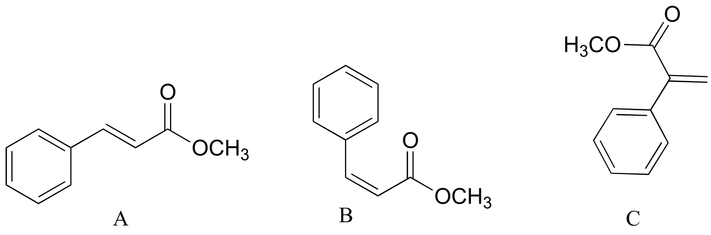

fig 31e

[Video tutorials: proton NMR
spectroscopy](https://www.khanacademy.org/science/organic-chemistry/spectroscopy-jay/proton-nmr/v/introduction-to-proton-nmr)

[Video of an actual NMR
experiment](https://www.youtube.com/watch?v=uNM801B9Y84)

## Section 5.6: 13C-NMR spectroscopy

The 12C isotope of carbon - which accounts for up about 99%
of the carbons in organic molecules - does not have a nuclear magnetic
moment, and thus is NMR-inactive. Fortunately for organic chemists,
however, the 13C isotope, which accounts for most of the
remaining 1% of carbon atoms in nature, has a magnetic dipole moment
just like protons. Most of what we have learned about 1H-NMR
spectroscopy also applies to 13C-NMR, although there are
several important differences.

The magnetic moment of a 13C nucleus is much weaker than that
of a proton, meaning that NMR signals from 13C nuclei are
inherently much weaker than proton signals. This, combined with the low
natural abundance of 13C, means that it is much more
difficult to observe carbon signals: more sample is required, and often
the data from hundreds of scans must be averaged in order to bring the
signal-to-noise ratio down to acceptable levels. Unlike
1H-NMR signals, the area under a 13C-NMR signal
cannot easily be used to determine the number of carbons to which it
corresponds. The signals for some types of carbons are inherently weaker
than for other types – peaks corresponding to carbonyl carbons, for
example, are much smaller than those for methyl or methylene
(CH2) peaks. For this reason, peak integration is generally
not useful in 13C-NMR spectroscopy.

The resonance frequencies of 13C nuclei are lower than those
of protons in the same applied field - in an instrument with a 7.05
Tesla magnet, protons resonate at about 300 MHz, while carbons resonate
at about 75 MHz. This is fortunate, as it allows us to look at
13C signals using a completely separate 'window' of radio
frequencies. Just like in 1H-NMR, the standard used in
13C-NMR experiments to define the 0 ppm point is
tetramethylsilane (TMS), although of course in 13C-NMR it is
the signal from the four equivalent *carbons* in TMS that serves as the
standard. Chemical shifts for 13C nuclei in organic molecules
are spread out over a much wider range than for protons – up to 200 ppm
for 13C compared to 10-12 ppm for protons (see Table 3 for a
list of typical 13C-NMR chemical shifts).

The chemical shift of a 13C nucleus is influenced by
essentially the same factors that influence a proton's chemical shift:
bonds to electronegative atoms and diamagnetic anisotropy effects tend
to shift signals downfield (higher resonance frequency). In addition,
sp2 hybridization results in a large downfield shift. The
13C-NMR signals for carbonyl carbons are generally the
furthest downfield (170-220 ppm), due to both sp2
hybridization and to the double bond to oxygen.

<u>Exercise 5.15:</u> How many sets of non-equivalent carbons are there
in each of the molecules shown in exercise 5.2?

<u>Exercise 5.16</u>: How many sets of non-equivalent carbons are there
in:

a\) methylbenzene

b\) 2-pentanone

c\) 1,4-dimethylbenzene

d\) triclosan

*(all structures are shown earlier in this chapter)*

Because of the low natural abundance of 13C nuclei, it is
very unlikely to find two 13C atoms near each other in the
same molecule, and thus *we do not see spin-spin coupling between
neighboring carbons in a 13C-NMR spectrum*. 13C
nuclei are coupled to nearby protons, however, which results in
complicated spectra. For clarity, chemists generally use a technique
called **broadband decoupling**, which essentially 'turns off' C-H
coupling, resulting in a spectrum in which all carbon signals are
singlets. Below is the proton-decoupled 13C-NMR sectrum of
ethyl acetate, showing the expected four signals, one for each of the
carbons. We can also see a signal for the carbon atom in the deuterated
chloroform (CDCl3) solvent (although a detailed discussion is
beyond our scope here, it is interesting to note that this signal is
split into a triplet by deuterium, which is NMR active and has *three*
possible spin states rather than two). We can ignore the solvent signal
when interpreting 13C-NMR spectra.

fig 30

While broadband decoupling results in a much simpler spectrum, useful
information about the presence of neighboring protons is lost. However,
another NMR technique called DEPT (Distortionless Enhancement by
Polarization Transfer) allows us to determine how many hydrogens are
bound to each carbon. This information is usually provided in problems
in which you are asked to interpret the 13C-NMR spectrum of
an unknown compound. (Details of how the DEPT technique works is beyond
the scope of this book, but will be covered if you take a more advanced
course in spectroscopy.)

One of the greatest advantages of 13C-NMR compared to
1H-NMR is the breadth of the spectrum - recall that carbons
resonate from 0-220 ppm relative to the TMS standard, as opposed to only
0-12 ppm for protons. Because of this, 13C signals rarely
overlap, and we can almost always distinguish separate peaks for each
carbon, even in a relatively large compound containing carbons in very
similar environments. In the proton spectrum of 1-heptanol we saw
earlier only the broad singlet of the alcohol proton (Ha) and
the triplet for (Hb) are easily analyzed. The other proton
signals overlap, making analysis difficult. In the 13C
spectrum of the same molecule, however, we can easily distinguish each
carbon signal, and we know from this data that our sample has seven
nonequivalent carbons. (Notice also that, as we would expect, the
chemical shifts of the carbons get progressively lower as they get
farther away from the deshielding oxygen.)

fig 32

This property of 13C-NMR makes it very helpful in the
elucidation of larger, more complex structures.

<u>Exercise 5.17 :</u> Below are 13C-NMR spectra for
methylbenzene (common name toluene) and methyl methacrylate. Match the
spectra to the correct structure, and make peak assignments.

 

 fig 35

 Spectrum A:

 

 fig 33

 Spetrum B:

 

 fig 34

<u>Exercise 5.18</u>: 13C-NMR data for some common
biomolecules are shown below (data is from the Aldrich Library of
1H and 13C NMR). Match the NMR data to the correct
structure, and make complete peak assignments.

spectrum a: 168.10 ppm (C), 159.91 ppm (C), 144.05 ppm (CH), 95.79 ppm
(CH)

spectrum b: 207.85 ppm (C), 172.69 ppm (C), 29.29 ppm (CH3)

spectrum c: 178.54 ppm (C), 53.25 ppm (CH), 18.95 ppm (CH3)

spectrum d: 183.81 ppm (C), 182. 63 ppm (C), 73.06 ppm (CH), 45.35 ppm
(CH2)

fig 36a

**13C-NMR in isotopic labeling studies**

Although only about 1 out of 100 carbon atoms in a naturally occurring
organic molecule is a 13C isotope, chemists are often able to
synthesize molecules that are artificially enriched in 13C at
specific carbon positions. This can be very useful in biochemical
studies, because it allows us to 'label' one or more carbons in a small
precursor molecule and then trace the presence of the 13C
label through a biosynthetic pathway all the way to the final product,
providing insight into how the biosynthesis occurs. For example,
scientists were able to grow bacteria in a medium in which the only
source of carbon was acetate enriched in 13C at the
C1 (carbonyl) position. When they isolated an isoprenoid
compound called amino-bacterio-hopanetriol synthesized by the bacteria
and looked at its 13C-NMR spectrum, they observed that the
13C label from acetate had been incorporated at eight
specific positions. They knew this because the 13C-NMR
signals for these carbons were much stronger compared to the same
signals in a control (unlabeled) compound.

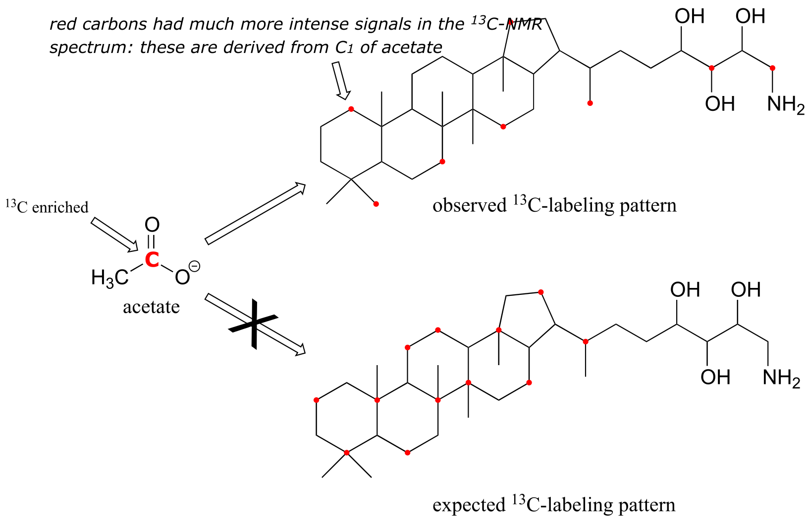

This result was very surprising - the scientists had expected a
completely different pattern of 13C incorporation based on
what they believed to be the isoprenoid biosynthesis pathway involved.
This unexpected result led eventually to the discovery that bacteria
synthesize isoprenoid compounds by a completely different pathway then
yeasts, plants, and animals. The newly discovered bacterial metabolic
pathway is currently a key target for the development of new antibiotic
and antimalaria drugs. ([*Eur. J. Biochem*. **1988**, *175*,
405](https://www.ncbi.nlm.nih.gov/pubmed/3136017)).

fig 44

## Section 5.7: Solving unknown structures 

Now it is finally time to put together all that we have studied about
structure determination techniques and learn how to actually solve the
structure of an organic molecule 'from scratch' - starting, in other
words, with nothing but the raw experimental data. For this exercise, we
will imagine that we have been given a vial containing a pure sample of
an unknown organic compound, and that this compound to our knowledge has
never before been synthesized, isolated, or characterized - we are the
first to get our hands on it. Can we figure out its structure? While of
course the exact method of determining an unknown structure will depend
on the compound in question and, in the real world of research, will
probably involve some techniques that are beyond the scope of this book,
here is an overview of an approach that could be taken to analyze a pure
sample of a relatively simple organic compound, using the techniques we
have learned about.

*Step 1:* *Use MS and combustion analysis to determine the molecular
formula*

Before we start analyzing spectroscopic data, we need one very important
piece of information about our compound - its molecular formula. This
can be determined through the combined use of mass spectrometry and
**combustion analysis**. We will not go into the details of combustion
analysis - for now, it is enough to know that this technique tells us
the mass percent of each element in the compound. Because molecular
oxygen is involved in the combustion reaction, oxygen in the sample is
not measured directly - but we assume that if the mass percentages do
not add up to 100%, the remainder is accounted for by oxygen.

When we obtain our unknown compound, one of the first things we will do
is to send away a small quantity to an analytical company specializing
in combustion analysis. They send us back a report stating that our
compound is composed, by mass, of 52.0% carbon, 38.3% chlorine, and 9.7%
hydrogen. This adds up to 100%, so our compound does not contain any
oxygen atoms.

In order to determined the molecular formula of our compound from this
data, we first need to know its molar mass. This piece of information,
as you recall from chapter 4, we determine by looking at the 'molecular
ion peak' in the mass spectrum of our compound. In this example, we find
that our MS data shows a molecular ion peak at *m/z* = 92, giving us a
molar mass of 92 g/mole (remember that in the MS experiment, charge
(*z*) is almost always equal to 1, because we are looking at +1
cations).

So, one mole of our compound is 92g. How many moles of carbon atoms are
in one mole of the compound? Simple: 52% of 92g is 47.8g. So in one mole
of our compound, there is about 48 g of carbon, which means four moles
of carbon. With similar calculations, we find that one mole of our
compound contains nine hydrogens and one chlorine. Therefore our
molecular formula is C4H9Cl.

*Step 2: Calculate the Index of Hydrogen Deficiency*

The next step is to calculate a number called the Index of Hydrogen
Deficiency (IHD) from the molecular formula. The IHD will tell us how
many multiple bonds and/or ring structures our molecule has - very
useful information. The idea behind the IHD is very simple: the presence
of a double bond or a ring structure means that two fewer hydrogen atoms
can be part of the compound. The formula for calculating IHD from a
molecular formula is:

**Calculating Index of Hydrogen Deficiency:**

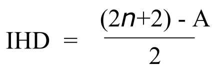

where:

*n* = number of carbon atoms

A = (number of hydrogen atoms) + (number of halogen atoms) - (number of
nitrogen atoms) - (net charge)

fig 36

For example, a molecule with the molecular formula
C6H14 would have *n* = 6 and A = 14, so we can
calculate that IHD = 0 and thereby know that a compound with this
formula has no double bonds or ring structures. Hexane and 2-methyl
pentane are two examples of compounds that apply.

A molecular formula of C6H12, on the other hand,
corresponds to IHD = 1, so a compound with this formula should have one
double bond *or* one ring structure. Cyclohexane (one ring structure)
and 2-hexene (one double bond) are two possibilities. Benzene
(C6H6) , and methyl benzene
(C7H8) both have IHD = 4, corresponding in both
cases to three π bonds and one ring. An IHD value of 4 or greater is
often an indicator that an aromatic ring is present.

<u>Exercise 5.19</u>:

a\) What is the IHD that corresponds to a molecular formula
C6H12O? Draw the structures of three possible
compounds that fit.

b\) The amino acid alanine has molecular formula
C2H8NO2+ in aqueous buffer
of pH = 2. Calculate the IHD. Then, draw the relevant structure to
confirm that this IHD makes sense.

c\) What is the IHD of the compounds below? (*Hint*: you don't need to
figure out molecular formulas!)

fig 36b

The formula for our structure determination sample,
C4H9Cl, corresponds to IHD = 0, meaning that our
compound contains no multiple bonds or rings.

*Step 3: Use available spectroscopy data to identify discrete parts of
the structure.*

In this problem, we have proton and carbon NMR data to work with (other
problems may include IR and/or UV/Vis data).

<u>1H-NMR</u>:

| **δ (ppm)** | **splitting** | **integration** |
|-------------|---------------|-----------------|
| 3.38        | d             | 2               |
| 1.95        | m             | 1               |
| 1.01        | d             | 6               |

<u>13C-NMR</u>:

52.49 (CH2)

31.06 (CH)

20.08 (CH3)

The process of piecing together an organic structure is very much like
putting together a puzzle. In every case we start the same way,
determining the molecular formula and the IHD value. After that, there
is no set formula for success- what we need to do is figure out as much
as we can about individual pieces of the molecule from the NMR (and
often IR, MS, or UV-Vis) data, and write these down. Eventually,
hopefully, we will be able to put these pieces together in a way that
agrees with all of our empirical data. Let's give it a go.

We see that there are only three signals in each NMR spectrum, but four
carbons in the molecule, which tells us that two of the carbons are
chemically equivalent. The fact that the signal at 1.01 ppm in the
proton spectrum corresponds to *six* protons strongly suggests that the
molecule has two equivalent methyl (CH3) groups. Because this
signal is a doublet, there must be a CH carbon bound to each of these
two methyl groups. Taken together, this suggests:

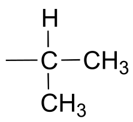

fig 37

The 1H-NMR signal at 3.38 ppm must be for protons bound to
the carbon which is in turn bound to the chlorine (we infer this because
this signal is the furthest downfield in the spectrum, due to the
deshielding effect of the electronegative chlorine). This signal is for
two protons and is a doublet, meaning that there is a single
nonequivalent proton on an adjacent carbon.

fig 38

*Step 4: Try to put the pieces of the puzzle together, and see if
everything fits the available data.*

At this point, we have accounted for all of the atoms in the structure,
and we have enough information to put together a structure that
corresponds to 1-chloro-2-methylpropane.

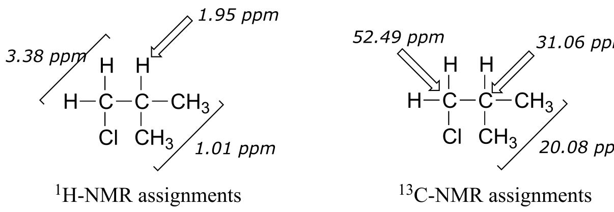

fig 39

To confirm, we make assignment all NMR signals to their corresponding
atoms and make sure that our structure fits all of the NMR data. Notice
that the proton peak at 1.95 ppm might be expected to be a '9-tet'
because of its eight 3-bond neighbors: however, two of the neighbors are
different from the other six, and may not couple to exactly the same
extent. The signal at 1.95 will not, then, be a 'clean' 9-tet, and we
would call it a multiplet.

<u>Exercise 5.20</u>:

Three constitutional isomers of 1-chloro-2-methylpropane produce the
following NMR data. Assign structures to the three compounds, and make
all peak assignments.

**Compound A**: (2-chloro-2-methylpropane)

<u>1H-NMR</u>:

1.62 ppm, 9H, s

<u>13C-NMR</u>:

67.14 ppm (C)

34\. 47 ppm (CH3)

<table>
<colgroup>
<col style="width: 50%" />
<col style="width: 50%" />
</colgroup>
<thead>
<tr class="header">
<th>
<strong>Compound B:</strong>

<em>(1-chlorobutane)</em>

<u>1H-NMR</u>:

3.42 ppm, 2H, t

1.68 ppm, 2H, p

1.41 ppm, 2H, sextet

0.92 ppm, 3H, t

<u>13C-NMR:</u>

44.74 ppm (CH2)

34.84 ppm (CH2)

20.18 ppm (CH2)

13.34 ppm (CH3)
</th>
<th>
<strong>Compound C</strong>:

<em>(2-chlorobutane)</em>

<u>1H-NMR</u>:

3.97 ppm, 1H, sextet

1.71 ppm, 2H, p

1.50 ppm, 3H, d

1.02 ppm, 3H, t

<u>13C-NMR:</u>

60.34 ppm (CH)

33.45 ppm (CH2)

24.94 ppm (CH3)

11.08 ppm (CH3)
</th>
</tr>
</thead>
<tbody>
</tbody>
</table>

Let's try another problem, this time incorporating IR information. The
following data was obtained for a pure sample of an unknown organic
compound:

<u>Combustion analysis:</u>

C: 85.7%

H: 6.67%

<u>MS</u>: Molecular ion at *m/z* = 210

<u>1H-NMR:</u>

7.5-7.0, 10H, m

5.10, 1H, s

2.22, 3H, s

<u>  
</u>

<u>13C-NMR</u>:

206.2 (C) 128.7 (CH) 30.0 (CH3)

138.4 (C) 127.2 (CH)

129.0 (CH) 65.0 (CH)

<u>IR</u>: 1720 cm-1, strong *(there are of course many other
peaks in the IR spectrum, but this is the most characteristic one)*

The molecular weight is 210, and we can determine from combustion
analysis that the molecular formula is C15H14O
(the mass percent of oxygen in the compound is assumed to be 100 -
85.7 - 6.67 = 7.6 %). This gives us IHD = 9.

Because we have ten protons with signals in the aromatic region (7.5-7.0
ppm), we are probably dealing with two phenyl groups, each with one
substituted carbon. The 13C-NMR spectrum shows only four
signals in the range for aromatic carbons, which tells us that the two
phenyl groups must be in equivalent electronic environments (if they are
in different environments, they would give rise to eight signals).

fig 40

This accounts for 12 carbons, 10 hydrogens, and 8 IHD units. Notice that
the carbon spectrum has only six peaks - and only four peaks in the
aromatic region! This again indicates that the two phenyl groups are in
chemically equivalent positions

The IR spectrum has a characteristic carbonyl absorption band, so that
accounts for the oxygen atom in the molecular formula, the one remaining
IHD unit, and the 13C-NMR signal at 206.2 ppm.

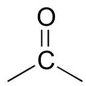

fig 41

Now we only have two carbons and four hydrogens left to account for. The
proton spectrum tells us we have a methyl group (the 2.22 ppm singlet)
that is not split by neighboring protons. Looking at the table of
typical chemical shifts, we see that this chemical shift value is in the
range of a carbon next to a carbonyl.

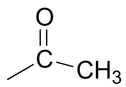

fig 42

Finally, there is one last proton at 5.10 ppm, also a singlet. Putting
the puzzle together, the only possibility that fits is
1,1-diphenyl-2-propanone:

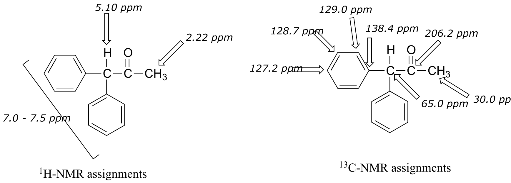

fig 43

## Section 5.8: Complex coupling in 1H-NMR spectra

In all of the examples of spin-spin coupling we saw in our discussion of
proton NMR, the observed splitting resulted from the coupling of one set
of protons to *just* *one* neighboring set of protons. When a set of
protons is coupled to *two* sets of nonequivalent neighbors, with
significantly different coupling constants, the result is a phenomenon
called **complex coupling**. A good illustration is provided by the
1H-NMR spectrum of methyl acrylate:

fig 45

Note that all three vinylic protons in methyl acrylate (designated above
as Ha, Hb and Hc) are separated from
each other by three bonds or less, and thus are all spin-coupled. For
example, Hc is *gem*-coupled to Hb (J = 1.5 Hz),
and Hc is also *trans*-coupled to Ha (J = 17.4
Hz). You might think that the n+1 rule would tell us that because
Hc has two nonequivalent neighbors - Ha and
Hb - its NMR signal should be a triplet. This would be
correct *if* Jac and Jbc were the same, or very
close. However, because the two coupling constants are in fact very
different from each other, the signal for Hc is clearly *not*
a triplet. Here is a further expansion of the Hc signal:

fig 46

You can see that the Hc signal is actually composed of four
sub-peaks. Why is this? A splitting diagram can help us to understand
what we are seeing. Ha is *trans* to Hc across the
double bond, and splits the Hc signal into a doublet with a
coupling constant of 3Jac = 17.4 Hz. In addition,
each of these Hc doublet sub-peaks is split again by
Hb (*geminal* coupling) into two more doublets, each with a
much smaller coupling constant of 2Jbc = 1.5 Hz.

fig 47

The result of this \`double splitting\` is a pattern referred to as a
**doublet of doublets**, abbreviated \`**dd**\`.

The reported chemical shift of Hc is 6.210 ppm, the average
of the four sub-peaks.

<u>Exercise 5.21</u>: Assume that on a 300 MHz spectrometer, the
chemical shift of Hc, expressed in Hz, is 1863.0 Hz. What is
the chemical shift, to the nearest 0.1 Hz, of the furthest upfield
subpeak in the Hc signal?

The signal for Ha at 5.950 ppm is also a doublet of doublets,
with coupling constants 3Jac = 17.4 Hz and
3Jab = 10.5 Hz.

fig 48

The signal for Hb at 5.64 ppm is split into a doublet by
Ha, a *cis* coupling with 3Jab = 10.4
Hz. Each of the resulting sub-peaks is split again by Hc,
with the same *geminal* coupling constant 2Jbc =
1.5 Hz that we saw previously when we looked at the Hc
signal. The overall result is again a doublet of doublets, this time
with the two \`sub-doublets\` spaced slightly closer due to the smaller
coupling constant for the *cis* interaction.

<u>Exercise 5.22</u> : Construct a splitting diagram for the
Hb signal in the 1H-NMR spectrum of methyl
acrylate. The chemical shift of Hb, in Hz, is 1691 Hz - label
the chemical shifts (in Hz) of each of the four sub-peaks.

<u>Exercise 5.23</u>: Explain how the signals for Hb and
Hc of methyl acrylate can be unambiguously assigned.

When constructing a splitting diagram to analyze complex coupling
patterns, it is conventional (and simpler) to show the broader splitting
first, followed by the finer splitting: thus we show the broad
Ha-Hc splitting first, then the fine
Hb-Hc splitting.

In the methyl acrylate spectrum, the signals for each of the three
vinylic protons was a doublet of doublets (abbreviated 'dd'). Other
complex splitting patterns are possible: triplet of doublets (td),
doublet of triplets (dt), doublet of quartets (dq), and so on. Remember
that the broader splitting is listed first, thus a triplet of doublets
is different from a doublet of triplets.

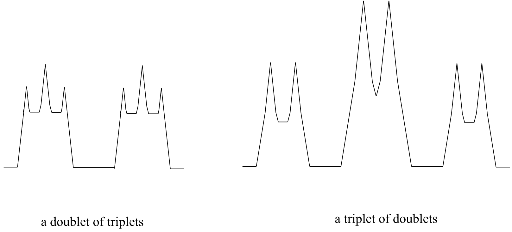

fig 50

<u>Exercise 5.24:</u> Draw a predicted splitting diagram for the signal
corresponding to Hb in the structure below, using approximate
coupling constants. What would you call the splitting pattern for the
Hb signal in this example?

 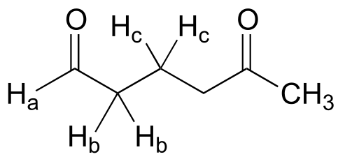

fig 49

<u>Exercise 5.25</u>: A signal in a proton NMR spectrum has multiple
sub-peaks with the following chemical shifts values, expressed in Hz:
1586, 1583, 1580, 1572, 1569, 1566. Identify the splitting pattern, and
give the coupling constant(s) and the overall chemical shift value (in
Hz).

When we start trying to analyze complex splitting patterns in larger
molecules, we gain an appreciation for why scientists are willing to pay
large sums of money (hundreds of thousands of dollars) for higher-field
NMR instruments. Quite simply, the stronger our magnet is, the more
resolution we get in our spectrum. In a 100 MHz instrument (with a
magnet of approximately 2.4 Tesla field strength), the 12 ppm frequency
'window' in which we can observe proton signals is 1200 Hz wide. In a
500 MHz (\~12 Tesla) instrument, however, the window is 6000 Hz - five
times wider. In this sense, NMR instruments are like digital cameras and
HDTVs: better resolution means more information and clearer pictures
(and higher price tags!)

**  
**

## Section 5.9: Other applications of NMR

<u>A: Magnetic resonance imaging</u>

In the introduction to this chapter, we heard two stories about people
whose lives were potentially saved when brain tumors were discovered
during a magnetic resonance imaging (MRI) scan. MRI is a powerful
diagnostic technique because it allows doctors to visualize internal
body tissues while sparing the patient from surgery and potentially
harmful, high energy x-rays. The basis for MRI is essentially the same
as for NMR: an MRI scanner has a very strong superconducting magnet
large enough to completely surround a whole person, much the same way in
which a small glass sample tube in an NMR experiment is surrounded by
the instrument's magnet. Once exposed to the strong magnetic field,
water protons in the body resonate at different radio frequencies - the
variation in resonance frequencies is due to water binding in different
ways to different tissue types, creating slightly different electronic
environments for the protons. The software in the MRI scanner then
translates variations in resonance frequencies to a color scheme, which
creates a visual image of the body tissues in the scanned area.

A typical MRI scanner (credit Liz West:
https://www.flickr.com/photos/calliope/)

<u>B: NMR of proteins and peptides</u>

In this chapter you have learned enough about NMR to be able to
understand how it is used to solve the structures of relatively small
organic molecules. But what about really big organic molecules, like
proteins?

X-ray crystallography, not NMR, is the most common way to determine the
precise three-dimensional structure of a protein, and in a biochemistry
class you will look at many images of protein structures derived from
x-ray crystallography. While it is an immensely powerful tool for
analyzing protein structure, crystallography has two major drawbacks.
First, it relies on a researcher being able to get a protein to form
regular, ordered crystals, which can be very challenging. Most proteins
are globular, meaning they are (very roughly) spherical in shape. For a
molecule to form crystals, it must pack together tightly in an ordered,
repeating way: think of a neat stack of cube-shaped objects. Spheres,
however, are inherently difficult to pack this way. Imagine trying to
make a pile of tennis balls - they just roll apart, because so little of
each ball's surface area comes into contact with its neighbor, thus
there is very little friction (ie. noncovalent interactions!) holding
them together. A large percentage of known proteins simply will not
crystallize under any conditions that have been tried - therefore, we
cannot determine their structure using x-ray crystallography.

Secondly, a lot of what is most interesting about proteins is how they
move: flaps open and close when a substrate binds, or one part of the
protein moves over to connect with another part. Protein action is
dynamic. A crystal, on the other had, is static, or frozen. A protein
structure determined by x-ray crystallography is like a still photograph
of leaping dancer: we can infer from the picture what kind of movement
might be taking place, but we can't get a full appreciation of the
motion.

This leads to NMR, which of course is done in solution. It is easy to
get most proteins into aqueous solution, so there are no worries about
trying to make crystals. Also, a protein in solution is free to move, so
NMR can potentially capture elements of protein dynamics. So why don't
scientists always use NMR to look at proteins?

Structure of an intestinal fatty acid binding protein determined by NMR

(credit: Wikipedia commons: https://commons.wikimedia.org/wiki/User:Emw;

[*Biochemistry* **2003**, *42*,
7339](http://pubs.acs.org/doi/abs/10.1021/bi0273617))

After working through a few NMR structure determination problems in this
chapter, you have an appreciation for the brainwork required to figure
out the structure of a small organic molecule based on its NMR
structure: now imagine doing this with a protein, with its thousands of
carbon and hydrogen atoms! Nevertheless, spectroscopists are gradually
getting better and better at using NMR and computer-power to do just
this. The advanced NMR techniques and methods of analysis are far beyond
the scope of our discussion here, but you can see how useful it could be
to protein scientists to be able to 'see' what a protein looks like
using NMR, and if you are interested in this area of research you can
learn about it in more advanced courses.

Note: The [Spectral Database of Organic
Compounds](http://sdbs.db.aist.go.jp/sdbs/cgi-bin/cre_index.cgi) is a
great resource for looking at NMR spectra (both proton and carbon) for a
large number of compounds - the more examples you see, the better!

## Summary of Key Concepts

*Before moving on to the next chapter, you should:*

Be able to identify groups of chemically equivalent protons and carbon
atoms in a structure.

Be able to explain the basis of an NMR experiment in terms of the spin
state of a nucleus, the ground state to excited state transition
involved, and the frequency of radiation absorbed.

Understand the differences between proton and carbon NMR experiments,
and explain why carbon spectra generally have more noise, do not show
coupling, and do not suffer from the disadvantage of overlapping peaks.
You should be able to explain why 13C-NMR peaks are not
usually integrated.

Understand how to look at an NMR spectrum, including the meaning of the
ppm label on the x-axis, the meaning of 'chemical shift', and the
definition of zero ppm on the chemical shift scale.

Be able to predict trends in chemical shifts for protons and carbon
atoms in different bonding positions, and provide a rationale for the
trend. You should also be able to roughly estimate the chemical shift of
a given proton or carbon using Table X or a similar table from another
source.

Understand how to use proton peak integration values to determine how
many protons a particular peak is 'worth'.

Be able to explain the physical basis for spin-spin coupling in
1H-NMR spectra, and be able to use the 'n+1 rule'.

Be able to interpret, and draw splitting diagrams for, 1H-NMR
spectra with complex coupling.

Be able to use a 13C-NMR spectrum to identify the number of
magnetically nonequivalent types of carbon in an unknown compound.”

Be confident at working problems in which you are asked to match
structures to 1H- and/or 13C-NMR spectra.

Given a molecular formula (or a combination of combustion and MS data),
you should be confident in your ability to solve an unknown structure
based on a 1H- spectrum, possibly in combination with data
from 13C-NMR, IR, or UV-Vis spectroscopy.

**  
**

## Problems

**P5.1**:

a\) For each molecule below, draw in all hydrogen atoms, and label them
Ha, Hb, etc., with chemically equivalent hydrogens
having the same label.

b\) Predict splitting patterns for all proton signals.

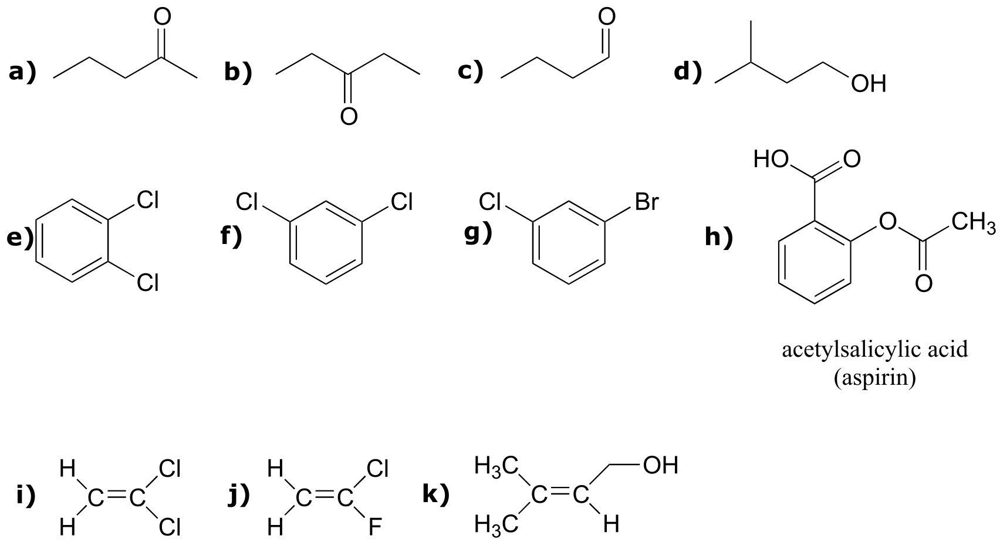

**P5.2:** For each of the 20 common amino acids, predict the number of
signals in the proton-decoupled 13C-NMR spectrum.

**P5.3:** Match spectra below to their corresponding structures A-F.
Make complete peak assignments for all structures.

*(in all 1H-NMR data tables in the following problems, peak
relative integration values are listed in which the smallest area peak
is equal to 1)*

<u>  
</u>

<u>Structures:</u>

<u>Spectrum 1:</u> 1-941C (structure D)

| **δ (ppm)** | **splitting** | **integration** |
|-------------|---------------|-----------------|
| 4.13        | q             | 2               |
| 2.45        | t             | 2               |
| 1.94        | p             | 1               |
| 1.27        | t             | 3               |

<u>Spectrum 2:</u> 1-941B (structure F)

| **δ (ppm)** | **splitting** | **integration** |
|-------------|---------------|-----------------|
| 3.68        | s             | 3               |
| 2.99        | t             | 2               |
| 1.95        | p             | 1               |

<u>Spectrum 3</u>: 1-940B (structure C)

| **δ (ppm)** | **splitting** | **integration** |
|-------------|---------------|-----------------|
| 4.14        | q             | 1               |
| 2.62        | s             | 1               |
| 1.26        | t             | 1.5             |

<u>Spectrum 4:</u> 1-939C (structure B)

| **δ (ppm)** | **splitting** | **integration** |
|-------------|---------------|-----------------|
| 4.14        | q             | 4               |
| 3.22        | s             | 1               |
| 1.27        | t             | 6               |
| 1.13        | s             | 9               |

<u>Spectrum 5:</u> 1-938C (structure A)

| **d (ppm)** | **splitting** | **integration** |
|-------------|---------------|-----------------|
| 4.18        | q             | 1               |
| 1.92        | q             | 1               |
| 1.23        | t             | 1.5             |
| 0.81        | t             | 1.5             |

<u>Spectrum 6</u>: 1-940A (structure E)

| **d (ppm)** | **splitting** | **integration** |
|-------------|---------------|-----------------|
| 3.69        | s             | 1.5             |
| 2.63        | s             | 1               |

**P5.4:** Match the 1H-NMR spectra 7-12 to their
corresponding structures G-L. Make complete peak assignments for all
structures.

<u>Structures</u>:

<u>  
</u>

<u>Spectrum 7</u>: (2-265C, structure HH)

| **δ (ppm)** | **splitting** | **integration** |
|-------------|---------------|-----------------|
| 6.98        | d             | 1               |
| 6.64        | d             | 1               |
| 6.54        | s             | 1               |
| 4.95        | s             | 1               |
| 2.23        | s             | 3               |
| 2.17        | s             | 3               |

<u>Spectrum 8</u>: (2-266A, structure KK)

| **δ (ppm)** | **splitting** | **integration** |
|-------------|---------------|-----------------|
| 7.08        | d             | 1               |
| 6.72        | d             | 1               |
| 6.53        | s             | 1               |
| 4.81        | s             | 1               |
| 3.15        | septet        | 1               |
| 2.24        | s             | 3               |
| 1.22        | d             | 6               |

<u>Spectrum 9</u>: (2-1212B, structure LL)

| **δ (ppm)** | **splitting** | **integration** |
|-------------|---------------|-----------------|
| 7.08        | d             | 2               |
| 6.71        | d             | 2               |
| 6.54        | s             | 1               |
| 3.69        | s             | 3               |
| 3.54        | s             | 2               |

<u>Spectrum 10</u>: (2-1366A, structure GG)

| **δ (ppm)** | **splitting** | **integration** |
|-------------|---------------|-----------------|
| 9.63        | s             | 1               |
| 7.45        | d             | 2               |
| 6.77        | d             | 2               |
| 3.95        | q             | 2               |
| 2.05        | s             | 3               |
| 1.33        | t             | 3               |

<u>  
</u>

<u>Spectrum 11</u>: (2-1366B, structure JJ)

| **δ (ppm)** | **splitting** | **integration** |
|-------------|---------------|-----------------|
| 9.49        | s             | 1               |
| 7.20        | d             | 2               |
| 6.49        | d             | 2               |
| 4.82        | s             | 2               |
| 1.963       | s             | 3               |

<u>Spectrum 12</u>: (2-1368C, structure II)

| **δ (ppm)** | **splitting** | **integration** |
|-------------|---------------|-----------------|
| 9.58        | s(b)          | 1               |
| 9.31        | s             | 1               |
| 7.36        | d             | 1               |
| 6.67        | s             | 1               |
| 6.55        | d             | 1               |
| 2.21        | s             | 3               |
| 2.11        | s             | 3               |

**P5.5:** Match the 1H-NMR spectra 13-18 to their
corresponding structures M-R. Make complete peak assignments for all
structures.

<u>Structures</u>:

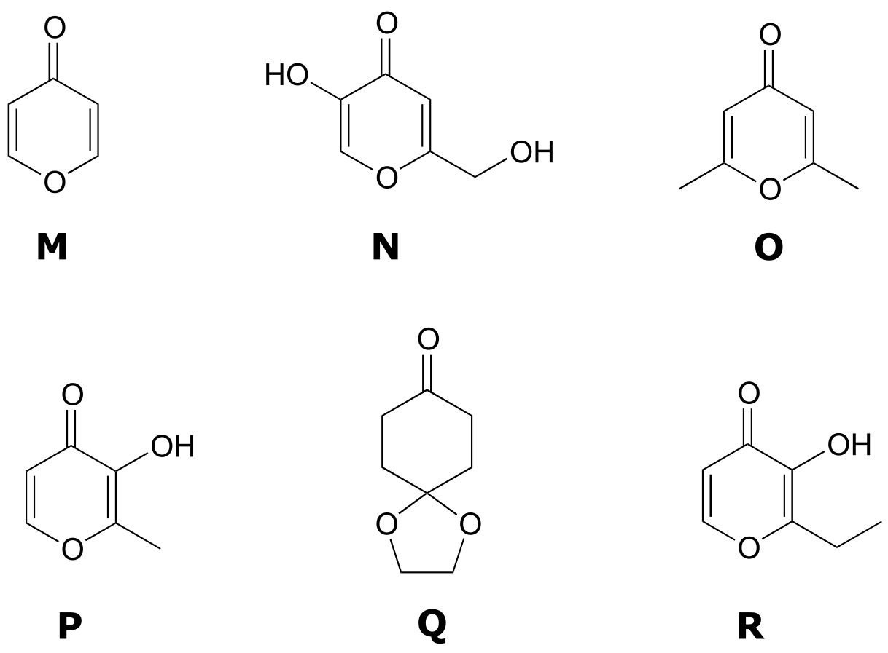

<u>Spectrum 13</u>: 1-723B (structure M)

| **δ (ppm)** | **splitting** | **integration** |
|-------------|---------------|-----------------|
| 8.15        | d             | 1               |
| 6.33        | d             | 1               |

<u>Spectrum 14</u>: 1-723C (structure O)

| **δ (ppm)** | **splitting** | **integration** |
|-------------|---------------|-----------------|
| 6.05        | s             | 1               |
| 2.24        | s             | 3               |

<u>Spectrum 15</u>: (1-724A, structure P)

| **δ (ppm)** | **splitting** | **integration** |
|-------------|---------------|-----------------|
| 8.57        | s (b)         | 1               |
| 7.89        | d             | 1               |
| 6.30        | d             | 1               |
| 2.28        | s             | 3               |

<u>  
Spectrum 16</u>: (1-724C, structure N)

| **δ (ppm)** | **splitting** | **integration** |
|-------------|---------------|-----------------|
| 9.05        | s (b)         | 1               |
| 8.03        | s             | 1               |
| 6.34        | s             | 1               |
| 5.68        | s (b)         | 1               |
| 4.31        | s             | 2               |

<u>Spectrum 17</u>: (1-724B, structure R)

| **δ (ppm)** | **splitting** | **integration** |
|-------------|---------------|-----------------|
| 7.76        | d             | 1               |
| 7.57        | s (b)         | 1               |
| 6.44        | d             | 1               |
| 2.78        | q             | 2               |
| 1.25        | t             | 3               |

<u>Spectrum 18</u>: (1-722-C, structure Q)

| **δ (ppm)** | **splitting** | **integration** |
|-------------|---------------|-----------------|
| 4.03        | s             | 1               |
| 2.51        | t             | 1               |
| 2.02        | t             | 1               |

**P5.6:** Match the 1H-NMR spectra 19-24 below to their
corresponding structures S-X. Make complete peak assignments for all
structures.

<u>Structures</u>:

<u>Spectrum 19</u>: (2-938C, structure X)

| **δ (ppm)** | **splitting** | **integration** |
|-------------|---------------|-----------------|
| 9.94        | s             | 1               |
| 7.77        | d             | 2               |
| 7.31        | d             | 2               |
| 2.43        | s             | 3               |

<u>Spectrum 20</u>: (2-938B, structure W)

| **δ (ppm)** | **splitting** | **integration** |
|-------------|---------------|-----------------|
| 10.14       | s             | 2               |
| 8.38        | s             | 1               |
| 8.17        | d             | 2               |
| 7.75        | t             | 1               |

<u>Spectrum 21:</u>: (2-940B, structure T)

| **δ (ppm)** | **splitting** | **integration** |
|-------------|---------------|-----------------|
| 9.98        | s             | 1               |
| 7.81        | d             | 2               |
| 7.50        | d             | 2               |

<u>Spectrum 22</u>: (2-789A, structure V)

| **δ (ppm)** | **splitting** | **integration** |
|-------------|---------------|-----------------|
| 7.15-7.29   | m             | 2.5             |
| 2.86        | t             | 1               |
| 2.73        | t             | 1               |
| 2.12        | s             | 1.5             |

<u>Spectrum 23</u>: (2-794B, structure S)

| **δ (ppm)** | **splitting** | **integration** |
|-------------|---------------|-----------------|
| 7.10        | d             | 1               |
| 6.86        | d             | 1               |
| 3.78        | s             | 1.5             |
| 3.61        | s             | 1               |
| 2.12        | s             | 1.5             |

<u>Spectrum 24</u>: (2-791C, structure U)

| **δ (ppm)** | **splitting** | **integration** |
|-------------|---------------|-----------------|
| 7.23-7.30   | m             | 1               |
| 3.53        | s             | 1               |

**P5.7:** Match the 1H-NMR spectra 25-30 below to their
corresponding structures AA-FF.

<u>Structures</u>:

<u>Spectrum 25</u>: (2-939A, structure FF)

| **δ (ppm)** | **splitting** | **integration** |
|-------------|---------------|-----------------|
| 9.96        | s             | 1               |
| 7.79        | d             | 2               |
| 7.33        | d             | 2               |
| 2.72        | q             | 2               |
| 1.24        | t             | 3               |

<u>Spectrum 26</u>: (2-943C, structure BB)

| **δ (ppm)** | **splitting** | **integration** |
|-------------|---------------|-----------------|
| 9.73        | s             | 1               |
| 7.71        | d             | 2               |
| 6.68        | d             | 2               |
| 3.06        | s             | 6               |

<u>Spectrum 27</u>: (2-790A, structure AA)

| **δ (ppm)** | **splitting** | **integration** |
|-------------|---------------|-----------------|
| 11.2 (b)    | s             | 1               |
| 7.20-7.35   | m             | 10              |
| 5.12        | s             | 1               |
| 2.22        | s             | 3               |

<u>Spectrum 28</u>: (2-1201A, structure CC)

| **δ (ppm)** | **splitting** | **integration** |
|-------------|---------------|-----------------|
| 8.08        | s             | 1               |
| 7.29        | d             | 2               |
| 6.87        | d             | 2               |
| 5.11        | s             | 2               |
| 3.78        | s             | 3               |

<u>Spectrum 29</u>: (2-455B, structure EE)

| **δ (ppm)** | **splitting** | **integration** |
|-------------|---------------|-----------------|
| 7.18        | d             | 1               |
| 6.65        | m             | 1.5             |
| 3.2         | q             | 2               |
| 1.13        | t             | 3               |

<u>Spectrum 30</u>: (3-85C, structure DD)

| **δ (ppm)** | **splitting** | **integration** |
|-------------|---------------|-----------------|
| 8.32        | s             | 1               |
| 4.19        | t             | 2               |
| 2.83        | t             | 2               |
| 2.40        | s             | 3               |

**P5.8:**

13C-NMR data is given for the molecules shown below. Complete
the peak assignment column of each NMR data table.

**a)** (1-895C)

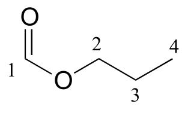

| **δ (ppm)** |                | **carbon \#(s)** |
|-------------|----------------|------------------|
| 161.12      | CH             |                  |
| 65.54       | CH2 |                  |
| 21.98       | CH2 |                  |
| 10.31       | CH3 |                  |

**b)** (1-735A) (check splitting)

| **δ (ppm)** |                | **carbon \#(s)** |
|-------------|----------------|------------------|
| 194.72      | C              |                  |
| 149.10      | C              |                  |
| 146.33      | CH             |                  |
| 16.93       | CH2 |                  |
| 14.47       | CH3 |                  |
| 12.93       | CH3 |                  |

**c)** (1-938)

| **δ (ppm)** |                | **carbon \#(s)** |
|-------------|----------------|------------------|
| 171.76      | C              |                  |
| 60.87       | CH2 |                  |
| 58.36       | C              |                  |
| 24.66       | CH2 |                  |
| 14.14       | CH3 |                  |
| 8.35        | CH3 |                  |

**d)** (2-1212B)

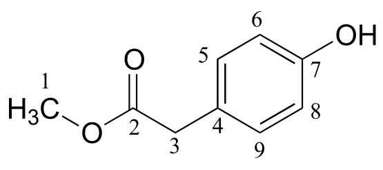

| **δ (ppm)** |                | **carbon \#(s)** |
|-------------|----------------|------------------|
| 173.45      | C              |                  |
| 155.01      | C              |                  |
| 130.34      | CH             |                  |
| 125.34      | C              |                  |
| 115.56      | CH             |                  |
| 52.27       | CH3 |                  |
| 40.27       | CH2 |                  |

**e**) (2-455B)

| **δ (ppm)** |                | **carbon \#(s)** |
|-------------|----------------|------------------|
| 147.79      | C              |                  |
| 129.18      | CH             |                  |
| 115.36      | CH             |                  |
| 111.89      | CH             |                  |
| 44.29       | CH2 |                  |
| 12.57       | CH3 |                  |

**P5.9:** Use the NMR data given to deduce structures.

a ) Molecular formula: C5H8O

**1-734A**

<u>1H-NMR:</u>

| **δ (ppm)** | **splitting** | **integration** |
|-------------|---------------|-----------------|
| 9.56        | s             | 1               |
| 6.25        | d             | 1               |
| 5.99        | d             | 1               |
| 2.27        | q             | 2               |
| 1.18        | t             | 3               |

<u>13C-NMR</u>

| **δ (ppm)** |                |
|-------------|----------------|
| 194.60      | CH             |
| 151.77      | C              |
| 132.99      | CH2 |
| 20.91       | CH2 |
| 11.92       | CH3 |

b\) Molecular formula: C7H14O2

**1-905B** (IR 362E)

<u>1H-NMR:</u>

| **δ (ppm)** | **splitting** | **integration** |
|-------------|---------------|-----------------|
| 3.85        | d             | 2               |
| 2.32        | q             | 2               |
| 1.93        | m             | 1               |
| 1.14        | t             | 3               |
| 0.94        | d             | 6               |

<u>13C-NMR</u>

| **δ (ppm)** |                |
|-------------|----------------|
| 174.47      | C              |
| 70.41       | CH2 |
| 27.77       | CH             |
| 27.64       | CH2 |
| 19.09       | CH3 |
| 9.21        | CH3 |

c\) Molecular weight: 88

**1-170B** (IR: 68D) C5H12O

<u>Combustion analysis:</u>

C: 68.2%

H: 13.6%

<u>IR:</u> \~3349 cm-1 (broad)

<u>1H-NMR:</u>

| **δ (ppm)** | **splitting** | **integration** |
|-------------|---------------|-----------------|
| 3.38        | s             | 2H              |
| 2.17        | s             | 1H              |
| 0.91        | s             | 9H              |

<u>13C-NMR</u>

| **δ (ppm)** |                |
|-------------|----------------|
| 73.35       | CH2 |
| 32.61       | C              |
| 26.04       | CH3 |

d\) Molecular weight: 148

**2-789B** (IR: 848C) C10H12O

<u>Combustion analysis:</u>

C: 81.1%

H: 8.1%

<u>  
</u>

<u>IR:</u> 1713 cm-1 (strong)

<u>1H-NMR:</u>

| **δ (ppm)** | **splitting** | **integration** |
|-------------|---------------|-----------------|
| 7.18-7.35   | m             | 2.5             |
| 3.66        | s             | 1               |
| 2.44        | q             | 1               |
| 1.01        | t             | 1.5             |

<u>13C-NMR</u>

| **δ (ppm)** |                |
|-------------|----------------|
| 208.79      | C              |
| 134.43      | C              |
| 129.31      | CH             |
| 128.61      | CH             |
| 126.86      | CH             |
| 49.77       | CH2 |
| 35.16       | CH2 |
| 7.75        | CH3 |

**P5.10:** You obtain the following data for an unknown sample. Deduce
its structure.

<u>Combustion analysis</u>: C (69.7%); H (11.7%)

<u>Mass Spectrometry:</u>

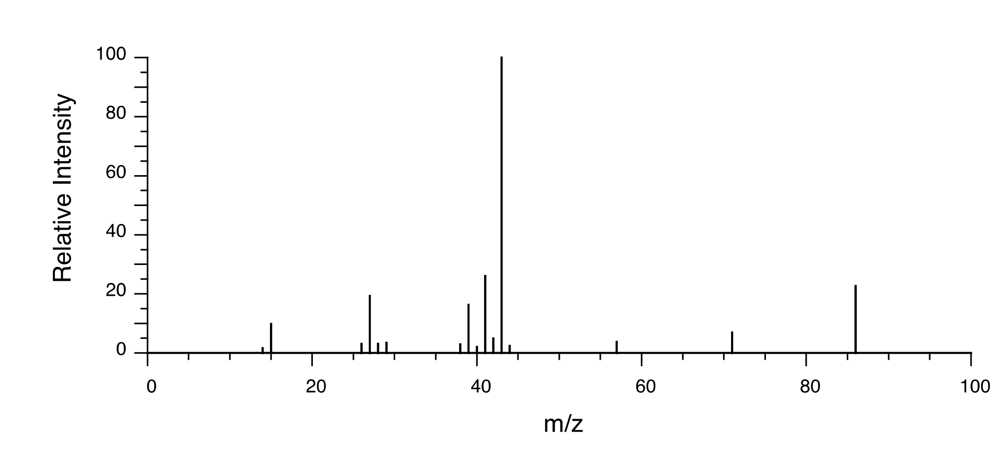

(3-methyl-2-butanone)

<u>1H-NMR:</u>

<u>13C-NMR</u>:

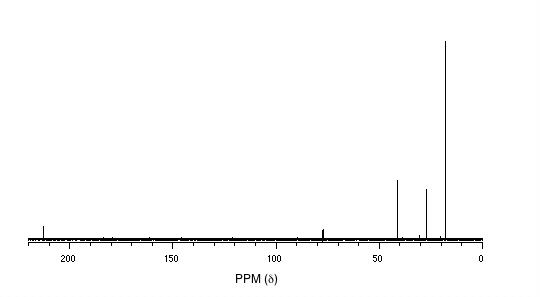

<u>  
</u>

**P5.11:** You take a1H-NMR spectrum of a sample that comes
from a bottle of 1-bromopropane. However, you suspect that the bottle
might be contaminated with 2-bromopropane. The NMR spectrum shows the
following peaks:

| **δ (ppm)** | **splitting** | **Integration** |
|-------------|---------------|-----------------|
| 4.3         | septet        | 0.0735          |
| 3.4         | t             | 0.661           |
| 1.9         | sextet        | 0.665           |
| 1.7         | d             | 0.441           |
| 1.0         | t             | 1.00            |

How badly is the bottle contaminated? Specifically, what percent of the
molecules in the bottle are 2-bromopropane?

**P5.12:**

a\) The proton-decoupled 13C-NMR spectrum of isopentenyl
diphosphate, the building block compound for isoprenoids (see section
1.3) is composed of five signals, two of which are doublets. Explain.

b\) Recall that other magnetically active nuclei besides 1H
and 13C can be observed by NMR. Without trying to predict
chemical shift values, describe what the 31P-NMR spectrum for
isopentenyl diphosphate might look like.

