# Frontmatter
**Tim Soderberg**

**University of Minnesota, Morris**

**January 2016**

**  
**

This work is licensed under the Creative Commons
Attribution-NonCommercial-ShareAlike 4.0 International License.
https://creativecommons.org/licenses/by-nc-sa/4.0/

Notes to the reader:

This textbook is intended for a sophomore-level, two-semester course in
Organic Chemistry targeted at Biology, Biochemistry, and Health Science
majors. It is assumed that readers have taken a year of General
Chemistry and college level Introductory Biology, and are concurrently
enrolled in the typical Biology curriculum for sophomore Biology/Health
Sciences majors.

The book is meant to be a constantly evolving work in progress, and as
such, feedback from students, instructors, and all other readers is
greatly appreciated. Please send any comments, suggestions, or
notification of errors to the author at

**soderbt@morris.umn.edu**

If you are looking at a black and white printed version of this
textbook, please be aware that most of the figures throughout are meant
to contain color, which is used to help the reader to understand the
concepts being illustrated. It will often be very helpful to refer to
the full-color figures and internet links in a digital PDF version of
the book, which is available for free download at:

<http://facultypages.morris.umn.edu/~soderbt/textbook_website.htm>

The digital book is continuously being updated, so please check back to
this site periodically to download the most recent version.

# Table of Contents

[Notes to the reader: [iii](#_Toc80709006)](#_Toc80709006)

[Chapter 1: Introduction to organic structure and bonding, part I
[1](#chapter-1-introduction-to-organic-structure-and-bonding-part-i)](#chapter-1-introduction-to-organic-structure-and-bonding-part-i)

[Section 1.1: Drawing organic structures
[5](#section-1.1-drawing-organic-structures)](#section-1.1-drawing-organic-structures)

[1.1A: Formal charges [5](#a-formal-charges)](#a-formal-charges)

[1.1B: Common bonding patterns in organic structures
[11](#b-common-bonding-patterns-in-organic-structures)](#b-common-bonding-patterns-in-organic-structures)

[1.1C: Using condensed structures and line structures
[15](#c-using-condensed-structures-and-line-structures)](#c-using-condensed-structures-and-line-structures)

[1.1D: Constitutional isomers
[17](#d-constitutional-isomers)](#d-constitutional-isomers)

[Section 1.2: Functional groups and organic nomenclature
[18](#section-1.2-functional-groups-and-organic-nomenclature)](#section-1.2-functional-groups-and-organic-nomenclature)

[1.2A: Functional groups in organic compounds
[18](#a-functional-groups-in-organic-compounds)](#a-functional-groups-in-organic-compounds)

[1.2B: Naming organic compounds
[27](#b-naming-organic-compounds)](#b-naming-organic-compounds)

[1.2C: Abbreviated organic structures
[32](#c-abbreviated-organic-structures)](#c-abbreviated-organic-structures)

[Section 1.3: Structures of important classes of biological molecules
[35](#section-1.3-structures-of-important-classes-of-biological-molecules)](#section-1.3-structures-of-important-classes-of-biological-molecules)

[1.3A: Lipids [35](#a-lipids)](#a-lipids)

[1.3B: Biopolymer basics
[39](#b-biopolymer-basics)](#b-biopolymer-basics)

[1.3C: Carbohydrates [39](#c-carbohydrates)](#c-carbohydrates)

[1.3D Amino acids and proteins
[41](#d-amino-acids-and-proteins)](#d-amino-acids-and-proteins)

[1.3E: Nucleic Acids (DNA and RNA)
[43](#e-nucleic-acids-dna-and-rna)](#e-nucleic-acids-dna-and-rna)

[Summary of Key Concepts
[46](#summary-of-key-concepts)](#summary-of-key-concepts)

[Problems [47](#problems)](#problems)

[Chapter 2: Introduction to organic structure and bonding, part II
[51](#chapter-2-introduction-to-organic-structure-and-bonding-part-ii)](#chapter-2-introduction-to-organic-structure-and-bonding-part-ii)

[Section 2.1: Covalent bonding in organic molecules: valence bond theory
[53](#section-2.1-covalent-bonding-in-organic-molecules-valence-bond-theory)](#section-2.1-covalent-bonding-in-organic-molecules-valence-bond-theory)

[2.1A: The σ bond in the H2 molecule
[54](#a-the-σ-bond-in-the-h2-molecule)](#a-the-σ-bond-in-the-h2-molecule)

[2.1B: *sp3* hybrid orbitals and tetrahedral bonding
[56](#b-sp3-hybrid-orbitals-and-tetrahedral-bonding)](#b-sp3-hybrid-orbitals-and-tetrahedral-bonding)

[2.1C*: sp2* and *sp* hybrid orbitals and π bonds
[61](#c-sp2-and-sp-hybrid-orbitals-and-π-bonds)](#c-sp2-and-sp-hybrid-orbitals-and-π-bonds)

[Section 2.2: Molecular orbital theory, conjugation, and aromaticity
[67](#section-2.2-molecular-orbital-theory-conjugation-and-aromaticity)](#section-2.2-molecular-orbital-theory-conjugation-and-aromaticity)

[2.2A: Another look at the H2 molecule using molecular
orbital theory
[67](#a-another-look-at-the-h2-molecule-using-molecular-orbital-theory)](#a-another-look-at-the-h2-molecule-using-molecular-orbital-theory)

[2.2B: Molecular orbital theory and conjugated π bonds
[69](#b-molecular-orbital-theory-and-conjugated-π-bonds)](#b-molecular-orbital-theory-and-conjugated-π-bonds)

[2.2C: Aromaticity [74](#c-aromaticity)](#c-aromaticity)

[Section 2.3: Resonance
[81](#section-2.3-resonance)](#section-2.3-resonance)

[2.3A: What is resonance?
[81](#a-what-is-resonance)](#a-what-is-resonance)

[2.3B: Resonance contributors for the carboxylate group
[82](#b-resonance-contributors-for-the-carboxylate-group)](#b-resonance-contributors-for-the-carboxylate-group)

[2.3C: Rules for drawing resonance structures
[86](#c-rules-for-drawing-resonance-structures)](#c-rules-for-drawing-resonance-structures)

[2.3D: Major vs minor resonance contributors
[89](#d-major-vs-minor-resonance-contributors)](#d-major-vs-minor-resonance-contributors)

[2.3E: Resonance and peptide bonds
[91](#e-resonance-and-peptide-bonds)](#e-resonance-and-peptide-bonds)

[Section 2.4: Non-covalent interactions
[95](#section-2.4-non-covalent-interactions)](#section-2.4-non-covalent-interactions)

[2.4A: Dipoles [96](#a-dipoles)](#a-dipoles)

[2.4B: Ion-ion, dipole-dipole and ion-dipole interactions
[98](#b-ion-ion-dipole-dipole-and-ion-dipole-interactions)](#b-ion-ion-dipole-dipole-and-ion-dipole-interactions)

[2.4C: Van der Waals forces
[99](#c-van-der-waals-forces)](#c-van-der-waals-forces)

[2.4D: Hydrogen bonds [99](#d-hydrogen-bonds)](#d-hydrogen-bonds)

[Section 2.5: Physical properties of organic compounds
[102](#section-2.5-physical-properties-of-organic-compounds)](#section-2.5-physical-properties-of-organic-compounds)

[2.5A: Solubility [102](#a-solubility)](#a-solubility)

[2.5B: Boiling point and melting point
[110](#b-boiling-point-and-melting-point)](#b-boiling-point-and-melting-point)

[2.5C: Physical properties of lipids and proteins
[112](#c-physical-properties-of-lipids-and-proteins)](#c-physical-properties-of-lipids-and-proteins)

[Summary of Key Concepts
[116](#summary-of-key-concepts-1)](#summary-of-key-concepts-1)

[Problems [117](#problems-1)](#problems-1)

[Chapter 3: Conformation and stereochemistry
[130](#chapter-3-conformation-and-stereochemistry)](#chapter-3-conformation-and-stereochemistry)

[Section 3.1: Conformations of open-chain organic molecules
[133](#section-3.1-conformations-of-open-chain-organic-molecules)](#section-3.1-conformations-of-open-chain-organic-molecules)

[Chapter 7
[331](#chapter-7-acid-base-reactions)](#chapter-7-acid-base-reactions)

[Acid-base reactions
[331](#chapter-7-acid-base-reactions)](#chapter-7-acid-base-reactions)

[Section 7.1: Overview of acid-base reactions
[335](#section-7.1-overview-of-acid-base-reactions)](#section-7.1-overview-of-acid-base-reactions)

[7.1A: The Brønsted-Lowry definition of acidity and basicity
[335](#a-the-brønsted-lowry-definition-of-acidity-and-basicity)](#a-the-brønsted-lowry-definition-of-acidity-and-basicity)

[7.1B: The Lewis definition of acidity and basicity
[337](#b-the-lewis-definition-of-acidity-and-basicity)](#b-the-lewis-definition-of-acidity-and-basicity)

[Section 7.2: The acidity constant
[338](#section-7.2-the-acidity-constant)](#section-7.2-the-acidity-constant)

[7.2A: Defining the acidity constant
[338](#a-defining-the-acidity-constant)](#a-defining-the-acidity-constant)

[7.2B: Using pKa values to predict reaction equilibria
[342](#b-using-pka-values-to-predict-reaction-equilibria)](#b-using-pka-values-to-predict-reaction-equilibria)

[Section 7.3: Structural effects on acidity and basicity
[346](#section-7.3-structural-effects-on-acidity-and-basicity)](#section-7.3-structural-effects-on-acidity-and-basicity)

[We know that HCl (pKa -7) is a stronger acid than HF (pKa 3.2), so the
equilibrium for the reaction lies on the product side: the reaction is
exergonic, and a 'driving force' pushes reactant to product.
[350](#_Toc80709062)](#_Toc80709062)

[7.3B: Resonance effects
[350](#b-resonance-effects)](#b-resonance-effects)

[Section 7.4: Acid-base properties of phenols
[354](#section-7.4-acid-base-properties-of-phenols)](#section-7.4-acid-base-properties-of-phenols)

[Section 7.6: Carbon acids
[364](#section-7.6-carbon-acids)](#section-7.6-carbon-acids)

[Section 7.7: Polyprotic acids
[372](#section-7.7-polyprotic-acids)](#section-7.7-polyprotic-acids)

[Section 7.8: Effects of enzyme microenvironment on acidity and basicity
[373](#section-7.8-effects-of-enzyme-microenvironment-on-acidity-and-basicity)](#section-7.8-effects-of-enzyme-microenvironment-on-acidity-and-basicity)

[8.2B: Protonation state
[399](#b-protonation-state)](#b-protonation-state)

[Section 8.3: Electrophiles and carbocation stability
[404](#section-8.3-electrophiles-and-carbocation-stability)](#section-8.3-electrophiles-and-carbocation-stability)

[Now, back to our discussion of the electrophile in an SN1
reaction: [413](#_Toc80709070)](#_Toc80709070)

[SN1 reactions in general *do not* occur at methyl or primary
carbon electrophiles: the carbocation intermediates involved would be
too unstable and the rate-determining (carbocation-generating) step
would have a very high energy barrier. Substitution on these
electrophiles will occur through the SN2 pathway.
[413](#_Toc80709071)](#_Toc80709071)

[fig 37b [414](#_Toc80709072)](#_Toc80709072)

[Section 8.4: Leaving groups
[415](#section-8.4-leaving-groups)](#section-8.4-leaving-groups)

# 1: Introduction to organic structure and bonding, part I

Figure : Habanero peppers

**Habanero peppers**

(credit: https://www.flickr.com/photos/jeffreyww/)

It's a hot August evening at a park in the middle of North Hudson,
Wisconsin, a village of just under 4000 people on the St. Croix river in
the western edge of the state. A line of people are seated at tables set
up inside a canvas tent. In front of a cheering crowd of friends,
family, and neighbors, these brave souls are about to do battle . .
.with a fruit plate.

Unfortunately for the contestants, the fruit in question is the
habanero, one of the hotter varieties of chili pepper commonly found in
markets in North America. In this particular event, teams of five people
will race to be the first to eat a full pound of peppers. As the eating
begins, all seems well at first. Within thirty seconds, though, what
begins to happen is completely predictable and understandable to anyone
who has ever mistakenly poured a little to much hot sauce on the dinner
plate. Faces turn red, sweat and tears begin to flow, and a copious
amount of cold water is gulped down.

Although technically the contestants are competing against each other,
the real opponent in this contest - the cause of all the pain and
suffering - is the chemical compound 'capsaicin', the source of the heat
in hot chili peppers.

fig 1a

Composed of the four elements carbon, hydrogen, oxygen and nitrogen,
capsaicin is produced by the pepper plant for the purpose of warding off
hungry mammals. The molecule binds to and activates a mammalian receptor
protein called TrpV1, which in normal circumstances has the job of
detecting high temperatures and sending a signal to the brain - 'it's
hot, stay away!' This strategy works quite well on all mammalian species
except one: we humans (some of us, at least) appear to be alone in our
tendency to seek out the burn of the hot pepper in our food.

Interestingly, birds also have a heat receptor protein which is very
similar to the TrpV1 receptor in mammals, but birds are not at all
sensitive to capsaicin. There is an evolutionary logic to this: it is to
the pepper's advantage to be eaten by a bird rather than a mammal,
because a bird can spread the pepper seeds over a much wider area. The
region of the receptor which is responsible for capsaicin sensitivity
appears to be quite specific - in 2002, scientists were able to insert a
small segment of the (capsaicin-sensitive) rat TrpV1 receptor gene into
the non-sensitive chicken version of the gene, and the resulting
chimeric (mixed species) receptor was sensitive to capsaicin (*Cell*
**2002**, *108*, 421).

Back at the North Hudson Pepperfest, those with a little more common
sense are foregoing the painful effects of capsaicin overload and are
instead indulging in more pleasant chemical phenomena. A little girl
enjoying an ice cream cone is responding in part to the chemical action
of another organic compound called vanillin.

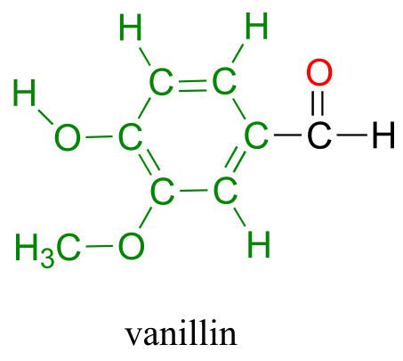

fig 1b

What is it about capsaicin and vanillin that causes these two compounds
to have such dramatically different effects on our sensory perceptions?
Both are produced by plants, and both are composed of the elements
carbon, hydrogen, oxygen, and (in the case of capsaicin) nitrogen. Since
the birth of chemistry as a science, chemists have been fascinated - and
for much of that history, mystified - by the myriad properties of
compounds that come from living things. The term 'organic', from the
Greek *organikos*, was applied to these compounds, and it was thought
that they contained some kind of 'vital force' which set them apart from
'inorganic' compounds such as minerals, salts, and metals, and which
allowed them to operate by a completely different set of chemical
principles. How else but through the action of a 'vital force' could
such a small subgroup of the elements combine to form compounds with so
many different properties?

Today, as you are probably already aware, the term 'organic,' - when
applied to chemistry - refers not just to molecules from living things,
but to all compounds containing the element carbon, regardless of
origin. Beginning early in the 19th century, as chemists learned through
careful experimentation about the composition and properties of
'organic' compounds such as fatty acids, acetic acid and urea, and even
figured out how to synthesize some of them starting with exclusively
'inorganic' components, they began to realize that the 'vital force'
concept was not valid, and that the properties of both organic and
inorganic molecules could in fact be understood using the same
fundamental chemical principles.

They also began to more fully appreciate the unique features of the
element carbon which makes it so central to the chemistry of living
things, to the extent that it warrants its own subfield of chemistry.
Carbon forms four stable bonds, either to other carbon atoms or to
hydrogen, oxygen, nitrogen, sulfur, phosphorus, or a halogen. The
characteristic bonding modes of carbon allow it to serve as a skeleton,
or framework, for building large, complex molecules that incorporate
chains, branches and ring structures.

Although 'organic chemistry' no longer means exclusively the study of
compounds from living things, it is nonetheless the desire to understand
and influence the chemistry of life that drives much of the work of
organic chemists, whether the goal is to learn something fundamentally
new about the reactivity of a carbon-oxygen bond, to discover a new
laboratory method that could be used to synthesize a life-saving drug,
or to better understand the intricate chemical dance that goes on in the
active site of an enzyme or receptor protein. Although humans have been
eating hot peppers and vanilla-flavored foods for centuries, we are just
now, in the past few decades, beginning to understand how and why one
causes searing pain, and the other pure gustatory pleasure. We
understand that the precise geometric arrangement of the four elements
in capsaicin allows it to fit inside the binding pocket of the TrpV1
heat receptor - but, as of today, we do not yet have a detailed three
dimensional picture of the TrpVI protein bound to capsaicin. We also
know that the different arrangement of carbon, hydrogen and oxygen atoms
in vanillin allows it to bind to specific olfactory receptors, but
again, there is much yet to be discovered about exactly how this
happens.

In this chapter, you will be introduced to some of the most fundamental
principles of organic chemistry. With the concepts we learn about, we
can begin to understand how carbon and a very small number of other
elements in the periodic table can combine in predictable ways to
produce a virtually limitless chemical repertoire.

As you read through, you will recognize that the chapter contains a lot
of review of topics you have probably learned already in an introductory
chemistry course, but there will likely also be a few concepts that are
new to you, as well as some topics which are already familiar to you but
covered at a greater depth and with more of an emphasis on biologically
relevant organic compounds.

We will begin with a reminder of how chemists depict bonding in organic
molecules with the 'Lewis structure' drawing convention, focusing on the
concept of 'formal charge'. We will review the common bonding patterns
of the six elements necessary for all forms of life on earth - carbon,
hydrogen, nitrogen, oxygen, sulfur, and phosphorus - plus the halogens
(fluorine, chlorine, bromine, and iodine). We'll then continue on with
some of the basic skills involved in drawing and talking about organic
molecules: understanding the 'line structure' drawing convention and
other useful ways to abbreviate and simplify structural drawings,
learning about functional groups and isomers, and looking at how to
systematically name simple organic molecules. Finally, we'll bring it
all together with a review of the structures of the most important
classes of biological molecules - lipids, carbohydrates, proteins, and
nucleic acids - which we will be referring to constantly throughout the
rest of the book.

Before you continue any further in your reading, you should do some
review of your own, because it will be assumed that you already
understand some basic chemistry concepts. It would be a very good idea
to go back to your introductory chemistry textbook or watch the
excellent video tutorials at [Khan
Academy](https://www.khanacademy.org/science/chemistry) (see links
below) to remind yourself about the following topics:

**Key topics to review from introductory chemistry**

[basics of atoms and
elements](https://www.khanacademy.org/science/chemistry/atomic-structure-and-properties/introduction-to-the-atom/v/elements-and-atoms)

[atomic
structure](https://www.khanacademy.org/science/chemistry/electronic-structure-of-atoms)

[orbitals](https://www.khanacademy.org/science/chemistry/electronic-structure-of-atoms/electron-configurations-jay-sal/v/orbitals)

[covalent and ionic
compounds](https://www.khanacademy.org/science/chemistry/atomic-structure-and-properties/introduction-to-compounds/v/introduction-to-ions)

[drawing Lewis
structures](https://www.khanacademy.org/science/organic-chemistry/gen-chem-review/dot-strcutures-jay/v/dot-structures-i-single-bonds-1)

**Atomic structure, electron configuration, and Lewis structure review
exercises**

<u>Exercise 1.1</u>: How many neutrons do the following isotopes have?

a\) 31P, the most common isotope of phosphorus

b\) 32P, a radioactive isotope of phosphorus used often in
the study of DNA and RNA.

c\) 37Cl, one of the two common isotopes of chlorine.

d\) tritium (3H), a radioactive isotope of hydrogen, used
often by biochemists as a 'tracer' atom.

e\) 14C, a radioactive isotope of carbon, also used as a
tracer in biochemistry.

<u>Exercise 1.2</u>: The electron configuration of a carbon atom is
1*s*22*s*22*p*2, and that of a sodium
cation (Na+) is
1*s*22*s*22*p*6. Show the electron
configuration for

a\) a nitrogen atom b) an oxygen atom

c\) a fluorine atom d) a magnesium atom

e\) a magnesium cation (Mg2+) f) a potassium atom

g\) a potassium ion (K+) h) a chloride anion (Cl-)

i\) a sulfur atom j) a lithium cation (Li+)

k\) a calcium cation (Ca2+)

<u>Exercise 1.3</u>: Draw Lewis structures for the following species
(use lines to denote bonds, dots for lone-pair electrons). All atoms
should have a complete valence shell of electrons. For now, do not worry
about showing accurate bond angles.

a\) ammonia, NH3

b\) ammonium ion, NH4+

c\) amide ion, NH2-

d\) formaldehyde, HCOH

e\) acetate ion, CH3COO-

f\) methylamine, CH3NH2

g\) ethanol, CH3CH2OH

h\) diethylether,
CH3CH2OCH2CH3

i\) cyclohexanol (molecular formula C6H12O, with
six carbons bonded in a ring and an OH group)

j\) propene, CH2CHCH3

k\) pyruvic acid, CH3COCO2H

## Section 1.1: Drawing organic structures

### 1.1A: Formal charges

Now that you have had a chance to go back to your introductory chemistry
textbook to review some basic information about atoms, orbitals, bonds,
and molecules, let's direct our attention a little more closely to the
idea of charged species. You know that an **ion** is a molecule or atom
that has an associated positive or negative charge. Copper, for example,
can be found in both its neutral state (Cu0, which is the
metal), or in its Cu+2 state, as a component of an ionic
compound like copper carbonate (CuCO3), the green substance
called 'patina' that forms on the surface of copper objects.

Organic molecules can also have positive or negative charges associated
with them. Consider the Lewis structure of methanol, CH3OH
(methanol is the so-called ‘wood alcohol’ that unscrupulous bootleggers
sometimes sold during the prohibition days in the 1920's, often causing
the people who drank it to go blind). Methanol itself is a neutral
molecule, but can lose a proton to become a molecular anion
(CH3O-), or gain a proton to become a molecular
cation (CH3OH2+).

fig 1

The molecular anion and cation have overall charges of -1 and +1,
respectively. But we can be more specific than that–we can also state
for each molecular ion that a **formal charge** is located specifically
on the oxygen atom, rather than on the carbon or any of the hydrogen
atoms.

Figuring out the formal charge on different atoms of a molecule is a
straightforward process - it’s simply a matter of adding up valence
electrons.

An unbound oxygen atom has 6 valence electrons. When it is bound as part
of a methanol molecule, however, an oxygen atom is surrounded by 8
valence electrons: 4 nonbonding electrons (two 'lone pairs') and 2
electrons in each of its two covalent bonds (one to carbon, one to
hydrogen). In the formal charge convention, we say that the oxygen
'owns' all 4 nonbonding electrons. However, it only 'owns' one electron
from each of the two covalent bonds, because covalent bonds involve the
sharing of electrons between atoms. Therefore, the oxygen atom in
methanol owns 2 + 2 + (½ x 4) = 6 valence electrons.

fig 2a

The formal charge on an atom is calculated as the number of valence
electrons owned by the isolated atom minus the number of valence
electrons owned by the bound atom in the molecule:

**Determining the formal charge on an atom in a molecule:**

formal charge =

(number of valence electrons owned by the isolated atom)

\- (number of valence electrons owned by the bound atom)

*or . . .*

formal charge =

(number of valence electrons owned by the isolated atom)

\- (number of non-bonding electrons on the bound atom)

\- ( ½ the number of bonding electrons on the bound atom)

Using this formula for the oxygen atom of methanol, we have:

formal charge on oxygen =

(6 valence electrons on isolated atom)

\- (4 non-bonding electrons)

\- (½ x 4 bonding electrons)

= 6 - 4 - 2 = 0

Thus, oxygen in methanol has a formal charge of zero (in other words, it
has *no formal charge*).

How about the carbon atom in methanol? An isolated carbon owns 4 valence
electrons. The bound carbon in methanol owns (½ x 8) = 4 valence
electrons:

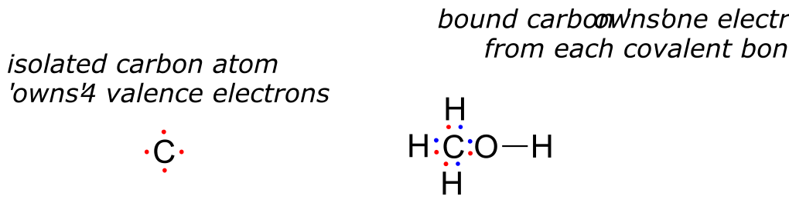

fig 2c

formal charge on carbon =

(4 valence electron on isolated atom)

\- (0 nonbonding electrons)

\- (½ x 8 bonding electrons)

= 4 - 0 - 4 = 0

. . . so the formal charge on carbon is zero.

For each of the hydrogens in methanol, we also get a formal charge of
zero:

formal charge on hydrogen =

(1 valence electron on isolated atom)

\- (0 nonbonding electrons)

\- (½ x 2 bonding electrons)

= 1 - 0 - 1 = 0

Now, let's look at the cationic form of methanol,
CH3OH2+. The bonding picture has not
changed for carbon or for any of the hydrogen atoms, so we will focus on
the oxygen atom.

fig 2

The oxygen owns 2 non-bonding electrons and 3 bonding elections, so the
formal charge calculations becomes:

formal charge on oxygen =

(6 valence electrons in isolated atom)

\- (2 non-bonding electrons)

\- (½ x 6 bonding electrons)

= 6 - 2 - 3 = 1.

A formal charge of +1 is located on the oxygen atom.

For methoxide, the anionic form of methanol, the calculation for the
oxygen atom is:

formal charge on oxygen =

(6 valence electrons in isolated atom)

\- (6 non-bonding electrons)

\- (½ x 2 bonding electrons)

= 6 - 6 - 1 = -1

. . . so a formal charge of -1 is located on the oxygen atom.

A very important rule to keep in mind is that *the sum of the formal
charges on all atoms of a molecule must equal the net charge on the
whole molecule.*

When drawing the structures of organic molecules, it is very important
to show all non-zero formal charges, being clear about where the charges
are located. *A structure that is missing non-zero formal charges is not
correctly drawn, and will probably be marked as such on an exam!*

At this point, thinking back to what you learned in general chemistry,
you are probably asking “What about dipoles? Doesn’t an oxygen atom in
an O-H bond ‘own’ more of the electron density than the hydrogen,
because of its greater electronegativity?” This is absolutely correct,
and we will be reviewing the concept of bond dipoles later on. For the
purpose of calculating formal charges, however, bond dipoles don’t
matter - we always consider the two electrons in a bond to be shared
equally, even if that is not an accurate reflection of chemical reality.
Formal charges are just that - a formality, a method of electron
book-keeping that is tied into the Lewis system for drawing the
structures of organic compounds and ions. Later, we will see how the
concept of formal charge can help us to visualize how organic molecules
react.

Finally, don't be lured into thinking that just because the net charge
on a structure is zero there are no atoms with formal charges: one atom
could have a positive formal charge and another a negative formal
charge, and the net charge would still be zero. **Zwitterions,** such as
amino acids, have both positive and negative formal charges on different
atoms:

Even though the net charge on glycine is zero, it is still mandatory to
show the location of the positive and negative formal charges.

<u>Exercise 1.4</u>: Fill in all missing lone pair electrons and formal
charges in the structures below. Assume that all atoms have a complete
valence shell of electrons. Net charges are shown outside the brackets.

> 

fig 3a

[Video tutorial on formal
charges](https://www.khanacademy.org/science/chemistry/chemical-bonds/copy-of-dot-structures/v/formal-charge-and-dot-structures)

### 1.1B: Common bonding patterns in organic structures

The electron-counting methods for drawing Lewis structures and
determining formal charges on atoms are an essential starting point for
a novice organic chemist, and work quite well when dealing with small,
simple structures. But as you can imagine, these methods become
unreasonably tedious and time-consuming when you start dealing with
larger structures. It would be unrealistic, for example, to ask you to
draw the Lewis structure below (of one of the four nucleoside building
blocks that make up DNA) and determine all formal charges by adding up,
on an atom-by-atom basis, all of the valence electrons.

fig 5

And yet, as organic chemists, and especially as organic chemists dealing
with biological molecules, you will be expected soon to draw the
structures of large molecules on a regular basis. Clearly, you need to
develop the ability to quickly and efficiently draw large structures and
determine formal charges. Fortunately, this ability is not terribly hard
to come by - all it takes is learning a few shortcuts and getting some
practice at recognizing **common bonding patterns**.

Let’s start with carbon, the most important element for organic
chemists. *Carbon is **tetravalent**, meaning that it tends to form four
bonds.* If you look again carefully at the structure of the DNA
nucleoside 2'-deoxycytidine above, you should recognize that each carbon
atom has four bonds, no lone pairs, and a formal charge of zero. Some of
the carbon atoms have four single bonds, and some have one double bond
and two single bonds. These are the two most common bonding patterns for
carbon, along with a third option where carbon has one triple bond and
one single bond.

Common bonding patterns for carbon

fig 6

These three bonding patterns apply to most organic molecules, but there
are exceptions. Here is a very important such exception: in carbon
dioxide, the four bonds to the carbon atom take the form of two double
bonds. (O=C=O).

Carbon is also sometimes seen with a formal charge of +1 (a
**carbocation**) or -1 (a **carbanion**). Notice that a carbocation does
not have a full octet of valence electrons.

Additional bonding patterns for carbon (high energy intermediate
species)

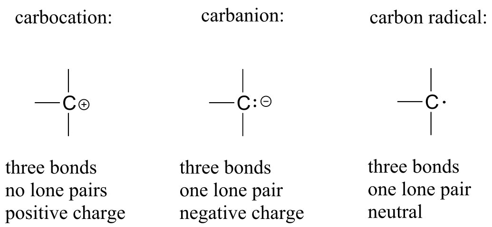

fig 6a

Carbocations, carbanions, and carbon radicals are very high-energy
(unstable) species and thus we do not expect to see them in the
structure of a stable compound. However, they are important in organic
chemistry because they often form as transient (short-lived)
**intermediates** in reactions - they form, then very quickly change
into something else. We will have much more to say about carbocation,
carbanion, and radical intermediates in later chapters.

The bonding pattern for hydrogen atoms is easy: only one bond, no
nonbonding electrons, and no formal charge. The exceptions to this rule
are the proton, (H+, just a single proton and no electrons)
and the hydride ion, H-, which is a proton plus two
electrons. Because we are concentrating in this book on organic
chemistry as applied to living things, however, we will not be seeing
‘naked’ protons and hydrides as such: they are far too reactive to be
present in that form in aqueous solution. Nonetheless, the *idea* of a
proton will be very important when we discuss acid-base chemistry, and
the *idea* of a hydride ion will become very important much later in the
book when we discuss organic oxidation and reduction reactions.

We'll next turn to oxygen atoms. Typically, you will see an oxygen
bonding in one of three ways.

Common bonding patterns for oxygen:

fig 7

If oxygen has two bonds and two lone pairs, as in water, it will have a
formal charge of zero. If it has one bond and three lone pairs, as in
hydroxide ion, it will have a formal charge of -1. If it has three bonds
and one lone pair, as in hydronium ion, it will have a formal charge of
+1.

fig 7a

Nitrogen has two major bonding patterns: three bonds and one lone pair,
or four bonds and a positive formal charge.

Common bonding patterns for nitrogen:

fig 8

Nitrogen is occasionally also seen with two bonds, two lone pairs, and a
negative formal charge - however, these species are extremely reactive
and not very relevant to biological chemistry.

Two third row elements are commonly found in biological organic
molecules: sulfur and phosphorus. Although both of these elements have
other bonding patterns that are relevant in laboratory chemistry, in a
biological context sulfur most commonly follows the same bonding/formal
charge pattern as oxygen, while phosphorus is seen in a form in which it
has five bonds (almost always to oxygen), no nonbonding electrons, and a
formal charge of zero. Remember that atoms of elements in the third row
and below in the periodic table have 'expanded valence shells' with *d*
orbitals available for bonding, and the the octet rule does not apply.

Common bonding pattern for phosphorus (phosphate)

fig 9

Finally, the halogens (fluorine, chlorine, bromine, and iodine) are very
important in laboratory and medicinal organic chemistry, but less common
in naturally occurring organic molecules. Halogens in organic chemistry
usually are seen with one bond, three lone pairs, and a formal charge of
zero, or as ions in solution with no bonds, four lone pairs, and a
negative formal charge.

Common bonding pattern for halogens:

fig 10

These patterns, if learned and internalized so that you don’t even need
to think about them, will allow you to draw large organic structures,
complete with formal charges, quite quickly.

Once you have gotten the hang of drawing Lewis structures in this way,
it is not always necessary to draw lone pairs on heteroatoms, as you can
assume that the proper number of electrons are present around each atom
to match the indicated formal charge (or lack thereof). Often, though,
lone pairs are drawn, particularly on nitrogen, if doing so helps to
make an explanation clearer.

<u>Exercise 1.5</u>: Draw one structure that corresponds to each of the
following molecular formulas, using the common bonding patters covered
above. Be sure to include all lone pairs and formal charges where
applicable, and assume that all atoms have a full valence shell of
electrons. More than one correct answer is possible for each, so you
will want to check your answers with your instructor or tutor.

a\) C5H10O b) C5H8O c)
C6H8NO+ d)
C4H3O2-

### 1.1C: Using condensed structures and line structures

If you look ahead in this and other books at the way organic compounds
are drawn, you will see that the figures are somewhat different from the
Lewis structures you are used to seeing in your general chemistry book.
In some sources, you will see **condensed structures** for smaller
molecules instead of full Lewis structures:

fig 11a

More commonly, organic and biological chemists use an abbreviated
drawing convention called **line structures**. The convention is quite
simple and makes it easier to draw molecules, but line structures do
take a little bit of getting used to. Carbon atoms are depicted not by a
capital C, but by a ‘corner’ between two bonds, or a free end of a bond.
Open-chain molecules are usually drawn out in a 'zig-zig' shape.
Hydrogens attached to carbons are generally not shown: rather, like lone
pairs, they are simply implied (unless a positive formal charge is
shown, all carbons are assumed to have a full octet of valence
electrons). Hydrogens bonded to nitrogen, oxygen, sulfur, or anything
other than carbon *are* shown, but are usually drawn without showing the
bond. The following examples illustrate the convention.

fig 11

As you can see, the 'pared down' line structure makes it much easier to
see the basic structure of the molecule and the locations where there is
something other than C-C and C-H single bonds. For larger, more complex
biological molecules, it becomes impractical to use full Lewis
structures. Conversely, very small molecules such as ethane should be
drawn with their full Lewis or condensed structures.

Sometimes, one or more carbon atoms in a line structure will be depicted
with a capital C, if doing so makes an explanation easier to follow. *If
you label a carbon with a C, you also must draw in the hydrogens for
that carbon*.

<u>Exercise 1.6</u>: A good way to test your understanding of the line
structure convention is to determine the number of hydrogen atoms in a
molecule from its line structure. Do this for the structures below.

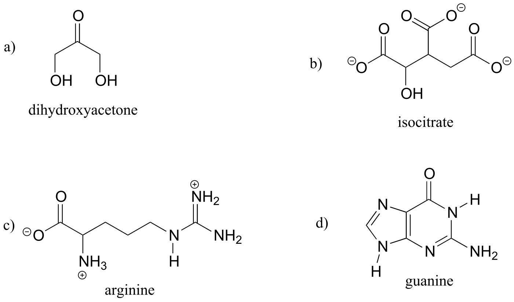

fig 12

<u>Exercise 1.7</u>:

a\) Draw a line structure for the DNA base 2-deoxycytidine (the full
structure was shown earlier)

b\) Draw line structures for histidine (an amino acid) and pyridoxine
(Vitamin B6).

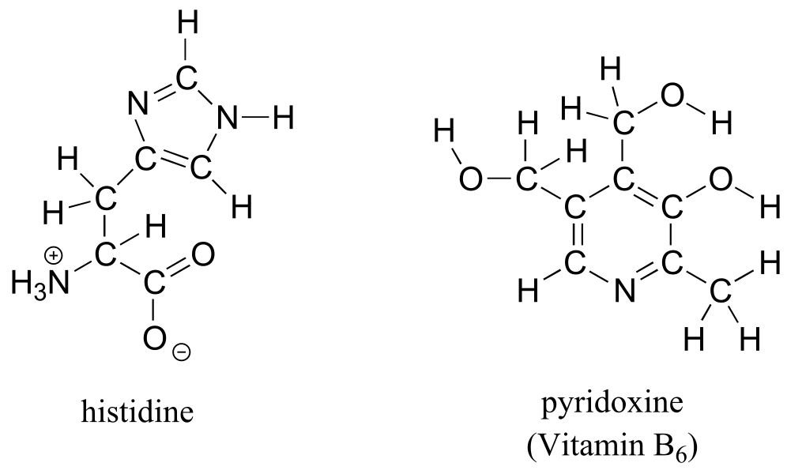

fig 13

<u>Exercise 1.8</u>: Add non-zero formal charges to the structural
drawing below:

<u>Exercise 1.9</u>: Find, anywhere in chapters 2-17 of this textbook,
one example of each of the common bonding patterns specified below.
Check your answers with your instructor or tutor.

a\) carbon with one double bond, two single bonds, no lone pairs, and
zero formal charge

b\) oxygen with two single bonds, two lone pairs, and zero formal charge

c\) oxygen with one double bond, two lone pairs, and zero formal charge

d\) nitrogen with one double bond, two single bonds, and a +1 formal
charge

e\) oxygen with one single bond, three lone pairs, and a negative formal
charge

### 1.1D: Constitutional isomers

Imagine that you were asked to draw a structure for a compound with the
molecular formula C4H10. This would not be
difficult - you could simply draw:

fig 14

But when you compared your answer with that of a classmate, she may have
drawn this structure:

fig 15

Who is correct? The answer, of course, is that both of you are. A
molecular formula only tells you *how many* atoms of each element are
present in the compound, not what the actual atom-to-atom connectivity
is. There are often many different possible structures for one molecular
formula. Compounds that have the same molecular formula but different
connectivity are called **constitutional** **isomers** (sometimes the
term ‘**structural isomer**’ is also used). The Greek term ‘*iso’* means
‘same’.

Fructose and glucose are constitutional isomers with the molecular
formula C6H12O6.

fig 16

<u>Exercise 1.10:</u> Draw a constitutional isomer of ethanol,
CH3CH2OH.

<u>Exercise 1.11</u>: Draw all of the possible constitutional isomers
with the given molecular formula.

a\) C5H12

b\) C4H10O

c\) C3H9N

## Section 1.2: Functional groups and organic nomenclature

### 1.2A: Functional groups in organic compounds

**Functional groups** are structural units within organic compounds that
are defined by specific bonding arrangements between specific atoms. The
structure of capsaicin, the compound discussed in the beginning of this
chapter, incorporates several functional groups, labeled in the figure
below and explained throughout this section.

fig 32

As we progress in our study of organic chemistry, it will become
extremely important to be able to quickly recognize the most common
functional groups, because *they are the key structural elements that
define how organic molecules react*. For now, we will only worry about
drawing and recognizing each functional group, as depicted by Lewis and
line structures. Much of the remainder of your study of organic
chemistry will be taken up with learning about how the different
functional groups behave in organic reactions.

The 'default' in organic chemistry (essentially, the *lack* of any
functional groups) is given the term **alkane**, characterized by single
bonds between carbon and carbon, or between carbon and hydrogen.
Methane, CH4, is the natural gas you may burn in your
furnace. Octane, C8H18, is a component of
gasoline.

Alkanes

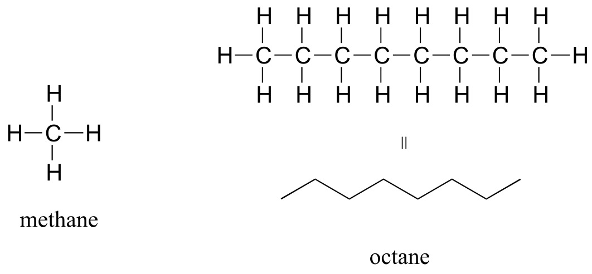

fig 17

**Alkenes** (sometimes called **olefins**) have carbon-carbon double
bonds, and **alkynes** have carbon-carbon triple bonds. Ethene, the
simplest alkene example, is a gas that serves as a cellular signal in
fruits to stimulate ripening. (If you want bananas to ripen quickly, put
them in a paper bag along with an apple - the apple emits ethene gas,
setting off the ripening process in the bananas). Ethyne, commonly
called acetylene, is used as a fuel in welding blow torches.

Alkenes and alkynes

fig 18

In chapter 2, we will study the nature of the bonding on alkenes and
alkynes, and learn that that the bonding in alkenes is trigonal planar
in in alkynes is linear. Furthermore, many alkenes can take two
geometric forms: *cis* or *trans*. The *cis* and *trans* forms of a
given alkene are different molecules with different physical properties
because, as we will learn in chapter 2, there is a very high energy
barrier to rotation about a double bond. In the example below, the
difference between *cis* and *trans* alkenes is readily apparent.

fig 18a

We will have more to say about the subject of *cis* and *trans* alkenes
in chapter 3, and we will learn much more about the reactivity of
alkenes in chapter 14.

Alkanes, alkenes, and alkynes are all classified as **hydrocarbons**,
because they are composed solely of carbon and hydrogen atoms. Alkanes
are said to be **saturated hydrocarbons**, because the carbons are
bonded to the maximum possible number of hydrogens–in other words, they
are *saturated* with hydrogen atoms. The double and triple-bonded
carbons in alkenes and alkynes have fewer hydrogen atoms bonded to
them–they are thus referred to as **unsaturated hydrocarbons**. As we
will see in chapter 15, hydrogen can be added to double and triple
bonds, in a type of reaction called 'hydrogenation'.

The **aromatic** group is exemplified by benzene (which used to be a
commonly used solvent on the organic lab, but which was shown to be
carcinogenic), and naphthalene, a compound with a distinctive 'mothball'
smell. Aromatic groups are planar (flat) ring structures, and are
widespread in nature. We will learn more about the structure and
reactions of aromatic groups in chapters 2 and 14.

aromatics

fig 19

When the carbon of an alkane is bonded to one or more halogens, the
group is referred to as an **alkyl halide** or **haloalkane**.
Chloroform is a useful solvent in the laboratory, and was one of the
earlier anesthetic drugs used in surgery. Chlorodifluoromethane was used
as a refrigerant and in aerosol sprays until the late twentieth century,
but its use was discontinued after it was found to have harmful effects
on the ozone layer. Bromoethane is a simple alkyl halide often used in
organic synthesis. Alkyl halides groups are quite rare in biomolecules.

alkyl halides

fig 20

In the **alcohol** functional group, a carbon is single-bonded to an OH
group (the OH group, by itself, is referred to as a **hydroxyl**).
Except for methanol, all alcohols can be classified as primary,
secondary, or tertiary. In a **primary alcohol**, the carbon bonded to
the OH group is also bonded to only one other carbon. In a **secondary
alcohol** and **tertiary alcohol,** the carbon is bonded to two or three
other carbons, respectively. When the hydroxyl group is *directly*
attached to an aromatic ring, the resulting group is called a
**phenol**. The sulfur analog of an alcohol is called a **thiol** (from
the Greek *thio*, for sulfur).

alcohols, phenols, and thiols

fig 21

Note that the definition of a phenol states that the hydroxyl oxygen
must be *directly* attached to one of the carbons of the aromatic ring.
The compound below, therefore, is *not* a phenol - it is a primary
alcohol.

fig 22

The distinction is important, because as we will see later, there is a
significant difference in the reactivity of alcohols and phenols.

The deprotonated forms of alcohols, phenols, and thiols are called
**alkoxides**, **phenolates**, and **thiolates**, respectively. A
protonated alcohol is an **oxonium** ion.

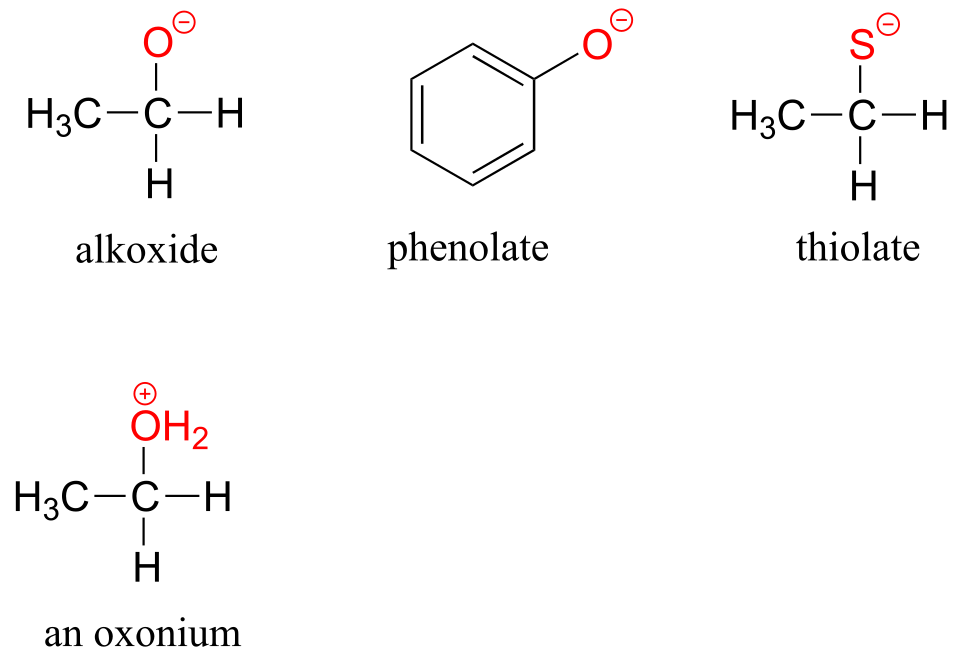

fig 23

In an **ether** functional group, a central oxygen is bonded to two
carbons. Below is the structure of diethyl ether, a common laboratory
solvent and also one of the first compounds to be used as an anesthetic
during operations. The sulfur analog of an ether is called a
**thioether** or **sulfide**.

ethers and sulfides

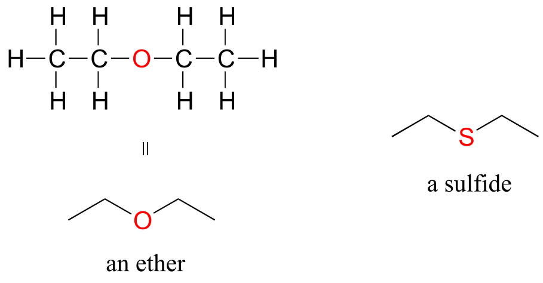

**Amines** are characterized by nitrogen atoms with single bonds to
hydrogen and carbon. Just as there are primary, secondary, and tertiary
alcohols, there are primary, secondary, and tertiary amines. Ammonia is
a special case with no carbon atoms.

One of the most important properties of amines is that they are basic,
and are readily protonated to form **ammonium** cations. In the case
where a nitrogen has four bonds to carbon (which is somewhat unusual in
biomolecules), it is called a quaternary ammonium ion.

amines

fig 25

*Note*: Do not be confused by how the terms 'primary', 'secondary', and
'tertiary' are applied to alcohols and amines - the definitions are
different. In alcohols, what matters is how many other carbons the
alcohol *carbon* is bonded to, while in amines, what matters is how many
carbons the *nitrogen* is bonded to.

fig 26

**Phosphate** and its derivative functional groups are ubiquitous in
biomolecules. Phosphate linked to a single organic group is called a
**phosphate ester**; when it has two links to organic groups it is
called a **phosphate diester**. A linkage between two phosphates creates
a **phosphate anhydride**.

phosphate functional groups

fig 27

Chapter 9 of this book is devoted to the structure and reactivity of the
phosphate group.

There are a number of functional groups that contain a carbon-oxygen
double bond, which is commonly referred to as a **carbonyl**.
**Ketones** and **aldehydes** are two closely related carbonyl-based
functional groups that react in very similar ways. In a ketone, the
carbon atom of a carbonyl is bonded to two other carbons. In an
aldehyde, the carbonyl carbon is bonded on one side to a hydrogen, and
on the other side to a carbon. The exception to this definition is
formaldehyde, in which the carbonyl carbon has bonds to two hydrogens.

A group with a carbon-nitrogen double bond is called an **imine**, or
sometimes a **Schiff base** (in this book we will use the term 'imine').
The chemistry of aldehydes, ketones, and imines will be covered in
chapter 10.

aldehydes, ketones, and imines

fig 28

When a carbonyl carbon is bonded on one side to a carbon (or hydrogen)
and on the other side to an oxygen, nitrogen, or sulfur, the functional
group is considered to be one of the ‘**carboxylic acid derivatives**’,
a designation that describes a set of related functional groups. The
eponymous member of this family is the **carboxylic acid** functional
group, in which the carbonyl is bonded to a hydroxyl group. The
conjugate base of a carboxylic acid is a **carboxylate**. Other
derivatives are carboxylic esters (usually just called **'esters'**),
**thioesters**, **amides**, **acyl phosphates**, **acid chlorides**, and
**acid anhydrides**. With the exception of acid chlorides and acid
anhydrides, the carboxylic acid derivatives are very common in
biological molecules and/or metabolic pathways, and their structure and
reactivity will be discussed in detail in chapter 11.

Carboxylic acid derivatives

fig 29

Finally, a **nitrile** group is characterized by a carbon triple-bonded
to a nitrogen.

A single compound often contains several functional groups, particularly
in biological organic chemistry. The six-carbon sugar molecules glucose
and fructose, for example, contain aldehyde and ketone groups,
respectively, and both contain five alcohol groups (a compound with
several alcohol groups is often referred to as a ‘**polyol’**).

fig 31

The hormone testosterone, the amino acid phenylalanine, and the
glycolysis metabolite dihydroxyacetone phosphate all contain multiple
functional groups, as labeled below.

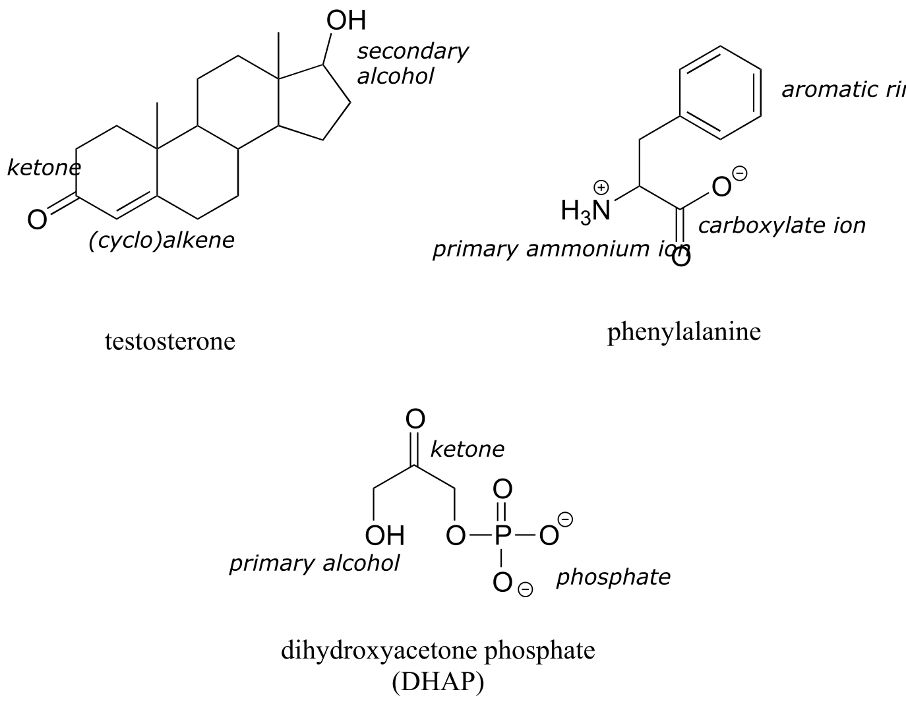

fig 33

While not in any way a complete list, this section has covered most of
the important functional groups that we will encounter in biological
organic chemistry. Table 9 in the tables section at the back of this
book provides a summary of all of the groups listed in this section,
plus a few more that will be introduced later in the text.

<u>Exercise 1.12</u>: Identify the functional groups (other than
alkanes) in the following organic compounds. State whether alcohols and
amines are primary, secondary, or tertiary.

> 

fig 34

<u>Exercise 1.13</u>: Draw one example each of compounds fitting the
descriptions below, using line structures. Be sure to designate the
location of all non-zero formal charges. All atoms should have complete
octets (phosphorus may exceed the octet rule). There are many possible
correct answers for these, so be sure to check your structures with your
instructor or tutor.

> a\) a compound with molecular formula C6H11NO
> that includes alkene, secondary amine, and primary alcohol functional
> groups
>
> b\) an ion with molecular formula
> C3H5O6P 2- that includes
> aldehyde, secondary alcohol, and phosphate functional groups.
>
> c\) A compound with molecular formula C6H9NO
> that has an amide functional group, and does *not* have an alkene
> group.

[Video tutorial on functional
groups](https://www.khanacademy.org/science/organic-chemistry/bond-line-structures-alkanes-cycloalkanes/functional-groups/v/functional-groups-first)

### 1.2B: Naming organic compounds 

A system has been devised by the International Union of Pure and Applied
Chemistry (IUPAC, usually pronounced ***eye**-you-pack*) for naming
organic compounds. While the IUPAC system is convenient for naming
relatively small, simple organic compounds, it is not generally used in
the naming of biomolecules, which tend to be quite large and complex. It
is, however, a good idea (even for biologists) to become familiar with
the basic structure of the IUPAC system, and be able to draw simple
structures based on their IUPAC names.

Naming an organic compound usually begins with identify what is referred
to as the **'parent chain'**, which is the longest straight chain of
carbon atoms. We’ll start with the simplest straight chain alkane
structures. CH4 is called **methane**, and
C2H6 **ethane**. The table below continues with
the names of longer straight-chain alkanes: be sure to commit these to
memory, as they are the basis for the rest of the IUPAC nomenclature
system (and are widely used in naming biomolecules as well).

**Names for straight-chain alkanes:**

| <u>Number of carbons</u> | <u>Name</u> |
|--------------------------|-------------|
| 1                        | methane     |
| 2                        | ethane      |
| 3                        | propane     |
| 4                        | butane      |
| 5                        | pentane     |
| 6                        | hexane      |
| 7                        | heptane     |
| 8                        | octane      |
| 9                        | nonane      |
| 10                       | decane      |

Substituents branching from the main parent chain are located by a
carbon number, with *the lowest possible numbers* being used (for
example, notice in the example below that the compound on the left is
named 1-chlorobutane, *not* 4-chlorobutane). When the substituents are
small alkyl groups, the terms **methyl**, **ethyl**, and **propyl** are
used.

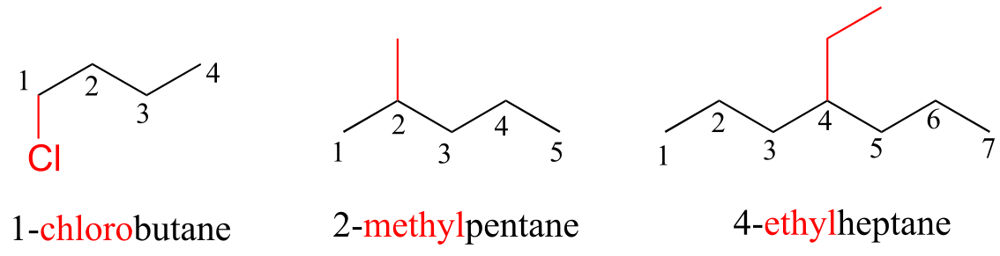

fig 36

Other common names for hydrocarbon substituent groups **isopropyl,**
***tert*-butyl** and **phenyl**.

fig 36a

Notice in the example below, an ‘ethyl group’ (in blue) is not treated
as a substituent, rather it is included as part of the parent chain, and
the methyl group is treated as a substituent. The IUPAC name for
straight-chain hydrocarbons is always based on the *longest possible
parent chain*, which in this case is four carbons, not three.

fig 37

Cyclic alkanes are called cyclopropane, cyclobutane, cyclopentane,
cyclohexane, and so on.

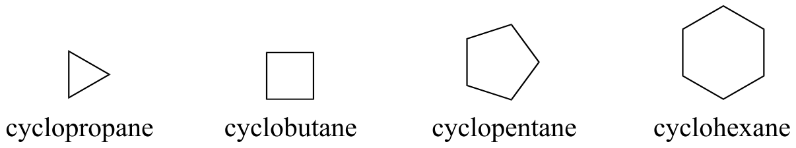

fig 38

In the case of multiple substituents, the prefixes *di*, *tri*, and
*tetra* are used.

fig 39

Functional groups have characteristic suffixes. Alcohols, for example,
have ‘ol’ appended to the parent chain name, along with a number
designating the location of the hydroxyl group. Ketones are designated
by ‘one’.

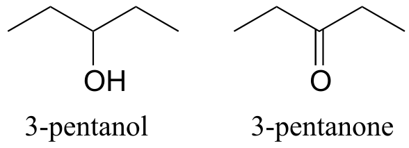

fig 40

Alkenes are designated with an 'ene' ending, and when necessary the
location and geometry of the double bond are indicated. Compounds with
multiple double bonds are called dienes, trienes, etc.

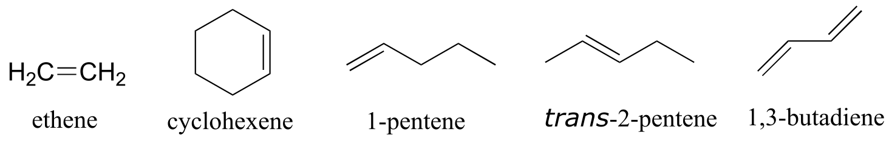

fig 41

Some groups can only be present on a terminal carbon, and thus a
locating number is not necessary: aldehydes end in ‘al’, carboxylic
acids in ‘oic acid’, and carboxylates in ‘oate’.

fig 43

Ethers and sulfides are designated by naming the two groups on either
side of the oxygen or sulfur.

fig 44

If an amide has an unsubstituted –NH2 group, the suffix is
simply ‘amide’. In the case of a substituted amide, the group attached
to the amide nitrogen is named first, along with the letter ‘*N*’ to
clarify where this group is located. Note that the structures below are
both based on a three-carbon (propan) parent chain.

fig 45

For esters, the suffix is 'oate'. The group attached to the oxygen is
named first.

fig 46

All of the examples we have seen so far have been simple in the sense
that only one functional group was present on each molecule. There are
of course many more rules in the IUPAC system, and as you can imagine,
the IUPAC naming of larger molecules with multiple functional groups,
ring structures, and substituents can get very unwieldy very quickly.
The illicit drug cocaine, for example, has the IUPAC name 'methyl
(1*R*,2*R*,3*S*,5*S*)-3-(benzoyloxy)-8-methyl-8-azabicyclo\[3.2.1\]
octane-2-carboxylate' (this name includes designations for
stereochemistry, which is a structural issue that we will not tackle
until chapter 3).

fig 47

You can see why the IUPAC system is not used very much in biological
organic chemistry - the molecules are just too big and complex. A
further complication is that, even outside of a biological context, many
simple organic molecules are known almost universally by their ‘common’,
rather than IUPAC names. The compounds acetic acid, chloroform, and
acetone are only a few examples.

fig 48

In biochemistry, nonsystematic names (like 'cocaine', 'capsaicin',
'pyruvate' or 'ascorbic acid') are usually used, and when systematic
nomenclature is employed it is often specific to the class of molecule
in question: different systems have evolved, for example, for fats and
for carbohydrates. We will not focus very intensively in this text on
IUPAC nomenclature or any other nomenclature system, but if you
undertake a more advanced study in organic or biological chemistry you
may be expected to learn one or more naming systems in some detail.

<u>Exercise 1.14</u>: Give IUPAC names for acetic acid, chloroform, and
acetone.

<u>Exercise 1.15</u>: Draw line structures of the following compounds,
based on what you have learned about the IUPAC nomenclature system:

a\) methylcyclohexane

b\) 5-methyl-1-hexanol

c\) 2-methyl-2-butene

d\) 5-chloropentanal

e\) 2,2-dimethylcyclohexanone

f\) 4-penteneoic acid

g\) *N*-ethyl-*N*-cyclopentylbutanamide

### 1.2C: Abbreviated organic structures

Often when drawing organic structures, chemists find it convenient to
use the letter 'R' to designate part of a molecule outside of the region
of interest. If we just want to refer in general to a functional group
without drawing a specific molecule, for example, we can use '**R'
groups** to focus attention on the group of interest:

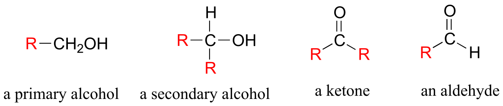

fig 49

The R group is a convenient way to abbreviate the structures of large
biological molecules, especially when we are interested in something
that is occurring specifically at one location on the molecule. For
example, in chapter 15 when we look at biochemical oxidation-reduction
reactions involving the flavin molecule, we will abbreviate a large part
of the flavin structure which does not change at all in the reactions of
interest:

fig 50

As an alternative, we can use a 'break' symbol to indicate that we are
looking at a small piece or section of a larger molecule. This is used
commonly in the context of drawing groups on large polymers such as
proteins or DNA.

fig 51

Finally, R groups can be used to concisely illustrate a series of
related compounds, such as the family of penicillin-based antibiotics.

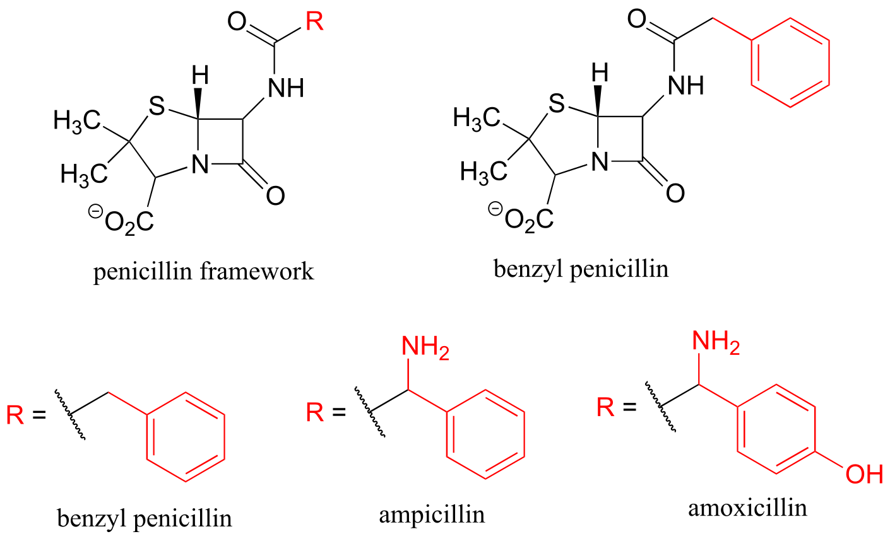

fig 52

Using abbreviations appropriately is a very important skill to develop
when studying organic chemistry in a biological context, because
although many biomolecules are very large and complex (and take forever
to draw!), usually we are focusing on just one small part of the
molecule where a change is taking place. As a rule, *you should never
abbreviate any atom involved in a bond-breaking or bond-forming event*
*that is being illustrated:* only abbreviate that part of the molecule
which is not involved in the reaction of interest. For example, carbon
\#2 in the reactant/product below most definitely is involved in bonding
changes, and therefore should not be included in the 'R' group.

fig 52a

If you are unsure whether to draw out part of a structure or abbreviate
it, the safest thing to do is to draw it out.

<u>Exercise 1.16</u>:

a\) If you intend to draw out the chemical details of a reaction in
which the methyl ester functional group of cocaine (see earlier figure)
was converted to a carboxylate plus methanol, what would be an
appropriate abbreviation to use for the cocaine structure (assuming that
you *only* wanted to discuss the chemistry specifically occurring at the
ester group)?

b\) Below is the (somewhat complicated) reaction catalyzed by an enzyme
known as 'Rubisco', by which plants 'fix' carbon dioxide. Carbon dioxide
and the oxygen of water are colored red and blue respectively to help
you see where those atoms are incorporated into the products. Propose an
appropriate abbreviation for the starting compound (ribulose
1,5-bisphosphate), using two different 'R' groups, R1 and
R2.

## Section 1.3: Structures of important classes of biological molecules

Because we are focusing in this textbook on biologically relevant
organic chemistry, we will frequently be alluding to important classes
of biological molecules such as lipids, carbohydrates, proteins, and
nucleic acids (DNA and RNA). Now is a good time to go through a quick
overview of what these molecules look like. These are large, complex
molecules and there is a *lot* of information here: you are not expected
to memorize these structures or even, at this point, to fully understand
everything presented in this section. For now, just read through and get
what you can out of it, and work on recognizing the fundamental things
you have just learned: common bonding patterns, formal charges,
functional groups, and so forth. Later, you can come back to this
section for review when these biomolecules are referred to in different
contexts throughout the remainder of the book.

### 1.3A: Lipids

We'll start with a large subgroup of a class of biomolecules called
**lipids**, which includes fats, oils, waxes, and isoprenoid compounds
such as cholesterol.

**Fatty acids** are composed of hydrocarbon chains terminating in a
carboxylic acid/carboxylate group (we will learn in Chapter 7 that
carboxylic acids are predominantly in their anionic, carboxylate form in
biological environments). Saturated fatty acids contain only alkane
carbons (single bonds only), mononsaturated fatty acids contain a single
double bond, and polyunsaturated fatty acids contain two or more double
bonds. The double bonds in naturally occurring fatty acids are
predominantly in the *cis* configuration.

fig 53

Fatty acids are synthesized in the body by a process in which the
hydrocarbon chain is elongated two carbons at a time. Each two-carbon
unit is derived from a metabolic intermediate called **acetyl-coA**,
which is essentially an acetic acid (vinegar) molecule linked to a large
'carrier' molecule, called coenzyme A, by a thioester functional group.
We will see much more of coenzyme A when we study the chemistry of
thioesters in chapter 11.

fig 54

The breakdown of fatty acids in the body also occurs two carbons at a
time, and the endpoint is again acetyl-coenzyme A. We will learn about
the details of all of the reactions in these metabolic pathways at
various places in this book. If you go on to take a biochemistry course,
you will learn more about the big picture of fatty acid metabolism - how
it is regulated, and how is fits together with other pathways of central
metabolism.

**Fats and oils** are forms of **triacylglycerol**, a molecule composed
of a glycerol backbone with three fatty acids linked by ester functional
groups.

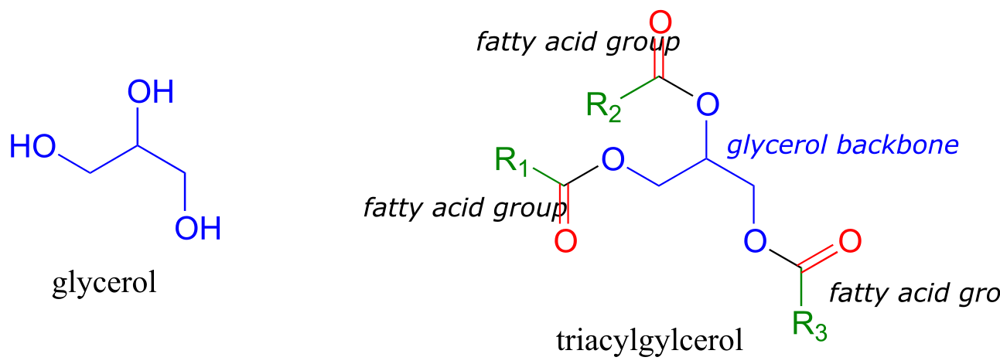

fig 55

Solid fats (predominant in animals) are triacylglycerols with long
(16-18 carbon) saturated fatty acids. Liquid oils (predominant in
plants) have unsaturated fatty acids, sometimes with shorter hydrocarbon
chains. In chapter 2 we will learn about how chain length and degree of
unsaturation influences the physical properties of fats and oils.

Cell membranes are composed of **membrane lipids**, which are
**diacylglycerols** linked to a hydrophilic **'head group'** on the
third carbon of the glycerol backbone. The fatty acid chains can be of
various lengths and degrees of saturation, and the two chains combined
make up the hydrophobic 'tail' of each membrane lipid molecule.

fig 56

In chapter 2 we will see how these molecules come together to form a
cell membrane.

<u>Exercise 1.17</u>: What functional group links the
phosphatidylcholine 'head' group to glycerol in the membrane lipid
structure shown above?

**Waxes** are composed of fatty acids linked to long chain alcohols
through an ester group. Tricontanyl palmitate is a major component of
beeswax, and is constituted of a 16-carbon fatty acid linked to a
30-carbon alcohol.

fig 56a

**Isoprenoids**, a broad class of lipids present in all forms of life,
are based on a five-carbon, branched-chain building block called
isoprene. In humans, cholesterol and hormones such as testosterone are
examples of isoprenoid biomolecules. In plants, isoprenoids include the
deeply colored compounds such as lycopene (the red in tomatoes) and
carotenoids (the yellows and oranges in autumn leaves).

fig 57

In almost all eukaryotes, isopentenyl diphosphate (the building block
molecule for all isoprenoid compounds) is synthesized from three
acetyl-Coenzyme A molecules. Bacteria and the plastid organelles in
plants have a different biosynthetic pathway to isopentenyl diphosphate,
starting with pyruvate and glyceraldehyde phosphate.

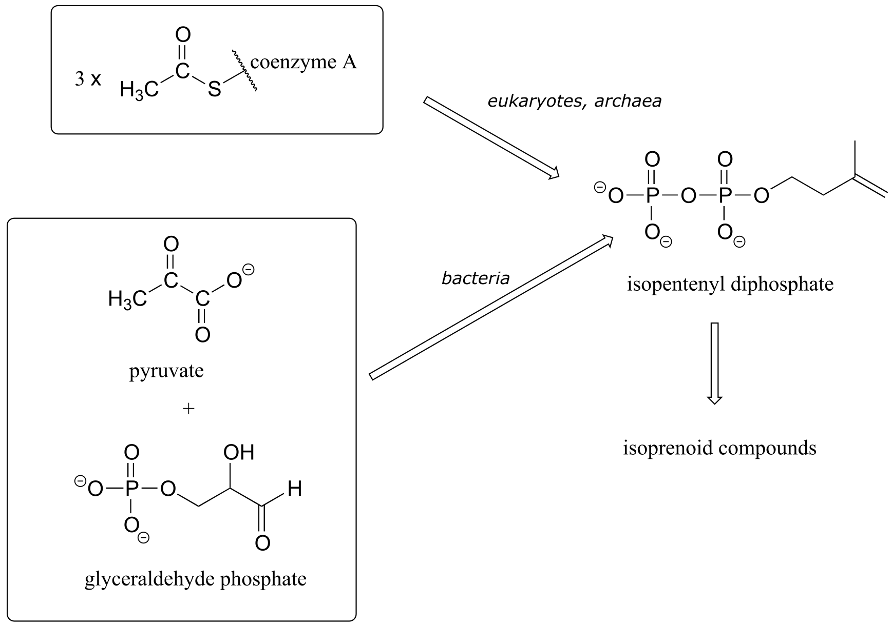

### 1.3B: Biopolymer basics

Carbohydrates, proteins, and nucleic acids are the most important
**polymers** in the living world. To understand what a polymer is,
simply picture a long chain made by connecting lots of individual beads,
each of which is equipped with two hooks. In chemical terminology, each
bead is a **monomer**, the hooks are **linking groups**, and the whole
chain is a polymer.

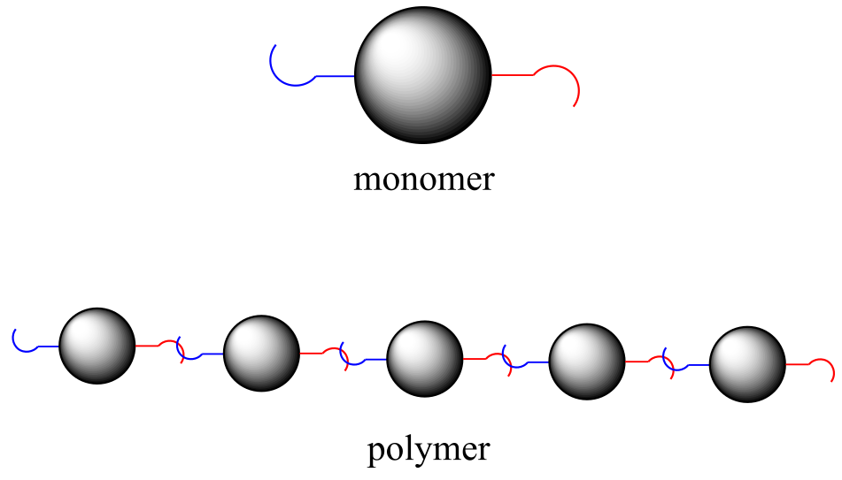

fig 59

### 1.3C: Carbohydrates

The term 'carbohydrate', which literally means 'hydrated carbons',
broadly refers to monosaccharides, disaccharides, oligosaccharides
(shorter polymers) and polysaccharides (longer polymers). We will cover
the chemistry of carbohydrates more completely in chapter 10, but the
following is a quick overview.

**Monosaccharides** (commonly called 'sugars') are four- to six-carbon
molecules with multiple alcohol groups and a single aldehyde or ketone
group. Many monosaccharides exist in aqueous solution as a rapid
equilibrium between an open chain and one or more cyclic forms. Two
forms of a six-carbon monosaccharide are shown below.

fig 60

**Disaccharides** are two monosaccharides linked together: for example,
sucrose, or table sugar, is a disaccharide of glucose and fructose.

fig 61

**Oligosaccharides** and **polysaccharides** are longer polymers of
monosaccharides. **Cellulose** is a polysaccharide of repeating glucose
monomers. As a major component of the cell walls of plants, cellulose is
the most abundant organic molecule on the planet! A two-glucose stretch
of a cellulose polymer is shown below.

fig 61a

The linking group in carbohydrates is not one that we have covered in
this chapter - in organic chemistry this group is called an acetal,
while biochemists usually use the term **glycosidic bond** when talking
about carbohydrates (again, the chemistry of these groups will be
covered in detail in chapter 10).

The possibilities for carbohydrate structures are vast, depending on
which monomers are used (there are many monosaccharides in addition to
glucose and fructose), which carbons are linked, and other geometric
factors which we will learn about later. Multiple linking (branching) is
also common, so many carbohydrates are not simply linear chains. In
addition, carbohydrate chains are often attached to proteins and/or
lipids, especially on the surface of cells. All in all, carbohydrates
are an immensely rich and diverse subfield of biological chemistry.

### 1.3D Amino acids and proteins

Proteins are polymers of amino acids, linked by amide groups known as
peptide bonds. An amino acid can be thought of as having two components:
a 'backbone', or 'main chain', composed of an ammonium group, an
'α-carbon', and a carboxylate, and a variable 'side chain' (in green
below) bonded to the α-carbon.

fig 63

There are twenty different side chains in naturally occurring amino
acids (see Table 5 in the tables section at the back of this book), and
it is the identity of the side chain that determines the identity of the
amino acid: for example, if the side chain is a -CH3 group,
the amino acid is alanine, and if the side chain is a -CH2OH
group, the amino acid is serine. Many amino acid side chains contain a
functional group (the side chain of serine, for example, contains a
primary alcohol), while others, like alanine, lack a functional group,
and contain only a simple alkane.

The two 'hooks' on an amino acid monomer are the amine and carboxylate
groups. Proteins (polymers of \~50 amino acids or more) and peptides
(shorter polymers) are formed when the amino group of one amino acid
monomer reacts with the carboxylate carbon of another amino acid to form
an amide linkage, which in protein terminology is a **peptide bond**.
Which amino acids are linked, and in what order - the protein
**sequence** - is what distinguishes one protein from another, and is
coded for by an organism's DNA. Protein sequences are written in the
amino terminal (N-terminal) to carboxylate terminal (C-terminal)
direction, with either three-letter or single-letter abbreviations for
the amino acids (see table 5). Below is a four amino acid peptide with
the sequence "cysteine - histidine - glutamate - methionine". Using the
single-letter code, the sequence is abbreviated CHEM.

fig 64

When an amino acid is incorporated into a protein it loses a molecule of
water and what remains is called a **residue** of the original amino
acid. Thus we might refer to the 'glutamate residue' at position 3 of
the CHEM peptide above.

Once a protein polymer is constructed, it in many cases folds up very
specifically into a three-dimensional structure, which often includes
one or more 'binding pockets' in which other molecules can be bound. It
is this shape of this folded structure, and the precise arrangement of
the functional groups within the structure (especially around the
binding pocket) that determines the function of the protein.

**Enzymes** are proteins which catalyze biochemical reactions. One or
more reacting molecules–often called **substrates**–become bound in the
**active site** pocket of an enzyme, where the actual reaction takes
place. **Receptors** are proteins that bind specifically to one or more
molecules–referred to as **ligands**–to initiate a biochemical process.
For example, we saw in the introduction to this chapter that the TrpVI
receptor in mammalian tissues binds capsaicin (from hot chili peppers)
in its binding pocket and initiates a heat/pain signal which is sent to
the brain.

Shown below is an image of the glycolytic enzyme
fructose-1,6-bisphosphate aldolase (in grey), with the substrate
molecule bound inside the active site pocket.

x-ray crystallographic data are from *Protein Science* **1999**, 8,
*291*; pdb code 4ALD. Image produced with JMol First Glance

### 1.3E: Nucleic Acids (DNA and RNA)

Deoxyribonucleic acid (DNA) and ribonucleic acid (RNA) are polymers
composed of monomers called **nucleotides**. An RNA nucleotide consists
of a five-carbon sugar phosphate linked to one of four **nucleic acid
bases**: guanine (G), cytosine (C), adenine (A) and uracil (U).

fig 65a

fig 65

In a DNA nucleototide, the sugar is missing the hydroxyl group at the 2'
position, and the thymine base (T) is used instead of uracil. (The
conventional numbering system used for DNA and RNA is shown here for
reference - the prime (') symbol is used to distinguish the sugar carbon
numbers from the base carbon numbers.)

The two 'hooks' on the RNA or DNA monomer are the 5' phosphate and the
3' hydroxyl on the sugar, which in DNA polymer synthesis are linked by a
'phosphate diester' group.

fig 66

In the polymerization process, individual nucleotides are successively
added to the 3' hydroxyl group of a growing polymer: in other words, DNA
and RNA synthesis occurs in the 5' to 3' direction, and conventionally
this is the order in which sequences are written.

A DNA polynucleotide (often referred to as **single-stranded** DNA)
combines with a complementary strand to form the famous Watson-Crick
**double-helix** structure of **double-stranded DNA** (see image link at
end of chapter). RNA can also form a double helix within a variety of
single- and double-stranded structures depending on its function.
Further discussion of higher-order polysaccharide, protein, and DNA/RNA
structure is beyond the scope of this textbook, but you will learn many
more details in biochemistry and molecular biology courses. All
references to these biomolecules in this textbook will focus on organic
chemistry details at the monomer and linking group level.

## Summary of Key Concepts

*Before you move on to the next chapter, you should:*

Thoroughly review (from your General Chemistry course) the fundamental
principles of atomic structure and electron configuration, and review
the rules for drawing Lewis structures.

Be very familiar with the **common bonding patterns in organic
molecules** - you should be able to quickly recognize where lone pairs
exist, even when they are not drawn explicitly, and you should be able
to readily recognize incorrectly drawn structures -for example, when
carbon is drawn with five bonds.

Be able to determine the **formal charge** on all atoms of a compound -
with practice, you should be able to look at an organic structure and
very rapidly recognize when there is a formal charge on a carbon,
oxygen, or nitrogen.

Become adept at interpreting and drawing **line structures** for organic
molecules (line structures will be used almost exclusively for the
remainder of this textbook). A good test is to determine the molecular
formula of a molecule from a line structure.

Understand the meaning of **constitutional isomer**, and be able to
recognize and/or draw constitutional isomers of a given compound.

Be able to recognize and come up with your own examples of the most
important **functional groups** in organic chemistry, introduced in this
chapter and summarized in table 9 in the tables section at the back of
this book.

Be familiar with the basic rules of the **IUPAC nomenclature system**,
at the level presented in this textbook, and be able to draw a structure
based on its IUPAC name.

Understand how and when to use **abbreviated organic structures**
appropriately.

You need not memorize in detail the **structures of common classes of
biological molecules** illustrated in this chapter (fats, isoprenoids,
carbohydrates, proteins, and nucleic acids), but you should be able to
recognize examples when you see them. Also, you should be prepared to
refer to section 1.3 when references are made to these structures
throughout the rest of this textbook and you need a review.

As always, you should be familiar with the meaning of all of the
**terms** written in bold in this chapter.

<u>  
</u>

## Problems

**P1.1:** The figure below illustrates a section of an intermediate
compound that forms during the protein synthesis process in the cell.
Lone pairs are not shown, as is typical in drawings of organic
compounds.

a\) The structure as drawn is incomplete, because it is missing formal
charges - fill them in.

b\) How many hydrogen atoms are on this structure?

c\) Identify the two important biomolecule classes (covered in section
1.3) in the structure.

**P1.2**: Find, in Table 6 ('Structures of common coenzymes', in the
tables section at the back of this book), examples of the following:

a\) a thiol b) an amide c) a secondary alcohol d) an aldehyde

e\) a methyl substituent on a ring f) a primary ammonium ion

g\) a phosphate anhydride h) a phosphate ester

**P1.3**: Draw line structures corresponding to the following compounds.
Show all lone pair electrons (and don't forget that non-zero formal
charges are part of a correctly drawn structure!)

a\) 2,2,4-trimethylpentane b) 3-phenyl-2-propenal

c\) 6-methyl-2,5-cyclohexadienone d) 3-methylbutanenitrile

e\) 2,6-dimethyldecane f) 2,2,5,5-tetramethyl-3-hexanol

g\) methyl butanoate h) *N*-ethylhexanamide

i\) 7-fluoroheptanoate j) 1-ethyl-3,3-dimethylcyclohexene

**P1.4:** Reaction A below is part of the biosynthetic pathway for the
amino acid methionine, and reaction B is part of the pentose phosphate
pathway of sugar metabolism.

a\) What is the functional group transformation that is taking place in
each reaction?

b\) Keeping in mind that the 'R' abbreviation is often used to denote
parts of a larger molecule which are *not* the focus of a particular
process, which of the following abbreviated structures could be
appropriate to use for aspartate semialdehyde when drawing out details
of reaction A?

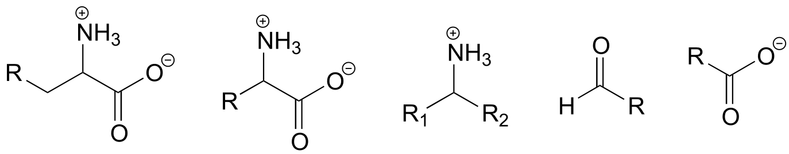

c\) Again using the 'R' convention, suggest an appropriate abbreviation
for the reactant in reaction B.

**P1.5**: Find, in the table of amino acid structures (Table 5),
examples of the following:

a\) a secondary alcohol b) an amide c) a thiol

d\) a sulfide e) a phenol f) a side chain primary ammonium

g\) a side chain carboxylate h) a secondary amine

**P1.6:** Draw correct Lewis structures for ozone (O3), azide
ion, (N3-), and bicarbonate ion,
HCO3-. Include lone pair electrons and formal
charges, and use your General Chemistry textbook to review VSEPR theory,
which will enable you to draw correct bond geometries.

**P1.7:** Draw one example each of compounds fitting the descriptions
below, using line structures. Be sure to include all non-zero formal
charges. All atoms should fit one of the common bonding patters
discussed in this chapter. There are many possible correct answers - be
sure to check your drawings with your instructor or tutor.

a\) an 8-carbon molecule with secondary alcohol, primary amine, amide,
and *cis*-alkene groups

b\) a 12-carbon molecule with carboxylate, diphosphate, and lactone
(cyclic ester) groups.

c\) a 9-carbon molecule with cyclopentane, alkene, ether, and aldehyde
groups

**P1.8:** Three of the four structures below are missing formal charges.

a\) Fill in all missing formal charges (assume all atoms have a complete
octet of valence electrons).

b\) Identify the following functional groups or structural elements
(there may be more than one of each): carboxylate, carboxylic acid,
cyclopropyl, amide, ketone, secondary ammonium ion, tertiary alcohol.

c\) Determine the number of hydrogen atoms in each compound.

**P1.9:**

a\) Draw four constitutional isomers with the molecular formula
C4H8. (

b\) Draw two open-chain (non-cyclic) constitutional isomers of
cyclohexanol (there are more than two possible answers).

**P1.10:** Draw structures of four different amides with molecular
formula C3H7NO.

# 2: Introduction to organic structure and bonding, part II

(Credit: https://www.flickr.com/photos/biodivlibrary/)

> “Towards thee I roll, thou all-destroying but unconquering whale; to
> the last I grapple with thee; from hell's heart I stab at thee; for
> hate's sake I spit my last breath at thee. Sink all coffins and all
> hearses to one common pool! and since neither can be mine, let me then
> tow to pieces, while still chasing thee, though tied to thee, thou
> damned whale! THUS, I give up the spear!" The harpoon was darted; the
> stricken whale flew forward; with igniting velocity the line ran
> through the grooves;--ran foul. Ahab stooped to clear it; he did clear
> it; but the flying turn caught him round the neck, and voicelessly as
> Turkish mutes bowstring their victim, he was shot out of the boat, ere
> the crew knew he was gone. Next instant, the heavy eye-splice in the
> rope's final end flew out of the stark-empty tub, knocked down an
> oarsman, and smiting the sea, disappeared in its depths.
>
> (Herman Melville, *Moby Dick*)

In the classic 19th century novel 'Moby Dick', Herman
Melville's Captain Ahab obsessively hunts down the enormous albino sperm
whale which years before had taken one of his legs, the monomaniacal
quest ending with Ahab being dragged by the neck to the bottom of the
sea by his enormous white nemesis. It is fitting, somehow, that one of
the most memorable fictional characters in modern literature should be a
real-life 50 ton monster – sperm whales are such fantastic creatures
that if they didn't in fact exist, it would stretch the imagination to
make them up. They are the largest predator on the planet, diving to
depths of up to three kilometers and staying down as long as 90 minutes
to hunt the giant squid and other deep-dwelling species that make up the
bulk of their diet.

It would be hard for anyone to mistake a sperm whale for any other
creature in the ocean, due to their enormous, squared-off foreheads. It
is what is inside this distinctive physical feature, though, that
brought them to the edge of extinction in the middle of the
20th century. For over 200 years, sperm whales had been
prized by whalers for the oil that fills the 'spermaceti' and 'melon'
compartments which make up the bulk of the front part of their bodies.
Whalers in the 17th and 18th centuries would lower
one of their crew into a hole cut into a captured whale, and he would
literally ladle out the 'sperm oil ' by the bucketful, often filling
eight barrels from the head of one animal. The different processed
components obtained from raw sperm oil had properties that were ideal
for a multitude of applications: as a lubricant for everything from
sewing machines to train engines, as a fuel for lamps, and as a prized
ingredient in cosmetics and skin products.

'Sperm oil' is not really an oil – it is mostly liquid wax (refer back
to section 1.3A for a reminder of how the structure of oils differs from
that of waxes). The composition of waxes in sperm oil is complex and
variable throughout the life of the animal, but in general contains
waxes with saturated and unsaturated hydrocarbon chains ranging from 16
to 24 carbons.

Remarkably, scientists are still not sure about the function of the
enormous wax-filled reservoirs in the sperm whale's forehead. The most
prevalent hypothesis holds that they play a role in echolocation. In the
pitch-black void of the deep ocean a whale's eyes are useless, but it is
able to navigate and locate prey in the same way that a bat does, using
the reflection of sound waves. In fact, the sonic clicks generated by
the sperm whale are the loudest sounds generated by any animal on earth.
The wax reservoirs may be used somehow for the directional focusing of
these sound waves.

Another intriguing but unproven hypothesis is that the reservoir serves
as a buoyancy control device. The wax is normally liquid and buoyant at
the whale's normal body temperature, but solidifies and becomes denser
than water at lower temperatures. If the diving whale could cool the wax
by directing cold seawater around the reservoir and restricting blood
flow to the region, it could achieve negative buoyancy and thus conserve
energy that otherwise would be expended in swimming down. When it needs
to return to the surface, blood could be redirected to the wax, which
would melt and become positively buoyant again, thus conserving energy
on the upward trip.

Whatever its natural function, it is inarguable that the physical and
chemical properties of sperm oil make it valuable, both to the whale and
to humans. Fortunately for the world's population of whales, both
economic forces and conservation efforts have made virtually all trade
in sperm oil a thing of the past. Beginning in the late 19th
century, the discovery of new oil fields and advances in petroleum
processing led to the use of cheaper mineral oil alternatives for many
of the major applications of sperm oil, one of the most notable
substitutions being the use of kerosene for lamps. More recently, the
'oil' from the Jojoba plant, a native of the American southwest, has
been found to be an excellent substitute for sperm oil in cosmetics and
skin products, exhibiting many of the same desirable characteristics.
Jojoba oil, like sperm oil, is composed primarily of liquid waxes rather
than actual oils, and a major selling point of both is that the oily
substance produced by human skin, called sebum, is also composed of
about 25% wax.

While organic and biological chemistry is a very diverse field of study,
one fundamental question that interests all organic chemists is how the
structure of an organic molecule determines its physical properties. To
understand why sperm oil has properties that made it both a useful
industrial lubricant for humans and an effective buoyancy control and/or
sonic lens for a hunting sperm whale, we first have to understand the
nature of both the forces holding each wax molecule together – the
covalent single and double bonds between atoms – and also the forces
governing the noncovalent interactions between one wax molecule and all
the others around it – the so-called 'intermolecular forces' which
determine physical properties such as viscosity, melting point, and
density.

That is what we will learn about in this chapter. First, we will look
more closely at the nature of single and double covalent bonds, using
the concepts of 'hybrid orbitals' and 'resonance' to attempt to explain
how orbital overlap results in characteristic geometries and rotational
behavior for single and double bonds, as well as bonds that have
characteristics of somewhere in between single and double. Then we will
move on to a review of the noncovalent interactions between molecules -
Van der Waals, ion-ion, dipole-dipole and ion-dipole interactions, and
hydrogen bonds - and how they are manifested in the observable physical
properties of all organic substances.

Before reading any further on this chapter, you will probably need to go
back and review some topics from your Introductory Chemistry course. Be
sure that you understand the concepts of atomic orbitals, atomic
electron configuration, and that you are able to describe *s* and *p*
orbitals and orbital lobes and nodes. Now would also be a very good time
to review *VSEPR* theory.

## Section 2.1: Covalent bonding in organic molecules: valence bond theory

As we have been discussing how to use Lewis structures to depict the
bonding in organic compounds, we have been very vague so far in our
language about the actual nature of the chemical bonds themselves. We
know that a covalent bond involves the ‘sharing’ of a pair of electrons
between two atoms - but how does this happen, and how does it lead to
the formation of a bond holding the two atoms together?

**Valence bond theory** is most often used to describe bonding in
organic molecules. In this model, bonds are considered to form from the
overlap of two atomic orbitals on different atoms, each orbital
containing a single electron. In looking at simple inorganic molecules
such as molecular hydrogen (H2) or hydrogen fluoride (HF),
our present understanding of *s* and *p* atomic orbitals will suffice.
In order to explain the bonding in organic molecules, however, we will
need to introduce the concept of **hybrid orbitals**.

Many of the concepts in this section involve three-dimensional
visualization, and are quite challenging for many students to understand
when presented solely in a static, textbook-style format. You may find
it very helpful to refer as well to video tutorials from Khan Academy,
links to which are provided.

https://www.khanacademy.org/science/organic-chemistry/gen-chem-review/hybrid-orbitals-jay.

### 2.1A: The σ bond in the H2 molecule

The simplest case to consider is the hydrogen molecule, H2.
When we say that the two hydrogen nuclei share their electrons to form a
covalent bond, what we mean in valence bond theory terms is that the two
spherical 1*s* orbitals (the grey spheres in the figure below) overlap,
and contain two electrons with opposite spin.

chemwiki.ucdavis.edu

/@api/deki/files/38956/ac3b11e624201e0a249d7a24ab63c67c.jpg

These two electrons are now attracted to the positive charge of *both*
of the hydrogen nuclei, with the result that they serve as a sort of
‘chemical glue’ holding the two nuclei together.

How far apart are the two nuclei? If they are too far apart, their
respective 1*s* orbitals cannot overlap, and thus no covalent bond can
form - they are still just two separate hydrogen atoms. As they move
closer and closer together, orbital overlap begins to occur, and a bond
begins to form. This lowers the potential energy of the system, as new,
*attractive* positive-negative electrostatic interactions become
possible between the nucleus of one atom and the electron of the second.

But something else is happening at the same time: as the atoms get
closer, the *repulsive* positive-positive interaction between the two
nuclei also begins to increase.

fig 54

At first this repulsion is more than offset by the attraction between
nuclei and electrons, but at a certain point, as the nuclei get even
closer, the repulsive forces begin to overcome the attractive forces,
and the potential energy of the system rises quickly. When the two
nuclei are ‘too close’, we have an unstable, high-energy situation.
There is a defined optimal distance between the nuclei in which the
potential energy is at a minimum, meaning that the combined attractive
and repulsive forces add up to the greatest overall attractive force.
This optimal internuclear distance is the **bond length**. For the
H2 molecule, the distance is 74 pm (picometers,
10-12 meters). Likewise, the difference in potential energy
between the lowest energy state (at the optimal internuclear distance)
and the state where the two atoms are completely separated is called the
**bond dissociation energy,** or, more simply**, bond strength**. For
the hydrogen molecule, the H-H bond strength is equal to about 435
kJ/mol.

Every covalent bond in each molecule has a characteristic length and
strength. In general, the length of a typical carbon-carbon single bond
in an organic molecule is about 150 pm, while carbon-carbon double bonds
are about 130 pm, carbon-oxygen double bonds are about 120 pm, and
carbon-hydrogen bonds are in the range of 100 to 110 pm. The strength of
covalent bonds in organic molecules ranges from about 234 kJ/mol for a
carbon-iodine bond (in thyroid hormone, for example), about 410 kJ/mole
for a typical carbon-hydrogen bond, and up to over 800 kJ/mole for a
carbon-carbon triple bond. You can refer to tables in reference books
such as the CRC Handbook of Chemistry and Physics for extensive lists of
bond lengths and energies, and many other data for specific organic
compounds.

It is not accurate, however, to picture covalent bonds as rigid sticks
of unchanging length - rather, it is better to picture them as *springs*
which have a defined length when relaxed, but which can be compressed,
extended, and bent. This ‘springy’ picture of covalent bonds will become
very important in chapter 4, when we study the analytical technique
known as infrared (IR) spectroscopy.

One more characteristic of the covalent bond in H2 is
important to consider at this point. The two overlapping 1*s* orbitals
can be visualized as two spherical balloons being pressed together. This
means that the bond has **cylindrical symmetry**: if we were to take a
cross-sectional plane of the bond at any point, it would form a circle.
This type of bond is referred to as a **σ (sigma) bond**.

(chemwiki.ucdavis.edu)

/@api/deki/files/38956/ac3b11e624201e0a249d7a24ab63c67c.jpg

fig 48

A σ bond can be formed by overlap of an *s* atomic orbital with a *p*
atomic orbital. Hydrogen fluoride (HF) is an example:

fig 49

A σ bond can be formed by the overlap of two *p* orbitals. The covalent
bond in molecular fluorine, F2, is a σ bond formed by the
overlap of two half-filled 2*p* orbitals, one from each fluorine atom.

fig 50

### 2.1B: *sp3* hybrid orbitals and tetrahedral bonding

Now let’s look more carefully at bonding in organic molecules, starting
with methane, CH4. Recall the valence electron configuration
of a carbon atom:

This picture, however, is problematic in terms of bonding. How does the
carbon form four bonds if it has only two half-filled *p* orbitals
available for bonding? A hint comes from the experimental observation
that the four C-H bonds in methane are arranged with **tetrahedral**
geometry about the central carbon, and that each bond has the same
length and strength. In order to explain this observation, valence bond
theory relies on a concept called **orbital hybridization**. In this
picture, the four valence orbitals of the carbon (one 2*s* and three
2*p* orbitals) combine mathematically (remember: orbitals are described
by wave equations) to form four equivalent **hybrid orbitals**, which
are named ***sp3* orbitals** because they are formed from
mixing one *s* and three *p* orbitals. In the new electron
configuration, each of the four valence electrons on the carbon occupies
a single *sp3* orbital.

fig 58

The *sp3* hybrid orbitals, like the *p* orbitals of which
they are partially composed, are oblong in shape, and have two lobes of
opposite sign. Unlike the *p* orbitals, however, the two lobes are of
very different size. While the unhybridized *p* orbitals are oriented
perpendicular (90o) to each other, the *sp3*
hybrids are directed towards the four corners of a tetrahedron, meaning
that the angle between any two orbitals is 109.5o.

View interactive 3D model: http://www.chemtube3d.com/orbitalshybrid.htm

(*select 'load sp3' and 'load H 1s' to see orbitals*)

fig 59

This geometric arrangement makes perfect sense if you consider that it
is precisely this angle that allows the four orbitals (and the electrons
in them) to be as far apart from each other as possible. This is simply
a restatement of the Valence Shell Electron Pair Repulsion (VSEPR)
theory that you learned in General Chemistry: electron pairs (in
orbitals) will arrange themselves in such a way as to remain as far
apart as possible, due to negative-negative electrostatic repulsion.

Each C-H bond in methane, then, can be described as a σ bond formed by
overlap between a half-filled 1*s* orbital in a hydrogen atom and the
larger lobe of one of the four half-filled *sp3* hybrid
orbitals in the central carbon. The length of the carbon-hydrogen bonds
in methane is 109 pm.

fig 61

[another
image](http://www.kshitij-iitjee.com/Study/Chemistry/Part1/Chapter1/72.jpg)

[interactive
model](http://preparatorychemistry.com/Jmol_methane_alkane.htm)

While previously we drew a Lewis structure of methane in two dimensions
using lines to denote each covalent bond, we can now draw a more
accurate structure in three dimensions, showing the tetrahedral bonding
geometry. To do this on a two-dimensional page, though, we need to
introduce a new drawing convention: the solid / dashed wedge system. In
this convention, a solid wedge simply represents a bond that is meant to
be pictured emerging from the plane of the page. A dashed wedge
represents a bond that is meant to be pictured pointing into, or behind,
the plane of the page. Normal lines imply bonds that lie in the plane of
the page. This system takes a little bit of getting used to, but with
practice your eye will learn to immediately ‘see’ the third dimension
being depicted.

<u>Exercise 2.1</u>: Imagine that you could distinguish between the four
hydrogen atoms in a methane molecule, and labeled them Ha
through Hd. In the images below, the *exact same* methane
molecule is rotated and flipped in various positions. Draw the missing
hydrogen atom labels. (It will be much easier to do this if you make a
model.)

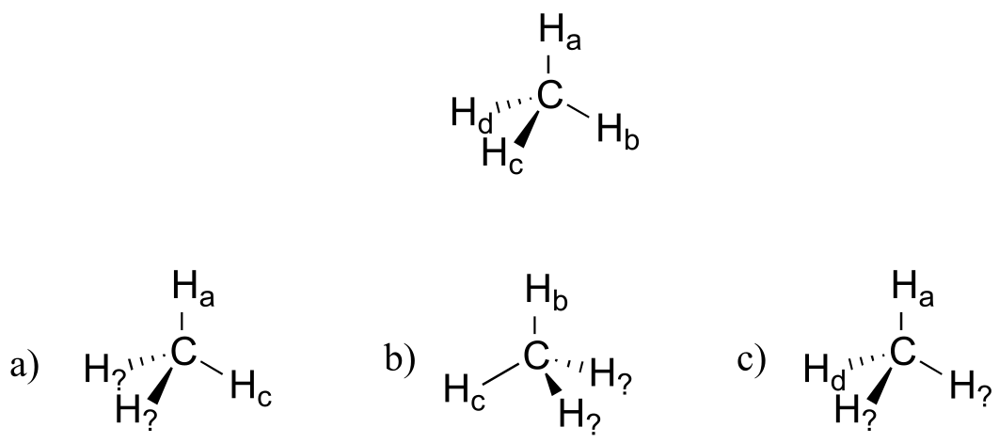

> fig 61a

<u>Exercise 2.2</u>: What kind of orbitals overlap to form the C-Cl
bonds in chloroform, CHCl3?

How does this bonding picture extend to compounds containing
carbon-carbon bonds? In ethane (CH3CH3), both
carbons are *sp3*-hybridized, meaning that both have four
bonds with tetrahedral geometry. The carbon-carbon bond, with a bond
length of 154 pm, is formed by overlap of one *sp*3 orbital
from each of the carbons, while the six carbon-hydrogen bonds are formed
from overlaps between the remaining *sp3* orbitals on the two
carbons and the 1*s* orbitals of hydrogen atoms. All of these are σ
bonds.

fig 62

[another
image](https://qph.ec.quoracdn.net/main-qimg-7ad01c3444deeac2f83bcc8f51ed63da)

[interactive
model](http://preparatorychemistry.com/Jmol_ethane_alkane.htm)

Because they are formed from the end-on-end overlap of two orbitals, *σ
bonds are free to rotate*. This means, in the case of ethane molecule,
that the two methyl (CH3) groups can be pictured as two
wheels on an axle, each one able to rotate with respect to the other.

fig 63

[video demonstration](https://www.youtube.com/watch?v=V2pr7e9g3E4)

In chapter 3 we will learn more about the implications of rotational
freedom in σ bonds, when we discuss the ‘conformation’ of organic
molecules.

The *sp3* bonding picture is also used to describe the
bonding in amines, including ammonia, the simplest amine. Just like the
carbon atom in methane, the central nitrogen in ammonia is
*sp3-*hybridized. With nitrogen, however, there are five
rather than four valence electrons to account for, meaning that three of
the four hybrid orbitals are half-filled and available for bonding,
while the fourth is fully occupied by a nonbonding pair (lone pair) of
electrons.

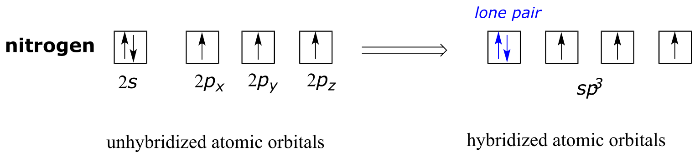

fig 64

fig 65

[another
image](http://www.mikeblaber.org/oldwine/chm1045/notes/Geometry/Hybrid/ammonia.jpg)

[interactive
model](http://www.chemtube3d.com/gallery/structurepages/nh3.html)

The bonding arrangement here is also tetrahedral: the three N-H bonds of
ammonia can be pictured as forming the base of a trigonal pyramid, with
the fourth orbital, containing the lone pair, forming the top of the
pyramid.

Recall from your study of VSEPR theory in General Chemistry that the
lone pair, with its slightly greater repulsive effect, ‘pushes’ the
three N-H σ bonds away from the top of the pyramid, meaning that the
H-N-H bond angles are slightly less than tetrahedral, at 107.3˚ rather
than 109.5˚.

VSEPR theory also predicts, accurately, that a water molecule is ‘bent’
at an angle of approximately 104.5˚. The bonding in water results from
overlap of two of the four *sp3* hybrid orbitals on oxygen
with 1*s* orbitals on the two hydrogen atoms. The two nonbonding
electron pairs on oxygen are located in the two remaining
*sp3* orbitals.

fig 66

<u>Exercise 2.3</u>: Draw, in the same style as the figures above,
orbital pictures for the bonding in methylamine.

[summary image of sp3 bonding in CH4,
NH3, and
H2O](http://zasoby1.open.agh.edu.pl/dydaktyka/chemia/a_e_chemia/1_3_budowa_materii/img/01_04_66.jpg)

[Video
tutorial](https://www.khanacademy.org/science/organic-chemistry/gen-chem-review/hybrid-orbitals-jay/v/sp3-hybridized-orbitals-and-sigma-bonds):
sp3 hybridization

### 2.1C*: sp2* and *sp* hybrid orbitals and π bonds

The valence bond theory, along with the hybrid orbital concept, does a
very good job of describing double-bonded compounds such as ethene.
Three experimentally observable characteristics of the ethene molecule
need to be accounted for by a bonding model:

1\) Ethene is a planar (flat) molecule.

2\) Bond angles in ethene are approximately 120o, and the
carbon-carbon bond length is 134 pm, significantly shorter than the 154
pm single carbon-carbon bond in ethane.

3\) There is a significant barrier to rotation about the carbon-carbon
double bond.

fig 67

Clearly, these characteristics are not consistent with an
*sp3* hybrid bonding picture for the two carbon atoms.
Instead, the bonding in ethene is described by a model involving the
participation of a different kind of hybrid orbital. Three atomic
orbitals on each carbon – the 2*s*, 2*p*x and
2*p*y orbitals – combine to form three ***sp2*
hybrids**, leaving the 2*p*z orbital unhybridized.

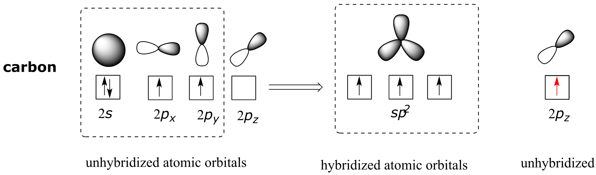

fig 68

The three *sp2* hybrids are arranged with trigonal planar
geometry, pointing to the three corners of an equilateral triangle, with
angles of 120° between them. The unhybridized 2*p*z orbital
is *perpendicular* to this plane (in the next several figures,
*sp2* orbitals and the σ bonds to which they contribute are
represented by lines and wedges; only the 2*p*z orbitals are
shown in the 'space-filling' mode).

fig 69

The carbon-carbon double bond in ethene consists of one σ bond, formed
by the overlap of two *sp2* orbitals, and a second bond,
called a **π (pi) bond**, which is formed by the *side-by-side* overlap
of the two unhybridized 2*p*z orbitals from each carbon.

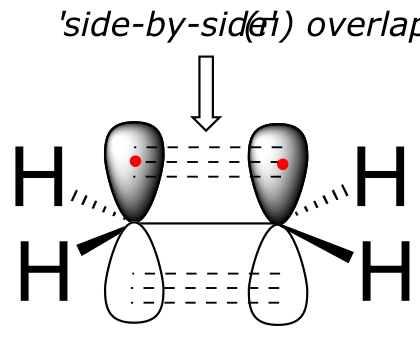

fig 70

[another
image](https://d2gne97vdumgn3.cloudfront.net/api/file/KZ0rBmeMQPeN5SpOgwtb)

[interactive model](http://www.chemtube3d.com/orbitalsethene.htm)
(select 'show remaining p orbitals)

Unlike a σ bond, a π bond does *not* have cylindrical symmetry. If
rotation about this bond were to occur, it would involve disrupting the
side-by-side overlap between the two 2*p*z orbitals that make
up the π bond. The presence of the π bond thus ‘locks’ the six atoms of
ethene into the same plane. This argument extends to larger alkene
groups: in each case, six atoms lie in the same plane.

fig 71

<u>Exercise 2.4</u>: Redraw the structures below, indicating the six
atoms that lie in the same plane due to the carbon-carbon double bond.

fig 71a

<u>Exercise 2.5</u>: What is wrong with the way the following structure
is drawn?

> fig 71c

A similar picture can be drawn for the bonding in carbonyl groups, such
as formaldehyde. In this molecule, the carbon is
*sp2*-hybridized, and we will assume that the oxygen atom is
also *sp2* hybridized. The carbon has three σ bonds: two are
formed by overlap between *sp2* orbitals with 1*s* orbitals
from hydrogen atoms, and the third σ bond is formed by overlap between
the remaining carbon *sp2* orbital and an *sp2*
orbital on the oxygen. The two lone pairs on oxygen occupy its other two
*sp2* orbitals.

fig 2

[another
image](https://classconnection.s3.amazonaws.com/270/flashcards/1032270/png/ethene1323912143714.png)

[interactive model](http://www.chemtube3d.com/orbitalsformaldehyde.htm)
(select 'show p orbital on C and O')

The π bond is formed by side-by-side overlap of the unhybridized
2*p*z orbitals on the carbon and the oxygen. Just like in
alkenes, the 2*p*z orbitals that form the π bond are
perpendicular to the plane formed by the σ bonds.

<u>Exercise 2.6</u>:

a\) Draw a figure showing the bonding picture for the imine below, and
include a verbal description of the orbital overlaps used to form the
carbon-nitrogen bond.

c\) In your drawing for part b, what kind of orbital holds the nitrogen
lone pair?

fig 72a

[Video tutorial: sp2
hybridization](https://www.khanacademy.org/science/organic-chemistry/gen-chem-review/hybrid-orbitals-jay/v/sp2-hybridization-jay-final)

Recall from section 1.2 that carbocations are transient, high-energy
species in which a carbon only has three bonds (rather than the usual
four) and a positive formal charge. We will have much more to say about
carbocations in this and later chapters. For now, though, the important
thing to understand is that a carbocation can be described as an
*sp2*-hybridized carbon with an ***empty** p* orbital
perpendicular to the plane of the σ bonds.

fig 72b [another
image](https://jahschem.wikispaces.com/file/view/sp2_hybrids.jpg/197514042/367x281/sp2_hybrids.jpg)

Finally, the hybrid orbital concept applies as well to triple-bonded
groups, such as alkynes and nitriles. Consider, for example, the
structure of ethyne (common name acetylene), the simplest alkyne.

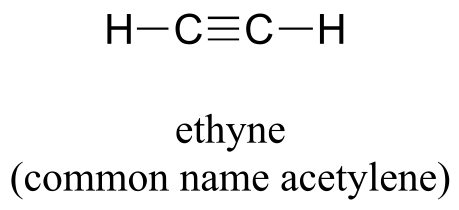

Both the VSEPR theory and experimental evidence tells us that the
molecule is linear: all four atoms lie in a straight line. The
carbon-carbon triple bond is only 120 pm long, shorter than the double
bond in ethene, and is very strong, about 837 kJ/mol. In the hybrid
orbital picture of acetylene, both carbons are ***sp-*hybridized**. In
an *sp*-hybridized carbon, the 2*s* orbital combines with the
2*p*x orbital to form two *sp* hybrid orbitals that are
oriented at an angle of 180° with respect to each other (eg. along the x
axis). The 2*p*y and 2*p*z orbitals remain
unhybridized, and are oriented perpendicularly along the y and z axes,
respectively.

fig 73

The carbon-carbon σ bond, then, is formed by the overlap of one *sp*
orbital from each of the carbons, while the two carbon-hydrogen σ bonds
are formed by the overlap of the second *sp* orbital on each carbon with
a 1*s* orbital on a hydrogen. Each carbon atom still has two half-filled
2*p*y and 2*p*z orbitals, which are perpendicular
both to each other and to the line formed by the σ bonds. These two
perpendicular pairs of *p* orbitals form two π bonds between the
carbons, resulting in a triple bond overall (one σ bond plus two π
bonds).

fig 74 [another
image](http://www.kshitij-iitjee.com/Study/Chemistry/Part1/Chapter1/86.jpg)

[interactive model](http://www.chemtube3d.com/orbitalsacetylene.htm)

<u>Exercise 2.7</u>: Look at the structure of thiamine diphosphate in
Table 6. Identify the hybridization of all carbon atoms in the molecule.

[Video tutorial: sp
hybridization](https://www.khanacademy.org/science/organic-chemistry/gen-chem-review/hybrid-orbitals-jay/v/sp-hybridization-jay-final)

The hybrid orbital concept nicely explains another experimental
observation: single bonds adjacent to double and triple bonds are
progressively shorter and stronger than single bonds adjacent to other
single bonds. Consider for example, the carbon-carbon single bonds in
propane, propene, and propyne.

fig 75

All three are single, σ bonds; the bond in propyne is shortest and
strongest, while the bond in propane is longest and weakest. The
explanation is relatively straightforward. An *sp* orbital is composed
of one *s* orbital and one *p* orbital, and thus it has 50% *s*
character and 50% *p* character. *sp2* orbitals, by
comparison, have 33% *s* character and 67% *p* character, while
*sp3* orbitals have 25% *s* character and 75% *p* character.
Because of their spherical shape, 2*s* orbitals are smaller, and hold
electrons closer and ‘tighter’ to the nucleus, compared to 2*p*
orbitals. It follows that electrons in an *sp* orbital, with its greater
*s* character, are closer to the nucleus than electrons in an
*sp2* or *sp3* orbital. Consequently, bonds
involving *sp*-*sp3* overlap (as in propyne) are shorter and
stronger than bonds involving *sp2*-*sp3* overlap
(as in propene). Bonds involving *sp3-sp3* overlap
(as in propane) are the longest and weakest of the three.

<u>Exercise 2.8</u>:

a\) What kinds of orbitals are overlapping in bonds b-i indicated below?
Be sure to distinguish between σ and π bonds. An example is provided for
bond 'a'.

b\) In what kind of orbital is the lone pair of electrons located on the
nitrogen atom of bond a? Of bond e?

> 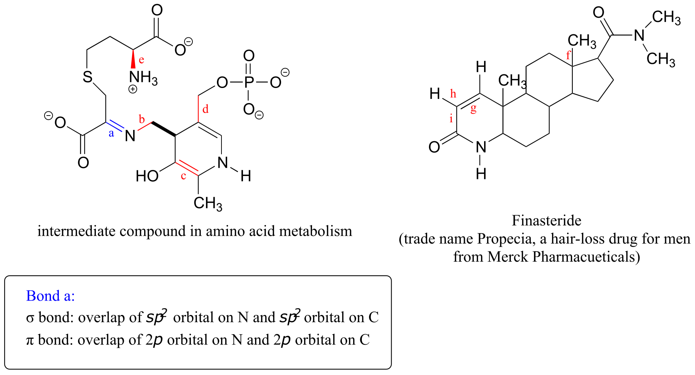

[Video tutorial: hybrid orbital
practice](https://www.khanacademy.org/science/organic-chemistry/gen-chem-review/hybrid-orbitals-jay/v/organic-hybridization-practice)

## Section 2.2: Molecular orbital theory, conjugation, and aromaticity

Valence bond theory does a remarkably good job at explaining the bonding
geometry of many of the functional groups in organic compounds. There
are some areas, however, where the valence bond theory falls short. It
fails to adequately account, for example, for some interesting
properties of compounds that contain alternating double and single
bonds. To understand these properties, we need to think about chemical
bonding in a new way, using the ideas of molecular orbital (MO) theory.

### 2.2A: Another look at the H2 molecule using molecular orbital theory

Let’s go back and consider again the simplest possible covalent bond:
the one in molecular hydrogen (H2). When we described the
hydrogen molecule using valence bond theory, we said that the two 1*s*
orbitals from each atom overlap, allowing the two electrons to be shared
and thus forming a covalent bond. In molecular orbital theory, we make a
further statement: we say that the two atomic 1*s* orbitals
mathematically combine to form two new orbitals. Recall that an atomic
orbital (such as the 1s orbital of a hydrogen atom) describes a region
of space around a single atom inside which electrons are likely to be
found. *A molecular orbital describes a region of space around two or
more atoms inside which electrons are likely to be found.*

Mathematical principles tell us that when orbitals combine, the number
of orbitals before the combination takes place must equal the number of
new orbitals that result from the combination – orbitals don’t just
disappear! We saw this previously when we discussed hybrid orbitals: one
*s* and three *p* orbitals make four *sp3* hybrids. When two
atomic 1*s* orbitals combine in the formation of H2, the
result is *two* **sigma (σ) molecular orbitals**.

fig 100

According to MO theory, one σ orbital is lower in energy than either of
the two isolated atomic 1*s* orbitals –this lower σ orbital is referred
to as a **bonding molecular orbital**. The second, **σ\* orbital** is
higher in energy than the two atomic 1*s* orbitals, and is referred to
as an **antibonding molecular orbital**.

The bonding σ orbital, which holds both electrons in the ground state of
the molecule, is egg-shaped, encompassing the two nuclei, and with the
highest likelihood of electrons being in the area between the two
nuclei. The high-energy, antibonding σ\* orbital can be visualized as a
pair of droplets, with areas of higher electron density near each
nucleus and a ‘node’, (area of zero electron density) midway between the
two nuclei.

Remember that we are thinking here about electron behavior as *wave
behavior*. When two separate waves combine, they can do so with
**constructive interference**, where the two amplitudes build up and
reinforce one another, or **destructive interference**, where the two
amplitudes cancel one another out. Bonding MOs are the consequence of
constructive interference between two atomic orbitals, which results in
an attractive interaction and an increase in electron density between
the nuclei. Antibonding MO’s are the consequence of destructive
interference which results in a repulsive interaction and a region of
zero electron density between the nuclei (in other words, a node).

Following the same *aufbau* ('building up') principle you learned in
General Chemistry for writing out electron configurations, we place the
two electrons in the H2 molecule in the lowest energy
molecular orbital, which is the (bonding) σ orbital. The bonding
(attracting) MO is full, and the antibonding (repulsing) MO is empty.

### 2.2B: Molecular orbital theory and conjugated π bonds

The advantage of using MO theory to understand bonding in organic
molecules becomes more apparent when we think about π bonds. Let’s first
consider the π bond in ethene from an MO theory standpoint (in this
example we will be disregarding the σ bonds in the molecule, and
thinking *only* about the π bond). We start with two atomic orbitals:
one unhybridized 2p orbital from each carbon. Each contains a single
electron. In MO theory, the two atomic combine mathematically to form
two **π molecular orbitals**, one a low-energy π bonding orbital and one
a high-energy π\* antibonding orbital.

fig 101

[another
image](http://www.chem.ucalgary.ca/courses/350/Carey5th/Ch10/ethenemo.jpg)

In the bonding π orbital, the two shaded lobes of the *p* orbitals
interact *constructively* with each other, as do the two unshaded lobes
(remember, the arbitrary shading choice represents mathematical (+) and
(-) signs for the mathematical wavefunction describing the orbital).
There is increased electron density between the two carbon nuclei in the
molecular orbital - it is a bonding interaction.

In the higher-energy antibonding π\* orbital, the shaded lobe of one *p*
orbital interacts *destructively* with the unshaded lobe of the second
*p* orbital, leading to a node between the two nuclei and overall
repulsion between the carbon nuclei.

Again using the 'building up' principle, we place the two electrons in
the lower-energy, bonding π molecular orbital. The antibonding π\*
orbital remains empty.

Next, we'll consider the 1,3-butadiene molecule. From valence orbital
theory alone we might expect that the C2-C3 bond
in this molecule, because it is a σ bond, would be able to rotate
freely.

fig 102

[interactive model](http://pslc.ws/modelhtms/bdpdb.htm)

Experimentally, however, it is observed that there is a significant
barrier to rotation about the C2-C3 bond, and that
the entire molecule prefers to be planar. In addition, the
C2-C3 bond is 148 pm long, shorter than a typical
carbon-carbon single bond (about 154 pm), though longer than a typical
double bond (about 134 pm).

Molecular orbital theory accounts for these observations with the
concept of **delocalized π bonds**. In this picture, the four *p* atomic
orbitals combine mathematically to form four π molecular orbitals of
increasing energy. Two of these - the bonding π orbitals - are lower in
energy than the *p* atomic orbitals from which they are formed, while
two - the antibonding π orbitals - are higher in energy.

fig 103

[another
image](http://www.chem.ucalgary.ca/courses/351/Carey5th/Ch10/butadienemo.jpg)

The lowest energy molecular orbital, π1, has only
constructive interaction and zero nodes. Higher in energy, but still
lower than the isolated *p* orbitals, the π2 orbital has one
node but two constructive interactions - thus it is still a bonding
orbital overall. Looking at the two antibonding orbitals,
π3\* has two nodes and one constructive interaction, while
π4\* has three nodes and zero constructive interactions.

By the *aufbau* principle, the four electrons from the isolated
2*p*z atomic orbitals are placed in the bonding π1
and π2 MO’s. Because π1 includes constructive
interaction between C2 and C3, there is a degree,
in the 1,3-butadiene molecule, of π-bonding interaction between these
two carbons, which accounts for its shorter length and the barrier to
rotation. The valence bond picture of 1,3-butadiene shows the two π
bonds as being isolated from one another, with each pair of π electrons
‘stuck’ in its own π bond. However, molecular orbital theory predicts
(accurately) that the four π electrons are to some extent delocalized,
or ‘spread out’, over the whole π system.

fig [another
image](http://wps.prenhall.com/wps/media/objects/340/348272/Instructor_Resources/Chapter_15/Text_Images/FG15_02.JPG)

1,3-butadiene is the simplest example of a system of **conjugated π
bonds**. To be considered conjugated, two or more π bonds must be
separated by only one single bond – in other words, there cannot be an
intervening *sp3*-hybridized carbon, because this would break
up the overlapping system of parallel *p* orbitals. In the compound
below, for example, the C1-C2 and
C3-C4 double bonds are conjugated, while the
C6-C7 double bond is **isolated** from the other
two π bonds by *sp3*-hybridized C5.

fig 105

A very important concept to keep in mind is that *there is an inherent
thermodynamic stability associated with conjugation.* This stability can
be measured experimentally by comparing the **heat of hydrogenation** of
two different dienes. (Hydrogenation is a reaction type that we will
learn much more about in chapter 15: essentially, it is the process of
adding a hydrogen molecule - two protons and two electrons - to a π
bond). When the two *conjugated* double bonds of 1,3-pentadiene are
'hydrogenated' to produce pentane, about 225 kJ is released per mole of
pentane formed. Compare that to the approximately 250 kJ/mol released
when the two *isolated* double bonds in 1,4-pentadiene are hydrogenated,
also forming pentane.

fig 106

The conjugated diene is lower in energy: in other words, it is more
stable. In general, conjugated π bonds are more stable than isolated π
bonds.

Conjugated π systems can involve oxygen and nitrogen atoms as well as
carbon. In the metabolism of fat molecules, some of the key reactions
involve alkenes that are conjugated to carbonyl groups.

fig 107

In chapter 4, we will see that MO theory is very useful in explaining
why organic molecules that contain extended systems of conjugated π
bonds often have distinctive colors. β-carotene, the compound
responsible for the orange color of carrots, has an extended system of
11 conjugated π bonds.

fig 108

<u>Exercise 2.9</u>: Identify all conjugated and isolated double bonds
in the structures below. For each conjugated π system, specify the
number of overlapping *p* orbitals, and how many π electrons are shared
among them.

> 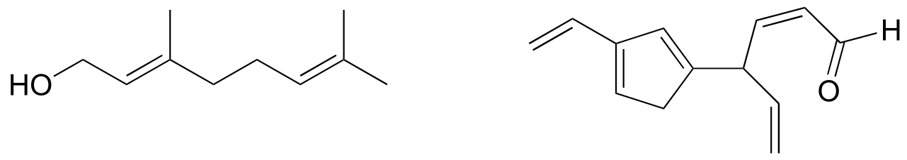 style="width:4.27778in;height:0.77778in" />

fig 6

<u>Exercise 2.10</u>: Identify all isolated and conjugated π bonds in
lycopene, the red-colored compound in tomatoes. How many π electrons are
contained in the conjugated system?

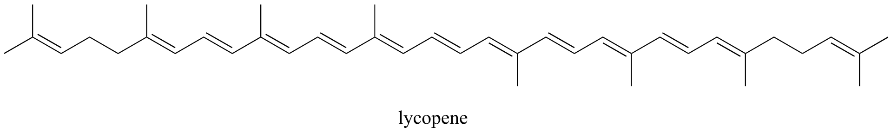

> fig 6a

### 2.2C: Aromaticity

Molecular orbital theory is especially helpful in explaining the unique
properties of **aromatic** compounds such as benzene.

fig 109

Although it is most often drawn with three double bonds and three single
bonds, in fact all of the carbon-carbon bonds in benzene are exactly the
same length (138 pm). In addition, the π bonds in benzene are
significantly less reactive than 'normal' π bonds, either isolated or
conjugated. Something about the structure of benzene makes its π bonding
arrangement especially stable. This ‘something’ has a name: it is called
‘aromaticity’.

What exactly is this ‘aromatic’ property that makes the π bonds in
benzene so stable? In large part, the answer to this question lies in
the fact that benzene is a *cyclic* molecule in which all of the ring
atoms are *sp2*-hybridized. This allows the π electrons to be
delocalized in molecular orbitals that extend all the way around the
ring, above and below the plane. For this to happen, of course, the ring
must be planar – otherwise the *p* orbitals couldn’t overlap properly.
Benzene is indeed known to be a flat molecule.

fig 110

[another
image](http://schoolbag.info/chemistry/central/central.files/image1197.jpg)

[interactive model](http://www.chemtube3d.com/orbitalsbenzene.htm)
(select 'show remaining *p* orbital on C')

Do all cyclic molecules with alternating single and double bonds have
this same aromatic stability? The answer, in fact, is ‘no’. The
eight-membered cyclooctatetraene ring shown below is *not* flat, and its
π bonds react like 'normal' alkenes.

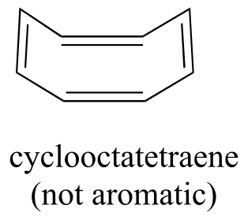

fig 111

[molecular
model](http://web.chem.ucla.edu/~harding/IGOC/C/cyclooctatetraene05.JPG)

Clearly it takes something more to be aromatic, and this can best be
explained with molecular orbital theory. Let’s look at an energy diagram
of the π molecular orbitals in benzene.

fig 112

Quantum mechanical calculations tell us that the six π molecular
orbitals in benzene, formed from six atomic *p* orbitals, occupy four
separate energy levels. π 1 and π 6\* have unique
energy levels, while the π 2 - π 3 and π
4\*- π 5\* pairs are **degenerate**, meaning they
are at the same energy level. When we use the *aufbau* principle to fill
up these orbitals with the six π electrons in benzene, we see that the
bonding orbitals are completely filled, and the antibonding orbitals are
empty. This gives us a good clue to the source of the special stability
of benzene: a full set of bonding MO’s is similar in many ways to the
‘full shell’ of electrons in the atomic orbitals of the stable noble
gases helium, neon, and argon.

Now, let’s do the same thing for cyclooctatetraene, which we have
already learned is *not* aromatic.

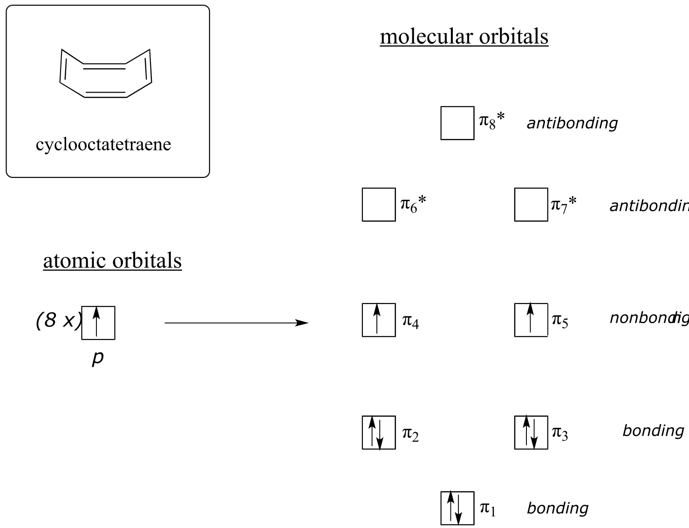

fig 113

The result of molecular orbital calculations tells us that the lowest
and highest energy MOs (π 1 and π 8\*) have unique
energy levels, while the other six form degenerate pairs. Notice that π
4 and π 5 are at the same energy level as the
isolated 2*p*z atomic orbitals: these are therefore neither
bonding nor antibonding, rather they are referred to as **nonbonding
MOs**. Filling up the MOs with the eight π electrons in the molecule, we
find that the last two electrons are unpaired and fall into the two
degenerate nonbonding orbitals. Because we don't have a perfect filled
shell of bonding MOs, our molecule is not aromatic. As a consequence,
each of the double bonds in cyclooctatetraene acts more like an
*isolated* double bond.

Here, then, are the conditions that must be satisfied for a molecule or
group to be considered aromatic:

**Criteria for aromaticity:**

1)  The molecule or group must be cyclic.

2)  The ring must be planar.

3)  Each atom in the ring must be *sp2*-hybridized.

4)  The number of π electrons in the ring must equal 4*n*+2, where *n*
    is any positive integer including zero.

Rule \#4 is known as the **Hückel rule**, named after Erich Hückel, a
German scientist who studied aromatic compounds in the 1930’s. If *n* =
0, the Hückel number is **2**. If *n* = 1, the Hückel number is **6**
(the Hückel number for benzene). The series continues with **10, 14, 18,
22,** and so on. Cyclooctatetraene has eight π electrons, which is *not*
a Hückel number. Because six is such a common Hückel number, chemists
often use the term **'aromatic sextet'**.

Benzene rings are ubiquitous in biomolecules and drugs - below are just
a few examples.

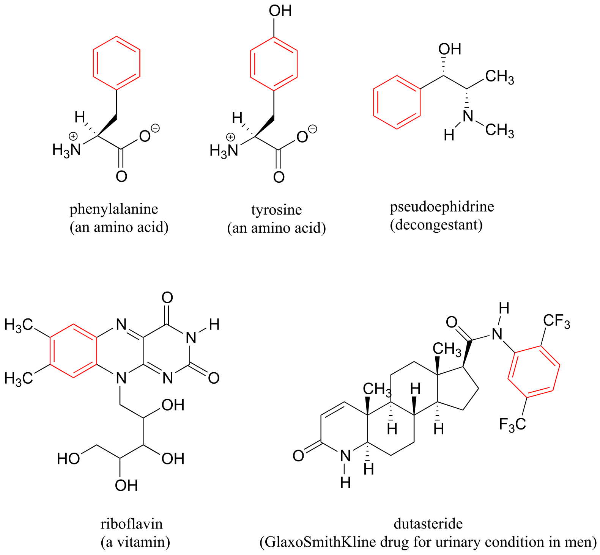

fig 114

Recall that a benzene ring with a hydoxyl substituent -such as seen in
the tyrosine structure above - is called a phenol.

**Heterocycles** - cyclic structures in which the ring atoms may include
oxygen or nitrogen - can also be aromatic. Pyridine, for example, is an
aromatic heterocycle. In the bonding picture for pyridine, the nitrogen
is in the *imine* form: it is *sp2*-hybridized, with two of
the three *sp2* orbitals forming σ overlaps with the
*sp2* orbitals of neighboring carbon atoms, and the third
nitrogen *sp2* orbital containing the lone pair. The
unhybridized *p* orbital contains a single electron, which is part of
the 6 π-electron system delocalized around the ring.

fig 8a

*(see links at end of chapter)fig 8b*

Pyridoxine, commonly known as vitamin B6, and nicotine are
both substituted pyridines.

fig 115

Pyrrole is a five-membered aromatic heterocycle. In pyrrole, the lone
pair electrons on the *sp2*-hybridized nitrogen are part of
the aromatic sextet (contrast this to pyridine, where the lone pair
occupies one of the *sp2* hybrid orbitals).

fig 116

[interactive model](http://www.chemtube3d.com/Pyrrole-Structure.htm)

Why don't we assume that the nitrogen in pyrrole is
s*p3*-hybridized, like a normal secondary amine? The answer
is simple: if it were, then pyrrole could not be aromatic, and thus it
would not have the stability associated with aromaticity. In general,
*if a molecule or group can be aromatic, it will be,* just as water will
always flow downhill if there is a downhill pathway available.

Imidazole is another important example of an aromatic heterocycle found
in biomolecules - the side chain of the amino acid histidine contains an
imidazole ring.

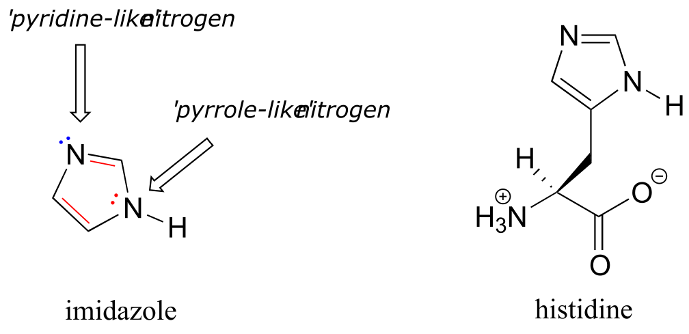

fig 117 [interactive
model](http://www.virtualchemistry.org/molecule.php?filename=imidazole.zmat)

In imidazole, one nitrogen is 'pyrrole-like' (the lone pair contributes
to the aromatic sextet) and one is 'pyridine-like' (an imine - the lone
pair is located in an *sp2* orbital, and is *not* part of the
aromatic sextet).

**Fused-ring** structures can also fulfill the Hückel criteria, and
often have many of the same properties as monocyclic aromatic compounds,
including a planar structure. Indole (a functional group on the side
chain of the amino acid tryptophan) and purine (similar in structure to
the guanine and adenine bases in DNA and RNA) both have a total of ten π
electrons delocalized around two rings.

fig 118

The nucleic acid bases of DNA and RNA - guanine, adenine, cytosine,
thymine, and uracil - are all aromatic systems, with the characteristic
aromatic properties of planarity and delocalized π electron density.
When you study the structure and function of DNA and RNA in a
biochemistry or molecular biology course, you will see that the planar
shape of the bases plays a critically important role.

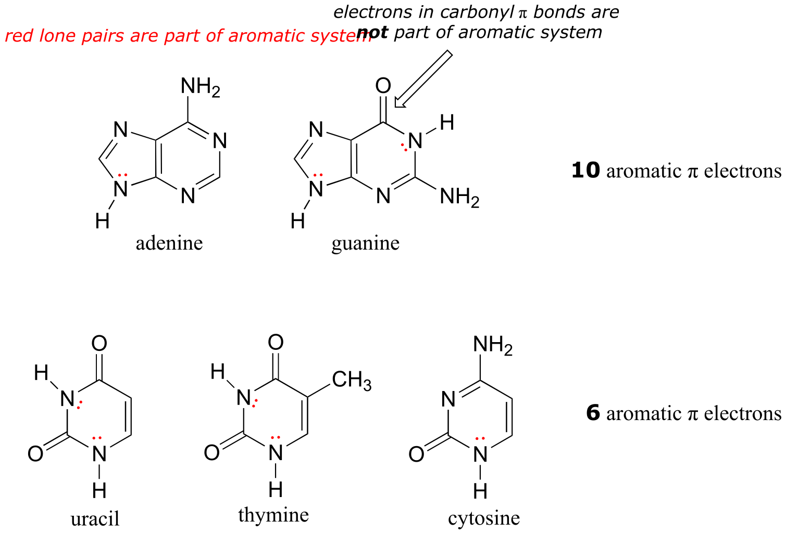

fig 119

interactive models:

[adenine](http://www.chem.purdue.edu/jmol/molecules/aden.html),
[guanine](http://www.chem.purdue.edu/jmol/molecules/guan.html),
[uracil](http://www.chem.purdue.edu/jmol/molecules/uracil.html),
[thymine](http://www.chem.purdue.edu/jmol/molecules/thymine.html),
[cytosine](http://www.chem.purdue.edu/jmol/molecules/cyto.html)

<u>Exercise 2.11</u>: Classify the nitrogen atoms of indole and purine
in terms of where the lone pair electrons are located.

<u>Exercise 2.12:</u> Are the following molecules/ions aromatic?
Explain, using criteria you learned in this section.

## Section 2.3: Resonance

### 2.3A: What is resonance?

If we were to draw the structure of 1,2-dimethylbenzene, there are two
ways that we could draw the double bonds:

fig 6

Which way is correct? There are two simple answers to this question:
'both' and 'neither one'. Both ways of drawing the molecule are equally
acceptable approximations of the bonding picture for the molecule, but
neither one, by itself, is an accurate picture of the delocalized π
bonds. The two alternative drawings, however, *when considered
together*, give a much more accurate picture than either one on its own.
The two drawings imply, when considered together, that the carbon-carbon
bonds are not double bonds, not single bonds, but halfway in between.

These two drawings are an example of what is referred to in organic
chemistry as **resonance contributors**: two or more different Lewis
structures depicting the same molecule or ion that, when considered
together, do a better job of approximating delocalized π bonding than
any single structure. By convention, resonance contributors are linked
by a double-headed arrow:

fig 9

In order to make it easier to visualize the difference between two
resonance contributors, small **curved arrows** are often used. Each of
these arrows (colored red for emphasis in the figure above) depicts the
‘movement’ of two π electrons. A few chapters from now when we begin to
study organic reactions - a process in which electron density shifts and
covalent bonds between atoms break and form - this ‘curved arrow
notation’ will become extremely important in depicting electron
movement. In the drawing of resonance contributors, however, this
electron ‘movement’ occurs only in our minds, as we try to visualize
delocalized π bonds. Nevertheless, use of the curved arrow notation is
an essential skill that you will need to develop in drawing resonance
contributors.

The depiction of benzene using the two resonance contributors A and B in
the figure above does *not* imply that the molecule at one moment looks
like structure A, then at the next moment shifts to look like structure
B. Rather, at all moments, the molecule is a combination, or
**resonance** **hybrid** of both A and B.

**Caution**! It is very important to be clear that in drawing two (or
more) resonance contributors, we are not drawing two different
molecules: they are simply *different depictions of the exact same
molecule*. Furthermore, the double-headed resonance arrow does NOT mean
that a chemical reaction has taken place.

Usually, derivatives of benzene (and phenyl groups, when the benzene
ring is incorporated into a larger organic structure) are depicted with
only one resonance contributor, and it is assumed that the reader
understands that resonance hybridization is implied. This is the
convention that will be used for the most part in this book. In other
books or articles, you may sometimes see benzene or a phenyl group drawn
with a circle inside the hexagon, either solid or dashed, as a way of
drawing a resonance hybrid.

6

fig 10

### 2.3B: Resonance contributors for the carboxylate group

The convention of drawing two or more resonance contributors to
approximate a single structure may seem a bit clumsy to you at this
point, but as you gain experience you will see that the practice is
actually very useful when discussing the manner in which many functional
groups react. Let’s next consider the carboxylate ion (the conjugate
base of a carboxylic acid). As our example, we will use formate, the
simplest possible carboxylate-containing molecule. The conjugate acid of
formate is formic acid, which causes the painful sting you felt if you
have ever been bitten by an ant.

fig 11

Usually, you will see carboxylate groups drawn with one carbon-oxygen
double bond and one carbon-oxygen single bond, with a negative formal
charge located on the single-bonded oxygen. In actuality, however, the
two carbon-oxygen bonds are the same length, and although there is
indeed an overall negative formal charge on the group, it is shared
equally (delocalized) between the two oxygens. Therefore, the
carboxylate can be more accurately depicted by a *pair* of resonance
contributors. Alternatively, a single structure can be used, with a
dashed line depicting the resonance-delocalized π bond and the negative
charge located in between the two oxygens.

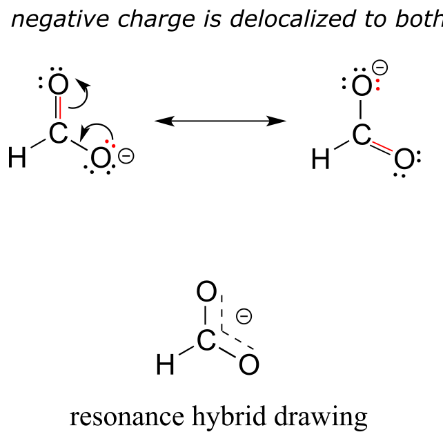

fig 12

Let’s see if we can correlate these drawing conventions to valence bond
theory. The carbon is *sp2*-hybridized: the bond angles are
close to 120˚, and the molecule is planar. Both carbon-oxygen σ bonds,
then, are formed from the overlap of carbon *sp2* orbitals
and oxygen *sp2* orbitals.

fig 13

In addition, the carbon and both oxygens each have an unhybridized
2*p*z orbital situated perpendicular to the plane of the σ
bonds. These three 2*p*z orbitals are parallel to each other,
and can overlap in a side-by-side fashion to form a delocalized π bond.

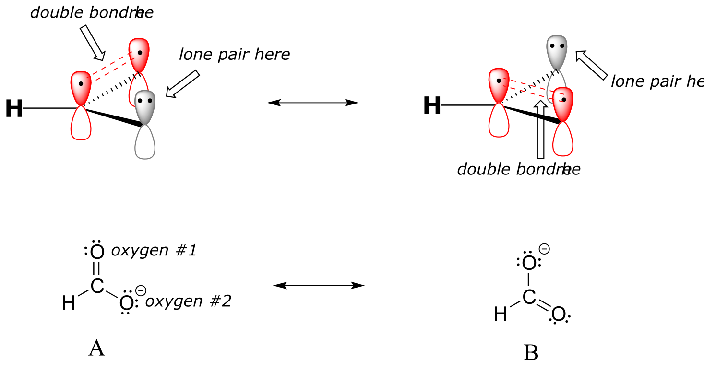

fig 14

Resonance contributor A shows oxygen \#1 sharing a pair of electrons
with carbon in a π bond, and oxygen \#2 holding a lone pair of electrons
in its *p* orbital. Resonance contributor B, on the other hand, shows
oxygen \#2 participating in the π bond with carbon, and oxygen \#1
holding a lone pair in its *p* orbital. Overall, the situation is one of
***three** parallel, overlapping p orbitals sharing **four** delocalized
π electrons*. Because there is one more electron than there are *p*
orbitals, the system has an overall charge of –1. This is the kind of 3D
picture that resonance contributors are used to approximate, and once
you get some practice you should be able to quickly visualize
overlapping *p* orbitals and delocalized π electrons whenever you see
resonance structures being used. In this text, carboxylate groups will
usually be drawn showing only one resonance contributor for the sake of
simplicity, but you should always keep in mind that the two C-O bonds
are equal, and that the negative charge is delocalized to both oxygens.

<u>Exercise 2.13</u>: There is a third resonance contributor for formate
(which we will soon learn is considered a 'minor' contributor). Draw
this resonance contributor.

Here's another example, this time with a carbocation. Recall from
section 2.1C that carbocations are *sp2*-hybridized, with an
empty *p* orbital oriented perpendicular to the plane formed by three σ
bonds. If a carbocation is adjacent to a double bond, then three *p*
orbitals can overlap and share the two π electrons - another kind of
conjugated π system in which the positive charge is shared over two
carbons.

fig 14a

<u>Exercise 2.14</u>: Draw the resonance contributors that correspond to
the curved, two-electron movement arrows in the resonance expressions
below.

fig 14b

<u>Exercise 2.15</u>: In each resonance expression, draw curved
two-electron movement arrows on the left-side contributor that shows how
we get to the right-side contributor. Be sure to include formal charges.

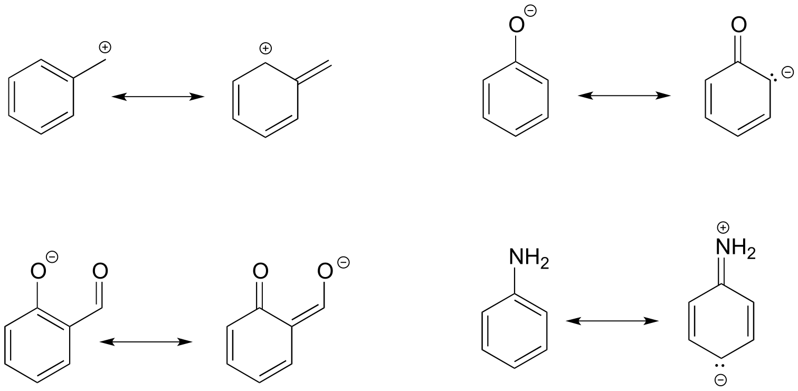

fig 14c

### 2.3C: Rules for drawing resonance structures

As you work on learning how to draw and interpret resonance structures,
there are a few basic rules that you should keep in mind in order to
avoid drawing nonsensical structures. All of these rules make perfect
sense as long as you keep in mind that resonance contributors are merely
a human-invented convention for depicting the delocalization of π
electrons in conjugated systems.

> **Rules for drawing resonance structures:**
>
> 1\) When you see two different resonance contributors, you are *not*
> seeing a chemical reaction! Rather, you are seeing the exact same
> molecule or ion depicted in two different ways.
>
> 2\) Resonance contributors involve the ‘imaginary movement’ of
> π-bonded electrons or of lone-pair electrons that are adjacent to
> (*i.e*. conjugated to) π bonds. You can *never* shift the location of
> electrons in σ bonds – if you show a σ bond forming or breaking, you
> are showing a chemical reaction taking place (see rule \#1). Likewise,
> the positions of *atoms* in the molecule cannot change between two
> resonance contributors.
>
> 3\) All resonance contributors for a molecule or ion must have the
> same *net* charge.
>
> 4\) All resonance contributors must be drawn as proper Lewis
> structures, with correct formal charges. Never show curved 'electron
> movement' arrows that would lead to a situation where a second-row
> element (ie. carbon, nitrogen, or oxygen) has more than eight
> electrons: this would break the 'octet rule'. Sometimes, however, we
> will draw resonance contributors in which a carbon atom has only six
> electrons (ie. a carbocation). In general, all oxygen and nitrogen
> atoms should have a complete octet of valence electrons.

To expand a bit on rule \#4, there are really only three things we can
do with curved arrows when drawing resonance structures. First, we can
take the two electrons in a π bond and shift them to become a lone pair
on an adjacent atom (arrow ‘a’ below).

Second, we can take a lone pair on an atom and put those two electrons
into a π bond on the same atom (arrow ‘b’). Third, we can shift a π bond
one position over (arrow c).

fig 15

Resonance arrows can also be combined - below, we show arrows a and b
together:

fig 15a

Notice that we do not exceed the octet rule on any atoms when we move
electrons with arrows a, b and c. The resonance picture below shows an
'illegal' movement of electrons, because it would result in a carbon
with five bonds, or 10 valence electrons (this would break the octet
rule):

fig 15b

Always be very careful when drawing resonance structures that your
arrows do ***only*** the three types of electron movement described
above, and that you ***never*** exceed the octet rule on a second-row
element. It is often helpful (but optional), to include all lone-pair
electrons on oxygen and nitrogen in the drawing in order to keep track
of valence electrons, avoid breaking the octet rule, and recognize when
atoms have a negative or positive formal charge. Getting the 'electron
accounting' correct is a big part of working with resonance
contributors.

Below are a few more examples of 'legal' resonance expressions. Confirm
for yourself that the octet rule is not exceeded for any atoms, and that
formal charges are correct.

fig 15c

<u>Exercise 2.16</u>: Each of the 'illegal' resonance expressions below
contains one or more mistakes. Explain what is incorrect in each.

fig 16a

### 2.3D: Major vs minor resonance contributors

Different resonance contributors do not always make the same
contribution to the overall structure of the hybrid - rather, in many
cases one contributor comes closer to depicting the actual bonding
picture than another. In the case of carboxylates, contributors A and B
below are equivalent in terms of their relative contribution to the
hybrid structure. However, there is also a third resonance contributor
‘C, in which the carbon bears a positive formal charge and both oxygens
are single-bonded and bear negative charges.

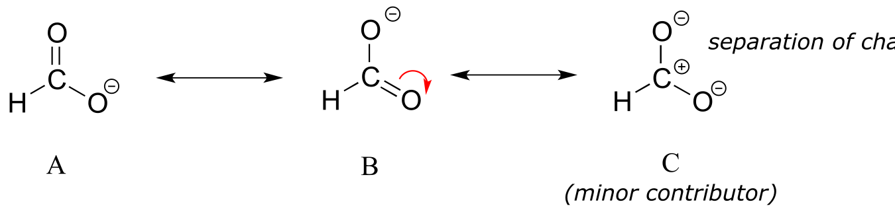

fig 17

Structure C makes a less important contribution to the overall bonding
picture of the group relative to A and B. How do we know that structure
C is the ‘minor’ contributor? There are four basic rules which you need
to learn in order to evaluate the relative importance of different
resonance contributors. We will number them 5-8 so that they may be
added to in the 'rules for resonance' list from section 2.2C.

> **Rules for determining major and minor resonance contributors:**
>
> 5\) The carbon in contributor C does not have an octet – in general,
> resonance contributors in which a carbon does not fulfill the octet
> rule are relatively less important.
>
> 6\) In structure C, a separation of charge has been introduced that is
> not present in A or B. In general, resonance contributors in which
> there is a greater separation of charge are relatively less important.
>
> 7\) In structure C, there are only three bonds, compared to four in A
> and B. In general, a resonance structure with a lower number of total
> bonds is relatively less important.
>
> 8\) The resonance contributor in which a negative formal charge is
> located on a more electronegative atom, usually oxygen or nitrogen, is
> more stable than one in which the negative charge is located on a less
> electronegative atom such as carbon. *An example is in the upper left
> expression in the next figure.*

Below are some additional examples of major and minor resonance
contributors:

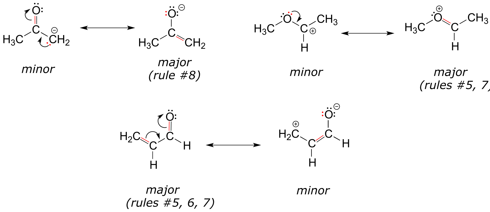

fig 17a

Why do we worry about a resonance contributor if it is the minor one? We
will see later that very often a minor contributor can still be
extremely important to our understanding of how a molecule reacts.

<u>Exercise 2.17:</u> a) Draw a minor resonance structure for acetone
(IUPAC name 2-propanone). Explain why it is a minor contributor. b) Are
acetone and 2-propanol resonance contributors of each other? Explain.

<u>Exercise 2.18</u>:

a\) Draw four additional resonance contributors for the molecule below.
Label each one as major or minor (the structure below is of a major
contributor).

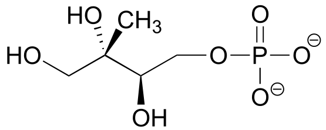

b\) Draw four resonance contributors showing how the positive charge on
the side chain of the (cationic) amino acid arginine can be delocalized.

<u>Exercise 2.19</u>: Draw three resonance contributors of methyl
acetate (IUPAC name methyl methanoate), and order them according to
their relative importance to the bonding picture of the molecule.
Explain your reasoning.

[Video tutorial:
resonance](https://www.khanacademy.org/science/organic-chemistry/organic-structures/formal-charge-resonance/v/resonance-intro-jay)

### 2.3E: Resonance and peptide bonds

What is the hybridization state of the nitrogen atom in an amide? At
first glance, it would seem logical to say that it is
*sp3*-hybridized, because, like the nitrogen in an amine, the
Lewis structure shows three single bonds and a lone pair. The picture
looks quite different, though, if we consider another resonance
contributor in which the nitrogen has a double bond to the carbonyl
carbon: in this case, we would have to say that applicable hybridization
is *sp2*, and the bonding geometry trigonal planar rather
than tetrahedral.

fig 18a

In fact, the latter picture is more accurate: the lone pair of electrons
on an amide nitrogen are not localized in an *sp3* orbital,
rather, they are delocalized as part of a conjugated π system, and the
bonding geometry around the nitrogen is trigonal planar as expected for
*sp2* hybridization. This is a good illustration of an
important point: conjugation and the corresponding delocalization of
electron density is stabilizing, thus if conjugation can occur, it
probably will.

One of the most important examples of amide groups in nature is the
‘peptide bond’ that links amino acids to form polypeptides and proteins.

fig 18

Critical to the structure of proteins is the fact that, although it is
conventionally drawn as a single bond, *the C-N bond in a peptide
linkage has a significant barrier to rotation*, indicating that to some
degree, C-N π overlap is present - in other words, there is some double
bond character, and the nitrogen is *sp2* hybridized with
trigonal planar geometry.

fig 18

The barrier to rotation in peptide bonds is an integral part of protein
structure, introducing more rigidity to the protein's backbone. If there
were no barrier to rotation in a peptide bond, proteins would be much
more 'floppy' and three dimensional folding would be very different.

[Interactive model of a Leu-Ala
peptide](http://www.biotopics.co.uk/jsmol/leuala.html):

note the trigonal planar geometry of the peptide bond nitrogen!

<u>Exercise 2.20</u>: Draw two pictures showing the unhybridized *p*
orbitals and the location of π electrons in methyl amide. One picture
should represent the major resonance contributor, the other the minor
contributor. How many overlapping *p* orbitals are sharing how many
π-bonded electrons?

<u>Exercise 2.21:</u> Draw two pictures showing the unhybridized *p*
orbitals and the location of π electrons in the 'enolate' anion shown
below. One picture should represent the major resonance contributor, the
other the minor contributor. How many overlapping *p* orbitals are
sharing how many π-bonded electrons?

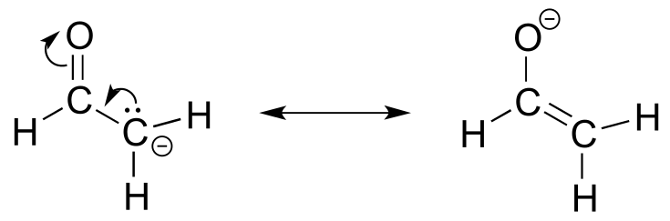

fig 20

<u>Exercise 2.22</u>: Below is a minor resonance contributor of a
species known as an 'enamine', which we will study more in chapter 12.
Draw the major resonance contributor for the enamine, and explain why
your contributor is the major one (refer to resonance rules \#5-8 from
this section).

fig 21

<u>Solved example:</u>

Draw the major resonance contributor of the structure below. Include in
your figure the appropriate curved arrows showing how you got from the
given structure to your structure. Explain why your contributor is the
major one. In what kind of orbitals are the two lone pairs on the
oxygen?

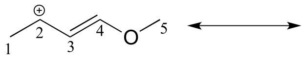

fig 23a

<u>Solution</u>: In the structure above, the carbon with the positive
formal charge does not have a complete octet of valence electrons. Using
the curved arrow convention, a lone pair on the oxygen can be moved to
the adjacent bond to the left, and the electrons in the double bond
shifted over to the left (see the rules for drawing resonance
contributors to convince yourself that these are 'legal' moves).

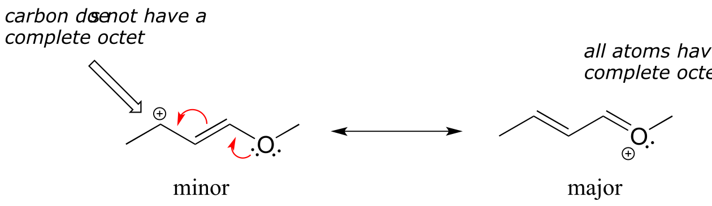

fig 23a

The resulting resonance contributor, in which the oxygen bears the
formal charge, is the major one because all atoms have a complete octet,
and there is one additional bond drawn (resonance rules \#5 and \#7 both
apply). This system can be thought of as four parallel *p* orbitals (one
each on C2, C3, and C4, plus one on
oxygen) sharing four π electrons. One lone pair on the oxygen is in an
unhybridized *p* orbital and is part of the conjugated π system, and the
other is located in an *sp2* orbital.

Also note that one additional contributor can be drawn, but it is also
minor because it has a carbon with an incomplete octet:

fig 23a

<u>Exercise 2.23</u>:

a\) Draw three additional resonance contributors for the carbocation
below. Include in your figure the appropriate curved arrows showing how
one contributor is converted to the next.

fig 23

b\) Fill in the blanks: the conjugated π system in this carbocation is
composed of \_\_\_\_\_\_ *p* orbitals sharing \_\_\_\_\_\_\_\_
delocalized π electrons.

<u>Exercise 2.24</u>:

Draw the major resonance contributor for each of the anions below.

fig 24

c\) Fill in the blanks: the conjugated π system in part (a) is composed
of \_\_\_\_\_\_ *p* orbitals containing \_\_\_\_\_\_\_\_ delocalized π
electrons.

<u>Exercise 2.25</u>: The figure below shows how the negative formal
charge on the oxygen can be delocalized to the carbon indicated by an
arrow. More resonance contributors can be drawn in which negative charge
is delocalized to three other atoms on the molecule.

a\) Circle these atoms.

b\) Draw the two most important resonance contributors for the molecule.

fig 24a

**A word of advice**

Becoming adept at drawing resonance contributors, using the curved arrow
notation to show how one contributor can be converted to another, and
understanding the concepts of conjugation and resonance delocalization
are some of the most challenging but also most important jobs that you
will have as a beginning student of organic chemistry. If you work hard
now to gain a firm grasp of these ideas, you will have come a long way
toward understanding much of what follows in your organic chemistry
course. Conversely, if you fail to come to grips with these concepts
now, a lot of what you see later in the course will seem like a bunch of
mysterious and incomprehensible lines, dots, and arrows, and you will be
in for a rough ride, to say the least. More so than many other topics in
organic chemistry, *understanding bonding, conjugation, and resonance is
something that most students really need to work on 'in person' with an
instructor or tutor*, *preferably* *using a molecular modeling kit*.
Keep working problems, keep asking questions, and keep at it until it
all makes sense!

## Section 2.4: Non-covalent interactions

Until now we have been focusing on understanding the covalent bonds that
hold individual molecules together. We turn next to a review on the
subject of non-covalent interactions *between* molecules, or between
different functional groups within a single molecule. You have probably
learned all of these concepts already in your general chemistry course,
but this review will focus on applications to organic and biological
chemistry, and specifically will allow us to explain differences in
physical properties -such boiling points, melting points, and
solubility - between different organic compounds. An understanding of
noncovalent interactions is also critical for looking at the environment
inside the active site of an enzyme, where much of the chemistry that we
will study in this book takes place.

### 2.4A: Dipoles

To understand the nature of noncovalent interactions, we first must
return to covalent bonds and delve into the subject of dipoles. Many of
the covalent bonds that we have seen – between two carbons, for example,
or between a carbon and a hydrogen –involve the approximately equal
sharing of electrons between the two atoms in the bond. In these
examples, the two atoms have approximately the same
**electronegativity**. Recall from your general chemistry course that
electronegativity refers to “ the power of an atom in a molecule to
attract electrons to itself” (this is the definition offered by Linus
Pauling, the eminent 20th-century American chemist who was
primarily responsible for developing many of the bonding concepts that
we have been learning).

However, quite often in organic chemistry we deal with covalent bonds
between two atoms with different electronegativities, and in these cases
the sharing of electrons is not equal: the more electronegative nucleus
pulls the two electrons closer. In the carbon-oxygen bond of an alcohol,
for example, the two electrons in the σ bond are held more closely to
the oxygen than they are to the carbon, because oxygen is significantly
more electronegative than carbon. The same is true for the
oxygen-hydrogen bond, as hydrogen is slightly less electronegative than
carbon, and much less electronegative than oxygen.

fig 25

The result of this unequal sharing is what we call a **bond dipole**,
which exists in a **polar covalent bond**. A bond dipole has both
negative and positive ends, or poles, where electron density is lower
(the positive pole) and higher (the negative pole). The difference in
electron density can be expressed using the Greek letter δ (delta) to
denote ‘partial positive’ and ‘partial negative’ charge on the atoms.
‘Dipole arrows’, with a positive sign on the tail, are also used to
indicated the negative (higher electron density) direction of the
dipole.

The degree of polarity in a covalent bond depends on the difference in
electronegativity between the two atoms. Electronegativity is a periodic
trend: it increases going from left to right across a row of the
periodic table of the elements, and also increases as we move up a
column. Therefore, oxygen is more electronegative than nitrogen, which
is in turn more electronegative than carbon. Oxygen is also more
electronegative than sulfur. Fluorine, in the top right corner of the
periodic table, is the most electronegative of the elements. Hydrogen is
slightly less electronegative than carbon.

**Periodic trends in electronegativity**

fig 25a

<u>Exercise 2.26</u>: Using what you about atomic orbitals, rationalize
the periodic trends in electronegativity. Why does it increase from left
to right, and decrease from top to bottom? This is a good question to
talk through with classmates and an instructor or tutor.

Most molecules contain both polar and nonpolar covalent bonds. Depending
on the location of polar bonds and bonding geometry, molecules may
possess a net polarity, called a **molecular dipole moment**. Water, as
you probably recall, has a dipole moment that results from the combined
dipoles of its two oxygen-hydrogen bonds. Fluoromethane also has a
dipole moment.

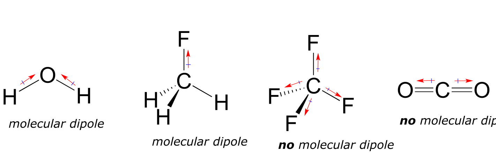

fig 26a

Tetrafluoromethane, however, has four polar bonds that pull equally in
to the four corners of a tetahedron, meaning that although there are
four bond dipoles there is no overall *molecular* dipole moment. Carbon
dioxide also lacks a molecular dipole moment.

<u>Exercise 2.27</u>: Which of the molecules below have molecular dipole
moments?

### 2.4B: Ion-ion, dipole-dipole and ion-dipole interactions

The strongest type of non-covalent interaction is between two ionic
groups of opposite charge (an **ion-ion** or **charge-charge
interaction**). You probably saw lots of examples of ionic bonds in
inorganic compounds in your general chemistry course: for example, table
salt is composed of sodium cations and chloride anions, held in a
crystal lattice by ion-ion interactions. One of the most common examples
in biological organic chemistry is the interaction between a magnesium
cation (Mg+2) and an anionic carboxylate or phosphate group.
The figure below shows 2-phosphoglycerate, an intermediate in the
glycolysis pathway, interacting with two Mg+2 ions in the
active site of a glycolytic enzyme called enolase.

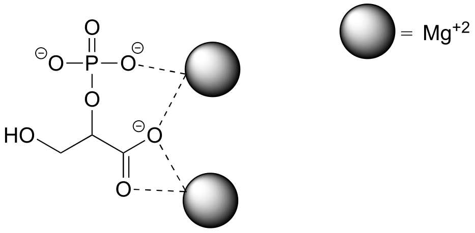

fig 27

Polar molecules – those with an overall dipole moment, such as acetone –
can align themselves in such a way as to allow their respective positive
and negative poles to interact with each other. This is called a
**dipole-dipole interaction**.

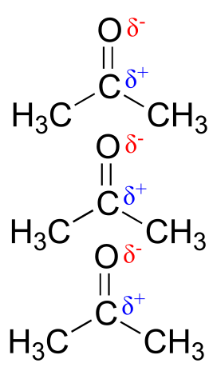

[another
image](https://image.slidesharecdn.com/basicsoforganic-141011234053-conversion-gate01/95/basics-of-organic-20-638.jpg?cb=1413071066)

fig 28

When a charged species (an ion) interacts favorably with a polar
molecule or functional group, the result is called an **ion-dipole
interaction**. A common example of ion-dipole interaction in biological
organic chemistry is that between a metal cation, most often
Mg+2 or Zn+2, and the partially negative oxygen of
a carbonyl.

fig 29

Because the metal cation is very electronegative, this interaction has
the effect of pulling electron density in the carbonyl double bond even
further toward the oxygen side, increasing the partial positive charge
on carbon.  As we shall later, this has important implications in terms
of the reactivity of carbonyl groups in biochemical reactions.

### 2.4C: Van der Waals forces

Nonpolar molecules such as hydrocarbons also are subject to relatively
weak but still significant attractive noncovalent forces. [**Van der
Waals
forces**](https://s3-us-west-2.amazonaws.com/courses-images-archive-read-only/wp-content/uploads/sites/887/2015/06/23214344/CNX_Chem_10_01_DispForces.jpg)
(also called **London dispersion forces** or **nonpolar interactions**)
result from the constantly shifting electron density in any molecule.
Even a nonpolar molecule will, at any given moment, have a weak,
short-lived dipole. This transient dipole will induce a neighboring
nonpolar molecule to develop a corresponding transient dipole of its
own, with the end result that a transient dipole-dipole interaction is
formed. These van der Waals forces are relatively weak, but are
constantly forming and dissipating among closely-packed nonpolar
molecules, and when added up the cumulative effect can become
significant.

### 2.4D: Hydrogen bonds

**Hydrogen bonds** result from the interaction between a hydrogen bonded
to an electronegative heteroatom – specifically a nitrogen, oxygen, or
fluorine – and lone-pair electrons on a nitrogen, oxygen, or fluorine a
neighboring molecule or functional group. Because a hydrogen atom is
just a single proton and a single electron, when it loses electron
density in a polar bond it essentially becomes an approximation of a
‘naked’ proton, capable of forming a strong interaction with a lone pair
on a neighboring electronegative atom.

fig 30

Hydrogen bonds are usually depicted with dotted lines in chemical
structures. A group that provides a proton to a hydrogen bond is said to
be acting as a **hydrogen bond donor**. A group that provides an oxygen
or nitrogen lone pair is said to be acting as a **hydrogen bond
acceptor**. Many common organic functional groups can participate in the
formation of hydrogen bonds, either as donors, acceptors, or both. Water
and alcohols, for example, can be both hydrogen bond donors and
acceptors. A carbonyl, as it lacks a hydrogen bound to an oxygen or
nitrogen, can only act as a hydrogen bond acceptor.

<u>Exercise 2.28:</u> Classify the structures below as: A) capable of
being both a hydrogen bond donor and acceptor, B) capable of being a
hydrogen bond acceptor, but not a donor, or C) not capable of
participating in hydrogen bonding.

>  style="width:5.18542in;height:1.63889in" />
>
> fig 30A

<u>Exercise 2.29</u>: Draw figures that show the hydrogen bonds
described below.

a\) A hydrogen bond between methanol (donor) and water (acceptor).

b\) A hydrogen bond between methanol (acceptor) and water (donor).

c\) Two possible hydrogen bonds between methyl acetate and methylamine.

In general, hydrogen bonds are stronger than dipole-dipole interactions,
but also much weaker than covalent bonds. The strength of hydrogen bonds
has enormous implications in biology. Copying of DNA in the cell, for
example, is based on very specific hydrogen bonding arrangements between
DNA bases on complimentary strands: adenine pairs with thymine, while
guanine pairs with cytidine:

[Interactive model](http://www.chemtube3d.com/solidstate/DNAbases.htm)

Hydrogen bonds, as well as the other types of noncovalent interactions,
are very important in terms of the binding of a ligand to a protein. In
section 1.3D, we saw a 'space-filling' picture of an enzyme with its
substrate bound in its active site. Here, in a two-dimensional
approximation, is an image of the same substrate-enzyme pair showing how
amino acid side chain (green) and parent chain (blue) groups surround
and interact via hydrogen bonding with functional groups on the
substrate (red).

fig 30c

## Section 2.5: Physical properties of organic compounds

An understanding of the various types of noncovalent forces allows us to
explain, on a molecular level, many observable physical properties of
organic compounds. In this section, we will concentrate on solubility
(especially solubility in water), melting point, and boiling point.

### 2.5A: Solubility

Virtually all of the organic chemistry that you will see in this course
takes place in the solution phase. In the organic laboratory, reactions
are often run in nonpolar or slightly polar solvents such as toluene
(methylbenzene), dichloromethane, or diethylether. In recent years, much
effort has been made to adapt reaction conditions to allow for the use
of ‘greener’ (in other words, more environmentally friendly) solvents
such as water or ethanol, which are polar and capable of hydrogen
bonding. In biochemical reactions the solvent is of course water, but
the 'microenvironment' inside an enzyme's active site - where the actual
chemistry is going on - can range from very polar to very non-polar,
depending on which amino acid residues are present.

You probably remember the 'like dissolves like’ rule you learned in
general chemistry, and even before you took any chemistry at all, you
probably observed at some point in your life that oil does not mix with
water. Let’s revisit this rule, and put our knowledge of covalent and
noncovalent bonding to work.

When considering the solubility of an organic compound in a given
solvent, the most important question to ask ourselves is: how strong are
the noncovalent interactions between the compound and the solvent
molecules? If the solvent is polar, like water, then a smaller
hydrocarbon component and/or more charged, hydrogen bonding, and other
polar groups will tend to increase the solubility. If the solvent is
non-polar, like hexane, then the exact opposite is true.

Imagine that you have a flask filled with water, and a selection of
substances that you will test to see how well they dissolve in the
water. The first substance is table salt, or sodium chloride. As you
would almost certainly predict, especially if you’ve ever inadvertently
taken a mouthful of water while swimming in the ocean, this ionic
compound dissolves readily in water. Why? Because water, as a very polar
molecule, is able to form many ion-dipole interactions with both the
sodium cation and the chloride anion, the energy from which is more than
enough to make up for energy required to break up the ion-ion
interactions in the salt crystal.

fig 32

more images of NaCl:
[lattice](http://moorechemistry.weebly.com/uploads/8/9/4/4/8944539/217734.jpg),
[solution](http://wps.prenhall.com/wps/media/objects/3312/3391718/imag1301/AAAVSZU0.JPG)

The end result, then, is that in place of sodium chloride crystals, we
have individual sodium cations and chloride anions surrounded by water
molecules – the salt is now *in solution*. Charged species as a rule
dissolve readily in water: in other words, they are very **hydrophilic**
(water-loving).

Now, we’ll try a compound called biphenyl, which, like sodium chloride,
is a colorless crystalline substance.

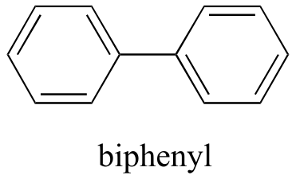

fig 10

Biphenyl does not dissolve at all in water. Why is this? Because it is a
very non-polar molecule, with only carbon-carbon and carbon-hydrogen
bonds. It is able to bond to itself very well through nonpolar van der
Waals interactions, but it is not able to form significant attractive
interactions with very polar solvent molecules like water. Thus, the
energetic cost of breaking up the biphenyl-to-biphenyl interactions in
the solid is high, and very little is gained in terms of new
biphenyl-water interactions. Water is a terrible solvent for nonpolar
hydrocarbon molecules: they are very **hydrophobic** (water-fearing).

Next, you try a series of increasingly large alcohol compounds, starting
with methanol (1 carbon) and ending with octanol (8 carbons).

fig 33

You find that the smaller alcohols - methanol, ethanol, and propanol -
dissolve easily in water, at any water/alcohol ratio that you try. This
is because the water is able to form hydrogen bonds with the hydroxyl
group in these molecules, and the combined energy of formation of these
water-alcohol hydrogen bonds is more than enough to make up for the
energy that is lost when the alcohol-alcohol (and water-water) hydrogen
bonds are broken up. When you try butanol, however, you begin to notice
that, as you add more and more to the water, it starts to form a layer
on top of the water. Butanol is only sparingly soluble in water.

The longer-chain alcohols - pentanol, hexanol, heptanol, and octanol -
are increasingly non-soluble in water. What is happening here? Clearly,
the same favorable water-alcohol hydrogen bonds are still possible with
these larger alcohols. The difference, of course, is that the larger
alcohols have larger nonpolar, hydrophobic regions in addition to their
hydrophilic hydroxyl group. At about four or five carbons, the influence
of the hydrophobic part of the molecule begins to overcome that of the
hydrophilic part, and water solubility is lost.

Now, try dissolving glucose in the water – even though it has six
carbons just like hexanol, it also has five hydrogen-bonding,
hydrophilic hydroxyl groups in addition to a sixth oxygen that is
capable of being a hydrogen bond acceptor.

fig 34

We have tipped the scales to the hydrophilic side, and we find that
glucose is quite soluble in water.

We saw that ethanol was very water-soluble (if it were not, drinking
beer or vodka would be rather inconvenient!) How about dimethyl ether,
which is a constitutional isomer of ethanol but with an ether rather
than an alcohol functional group? We find that diethyl ether is much
less soluble in water. Is it capable of forming hydrogen bonds with
water? Yes, in fact, it is –the ether oxygen can act as a hydrogen-bond
acceptor. The difference between the ether group and the alcohol group,
however, is that the alcohol group is both a hydrogen bond donor *and*
acceptor.

fig 35

The result is that the alcohol is able to form more energetically
favorable interactions with the solvent compared to the ether, and the
alcohol is therefore much more soluble.

Here is another easy experiment that can be done (with proper
supervision) in an organic laboratory. Try dissolving benzoic acid
crystals in room temperature water – you'll find that it is not soluble.
As we will learn when we study acid-base chemistry in a later chapter,
carboxylic acids such as benzoic acid are relatively weak acids, and
thus exist mostly in the acidic (protonated) form when added to pure
water.

fig 36

Acetic acid (vinegar) is quite soluble. This is easy to explain using
the small alcohol vs large alcohol argument: the hydrogen-bonding,
hydrophilic effect of the carboxylic acid group is powerful enough to
overcome the hydrophobic effect of a single hydrophobic methyl group on
acetic acid, but not the larger hydrophobic effect of the 6-carbon
benzene group on benzoic acid.

Now, try slowly adding some aqueous sodium hydroxide to the flask
containing undissolved benzoic acid. As the solvent becomes more and
more basic, the benzoic acid begins to dissolve, until it is completely
in solution.

fig 37

What is happening here is that the benzoic acid is being converted to
its conjugate base, benzoate. The *neutral* carboxylic acid group was
not hydrophilic enough to make up for the hydrophobic benzene ring, but
the carboxylate group, with its *full negative charge*, is much more
hydrophilic. Now, the balance is tipped in favor of water solubility, as
the powerfully hydrophilic anion part of the molecule drags the
hydrophobic part into solution. Remember, charged species usually
dissolve readily in water. If you want to precipitate the benzoic acid
back out of solution, you can simply add enough hydrochloric acid to
neutralize the solution and reprotonate the carboxylate.

If you are taking a lab component of your organic chemistry course, you
will probably do at least one experiment in which you will use this
phenomenon to physically separate an organic acid like benzoic acid from
a hydrocarbon compound like biphenyl.

Similar arguments can be made to rationalize the solubility of different
organic compounds in nonpolar or slightly polar solvents. In general,
the greater the content of charged and polar groups in a molecule, the
less soluble it tends to be in solvents such as hexane. The ionic and
very hydrophilic sodium chloride, for example, is not at all soluble in
hexane solvent, while the hydrophobic biphenyl is very soluble in
hexane.

Because we are concentrating on the biologically relevant chemistry,
let's take a minute to review how to evaluate a compound's solubility in
water, the biological solvent:

**Summary of factors contributing to water solubility:**

A: How many carbons? All else being equal, more carbons means more of a
non-polar/hydrophobic character, and thus lower solubility in water.

B: How many, and what kind of hydrophilic groups? The more, the greater
the water solubility. In order of importance:

\#1) Anything with a **charged** group (eg. ammonium, carboxylate,
phosphate) is almost certainly water soluble, unless has a vary large
nonpolar group, in which case it will most likely be soluble in the form
of micelles, like a soap or detergent (see next section).

\#2) Any functional group that can **donate a hydrogen bond** to water
(eg. alcohols, amines) will significantly contribute to water
solubility.

\#3) Any functional group that can only **accept a hydrogen bond** from
water (eg. ketones, aldehydes, ethers) will have a somewhat smaller but
still significant effect on water solubility.

\#4) Other groups that contribute to polarity (eg. alkyl halides, thiols
sulfides) will make a small contribution to water solubility.

<u>Exercise 2.30:</u> Rank each set of three compounds below according
to their solubility in water (most soluble to least):

fig 37a

<u>Exercise 2.31</u>: Vitamins can be classified as water-soluble or
fat-soluble (consider fat to be a very non-polar 'solvent'. Decide on a
classification for each of the vitamins shown below.

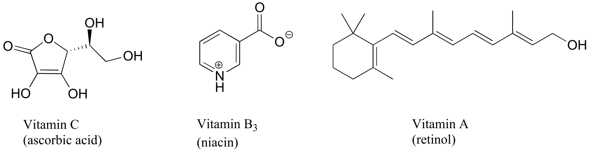

fig 37b

<u>Exercise 2.32</u>: Both aniline and phenol are mostly insoluble in
pure water. Predict the solubility of these two compounds in 10% aqueous
hydrochloric acid, and explain your reasoning.

<u>Exercise 2.33</u>: Would you predict methanol or 2-propanol (rubbing
alcohol) to be a better solvent for cyclohexanone? Why?

Because water is the biological solvent, most biological organic
molecules, in order to maintain water-solubility, contain one or more
charged functional groups: most often phosphate, ammonium or
carboxylate.

fig 38

Note that the charge on these functional groups depends on their
protonation state: spermidine, for example, could be drawn with three
(uncharged) amine groups rather than the charged ammonium groups as
shown, and orotate could be drawn in the uncharged carboxylic acid form.
It turns out, however, that these three functional groups are all
charged when in a buffer at the physiological pH of approximately 7.3.
We will have much more to say about the acid-base aspects of these
groups in chapter 7.

Carbohydrates often lack charged groups, but as we discussed in our
‘thought experiment’ with glucose, they are quite water-soluble due to
the presence of multiple hydroxyl groups, which can hydrogen bond with
water.

Some biomolecules, in contrast, contain distinctly hydrophobic
components. Membrane lipids are **amphipathic**, meaning that they
contain both hydrophobic and hydrophilic components. Cell membranes are
composed of membrane lipids arranged in a 'bilayer', with the
hydrophobic 'tails' pointing inward and the hydrophilic 'heads' forming
the inner and outer surfaces, both of which are in contact with water.

[another
image](http://academic.brooklyn.cuny.edu/biology/bio4fv/page/lipos.gif)

The nonpolar interior of the lipid bilayer is able to 'dissolve'
hydrophobic biomolecules such as cholesterol. Polar and charged
biomolecules, on the other hand, are not able to cross the membrane,
because they are repelled by the hydrophobic environment of the
bilayer's interior. The transport of water-soluble molecules across a
membrane can be accomplished in a controlled and specific manner by
special transmembrane transport proteins, a fascinating topic that you
will learn more about if you take a class in biochemistry.

A similar principle is the basis for the action of soaps and detergents.
Soaps are composed of fatty acids such as stearate obtained through
basic hydrolysis of triacylglycerols (section 1.3A) in fats and oils.

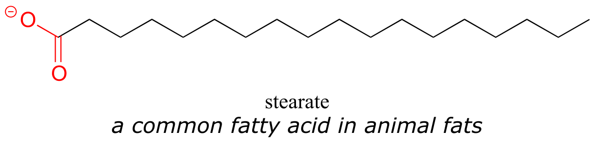

fig 39

[molecular
model](https://en.wikipedia.org/wiki/Stearic_acid#/media/File:Stearic-acid-3D-balls.png)

Like membrane lipids, fatty acids are amphipathic. In aqueous solution,
the fatty acid molecules in soaps will spontaneously form **micelles**,
a spherical structure that allows the hydrophobic tails to avoid contact
with water and simultaneously form favorable van der Waals contacts with
each other.

[another
image](http://www.beautybythegeeks.com/wp-content/uploads/micelle-1024x644.png)*40*

Because the outside of the micelle is charged, the structure as a whole
is soluble in water. Micelles will form spontaneously around small
particles of oil that normally would not dissolve in water, and will
carry the particle away with it into solution. We will learn more about
the chemistry of soap-making in chapter 11.

Synthetic detergents are non-natural amphipathic molecules that work by
the same principle as that described for soaps.

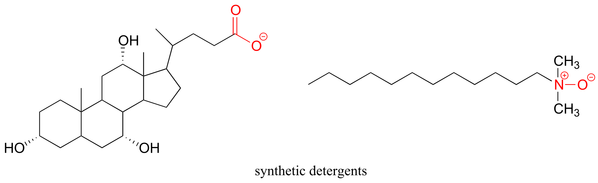

fig 41

[Video tutorial:
solubility](https://www.khanacademy.org/science/chemistry/states-of-matter-and-intermolecular-forces/introduction-to-intermolecular-forces/v/solubility-of-organic-compounds-redo)

### 2.5B: Boiling point and melting point

The observable melting and boiling points of different organic molecules
provides an additional illustration of the effects of noncovalent
interactions. The overarching principle involved is simple: *how well
can a compound bind to itself*? Melting and boiling are processes in
which noncovalent interactions between identical molecules in a pure
sample are disrupted. The stronger the noncovalent interactions, the
more energy that is required, in the form of heat, to break them apart.

As a rule, larger molecules have higher boiling (and melting) points.
Consider the boiling points of increasingly larger hydrocarbons. More
carbons and hydrogens means a greater surface area possible for van der
Waals interaction, and thus higher boiling points. Below zero degrees
centigrade (and at atmospheric pressure) butane is a liquid, because the
butane molecules are held together by Van der Waals forces. Above zero
degrees, however, the molecules gain enough thermal energy to break
apart and enter the gas phase. Octane, in contrast, remains in the
liquid phase all the way up to 128oC, due to the increased
van der Waals interactions made possible by the larger surface area of
the individual molecules.

fig 42

The strength of intermolecular hydrogen bonding and dipole-dipole
interactions is reflected in higher boiling points. Look at the trend
for hexane (van der Waals interactions only), 3-hexanone (dipole-dipole
interactions), and 3-hexanol (hydrogen bonding). In all three molecules,
van der Waals interactions are significant. The polar ketone group
allows 3-hexanone to form intermolecular dipole-dipole interactions, in
addition to the weaker van der Waals interactions. 3-hexanol, because of
its hydroxyl group, is able to form intermolecular hydrogen bonds, which
are stronger yet.

fig 43

Of particular interest to biologists (and pretty much anything else that
is alive on the planet) is the effect of hydrogen bonding in water.
Because it is able to form tight networks of intermolecular hydrogen
bonds, water remains in the liquid phase at temperatures up to 100
OC despite its small size. The world would obviously be a
very different place if water boiled at 30 OC.

[Video tutorial: boiling
points](https://www.youtube.com/watch?v=pILGRZ0nT4o)

<u>Exercise 2.34</u>: Based on their structures, rank phenol, benzene,
benzaldehyde, and benzoic acid in terms of lowest to highest boiling
point. Explain your reasoning.

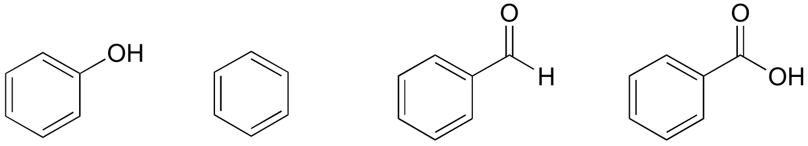

By thinking about noncovalent intermolecular interactions, we can also
predict relative melting points. All of the same principles apply:
stronger intermolecular interactions result in a higher melting point.
Ionic compounds, as expected, usually have very high melting points due
to the strength of ion-ion interactions. Just like with boiling points,
the presence of polar and hydrogen-bonding groups on organic compounds
generally leads to higher melting points. The size of a molecule
influences its melting point as well as its boiling point, again due to
increased van der Waals interactions between molecules.

What is different about melting point trends, that we don't see with
boiling point or solubility trends, is the importance of a molecule's
shape and its ability of pack tightly together*.* Picture yourself
trying to make a stable pile of baseballs in the floor. It just doesn't
work, because spheres don't pack together well - there is very little
area of contact between each ball. It is very easy, though, to make a
stack of flat objects like books.

The same concept applies to how well molecules pack together in a solid.
The flat shape of aromatic compounds allows them to pack efficiently,
and thus aromatics tend to have higher melting points compared to
non-planar hydrocarbons with similar molecular weights. Comparing the
melting points of benzene and toluene, you can see that the extra methyl
group on toluene disrupts the molecule's ability to pack tightly, thus
decreasing the cumulative strength of intermolecular van der Waals
forces and lowering the melting point.

fig 44

Note also that the boiling point for toluene is significantly above the
boiling point of benzene! The key factor for the boiling point trend in
this case is *size* (toluene has one more carbon), whereas for the
melting point trend, *shape* plays a much more important role. This
makes sense when you consider that melting involves ‘unpacking’ the
molecules from their ordered array, whereas boiling involves simply
separating them from their already loose (liquid) association with each
other.

<u>Exercise 2.35</u>: Which would you expect to have the higher melting
point, 2,3-dimethylbutane or hexane? Explain.

### 2.5C: Physical properties of lipids and proteins

<u>Lipids</u>

An interesting biological example of the relationship between molecular
structure and melting point is provided by the observable physical
difference between animal fats like butter or lard, which are solid at
room temperature, and vegetable oils, which are liquid. Recall (section
1.3A) that fats and oils are triacylglycerols: fatty acids linked to a
glycerol backbone. In vegetable oils, the fatty acid components are
unsaturated, meaning that they contain one or more double bonds. Solid
animal fat, in contrast, contains mainly saturated hydrocarbon chains,
with no double bonds.

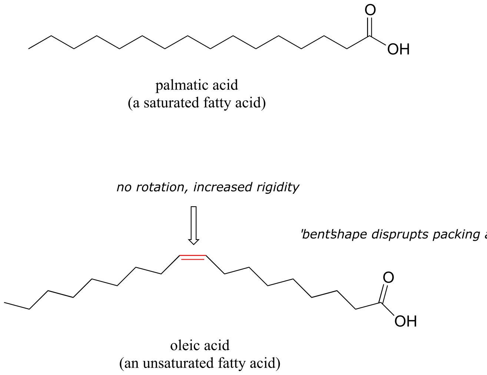

fig 46

Molecular models: [palmatic
acid](https://en.wikipedia.org/wiki/Palmitic_acid#/media/File:Palmitic-acid-3D-balls.png),
[oleic
acid](https://upload.wikimedia.org/wikipedia/commons/2/27/Oleic-acid-3D-vdW.png)

The double bond(s) in vegetable oils cause those hydrocarbon chains to
be more rigid, and ‘bent’ at an angle (remember that rotation is
restricted around double bonds), with the result that they don’t pack
together as closely, and thus can be broken apart (melted) more readily.

In a related context, the fluidity of a cell membrane (essentially, the
melting point) is determined to a large extent by the length and degree
of unsaturation of the fatty acid 'tails' on the membrane lipids. Longer
and more saturated fatty acids make the membrane less fluid (they are
able maximize van der Waals interactions), while shorter and more
unsaturated fatty acids cause the membrane to be more fluid.

<u>Proteins</u>

The very same noncovalent forces we have just learned about are also
integral to protein structure: when a protein folds up, it does so in
such a way that very specific non-covalent interactions form between
amino acid residues on different regions of the chain, each one becoming
part of the 'molecular glue' that holds the chain together in its
correctly folded shape. Hydrogen bonds and charge-charge interactions
are particularly important in this respect. In general, the interior of
a folded protein is relatively hydrophobic, while the outside surface,
which of course is in constant contact with water, is very hydrophilic -
many charged side chains such as aspartate, glutamate, lysine, and
arginine point out of the surface of a protein structure.

Most of the proteins of 'mesophilic' organisms (those who thrive in
intermediate temperatures, including humans) will denature - come
unfolded - at high temperatures, as the heat disrupts the specific
noncovalent interactions holding the protein chain together. Unfolded
proteins usually are not water soluble because the more hydrophobic
interior regions are no longer hidden from the solvent, so denaturing is
accompanied by precipitation. Obviously, an unfolded protein also loses
its functionality.

In the last few decades, we have become aware that a wide variety of
microbes naturally inhabit extremely hot environments such as the
boiling water of [hot springs in Yellowstone National
Park](http://msnbcmedia.msn.com/j/MSNBC/Components/Photo/_new/pb-110603-yellowstone-hot-springs-eg-01.photoblog900.jpg),
or the base of a [deep-sea thermal
vent](http://oceanservice.noaa.gov/facts/vents2.jpg). How do the
proteins of these 'thermophiles' hold up to the heat? There is nothing
extraordinary about these proteins that makes them so resistant to heat,
other than the fact that they have evolved so that they simply have
*more* molecular 'glue' holding them together - in particular, more
ionic interactions between oppositely charged residues. In just one of
many examples, the three-dimensional structure of an enzyme from
*Pyrococcus horikoshii*, a microbe isolated from a thermal vent deep in
the Pacific Ocean, was compared to a very similar enzyme in humans. The
thermophilic protein has a stabilizing charge-charge interaction between
the terminal carboxylate group on the last amino acid in the chain and
an arginine residue near the beginning of the chain.

fig 30b

This interaction is not present in the human version of the protein
because the terminal carboxylate group is angled away from the
positively-charged group on the arginine. The single charge-charge
interaction is not by itself responsible for the thermostability of *the
P. horikoshii* protein - other similar interactions throughout the
protein structure also contribute ([*PLOS* *Biology* 2011, *9*,
e1001027](http://journals.plos.org/plosbiology/article?id=10.1371/journal.pbio.1001027)).

Conversely, proteins from 'psychrophilic' organisms - those which live
in extremely cold temperatures, such as in arctic soils or in small
water pockets in polar ice - have fewer stabilizing charge-charge
interactions. This gives them the flexibility to function at
temperatures in which mesophilic human or *E. coli* proteins would be
frozen and inactive. On the other hand, a typical psychrophilic protein
will rapidly unfold, precipitate, and lose its functionality at room
temperature.

Scientists are extremely interested in thermostable proteins, because
the ability to function at high temperatures can be a very desirable
trait for a protein used in industrial processes. In fact, thermostable
DNA polymerase from *Thermus aquaticus* (the enzyme is known to
molecular biologists as *'Taq* polymerase') is the enzyme that makes the
PCR (polymerase chain reaction) process possible, and has earned
billions of dollars in royalties for drug company Hoffman La Roche, the
patent owner. Many research groups are searching for useful enzymes in
thermophilic species, and others are working on ways to engineer heat
stability into existing mesophilic enzymes by tinkering with their amino
acid sequences to introduce new stabilizing charge-charge interactions.

**  
**

## Summary of Key Concepts

Understand **valence bond theory** and the **hybrid orbital** concept.
Be able to identify the hybridization of all carbons in any organic
molecule. Be able to accurately draw the π-bonding picture for a double
bond (side-by-side overlapping *p* orbitals). Be able to describe what
types of orbitals are overlapping to form the single and double bonds in
an organic molecule.

Be able to distinguish **conjugated double bonds** from **isolated
double bond**s. Be able to accurately draw the π-bonding picture for a
conjugated π system.

Understand the concept of **resonance**, and understand that **resonance
contributors** are *not* different molecules, just different ways of
drawing the same molecule.

Be able to draw resonance contributors correctly. Be able to draw
**curved arrows** between any two contributors.

**Major and minor resonance contributors**: be able to evaluate the
relative importance of contributors.

Understand the concept of resonance **delocalization** - what it means
when we say that a charge is delocalized, or that π electrons are
delocalized.

Recognize and understand **noncovalent interactions**: Van der Waals,
ion-ion, ion-dipole, dipole-dipole, and hydrogen bonding. Be able to
recognize whether a group is acting as a hydrogen bond donor or
acceptor.

Be able to use your knowledge of noncovalent intermolecular interactions
to predict trends in solubility, melting point, and boiling point.

## Problems

*In questions involving drawing resonance contributors, assume that all
second-row atoms should have a complete octet in all structures with the
exception of positively-charged carbons.*

**P2.1**: For each of the bonds indicated by arrows b-f in the figures
below, describe the bonding picture. An example is given for bond 'a'.
Note that for a double bond (bond 'c'), you will need to describe *two*
bonds. Note: you are being asked to describe the bonding picture for one
specific resonance contributor.

bond a: "this is a σ bond formed by the overlap of an *sp3*
orbital on one carbon and an *sp2* orbital on another
carbon."

**P2.2**:

a\) Draw curved arrows showing how each of the resonance contributors on
the left could be converted to the one on the right.

b\) Label contributors as major, minor, or approximately equivalent to
each other.

**P2.3:** Draw a 3D-accurate picture showing the orbitals involved in
bonding in the molecules below. Draw *all* bonds, both σ and π, as
overlapping orbitals. Indicate whether each orbital is *s, p, sp,
sp2*, or *sp3*, and indicate (with words or a
color scheme) orbitals that are pointed into or out of the plane of the
page. Locate all lone pairs in their appropriate orbitals. It is highly
recommended to check your drawing with your instructor or tutor.

An example is provided for ethene, CH2CH2:

a\) dimethyl ether (CH3OCH3)

b\) ethanol (CH3CH2OH)

c\) acetaldehyde (CH3COH)

d\) hydrogen cyanide (HCN)

**P2.4**: Neither of the pairs of structures below are pairs of
resonance contributors.

a\) Explain why not.

b\) What in fact is the relationship between them?

**P2.5:**

a-i) Describe the orbitals involved in the bonds indicated by the
arrows, as in problem 2.1.

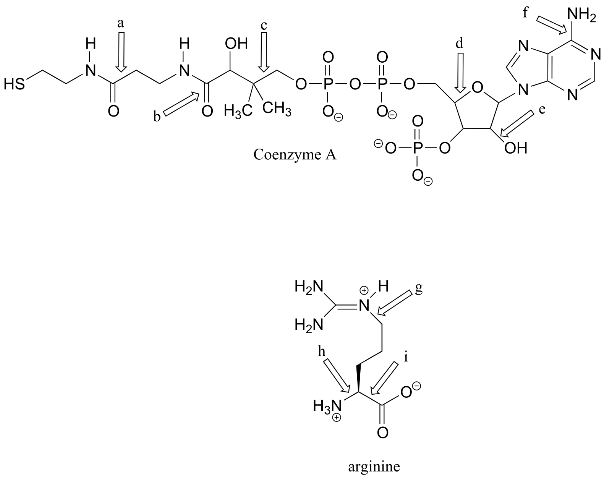

**P2.6**: The four compounds below appeared in the October 9 and October
25, 2006 issues of Chemical and Engineering News.

a-k) For each bond indicated by an arrow, specify the types of orbitals
that are overlapping (for example, overlap between two *sp3*-hybridized
carbons would be denoted C*sp3*-C*sp3*)

l\) (functional group review) Which compound contains two aldehydes?
Which contains an ether? Which contains an amide? Which contains a
terminal alkene? Which contains an amine (and is this amine primary,
secondary, tertiary, or quaternary?)

m\) Give the molecular formula for the walking-stick compound

**P2.7:** Rank the bonds a-f below according to increasing bond length.

**  
**

**P2.8:** Redraw the structure below, showing the 2pz
orbitals that make up the conjugated π bond system.

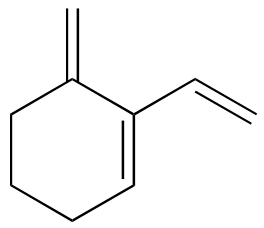

**P2.9:** Draw two different (minor) resonance contributors of the
structure below (the flavin group of flavin adenine dinucleotide (FAD),
a biochemical oxidation/reduction molecule) in which the oxygen
indicated by an arrow bears a negative formal charge and one of the
circled atoms bears a positive formal charge. Include curved arrows to
account for the changing positions of electrons and π bonds.

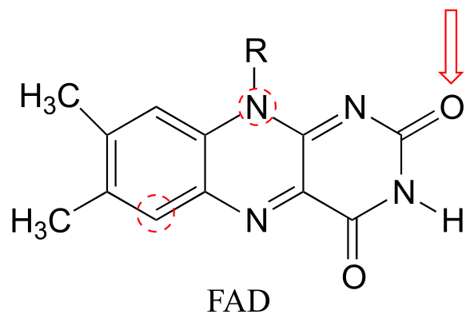

**P2.10:** The structure below shows an intermediate species in a
reaction involving the amino acid alanine, attached to pyridoxal
phosphate (vitamin B6). Draw a resonance contributor in which the only
formal charges are on the oxygens.

**P2.11**: Below is the structure of the cholesterol-lowering drug
Lovastatin. Predict the trend in bond length for

a\) bonds a, b, c, and d

b\) bonds e and f

**P2.12:** In problem P1.10, you were asked to draw four different
amides with molecular formula C3H7NO. One of these
constitutional isomers is significantly less soluble in water than the
other three. Which one, and why?

**P2.13:** Below is the structure of Rimonabant, a drug candidate which
is being tested as a possible treatment for alcohol/tobacco dependence
and obesity (see *Chemical and Engineering News*, October 15, 2006, p.
24). Draw minor resonance contributors in which:

a\) there is a separation of charge between the nitrogen indicated by
the arrow and the oxygen.

b\) there is a separation of charge between a chlorine (positive) and
one of the three nitrogens.

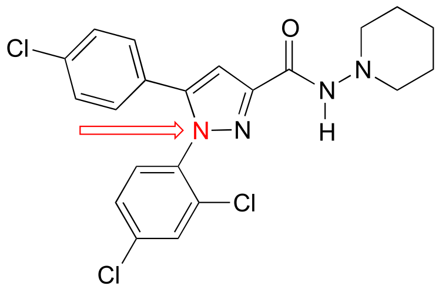

**P2.14:** For the molecules below, draw minor resonance contributors in
which formal charges are placed on the atoms indicated by arrows. Use
curved arrows to show how you are rearranging electrons between
resonance contributors.

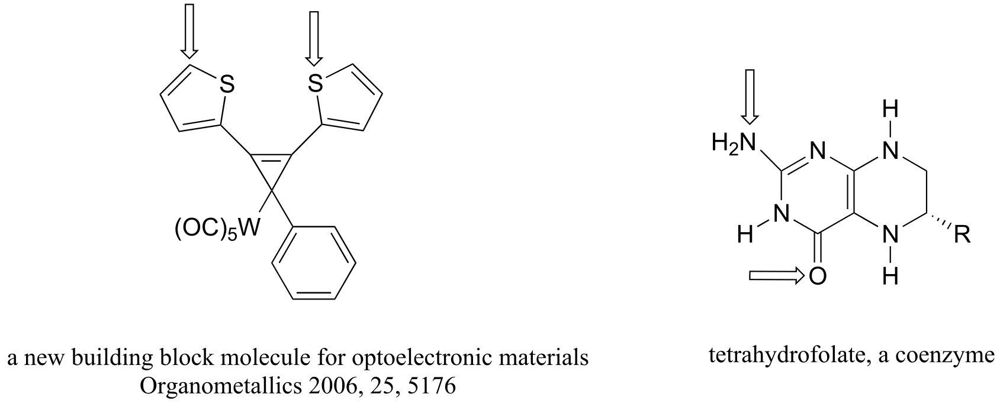

**P2.15:** Genipin was recently identified as the active compound in
gardenia fruit extract, a traditional Chinese medicine for the treatment
of diabetes (*Chemical and Engineering News* June 12, 2006, p. 34; *Cell
Metab*. 2006, *3*, 417). Resonance contributors can be drawn in which
the oxygen atom indicated by an arrow bears a positive formal charge.
Indicate where the corresponding negative formal charge would be located
in the most important of these contributors.

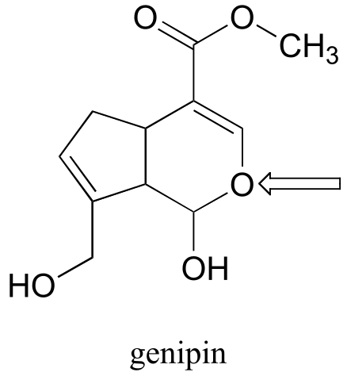

**P2.16:** Identify any *isolated* alkene groups in the PAC-1 structure
in problem P2.14, and in the genipin structure in problem P2.15.

**P2.17:** The February 27, 2006 issue of *Chemical and Engineering
News* contains an interesting article on the 100th birthday of Albert
Hofmann, the inventor of the hallucinogen LSD. The structure of LSD is
shown below. Several minor resonance contributors can be drawn in which
the nitrogen atom indicated by an arrow bears a positive formal charge.
Indicate atoms where a corresponding negative formal charge could be
located in these contributors.

**P2.18:** The human brain contains naturally occurring cannabinoid
compounds which are related in structure to
∆9-tetrahydrocannabinol, the active compound in cannabis.
Cannabinoids are thought to exert an antidepressant effect. Researchers
at the University of California, Irvine are studying synthetic
compounds, such as the one shown below, which inhibit the degradation of
natural cannabinoids in the brain. This compound has been shown to have
antidepressant-like effects in rats and mice. (*Chemical and Engineering
News*, December 19, 2005, p. 47; *Proc. Natl. Acad. Sci*. *USA* 2005,
*102*, 18620.)

a\) Several minor resonance contributors can be drawn in which the
oxygen atom indicated by an arrow bears a positive formal charge.
Indicate atoms where a corresponding negative formal charge could be
located in these contributors.

b\) Answer the same question again, this time with the structural isomer
shown below.

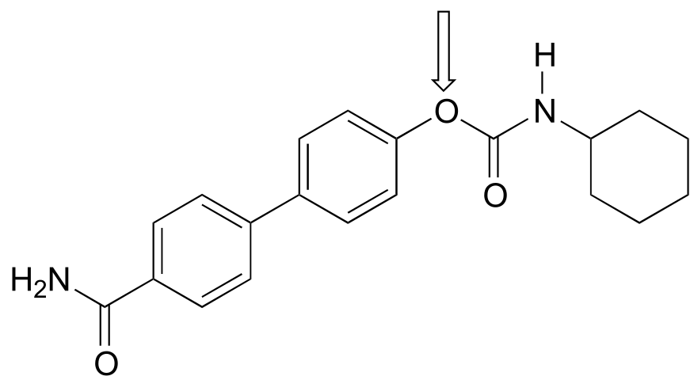

**P2.19:** Give the expected trend (lowest to highest) in boiling points
for the following series of compounds.

P2.20: For each pair of molecules below, choose the one that is more
water-soluble, and explain your choice.

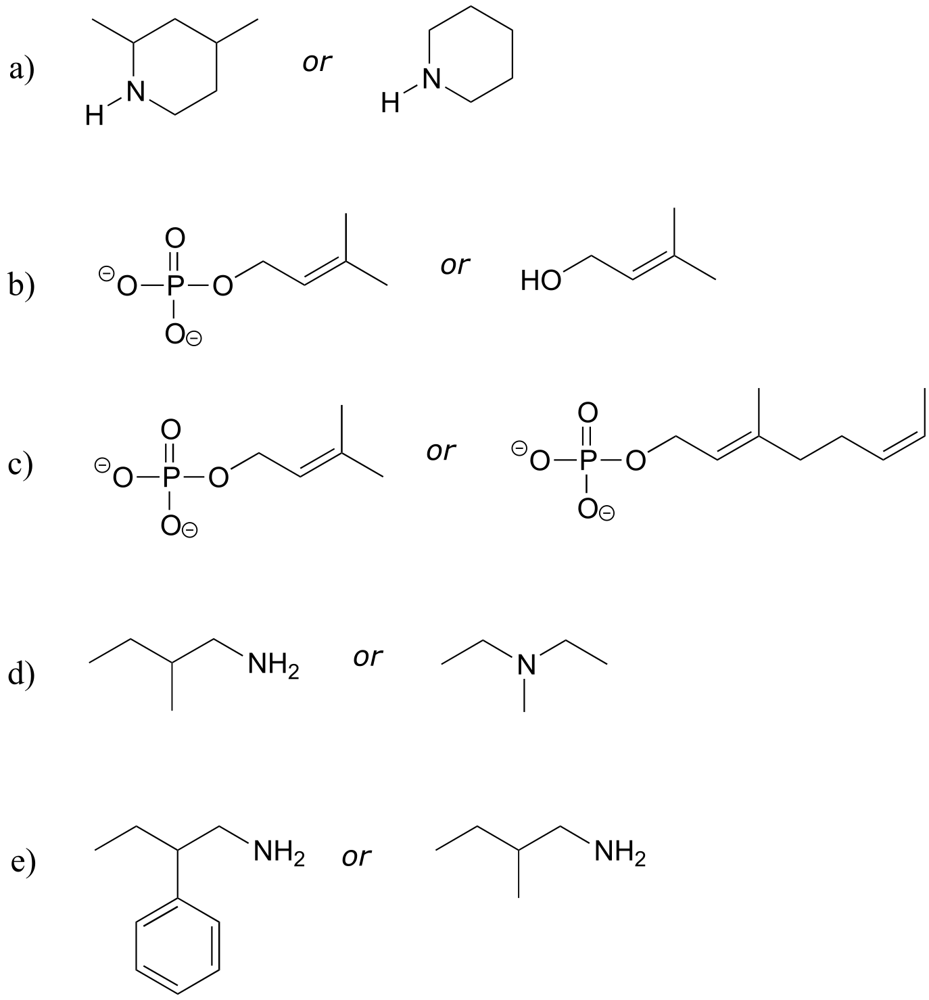

**P2.21:** Intermolecular forces: For *a-c* below, you may want to
review amino acid/protein structure basics in section 1.3D and Table 5
at the end of the book. Use abbreviations as appropriate to focus the
viewer's attention on the interaction in question.

a\) Which of the 20 natural amino acids have *side chains* capable of
forming hydrogen bonds with water?

b\) Draw a picture of a hydrogen bond in a protein between an alanine
main chain nitrogen and a glutamate side chain.

c\) Draw a picture of a hydrogen bond in a protein between a tyrosine
main chain (acting as donor) and a threonine side chain (acting as
acceptor).

d\) Draw a picture of an charge-charge (ionic) interaction in a protein
between an aspartate and a lysine.

**P2.22**: In properly folded protein structures, main chain nitrogens
often participate in hydrogen bonding interactions in the role of donor,
but rarely as acceptor. Speculate as to why this might be so, using what
you have learned in this chapter.

**P2.23:** Ozone, O3, is an uncharged, non-cyclic molecule.
Draw a Lewis structure for ozone. Are the two oxygen-oxygen bonds the
likely to be the same length? What is the bond order? Explain.

**P2.24:** Imagine that you hear a description of the bonding in water
as being derived directly from the atomic orbital theory, without use of
the hybrid orbital concept. In other words, the two bonds would be
formed by the overlap of the half-filled 2py and
2pz orbitals of oxygen with the 1s orbitals of hydrogen,
while the two lone pairs on oxygen would occupy the 2s and
2px orbitals. What is wrong with this picture? How would the
bonding geometry differ from what is actually observed for water?

**P2.25:**

a\) Draw a picture showing the geometry of the overlapping orbitals that
form the bonding network in allene, H2CCCH2. Then,
draw a Lewis structure for the molecule, using the solid/dash wedge bond
convention as necessary to indicate the correct geometry of the σ bonds.

b\) Draw a picture showing the geometry of the overlapping orbitals that
form the bonding network in carbon dioxide.

**P2.26** Below is the structure of ropinerol, a drug made by
GlaxoSmithKline for the treatment of Parkinson's disease. Is the
five-membered ring part of the aromatic system? Explain your answer.

**P2.27:** Classify each of the molecules/ions below as aromatic or not
aromatic. Explain your reasoning.

**P2.28:** For each of the compounds below, several minor resonance
contributors can be drawn in which the atom indicated by an arrow bears
a positive formal charge. Circle all atoms which could bear the
corresponding negative formal charge.

**P2.29:** For each of the compounds below, several minor resonance
contributors can be drawn in which the atom indicated by an arrow bears
a negative formal charge. Circle all atoms which could bear the
corresponding positive formal charge.

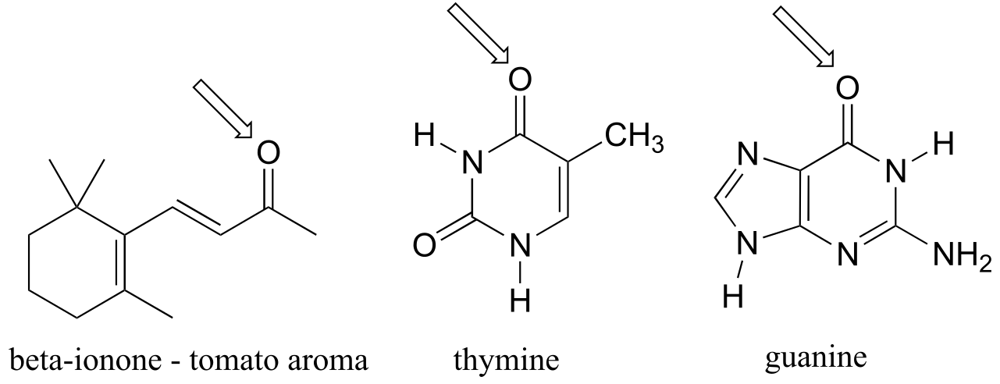

**  
**

**P2.30:** In each of the cation structures below, circle all carbon
atoms to which the positive formal charge can be delocalized by
resonance.

# 3: Conformation and stereochemistry

(Credit: https://www.flickr.com/photos/nate/)

In 1848, a 25 year old chemist named [Louis
Pasteur](http://www.bbc.co.uk/timelines/z9kj2hv) made a startling - and
some thought brash - claim to the scientific community. Pasteur was
inexperienced, to say the least: he had only earned his doctorate the
previous year, and had just started his first job as an assistant to a
professor at the *Ecole normale superieure*, a university in Paris.
[Jean-Baptiste
Biot](http://www-groups.dcs.st-and.ac.uk/history/Biographies/Biot.html),
a highly respected physicist who had already made major contributions to
scientific fields as diverse as meteorites, magnetism, and optics, was
intrigued but unconvinced by Pasteur's claim. He invited the young man
to come to his laboratory and reproduce his experiments.

Decades earlier, Biot had discovered that aqueous solutions of some
biologically-derived substances, such as tartaric acid, quinine,
morphine, and various sugars, were optically active: that is, plane
polarized light would rotate in either a positive (clockwise, or
right-handed) or negative (counter-clockwise, or left-handed) direction
when passed through the solutions. Nobody understood the source of this
optical property.

One of the biological substances known to be optically active was a salt
of tartaric acid, a compound found in abundance in grapes and a major
by-product of the wine-making industry.

fig 1b

The compound was dextrorotatory in solution – in other words, it rotated
plane-polarized light in the positive (right-handed, or clockwise)
direction. Curiously, though, chemists had also found that another form
of processed tartaric acid was optically *in*active, despite that fact
that it appeared to be identical to the optically active acid in every
other respect. The optically inactive compound was called '*acide
racemique*', from the Latin *racemus*, meaning 'bunch of grapes'.

Louis Pasteur's claims had to do with experiments he said he had done
with the 'racemic' acid. Jean-Babtise Biot summoned Pasteur to his
laboratory, and presented him with a sample of racemic acid which he
himself had already confirmed was optically inactive. With Biot watching
over his shoulder, and using Biot's reagents, Pasteur prepared the salt
form of the acid, dissolved it in water, and left the aqueous solution
in an uncovered flask to allow crystals to slowly form as the water
evaporated.

Biot again summoned Pasteur to the lab a few days later when the
crystallization was complete. Pasteur placed the crystals under a
microscope, and began to painstakingly examine their shape, just as he
had done in his original experiments. He had recognized that the
crystals, which had a regular shape, were asymmetric: in other words,
they could not be superimposed on their mirror image. Scientists
referred to asymmetric crystals and other asymmetric objects as being
'chiral', from the Greek word for 'hand'. Your hands are chiral objects,
because although your right hand and your left hand are mirror images of
one another, they cannot be superimposed. That is why you cannot fit
your right hand in a left-handed glove.

More importantly, Pasteur had claimed that the chiral crystals he was
seeing under the lens of his microscope were of two different types, and
the two types were mirror images of each other: about half were what he
termed 'right handed' and half were 'left-handed'. He carefully
separated the right and left-handed crystals from each other, and
presented the two samples to Biot. The eminent scientist then took what
Pasteur told him were the left-handed crystals, dissolved them in water,
and put the aqueous solution in a polarimeter, an instrument that
measures optical rotation. Biot knew that the processed tartaric acid he
had provided Pasteur had been optically inactive. He also knew that
unprocessed tartaric acid from grapes had right-handed optical activity,
whereas left-handed tartaric acid was unheard of. Before his eyes,
however, he now saw that the solution was rotating light to the left. He
turned to his young colleague and exclaimed, " *Mon cher enfant, j’ai
tant aime ́ les sciences dans ma vie que cela me fait battre le coeur*!’
(My dear child, I have loved science so much during my life that this
makes my heart pound!)

Biot had good reason to be so profoundly excited. Pasteur had just
conclusively demonstrated, for the first time, the concept of
**molecular chirality**: molecules themselves - not just macroscopic
objects like crystals - could exhibit chirality, and could be separated
into distinct right-handed and left-handed 'stereoisomers'. Tying
together ideas from physics, chemistry, and biology, he had shown that
nature could be chiral *at the molecular level*, and in doing do he had
introduced to the world a new subfield which came to be known as
'stereochemistry'.

About ten years after his demonstration of molecular chirality, Pasteur
went on to make another observation with profound implications for
biological chemistry. It was already well known that 'natural' tartaric
acid (the right-handed kind from grapes) could be fermented by bacteria.
Pasteur discovered that the bacteria were selective with regard to the
chirality of tartaric acid: no fermentation occurred when the bacteria
were provided with pure left-handed acid, and when provided with racemic
acid they specifically fermented the right-handed component, leaving the
left-handed acid behind.

Pasteur was not aware, at the time of the discoveries described here,
the details of the structural features of tartaric acid at the molecular
level that made the acid chiral, although he made some predictions
concerning the bonding patterns of carbon which turned out to be
remarkably accurate. In the more than 150 years since Pasteur's initial
tartaric acid work, we have greatly expanded our understanding of
molecular chirality, and it is this knowledge that makes up the core of
this chapter. Put simply, stereochemistry is the study of how bonds are
oriented in three-dimensional space. It is difficult to overstate the
importance of stereochemistry in nature, and in the fields of biology
and medicine in particular. As Pasteur so convincingly demonstrated,
life itself is chiral: living things recognize different stereoisomers
of organic compounds and process them accordingly.

(*Acta. Cryst*. **2009**, *A65*, 371; *Chirality* **2008**, *20*, 5;
*Chirality* **2008**, *20*, 1072)

**Molecular models are your friend!**

*Because this chapter deals extensively with concepts that are
inherently three-dimensional in nature, it will be very important for
you to use a molecular modeling kit that is specifically intended for
organic chemistry. Many of the ideas we will be exploring can be
extremely confusing if you are limited to the two dimensions of this
page. Be prepared to follow along with these discussions in **three**
dimensions, with a molecular model in your hands!*

**  
**

## Section 3.1: Conformations of open-chain organic molecules

Before we begin our exploration of stereochemistry and chirality, we
first need to consider the subject of **conformational isomerism**,
which has to do with rotation about single bonds.

We learned in section 2.1B that single bonds in organic molecules are
free to rotate, due to the 'end-to-end' (σ) nature of their orbital
overlap. Consider the carbon-oxygen bond in ethanol, for example: with a
180o rotation about this bond, the shape of the molecule
would look quite different:

fig 1a

Or ethane: rotation about the carbon-carbon σ bond results in many
different possible three-dimensional arrangements of the atoms.

fig 1

These different arrangements, resulting from σ bond rotation, are
referred to in organic chemistry as **conformations**. Any one specific
conformation is called a **conformational isomer**, or **conformer**.

In order to better visualize different conformations of a molecule, it
is convenient to use a drawing convention called the **Newman
projection**. In a Newman projection, we look lengthwise down a specific
bond of interest – in this case, the carbon-carbon bond in ethane. We
depict the ‘front’ atom as a dot, and the ‘back’ atom as a larger
circle.

fig 2

[Interactive model](http://www.chemtube3d.com/STethanenewman.html)

The six carbon-hydrogen bonds are shown as solid lines protruding from
the two carbons. Note that we do *not* draw bonds as solid or dashed
wedges in a Newman projection.

Looking down the C-C bond in this way, the angle formed between a C-H
bond on the front carbon and a C-H bond on the back carbon is referred
to as a **dihedral angle**. (The dihedral angle between the hour hand
and the minute hand on a clock is 0o at noon, 90o
at 3:00, and so forth).

The lowest energy conformation of ethane, shown in the figure above, is
called the ‘**staggered’** conformation: all of the dihedral angles are
60o, and the distance between the front and back C-H bonds is
maximized.

If we now rotate the front CH3 group 60° clockwise, the
molecule is in the highest energy ‘**eclipsed'** conformation, where the
dihedral angles are all 0o (we stagger the bonds slightly in
our Newman projection drawing so that we can see them all).

fig 3

The energy of the eclipsed conformation, where the electrons in the
front and back C-H bonds are closer together, is approximately 12 kJ/mol
higher than that of the staggered conformation.

Another 60° rotation returns the molecule to a second staggered
conformation. This process can be continued all around the 360° circle,
with three possible eclipsed conformations and three staggered
conformations, in addition to an infinite number of conformations in
between these two extremes.

[video tutorial: conformations of
ethane](https://www.youtube.com/watch?v=jUqb-KD9SuY)

Now let's consider butane, with its four-carbon chain. There are now
three rotating carbon-carbon bonds to consider, but we will focus on the
middle bond between C2 and C3. Below are two
representations of butane in a conformation which puts the two
CH3 groups (C1 and C4) in the eclipsed
position, with the two C-C bonds at a 0o dihedral angle.

fig 4

If we rotate the front, (blue) carbon by 60° clockwise, the butane
molecule is now in a staggered conformation.

fig 5

This is more specifically referred to as the **gauche** conformation of
butane. Notice that although they are staggered, the two methyl groups
are not as far apart as they could possibly be.

A further rotation of 60° gives us a second eclipsed conformation (B) in
which both methyl groups are lined up with hydrogen atoms.

fig 6

One more 60 rotation produces another staggered conformation called the
**anti** conformation, where the two methyl groups are positioned
opposite each other (a dihedral angle of 180o).

fig 7

As with ethane, the staggered conformations of butane are energy
'valleys', and the eclipsed conformations are energy 'peaks'. However,
in the case of butane there are two different valleys, and two different
peaks. The gauche conformation is a higher energy valley than the anti
conformation due to **steric strain**, which is the repulsive
interaction caused by the two bulky methyl groups being forced too close
together. Clearly, steric strain is lower in the anti conformation. In
the same way, steric strain causes the eclipsed A conformation - where
the two methyl groups are as close together as they can possibly be - to
be higher in energy than the two eclipsed B conformations.

The diagram below summarizes the relative energies for the various
eclipsed, staggered, and gauche conformations of butane.

[Interactive model of
butane](http://www.chemtube3d.com/STbutanenewman.html)

[Video tutorial: conformations of
butane](https://www.youtube.com/watch?v=hykVHqZ40RQ)

Because the anti conformation is lowest in energy (and also simply for
ease of drawing), it is conventional to draw open-chain alkanes in a
'zigzag' form, which implies anti conformation at all carbon-carbon
bonds. The figure below shows, as an example, a Newman projection
looking down the C2-C3 bond of octane.

fig 8

<u>Exercise 3.1:</u> Draw Newman projections of the lowest and highest
energy conformations of propane.

<u>Exercise 3.2:</u> Draw a Newman projection, looking down the
C2-C3 bond, of 1-butene in the conformation shown
below (C2 should be your *front* carbon).

## Section 3.2: Conformations of cyclic organic molecules

Browse through a biochemistry textbook and you will see any number of
molecules with cyclic structures. Many of these cyclic structures are
aromatic, and therefore planar. Many others, though, are composed of
sp3-hybridized atoms, and it is these cyclic structures that
are the topic of discussion in this section.

When discussing cyclic organic molecules, we will often use sugars as
examples, because they are such important molecules in biological
chemistry. It is important to recall (section 1.3C) that many sugars
exist in aqueous solution as both open-chain and cyclic forms. You need
not worry at this point about understanding how the cyclic form is
named, or the reaction by which the cyclization occurs - this will be
covered in chapter 10.

fig 9

One thing that you should notice in the cyclic structure shown above is
that atoms or groups bonded to tetrahedral ring carbons are either
pointing up (out of the plane of the page) or down (into the plane of
the page), as indicated by the use of dashed or solid wedge bonds. When
two substituents on the same ring are both pointing toward the same side
of the ring, they are said to be ***cis*** to each other. When they are
pointed to opposite sides, they are said to be ***trans*** to each
other.

fig 10

Ring structures in organic molecules are usually five-membered or
six-membered. Three-and four-membered rings are occasionally found in
nature, but are significantly higher in energy. The relative instability
of these smaller ring structures can be explained by a concept called
**angle strain**, in which the four bonds around the
sp3-hybridized carbons are forced out of their preferred
tetrahedral angles.

fig 11

If one of the carbon-carbon bonds is broken, the ring will ‘spring’
open, releasing energy as the bonds reassume their preferred tetrahedral
geometry. The effectiveness of two antibiotic drugs, fosfomycin and
penicillin, is due in large part to the high reactivity of the three-
and four-membered rings in their structures.

fig 12

In six-membered cycloalkane structures, bonding angles are close to
tetrahedral, and thus ring strain is not a factor – these rings are in
fact very stable. However, the ‘flat’ drawings we have been using up to
now do not accurately show the actual three-dimensional shape of a five-
or six-membered ring. If cyclohexane were indeed flat, the bond angles
would have to be distorted from 109.5° to 120°. If you build a model,
though, you will find that when you rotate the carbon-carbon bonds so as
to put the ring into a shape that resembles a reclining beach chair, all
of the carbon-carbon bonds are able to assume tetrahedral bonding
angles.

fig 13)

[Interactive
model](http://www.chemtube3d.com/STcyclohexane%20ring%20flip.html)

This **chair conformation** is the lowest energy conformation for
cyclohexane and other six-membered rings.

An alternate conformation for a six-membered ring is called the
**‘boat**’:

fig 14

In the boat conformation, two of the substituents – those on the ‘bow’
and the ‘stern’ if you will – are brought close enough to each other to
cause steric strain. An additional cause of the higher energy of the
boat conformation is that adjacent hydrogen atoms on the 'bottom of the
boat' are forced into eclipsed positions. For these reasons, the boat
conformation is a high energy conformation of cyclohexane, about 30
kJ/mol less stable than the chair conformation.

If you look carefully at your model of cyclohexane in the chair
conformation, you will see that all twelve hydrogens are not equivalent
in terms of their three-dimensional arrangement in space. Six hydrogens
are **axial** – that is, they are pointing either straight up or
straight down relative to the ring. The other six hydrogens are
**equatorial**, meaning that they are pointing away from the perimeter
of the ring, either slightly up or slightly down*. (The equatorial vs
axial distinction is often hard to see at first - it would be a very
good idea at this point to sit down with your instructor or tutor and
work with a modeling kit).*

fig 15

This is not the only possible chair conformation for cyclohexane. On
your model, rotate one of the ‘up’ carbons down, and one of the ‘down'
carbons up. You now have a new, alternate chair conformation – this
process is called **ring inversion**.

fig 16

What you should recognize here is that, as a result of the ring
inversion process, all of the axial and equatorial hydrogens have traded
positions – axial hydrogens have become equatorial, and vice-versa.
Notice, however, that the ‘down’ hydrogens are still pointing down, and
the ‘up’ hydrogens are still pointing up regardless of whether they are
axial or equatorial. At room temperature, cyclohexane is constantly
inverting between two chair forms of equal energy – it is a rapid
equilibrium situation. Thus, except at very low temperatures, we are not
able to distinguish between axial and equatorial hydrogens, as they are
constantly switching back and forth.

**axial/equatorial *vs* *cis/trans***

A very common error made by organic chemistry students as they begin to
learn about chair conformations is to confuse the terms axial and
equatorial with the terms *cis* and *trans*. **These are completely
different things!** For example, when two substituents on a ring are
*cis* in relation to one another, it means that they are pointed to the
same side of the ring (both up or both down). Depending on their
positions on the ring, they might both be axial, both be equatorial, or
one of each.

Do not make the mistake of calling two substituents *trans* to each
other merely because one is equatorial and one is axial, or *cis*
because the are both axial or both equatorial.

fig 17

**How to draw the cyclohexane chair conformation:**

As an organic chemistry student, you will be expected to be able to draw
an accurate representation of the chair conformations of six-membered
cycloalkanes, which includes being able to draw axial and equatorial
substituents with their correct orientations. Here, then, are some
guidelines to follow:

*  
*

*(How **not** to draw the chair):*

fig 19 fig 18

What happens to the relative energies of chair conformations when the
ring has a large substituent, such as a methyl group? Now, the two chair
conformations are quite different: in one, the methyl group is
equatorial and in the other it is axial.

fig 20

When the methyl group is in the axial position, it is brought close
enough to the axial hydrogens on carbons two bonds away to cause
destabilizing steric repulsion: this is referred to as **1,3-diaxial
repulsion**.

fig 21

When in the equatorial position, the methyl group is pointing up and
*away* from the rest of the ring, eliminating the unfavorable
1,3-diaxial interaction. As a consequence, the conformation in which the
methyl group is in the equatorial position is more stable, by
approximately 7 kJ/mol. At room temperature, methylcyclohexane exists as
a rapid equilibrium between the two chair forms (and many other
intermediate conformations), but the equilibrium constant
(Keq) favors the conformation where the methyl group is
equatorial.

**  
**

<u>Exercise 3.3</u>: Here's some General Chemistry review: what is the
value of Keq at 25 oC for the axial to equatorial
interconversion of methylcyclohexane as shown in the previous figure?

The importance of the steric strain factor increases with the increasing
size of a substituent. For example, the difference in energy between the
two chair conformations of *tert*-butyl cyclohexane (24 kJ/mol) is much
larger than for methylcyclohexane (7 kJ/mol), because a *tert*-butyl
group is larger than a methyl group and results in more energetically
unfavorable 1,3-diaxial interactions.

fig 22

In the case of a disubstituted cyclohexane ring in which both
substituents cannot be equatorial, the lower energy conformation
generally places the bulkier substituent in the equatorial position.

fig 23

***As a general rule, the most stable chair conformation of a
six-membered ring will be that in which the bulkiest groups are in the
equatorial position*.**

<u>Exercise 3.4</u>: Draw the lower energy chair conformations of a)
*trans*-1,2-dimethylcyclohexane, and b)
*trans*-1-isopropyl-3-methylcyclohexane. Draw all substituents on all
carbons (including hydrogens), being sure that the axial or equatorial
orientation is clear. Be sure to check your drawing with your instructor
or tutor.

<u>Exercise 3.5</u>: Predict which of the following disubstituted
hexanes has a greater energy difference between its two chair
conformations, and state your reasons for your choices.

> a\) *cis*-1,3-dimethylcyclohexane or *cis*-1,4-dimethylcyclohexane
>
> b\) *cis*-1,2-dimethylcyclohexane or *trans*-1,2-dimethylcyclohexane
>
> c\) *trans*-1,2-dimethylcyclohexane or
> *trans*-1-isopropyl-2-methylcyclohexane

<u>Exercise 3.6</u>: Can a 'ring inversion' change a *cis*-disubstituted
cyclohexane to *trans*? Explain.

Recall that five- and six-carbon sugars such as glucose and fructose
exist in solution in open chain and cyclic forms. Glucose, in its most
abundant form in solution, is a six-membered ring adopting a chair
conformation with all substituents equatorial.

fig 24

The most abundant form of fructose in aqueous solution is also a
six-membered ring.

fig 25

The lower energy chair conformation is the one with three of the five
substituents (including the bulky –CH2OH group) in the
equatorial position.

<u>Exercise 3.7</u>: Draw the two chair conformations of the six-carbon
sugar mannose, being sure to clearly show each non-hydrogen substituent
as axial or equatorial. Predict which conformation is likely to be more
stable, and explain why.

>  style="width:1.21111in;height:1.38889in" />

fig 26

[Video tutorial: conformations of
cyclohexane](https://www.khanacademy.org/science/organic-chemistry/bond-line-structures-alkanes-cycloalkanes/conformations/v/chair-and-boat-shapes-for-cyclohexane)

The lowest energy conformation of cyclopentane and other five-membered
rings is known as the ‘envelope’, with four of the ring atoms in the
same plane and one out of plane (notice that this shape resembles an
envelope with the flap open). The out-of-plane carbon is said to be in
the ***endo*** position (‘*endo’* means ‘inside’).

fig 27

The 'equatorial' vs 'axial' distinction discussed in the context of
6-membered rings does not apply to five-membered rings.

At room temperature, cyclopentane undergoes a rapid **pseudorotation**
process in which each of the five carbons takes turns being in the
*endo* position.

fig 28

One of the most important five-membered rings in nature is a sugar
called ribose – recall from section 1.3E that DNA and RNA are both
constructed upon ‘backbones’ derived from ribose. Pictured below is one
thymidine (T) deoxy-nucleotide from a stretch of DNA:

fig 29

The lowest-energy conformations for ribose are envelope forms in which
either the 3' or 2' carbons are *endo*. This has
very important implications for oligonucleotide structure – in a DNA
double helix, it is C2 that is in the *endo* position, while
in RNA it is C3.

## Section 3.3: Chirality and stereoisomers

We turn now to concept of chirality that formed the basis of the story
about Louis Pasteur in the beginning of this chapter. Recall that the
term **chiral**, from the Greek work for 'hand', refers to anything
which cannot be superimposed on its own mirror image. Your hands, of
course, are chiral - you cannot superimpose your left hand on your
right, and you cannot fit your left hand into a right-handed glove
(which is also a chiral object). Another way of saying this is that your
hands do not have a **mirror plane of symmetry**: you cannot find any
plane which bisects your hand in such a way that one side of the plane
is a mirror image of the other side. *Chiral objects do not have a plane
of symmetry*.

Your face, on the other hand is **achiral** - lacking chirality -
because, some small deviations notwithstanding, you could superimpose
your face onto its mirror image. If someone were to show you a mirror
image photograph of your face, you could line the image up,
point-for-point, with your actual face. Your face has a plane of
symmetry, because the left side is the mirror image of the right side.

What Pasteur, Biot, and their contemporaries did not yet fully
understand when Pasteur made his discovery of molecular chirality was
the *source* of chirality at the molecular level. It stood to reason
that a chiral molecule is one that does not contain a plane of symmetry,
and thus cannot be superimposed on its mirror image. We now know that
chiral molecules contain one or more **chiral centers**, which are
almost always tetrahedral (*sp3*-hybridized) carbons with
four different substituents. Consider the cartoon molecule A below: a
tetrahedral carbon, with four different substituents denoted by balls of
four different colors (for the time being, don't worry about exactly
what these substituents could be - we will see real examples very soon).

fig 3

[another
image](http://astrobiology.berkeley.edu/Mars101/pix/image003.jpg)

The mirror image of A, which we will call B, is drawn on the right side
of the figure, and an imaginary mirror is in the middle. Notice that
every point on A lines up through the mirror with the same point on B:
in other words, if A looked in the mirror, it would see B looking back.

Now, if we flip compound A over and try to superimpose it point for
point on compound B, we find that we cannot do it: if we superimpose any
two colored balls, then the other two are misaligned.

32

A is not superimposable on its mirror image (B), thus by definition A is
a chiral molecule. It follows that B also is not superimposable on *its*
mirror image (A), and thus it is also a chiral molecule. Also notice in
the figure below (and convince yourself with models) that neither A nor
B has an internal plane of symmetry.

A and B are **stereoisomers**: molecules with the same molecular formula
and the same bonding arrangement, but *a different arrangement of atoms
in space*. There are two types of stereoisomers: enantiomers and
diastereomers. **Enantiomers** are pairs of stereoisomers which are
mirror images of each other: thus, A and B are enantiomers. It should be
self-evident that a chiral molecule will always have one (and *only*
one) enantiomer: enantiomers come in pairs. Enantiomers have identical
physical properties (melting point, boiling point, density, and so on).
However, enantiomers do differ in how they interact with polarized light
(we will learn more about this soon) and they may also interact in very
different ways with other chiral molecules - proteins, for example. We
will begin to explore this last idea in later in this chapter, and see
many examples throughout the remainder of our study of biological
organic chemistry.

**Diastereomers** are stereoisomers which are *not* mirror images of
each other. For now, we will concentrate on understanding enantiomers,
and come back to diastereomers later.

We defined a chiral center as a tetrahedral carbon with four different
substituents. If, instead, a tetrahedral carbon has two identical
substituents (two black atoms in the cartoon figure below), then of
course it still has a mirror image (*everything* has a mirror image,
unless we are talking about a vampire!) However, it is superimposable on
its mirror image, and has a plane of symmetry.

fig 33

This molecule is **achiral** (lacking chirality). Using the same
reasoning, we can see that a trigonal planar
(*sp2*-hybridized) carbon is also not a chiral center.

fig 34

Notice that structure E can be superimposed on F, its mirror image - all
you have to do is pick E up, flip it over, and it is the same as F. This
molecule has a plane of symmetry, and is achiral.

Let's apply our general discussion to real molecules. For now, we will
limit our discussion to molecules with a single chiral center. It turns
out that tartaric acid, the subject of our chapter introduction, has
*two* chiral centers, so we will come back to it later.

Consider 2-butanol, drawn in two dimensions below.

fig 35

Carbon \#2 is a chiral center: it is *sp3*-hybridized and
tetrahedral (even though it is not drawn that way above), and the four
things attached to is are different: a hydrogen, a methyl
(-CH3) group, an ethyl (-CH2CH3) group,
and a hydroxyl (OH) group. Let's draw the bonding at C2 in
three dimensions, and call this structure A. We will also draw the
mirror image of A, and call this structure B.

fig 36

When we try to superimpose A onto B, we find that we cannot do it. A and
B are both chiral molecules, and they are enantiomers of each other.

2-propanol, unlike 2-butanol, is *not* a chiral molecule. Carbon \#2 is
bonded to two identical substituents (methyl groups), and so it is not a
chiral center.

fig 37

Notice that 2-propanol is superimposable on its own mirror image.

When we look at very simple molecules like 2-butanol, it is not
difficult to draw out the mirror image and recognize that it is not
superimposable. However, with larger, more complex molecules, this can
be a daunting challenge in terms of drawing and three-dimensional
visualization. The easy way to determine if a molecule is chiral is
simply to look for the presence of one or more chiral centers: molecules
with chiral centers will (almost always) be chiral. We insert the
'almost always' caveat here because it is possible to come up with the
exception to this rule - we will have more to say on this later, but
don't worry about it for now.

Here's another trick to make your stereochemical life easier: if you
want to draw the enantiomer of a chiral molecule, it is not necessary to
go to the trouble of drawing the point-for-point mirror image, as we
have done up to now for purposes of illustration. Instead, keep the
carbon skeleton the same, and simply reverse the solid and dashed wedge
bonds on the chiral carbon: that accomplishes the same thing. You should
use models to convince yourself that this is true, and also to convince
yourself that swapping *any two substituents* about the chiral carbon
will result in the formation of the enantiomer.

fig 38

Here are four more examples of chiral biomolecules, each one shown as a
pair of enantiomers, with chiral centers marked by red dots.

fig 39

Here are some examples of achiral biomolecules - convince yourself that
none of them contains a chiral center:

fig 40

When looking for chiral centers, it is important to recognize that the
question of whether or not the dashed/solid wedge drawing convention is
used is irrelevant. Chiral molecules are sometimes drawn without using
wedges (although obviously this means that stereochemical information is
being omitted). Conversely, wedges may be used on carbons that are *not*
chiral centers – look, for example, at the drawings of glycine and
citrate in the figure above.

Can a chiral center be something other than a tetrahedral carbon with
four different substituents? The answer to this question is 'yes' -
however, these alternative chiral centers are very rare in the context
of biological organic chemistry, and outside the scope of our discussion
here.

You may also have wondered about amines: shouldn't we consider a
secondary or tertiary amine to be a chiral center, as they are
tetrahedral and attached to four different substituents, if the
lone-pair electrons are counted as a 'substituent'? Put another way,
isn't an amine non-superimposable on its mirror image?

The answer: yes it is, in the static picture, but in reality, the
nitrogen of an amine is rapidly and reversibly inverting, or turning
inside out, at room temperature.

fig 42

If you have trouble picturing this, take an old tennis ball and cut it
in half. Then, take one of the concave halves and flip it inside out,
then back again: this is what the amine is doing. The end result is that
the two 'enantiomers' if the amine are actually two rapidly
interconverting forms of the same molecule, and thus the amine itself is
not a chiral center. This inversion process does *not* take place on a
tetrahedral carbon, which of course has no lone-pair electrons.

<u>Exercise 3.8</u>: Locate all of the chiral centers (there may be more
than one in a molecule). Remember, hydrogen atoms bonded to carbon
usually are not drawn in the line structure convention - but they are
still there!

fig 41

<u>Exercise 3.9</u>:

a\) Draw two enantiomers of i) mevalonate and ii) serine.

b\) Are the two 2-butanol structures below enantiomers?

<u>Exercise 3.10</u>: Label the molecules below as chiral or achiral,
and locate all chiral centers.

> 

fig 43

[Video tutorials:
chirality](https://www.khanacademy.org/science/organic-chemistry/stereochemistry-topic/chirality-r-s-system/v/introduction-to-chirality)

[Video tutorials:
enantiomers](https://www.khanacademy.org/science/organic-chemistry/stereochemistry-topic/optical-activity/v/drawing-enantiomers)

## Section 3.4: Labeling chiral centers

Chemists need a convenient way to distinguish one stereoisomer from
another. The **Cahn-Ingold-Prelog system** is a set of rules that allows
us to unambiguously define the stereochemical configuration of any
stereocenter, using the designations ‘***R***’ (from the Latin *rectus*,
meaning right-handed) or ‘***S***’ (from the Latin *sinister*, meaning
left-handed).

The rules for this system of stereochemical nomenclature are, on the
surface, fairly simple.

<u>Rules for assigning an R/S designation to a chiral center:</u>

1: Assign priorities to the four substituents, with \#1 being the
highest priority and \#4 the lowest. Priorities are based on the atomic
number.

2: Trace a circle from \#1 to \#2 to \#3.

3: Determine the orientation of the \#4 priority group. If it is
oriented into the plane of the page (away from you), go to step 4a. If
it is oriented out of the plane of the page (toward you) go to step 4b.

4a: *(#4 group pointing away from you*): a clockwise circle in part 2
corresponds to the *R* configuration, while a counterclockwise circle
corresponds to the *S* configuration.

4b: *(#4 group pointing toward you*): a clockwise circle in part 2
corresponds to the *S* configuration, while a counterclockwise circle
corresponds to the *R* configuration.

We’ll use the 3-carbon sugar glyceraldehyde as our first example. The
first thing that we must do is to assign a **priority** to each of the
four substituents bound to the chiral center. We first look at the atoms
that are directly bonded to the chiral center: these are H, O (in the
hydroxyl), C (in the aldehyde), and C (in the CH2OH group).

<u>Assigning R/S configuration to glyceraldehyde</u>

fig 44

Two priorities are easy: hydrogen, with an atomic number of 1, is the
lowest (#4) priority, and the hydroxyl oxygen, with atomic number 8, is
priority \#1. Carbon has an atomic number of 6. Which of the two ‘C’
groups is priority \#2, the aldehyde or the CH2OH? To
determine this, we move one more bond away from the chiral center: for
the aldehyde we have a *double* bond to an oxygen, while on the
CH2OH group we have a *single* bond to an oxygen. If the atom
is the same, double bonds have a higher priority than single bonds.
Therefore, the aldehyde group is assigned \#2 priority and the
CH2OH group the \#3 priority.

With our priorities assigned, we look next at the \#4 priority group
(the hydrogen) and see that it is pointed back away from us, into the
plane of the page - thus step 4a from the procedure above applies. Then,
we trace a circle defined by the \#1, \#2, and \#3 priority groups, in
increasing order. The circle is clockwise, which by step 4a tells us
that this carbon has the ‘*R*’ configuration, and that this molecule is
(*R*)-glyceraldehyde. Its enantiomer, by definition, must be
(*S*)-glyceraldehyde.

Next, let's look at one of the enantiomers of lactic acid and determine
the configuration of the chiral center. Clearly, H is the \#4
substituent and OH is \#1. Owing to its three bonds to oxygen, the
carbon on the acid group takes priority \#2, and the methyl group takes
\#3. The \#4 group, hydrogen, happens to be drawn pointing *toward* us
(out of the plane of the page) in this figure, so we use step 4b: The
circle traced from \#1 to \#2 to \#3 is clockwise, which means that the
chiral center has the *S* configuration.

fig 45

[Interactive model:
(S)-alanine](http://www.chemtube3d.com/STchiralcentersRS.html)

[Video tutorial: Cahn-Ingold-Prelog (R/S) naming
system](https://www.khanacademy.org/science/organic-chemistry/stereochemistry-topic/optical-activity/v/cahn-ingold-prelog-system-for-naming-enantiomers)

The drug thalidomide is an interesting - but tragic - case study in the
importance of stereochemistry in drug design. First manufactured by a
German drug company and prescribed widely in Europe and Australia in the
late 1950's as a sedative and remedy for morning sickness in pregnant
women, thalidomide was soon implicated as the cause of devastating birth
defects in babies born to women who had taken it. Thalidomide contains a
chiral center, and thus exists in two enantiomeric forms. It was
marketed as a **racemic** **mixture**: in other words, a 50:50 mixture
of both enantiomers.

fig 45b

Let’s try to determine the stereochemical configuration of the
enantiomer on the left. Of the four bonds to the chiral center, the \#4
priority is hydrogen. The nitrogen group is \#1, the carbonyl side of
the ring is \#2, and the –CH2 side of the ring is \#3.

fig 45a

The hydrogen is shown pointing away from us, and the prioritized
substituents trace a clockwise circle: this is the *R* enantiomer of
thalidomide. The other enantiomer, of course, must have the *S*
configuration.

[Interactive model of
(*S*)-thalidomide](https://chemapps.stolaf.edu/jmol/jmol.php?title=Thalidomide&model=InChI%3D1%2FC13H10N2O4%2Fc16-10-6-5-9(11(17)14-10)15-12(18)7-3-1-2-4-8(7)13(15)19%2Fh1-4%2C9H%2C5-6H2%2C(H%2C14%2C16%2C17))

Although scientists are still unsure today how thalidomide works,
experimental evidence suggests that it was actually the *R* enantiomer
that had the desired medical effects, while the *S* enantiomer caused
the birth defects. Even with this knowledge, however, pure
(*R*)-thalidomide is not safe, because enzymes in the body rapidly
convert between the two enantiomers - we will see how that happens in
chapter 12. (J. Pharmacokinet. Biopharm. 1998, 26, 363; Arch. Toxicol.
1988, 62, 205).

As a historical note, thalidomide was never approved for use in the
United States. This was thanks in large part to the efforts of [Dr.
Frances
Kelsey](https://cfmedicine.nlm.nih.gov/physicians/biography_182.html), a
Food and Drug officer who, at peril to her career, blocked its approval
due to her concerns about the lack of adequate safety studies,
particularly with regard to the drug's ability to enter the bloodstream
of a developing fetus. Unfortunately, though, at that time clinical
trials for new drugs involved widespread and unregulated distribution to
doctors and their patients across the country, so families in the U.S.
were not spared from the damage caused.

Very recently a close derivative of thalidomide has become legal to
prescribe again in the United States, with strict safety measures
enforced, for the treatment of a form of blood cancer called multiple
myeloma. In Brazil, thalidomide is used in the treatment of leprosy -
but despite safety measures, children are still being born with
thalidomide-related defects.

<u>Exercise 3.11:</u> Determine the stereochemical configurations of the
chiral centers in the biomolecules shown below.

<u>Exercise 3.12</u>: Should the (*R*) enantiomer of malate have a solid
or dashed wedge for the C-O bond in the figure below?

> 

fig 46

<u>Exercise 3.13</u>: Using solid or dashed wedges to show
stereochemistry, draw the (*R*) enantiomer of ibuprofen and the (*S*)
enantiomer of 2-methylerythritol-4-phosphate (structures are shown
earlier in this chapter without stereochemistry).

## Section 3.5: Optical activity

Chiral molecules, as we learned in the introduction to this chapter,
have an interesting optical property. You may know from studying physics
that light waves are oscillating electric and magnetic fields. In
ordinary light, the oscillation is randomly oriented in an infinite
number of planes. When ordinary light is passed through a polarizer, all
planes of oscillation are filtered out except one, resulting in
**plane-polarized light**.

fig 47

A beam of plane-polarized light, when passed through a sample of a
chiral compound, interacts with the compound in such a way that the
angle of oscillation will rotate. This property is called **optical
activity**.

fig 48

[another
image](http://chemed.chem.purdue.edu/genchem/topicreview/bp/1organic/graphics/24_19.gif)

If a compound rotates plane polarized light in the clockwise (+)
direction, it is said to be **dextrorotatory**, while if it rotates
light in the counterclockwise (-) direction it is **levorotatory**. (We
mentioned L- and D-amino acids in the previous section: the L-amino
acids are levorotatory). The magnitude of the observed optical activity
is dependent on temperature, the wavelength of light used, solvent,
concentration of the chiral sample, and the path length of the sample
tube (path length is the length that the plane-polarized light travels
through the chiral sample). Typically, optical activity measurements are
made in a 1 decimeter (10 cm) path-length sample tube at 25 °C, using as
a light source the so-called “D-line” from a sodium lamp, which has a
wavelength of 589 nm. The **specific rotation** \[α\] of a pure chiral
compound at 25° is expressed by the expression:

fig 49

. . . where αb is the observed rotation, *l* is path length
in decimeters), and *c* is the concentration of the sample in grams per
100 mL. In other words, the specific rotation of a chiral compound is
the optical rotation that is observed when 1g of the compound is
dissolved in enough of a given solvent to make 100 mL solution, and the
rotation is measured in a 1dm cuvette at 25 oC using light
from a sodium lamp.

Every chiral molecule has a characteristic specific rotation, which is
recorded in the chemical literature as a physical property just like
melting point or density. Different enantiomers of a compound will
always rotate plane-polarized light with an equal but opposite
magnitude. (*S*)-ibuprofen, for example, has a specific rotation of
+54.5o (dextrorotatory) in methanol, while (*R*)-ibuprofen
has a specific rotation of -54.5o. *There is no relationship
between chiral compound's R/S designation and the direction of its
specific rotation.* For example, the *S* enantiomer of ibuprofen is
dextrorotatory, but the *S* enantiomer of glyceraldehyde is
levorotatory.

A 50:50 mixture of two enantiomers (a racemic mixture) will have no
observable optical activity, because the two optical activities cancel
each other out. In a structural drawing, a 'squigly' bond from a chiral
center indicates a mixture of both *R* and *S* configurations.

fig 50

Chiral molecules are often labeled according to whether they are
dextrorotatory or levorotatory as well as by their *R/S* designation.
For example, the pure enantiomers of ibuprofen are labeled
(*S*)-(+)-ibuprofen and (*R*)-(-)-ibuprofen, while (±)-ibuprofen refers
to the racemic mixture, which is the form in which the drug is sold to
consumers.

[Video tutorial: optical
activity](https://www.khanacademy.org/science/organic-chemistry/stereochemistry-topic/optical-activity/v/optical-activity-new)

<u>Exercise 3.14</u>: The specific rotation of (*R*)-limonene is
+11.5o in ethanol. What is the expected observed rotation of
a sample of 6.00 g (*S*)-limonene dissolved in ethanol to a total volume
of 80.0 mL in a 1.00 dm (10.0 cm) pathlength cuvette?

<u>Exercise 3.15</u>: The specific rotation of (*S*)-carvone is +61°,
measured 'neat' (pure liquid sample, no solvent). The optical rotation
of a mixture of *R* and *S* carvone is measured at

-23°. Which enantiomer is in excess in the mixture?

All of the twenty natural amino acids except glycine have a chiral
center at their α-carbon (recall that basic amino acid structure and
terminology was introduced in section 1.3D). Virtually all of the amino
acids found in nature, both in the form of free amino acids or
incorporated into peptides and proteins, have what is referred to in the
biochemical literature as the 'L' configuration:

fig 45c

The 'L' indicates that these amino acid stereoisomers are levorotatory.
All but one of the 19 L-amino acids have *S* stereochemistry at the
α−carbon, using the rules of the *R/S* naming system.

[Interactive model:
(S)-alanine](http://www.chemtube3d.com/STchiralcentersRS.html)

D-amino acids (the D stands for dextrorotatory) are very rare in nature,
but we will learn about an interesting example of a peptide containing
one D-amino acid residue later in chapter 12.

<u>Exercise 3.16</u>: Which L-amino acid has the *R* configuration? Use
Table 5 at the end of the book to refer to the structures of all 20
common amino acids.

## Section 3.6: Compounds with multiple chiral centers

So far, we have been analyzing compounds with a single chiral center.
Next, we turn our attention to those which have multiple chiral centers.
We'll start with some stereoisomeric four-carbon sugars with two chiral
centers.

fig 51

To avoid confusion, we will simply refer to the different stereoisomers
by capital letters.

Look first at compound A, below. Both chiral centers in have the *R*
configuration (you should confirm this for yourself!). The mirror image
of Compound A is compound B, which has the *S* configuration at both
chiral centers. If we were to pick up compound A, flip it over and put
it next to compound B, we would see that they are *not* superimposable
(again, confirm this for yourself with your models!). A and B are
nonsuperimposable mirror images: in other words, enantiomers.

fig 51

Now, look at compound C, in which the configuration is *S* at chiral
center 1 and *R* at chiral center 2. Compounds A and C are
stereoisomers: they have the same molecular formula and the same bond
connectivity, but a different arrangement of atoms in space (recall that
this is the definition of the term 'stereoisomer). However, they are
*not* mirror images of each other (confirm this with your models!), and
so they are *not* enantiomers. By definition, they are **diastereomers**
of each other.

Notice that compounds C and B also have a diastereomeric relationship,
by the same definition.

So, compounds A and B are a pair of enantiomers, and compound C is a
diastereomer of both of them. Does compound C have its own enantiomer?
Compound D is the mirror image of compound C, and the two are not
superimposable. Therefore, C and D are a pair of enantiomers. Compound D
is also a diastereomer of compounds A and B.

This can also seem very confusing at first, but there some simple
shortcuts to analyzing stereoisomers:

**Stereoisomer shortcuts**

If ***all*** of the chiral centers are of opposite R/S configuration
between two stereoisomers, they are enantiomers.

If ***at least one, but not all*** of the chiral centers are opposite
between two stereoisomers, they are diastereomers.

(*Note: these shortcuts to not take into account the possibility of
additional stereoisomers due to alkene groups: we will come to that
later)*

Here's another way of looking at the four stereoisomers, where one
chiral center is associated with red and the other blue. Pairs of
enantiomers are stacked together.

fig 51

<u>The four possible configurations:</u>

*RR RS*

*SS SR*

We know, using the shortcut above, that the enantiomer of RR must be
SS - both chiral centers are different. We also know that RS and SR are
diastereomers of RR, because in each case one - but not both - chiral
centers are different.

Now, let's extend our analysis to a sugar molecule with three chiral
centers. Going through all the possible combinations, we come up with
eight total stereoisomers - four pairs of enantiomers.

fig 52

RRR RRS RSR RSS

SSS SSR SRS SRR

Let's draw the *RRR* stereoisomer. Being careful to draw the wedge bonds
correctly so that they match the *RRR* configurations, we get:

fig 53a

Now, using the above drawing as our model, drawing any other
stereoisomer is easy. If we want to draw the enantiomer of *RRR,* we
don't need to try to visualize the mirror image, we just start with the
*RRR* structure and invert the configuration at *every* chiral center to
get *SSS*.

fig 54

Try making models of *RRR* and *SSS* and confirm that they are in fact
nonsuperimposable mirror images of each other.

There are six diastereomers of *RRR*. To draw one of them, we just
invert the configuration of at least one, but not all three, of the
chiral centers. Let's invert the configuration at chiral center 1 and 2,
but leave chiral center 3 unchanged. This gives us the *SSR*
configuration.

fig 53

One more definition at this point: diastereomers which differ at only a
single chiral center are called **epimers**. For example, *RRR* and
*SRR* are epimers*:*

The *RRR* and *SSR* stereoisomers shown earlier are diastereomers but
*not* epimers because they differ at *two* of the three chiral centers.

<u>Exercise 3.17</u>:

a\) Draw the structure of the *enantiomer* of the *SRS* stereoisomer of
the sugar used in the previous example.

b\) List (using the *XXX* format, not drawing the structures) all of the
epimers of *SRS.*

c\) List all of the stereoisomers that are diastereomers, but not
epimers, of *SRS.*

The epimer term is useful because in biochemical pathways, compounds
with multiple chiral centers are isomerized at one specific center by
enzymes known as **epimerases**. Two examples of epimerase-catalyzed
reactions are below.

fig 55

We know that enantiomers have identical physical properties and equal
but opposite magnitude specific rotation. Diastereomers, in theory at
least, have *different* physical properties – we stipulate ‘in theory’
because sometimes the physical properties of two or more diastereomers
are so similar that it is very difficult to distinguish between them. In
addition, the specific rotation values of diastereomers are unrelated –
they could be the same sign or opposite signs, similar in magnitude or
very dissimilar.

<u>Exercise 3.18:</u> The sugar below is one of the stereoisomers that
we have been discussing.

fig 55h

The only problem is, it is drawn with the carbon backbone in a different
orientation from what we have seen. Determine the configuration at each
chiral center to determine which stereoisomer it is.

<u>Exercise 3.19</u>: Draw the enantiomer of the xylulose-5-phosphate
structure in the previous figure.

<u>Exercise 3.20</u>: The structure of the amino acid D-threonine, drawn
without stereochemistry, is shown below. D-threonine has the (S)
configuration at both of its chiral centers. Draw D-threonine, it's
enantiomer, and its two diastereomers.

Here is some more practice in identifying isomeric relationships.
D-glucose is the monosaccharide that serves as the entrance point for
the glycolysis pathway and as a building block for the carbohydrate
biopolymers starch and cellulose. The 'D' in D-glucose stands for
*dextrarotatory* and is part of the specialized nomenclature system for
sugars, which we will not concern ourselves with here. The open-chain
structure of the sugar is shown below.

fig 55f

Because D-glucose has four chiral centers, it can exist in a total of
24 = 16 different stereoisomeric forms: it has one enantiomer
and 14 diastereomers.

Now, let's compare the structures of the two sugars D-glucose and
D-gulose, and try to determine their relationship.

fig 55a

The two structures have the same molecular formula and the same
connectivity, therefore they must be stereoisomers. They each have four
chiral centers, and the configuration is different at two of these
centers (at carbons \#3 and \#4). They are diastereomers.

Now, look at the structures of D-glucose and D-mannose.

fig 55b

Here, everything is the same except for the configuration of the chiral
center at carbon \#2. The two sugars differ at only one of the four
chiral centers, so again they are diastereomers, and more specifically
they are epimers.

D-glucose and L-glucose are enantiomers, because they differ at all four
chiral centers.

fig 55c

D-glucose is the enantiomer commonly found in nature.

D-glucose and D-fructose are not stereoisomers, because they have
different bonding connectivity: glucose has an aldehyde group, while
fructose has a ketone. The two sugars do, however, have the same
molecular formula, so by definition they are constitutional isomers.

D-glucose and D-ribose are not isomers of any kind, because they have
different molecular formulas.

<u>Exercise 3.21</u>: Identify the relationship between each pair of
structures. Your choices are: not isomers, constitutional isomers,
diastereomers but not epimers, epimers, enantiomers, or same molecule.

fig 55g

<u>Exercise 3.22</u>: Identify the relationship between each pair of
structures. *Hint* - figure out the configuration of each chiral center.

fig 55h

## Section 3.7: *Meso* compounds

The levorotatory and dextrorotatory forms of tartaric acid studied by
Louis Pasteur were, as we now know, the (*S,S*) and (*R,R*) enantiomers,
respectively:

fig 56a

What the 19th century chemists referred to as *'acide racemique'* was
just that: a racemic mixture of the *R,R* and *S,S* enantiomers, the
racemization a result of how the natural *R,R* isomer had been
processed.

But tartaric acid has two chiral centers: shouldn't there be another
pair of enantiomers?

[interactive model](http://www.chemtube3d.com/STtartaricacid.html)

fig 56c

There in fact is another stereoisomer of tartaric acid: *but only one*.
The two structures above are actually superimposable on one another:
they are the exact same molecule. The figure below illustrates this, and
also that the structure has a plane of symmetry. However, you should be
sure to build models and confirm these assertions for yourself.

fig 56d

This tartaric acid isomer is an *achiral* diastereomer of the both the
levorotatory and dextrorotatory isomers. It is a special case, called a
***meso*** compound: it has two apparent chiral centers but due to its
internal symmetry it is not in fact chiral, and does not exhibit optical
activity. Note that the *meso* form of tartaric acid did not play a part
in Pasteur's experiments.

There are many more possible examples of *meso* compounds, but they
really can be considered 'exceptions to the rule' and quite rare in
biologically relevant chemistry.

<u>Exercise 3.23</u>: Which of the following compounds are *meso*? Hint:
build models, and then try to find a conformation in which you can see a
plane of symmetry.

[Video tutorial: stereoisomeric
relationships](https://www.khanacademy.org/science/organic-chemistry/stereochemistry-topic/diastereomers-meso-compounds/v/stereoisomers-enantiomers-diastereomers-constitutional-isomers-and-meso-compounds)

## Section 3.8: Fischer and Haworth projections 

When reading the chemical and biochemical literature, you are likely to
encounter several different conventions for drawing molecules in three
dimensions, depending on the context of the discussion. While organic
chemists prefer to use the dashed/solid wedge convention to show
stereochemistry, biochemists often use drawings called **Fischer
projections** and **Haworth projections** to discuss and compare the
structure of sugar molecules.

Fisher projections show sugars in their open chain form. In a Fischer
projection, the carbon atoms of a sugar molecule are connected
vertically by solid lines, while carbon-oxygen and carbon-hydrogen bonds
are shown horizontally. Stereochemical information is conveyed by a
simple rule: vertical bonds point into the plane of the page, while
horizontal bonds point out of the page.

fig 66

Below are two different representations of (R)-glyceraldehyde, the
smallest sugar molecule (also called D-glyceraldehyde in the
stereochemical nomenclature used for sugars):

fig 67

Below are three representations of the open chain form of D-glucose: in
the conventional Fischer projection (A), in the “line structure”
variation of the Fischer projection in which carbons and hydrogens are
not shown (B), and finally in the 'zigzag' style (C) that is preferred
by organic chemists.

fig 68

Care must be taken when ‘translating’ Fischer projection structures
into' zigzag' format

– it is easy to get the stereochemistry wrong. Probably the best way to
make a translation is to simply assign *R*/*S* configurations to each
stereocenter, and proceed from there. When deciding whether a
stereocenter in a Fischer projection is *R* or *S*, realize that the
hydrogen, in a horizontal bond, is pointing *towards* you – therefore, a
counterclockwise circle means *R*, and a clockwise circle means *S* (the
opposite of when the hydrogen is pointing away from you).

fig 69

Fischer projections are useful when looking at many different
diastereomeric sugar structures, because the eye can quickly pick out
stereochemical differences according to whether a hydroxyl group is on
the left or right side of the structure.

fig 70

[Video tutorial: Fischer
projections](https://www.youtube.com/watch?v=kPwWtdUkPxM)

<u>Exercise 3.24</u>: Draw 'zigzag' structures (using the solid/dash
wedge convention to show stereochemistry) for the four sugars in the
figure above. Label all stereocenters *R* or *S*. To make it easy to
check your answers, draw your structures using the framework below.

While Fischer projections are used for sugars in their open-chain form,
Haworth projections are often used to depict sugars in their cyclic
forms. The β diastereomer of the cyclic form of glucose is shown below
in three different depictions, with the Haworth projection in the
middle.

fig 71

Notice that although a Haworth projection is a convenient way to show
stereochemistry, it does not provide a realistic depiction of
conformation. To show *both* conformation and stereochemistry, you must
draw the ring in the chair form, as in structure C above.

## Section 3.9: Stereochemistry of alkenes

When we talk about stereochemistry, we are not always talking about
chiral compounds and chiral centers. Consider *cis*- and
*trans*-2-butene:

fig 57

Each can be superimposed on its own mirror image, and neither is chiral
(also, note the lack of a chiral center!) However, they both have the
same molecular formula and the same bonding connectivity, so by
definition they are stereoisomers of each other. Because they are not
mirror images, they must be diastereomers. An alkene group which can
exist in two stereoisomeric forms is referred to as **stereogenic**.

Alkene groups in natural unsaturated fatty acids are normally *cis*, but
*trans*-fatty acids (which are thought to be associated with heart
disease and other health problems) are found in some food products.

fig 58

Retinal is a light-sensitive molecule, derived from vitamin A, that is
found in the rod cells of the eye. When light enters the eye through the
retina, one form of retinal is converted to a diastereomer when a *cis*
double bond is converted to *trans* (we''ll learn how this happens in
chapter x). This changes the shape of the molecule and the way that it
binds to the vision protein rhodopsin, which in turn initiates a chain
of events that leads to a signal being sent to the vision center of the
brain.

fig 59

While the terms *cis* and *trans* are quite clear in the examples above,
in some cases they can be ambiguous, and a more rigorous stereochemical
designation is required. To unambiguously designate alkene
stereochemistry, it is best to use the designators '*E*' and 'Z' rather
than *trans* and *cis*. To use this naming system, we first decide which
is the higher priority group on each carbon of the double bond, using
the same priority rules that we learned for the *R/S* system. If the
higher-priority groups are one the same side of the double bond, it is a
*Z*-alkene, and if they are on the opposite side it is an *E*-alkene. A
memory device that many students find helpful is the phrase *'Z = zame
zide'*.

Shown below is an example of an *E*-alkene: notice that, although the
two methyl groups are on the same side relative to one another, the
alkene has *E* stereochemistry according to the rules of the *E/Z*
system because one of the methyl groups takes a higher priority
(relative to a hydrogen) and the other takes lower priority (relative to
a primary alcohol). The *cis/trans* terms would be ambiguous for this
compound.

fig 14

fig 60

Not all alkenes can be labeled *E* or *Z:* if one (or both) of the
double-bonded carbons has identical substituents, the alkene is not
stereogenic, and thus cannot be assigned an E or Z configuration.
Terminal alkenes, in which one of the alkene carbons is bonded to two
hydrogen atoms, are the most commonly seen type of nonstereogenic
alkene.

fig 60a

[Video tutorial: the E/Z naming for
alkenes](https://www.khanacademy.org/science/organic-chemistry/alkenes-alkynes/naming-alkenes-jay/v/e-z-system-new)

Natural rubber is a polymer composed of five-carbon isoprenoid building
blocks (see section 1.3A) linked with *Z* stereochemistry. The same
isoprenpoid building blocks can also be connected with *E*
stereochemistry, leading to a polymer that is a precursor to cholesterol
and many other natural isoprenoid compounds found in all forms of life.

fig 61

Alkenes located inside a five- or six-membered ring, such as in
cyclohexene, are not generally labeled *E* or *Z*, simply because the
closed geometry of the ring allows for only one stereochemical
possibility. (*E*)-cyclohexene is not physically possible, so it is not
necessary to include the (*Z*) designator for cyclohexene. Larger rings,
however, can hypothetically have *E* or *Z* alkene groups: two actual
examples are included in exercise 3.26 below.

As a general rule, alkenes with the bulkiest groups on opposite sides of
the double bond are more stable, due to reduced steric strain. The
*trans* (*E)* diastereomer of 2-butene, for example, is slightly lower
in energy than the *cis (Z)* diastereomer, as seen by their relative
heats of hydrogenation to butane (see section 2.2B for a reminder of the
meaning of 'heat of hydrogenation'.)

<u>Exercise 3.25:</u> Label the alkene groups below as *E*, *Z*, or *N*
(for a nonstereogenic alkene).

<u>Exercise 3.26</u>: The compounds shown below were all isolated from
natural sources and their structures reported in a 2007 issue of the
*Journal of Natural Products*, an American Chemical Society publication.
Label all alkene groups that are not inside 5- or 6-membered rings as
*E*, *Z*, or *N* (for a nonstereogenic alkene).

How do we know how many stereoisomers are possible for a given
structure? There is actually a straightforward way to figure this out.
All we need to do is count the number of chiral centers and stereogenic
alkene groups, the use this following rule:

number of stereoisomeric forms = 2*n*

. . . where *n* = the number of chiral centers ***plus*** the number of
stereogenic alkene groups

*(the rare exception to this rule is when a* meso *form is possible - in
this case, the rule becomes 2n-1)*

Consider for example a molecule with two chiral centers and one
stereogenic alkene. By the rule stated above, we know right away that
there must be eight possible stereoisomers. Drawing out all the
possibilities, we see:

fig 61b

We see that, for example, *RRE* has one enantiomer, the *SSE* compound.
The six other stereoisomers are all diastereomers of *RRE*.

It needs to be stressed that the enantiomer of the *RRE* compound is the
*SSE* compound, ***not*** the *SSZ* compound. Remember, the *E/Z*
relationship is diastereomeric, not enantiomeric. Use models to convince
yourself that the *RRE* and the *SSE* isomers are mirror images of each
other, while *RRE* and *SSZ* compounds are not. In general, to get the
enantiomer of a compound, we invert all chiral centers *but leave all
stereogenic alkenes the same.*

<u>Exercise 3.27:</u> Draw the enantiomer of each the compounds below,
and assign configurations to all chiral centers and stereogenic alkenes.
How many diastereomers are possible for each of the structures you drew?

fig 61c

## Section 3.10: Stereochemistry in biology and medicine

While challenging to understand and visualize, the stereochemistry
concepts we have explored in this chapter are integral to the study of
living things. The vast majority of biological molecules contain chiral
centers and/or stereogenic alkene groups. Most importantly, proteins are
chiral, which of course includes all of the enzymes which catalyze the
chemical reactions of a cell, the receptors which transmit information
within or between cells, and the antibodies which bind specifically to
potentially harmful invaders. You know from your biology classes that
proteins, because they fold up into a specific three dimensional shape,
are able to very specifically recognize and bind to other organic
molecules. The ligand or substrate bound by a particular protein could
be a small organic molecule such as pyruvate all the way up to a large
biopolymer such as a specific region of DNA, RNA, or another protein.
Because they are chiral molecules, *proteins are very sensitive to the
stereochemistry of their ligands*: a protein may bind specifically to
(*R*)-glyceraldehyde, for example, but not bind to (*S*)-glyceraldehyde,
just as your right hand will not fit into a left-handed baseball glove.

The over-the-counter painkiller ibuprofen is currently sold as a racemic
mixture, but only the *S* enantiomer is effective, due to the specific
way it is able to bind to and inhibit the action of prostaglandin
H2 synthase, an enzyme in the body's inflammation response
process.

fig 62

The *R* enantiomer of ibuprofen does not bind to prostaglandin
H2 synthase in the same way as the *S* enantiomer, and as a
consequence does not exert the same inhibitory effect on the enzyme's
action (*Nature Chemical Biology* **2011**, *7*, 803). Fortunately,
(*R*)-ibuprofen apparently does not cause any harmful side effects, and
is in fact isomerized gradually by an enzyme in the body to
(*S*)-ibuprofen.

Earlier in this chapter we discussed the tragic case of thalidomide, and
mentioned that it appears that it is specifically the *S* enantiomer
which caused birth defects. Many different proposals have been made over
the past decades to try to explain the teratogenic (birth
defect-causing) effect of the drug, but a clear understanding still
evades the scientific community. In 2010, however, a [team in Japan
reported
evidence](http://news.sciencemag.org/2010/03/thalidomides-partner-crime)
that thalidomide binds specifically to a protein called 'thereblon'.
Furthermore, when production of thereblon is blocked in female zebra
fish, developmental defects occur in her offspring which are very
similar to the defects caused by the administration of thalidomide,
pointing to the likelihood that thalidomide binding somehow inactivates
the protein, thus initiating the teratogenic effect.

You can, with a quick trip to the grocery store, directly experience the
biological importance of stereoisomerism. Carvone is a chiral,
plant-derived molecule that contributes to the smell of spearmint in the
*R* form and caraway (a spice) in the *S* form.

fig 63

Although details are not known, the two enantiomers presumably interact
differently with one or more smell receptor proteins in your nose,
generating the transmission of different chemical signals to the
olfactory center of your brain.

<u>Exercise 3.28</u>: Ephedrine, found in the Chinese traditional
medicine *ma huang*, is a stimulant and appetite suppressant. Both
pseudoephedrine and levomethamphetamine are active ingredients in
over-the-counter nasal decongestants. Methamphetamine is a highly
addictive and illegal stimulant, and is usually prepared in illicit
'meth labs' using pseudoephedrine as a starting point.

What is the relationship between ephedrine and pseudoephedrine? Between
methamphetamine and levomethamphetamine? Between pseudoephedrine and
methamphetamine? Your choices are: not isomers, constitutional isomers,
diastereomers, enantiomers, or same molecule.

Enzymes are very specific with regard to the stereochemistry of the
reactions they catalyze. *When the product of a biochemical reaction
contains a chiral center or a stereogenic alkene, with very few
exceptions only one stereoisomer of the product is formed*. In the
glycolysis pathway, for example, the enzyme triose-phosphate isomerase
catalyzes the reversible interconversion between dihydroxyacetone (which
is achiral) and (*R*)-glyceraldehyde phosphate. The (*S*)-glyceraldehyde
enantiomer is not formed by this enzyme in the left-to-right reaction,
and is not used as a starting compound in the right-to-left reaction -
it does not 'fit' in the active site of the enzyme.

fig 64

In the isoprenoid biosynthesis pathway, two five-carbon building-block
molecules combine to form a ten-carbon chain containing an *E*-alkene
group. The enzyme does *not* catalyze formation of the *Z* diastereomer.

fig 65

In chapters 9-17 of this book, and continuing on into your study of
biological and organic chemistry, you will be learning about how enzymes
are able to achieve these feats of stereochemical specificity. If you
take a more advanced class in organic synthesis, you will also learn how
laboratory chemists are figuring out ingenious ways to exert control
over the stereochemical outcomes of nonenzymatic reactions, an area of
chemistry that is particularly important in the pharmaceutical industry.

##  Section 3.11: Prochirality

### 3.11A: <u>P</u>rochiral carbons 

When a tetrahedral carbon can be converted to a chiral center by
changing only one of the attached groups, it is referred to as a
‘**prochiral'** carbon. The two hydrogens on the prochiral carbon can be
described as 'prochiral hydrogens'.

fig 72

Note that if, in a 'thought experiment', we were to change either one of
the prochiral hydrogens on a prochiral carbon center to a deuterium (the
2H isotope of hydrogen), the carbon would now have four
different substituents and thus would be a chiral center.

Prochirality is an important concept in biological chemistry, because
enzymes can distinguish between the two ‘identical’ groups bound to a
prochiral carbon center due to the fact that *they occupy different
regions in three-dimensional space*. Consider the isomerization reaction
below, which is part of the biosynthesis of isoprenoid compounds. We do
not need to understand the reaction itself (it will be covered in
chapter 14); all we need to recognize at this point is that the
isomerase enzyme is able to distinguish between the prochiral 'red' and
the 'blue' hydrogens on the isopentenyl diphosphate (IPP) substrate. In
the course of the left to right reaction, IPP specifically loses the
'red' hydrogen and keeps the 'blue' one.

fig 73

Prochiral hydrogens can be unambiguously designated using a variation on
the *R/S* system for labeling chiral centers. For the sake of clarity,
we'll look at a very simple molecule, ethanol, to explain this system.
To name the 'red' and 'blue' prochiral hydrogens on ethanol, we need to
engage in a thought experiment. If we, in our imagination, were to
arbitrarily change red H to a deuterium, the molecule would now be
chiral and the chiral carbon would have the *R* configuration (D has a
higher priority than H).

fig 74

For this reason, we can refer to the red H as the *pro-R* hydrogen of
ethanol, and label it H*R*. Conversely, if we change the blue
H to D and leave red H as a hydrogen, the configuration of the molecule
would be *S*, so we can refer to blue H as the *pro-S* hydrogen of
ethanol, and label it H*S*.

fig 75

Looking back at our isoprenoid biosynthesis example, we see that it is
specifically the *pro-R* hydrogen that the isopentenyl diphosphate
substrate loses in the reaction.

fig 76

Prochiral hydrogens can be designated either enantiotopic or
diastereotopic. If either HR or HS on ethanol were
replaced by a deuterium, the two resulting isomers would be enantiomers
(because there are no other stereocenters anywhere on the molecule)

fig 77

Thus, these two hydrogens are referred to as **enantiotopic**.

In (*R*)-glyceraldehyde-3-phosphate ((*R*)-GAP), however, we see
something different:

fig 78

(*R*)-GAP already has one chiral center. If either of the prochiral
hydrogens HR or HS is replaced by a deuterium, a
second chiral center is created, and the two resulting molecules will be
diastereomers (one is *S,R,* one is *R,R*). Thus, in this molecule,
HR and HS are referred to as diastereotopic
hydrogens.

Finally, hydrogens that can be designated neither enantiotopic nor
diastereotopic are called **homotopic**. If a homotopic hydrogen is
replaced by deuterium, a chiral center is *not* created. The three
hydrogen atoms on the methyl (CH3) group of ethanol (and on
*any* methyl group) are homotopic.

fig 79

An enzyme cannot distinguish among homotopic hydrogens.

<u>Exercise 3.29</u>: Identify in the molecules below all pairs/groups
of hydrogens that are homotopic, enantiotopic, or diastereotopic. When
appropriate, label prochiral hydrogens as H*R* or
H*S*.

fig 79a

Groups other than hydrogens can be considered prochiral. The alcohol
below has two prochiral methyl groups - the red one is *pro-R*, the blue
is *pro-S*. How do we make these designations? Simple - just arbitrarily
assign the red methyl a higher priority than the blue, and the compound
now has the *R* configuration - therefore red methyl is *pro-R*.

fig 80

Citrate is another example. The central carbon is a prochiral center
with two 'arms' that are identical except that one can be designated
*pro-R* and the other *pro-S*.

fig 81

In an isomerization reaction of the citric acid (Krebs) cycle, a
hydroxide is shifted specifically to the *pro-R* arm of citrate to form
isocitrate: again, the enzyme catalyzing the reaction distinguishes
between the two prochiral arms of the substrate (we will study this
reaction in chapter 13).

fig 82

<u>Exercise 3.30</u>: Assign *pro-R* and *pro-S* designations to all
prochiral groups in the amino acid leucine. (*Hint*: there are two pairs
of prochiral groups!). Are these prochiral groups diastereotopic or
enantiotopic?

>  style="width:0.91667in;height:1.13889in" />

fig 82a

Although an alkene carbon bonded to two identical groups is *not*
considered a prochiral center, these two groups *can* be diastereotopic.
Ha and Hb on the alkene below, for example, are
diastereotopic: if we change one, and then the other, of these hydrogens
to deuterium, the resulting compounds are *E* and *Z* diastereomers.

fig 83

### 3.11B: Prochiral carbonyl and imine groups

Trigonal planar, sp2-hybridized carbons are not, as we well
know, chiral centers– but they can be prochiral centers if they are
bonded to three different substitutuents. We (and the enzymes that
catalyze reactions for which they are substrates) can distinguish
between the two planar ‘faces’ of a prochiral sp2 -
hybridized group. These faces are designated by the terms ***re*** and
***si***. To determine which is the *re* and which is the *si* face of a
planar organic group, we simply use the same priority rankings that we
are familiar with from the R/S system, and trace a circle: *re* is
clockwise and *si* is counterclockwise.

fig 84

Below, for example, we are looking down on the *re* face of the ketone
group in pyruvate:

fig 85

If we flipped the molecule over, we would be looking at the *si* face of
the ketone group. Note that the carboxylate group does not have *re* and
*si* faces, because two of the three substituents on that carbon are
identical (when the two resonance forms of carboxylate are taken into
account).

As we will see in chapter 10, enzymes which catalyze reactions at
carbonyl carbons act specifically from one side or the other.

fig 86

We need not worry about understanding the details of the reaction
pictured above at this point, other than to notice the stereochemistry
involved. The *pro-R* hydrogen (along with the two electrons in the C-H
bond) is transferred to the *si* face of the ketone (in green), forming,
in this particular example, an alcohol with the *R* configuration. If
the transfer had taken place at the *re* face of the ketone, the result
would have been an alcohol with the *S* configuration.

The *re* and *si* designations can also be applied to planar,
sp2-hybridized carbons in alkene groups. Keep in mind that a
carbon-carbon double bond has a higher priority than a carbon-carbon
single bond, but a *lower* priority than a carbon-oxygen bond.

<u>Exercise 3.31</u>: Assign a designation of *re*, *si*, or *N* (not
prochiral) to indicate which face we are looking down on for each of the
sp2-hybridized carbons in the structure below.

fig 86a

## Summary of Key Concepts

*Before you move on to the next chapter, you should be confortable with
the following concepts:*

<u>Conformations of open-chain compounds</u>:

Be able to distinguish between **eclipsed, staggered, gauche, and anti
conformations**, and the rational for trends in stability.

Be able to draw and interpret **Newman projections**.

<u>Conformations of cyclic compounds:</u>

Understand the concept of **angle strain** in 3- and 4-membered rings.

Be able to draw the **envelope conformation** of five-membered rings

Be able to draw the **chair and boat conformations** of six-membered
rings.

In the chair conformation, be able to draw **equatorial** and **axial**
substituents. Understand that large groups in the axial position
experience considerable 1**,3-diaxial repulsion**, and thus are more
stable in the equatorial position.

<u>Stereochemistry</u>:

Hierarchy of isomeric relationships:

You should understand the relevant terms and concepts:

A **chiral** object or molecule is cannot be superimposed on its mirror
image.

A **chiral center** is an sp3-hybridized (tetrahedral) carbon
bonded to four different groups. A chiral center can be labeled *R* or
*S*.

A **stereogenic alkene** is an alkene is one in which both sides of the
alkene are asymmetric, and which can therefore be labeled *E* or *Z*.

**Stereoisomers** have the same molecular formula and same connectivity,
but a different orientation of atoms in space.

> **Enantiomers** are stereoisomers which are mirror images.
>
> In practice, the enantiomer of a compound is the one in which
> ***all*** chiral centers are in the opposite configuration.
>
> Every chiral molecule has one and only one enantiomer.
>
> Achiral molecules are superimposable on their mirror image, and thus
> cannot have an enantiomer.
>
> Enantiomers have equal but opposite specific rotations, but identical
> physical properties otherwise.
>
> **Diastereomers** are stereoisomers which are *not* mirror images.
> They have different physical properties.
>
> In practice, a diastereomer of a chiral molecule with have ***at least
> one, but not all*** chiral centers in the opposite configuration.
>
> Alternatively, two diastereomers may contain a stereogenic alkene with
> the opposite *E/Z* configuration.
>
> A molecule has 2n-2 diastereomers, where *n* is the number
> of chiral centers plus stereogenic alkene groups. *Meso* compounds are
> an exception to this rule.

**Epimers** are diastereomers which differ at only one chiral center.

A **racemic mixture** is a 50:50 mixture of two enantiomers.

> A ***meso* compound** has multiple chiral centers but, because it has
> a plane of symmetry, is achiral.

You should know how to assign **R/S and E/Z configuration** to chiral
centers and stereogenic alkenes, respectively.

You should understand the concept of **optical rotation** and the
definition of **specific rotation.**

You should recognize that in general, a protein can distinguish between
its natural ligand and a stereoisomer of that ligand.

You should also recognize that enzymes are highly specific with respect
to stereochemistry, catalyzing the formation of only one stereoisomer of
their products.

You should be able to recognize and label *pro-R* and *pro-S* groups on
prochiral tetrahetral carbons.

You should be able to recognize *re* and *si* faces of carbonyl and
imine groups

## Problems

**P3.1:** Draw an energy vs dihedral angle graph for rotations about the
C2-C3 bond of 2-methylbutane. Start with the
highest-energy conformation as the 0o point. For each energy
peak and valley, draw a corresponding Newman projection.

**P3.2**:

a\) Which has the highest energy diaxial chair conformation:
*trans*-1,2-dimethylcyclohexane, *cis*-1,3-dimethylcyclohexane, or
*trans*-1,4-dimethylcyclohexane? Explain.

b\) Which of the following are *trans* disubstituted cyclohexanes?

c\) Draw A-F above in two dimensions (rings in the plane of the page,
substituents drawn as solid or dashed wedges).

d\) Structure D does not have any chiral centers. Explain.

e\) Draw a diastereomer of structure D (in two dimensions, as in part
c).

f\) Are structure D and its diastereomer chiral?

g\) Assign R/S designations to the two chiral centers in structure B
(hint: making a model will be *very* helpful!)

**P 3.3**: The following are structures, drawn in two dimensions, of
drugs listed on the products web page of Merck Pharmaceutical. One of
the compounds is achiral.

a\) Circle all chiral centers. (Hint: *Don't panic*! Remember - you are
looking for *sp3*-hybridized carbons with four different
substituents.)

b\) How many diastereomers are possible for desogestrel?

c\) Draw two epimeric forms of simvastatin

**P3.4:** Three of the four structures below are chiral. Assign R/S
designations to all chiral centers, and identify the achiral molecule.

**P3.5:** Draw the *R,R* stereoisomers of the structures below.

**P3.6**: Below are the structures of sucralose, the artificial
sweetener with the brand name Splenda (TM), and the cancer drug
Paclitaxel. Give an *R* or *S* designation to chiral centers indicated
with an arrow.

**P3.7**: The four drugs below were featured in a *Chemical &
Engineering News* article (April 16, 2007, p. 42) on new drugs that had
been developed in university labs.

a\) Identify each as chiral or achiral, and identify all chiral centers
(in most cases, specific stereochemistry is not shown in the structures
below). Also, state how many possible stereoisomers exist for each
structure.

b\) Visualization challenge: two fluorinated derivatives of Epivir were
also mentioned in the article. The structures are below, drawn in what
is referred to as a 'Haworth projection'. What is the relationship
between them? (Your choices: not isomers, constitutional isomers,
diastereomers but not epimers, epimers, enantiomers, identical)

**  
P3.8**: Redraw the following structures in the flat ring, solid/dash
wedge convention (the drawings have been started for you).

**P3.9**: Below is an experimental drug for Alzheimer's disease that was
mentioned in the March 13, 2007 issue of *Chemical and Engineering
News*.

a\) Label the chiral center(s) *R* or *S.*

b\) Draw the enantiomer of the molecule shown.

**P3.10**: The molecules below are potential new drugs for the treatment
of Duchenne muscular dystrophy (molecule A) and skin cancer (molecule B)
(*Chemical and Engineering News* Sept 26, 2005, p. 39). Given the *R/S*
designations, redraw the structure showing the correct stereochemistry.

**P3.11**: Draw the structure of the following molecules:

a\) (*R*)-3-methyl-3-hexanol

b\) (*R*)-1-chloro-1-phenylethane

c\) (2*R*, 3*R*)-2,3-dihydroxybutanedioic acid (tartaric acid)

d\) (*S*)-(*E*)-4-chloro-3-ethyl-2-pentenoic acid

e\) (1*S*, 3*R*)-1-chloro-3-ethylcyclohexane

**P3.12**: Coelichelin (the structure below to the left) is a natural
product from soil bacteria that was identified using a technique known
as 'genome mining' (*Chemical and Engineering News* Sept. 19, 2005, p.
11). What is the relationship between coelichelin and the compound shown
to the right? (Note: the two structures are drawn with the same
conformation of the carbon backbone - just trace them through from end
to end and identify where they are different!)

**P3.13**: Identify the relationships between the following pairs of
structures (Not isomers, constitutional isomers, diastereomers but *not*
epimers, epimers, enantiomers, identical)

**P3.14**: Identify the relationships between each of the following
pairs of pentose sugars (not isomers, constitutional isomers,
diastereomers but *not* epimers, epimers, enantiomers, identical).

**P3.15**: Identify the relationships between each of the following
pairs of hexose sugars (not isomers, constitutional isomers,
diastereomers but *not* epimers, epimers, enantiomers, identical).

**P3.16**: The compound drawn below (not showing stereochemistry) has
been identified as a potential anti-inflammatory agent by scientists at
Schering-Plough a pharmaceutical company (see *Chemical and Engineering
News* Nov. 28, 2005 p. 29). How many stereoisomers are possible for the
compound?

**P3.17**: Secramine is a synthetic compound that has been shown to
interfere with the transport of newly synthesized proteins in the cell
(see *Chemical and Engineering News* Nov. 28, 2005, p. 27). Also drawn
below is a (hypothetical) isomer of secramine.

a\) Identify the relationship between the two isomers: are they
consitutional isomers, confomational isomers, enantiomers, or
diastereomers?

b\) Locate a five-membered ring in the secramine structure.

**P3.18**: The natural product bistramide A has been shown to bind to
actin, an important structural protein in the cell, and suppress cell
proliferation (see *Chemical and Engineering News* Nov. 21, 2005, p.
10).

a\) Label the alkene functional groups as *E*, *Z*, or *N* (no *E/Z*
designation possible)

b\) Theoretically, how many diastereomers are possible for bistramide A?

**P3.19**:

a\) Draw Newman projections of the *gauche* and the *anti* conformations
of 1,2-ethanediol.

b\) Why might the *gauche* conformation be expected to be the more
stable of the two?

c\) Do you think that *gauche* is also the most stable conformation of
1,2-dimethoxyethane? Explain.

**P3.20**: Draw the chair conformation of *cis*-1,2-dimethylcyclohexane.

a\) Label the stereochemical configuration at C1 and
C2 for the structure you drew.

b\) Build a model of your molecule, and try out different possible boat
conformations. Can you find one in which there is a plane of symmetry?

c\) Is *cis*-1,2-dimethylcyclohexane a chiral molecule?

d\) is *cis* -1,4-dimethylcyclohexane chiral? How about
*trans*-1,4-dimethylcyclohexane? How about
*trans*-1-chloro-4-fluorocyclohexane?

**P3.21**: In some special cases, a 'chiral center' can be composed of
several atoms instead of just one, and molecules which contain such
multi-atom chiral centers are indeed chiral. What is the relationship
between the two two difluorallene compounds below? It will be very
helpful to make models, and review the fundamental definitions in this
chapter.

# 4: Structure determination, part I: Mass spectrometry, infrared, and UV-visible spectroscopy 

(Photo credit: https://www.flickr.com/photos/vamapaull/)

In the end, it was a 'funky yellow color' that led to the demise of
Charles Heller's not-so-illustrious career in the world of collectable
art.

[William Aiken
Walker](https://en.wikipedia.org/wiki/William_Aiken_Walker) was a
19th-century 'genre' painter, known for his small scenes of
sharecroppers working the fields in the post-Civil War south. For much
of his career, he traveled extensively, throughout the southern states
but also to New York City and even as far as Cuba. He earned a decent
living wherever he went by setting up shop on the sidewalk and selling
his paintings to tourists, usually for a few dollars each. While he
never became a household name in the art world, he was prolific and
popular, and his paintings are today considered collectible, often
selling for upwards of ten thousand dollars.

In August, 1994, Robert Hicklin, an art gallery owner in Charleston,
South Carolina, was appraising a Walker painting brought to him by
another South Carolina art dealer named Rick Simons. Hicklin's years of
experience with Walker paintings told him that something just wasn't
right with this one - he was particularly bothered by one of the
pigments used, which he later described in a story in the *Maine Antique
Digest* as a 'funky yellow color'. Reluctantly, he told Simons that it
almost certainly was a fake.

Hoping that Hicklin was wrong, Simons decided to submit his painting to
other experts for analysis, and eventually it ended up in the laboratory
of James Martin, whose company *Orion Analytical* specializes in
forensic materials analysis. Using a technique called infrared
spectroscopy, Martin was able to positively identify the suspicious
yellow pigment as an organic compound called ['Pigment Yellow
3'](http://www.colorrich.net/products-148731-0-item-268944.html).

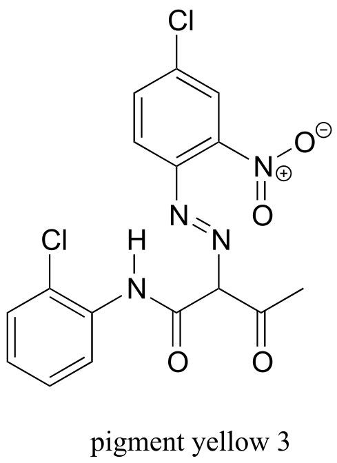

fig 1a

As it turns out, Pigment Yellow 3 had not become available in the United
States until many years after William Aiken Walker died.

Simons had purchased his painting from a man named Robert Heller for
\$9,500. When Heller approached him again to offer several more Walker
paintings for sale, Simons contacted the FBI. A few days later, with FBI
agents listening in, Simons agreed to buy two more Walker paintings.
When he received them, they were promptly analyzed and found to be fake.
Heller, who turned out to be a convicted felon, was arrested and
eventually imprisoned.

(You may want to check out a [short
article](http://pubs.acs.org/doi/abs/10.1021/cen-v085n037.p028) from the
September 10, 2007 issue of *Chemical and Engineering* News for more
about this story).

In the first three chapters of this text, we have focused our efforts on
learning about the structure of organic compounds. Now that we know what
organic molecules look like, we can begin to address, in the next two
chapters, the question of *how* we get this knowledge in the first
place. How are chemists able to draw with confidence the bonding
arrangements in organic molecules, even simple ones such as acetone or
ethanol? How was James Martin at Orion Analytical able to identify the
chemical structure of the pigment compound responsible for the 'funky
yellow color' in the forged William Aiken Walker painting?

This chapter is devoted to three very important techniques used by
chemists to learn about the structures of organic molecules. First, we
will learn how **mass spectrometry** can provide us with information
about the mass of a molecule as well as the mass of fragments into which
the molecule has been broken. Then, we will begin our investigation of
**molecular spectroscopy**, which is the study of how electromagnetic
radiation at different wavelengths interacts in different ways with
molecules - and how these interactions can be quantified, analyzed, and
interpreted to gain information about molecular structure. After a brief
overview of the properties of light and the elements of a molecular
spectroscopy experiment, we will move to a discussion of **infrared (IR)
spectroscopy**, the key technique used in the detection of the Walker
forgery, and a way to learn about functional groups present in an
organic compound. Then, we will consider **ultraviolet-visible (UV-vis)
spectroscopy**, with which chemists gain information about conjugated
π-bonding systems in organic molecules, and how these conjugated systems
are the basis for the color of some organic compounds, including pigment
yellow \#3. We will see how information from UV-vis spectroscopy can be
used to measure the concentration of biomolecules in solution.

Looking ahead, Chapter 5 will be devoted to **nuclear magnetic resonance
(NMR) spectroscopy**, where we use ultra-strong magnets and radio
frequency radiation to learn about the electronic environment of
individual atoms in a molecule and use this information to determine the
atom-to-atom bonding arrangement. For most organic chemists, NMR is one
of the most powerful analytical tools available in terms of the wealth
of detailed information it can provide about the structure of a
molecule.

In summary, the structure determination techniques we will be studying
in this chapter and the next primarily attempt to address the following
questions about an organic molecule:

<u>Chapter 4:</u>

> Mass spectrometry (MS): *What is the atomic weight of the molecule and
> its common fragments?*
>
> Infrared (IR) spectroscopy: *what functional groups does the molecule
> contain?*
>
> Ultraviolet-visible (UV-Vis) spectroscopy: *What is the nature of
> conjugated π-bonding systems in the molecule?*

<u>Chapter 5:</u>

> Nuclear magnetic resonance spectroscopy (NMR): *What is the overall
> bonding framework of the molecule?*

## Section 4.1: Mass Spectrometry

Mass spectrometry (MS) is a powerful analytical technique widely used by
chemists, biologists, medical researchers, and environmental and
forensic scientists, among others. With MS, we are looking at the mass
of a molecule, or of different fragments of that molecule.

### 4.1A: Overview of mass spectrometry

There are many different types of MS instruments, but they all have the
same three essential components:

> 1\) First, there is an ionization source, where the molecule is given
> a positive electrical charge, either by removing an electron or by
> adding a proton.
>
> 2\) Depending on the ionization method used, the ionized molecule may
> or may not break apart into a population of smaller fragments
>
> 3\) Next in line there is a mass analyzer, where the
> positively-charged fragments are separated according to mass.
>
> 4\) Finally, there is a detector, which detects and quantifies the
> separated ions.

One of the more common types of MS techniques used in the organic
laboratory is **electron ionization** (EIMS). Although biomolecules are
usually too polar for this technique, it is useful for the analysis of
intermediates and products in laboratory synthesis, and is a good
starting place to learn about MS in general. In a typical EIMS
experiment, the sample molecule is bombarded by a high-energy electron
beam, which has the effect of knocking a valence electron off of the
molecule to form a **radical cation**. Because a great deal of energy is
transferred by this bombardment process, the radical cation quickly
begins to break up into smaller **fragments**, some of which are cations
(both radical and non-radical) and some of which are neutral. A subset
of the initially formed radical cations do not fragment at all - these
are referred to as **molecular ions**. The neutral fragments are either
adsorbed onto the walls of the chamber or are removed by a vacuum
source. The molecular ion and all other cationic fragments are
accelerated down a curved tube by an electric field.

fig 26

[another
image](http://www.chem.ucalgary.ca/courses/351/Carey5th/Ch13/1334.gif)

As they travel down the curved tube, the ions are deflected by a strong
magnetic field. Cations of different **mass to charge (*m/z*) ratios**
are deflected to a different extent, resulting in a sorting of ions by
mass (virtually all ions have charges of *z* = +1, so sorting by the
mass to charge ratio is essentially the same thing as sorting by mass).
A detector at the end of the curved flight tube records and quantifies
the sorted ions.

### 4.1B: Looking at mass spectra

Below is typical output for an electron-ionization MS experiment (MS
data in the section is derived from the [Spectral Database for Organic
Compounds](http://sdbs.db.aist.go.jp/sdbs/cgi-bin/cre_index.cgi), a
free, web-based database of spectra.)

fig 27

The sample is acetone. On the horizontal axis is the value for *m/z* (as
we stated above, the charge *z* is almost always +1, so in practice this
is the same as mass). On the vertical axis is the relative abundance of
each ion detected. On this scale, the most abundant ion, called the
**base peak**, is set to 100%, and all other peaks are recorded relative
to this value. In the acetone spectrum above, the base peak is at *m/z*
= 43, representing a fragment of acetone with a mass of 43 amu. The
molecular weight of acetone is 58, so we can identify the peak at *m/z*
= 58 as that corresponding to the **molecular ion peak**, or **parent
peak**. In some mass spectra, the molecular ion peak is the most
abundant peak, and so it is also the base peak by definition.

The data collected in a mass spectrum - a series of m/z values, each
associated with a relative abundance value - is a unique 'fingerprint'
of the compound being analyzed, so the spectrum of an unknown sample can
be used to search a computer database of MS spectra to come up with a
'hit', just as fingerprint information can be used by the police to
identify a suspect from a fingerprint database. In fact, mass
spectrometry is a powerful tool in criminal forensics.

An experienced chemist can gain a wealth of useful structural
information from a mass spectrum, even without access to a reference
database. The parent peak provides the molecular weight of the compound
being analyzed, which of course is a very useful piece of information.
However, much of the utility in electron-ionization MS comes from the
fact that the radical cations generated in the electron-bombardment
process tend to fragment in predictable ways. The base peak at *m/z* =
43 in the acetone spectrum, for example, is the result of the molecule
breaking apart into what is termed an acylium cation and a methyl
radical. The methyl radical fragment has a mass of 15 amu, but is not
detected because it is neutral, not a cation.

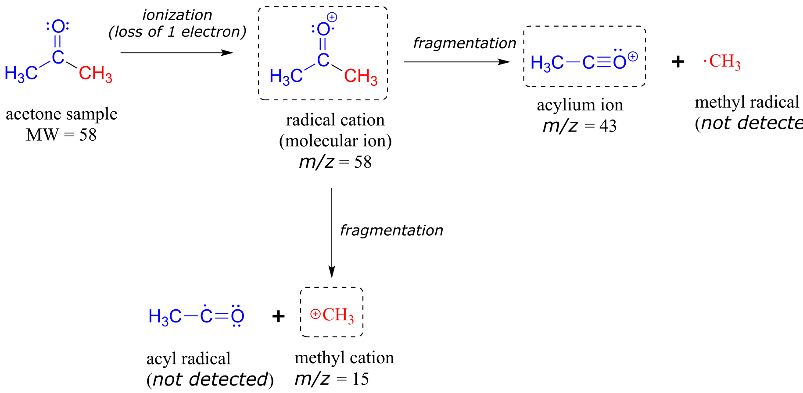

fig 29

Notice that we do in fact see a peak in the spectrum at m/z = 15, which
corresponds to a methyl cation, formed in a different fragmentation
event in which the second product is a neutral (and thus undetected)
radical fragment.

<u>Exercise 4.1</u>: Using the fragmentation patterns for acetone above
as a guide, predict the signals that you would find in the mass spectra
of:

a\) 2-butanone; b) 3-hexanone; c) cyclopentanone.

Many other organic functional groups and bonding arrangements have
predictable fragmentation patterns. As a rule, the cationic fragments
that form in greatest abundance are those which are, relatively
speaking, the most stable (we will learn about carbocation stability in
chapter 8). A discussion of the mechanisms for fragmentation in mass
spectrometry is outside the scope of this book, but will be covered if
you take more advanced courses in organic or analytical chemistry.

Notice in the mass spectrum of acetone that there is a small peak at
*m/z* = 59: this is referred to as the **M+1 peak**. How can there be an
ion that has a greater mass than the molecular ion? A small fraction -
about 1.1% - of all carbon atoms in nature are actually the
13C rather than the 12C isotope. The
13C isotope has an extra neutron in its nucleus, and thus is
heavier than 12C by 1 mass unit. The M+1 peak corresponds to
those few acetone molecules in the sample which contained a
13C.

Molecules with several oxygen atoms sometimes show a small **M+2 peak**
(2 *m/z* units greater than the parent peak) in their mass spectra, due
to the presence of a small amount of 18O (the most abundant
isotope of oxygen is 16O). Because there are two abundant
isotopes of both chlorine (about 75% 35Cl and 25%
37Cl) and bromine (about 50% 79Br and 50%
81Br), chlorinated and brominated compounds have very large
and recognizable M+2 peaks. Fragments containing both isotopes of
bromine can be seen in the mass spectrum of bromoethane: notice that the
equal abundance of the two isotopes is reflected in the equal height of
their corresponding peaks.

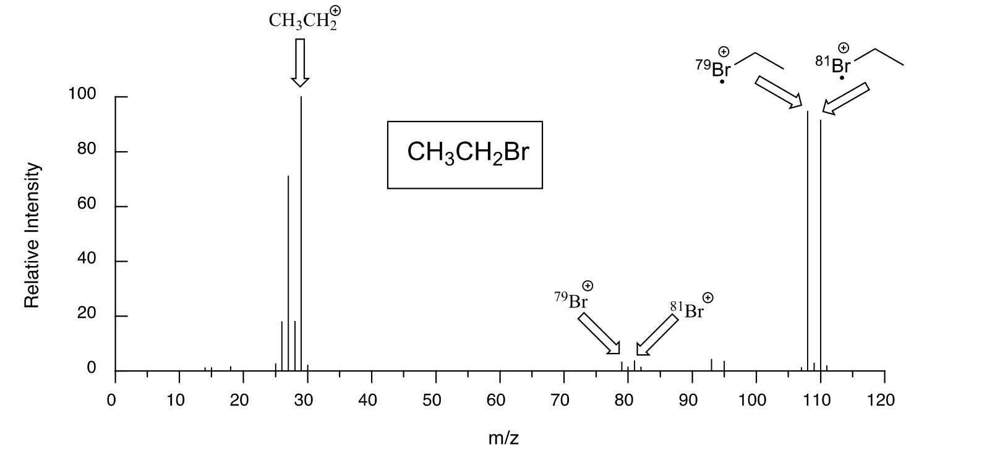

fig 28

The spectrum for chloroethane shows a parent peak at *m/z* = 64, and an
M+2 peak at 1/3 the height of the parent peak. These characteristic M+2
patterns are useful for identifying the presence of bromine or chlorine
in a sample.

<u>Exercise 4.2:</u> Predict some signals that you would expect to see
in a mass spectrum of 2-chloropropane.

<u>Exercise 4.3</u>: The mass spectrum of an aldehyde shows a parent
peak at *m/z* = 58 and a base peak at *m/z* = 29. Propose a structure,
and identify the two species whose *m/z* values were listed. (

### 4.1C: Gas Chromatography - Mass Spectrometry

Quite often, mass spectrometry is used in conjunction with a separation
technique called gas chromatography (GC). The combined GC-MS procedure
is very useful when dealing with a sample that is a mixture of two or
more different compounds, because the various compounds are separated
from one another before being subjected individually to MS analysis. We
will not go into the details of gas chromatography here, although if you
are taking an organic laboratory course you might well get a chance to
try your hand at GC, and you will almost certainly be exposed to the
conceptually analogous techniques of thin layer and column
chromatography. Suffice it to say that in GC, a very small amount of a
liquid sample is vaporized, injected into a long, coiled capillary
column, and pushed though the column by an inert gas, usually helium.
Along the way, different compounds in the sample stick to the walls of
the capillary column to different extents, and thus travel at different
speeds and emerge separately from the end of the column. In GC-MS, each
separated compound is sent directly from the end of the GC column into
the MS instrument, so in the end we get a separate mass spectrum for
each of the components in the original mixed sample.

[Schematic of a GC-MS
instrument](https://www.researchgate.net/profile/Gaojin_Lyu/publication/221927526/figure/fig1/AS:304730011127825@1449664704989/Fig-1-Schematic-of-a-GC-MS-system.png)

Ideally, this data can be used to search an MS database and identify
each compound in the sample.

The extremely high sensitivity of modern GC-MS instrumentation makes it
possible to detect and identify very small trace amounts of organic
compounds. GC-MS is being used increasingly by environmental chemists to
detect the presence of harmful organic contaminants in food and water
samples.

### 4.1D: Mass spectrometry of biomolecules

*Methods Enzymol*. **2005**, *402*, 3.

As was mentioned earlier, electron ionization mass spectrometry is
generally not very useful for analyzing biomolecules: their high
polarity makes it difficult to get them into the vapor phase, the first
step in EIMS. Mass spectrometry of biomolecules has undergone a
revolution over the past few decades, with many new ionization and
separation techniques being developed. Generally, the strategy for
biomolecule analysis involves **soft ionization**, in which much less
energy (compared to techniques such as EIMS) is imparted to the molecule
being analyzed during the ionization process. Usually, soft ionization
involves adding protons rather than removing electrons: the cations
formed in this way are significantly less energetic than the radical
cations formed by removal of an electron. The result of soft ionization
is that little or no fragmentation occurs, so the mass being measured is
that of an intact molecule. Typically, large biomolecules are digested
into smaller pieces using chemical or enzymatic methods, then their
masses determined by 'soft' MS.

New developments in soft ionization MS technology have made it easier to
detect and identify proteins that are present in very small quantities
in biological samples. In **electrospray ionization** (ESI), the protein
sample, in solution, is sprayed into a tube and the molecules are
induced by an electric field to pick up extra protons from the solvent.
Another common 'soft ionization' method is 'matrix-assisted laser
desorption ionization' (**MALDI**). Here, the protein sample is adsorbed
onto a solid matrix, and protonation is achieved with a laser.

Typically, both electrospray ionization and MALDI are used in
conjunction with a time-of-flight (TOF) mass analyzer component.

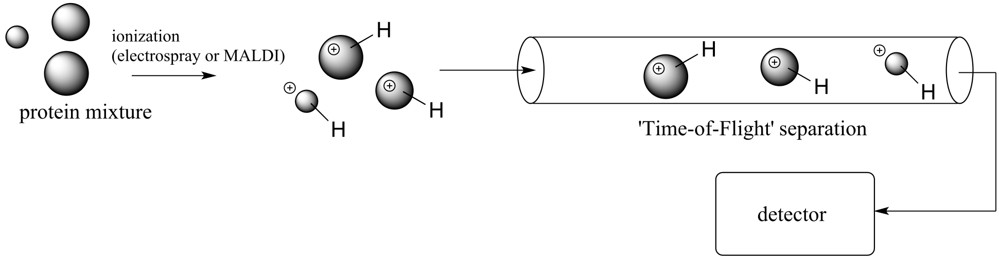

fig 30

[another schematic of
MALDI-TOF](http://1.bp.blogspot.com/-DFjr9HnXktE/Ugvj7PQlmvI/AAAAAAAABtc/w383gMpx5mA/s1600/maldi-tof-principle.jpg)

The proteins are accelerated by an electrode through a column, and
separation is achieved because lighter ions travel at greater velocity
than heavier ions with the same overall charge. In this way, the many
proteins in a complex biological sample (such as blood plasma, urine,
etc.) can be separated and their individual masses determined very
accurately. Modern protein MS is extremely sensitive – recently,
scientists were even able to detect the presence of *Tyrannosaurus rex*
protein in a fossilized skeleton! ([*Science* **2007**, *316*,
277](http://science.sciencemag.org/content/316/5822/277)).

Soft ionization mass spectrometry has become in recent years an
increasingly important tool in the field of
[**proteomics**](https://www.ebi.ac.uk/training/online/course/proteomics-introduction-ebi-resources/what-proteomics).
Traditionally, protein biochemists tend to study the structure and
function of individual proteins. Proteomics researchers, in contrast,
want to learn more about how large numbers of proteins in a living
system interact with each other, and how they respond to changes in the
state of the organism. One important subfield of proteomics is the
search for protein 'biomarkers' for human disease: in other words,
proteins which are present in greater quantities in the tissues of a
sick person than in a healthy person. Detection in a healthy person of a
known biomarker for a disease such as diabetes or cancer could provide
doctors with an early warning that the patient may be especially
susceptible to the disease, so that preventive measures could be taken
to prevent or delay onset.

In a 2005 study, MALDI-TOF mass spectrometry was used to compare fluid
samples from lung transplant recipients who had suffered from tissue
rejection to samples from recipients who had not suffered rejection.
Three peptides (short proteins) were found to be present at elevated
levels specifically in the tissue rejection samples. It is hoped that
these peptides might serve as biomarkers to identify patients who are at
increased risk of rejecting their transplanted lungs. ([*Proteomics*
**2005**, *5*,
1705](http://onlinelibrary.wiley.com/doi/10.1002/pmic.200401036/abstract)).
More recently, MALDI-TOF MS was used to identify protein biomarkers for
Alzheimer's disease in the blood, which could lead to an early diagnosis
method for Alzheimer's which is much less expensive than brain scans,
the only detection method currently available ([*Nature* **2018**,
*554*, 249](https://www.nature.com/articles/nature25456)).

## Section 4.2: Introduction to molecular spectroscopy

### 4.2A: The electromagnetic spectrum

Electromagnetic radiation, as you may recall from a previous chemistry
or physics class, is composed of oscillating electrical and magnetic
fields. Visible light is electromagnetic radiation. So are the gamma
rays that are emitted by spent nuclear fuel, the x-rays that a doctor
uses to visualize your bones, the ultraviolet light that causes a
painful sunburn when you forget to apply sun block, the infrared light
that the army uses in night-vision goggles, the microwaves you use to
heat up your frozen burritos, and the radio-frequency waves of your cell
phone signal.

While the speed of a wave in the ocean can vary, the speed of
electromagnetic waves – commonly referred to as the speed of light – is
a constant, approximately 300 million meters per second, whether we are
talking about gamma radiation, visible light, or FM radio waves.
Electromagnetic radiation is defined by its **wavelength**, which is the
distance between one wave crest to the next.

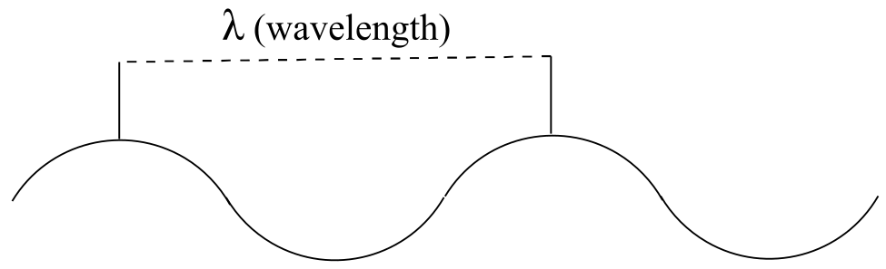

Because electromagnetic radiation travels at a constant speed, each
wavelength corresponds to a given **frequency**, which is the number of
times per second that a crest passes a given point. Longer waves have
lower frequencies, and shorter waves have higher frequencies. Frequency
is commonly reported in hertz (Hz), meaning ‘cycles per second’, or
‘waves per second’. The equivalent standard unit for frequency is
s-1.

When talking about electromagnetic waves, we can refer either to
wavelength or to frequency - the two values are inversely proportional:

equation 4.1 λυ = *c*

where λ (Greek '*lambda*') is wavelength, υ (Greek ‘*nu’*) is frequency
in s-1 (or Hz), and *c* is the speed of light, a constant
value of 3.0 x 108 m·s-1.

Electromagnetic radiation transmits energy in discreet quantum
'packages' called **photons**. Shorter wavelengths (and higher
frequencies) correspond to higher energy.

High energy radiation, such as gamma radiation and x-rays, is composed
of very short waves – as short as 10-16 m. Longer wavelengths
are far less energetic, and thus are less dangerous to living things.
Visible light waves are in the range of 400 – 700 nm (nanometers, or
10-9 m), while radio waves can be several hundred meters in
length.

The energy of a particular wavelength of electromagnetic radiation can
be expressed as:

equation 4.2 E = *hc*/λ = *h*ν

where E is energy in kJ/mol of photons and *h* is 3.99 x
10-13 kJ·s·mol-1, a number known as **Planck’s
constant**.

Using equations 4.1 and 4.2, we can calculate, for example, that visible
red light with a wavelength of 700 nm has a frequency of 4.29 x
1014 Hz, and an energy of 171 kJ per mole of photons.

The full range of electromagnetic radiation wavelengths is referred to
as the **electromagnetic spectrum**.

fig 1

[another
image](https://imagine.gsfc.nasa.gov/Images/science/EM_spectrum_compare_level1_lg.jpg)

Notice in the figure above that visible light takes up just a narrow
band of the full spectrum. White light from the sun or a light bulb is a
mixture of all of the visible wavelengths plus some UV. You see the
visible region of the electromagnetic spectrum divided into its
different wavelengths every time you see a rainbow: violet light has the
shortest wavelength, and red light has the longest.

<u>Exercise 4.4</u>: Visible light has a wavelength range of about
400-700 nm. What is the corresponding frequency range? What is the
corresponding energy range, in kJ/mol of photons?

### 4.2B: Overview of the molecular spectroscopy experiment

In a molecular spectroscopy experiment, electromagnetic radiation of a
specified range of wavelengths is allowed to pass through a sample
containing a compound of interest. The sample molecules absorb energy
from some of the wavelengths, and as a result jump from a low energy
‘ground state’ to some higher energy ‘excited state’. Other wavelengths
are *not* absorbed by the sample molecule, so they pass on through. A
detector records which wavelengths were absorbed, and to what extent
they were absorbed.

[General schematic of molecular
spectroscopy](https://upload.wikimedia.org/wikipedia/commons/thumb/f/f2/Spectroscopy_overview.svg/1200px-Spectroscopy_overview.svg.png)

As we will see in this chapter, we can learn a lot about the structure
of an organic molecule by quantifying how it absorbs (or does not
absorb) different wavelengths in the electromagnetic spectrum. Three of
the most useful types of molecular spectroscopy for organic chemists
involve absorption of radiation in the infrared, ultraviolet/visible,
and radio regions of the electromagnetic spectrum. We will focus first
on infrared spectroscopy.

## Section 4.3: Infrared spectroscopy

Covalent bonds in organic molecules are not rigid sticks – rather, they
behave more like springs. At room temperature, organic molecules are
always in motion, as their bonds stretch, bend, and twist. These complex
vibrations can be broken down mathematically into individual
**vibrational modes**, a few of which are illustrated below.

fig 3

[interactive: vibrational modes of
water](http://www.chemtube3d.com/vibrationsH2O.htm)

Each vibrational mode for any bond in an organic molecule has a
characteristic ground state frequency of vibration, which will be
somewhere between 1013 and 1014 vibrations per
second. This range of frequencies corresponds to the infrared region of
the electromagnetic spectrum.

If a molecule is exposed to electromagnetic radiation that matches the
frequency of one of its vibrational modes, it will absorb energy from
the radiation and jump to a higher vibrational energy state - the
*amplitude* of the vibration will increase, but the vibrational
*frequency* will remain the same. The difference in energy between the
two vibrational states is equal to the energy associated with the
wavelength of radiation that was absorbed.

Let's take 2-hexanone as an example. Picture the carbonyl bond of the
ketone group as a spring. This spring is constantly bouncing back and
forth, stretching and compressing, pushing the carbon and oxygen atoms
further apart and then pulling them together. This is the **stretching
mode** of the carbonyl bond. In the space of one second, the spring
'bounces' back and forth 5.15 x 1013 times - in other words,
its stretching frequency is 5.15 x 1013 Hz (remember that Hz
means 'per second').

[animation of carbonyl stretching in several organic
molecules](https://www.youtube.com/watch?v=ho224YwTsG8)

If our ketone sample is irradiated with infrared light, the carbonyl
bond will absorb light of a frequency matching its stretching frequency
of 5.15 x 1013 Hz, which by equations 4.1 and 4.2 corresponds
to a wavelength of λ = 5.83 x 10-6 m and an energy of 20.5
kJ/mol. When the carbonyl bond absorbs this energy, it jumps up to its
excited vibrational state.

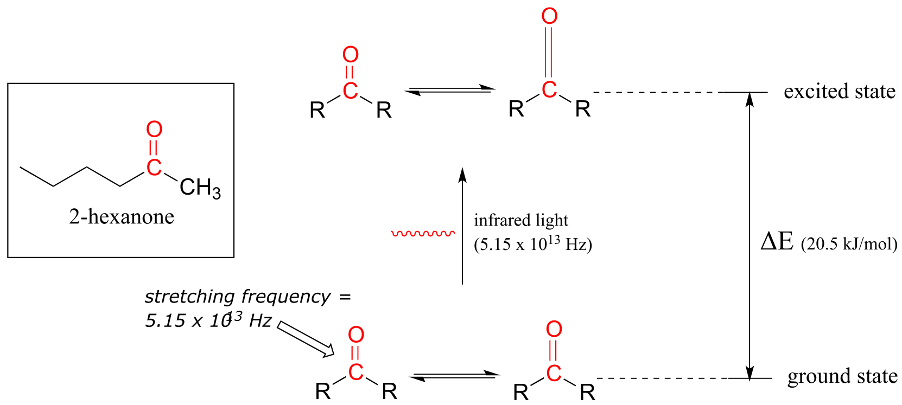

fig 4

The molecule does not remain in the excited vibrational state for very
long, but quickly releases energy to the surrounding environment in form
of heat, and returns to the ground state.

In an [**infrared
spectrophotometer**](http://www.chemhume.co.uk/ASCHEM/Unit%202/Ch10%20Alkenes/infrared_spectrometer.jpg),
light in the infrared region (frequencies ranging from about
1013 to 1014 Hz) is passed though our sample of
2-hexanone. Most frequencies pass right through the sample. The 5.15 x
1013 Hz carbonyl stretching frequency, however, is absorbed
by the 2-hexanone sample, and a detector in the instrument records that
the intensity of this frequency, after having passed through the sample,
is something less than 100% of its initial value.

The vibrations of a 2-hexanone molecule are not, of course, limited to
the simple stretching of the carbonyl bond. The various carbon-carbon
bonds also stretch and bend, as do the carbon-hydrogen bonds, and all of
these vibrational modes also absorb different frequencies of infrared
light.

The power of infrared spectroscopy arises from the observation that *the
bonds characterizing different functional groups have different
characteristic absorption frequencies*. The carbonyl bond in a ketone,
as we saw with our 2-hexanone example, typically absorbs in the range of
5.11 - 5.18 x 1013 Hz, depending on the molecule. The
carbon-carbon triple bond of an alkyne, on the other hand, absorbs in
the range of 6.30 - 6.80 x 1013 Hz. The technique is
therefore very useful as a means of identifying which functional groups
are present in a molecule of interest. If we pass infrared light through
an unknown sample and find that it absorbs in the carbonyl frequency
range but not in the alkyne range, we can infer that the molecule
contains a carbonyl group but not an alkyne.

Some bonds absorb infrared light more strongly than others, and some
bonds do not absorb at all. *In order for a vibrational mode to absorb
infrared light, it must result in a periodic (repeating) change in the
dipole moment of the molecule*. Such vibrations are said to be
**infrared active**. In general, the greater the polarity of the bond,
the stronger its IR absorption. The carbonyl bond is very polar, and
therefore absorbs very strongly. The carbon-carbon triple bond in most
alkynes, in contrast, is much less polar, and thus a stretching
vibration does not result in a large change in the overall dipole moment
of the molecule. We will see below that IR signals for carbonyl bonds
are very strong, but the signals for carbon-carbon double and triple
bonds are relatively weak.

Some kinds of vibrations are **infrared inactive**. The stretching
vibrations of completely symmetrical double and triple bonds, for
example, do not result in a change in dipole moment, and therefore do
not result in any absorption of light (but other bonds and vibrational
modes in these molecules *do* absorb IR light).

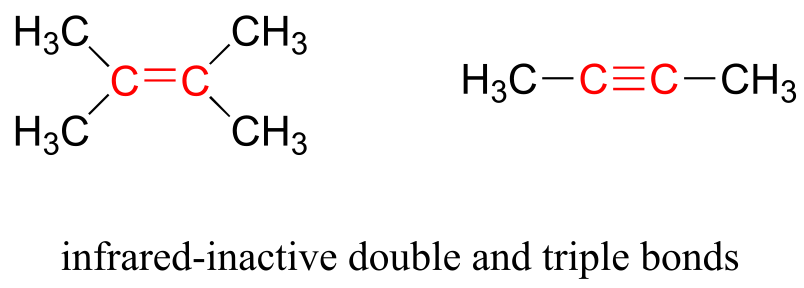

fig 6

Now, let's look at some actual output from IR spectroscopy experiments.
Below is the IR spectrum for 2-hexanone.

fig 7

There are a number of things that need to be explained in order for you
to understand what it is that we are looking at. On the horizontal axis
we see IR wavelengths expressed in terms of a unit called **wavenumber**
(cm-1), which tells us how many waves fit into one
centimeter.

equation 4.3: wavenumber (in cm-1) = 1/100λ ν/100*c*

where λ is the wavelength in meters, v is frequency in s-1,
and *c* is the speed of light, 3.0 x 108 m/s. Wavenumber
units are typically used in IR spectra, but you may also occasionally
see micrometer (μm) units) on the horizontal axis.

On the vertical axis we see ‘% transmittance’, which tells us how
strongly light was absorbed at each frequency (100% transmittance, at
the high end of the axis, means no absorption occurred at that
frequency). The solid line traces the values of % transmittance for
every wavelength passed through the sample – the downward-pointing
**absorbance bands** show regions of strong absorption.

Exercise 4.5: Express the wavenumber value of 3000 cm-1 in
terms of wavelength (in meter units) frequency (in Hz), and associated
energy (in kJ/mol).

The key absorption band in this spectrum is that from the carbonyl
double bond, at

1716 cm-1, corresponding to a wavelength of 5.86 μm, a
frequency of 5.15 x 1013 Hz, and a ∆E value of 20.5 kJ/mol.
Notice how strong this band is, relative to the others on the spectrum:
*a strong absorbance band in the 1650-1750 cm-1 region tells
us that a carbonyl group is present*. Within that range, carboxylic
acids, esters, ketones, and aldehydes tend to absorb in the shorter
wavelength end (1700-1750 cm-1), while conjugated unsaturated ketones
and amides tend to absorb on the longer wavelength end (1650-1700
cm-1).

The jagged band at approximately 2900-3000 cm-1 is
characteristic of the stretching modes of *sp3*-hybridized
carbon-hydrogen bonds. This band is not terribly useful, as just about
every organic molecule that you will have occasion to analyze has these
bonds. Nevertheless, it can serve as a familiar reference point to
orient yourself in a spectrum.

You will notice that there are many additional band in this spectrum in
the longer-wavelength 400 -1400 cm-1 region. This part of the
spectrum is called the **fingerprint region**. While it is usually very
difficult to pick out anything specific to a functional group from this
region, the fingerprint region nevertheless contains valuable
information. Just like a human fingerprint, the pattern of absorbance
bands in the fingerprint region is unique to every molecule, meaning
that the data from an unknown sample can be compared to a database of IR
spectra of known standards in order to make a positive identification.
In our introductory story about the forged paintings, it was the IR
fingerprint region of the suspicious yellow paint that allowed for its
identification as a pigment that could not possibly have been used by
the purported artist, William Aiken Walker. (Recall from earlier in this
chapter that a mass spectrum of a molecule can also be thought of as a
kind of 'fingerprint' by which the molecule can be identified.)

Now, let’s take a look at the IR spectrum for 1-hexanol.

fig 8

As expected, there is no carbonyl band at around 1700 cm-1,
but we can see a very broad ‘mountain’ centered at about 3400
cm-1. This signal is characteristic of the O-H stretching
mode of alcohols, and tells us that our sample has an alcohol group. The
breadth of this signal is a consequence of hydrogen bonding between
molecules.

The spectrum for 1-octene shows two bands that are characteristic of
alkenes: the one at 1642 cm-1 is due to stretching of the
carbon-carbon double bond, and the one at 3079 cm-1 is due to stretching
of the σ bond between the *sp2*-hybridized alkene carbons and
their attached hydrogens.

fig 10

[IR spectrum of
(Z)-2-octene](https://image.slidesharecdn.com/theoryofirspectroscopy-160622080111/95/theory-of-ir-spectroscopy-41-638.jpg?cb=1466582588)

Alkynes have characteristic weak but sharp IR absorbance bands in the
range of 2100-2250 cm-1 due to stretching of the
carbon-carbon triple bond, and terminal alkynes can be identified by
their absorbance at about 3300 cm-1, due to stretching of the
bond between the *sp*-hybridized carbon and the terminal hydrogen.)

[IR spectrum of
1-hexyne](http://orgchemboulder.com/Spectroscopy/irtutor/images/hexyne.gif)

<u>Exercise 4.6</u>: Explain how you could use the C-C and C-H
stretching frequencies in IR spectra to distinguish between four
constitutional isomers: 1,2-dimethylcyclohexene, 1,3-octadiene,
3-octyne, and 1-octyne.

Other functional groups can be identified IR, but we will confine our
discussion here to a small set of the most easily identifiable groups.
These are summarized below.

**Characteristic IR absorbances**

| **Functional group** | **Characteristic IR absorbance(s) (cm-1)** | **Source of signal**    |
|----------------------|-------------------------------------------------------|-------------------------|
| carbonyl             | 1650-1750 (strong)                                    | C=O stretching          |
| alcohol              | 3200 - 3600 (broad)                                   | O-H stretching          |
| carboxylic acid      | 1700-1725 (strong)                                    | C=O stretching          |
|                      | 2500-3000 (broad)                                     | O-H stretching          |
| alkene               | 1620 - 1680 (weak)                                    | C=C stretching          |
|                      | 3020 - 3080                                           | vinylic C-H stretching  |
| alkyne               | 1620 - 1680 (weak)                                    | triple bond stretching  |
|                      | 3250-3350                                             | terminal C-H stretching |

A more detailed summary is provided
[here](http://classes.kvcc.edu/chm220/Images/table1a_IR.jpg) and in
Table 1 at the end of this book.

An IR spectrum usually does not provide enough information for us to
figure out the complete structure of a molecule. In conjunction with
other analytical methods, however, IR spectroscopy can prove to be a
very valuable tool, given the information it provides about the presence
or absence of key functional groups. IR can also be a quick and
convenient way for a chemist to check to see if a reaction has proceeded
as planned. If we were to run a reaction in which we wished to convert
cyclohexanone to cyclohexanol, for example, a quick comparison of the IR
spectra of starting compound and product would tell us if we had
successfully converted the ketone group to an alcohol.

[IR spectrum of a carboxylic acid (propionic
acid)](https://www2.chemistry.msu.edu/faculty/reusch/virttxtjml/spectrpy/Images/propacid.gif)

[IR spectrum of an amide
(N-methylaceetamide)](http://1.bp.blogspot.com/-UJ061-CyE6Y/UMqqoaJk9OI/AAAAAAAADLs/BPDj6bVJFS4/s1600/Introduction_to_Spectroscopy+(1).pdf+-+SumatraPDF_2012-12-13_21-26-52.png)

[IR spectrum of
diethylamine](http://orgchemboulder.com/Spectroscopy/irtutor/images/dietham.gif)

<u>Exercise 4.7</u>: Using the online [Spectral Database for Organic
Compounds](http://sdbs.db.aist.go.jp/sdbs/cgi-bin/cre_index.cgi), look
up IR spectra for the following compounds, and identify absorbance bands
corresponding to those listed in the table above. List actual
frequencies for each signal to the nearest cm-1 unit, using
the information in tables provided on the site.

a\) 1-methylcyclohexanol

b\) 4-methylcyclohexene

c\) 1-hexyne

d\) 2-hexyne

e\) 3-hexyne-2,5-diol

<u>Exercise 4.8</u>: A carbon-carbon single bond absorbs in the
fingerprint region, and we have already seen the characteristic
absorption wavelengths of carbon-carbon double and triple bonds.
Rationalize the trend in wavelengths. (*Hint* - remember, we are
thinking of bonds as springs, and looking at the frequency at which they
'bounce').

## Section 4.4: Ultraviolet and visible spectroscopy

Ultraviolet and visible (UV-Vis) spectroscopy provides us with
information about aromatic groups and other conjugated π systems in
organic compounds. In looking at IR spectroscopy, we saw how interaction
with infrared light causes molecules to undergo vibrational transitions.
The shorter wavelength, higher energy radiation in the UV (200-400 nm)
and visible (400-700 nm) range of the electromagnetic spectrum causes
organic molecules with conjugated π bonds to undergo **electronic
transitions**.

### 4.4A: The electronic transition

Recall from chapter 2 that molecular orbital (MO) theory can be a useful
way to think about covalent bonding in molecules containing conjugated
double bonds and aromatic rings. Keep in mind that molecular orbitals
result from the mathematical combination of two or more atomic orbitals,
and describe a region in space around a *group of atoms* (rather than a
single atom) in which electrons are likely to be found. We'll see here
that MO theory is indispensible to a discussion of ultraviolet and
visible spectroscopy.

A **chromophore** is any molecule or part of a molecule that has the
property of absorbing light in the ultraviolet or visible region of the
spectrum. 1,3-butadiene is a chromophore. Recall from section 2.2B that
the conjugated π bonds in1,3-butadiene can be pictured as four parallel,
overlapping *p* orbitals sharing four electrons:

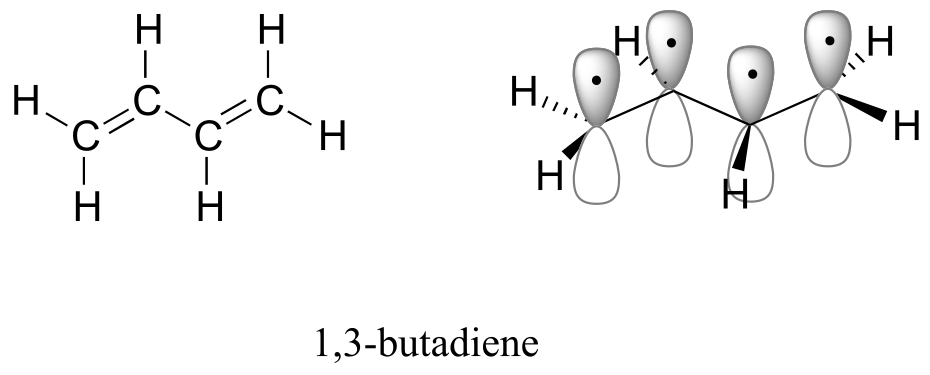

fig 11

Using the language of MO theory, we can say that the four *p* atomic
orbitals combine to form four π molecular orbitals. The two lower energy
orbitals π1 and π2 are bonding orbitals, while the
two higher energy orbitals π3\* and π4\* are
antibonding orbitals.

fig 12

In the electronic ground state, all four π electrons in the conjugated
system reside in the two bonding orbitals. A **π **→ **π\* transition**
occurs when an electron in π2, the **highest occupied
molecular orbital (HOMO)** jumps up to π3\*, the **lowest
unoccupied molecular orbital (LUMO)**. The gap between these two
molecule orbitals is often called the **HOMO-LUMO energy gap**.

For 1,3-butadiene, the energy difference in the HOMO-LUMO gap is 552
kJ/mol. This energy corresponds to light with a wavelength of 217 nm,
which is in the ultraviolet region of the spectrum. When a sample of
1,3-butadiene is irradiated with UV radiation, the molecule absorbs the
light at 217 nm as an electron undergoes a π-π\* transition.

fig 13

The absorbance due to the π → π\* transition in 1,3,5-hexatriene occurs
at 258 nm, corresponding to a HOMO-LUMO gap of 464 kJ/mol.

fig 14

Notice what happened here: when the conjugated π system was extended by
two carbons, the HOMO-LUMO energy gap shrunk from 552 to 464 kJ/mol. A
lower energy transition corresponds to longer wavelength absorbance
(look again at equation 4.2 in the previous section). In general:

*As conjugated π systems become more extended,*

*a) the HOMO-LUMO gap shrinks, and*

*b) the wavelength of absorbed light becomes longer*.

In molecules with very large, extended conjugated π systems, the π → π\*
energy gap becomes so small that absorption occurs in the visible rather
than the UV region of the electromagnetic spectrum.

The visible region of the electromagnetic spectrum:

fig 14a

β-carotene, with its system of 11 conjugated double bonds, absorbs light
in a broad band between approximately 420-550 nm, with a λmax
at 470 nm, spanning the blue and green regions of the visible spectrum.
Because blue/green wavelengths are absorbed while those in the red and
yellow regions are able to pass through the sample, β-carotene appears
to our eyes as orange. β-carotene is abundant in carrots, and is the
compound mainly responsible for their orange color.

fig 15

<u>Exercise 4.9</u>: What is the energy of the photons (in kJ/mol) of
light with wavelength of 470 nm, the λmax of β-carotene?

<u>Exercise 4.10</u>: Which of the following molecules would you expect
absorb at a longer wavelength in the UV region of the electromagnetic
spectrum? Explain your answer.

> 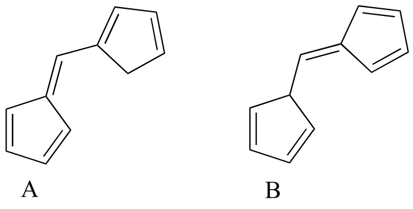 style="width:2.35208in;height:1.19444in" />

fig19a

**Protecting yourself from sunburn**

Human skin can be damaged by exposure to ultraviolet light from the sun.
We naturally produce a pigment, called melanin, which protects the skin
by absorbing much of the ultraviolet radiation. Melanin is a complex
polymer, two of the most common monomers units of which are shown below.

Overexposure to the sun is still dangerous, because there is a limit to
how much radiation our melanin can absorb. Most commercial sunscreens
claim to offer additional protection from both UV-A and UV-B radiation:
UV-A refers to wavelengths between 315-400 nm, UV-B to shorter, more
harmful wavelengths between 280-315 nm. PABA (*para*-aminobenzoic acid)
was used in sunscreens in the past, but its relatively high polarity
meant that it was not very soluble in oily lotions, and it tended to
rinse away when swimming. Many sunscreens today contain, among other
active ingredients, a more hydrophobic derivative of PABA called
[Padimate O](https://en.wikipedia.org/wiki/Padimate_O).

fig 19b

(*J. Investigative Derm*. **1991**, *97*, 340; *Photchem Photobiol*.
**1982**, *35*, 581)

### 4.4B: Looking at UV-vis spectra

We have been talking in general terms about how molecules absorb UV and
visible light – now let's look at some actual examples of data from a
UV-vis absorbance spectrophotometer. The setup is conceptually the same
as for IR spectroscopy: radiation with a range of wavelengths is
directed through a sample of interest, and a detector records which
wavelengths were absorbed and to what extent the absorption occurred.
Below is the absorbance spectrum of an important biological molecule
called nicotinamide adenine dinucleotide, abbreviated NAD+.
The adenine nucleotide base in the compound absorbs light in the
neighborhood of 260 nm, which is within the UV range of the
electromagnetic spectrum.

fig 16

The convention in UV-vis spectroscopy is to show the baseline at the
bottom of the graph with the absorbance bands pointing up (opposite to
the way IR spectra are normally plotted). Wavelength values on the
x-axis are generally displayed in nanometer (nm) units. On the y-axis is
a measure of how much light was absorbed at each wavelength, expressed
as **absorbance (A)**. The absorbance value contains the same
information as the 'percent transmittance' number usually used in IR
spectroscopy, just expressed in different terms. To calculate absorbance
at a given wavelength, the computer in the spectrophotometer simply
takes the intensity of light at that wavelength *before* it passes
through the sample (I0), divides this value by the intensity
of the same wavelength *after* it passes through the sample (I), then
computes the log10 of that number.

equation 4.4 A = log (I0/I)

Note that in this expression the units cancel, so A is a unitless value.

Typically, there are two things that we look for and record from a
UV-Vis spectrum. The first is **λmax**, the
wavelength at maximal absorbance, which visually is the very top of the
broad absorbance band. We also record the value of A at λmax,
which depends on the concentration of the sample. The NAD+
spectrum above shows a maximal absorbance of 1.0 at 260 nm. In the next
section, we will see how we can use this data to calculate the
concentration of NAD+ in the sample.

<u>Exercise 4.11</u>: Express A = 1.0 in terms of percent transmittance
(%T, the unit usually used in IR spectroscopy (and sometimes in UV-vis
as well).

Here is the absorbance spectrum of the common food coloring Red \#3:

fig 17

Here, we see that the extended system of conjugated π bonds causes the
molecule to absorb light in the visible range - specifically, with a
λmax of 524 nm, which is in the blue/green range. Red
wavelengths pass through without being absorbed, so the solution appears
red to our eyes.

Now, take a look at the spectrum of another food coloring, Blue \#1:

fig 18

Maximum absorbance is at 630 nm, in the orange range of the visible
spectrum, and the compound appears blue.

### 4.4D: Applications of UV spectroscopy in organic and biological chemistry

UV-Visible spectroscopy has many applications in organic and biological
chemistry. The **Beer - Lambert Law** is often used to determine the
concentration of a UV-active sample. You most likely have performed a
Beer – Lambert experiment in a General Chemistry lab. The law is simply
an application of the observation that, within certain ranges, the
absorbance of UV-active compound at a given wavelength varies in a
linear fashion with its concentration: the higher the concentration, the
greater the absorbance.

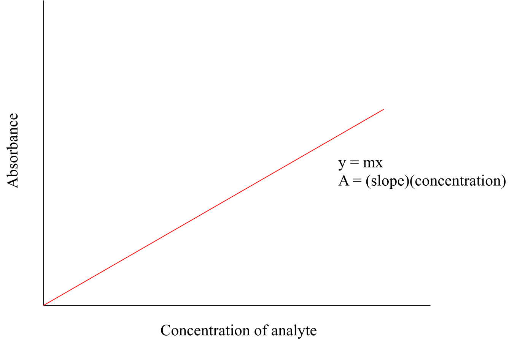

fig 31

If, for a particular sample, we divide the observed value of A at
λmax by the concentration of the sample (*c*, in mol/L), we
obtain the **molar absorptivity**, or **extinction coefficient** (ε),
which is a characteristic value for a given compound that we can look
up.

equation 4.5 ε = A/*cl*

In the above equation, '*l* ' is **path length** - the distance that the
beam of light travels though the sample - expressed in cm. Most sample
holders are designed with a path length of1.0 cm, so the conventional
unit for molar absorptivity is L⋅mol-1⋅cm-1. In
all UV-Vis discussion or problems in this book, you should assume that
the relevant path length is 1.0 cm.

For example: In the spectrum of NAD+ (section 4.3C), we see
that A = 1.0 at the λmax of 260 nm. We look up the molar
absorptivity of NAD+ at 260 nm and find that it is listed as
ε(260) = 18,000 L⋅mol-1⋅cm-1. Using equation 4.4,
it is easy to calculate that the concentration of the sample is 5.6 x
10-5 M.

The bases of DNA and RNA are good chromophores:

fig 20

Biochemists and molecular biologists often determine the concentration
of a DNA or oligonucleotide sample by assuming an average value of
ε(260) = 0.020 μL⋅ng-1⋅cm-1 for double-stranded
DNA at its λmax of 260 nm (notice that concentration here is
expressed in terms of mass rather than moles: nanograms per microliter
is a convenient unit for DNA concentration when doing molecular
biology).

<u>Exercise 4.12</u>: 50 μL of an aqueous sample of double stranded DNA
is dissolved in 950 μL of water. This diluted solution has a maximal
absorbance of 0.326 at 260 nm. What is the concentration of the original
(more concentrated) DNA sample, expressed in ug/μL?

Because the extinction coefficient of double stranded DNA is slightly
lower than that of single stranded DNA, we can use UV spectroscopy to
monitor a process known as DNA melting, an important factor in molecular
cloning experiments. If a short stretch of double stranded DNA is
gradually heated up, it will begin to ‘melt’, or break apart, as the
temperature increases (recall that two strands of DNA are held together
by a specific pattern of hydrogen bonds formed by ‘base-pairing’).

fig 21

As melting proceeds, the absorbance value for the sample increases,
eventually reaching a high plateau as all of the double-stranded DNA has
melted into two strands. The mid-point of this process, called the
‘melting temperature’, provides a good indication of how tightly the two
complementary strands of DNA are able to bind to each other.

In chapter 15 we will see how the Beer - Lambert Law and UV spectroscopy
provides us with a convenient way to follow the progress of many
different enzymatic redox (oxidation-reduction) reactions. In
biochemistry, oxidation of an organic molecule often occurs concurrently
with reduction of nicotinamide adenine dinucleotide (NAD+,
the compound whose spectrum we saw earlier in this section) to NADH:

fig 22

Proteins absorb light in the UV range due to the presence of the
aromatic amino acids tryptophan, phenylalanine, and tyrosine, all of
which are chromophores. Many coenzymes are also UV-active.

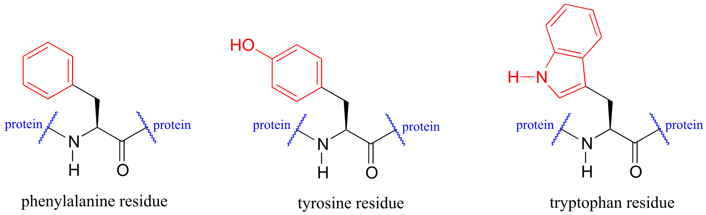

fig 24

Biochemists have used UV spectroscopy to study conformational changes in
proteins - how they change shape in response to different conditions.
When a protein undergoes a conformational shift (due to binding of a
ligand, for example), the resulting change in the environment around an
aromatic amino acid or coenzyme chromophore can cause the UV spectrum of
the protein to be altered.

Note: It will be very helpful for you to look at many more real examples
of mass spectrometry and infrared /ultraviolet-visible spectroscopy data
than are provided in this chapter - you can do this at the Spectral
Database for Organic Compounds.

## Key concepts for review

<u>Mass spectrometry:</u>

Understand the fundamentals of an MS experiment.

In a given mass spectrum, recognize the molecular ion peak along with
M+1 and M+2 peaks and be able to explain what these are and why they are
there.

Recognize characteristic mass spectral data for chloro- and
bromo-alkanes (M+2 peaks in 1:1 or 3:1 ratios, respectively).

<u>Spectrometry basics:</u>

Be able to put the following regions of the electromagnetic spectrum in
order from shortest to longest wavelength: gamma radiation, x-rays,
ultraviolet, blue visible light, red visible light, infrared, microwave,
radio wave.

Be able to mathematically convert among the following: wavelength
expressed in meters, wavelength expressed in wavenumbers (cm-1),
frequency, and energy in kJ/mol of photons. Non-quantitatively, you
should be able to quickly recognize relationships between the above: in
other words, you should have internalized the idea that radiation with
shorter wavelengths corresponds to higher wavenumbers, higher frequency,
and higher energy.

Be able to describe, in 'generic' terms, a molecular spectroscopy
experiment, and understand its elements: a spectrum of wavelengths
passing into a sample, a quantum transition from a ground to an excited
state in the sample molecules with absorbance of corresponding
wavelength(s) of radiation, and detection of wavelengths absorbed along
with the intensity of each absorbance.

<u>IR spectroscopy:</u>

Understand the basic idea of a vibrational transition

Be able to identify IR-active and inactive functional groups, and
predict which functional groups will lead to more intense absorbance
(ie., those with greater dipole moments)

Based on an IR spectrum, be confident in predicting the presence (or
absence) of the functional groups listed in table x.

<u>UV-visible spectroscopy</u>:

Understand the basic idea of an electronic (π → π\*; *n* → π\*)
transition.

Be able to recognize a chromophore.

Be able to predict trends in absorbance maxima based on degree of
conjugation. Be able to use the Beer-Lambert Law to do simple
calculations (eg. figuring out concentration of a compound based on
observed A and literature value of molar absorptivity).

## Problems 

**P4.1:** Which represents a higher energy frequency of electromagnetic
radiation, 1690

cm-1 or 3400 cm-1? Express each of these in terms
of wavelength (meters) and frequency (Hz).

**P4.2:** Calculate the value, in kJ/mol, of the ∆E associated with a
typical alkyne carbon-carbon stretching frequency at 2100
cm-1.

**P4.3:** Explain how you could use IR spectroscopy to distinguish
between compounds I, II, and III.

**P4.4:** Explain how you could use IR spectroscopy to distinguish
between compounds A, B, and C.

**P4.5:** Explain how you could use IR spectroscopy to distinguish
between compounds X, Y, and Z.

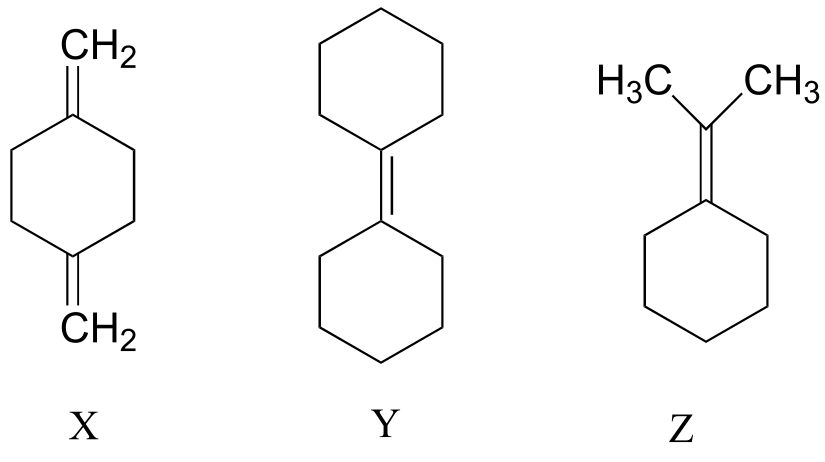

**P4.6:** A 0.725 mL aqueous solution of NADH shows an absorbance at 340
nm of A = 0.257. Express (in nanomole (nm) units) how much NADH is
contained in the sample.

**P4.7:** A 1 mL enzymatic reaction mixture contains NADH as one of the
reactants, and has a starting A340 = 0.345. After the
reaction is allowed to run for five minutes, the researcher records a
value of A340 = 0.125. How many nm of NADH are used up per
minute, on average, in this reaction?

**P4.8:** The reaction below is of a type that we will study in Chapter
11. While the two starting materials are only slightly colored, the
product is an intense orange-red. Account for this observation.

**P4.9:** Which would be more useful in distinguishing the two compounds
shown below: IR or UV spectroscopy? Explain.

**P4.10:** Which analytical technique – IR, UV, or MS - could best be
used to distinguish between the two compounds below? Explain.

**P4.11:** One would expect the mass spectrum of cyclohexanone to show a
molecular ion peak at m/z = 98. However, the m/z = 98 peak in the
cyclohexanone spectrum is unusually abundant, compared to the molecular
ion peaks in the mass spectra of other ketones such as 2-hexanone or
3-hexanone. Explain.

# 5: Structure determination, part II: Nuclear magnetic resonance spectroscopy

revise: add

(credit: https://www.flickr.com/photos/reighleblanc/)

One morning in a suburb of Edinburgh, Scotland, an active, athletic
teenager named Charli found that she did not have her usual appetite for
breakfast. She figured she was just feeling a little under the weather,
and was not to worried. But as the days passed, her appetite did not
return. Before long, she stopped eating lunch as well, and eventually
she was hardly eating anything at all. She had to withdraw from her
soccer team because she didn't have enough energy to make it through the
practices. When her weight began to drop alarmingly and she began to
suffer from crippling headaches, her parents took her to her doctor, who
diagnosed a glandular disorder.

To make things worse, Charli started getting teased at her school,
enduring constant comments from other kids about her weight loss and
gossip about an eating disorder. Almost two years went by, filled with
doctors visits and various diagnoses and treatments, none of which were
effective.

Finally, on a September day when Charli was fifteen, things came to a
head. She was rushed to the hospital after suffering a massive stroke.
Once she was stabilized, her doctors ordered an MRI scan of her brain.
The images showed that she had a large tumor in her brain – it was
benign, but its sheer size and the pressure it exerted had been enough
to cause the devastating symptoms that Charli had been suffering for the
past year and a half. Her doctors told her that if the tumor had not
been detected, it could eventually have been fatal. After enduring an
8-hour brain surgery, Charli finally was able to start down her road to
recovery. Speaking later to a journalist, Charli said of her stroke, “it
was the best thing that ever happened to me”.

\*\*\*

In Austin, Texas, a 28 year-old man named Alex was fed up with the back
pain he had been suffering, the result, he assumed, of the damage from
some old sports injuries catching up to him. His friend John, who was a
radiological technician, convinced him to come in for an MRI scan on the
chance that doctors might be able to spot something that could lead to a
treatment. Alex agreed, and took a day off work to come in to his
friend's clinic. With John at the controls, Alex tried to relax as he
was slowly rolled into the claustrophobic MRI chamber. After finishing
the scan of his friend's back and saving the images, John decided to ask
a little favor. He had just installed some new software for head scans
and needed to test it out on an actual subject, so he asked Alex if he
would mind lying still for just a few minutes more so that he could take
a test scan of his head. Unlike x-rays and CAT scans, the MRI procedure
does not subject patients to potentially harmful radiation - just strong
but harmless magnetic fields combined with radio waves – so there was no
risk to undergoing an unnecessary scan. Alex agreed, and John proceeded
with the test scan.

When the first image appeared, John was alarmed by what he saw. The new
software was working just fine, but there was an ominous-looking lump
behind Alex's right eye that should not have been there. Not wanted to
scare his friend unduly, he merely mentioned that he thought he might
have seen something that should be checked out by a neurologist. Alex
was feeling fine other than the back pain – no headaches, blurred
vision, or dizziness, so it was probably nothing at all to worry about.

It turned out that Alex had a golf ball-sized brain tumor. His
neurologist told him that because it happened to be located in an area
of the brain that was not responsible for any critical functions, he was
not yet experiencing any symptoms. But if the tumor had remained
undetected for a few more years, it would have continued to grow and
begun to press on other areas of Alex's brain - and at that point, it
probably would have been very difficult to remove safely.

Alex underwent a successful surgery to remove the tumor and was able to
go on with his life, thanks to having an observant friend in the right
place at the right time, with access to a powerful diagnostic
technology.

\*\*\*

The common denominator in these two stories – and in countless others
from around the world – is the power of MRI to detect hidden but deadly
medical problems, without causing any harm or pain to the patient. In
this chapter, we are going to learn about an analytical tool used by
organic chemists called nuclear magnetic resonance (NMR) spectroscopy,
which works by the same principles as an MRI scanner in a hospital.
While doctors use MRI peer inside the human body, we will see how NMR
allows chemists to piece together, atom by atom and bond by bond, the
structure of an organic molecule.

## Section 5.1: The source of the NMR signal

### 5.1A: The magnetic moment

Nuclear magnetic resonance spectroscopy is an incredibly powerful tool
for organic chemists because it allows us to analyze the connectivity of
carbon and hydrogen atoms in molecules. The basis for NMR is the
observation that many atomic nuclei generate their own magnetic field,
or **magnetic moment**, as they spin about their axes. Not all nuclei
have a magnetic moment. Fortunately for organic chemists, though,
hydrogen (1H), the 13C isotope of carbon, the
19F isotope of fluorine, and the 31P isotope of
phosphorus all have magnetic moments and therefore can be observed by
NMR – they are, in other words, NMR-active. Other nuclei - such as the
common 12C and 16O isotopes of carbon and oxygen -
do not have magnetic moments, and cannot be directly observed by NMR.
Still other nuclei such as the hydrogen isotope deuterium
(2H) and nitrogen (14N) have magnetic moments and
are NMR-active, but the nature of their magnetic moments is such that
analysis of these nuclei by NMR is more complex.

In practice it is 1H and 13C nuclei that are most
commonly observed by NMR spectroscopy, and it is on those techniques
that we will focus in this chapter, beginning with 1H-NMR.
The terms ‘proton’ and ‘hydrogen’ are used interchangeably when
discussing because the 1H nucleus is just a single proton.

**Some examples of magnetic and nonmagnetic nuclei relevant**

**to biological organic chemistry**

| **Magnetic nuclei** | **Nonmagnetic nuclei** |
|---------------------|------------------------|
| 1H       | 12C         |
| 2H       | 16O         |
| 13C      | 32S         |
| 14N      |                        |
| 19F      |                        |
| 31P      |                        |

### 5.1B: Spin states and the magnetic transition

When a sample of an organic compound is sitting in a flask on a
laboratory bench, the magnetic moments of all of its protons are
randomly oriented. However, when the same sample is placed within the
field of a very strong superconducting magnet (this field is referred to
by NMR spectroscopists as the **applied field**, abbreviated
**B0** ) each proton will assume one of two possible
**quantum** **spin states**. In the +½ spin state, the proton's magnetic
moment is aligned *with* the direction of B0, while in the -½
spin state it is aligned *opposed to* the direction of B0.

fig 1

The +½ spin state is slightly lower in energy than the -½ state, and the
energy gap between them, which we will call ∆E, depends upon the
strength of B0: a stronger applied field results in a larger
∆E. For a large population of organic molecules in an applied field,
slightly *more* than half of the protons will occupy the lower energy +½
spin state, while slightly *less* than half will occupy the higher
energy -½ spin state. It is this population difference (between the two
spin states) that is exploited by NMR, and the difference increases with
the strength of the applied magnetic field.

At this point, we need to look a little more closely at how a proton
spins in an applied magnetic field. You may recall playing with spinning
tops as a child. When a top slows down a little and the spin axis is no
longer completely vertical, it begins to exhibit **precessional
motion**, as the spin axis rotates slowly around the vertical. In the
same way, hydrogen atoms spinning in an applied magnetic field also
exhibit precessional motion about a vertical axis. It is this axis
(which is either parallel or antiparallel to B0) that defines
the proton’s magnetic moment.

Watch the first minute or so of this [video of spinning
tops](https://www.youtube.com/watch?v=uf-UFu-lACY):

look for the precessional motion

The **frequency of precession** (also called the **Larmour frequency,**
abbreviated νL) is simply the number of times per second that
the proton precesses in a complete circle. A　proton\`s precessional
frequency increases with the strength of B0.

If a proton that is precessing in an applied magnetic field is exposed
to electromagnetic radiation of a frequency ν that matches its
precessional frequency νL, we have a condition called
**resonance**. *In the resonance condition, a proton in the lower-energy
+½ spin state (aligned with B0) will transition (flip) to the
higher energy –½ spin state (opposed to B0). In doing so, it
will absorb radiation at this resonance frequency ν* - *and this
frequency corresponds to ∆E, the energy difference between the proton’s
two spin states*. With the strong magnetic fields generated by the
superconducting magnets used in modern NMR instruments, the resonance
frequency for protons falls within the radio-wave range, anywhere from
100 MHz to 800 MHz depending on the strength of the magnet.

fig 2

Think back for a moment to the other two spectroscopic techniques we
have learned about: IR and UV-Vis spectroscopy. Recall from section 4.2
that photons of electromagnetic radiation of a given frequency
correspond to energy (E) given by E = *h*ν, where *h* is Plank's
constant and ν is the frequency in waves per second, or Hz. Recall also
from section 4.3 that the energy gap between *vibrational* states
corresponds to the energy associated with infrared radiation, and from
section 4.4 that the energy gap between *electronic* states in
conjugated π-bonding systems corresponds to the energy associated with
light in the ultraviolet and visible regions of the electromagnetic
spectrum. Now, we know that in NMR, the energy gap ∆E between the +½ and
-½ *spin* states of an atomic nucleus in a strong magnetic field
corresponds to the energy associated with radiation in the radio
frequency (Rf) region of the spectrum.

By detecting the frequency of Rf radiation that is absorbed, we can gain
information about the chemical environment of protons in an organic
molecule.

<u>Exercise 5.1</u>: In a general sense, how big is the energy gap for
the nuclear spin transition observed in NMR compared to the energy gap
for the vibrational transition observed in IR spectroscopy? Much bigger?
Much smaller? Slightly bigger or smaller? About the same? How can you
tell from the information presented in this section?

## Section 5.2: Chemical equivalence

The frequency of radiation absorbed by a proton (or any other nucleus)
during a spin transition in an NMR experiment is called its '**resonance
frequency**'. If all protons in all organic molecules had the same
resonance frequency, NMR spectroscopy but would not be terribly useful
for chemists. Fortunately for us, however, resonance frequencies are not
uniform for different protons in a molecule - rather, the resonance
frequency varies according to the electronic environment that a given
proton inhabits. In methyl acetate, for example, there are two distinct
‘sets’ of protons.

fig 3

The three methyl acetate protons labeled Ha above have a
different resonance frequency compared to the three Hb
protons, because the two sets of protons are in non-identical electronic
environments: the Ha protons are on a carbon next to a
carbonyl carbon, while the Hb protons or on a carbon next to
the an oxygen. In the terminology of NMR, all three Ha
protons are **chemically equivalent** to each other, as are all three
Hb protons. The Ha protons are, however,
**chemically nonequivalent** to the Hb protons. As a
consequence, the resonance frequency of the Ha protons is
different from that of the Hb protons. For now, do not worry
about *why* the different electronic environment gives rise to different
resonance frequencies - we will get to that soon.

The ability to recognize chemical equivalancy and nonequivalency among
atoms in a molecule will be central to understanding NMR. Each of the
molecules below contains only one set of chemically equivalent protons:
all six protons on benzene, for example, are equivalent to each other
and have the same resonance frequency in an NMR experiment. Notice that
any description of the bonding and position of one proton in benzene
applies to all five other protons as well.

fig 4

Each of the molecules in the next figure contains *two* sets of
chemically equivalent protons, just like our previous example of methyl
acetate, and again in each case the resonance frequency of the
Ha protons will be different from that of the Hb
protons.

fig 5

Take acetaldehyde as an example: a description of the bonding and
position of the Hb proton does *not* apply to the three
Ha protons: Hb is bonded to an
*sp2-*hybridized carbonyl carbon while the Ha
protons are bonded to an *sp3*-hybridized methyl carbon.

Note that while all four aromatic protons in 1,4-dimethylbenzene are
chemically equivalent, its constitutional isomer 1,2 dimethylbenzene has
*two* sets of aromatic protons in addition to the six methyl
(Ha) protons. The 1,3-substituted isomer, on the other hand,
has *three* sets of aromatic protons.

fig 5b

In 1,2-dimethylbenzene, both Hb protons are adjacent to a
methyl substituent, while both Hc protons are two carbons
away. In 1,3-dimethylbenzene, Hb is situated between two
methyl groups, the two Hc protons are one carbon away from a
methyl group, and Hd is two carbons away from a methyl group.

As you have probably already realized, chemical equivalence or
non-equivalence in NMR is closely related to *symmetry*. Different
planes of symmetry in the three isomers of dimethylbenzene lead to
different patterns of equivalence.

Stereochemistry can play a part in determining equivalence or
nonequivalence of nuclei in NMR. In the chloroethene (commonly known as
vinyl chloride, the compound used to make polyvinyl chloride or PVC),
Ha and Hb are in nonequivalent electronic
environments, because Ha is *cis* to the chlorine atom while
Hb is *trans*. Likewise, Ha and Hb in
chlorocyclopropane are nonequivalent due to their positions either on
the same or opposite side of the ring relative to chlorine.

fig 5a

**<u>Note</u>**: If you think back to our discussion of prochirality in
section 3.11, you should recognize that the Ha and
Hb protons in the examples above are diastereotopic pairs. In
fact, *all* diastereotopic protons are technically non-equivalent in
terms of their chemical shift in an NMR experiment. For example, the
*pro-R* and *pro-S* protons in (R)-2-butanol (below) are diastereotopic,
and for reasons that are beyond the scope of our discussion here, it
turns out that they are in slightly different electronic environments,
and thus have slightly different chemical shifts - they are chemically
*non*-equivalent.

However, in actual practice, the difference in chemical shift between
two diastereotopic protons such as these - bonded to the same
sp3-hybridized carbon and *not* part of a ring - is usually
so small that they *appear* to be equivalent. There are exceptions, of
course, but for the sake of simplicity, in this book we will consider
such protons to be chemically equivalent. The chemical non-equivalence
of diastereotopic protons usually only becomes pronounced when they are
bonded to alkene or ring carbons, as in the previous examples.

Most organic molecules have several sets of protons in different
chemical environments, and each set will have a different resonance
frequency in 1H-NMR spectroscopy. Below we see some examples
of multiple sets of protons in biological molecules.

fig 6

*(Note that protons Ha and Hb in isopentenyl diphosphate, and Hg and Hi
in serotonin are all pairs of diastereotopic protons, but for the reason
discussed in the shaded box above we are considering them to be
chemically equivalent. We **do** consider the diastereotopic protons Hc
and Hd in isopentenyl diphosphate, however, to be chemically
nonequivalent.)*

<u>Exercise 5.2:</u> How many sets of equivalent protons do the
following molecules contain?

>  style="width:4.91667in;height:3.29653in" />
>
> fig 7

## Section 5.3: The 1H-NMR experiment

In an NMR experiment, a sample compound (we'll again use methyl acetate
as our example) is placed inside a very strong applied magnetic field
(B0) generated by a superconducting magnet in the instrument.
(The magnetic fields generated by modern NMR instruments are strong
enough that users must take care to avoid carrying any magnetics objects
anywhere near them. They are also notorious for erasing the magnetic
strips on credit cards!)

fig 3

At first, the magnetic moments of (slightly more than) half of the
protons in the sample are aligned with B0, and half are
aligned against B0. Then, the sample is exposed to a range of
radio frequencies. Out of all of the frequencies which hit the sample,
only two - the resonance frequencies for Ha and
Hb - are absorbed, causing those protons which are aligned
*with* B0 to 'spin flip' so that they align themselves
*against* B0. When the 'flipped' protons flip back down to
their ground state, they emit energy, again in the form of
radio-frequency radiation. The NMR instrument detects and records the
frequency and intensity of this radiation, making using of a
mathematical technique known as a 'Fourier Transform'.

*Note*: the above description of an NMR experiment is an
oversimplification of what is happening in a modern NMR instrument, but
is adequate for our purpose here. If you take a more advanced course in
molecular spectroscopy you will learn about the process is much greater
detail.

In most cases, a sample being analyzed by NMR is in solution. If we use
a common laboratory solvent (diethyl ether, acetone, dichloromethane,
ethanol, water, etc.) to dissolve our NMR sample, however, we run into a
problem – there many more solvent protons in solution than there are
sample protons, so the signals from the sample protons will be
overwhelmed. To get around this problem, we use special NMR solvents in
which all protons have been replaced by deuterium. Deuterium is
NMR-active, but its resonance frequency is far outside of the range in
which protons absorb, so it is \`invisible\` in 1H-NMR. Some
common NMR solvents are shown below.

<u>Common NMR solvents</u>

fig 8

Let's look at an actual 1H-NMR spectrum for methyl acetate.
Just as in IR and UV-vis spectroscopy, the vertical axis corresponds to
intensity of absorbance, the horizontal axis to frequency. However, you
will notice right away that a) there is no *y*-axis line or units drawn
in the figure, and b) the *x*-axis units are not Hz, which you would
expect for a frequency scale. Both of these mysteries will become clear
very soon.

The 1H-NMR spectrum of methyl acetate

ig 9

We see three absorbance signals: two of these correspond to
Ha and Hb (don't worry yet which is which), while
the peak at the far right of the spectrum corresponds to the 12
chemically equivalent protons in tetramethylsilane (**TMS**), a standard
reference compound that was added to our sample.

First, let's talk about the *x*-axis. The **'ppm'** label stands for
'parts per million', and simply tells us that the two sets of equivalent
protons in our methyl acetate sample have resonance frequencies about
2.0 and 3.6 parts per million higher than the resonance frequency of the
TMS protons, which we are using as our reference standard. This is
referred to as their **chemical shift**.

The reason for using a relative value (chemical shift expressed in ppm)
rather than the actual resonance frequency (expressed in Hz) is that
every NMR instrument will have a different magnetic field strength, so
the actual value of resonance frequencies expressed in Hz will be
different on different instruments - remember that ∆E for the magnetic
transition of a nucleus depends upon the strength of the externally
applied magnetic field. However, the resonance frequency values
*relative to the TMS standard* will always be the same, regardless of
the strength of the applied field. For example, if the resonance
frequency for the TMS protons in a given NMR instrument is exactly 300
MHz (300 million Hz), then a chemical shift of 2.0 ppm corresponds to an
actual resonance frequency of 300,000,600 Hz (2 parts per million of 300
million is 600). In another instrument (with a stronger magnet) where
the resonance frequency for TMS protons is 400 MHz, a chemical shift of
2.0 ppm corresponds to a resonance frequency of 400,000,800 Hz.

A frequently used symbolic designation for chemical shift in ppm is the
lower-case Greek letter δ (*delta*). Most protons in organic compounds
have chemical shift values between 0 and 10 ppm relative to TMS,
although values below 0 ppm and up to 12 ppm and above are occasionally
observed. By convention, the left-hand side of an NMR spectrum (higher
chemical shift) is called **downfield**, and the right-hand direction is
called **upfield**.

In modern research-grade NMR instruments, it is no longer necessary to
actually add TMS to the sample: the computer simply calculates where the
TMS signal *should* be, based on resonance frequencies of the solvent.
So, from now on you will not see a TMS peak on NMR spectra - but the 0
ppm point on the *x*-axis will always be defined as the resonance
frequency of TMS protons.

**A Chemical Shift Analogy**

If you are having trouble understanding the concept of chemical shift
and why it is used in NMR, try this analogy: imagine that you have a job
where you travel frequently to various planets, each of which has a
different gravitational field strength. Although your body mass remains
constant, your measured weight is variable - the same scale may show
that you weigh 60 kg on one planet, and 75 kg on another. You want to be
able to keep track your body mass in a meaningful, reproducible way, so
you choose an object to use as a standard: a heavy iron bar, for
example. You record the weight of the iron bar and yourself on your home
planet, and find that the iron bar weighs 50 kg and you weigh 60 kg. You
are 20 percent (or pph, parts per hundred) heavier than the bar. The
next day you travel (with the iron bar in your suitcase) to another
planet and find that the bar weighs 62.5 kg, and you weigh 75 kg.
Although your measured weight is different, you are still 20% heavier
than the bar: you have a 'weight shift' of 20 pph relative to the iron
bar, no matter what planet you are on.

<u>Exercise 5.3:</u>

a\) What is the chemical shift, *expressed in Hz*, of proton signals at
2.0 ppm and 3.6 ppm for an NMR instrument in which the TMS protons have
a resonance frequency of exactly 500 MHz?

b\) What is the *actual resonance frequency* (in Hz) of these two
protons in that same instrument?

We have already pointed out that, on our spectrum of methyl acetate,
there is there is no *y*-axis scale indicated. With *y*-axis data it is
*relative* values, rather than absolute values, that are important in
NMR. The computer in an NMR instrument can be instructed to
mathematically integrate the area under a signal or group of signals.
The **signal integration** process is very useful, because *in
1H-NMR spectroscopy the area under a signal is proportional
to the number of protons to which the signal corresponds*. When we
instruct the computer to integrate the areas under the Ha and
Hb signals in our methyl acetate spectrum, we find that they
have approximately the same area. This makes sense, because each signal
corresponds to a set of *three* equivalent protons.

Be careful not to assume that you can correlate apparent peak *height*
to number of protons - depending on the spectrum, relative peak heights
will not always be the same as relative peak *areas*, and it is the
relative areas that are meaningful. Because it is difficult to compare
relative peak area by eye, we rely on the instrument's computer to do
the calculations.

Take a look next at the spectrum of 1,4-dimethylbenzene:

fig 10

As we discussed earlier, this molecule has two sets of equivalent
protons: the six methyl (Ha) protons and the four aromatic
(Hb) protons. When we instruct the instrument to integrate
the areas under the two signals, we find that the area under the peak at
2.6 ppm is 1.5 times greater than the area under the peak at 7.4 ppm.
The ratio 1.5 to 1 is of course the same as the ratio 6 to 4. This
integration information (along with the actual chemical shift values,
which we'll discuss soon) tells us that the peak at 7.4 ppm must
correspond to Hb, and the peak at 2.6 ppm to Ha.

The integration function can also be used to determine the relative
amounts of two or more compounds in a *mixed* sample. If we take a
1H-NMR spectrum of a sample that is a equimolar mixture of
benzene and acetone, for example, we will see two signals, one for the
six equivalent acetone protons and one for the six equivalent benzene
protons. The integrated area under the acetone signal will be the same
as the area under the benzene sample, because both signals represent six
protons. If we have an equimolar mixture of acetone and cyclopentane, on
the other hand, the ratio of the acetone peak area to the cylopentane
peak area will be 3:5 (or 6:10), because the cyclopentane signal
represents ten protons.

<u>Exercise 5.4</u>: You take a 1H-NMR spectrum of a mixed
sample of acetone and dichloromethane. The integral ratio of the two
signals (acetone to dichloromethane) is 2.3 to 1. What is the molar
ratio of the two compounds in the sample?

<u>Exercise 5.5</u>: You take the 1H-NMR spectrum of a mixed
sample of 36% 1,4-dimethylbenzene and 64% acetone (these are mole
percentages). What is the expected integration ratio of the signals that
you would observe? Order the ratio from highest to lowest numbers.

## Section 5.4: The basis for differences in chemical shift 

### 5.4A: Diamagnetic shielding and deshielding

We come now to the question of *why* nonequivalent protons have
different resonance frequencies and thus different chemical shifts. The
chemical shift of a given proton is determined primarily by interactions
with the nearby electrons. The most important thing to understand is
that *when electrons are subjected to an external magnetic field, they
form their own small **induced magnetic fields** in [opposition to the
external
field](http://teaching.shu.ac.uk/hwb/chemistry/tutorials/molspec/espin.gif).*

Consider the methane molecule (CH4) in which the four
equivalent protons have a chemical shift of 0.23 ppm (this is a value we
can look up in any chemistry reference source). The valence electrons
around the methyl carbon, when subjected to B0, generate
their own very small induced magnetic field that opposes B0.
This induced field, to a small but significant degree, *shields* the
nearby protons from experiencing the full force of B0, an
effect known as **local diamagnetic shielding**. In other words, the
methane protons do not quite experience the full force of
B0 - what they experience is called **Beff**, or
the **effective field**, which is slightly *weaker* than B0
due to the influence of the nearby electrons.

fig 11

Because Beff is slightly weaker than B0, the
resonance frequency (and thus the chemical shift) of the methane proton
is slightly lower than what it would be if it did not have electrons
nearby and was feeling the full force of B0. (You should note
that the figure above is not to scale: the applied field is generated by
a superconducting magnet and is *extremely* strong, while the opposing
induced field from the electrons is comparatively very small.)

Now consider methyl fluoride, CH3F, in which the protons have
a chemical shift of 4.26 ppm, significantly higher than that of methane.
This is caused by something called the **deshielding effect**. Recall
that fluorine is very electronegative: it pulls electrons towards
itself, effectively *decreasing* the electron density around each of the
protons. For the protons, being in a lower electron density environment
means less diamagnetic shielding, which in turn means a greater overall
exposure to B0, a stronger Beff, and a higher
resonance frequency. Put another way, the fluorine, by pulling electron
density away from the protons, is *deshielding* them, leaving them more
exposed to B0. As the electronegativity of the substituent
increases, so does the extent of deshielding, and so does the chemical
shift. This is evident when we look at the chemical shifts of methane
and three halomethane compounds (remember that electronegativity
increases as we move up a column in the periodic table, so flourine is
the most electronegative and bromine the least).

fig 12

To a large extent, then, we can predict trends in chemical shift by
considering how much deshielding is taking place near a proton. The
chemical shift of trichloromethane (common name chloroform) is, as
expected, higher than that of dichloromethane, which is in turn higher
than that of chloromethane.

fig 13

The deshielding effect of an electronegative substituent diminishes
sharply with increasing distance:

fig 14

The presence of an electronegative oxygen, nitrogen, sulfur, or
*sp*2-hybridized carbon also tends to shift the NMR signals
of nearby protons slightly downfield:

fig 15

Now we can finally assign the two peaks in the the 1H-NMR
spectrum of methyl acetate. We can predict that the methyl ester protons
(Hb), which are deshielded by the adjacent oxygen atom, will
have a higher chemical shift than the acetate protons (Ha),
which are deshielded to a lesser extent by the carbonyl group.
Therefore, the signal at 3.7 must correspond to Hb, and the
signal at 2.0 to Ha.

fig 16

### 5.4B: Diamagnetic anisotropy

Vinylic protons (those directly bonded to an alkene carbon) and aromatic
protons resonate much further downfield than can be accounted for simply
by the deshielding effect of nearby electronegative atoms. Note the
chemical shifts of the vinylic and aromatic protons in cyclohexene and
benzene:

fig 17

We'll consider the aromatic proton first. Recall that in benzene and
many other aromatic structures, a sextet of π electrons is delocalized
around the ring. When the molecule is exposed to B0, these π
electrons begin to circulate in a **ring current**, generating their own
induced magnetic field that opposes B0. In this case,
however, the induced field of the π electrons does not shield the
aromatic protons from B0 as you might expect– rather, it
causes the protons to experience a *stronger* magnetic field in the
direction of B0 – in other words, it *adds* to B0
rather than subtracting from it.

To understand how this happens, we need to understand the concept of
**diamagnetic anisotropy** (anisotropy means \`non-uniformity\`). So
far, we have been picturing magnetic fields as being oriented in a
uniform direction. This is only true over a small area. If we step back
and take a wider view, however, we see that the lines of force in a
magnetic field are actually anisotropic. They start in the 'north'
direction, then loop around like a snake biting its own tail.

fig 18

If we are at point A in the figure above, we feel a magnetic field
pointing in a northerly direction. If we are at point B, however, we
feel a field pointing to the south.

In the induced field generated by the aromatic ring current, the
aromatic protons are at the equivalent of ‘point B’ – this means that
the induced current in this region of space is oriented in the *same*
direction as B0, so it *adds* to B0 rather than
subtracting from it.

[another
image](https://image.slidesharecdn.com/nuclearmagneticresonance-protonnmr-130126001343-phpapp02/95/nuclear-magnetic-resonance-proton-nmr-62-638.jpg?cb=1359159618)

fig 19

The end result is that aromatic protons, due to the anisotropy of the
induced field generated by the π ring current, appear to be highly
deshielded. Their chemical shift is far downfield, in the 6.5-8 ppm
region.

Diamagnetic anisotropy is also responsible for the downfield chemical
shifts of vinylic protons (4.5-6.5 ppm) and aldehyde protons (9-10 ppm).
These groups are not aromatic and thus do not generate ring currents
does benzene, but the π electrons circulate in such a way as to generate
a magnetic field that *adds* to B0 in the regions of space
occupied by the protons. Carboxylic acid protons are very far downfield
(10-12 ppm) due to the combined influence of the electronegative oxygen
atom and the nearby π bond.

### 5.4C: Hydrogen bonded protons

Protons that are directly bonded to oxygen or nitrogen have chemical
shifts that can vary widely depending on solvent and concentration.
These protons can participate to varying degrees in hydrogen bonding
interactions, and the degree hydrogen bonding greatly influences the
electron density around the proton - and thus the chemical shift.
Signals for hydrogen bonding protons also tend to be *broader* than
those of hydrogens bonded to carbon, a phenomenon that is also due to
hydrogen bonding.

Alcohol protons, for example, will usually show broad signals anywhere
between 1-5 ppm. The signal for Ha in the spectrum of
1-heptanol is a typical example of a broadened NMR signal for an alcohol
proton.

fig 19a

The table below provides a summary of approximate chemical shift ranges
for protons in different bonding arrangements. A more detailed table can
be found in the appendix.

**Typical chemical shift ranges in 1H-NMR**

| **type of proton**                | **chemical shift range (ppm)** |
|-----------------------------------|--------------------------------|
| bonded to *sp3* carbon | 0.5 - 4                        |
| bonded to N (amine)               | 1 - 3                          |
| bonded to O (alcohol)             | 1 - 5                          |
| alkene/ vinylic                   | 3.5 - 6.5                      |
| terminal alkyne                   | 2 - 3                          |
| bonded to N (amide)               | 5 - 9                          |
| aromatic                          | 6 - 9                          |
| aldehyde                          | 9.5 - 10                       |
| carboxylic acid                   | 10 - 13                        |

<u>Exercise 5.6</u>: For each pair of protons colored red
(Ha) and blue (Hb) in the structures below, state
which is expected to have the *higher* chemical shift in
1H-NMR. For some of these it will be helpful to consult Table
2 at the back of the book.

fig 16a

<u>Exercise 5.7</u>: The 1H-NMR spectrum of the aromatic
compound \[18\] annulene has two peaks, at 8.9 ppm and -1.8 ppm (a
*negative* chemical shift, upfield of TMS!) with an integration ratio of
2:1. Explain the unusual chemical shift of the latter peak.

>  style="width:1.29653in;height:1.61111in" />

## Section 5.5: Spin-spin coupling

The 1H-NMR spectra that we have seen so far (of methyl
acetate and 1,4-dimethylbenzene) are somewhat unusual in the sense that
in both of these molecules, each set of protons generates a single NMR
signal. In fact, the 1H-NMR spectra of most organic molecules
contain proton signals that are 'split' into two or more sub-peaks.
Rather than being a complication, however, this splitting behavior is
actually very useful because it provides us with more information about
our sample molecule.

Consider the spectrum for 1,1,2-trichloroethane. In this and in many
spectra to follow, we show enlargements of individual signals so that
the signal splitting patterns are recognizable.

fig 20

The signal at 3.96 ppm, corresponding to the two Ha protons,
is split into two subpeaks of equal height (and area) – this is referred
to as a **doublet**. The Hb signal at 5.76 ppm, on the other
hand, is split into three sub-peaks, with the middle peak higher than
the two outside peaks - if we were to integrate each subpeak, we would
see that the area under the middle peak is twice that of each of the
outside peaks. This is called a **triplet**.

The source of signal splitting is a phenomenon called **spin-spin
coupling**, a term that describes the magnetic interactions between
neighboring, non-equivalent NMR-active nuclei. (The terms 'splitting'
and 'coupling' are often used interchangeably when discussing NMR.) In
our 1,1,2 trichloromethane example, the Ha and Hb
protons are spin-coupled to each other. Here's how it works, looking
first at the Ha signal: in addition to being shielded by
nearby valence electrons, each of the Ha protons is also
influenced by the small magnetic field generated by Hb next
door (remember, each spinning proton is like a tiny magnet). The
magnetic moment of Hb will be aligned *with* B0 in
slightly more than half of the molecules in the sample, while in the
remaining molecules it will be opposed to B0. The
Beff ‘felt’ by Ha is a slightly weaker if
Hb is aligned against B0, or slightly stronger if
Hb is aligned with B0. In other words, in half of
the molecules Ha is *shielded* by Hb (thus the NMR
signal is shifted slightly upfield) and in the other half Ha
is *deshielded* by Hb (and the NMR signal shifted slightly
downfield). What would otherwise be a single Ha peak has been
split into two sub-peaks (a doublet), one upfield and one downfield of
the original signal. These ideas an be illustrated by a **splitting
diagram**, as shown below.

fig 21

Now, let's think about the Hb signal. The magnetic
environment experienced by Hb is influenced by the fields of
both neighboring Ha protons, which we will call
Ha1 and Ha2. There are four possibilities here,
each of which is equally probable. First, the magnetic fields of both
Ha1 and Ha2 could be aligned with B0,
which would deshield Hb, shifting its NMR signal slightly
downfield. Second, both the Ha1 and Ha2 magnetic
fields could be aligned opposed to B0, which would shield
Hb, shifting its resonance signal slightly upfield. Third and
fourth, Ha1 could be with B0 and Ha2
opposed, or Ha1 opposed to B0 and Ha2
with B0. In each of the last two cases, the shielding effect
of one Ha proton would cancel the deshielding effect of the
other, and the chemical shift of Hb would be unchanged.

fig 22

So in the end, the signal for Hb is a **triplet**, with the
middle peak twice as large as the two outer peaks because there are
*two* ways that Ha1 and Ha2 can cancel each other
out.

Consider the spectrum for ethyl acetate:

fig 23

We see an unsplit **'singlet'** peak at 1.83 ppm that corresponds to the
acetyl (Ha) protons – this is similar to the signal for the
acetate protons in methyl acetate that we considered earlier. This
signal is unsplit because there are no adjacent protons on the molecule.
The signal at 1.06 ppm for the Hc protons is split into a
triplet by the two Hb protons next door. The explanation here
is the same as the explanation for the triplet peak we saw previously
for 1,1,2-trichloroethane.

The Hb protons give rise to a **quartet** signal at 3.92 ppm
– notice that the two middle peaks are taller then the two outside
peaks. This splitting pattern results from the spin-coupling effect of
the *three* adjacent Hc protons, and can be explained by an
analysis similar to that which we used to explain the doublet and
triplet patterns.

<u>Exercise 5.8</u>:

a\) Explain, using a splitting diagram, the possible combinations of
nuclear spin states for the Hc protons in ethyl acetate, and
why the Hb signal is split into a quartet.

b\) The integration ratio of the two 'sub-peaks' in a doublet is 1:1,
and in triplets it is 1:2:1. What is the integration ratio of the
Hb quartet in ethyl acetate? (Hint – use the illustration
that you drew in part a to answer this question.)

By now, you probably have recognized the pattern which is usually
referred to as the ***n* + 1 rule**: if a set of protons has *n*
neighboring, non-equivalent protons, it will be split into *n* + 1
subpeaks. Thus the two Hb protons in ethyl acetate split the
Hc signal into a triplet, and the three Hc protons
split the Hb signal into a quartet. Ha, with zero
neighboring protons, is a singlet. This is very useful information if we
are trying to determine the structure of an unknown molecule: if we see
a triplet signal, we know that the corresponding proton or set of
protons has two \`neighbors\`. When we begin to determine structures of
unknown compounds using 1H-NMR spectral data, it will become
more apparent how this kind of information can be used.

Four important points need to be emphasized at this point.

First, signal splitting only occurs between non-equivalent protons – in
other words, Ha1 in 1,1,2-trichloroethane is *not* split by
Ha2, and vice-versa.

fig 24

Second, splitting occurs primarily between protons that are separated by
three or fewer bonds. This is why the Ha protons in ethyl
acetate form a singlet– the nearest proton neighbors are five bonds
away, too far for coupling to occur.

fig 25

With more sensitive instruments we will sometimes see 4-bond and even
5-bond splitting, but in our treatment of NMR, for the sake of
simplicity we will always assume that only three-bond splitting is seen.

Third, protons that are bonded to oxygen or nitrogen generally do not
split - and are not split by - adjacent protons. OH and NH protons are
acidic enough to rapidly exchange between different molecules, so the
neighboring protons never actually 'feels' their influence.

The spectrum of 1-heptanol has a characteristically broad alcohol proton
signal at 3.7 ppm (labeled Ha below).

fig 31

Notice in this spectrum that Hb is a triplet, coupled to the
two Hc protons but *not* coupled to Ha. The
signals corresponding to Hc through Hh are complex
due to overlapping - when this happens (as it often does!), detailed
analysis becomes more challenging.

Below are a few more examples of chemical shift and splitting pattern
information for some relatively simple organic molecules.

<u>Exercise 5.9</u>: How many proton signals would you expect to see in
the 1H-NMR spectrum of triclosan (a common antimicrobial
agent in soap)? For each of the proton signals, predict the splitting
pattern, assuming that you can see only 3-bond splitting.

fig 27

<u>Exercise 5.10:</u> How many proton signals would you expect to see in
the 1H-NMR spectrum of the neurotransmitter serotonin? For
each of the proton signals, predict the splitting pattern, again
assuming only 3-bond splitting.

fig 28

In an ideal world, all NMR spectra would be as easy to interpret as
those we have seen so far: every peak would be separated from the
others, the peak integration would be obvious, and the multiplicity
(singlet, doublet, etc.) would be easy to recognize. The real world,
unfortunately, is not always so pretty: peaks with similar chemical
shifts overlap, making interpretation much more difficult. We have
already seen this is the spectrum of 1-heptanol above. In the spectrum
of methylbenzene, we would expect the signal for Ha to be a
singlet, Hb to be a doublet, and Hc and
Hd to be triplets. Looking at relative integration values for
the four peaks, we would expect to see a 3:2:2:1 ratio.

fig 29

In practice, however, the three aromatic proton sets Hb,
Hc and Hd have very similar chemical shifts so
their signals overlap substantially, and we cannot recognize doublet or
triplet splitting patterns. In this case, we would refer to the aromatic
part of the spectrum as a **multiplet**. We can report the integration
ratio of the Ha peak compared to the combined aromatic peaks
as 3 to 5, or the equivalent 1 to 1.67.

The magnitude of spin-spin coupling can be expressed using the
**coupling constant**, abbreviated with the capital letter J. The
coupling constant is simply the difference, expressed in Hz, between two
adjacent sub-peaks in a split signal, and is a measure of the extent to
which one nucleus 'feels' the magnetic dipole of its neighbor.

For our doublet in the 1,1,2-trichloroethane spectrum, for example, the
two subpeaks are separated by 6.1 Hz, and thus we write
3Ja-b = 6.1 Hz.

fig 31a

The superscript '3' tells us that this is a three-bond coupling
interaction, and the 'a-b' subscript tells us that we are talking about
coupling between Ha and Hb. Unlike the chemical
shift value, ***the coupling constant, expressed in Hz, is the same
regardless of the applied field strength of the NMR magnet***. The
strength of the magnetic moment of a neighboring proton, which is the
source of the spin-spin coupling phenomenon, does *not* depend on the
applied field strength. For this reason, coupling constants are normally
given in Hz, *not* ppm.

When we look closely at the triplet signal in 1,1,2-trichloroethane, we
see that the coupling constant - the 'gap' between subpeaks - is 6.1 Hz,
the same as for the doublet. The coupling constant
3Ja-b quantifies the magnetic interaction between
the Ha and Hb hydrogen sets, and *this interaction
is of the same magnitude in either direction*. In other words, spin-spin
coupling is *reciprocal*: Ha influences Hb to the
same extent that Hb influences Ha.

Coupling constants between proton sets on neighboring
*sp*3-hybridized carbons is typically in the region of 6-8
Hz. Coupling constants for neighboring vinylic protons can range from 0
Hz (no coupling at all) to 18 Hz, depending on the bonding arrangement.

Typical proton-proton coupling constants

fig 31b

For vinylic protons in a *trans* configuration, we see coupling
constants in the range of 3*J* = 11-18 Hz, while *cis*
protons couple in the 3*J* = 5-10 Hz range. The 2-bond
coupling between protons on the same alkene carbon (referred to as
*geminal* protons) is very fine, generally 5 Hz or lower.

Fine coupling (2-3 Hz) is often seen between an aldehyde proton and a
three-bond neighbor.

<u>Exercise 5.11</u>: Give the expected splitting patterns and
approximate coupling constants for the labeled protons in the compound
below.

fig 31f

<u>Presenting NMR data in table format</u>

Information from NMR can be recorded conveniently in a condensed form
without having to reproduce the actual spectrum. For example, the
information from the 1H-NMR specta of ethyl acetate and
methylbenzene (see earlier figures) can be presented in tabular format,
listing the chemical shift, the peak splitting pattern, and the relative
area under peaks (usually, the smallest peak is set to 1). Coupling
constant information is not shown in the example tables below.

**  
**

**1H-NMR spectrum of ethyl acetate:**

| **δ (ppm)** | **splitting** | **integration** |
|-------------|---------------|-----------------|
| 3.92        | q             | 1               |
| 1.83        | s             | 1.5             |
| 1.06        | t             | 1.5             |

**1H-NMR spectrum of methylbenzene**:

| **δ (ppm)** | **splitting** | **integration** |
|-------------|---------------|-----------------|
| 7.45-7.63   | m             | 1.67            |
| 2.64        | s             | 1               |

*(abbreviations: s = singlet, d = doublet, t = triplet, q = quartet, m =
multiplet)*

<u>Exercise 5.12</u>: Match the 1H-NMR spectrum below to its
corresponding compound, and assign all of the signals.

fig 29a

a\) cyclopentanone b) 3-pentanone c) butaldehyde

d\) 2-pentanone e) 4-heptanone f) 1-butene

<u>  
</u>

<u>Exercise 5.13</u>:

a\) Which of the compounds in the previous exercise is expected to have
an 1H-NMR spectrum consisting of two triplets and a sextet?

b\) Which would have a spectrum consisting of two triplets?

c\) Which would have a spectrum that includes a signal above 8 ppm?

<u>Exercise 5.14</u>: Explain how you could distinguish among the
1H-NMR spectra of the three isomers below.

fig 31e

[Video tutorials: proton NMR
spectroscopy](https://www.khanacademy.org/science/organic-chemistry/spectroscopy-jay/proton-nmr/v/introduction-to-proton-nmr)

[Video of an actual NMR
experiment](https://www.youtube.com/watch?v=uNM801B9Y84)

## Section 5.6: 13C-NMR spectroscopy

The 12C isotope of carbon - which accounts for up about 99%
of the carbons in organic molecules - does not have a nuclear magnetic
moment, and thus is NMR-inactive. Fortunately for organic chemists,
however, the 13C isotope, which accounts for most of the
remaining 1% of carbon atoms in nature, has a magnetic dipole moment
just like protons. Most of what we have learned about 1H-NMR
spectroscopy also applies to 13C-NMR, although there are
several important differences.

The magnetic moment of a 13C nucleus is much weaker than that
of a proton, meaning that NMR signals from 13C nuclei are
inherently much weaker than proton signals. This, combined with the low
natural abundance of 13C, means that it is much more
difficult to observe carbon signals: more sample is required, and often
the data from hundreds of scans must be averaged in order to bring the
signal-to-noise ratio down to acceptable levels. Unlike
1H-NMR signals, the area under a 13C-NMR signal
cannot easily be used to determine the number of carbons to which it
corresponds. The signals for some types of carbons are inherently weaker
than for other types – peaks corresponding to carbonyl carbons, for
example, are much smaller than those for methyl or methylene
(CH2) peaks. For this reason, peak integration is generally
not useful in 13C-NMR spectroscopy.

The resonance frequencies of 13C nuclei are lower than those
of protons in the same applied field - in an instrument with a 7.05
Tesla magnet, protons resonate at about 300 MHz, while carbons resonate
at about 75 MHz. This is fortunate, as it allows us to look at
13C signals using a completely separate 'window' of radio
frequencies. Just like in 1H-NMR, the standard used in
13C-NMR experiments to define the 0 ppm point is
tetramethylsilane (TMS), although of course in 13C-NMR it is
the signal from the four equivalent *carbons* in TMS that serves as the
standard. Chemical shifts for 13C nuclei in organic molecules
are spread out over a much wider range than for protons – up to 200 ppm
for 13C compared to 10-12 ppm for protons (see Table 3 for a
list of typical 13C-NMR chemical shifts).

The chemical shift of a 13C nucleus is influenced by
essentially the same factors that influence a proton's chemical shift:
bonds to electronegative atoms and diamagnetic anisotropy effects tend
to shift signals downfield (higher resonance frequency). In addition,
sp2 hybridization results in a large downfield shift. The
13C-NMR signals for carbonyl carbons are generally the
furthest downfield (170-220 ppm), due to both sp2
hybridization and to the double bond to oxygen.

<u>Exercise 5.15:</u> How many sets of non-equivalent carbons are there
in each of the molecules shown in exercise 5.2?

<u>Exercise 5.16</u>: How many sets of non-equivalent carbons are there
in:

a\) methylbenzene

b\) 2-pentanone

c\) 1,4-dimethylbenzene

d\) triclosan

*(all structures are shown earlier in this chapter)*

Because of the low natural abundance of 13C nuclei, it is
very unlikely to find two 13C atoms near each other in the
same molecule, and thus *we do not see spin-spin coupling between
neighboring carbons in a 13C-NMR spectrum*. 13C
nuclei are coupled to nearby protons, however, which results in
complicated spectra. For clarity, chemists generally use a technique
called **broadband decoupling**, which essentially 'turns off' C-H
coupling, resulting in a spectrum in which all carbon signals are
singlets. Below is the proton-decoupled 13C-NMR sectrum of
ethyl acetate, showing the expected four signals, one for each of the
carbons. We can also see a signal for the carbon atom in the deuterated
chloroform (CDCl3) solvent (although a detailed discussion is
beyond our scope here, it is interesting to note that this signal is
split into a triplet by deuterium, which is NMR active and has *three*
possible spin states rather than two). We can ignore the solvent signal
when interpreting 13C-NMR spectra.

fig 30

While broadband decoupling results in a much simpler spectrum, useful
information about the presence of neighboring protons is lost. However,
another NMR technique called DEPT (Distortionless Enhancement by
Polarization Transfer) allows us to determine how many hydrogens are
bound to each carbon. This information is usually provided in problems
in which you are asked to interpret the 13C-NMR spectrum of
an unknown compound. (Details of how the DEPT technique works is beyond
the scope of this book, but will be covered if you take a more advanced
course in spectroscopy.)

One of the greatest advantages of 13C-NMR compared to
1H-NMR is the breadth of the spectrum - recall that carbons
resonate from 0-220 ppm relative to the TMS standard, as opposed to only
0-12 ppm for protons. Because of this, 13C signals rarely
overlap, and we can almost always distinguish separate peaks for each
carbon, even in a relatively large compound containing carbons in very
similar environments. In the proton spectrum of 1-heptanol we saw
earlier only the broad singlet of the alcohol proton (Ha) and
the triplet for (Hb) are easily analyzed. The other proton
signals overlap, making analysis difficult. In the 13C
spectrum of the same molecule, however, we can easily distinguish each
carbon signal, and we know from this data that our sample has seven
nonequivalent carbons. (Notice also that, as we would expect, the
chemical shifts of the carbons get progressively lower as they get
farther away from the deshielding oxygen.)

fig 32

This property of 13C-NMR makes it very helpful in the
elucidation of larger, more complex structures.

<u>Exercise 5.17 :</u> Below are 13C-NMR spectra for
methylbenzene (common name toluene) and methyl methacrylate. Match the
spectra to the correct structure, and make peak assignments.

>  style="width:2.46319in;height:1.11111in" />
>
> fig 35
>
> Spectrum A:
>
> 
>
> fig 33
>
> Spetrum B:
>
> 
>
> fig 34

<u>Exercise 5.18</u>: 13C-NMR data for some common
biomolecules are shown below (data is from the Aldrich Library of
1H and 13C NMR). Match the NMR data to the correct
structure, and make complete peak assignments.

spectrum a: 168.10 ppm (C), 159.91 ppm (C), 144.05 ppm (CH), 95.79 ppm
(CH)

spectrum b: 207.85 ppm (C), 172.69 ppm (C), 29.29 ppm (CH3)

spectrum c: 178.54 ppm (C), 53.25 ppm (CH), 18.95 ppm (CH3)

spectrum d: 183.81 ppm (C), 182. 63 ppm (C), 73.06 ppm (CH), 45.35 ppm
(CH2)

fig 36a

**13C-NMR in isotopic labeling studies**

Although only about 1 out of 100 carbon atoms in a naturally occurring
organic molecule is a 13C isotope, chemists are often able to
synthesize molecules that are artificially enriched in 13C at
specific carbon positions. This can be very useful in biochemical
studies, because it allows us to 'label' one or more carbons in a small
precursor molecule and then trace the presence of the 13C
label through a biosynthetic pathway all the way to the final product,
providing insight into how the biosynthesis occurs. For example,
scientists were able to grow bacteria in a medium in which the only
source of carbon was acetate enriched in 13C at the
C1 (carbonyl) position. When they isolated an isoprenoid
compound called amino-bacterio-hopanetriol synthesized by the bacteria
and looked at its 13C-NMR spectrum, they observed that the
13C label from acetate had been incorporated at eight
specific positions. They knew this because the 13C-NMR
signals for these carbons were much stronger compared to the same
signals in a control (unlabeled) compound.

This result was very surprising - the scientists had expected a
completely different pattern of 13C incorporation based on
what they believed to be the isoprenoid biosynthesis pathway involved.
This unexpected result led eventually to the discovery that bacteria
synthesize isoprenoid compounds by a completely different pathway then
yeasts, plants, and animals. The newly discovered bacterial metabolic
pathway is currently a key target for the development of new antibiotic
and antimalaria drugs. ([*Eur. J. Biochem*. **1988**, *175*,
405](https://www.ncbi.nlm.nih.gov/pubmed/3136017)).

fig 44

## Section 5.7: Solving unknown structures 

Now it is finally time to put together all that we have studied about
structure determination techniques and learn how to actually solve the
structure of an organic molecule 'from scratch' - starting, in other
words, with nothing but the raw experimental data. For this exercise, we
will imagine that we have been given a vial containing a pure sample of
an unknown organic compound, and that this compound to our knowledge has
never before been synthesized, isolated, or characterized - we are the
first to get our hands on it. Can we figure out its structure? While of
course the exact method of determining an unknown structure will depend
on the compound in question and, in the real world of research, will
probably involve some techniques that are beyond the scope of this book,
here is an overview of an approach that could be taken to analyze a pure
sample of a relatively simple organic compound, using the techniques we
have learned about.

*Step 1:* *Use MS and combustion analysis to determine the molecular
formula*

Before we start analyzing spectroscopic data, we need one very important
piece of information about our compound - its molecular formula. This
can be determined through the combined use of mass spectrometry and
**combustion analysis**. We will not go into the details of combustion
analysis - for now, it is enough to know that this technique tells us
the mass percent of each element in the compound. Because molecular
oxygen is involved in the combustion reaction, oxygen in the sample is
not measured directly - but we assume that if the mass percentages do
not add up to 100%, the remainder is accounted for by oxygen.

When we obtain our unknown compound, one of the first things we will do
is to send away a small quantity to an analytical company specializing
in combustion analysis. They send us back a report stating that our
compound is composed, by mass, of 52.0% carbon, 38.3% chlorine, and 9.7%
hydrogen. This adds up to 100%, so our compound does not contain any
oxygen atoms.

In order to determined the molecular formula of our compound from this
data, we first need to know its molar mass. This piece of information,
as you recall from chapter 4, we determine by looking at the 'molecular
ion peak' in the mass spectrum of our compound. In this example, we find
that our MS data shows a molecular ion peak at *m/z* = 92, giving us a
molar mass of 92 g/mole (remember that in the MS experiment, charge
(*z*) is almost always equal to 1, because we are looking at +1
cations).

So, one mole of our compound is 92g. How many moles of carbon atoms are
in one mole of the compound? Simple: 52% of 92g is 47.8g. So in one mole
of our compound, there is about 48 g of carbon, which means four moles
of carbon. With similar calculations, we find that one mole of our
compound contains nine hydrogens and one chlorine. Therefore our
molecular formula is C4H9Cl.

*Step 2: Calculate the Index of Hydrogen Deficiency*

The next step is to calculate a number called the Index of Hydrogen
Deficiency (IHD) from the molecular formula. The IHD will tell us how
many multiple bonds and/or ring structures our molecule has - very
useful information. The idea behind the IHD is very simple: the presence
of a double bond or a ring structure means that two fewer hydrogen atoms
can be part of the compound. The formula for calculating IHD from a
molecular formula is:

**Calculating Index of Hydrogen Deficiency:**

where:

*n* = number of carbon atoms

A = (number of hydrogen atoms) + (number of halogen atoms) - (number of
nitrogen atoms) - (net charge)

fig 36

For example, a molecule with the molecular formula
C6H14 would have *n* = 6 and A = 14, so we can
calculate that IHD = 0 and thereby know that a compound with this
formula has no double bonds or ring structures. Hexane and 2-methyl
pentane are two examples of compounds that apply.

A molecular formula of C6H12, on the other hand,
corresponds to IHD = 1, so a compound with this formula should have one
double bond *or* one ring structure. Cyclohexane (one ring structure)
and 2-hexene (one double bond) are two possibilities. Benzene
(C6H6) , and methyl benzene
(C7H8) both have IHD = 4, corresponding in both
cases to three π bonds and one ring. An IHD value of 4 or greater is
often an indicator that an aromatic ring is present.

<u>Exercise 5.19</u>:

a\) What is the IHD that corresponds to a molecular formula
C6H12O? Draw the structures of three possible
compounds that fit.

b\) The amino acid alanine has molecular formula
C2H8NO2+ in aqueous buffer
of pH = 2. Calculate the IHD. Then, draw the relevant structure to
confirm that this IHD makes sense.

c\) What is the IHD of the compounds below? (*Hint*: you don't need to
figure out molecular formulas!)

fig 36b

The formula for our structure determination sample,
C4H9Cl, corresponds to IHD = 0, meaning that our
compound contains no multiple bonds or rings.

*Step 3: Use available spectroscopy data to identify discrete parts of
the structure.*

In this problem, we have proton and carbon NMR data to work with (other
problems may include IR and/or UV/Vis data).

<u>1H-NMR</u>:

| **δ (ppm)** | **splitting** | **integration** |
|-------------|---------------|-----------------|
| 3.38        | d             | 2               |
| 1.95        | m             | 1               |
| 1.01        | d             | 6               |

<u>13C-NMR</u>:

52.49 (CH2)

31.06 (CH)

20.08 (CH3)

The process of piecing together an organic structure is very much like
putting together a puzzle. In every case we start the same way,
determining the molecular formula and the IHD value. After that, there
is no set formula for success- what we need to do is figure out as much
as we can about individual pieces of the molecule from the NMR (and
often IR, MS, or UV-Vis) data, and write these down. Eventually,
hopefully, we will be able to put these pieces together in a way that
agrees with all of our empirical data. Let's give it a go.

We see that there are only three signals in each NMR spectrum, but four
carbons in the molecule, which tells us that two of the carbons are
chemically equivalent. The fact that the signal at 1.01 ppm in the
proton spectrum corresponds to *six* protons strongly suggests that the
molecule has two equivalent methyl (CH3) groups. Because this
signal is a doublet, there must be a CH carbon bound to each of these
two methyl groups. Taken together, this suggests:

fig 37

The 1H-NMR signal at 3.38 ppm must be for protons bound to
the carbon which is in turn bound to the chlorine (we infer this because
this signal is the furthest downfield in the spectrum, due to the
deshielding effect of the electronegative chlorine). This signal is for
two protons and is a doublet, meaning that there is a single
nonequivalent proton on an adjacent carbon.

fig 38

*Step 4: Try to put the pieces of the puzzle together, and see if
everything fits the available data.*

At this point, we have accounted for all of the atoms in the structure,
and we have enough information to put together a structure that
corresponds to 1-chloro-2-methylpropane.

fig 39

To confirm, we make assignment all NMR signals to their corresponding
atoms and make sure that our structure fits all of the NMR data. Notice
that the proton peak at 1.95 ppm might be expected to be a '9-tet'
because of its eight 3-bond neighbors: however, two of the neighbors are
different from the other six, and may not couple to exactly the same
extent. The signal at 1.95 will not, then, be a 'clean' 9-tet, and we
would call it a multiplet.

<u>Exercise 5.20</u>:

Three constitutional isomers of 1-chloro-2-methylpropane produce the
following NMR data. Assign structures to the three compounds, and make
all peak assignments.

**Compound A**: (2-chloro-2-methylpropane)

<u>1H-NMR</u>:

1.62 ppm, 9H, s

<u>13C-NMR</u>:

67.14 ppm (C)

34\. 47 ppm (CH3)

<table>
<colgroup>
<col style="width: 50%" />
<col style="width: 50%" />
</colgroup>
<thead>
<tr class="header">
<th>
<strong>Compound B:</strong>

<em>(1-chlorobutane)</em>

<u>1H-NMR</u>:

3.42 ppm, 2H, t

1.68 ppm, 2H, p

1.41 ppm, 2H, sextet

0.92 ppm, 3H, t

<u>13C-NMR:</u>

44.74 ppm (CH2)

34.84 ppm (CH2)

20.18 ppm (CH2)

13.34 ppm (CH3)
</th>
<th>
<strong>Compound C</strong>:

<em>(2-chlorobutane)</em>

<u>1H-NMR</u>:

3.97 ppm, 1H, sextet

1.71 ppm, 2H, p

1.50 ppm, 3H, d

1.02 ppm, 3H, t

<u>13C-NMR:</u>

60.34 ppm (CH)

33.45 ppm (CH2)

24.94 ppm (CH3)

11.08 ppm (CH3)
</th>
</tr>
</thead>
<tbody>
</tbody>
</table>

Let's try another problem, this time incorporating IR information. The
following data was obtained for a pure sample of an unknown organic
compound:

<u>Combustion analysis:</u>

C: 85.7%

H: 6.67%

<u>MS</u>: Molecular ion at *m/z* = 210

<u>1H-NMR:</u>

7.5-7.0, 10H, m

5.10, 1H, s

2.22, 3H, s

<u>  
</u>

<u>13C-NMR</u>:

206.2 (C) 128.7 (CH) 30.0 (CH3)

138.4 (C) 127.2 (CH)

129.0 (CH) 65.0 (CH)

<u>IR</u>: 1720 cm-1, strong *(there are of course many other
peaks in the IR spectrum, but this is the most characteristic one)*

The molecular weight is 210, and we can determine from combustion
analysis that the molecular formula is C15H14O
(the mass percent of oxygen in the compound is assumed to be 100 -
85.7 - 6.67 = 7.6 %). This gives us IHD = 9.

Because we have ten protons with signals in the aromatic region (7.5-7.0
ppm), we are probably dealing with two phenyl groups, each with one
substituted carbon. The 13C-NMR spectrum shows only four
signals in the range for aromatic carbons, which tells us that the two
phenyl groups must be in equivalent electronic environments (if they are
in different environments, they would give rise to eight signals).

fig 40

This accounts for 12 carbons, 10 hydrogens, and 8 IHD units. Notice that
the carbon spectrum has only six peaks - and only four peaks in the
aromatic region! This again indicates that the two phenyl groups are in
chemically equivalent positions

The IR spectrum has a characteristic carbonyl absorption band, so that
accounts for the oxygen atom in the molecular formula, the one remaining
IHD unit, and the 13C-NMR signal at 206.2 ppm.

fig 41

Now we only have two carbons and four hydrogens left to account for. The
proton spectrum tells us we have a methyl group (the 2.22 ppm singlet)
that is not split by neighboring protons. Looking at the table of
typical chemical shifts, we see that this chemical shift value is in the
range of a carbon next to a carbonyl.

fig 42

Finally, there is one last proton at 5.10 ppm, also a singlet. Putting
the puzzle together, the only possibility that fits is
1,1-diphenyl-2-propanone:

fig 43

## Section 5.8: Complex coupling in 1H-NMR spectra

In all of the examples of spin-spin coupling we saw in our discussion of
proton NMR, the observed splitting resulted from the coupling of one set
of protons to *just* *one* neighboring set of protons. When a set of
protons is coupled to *two* sets of nonequivalent neighbors, with
significantly different coupling constants, the result is a phenomenon
called **complex coupling**. A good illustration is provided by the
1H-NMR spectrum of methyl acrylate:

fig 45

Note that all three vinylic protons in methyl acrylate (designated above
as Ha, Hb and Hc) are separated from
each other by three bonds or less, and thus are all spin-coupled. For
example, Hc is *gem*-coupled to Hb (J = 1.5 Hz),
and Hc is also *trans*-coupled to Ha (J = 17.4
Hz). You might think that the n+1 rule would tell us that because
Hc has two nonequivalent neighbors - Ha and
Hb - its NMR signal should be a triplet. This would be
correct *if* Jac and Jbc were the same, or very
close. However, because the two coupling constants are in fact very
different from each other, the signal for Hc is clearly *not*
a triplet. Here is a further expansion of the Hc signal:

fig 46

You can see that the Hc signal is actually composed of four
sub-peaks. Why is this? A splitting diagram can help us to understand
what we are seeing. Ha is *trans* to Hc across the
double bond, and splits the Hc signal into a doublet with a
coupling constant of 3Jac = 17.4 Hz. In addition,
each of these Hc doublet sub-peaks is split again by
Hb (*geminal* coupling) into two more doublets, each with a
much smaller coupling constant of 2Jbc = 1.5 Hz.

fig 47

The result of this \`double splitting\` is a pattern referred to as a
**doublet of doublets**, abbreviated \`**dd**\`.

The reported chemical shift of Hc is 6.210 ppm, the average
of the four sub-peaks.

<u>Exercise 5.21</u>: Assume that on a 300 MHz spectrometer, the
chemical shift of Hc, expressed in Hz, is 1863.0 Hz. What is
the chemical shift, to the nearest 0.1 Hz, of the furthest upfield
subpeak in the Hc signal?

The signal for Ha at 5.950 ppm is also a doublet of doublets,
with coupling constants 3Jac = 17.4 Hz and
3Jab = 10.5 Hz.

fig 48

The signal for Hb at 5.64 ppm is split into a doublet by
Ha, a *cis* coupling with 3Jab = 10.4
Hz. Each of the resulting sub-peaks is split again by Hc,
with the same *geminal* coupling constant 2Jbc =
1.5 Hz that we saw previously when we looked at the Hc
signal. The overall result is again a doublet of doublets, this time
with the two \`sub-doublets\` spaced slightly closer due to the smaller
coupling constant for the *cis* interaction.

<u>Exercise 5.22</u> : Construct a splitting diagram for the
Hb signal in the 1H-NMR spectrum of methyl
acrylate. The chemical shift of Hb, in Hz, is 1691 Hz - label
the chemical shifts (in Hz) of each of the four sub-peaks.

<u>Exercise 5.23</u>: Explain how the signals for Hb and
Hc of methyl acrylate can be unambiguously assigned.

When constructing a splitting diagram to analyze complex coupling
patterns, it is conventional (and simpler) to show the broader splitting
first, followed by the finer splitting: thus we show the broad
Ha-Hc splitting first, then the fine
Hb-Hc splitting.

In the methyl acrylate spectrum, the signals for each of the three
vinylic protons was a doublet of doublets (abbreviated 'dd'). Other
complex splitting patterns are possible: triplet of doublets (td),
doublet of triplets (dt), doublet of quartets (dq), and so on. Remember
that the broader splitting is listed first, thus a triplet of doublets
is different from a doublet of triplets.

fig 50

<u>Exercise 5.24:</u> Draw a predicted splitting diagram for the signal
corresponding to Hb in the structure below, using approximate
coupling constants. What would you call the splitting pattern for the
Hb signal in this example?

>  style="width:1.62986in;height:0.77778in" />

fig 49

<u>Exercise 5.25</u>: A signal in a proton NMR spectrum has multiple
sub-peaks with the following chemical shifts values, expressed in Hz:
1586, 1583, 1580, 1572, 1569, 1566. Identify the splitting pattern, and
give the coupling constant(s) and the overall chemical shift value (in
Hz).

When we start trying to analyze complex splitting patterns in larger
molecules, we gain an appreciation for why scientists are willing to pay
large sums of money (hundreds of thousands of dollars) for higher-field
NMR instruments. Quite simply, the stronger our magnet is, the more
resolution we get in our spectrum. In a 100 MHz instrument (with a
magnet of approximately 2.4 Tesla field strength), the 12 ppm frequency
'window' in which we can observe proton signals is 1200 Hz wide. In a
500 MHz (\~12 Tesla) instrument, however, the window is 6000 Hz - five
times wider. In this sense, NMR instruments are like digital cameras and
HDTVs: better resolution means more information and clearer pictures
(and higher price tags!)

**  
**

## Section 5.9: Other applications of NMR

<u>A: Magnetic resonance imaging</u>

In the introduction to this chapter, we heard two stories about people
whose lives were potentially saved when brain tumors were discovered
during a magnetic resonance imaging (MRI) scan. MRI is a powerful
diagnostic technique because it allows doctors to visualize internal
body tissues while sparing the patient from surgery and potentially
harmful, high energy x-rays. The basis for MRI is essentially the same
as for NMR: an MRI scanner has a very strong superconducting magnet
large enough to completely surround a whole person, much the same way in
which a small glass sample tube in an NMR experiment is surrounded by
the instrument's magnet. Once exposed to the strong magnetic field,
water protons in the body resonate at different radio frequencies - the
variation in resonance frequencies is due to water binding in different
ways to different tissue types, creating slightly different electronic
environments for the protons. The software in the MRI scanner then
translates variations in resonance frequencies to a color scheme, which
creates a visual image of the body tissues in the scanned area.

A typical MRI scanner (credit Liz West:
https://www.flickr.com/photos/calliope/)

<u>B: NMR of proteins and peptides</u>

In this chapter you have learned enough about NMR to be able to
understand how it is used to solve the structures of relatively small
organic molecules. But what about really big organic molecules, like
proteins?

X-ray crystallography, not NMR, is the most common way to determine the
precise three-dimensional structure of a protein, and in a biochemistry
class you will look at many images of protein structures derived from
x-ray crystallography. While it is an immensely powerful tool for
analyzing protein structure, crystallography has two major drawbacks.
First, it relies on a researcher being able to get a protein to form
regular, ordered crystals, which can be very challenging. Most proteins
are globular, meaning they are (very roughly) spherical in shape. For a
molecule to form crystals, it must pack together tightly in an ordered,
repeating way: think of a neat stack of cube-shaped objects. Spheres,
however, are inherently difficult to pack this way. Imagine trying to
make a pile of tennis balls - they just roll apart, because so little of
each ball's surface area comes into contact with its neighbor, thus
there is very little friction (ie. noncovalent interactions!) holding
them together. A large percentage of known proteins simply will not
crystallize under any conditions that have been tried - therefore, we
cannot determine their structure using x-ray crystallography.

Secondly, a lot of what is most interesting about proteins is how they
move: flaps open and close when a substrate binds, or one part of the
protein moves over to connect with another part. Protein action is
dynamic. A crystal, on the other had, is static, or frozen. A protein
structure determined by x-ray crystallography is like a still photograph
of leaping dancer: we can infer from the picture what kind of movement
might be taking place, but we can't get a full appreciation of the
motion.

This leads to NMR, which of course is done in solution. It is easy to
get most proteins into aqueous solution, so there are no worries about
trying to make crystals. Also, a protein in solution is free to move, so
NMR can potentially capture elements of protein dynamics. So why don't
scientists always use NMR to look at proteins?

Structure of an intestinal fatty acid binding protein determined by NMR

(credit: Wikipedia commons: https://commons.wikimedia.org/wiki/User:Emw;

[*Biochemistry* **2003**, *42*,
7339](http://pubs.acs.org/doi/abs/10.1021/bi0273617))

After working through a few NMR structure determination problems in this
chapter, you have an appreciation for the brainwork required to figure
out the structure of a small organic molecule based on its NMR
structure: now imagine doing this with a protein, with its thousands of
carbon and hydrogen atoms! Nevertheless, spectroscopists are gradually
getting better and better at using NMR and computer-power to do just
this. The advanced NMR techniques and methods of analysis are far beyond
the scope of our discussion here, but you can see how useful it could be
to protein scientists to be able to 'see' what a protein looks like
using NMR, and if you are interested in this area of research you can
learn about it in more advanced courses.

Note: The [Spectral Database of Organic
Compounds](http://sdbs.db.aist.go.jp/sdbs/cgi-bin/cre_index.cgi) is a
great resource for looking at NMR spectra (both proton and carbon) for a
large number of compounds - the more examples you see, the better!

## Summary of Key Concepts

*Before moving on to the next chapter, you should:*

Be able to identify groups of chemically equivalent protons and carbon
atoms in a structure.

Be able to explain the basis of an NMR experiment in terms of the spin
state of a nucleus, the ground state to excited state transition
involved, and the frequency of radiation absorbed.

Understand the differences between proton and carbon NMR experiments,
and explain why carbon spectra generally have more noise, do not show
coupling, and do not suffer from the disadvantage of overlapping peaks.
You should be able to explain why 13C-NMR peaks are not
usually integrated.

Understand how to look at an NMR spectrum, including the meaning of the
ppm label on the x-axis, the meaning of 'chemical shift', and the
definition of zero ppm on the chemical shift scale.

Be able to predict trends in chemical shifts for protons and carbon
atoms in different bonding positions, and provide a rationale for the
trend. You should also be able to roughly estimate the chemical shift of
a given proton or carbon using Table X or a similar table from another
source.

Understand how to use proton peak integration values to determine how
many protons a particular peak is 'worth'.

Be able to explain the physical basis for spin-spin coupling in
1H-NMR spectra, and be able to use the 'n+1 rule'.

Be able to interpret, and draw splitting diagrams for, 1H-NMR
spectra with complex coupling.

Be able to use a 13C-NMR spectrum to identify the number of
magnetically nonequivalent types of carbon in an unknown compound.”

Be confident at working problems in which you are asked to match
structures to 1H- and/or 13C-NMR spectra.

Given a molecular formula (or a combination of combustion and MS data),
you should be confident in your ability to solve an unknown structure
based on a 1H- spectrum, possibly in combination with data
from 13C-NMR, IR, or UV-Vis spectroscopy.

**  
**

## Problems

**P5.1**:

a\) For each molecule below, draw in all hydrogen atoms, and label them
Ha, Hb, etc., with chemically equivalent hydrogens
having the same label.

b\) Predict splitting patterns for all proton signals.

**P5.2:** For each of the 20 common amino acids, predict the number of
signals in the proton-decoupled 13C-NMR spectrum.

**P5.3:** Match spectra below to their corresponding structures A-F.
Make complete peak assignments for all structures.

*(in all 1H-NMR data tables in the following problems, peak
relative integration values are listed in which the smallest area peak
is equal to 1)*

<u>  
</u>

<u>Structures:</u>

<u>Spectrum 1:</u> 1-941C (structure D)

| **δ (ppm)** | **splitting** | **integration** |
|-------------|---------------|-----------------|
| 4.13        | q             | 2               |
| 2.45        | t             | 2               |
| 1.94        | p             | 1               |
| 1.27        | t             | 3               |

<u>Spectrum 2:</u> 1-941B (structure F)

| **δ (ppm)** | **splitting** | **integration** |
|-------------|---------------|-----------------|
| 3.68        | s             | 3               |
| 2.99        | t             | 2               |
| 1.95        | p             | 1               |

<u>Spectrum 3</u>: 1-940B (structure C)

| **δ (ppm)** | **splitting** | **integration** |
|-------------|---------------|-----------------|
| 4.14        | q             | 1               |
| 2.62        | s             | 1               |
| 1.26        | t             | 1.5             |

<u>Spectrum 4:</u> 1-939C (structure B)

| **δ (ppm)** | **splitting** | **integration** |
|-------------|---------------|-----------------|
| 4.14        | q             | 4               |
| 3.22        | s             | 1               |
| 1.27        | t             | 6               |
| 1.13        | s             | 9               |

<u>Spectrum 5:</u> 1-938C (structure A)

| **d (ppm)** | **splitting** | **integration** |
|-------------|---------------|-----------------|
| 4.18        | q             | 1               |
| 1.92        | q             | 1               |
| 1.23        | t             | 1.5             |
| 0.81        | t             | 1.5             |

<u>Spectrum 6</u>: 1-940A (structure E)

| **d (ppm)** | **splitting** | **integration** |
|-------------|---------------|-----------------|
| 3.69        | s             | 1.5             |
| 2.63        | s             | 1               |

**P5.4:** Match the 1H-NMR spectra 7-12 to their
corresponding structures G-L. Make complete peak assignments for all
structures.

<u>Structures</u>:

<u>  
</u>

<u>Spectrum 7</u>: (2-265C, structure HH)

| **δ (ppm)** | **splitting** | **integration** |
|-------------|---------------|-----------------|
| 6.98        | d             | 1               |
| 6.64        | d             | 1               |
| 6.54        | s             | 1               |
| 4.95        | s             | 1               |
| 2.23        | s             | 3               |
| 2.17        | s             | 3               |

<u>Spectrum 8</u>: (2-266A, structure KK)

| **δ (ppm)** | **splitting** | **integration** |
|-------------|---------------|-----------------|
| 7.08        | d             | 1               |
| 6.72        | d             | 1               |
| 6.53        | s             | 1               |
| 4.81        | s             | 1               |
| 3.15        | septet        | 1               |
| 2.24        | s             | 3               |
| 1.22        | d             | 6               |

<u>Spectrum 9</u>: (2-1212B, structure LL)

| **δ (ppm)** | **splitting** | **integration** |
|-------------|---------------|-----------------|
| 7.08        | d             | 2               |
| 6.71        | d             | 2               |
| 6.54        | s             | 1               |
| 3.69        | s             | 3               |
| 3.54        | s             | 2               |

<u>Spectrum 10</u>: (2-1366A, structure GG)

| **δ (ppm)** | **splitting** | **integration** |
|-------------|---------------|-----------------|
| 9.63        | s             | 1               |
| 7.45        | d             | 2               |
| 6.77        | d             | 2               |
| 3.95        | q             | 2               |
| 2.05        | s             | 3               |
| 1.33        | t             | 3               |

<u>  
</u>

<u>Spectrum 11</u>: (2-1366B, structure JJ)

| **δ (ppm)** | **splitting** | **integration** |
|-------------|---------------|-----------------|
| 9.49        | s             | 1               |
| 7.20        | d             | 2               |
| 6.49        | d             | 2               |
| 4.82        | s             | 2               |
| 1.963       | s             | 3               |

<u>Spectrum 12</u>: (2-1368C, structure II)

| **δ (ppm)** | **splitting** | **integration** |
|-------------|---------------|-----------------|
| 9.58        | s(b)          | 1               |
| 9.31        | s             | 1               |
| 7.36        | d             | 1               |
| 6.67        | s             | 1               |
| 6.55        | d             | 1               |
| 2.21        | s             | 3               |
| 2.11        | s             | 3               |

**P5.5:** Match the 1H-NMR spectra 13-18 to their
corresponding structures M-R. Make complete peak assignments for all
structures.

<u>Structures</u>:

<u>Spectrum 13</u>: 1-723B (structure M)

| **δ (ppm)** | **splitting** | **integration** |
|-------------|---------------|-----------------|
| 8.15        | d             | 1               |
| 6.33        | d             | 1               |

<u>Spectrum 14</u>: 1-723C (structure O)

| **δ (ppm)** | **splitting** | **integration** |
|-------------|---------------|-----------------|
| 6.05        | s             | 1               |
| 2.24        | s             | 3               |

<u>Spectrum 15</u>: (1-724A, structure P)

| **δ (ppm)** | **splitting** | **integration** |
|-------------|---------------|-----------------|
| 8.57        | s (b)         | 1               |
| 7.89        | d             | 1               |
| 6.30        | d             | 1               |
| 2.28        | s             | 3               |

<u>  
Spectrum 16</u>: (1-724C, structure N)

| **δ (ppm)** | **splitting** | **integration** |
|-------------|---------------|-----------------|
| 9.05        | s (b)         | 1               |
| 8.03        | s             | 1               |
| 6.34        | s             | 1               |
| 5.68        | s (b)         | 1               |
| 4.31        | s             | 2               |

<u>Spectrum 17</u>: (1-724B, structure R)

| **δ (ppm)** | **splitting** | **integration** |
|-------------|---------------|-----------------|
| 7.76        | d             | 1               |
| 7.57        | s (b)         | 1               |
| 6.44        | d             | 1               |
| 2.78        | q             | 2               |
| 1.25        | t             | 3               |

<u>Spectrum 18</u>: (1-722-C, structure Q)

| **δ (ppm)** | **splitting** | **integration** |
|-------------|---------------|-----------------|
| 4.03        | s             | 1               |
| 2.51        | t             | 1               |
| 2.02        | t             | 1               |

**P5.6:** Match the 1H-NMR spectra 19-24 below to their
corresponding structures S-X. Make complete peak assignments for all
structures.

<u>Structures</u>:

<u>Spectrum 19</u>: (2-938C, structure X)

| **δ (ppm)** | **splitting** | **integration** |
|-------------|---------------|-----------------|
| 9.94        | s             | 1               |
| 7.77        | d             | 2               |
| 7.31        | d             | 2               |
| 2.43        | s             | 3               |

<u>Spectrum 20</u>: (2-938B, structure W)

| **δ (ppm)** | **splitting** | **integration** |
|-------------|---------------|-----------------|
| 10.14       | s             | 2               |
| 8.38        | s             | 1               |
| 8.17        | d             | 2               |
| 7.75        | t             | 1               |

<u>Spectrum 21:</u>: (2-940B, structure T)

| **δ (ppm)** | **splitting** | **integration** |
|-------------|---------------|-----------------|
| 9.98        | s             | 1               |
| 7.81        | d             | 2               |
| 7.50        | d             | 2               |

<u>Spectrum 22</u>: (2-789A, structure V)

| **δ (ppm)** | **splitting** | **integration** |
|-------------|---------------|-----------------|
| 7.15-7.29   | m             | 2.5             |
| 2.86        | t             | 1               |
| 2.73        | t             | 1               |
| 2.12        | s             | 1.5             |

<u>Spectrum 23</u>: (2-794B, structure S)

| **δ (ppm)** | **splitting** | **integration** |
|-------------|---------------|-----------------|
| 7.10        | d             | 1               |
| 6.86        | d             | 1               |
| 3.78        | s             | 1.5             |
| 3.61        | s             | 1               |
| 2.12        | s             | 1.5             |

<u>Spectrum 24</u>: (2-791C, structure U)

| **δ (ppm)** | **splitting** | **integration** |
|-------------|---------------|-----------------|
| 7.23-7.30   | m             | 1               |
| 3.53        | s             | 1               |

**P5.7:** Match the 1H-NMR spectra 25-30 below to their
corresponding structures AA-FF.

<u>Structures</u>:

<u>Spectrum 25</u>: (2-939A, structure FF)

| **δ (ppm)** | **splitting** | **integration** |
|-------------|---------------|-----------------|
| 9.96        | s             | 1               |
| 7.79        | d             | 2               |
| 7.33        | d             | 2               |
| 2.72        | q             | 2               |
| 1.24        | t             | 3               |

<u>Spectrum 26</u>: (2-943C, structure BB)

| **δ (ppm)** | **splitting** | **integration** |
|-------------|---------------|-----------------|
| 9.73        | s             | 1               |
| 7.71        | d             | 2               |
| 6.68        | d             | 2               |
| 3.06        | s             | 6               |

<u>Spectrum 27</u>: (2-790A, structure AA)

| **δ (ppm)** | **splitting** | **integration** |
|-------------|---------------|-----------------|
| 11.2 (b)    | s             | 1               |
| 7.20-7.35   | m             | 10              |
| 5.12        | s             | 1               |
| 2.22        | s             | 3               |

<u>Spectrum 28</u>: (2-1201A, structure CC)

| **δ (ppm)** | **splitting** | **integration** |
|-------------|---------------|-----------------|
| 8.08        | s             | 1               |
| 7.29        | d             | 2               |
| 6.87        | d             | 2               |
| 5.11        | s             | 2               |
| 3.78        | s             | 3               |

<u>Spectrum 29</u>: (2-455B, structure EE)

| **δ (ppm)** | **splitting** | **integration** |
|-------------|---------------|-----------------|
| 7.18        | d             | 1               |
| 6.65        | m             | 1.5             |
| 3.2         | q             | 2               |
| 1.13        | t             | 3               |

<u>Spectrum 30</u>: (3-85C, structure DD)

| **δ (ppm)** | **splitting** | **integration** |
|-------------|---------------|-----------------|
| 8.32        | s             | 1               |
| 4.19        | t             | 2               |
| 2.83        | t             | 2               |
| 2.40        | s             | 3               |

**P5.8:**

13C-NMR data is given for the molecules shown below. Complete
the peak assignment column of each NMR data table.

**a)** (1-895C)

| **δ (ppm)** |                | **carbon \#(s)** |
|-------------|----------------|------------------|
| 161.12      | CH             |                  |
| 65.54       | CH2 |                  |
| 21.98       | CH2 |                  |
| 10.31       | CH3 |                  |

**b)** (1-735A) (check splitting)

| **δ (ppm)** |                | **carbon \#(s)** |
|-------------|----------------|------------------|
| 194.72      | C              |                  |
| 149.10      | C              |                  |
| 146.33      | CH             |                  |
| 16.93       | CH2 |                  |
| 14.47       | CH3 |                  |
| 12.93       | CH3 |                  |

**c)** (1-938)

| **δ (ppm)** |                | **carbon \#(s)** |
|-------------|----------------|------------------|
| 171.76      | C              |                  |
| 60.87       | CH2 |                  |
| 58.36       | C              |                  |
| 24.66       | CH2 |                  |
| 14.14       | CH3 |                  |
| 8.35        | CH3 |                  |

**d)** (2-1212B)

| **δ (ppm)** |                | **carbon \#(s)** |
|-------------|----------------|------------------|
| 173.45      | C              |                  |
| 155.01      | C              |                  |
| 130.34      | CH             |                  |
| 125.34      | C              |                  |
| 115.56      | CH             |                  |
| 52.27       | CH3 |                  |
| 40.27       | CH2 |                  |

**e**) (2-455B)

| **δ (ppm)** |                | **carbon \#(s)** |
|-------------|----------------|------------------|
| 147.79      | C              |                  |
| 129.18      | CH             |                  |
| 115.36      | CH             |                  |
| 111.89      | CH             |                  |
| 44.29       | CH2 |                  |
| 12.57       | CH3 |                  |

**P5.9:** Use the NMR data given to deduce structures.

a ) Molecular formula: C5H8O

**1-734A**

<u>1H-NMR:</u>

| **δ (ppm)** | **splitting** | **integration** |
|-------------|---------------|-----------------|
| 9.56        | s             | 1               |
| 6.25        | d             | 1               |
| 5.99        | d             | 1               |
| 2.27        | q             | 2               |
| 1.18        | t             | 3               |

<u>13C-NMR</u>

| **δ (ppm)** |                |
|-------------|----------------|
| 194.60      | CH             |
| 151.77      | C              |
| 132.99      | CH2 |
| 20.91       | CH2 |
| 11.92       | CH3 |

b\) Molecular formula: C7H14O2

**1-905B** (IR 362E)

<u>1H-NMR:</u>

| **δ (ppm)** | **splitting** | **integration** |
|-------------|---------------|-----------------|
| 3.85        | d             | 2               |
| 2.32        | q             | 2               |
| 1.93        | m             | 1               |
| 1.14        | t             | 3               |
| 0.94        | d             | 6               |

<u>13C-NMR</u>

| **δ (ppm)** |                |
|-------------|----------------|
| 174.47      | C              |
| 70.41       | CH2 |
| 27.77       | CH             |
| 27.64       | CH2 |
| 19.09       | CH3 |
| 9.21        | CH3 |

c\) Molecular weight: 88

**1-170B** (IR: 68D) C5H12O

<u>Combustion analysis:</u>

C: 68.2%

H: 13.6%

<u>IR:</u> \~3349 cm-1 (broad)

<u>1H-NMR:</u>

| **δ (ppm)** | **splitting** | **integration** |
|-------------|---------------|-----------------|
| 3.38        | s             | 2H              |
| 2.17        | s             | 1H              |
| 0.91        | s             | 9H              |

<u>13C-NMR</u>

| **δ (ppm)** |                |
|-------------|----------------|
| 73.35       | CH2 |
| 32.61       | C              |
| 26.04       | CH3 |

d\) Molecular weight: 148

**2-789B** (IR: 848C) C10H12O

<u>Combustion analysis:</u>

C: 81.1%

H: 8.1%

<u>  
</u>

<u>IR:</u> 1713 cm-1 (strong)

<u>1H-NMR:</u>

| **δ (ppm)** | **splitting** | **integration** |
|-------------|---------------|-----------------|
| 7.18-7.35   | m             | 2.5             |
| 3.66        | s             | 1               |
| 2.44        | q             | 1               |
| 1.01        | t             | 1.5             |

<u>13C-NMR</u>

| **δ (ppm)** |                |
|-------------|----------------|
| 208.79      | C              |
| 134.43      | C              |
| 129.31      | CH             |
| 128.61      | CH             |
| 126.86      | CH             |
| 49.77       | CH2 |
| 35.16       | CH2 |
| 7.75        | CH3 |

**P5.10:** You obtain the following data for an unknown sample. Deduce
its structure.

<u>Combustion analysis</u>: C (69.7%); H (11.7%)

<u>Mass Spectrometry:</u>

(3-methyl-2-butanone)

<u>1H-NMR:</u>

<u>13C-NMR</u>:

<u>  
</u>

**P5.11:** You take a1H-NMR spectrum of a sample that comes
from a bottle of 1-bromopropane. However, you suspect that the bottle
might be contaminated with 2-bromopropane. The NMR spectrum shows the
following peaks:

| **δ (ppm)** | **splitting** | **Integration** |
|-------------|---------------|-----------------|
| 4.3         | septet        | 0.0735          |
| 3.4         | t             | 0.661           |
| 1.9         | sextet        | 0.665           |
| 1.7         | d             | 0.441           |
| 1.0         | t             | 1.00            |

How badly is the bottle contaminated? Specifically, what percent of the
molecules in the bottle are 2-bromopropane?

**P5.12:**

a\) The proton-decoupled 13C-NMR spectrum of isopentenyl
diphosphate, the building block compound for isoprenoids (see section
1.3) is composed of five signals, two of which are doublets. Explain.

b\) Recall that other magnetically active nuclei besides 1H
and 13C can be observed by NMR. Without trying to predict
chemical shift values, describe what the 31P-NMR spectrum for
isopentenyl diphosphate might look like.

# 6: Overview of organic reactivity

**A hot spring in Yellowstone National Park**

(Credit: https://www.flickr.com/photos/pavdw)

**Introduction**

September 5, 1966, turned out to be a very good day for Hudson Freeze.
An undergraduate microbiology major at Indiana University, he was a few
weeks away from the first day of classes in his junior year, but on this
September day he was far away from the oppressive heat and humidity of
late summer in the midwest. Instead, he was working at the edge of
Mushroom Spring in Yellowstone National Park, one of one of the many
geothermal hot springs for which the park is so famous.

At the end of his sophomore year, Freeze had approached Dr. Thomas
Brock, one of his microbiology professors, to ask about the possibility
of working as a research assistant over the summer. Brock took him up on
the offer, inviting him to come out to Yellowstone for a few weeks in
late summer to help with some fieldwork.

For the past few years, Brock had been studying microbes that inhabited
the hot springs: these 'extremophile' organisms were fascinating to him
because they appeared to thrive in conditions that until quite recently
had been thought to be too hot to support life. The currently accepted
upper limit at which life was believed to be possible was 73
oC, but during his work in Yellowstone the previous summer
Brock was convinced that he had observed microbial life – a pink
colored, filamentous bacteria - in water as hot as 88 oC.
Unfortunately, all of his attempts to culture these life forms in the
lab had been unsuccessful. He had decided to focus his efforts this
summer on Mushroom Spring, where the water was 73 oC, right
at the supposed limit for life, and assigned Freeze the task of
collecting microbial samples from the waters of the spring. On September
5, Freeze collected a promising-looking sample, which he took back to a
makeshift lab in Brock's cabin to prepare for transport back to Indiana.

A few weeks later, working in his professor's lab in between classes and
homework, Freeze was engaged in the challenge of figuring out how to get
his microbes to grow outside their natural environment, so that he could
isolated and eventually characterize them. The work was frustrating at
first – attempting to get the bacterial to grow in a liquid medium, he
never observed the characteristic turbidity that usually signals
success. In some samples, however, he did observe the appearance of salt
crystals on the bottom of the test tubes. He allowed these samples to
incubate for a few more days, and noticed that more crystals had formed.
Just to be thorough, he decided to look at some of the crystals under a
microscope – and hit the jackpot. Clinging to the crystals themselves
were the recognizable shapes of microbial cells.

In subsequent work with Thomas Brock, Freeze was able to improve his
culturing techniques and characterize the new species of bacterium,
which was later named *Thermus aquaticus,* or *'Taq'* for short*.* He
also was able to demonstrate that enzymes isolated from the bacterium
remained intact and active even in boiling water.

Even though Yellowstone is a beautiful place to spend a few weeks in the
summer doing field work, it turned out that making the trip to Wyoming
was not really necessary – Thomas Brock later was able to isolate
cultures of *Taq* from samples taken from the hot water system right
there on the Indiana University campus, as well as from many other
hot-water environments around the world. Brock and Freeze went on to
publish a paper in the *Journal of Bacteriology* *(***1969**, *98*, 289)
describing their newly discovered species, and donated live cultures of
*Taq* to the American Type Culture Collection, a biological repository
in Washington D.C.

Years later, a scientist named Kary Mullis working at Cetus, a
biotechnology firm in the San Francisco Bay area, purchased a culture of
*Taq* - a direct descendent of the very culture that Hudson Freeze had
taken from Mushroom Spring on September 5, 1966 - from the ATCC
repository. Cetus paid \$35 for the sample. It turned out to be a pretty
good investment.

Mullis and his colleagues at Cetus were intrigued by Freeze's report
years earlier that enzymes isolated from *Taq* were stable at high
temperatures, unlike enzymes isolated from *E. coli* and other common
model organisms. They cultured their *Taq* sample, purified the
DNA-copying enzyme DNA polymerase from the *Taq* cells, and using the
heat-stable polymerase were able to come up with a remarkably efficient
method for copying short stretches of DNA. Their 'polymerase chain
reaction', or PCR, went on to revolutionize the fields of
molecular/cellular biology and biochemistry – read through the
experimental section of any recent research paper in one of these fields
and chances are you will see that the researchers used PCR. If you take
a lab course in molecular biology, you will probably perform at least
one PCR procedure. When your professor purchases the purified *Taq*
polymerase enzyme and other reagents for your lab, part of the price
will go towards paying royalty fees to the pharmaceutical giant
Hoffmann-LaRoche: Kary Mullis and Cetus obtained a patent for their PCR
process, and in 1992 sold patent rights to Hoffmann-LaRoche for \$300
million. Mullis was awarded the 1993 Nobel Prize in Chemistry for his
work on PCR.

What makes the PCR technique so powerful is that it harnesses a
biological catalyst - the DNA polymerase enzyme naturally produced by
the *Taq* microbe - to vastly increase the rate of a very specific and
very useful chemical reaction, under environmental conditions (high
temperature) that until then had been fatal for other enzymes. *Taq*
polymerase, the \$300 million molecule, is the most visible example (for
now!) of how scientists might harness the power of biological catalysis
to great advantage, but many researchers are hard at work, in
Yellowstone and many other locations around the world, writing more
chapters in the story that was begun by Hudson Freeze and Thomas Brock
on a September day in 1966.

Up to this point, we have been focusing on the *structure* of organic
molecules: essentially, how these molecule are put together. Now our
focus shifts to the study of *reactivity*: what happens, in other words,
when covalent bonds within a molecule break and new covalent bonds form,
as molecule A is transformed into molecule B. The story of *Taq* and PCR
is centered around a biochemical reaction - the polymerization of DNA
starting with an existing DNA 'template'. We are about to begin our
exploration of chemical reactivity: how a reaction is depicted on paper,
whether it absorbs or releases energy, how fast it goes, and how a
catalyst might be able to make it go much faster.

In your previous college general chemistry and high school chemistry
courses (and perhaps in biology courses as well), you have no doubt seen
many different examples of chemical reactions. Most likely, these
reactions were depicted by chemical *equations*, showing the starting
materials (reactants) and the finished products connected by a 'reaction
arrow'. In most cases, the structures of reactants and products were not
considered - they were defined only by molecular formula and perhaps by
physical state (solid, liquid, gas, or solution). The reaction below,
showing the decomposition of dinitrogen pentoxide
(N2O5) to nitrogen dioxide and oxygen, is a
typical example of the 'equation' treatment of chemical reactivity which
you might have seen in your General Chemistry textbook.

N2O5 (s) → 2NO2 (g) + ½ O2
(g)

This way of talking about chemical reactions is perfectly adequate in
introductory chemistry classes, when fundamental chemical concepts like
stoichiometry, thermodynamics, and kinetics are being explained for the
first time. In organic chemistry, beginning with this chapter, we will
go much further. We will certainly review the important fundamental
concepts of thermodynamics and kinetics that you learned previously. But
in our discussion of organic reactivity, we will bring our understanding
of organic *structure* into the picture, and think about *how* reactions
take place: which bonds break, which bonds form, *why* a particular bond
breaks or forms, the order in which bond-breaking and bond-forming takes
place, and the nature of any intermediate species that might form during
the course of the reaction. We also will think about how catalysts -
enzymes in particular - are able to increase the rate of a particular
reaction. Taken together, a description of a chemical reaction at this
level is called a **reaction mechanism**. Beginning here, and continuing
throughout the rest of the text, our main job will be to understand the
mechanisms of the most important types of reactions undergone by organic
molecules in living organisms.

## Section 6.1: A first look at some reaction mechanisms

### 6.1A: An acid-base (proton transfer) reaction

We'll begin with a relatively simple type of reaction that you are no
doubt familiar with from previous chemistry classes: an acid-base
reaction. Note that in chapter 7, we will come back to consider
acid-base reactivity in much greater detail.

Here is the acid-base reaction between hydroxide ion and hydrochloric
acid:

Note: A reaction such as the one above would of course include a
spectator cation, such as sodium (Na+) or potassium
(K+). In most of the reaction figures that we'll see
throughout this book, the spectator ion is not shown in the interest of
simplicity.

A proton is transferred from HCl, the acid, to hydroxide ion, the base.
The product is water (the conjugate acid of hydroxide ion) and chloride
ion (the conjugate base of HCl).

Despite its simplicity (and despite the fact that the reactants and
products are *inorganic* rather than organic), this reaction allows us
to consider for the first time many of the fundamental ideas of organic
chemistry that we will be exploring in various contexts throughout this
text.

One very important key to understanding just about any reaction
mechanism is the concept of **electron density**, and how it is
connected to the **electron movement** (bond-breaking and bond-forming)
that occurs in a reaction. The hydroxide ion – specifically, the oxygen
atom bearing the negative formal charge – has high electron density: it
is **electron-rich**.

fig 1

The hydrogen atom in HCl, on the other hand, has low electron density:
it is **electron-poor**, because chlorine is more electronegative than
hydrogen. As you might expect, an atom that is electron-rich is likely
to be attracted to an atom that is electron-poor. As hydroxide and HCl
move closer to each other, a new bond forms between oxygen and hydrogen,
and the hydrogen-chlorine bond breaks. The end result is a water
molecule and a chloride anion.

In organic chemistry terms, a **reaction** **mechanism** is a formalized
description of how a reaction takes place - how we get, in other words,
from reactants to products. Previously (section 2.3) , we saw how
**curved arrows** were used to depict the ‘imaginary’ movement of two
electrons when illustrating the conversion between two resonance
contributors of the same molecule or ion (remember from that discussion
that the conversion between two resonance contributors is *not* a
reaction - it is merely an illustration of two different ways to draw
the same molecule). The same curved arrow convention is used in
**mechanism drawings** to show the electron movement that takes place in
chemical reactions, where bonds are actually broken and formed. The
mechanism for the HCl + OH- reaction, for example, can be
depicted by drawing two curved arrows.

fig 2

Arrow (a) in the mechanistic drawing originates at one of the lone pairs
on the hydroxide oxygen and points to the ‘H’ symbol in hydrochloric
acid, illustrating the ‘attack’ of the oxygen lone pair and subsequent
formation of a new hydrogen-oxygen bond. Arrow (b) originates at the
middle of hydrogen-chlorine bond and points to the ‘Cl’ symbol,
indicating that this bond is breaking: the two electrons that make the
bond are ‘leaving’ and becoming a lone pair on chloride ion. Always keep
in mind that these curved arrows by definition depict the movement of
*two* electrons. (When we study radical reactions in chapter 17, we will
see how to depict the movement of a single electron.)

When two (or more) curved arrows are drawn in the same figure of a
mechanism, the intended meaning is that the electron movements being
shown are occurring *simultaneously*. For example, in the figure above,
the electron movement illustrated by arrow (a) (O-H bond formation) is
occurring at the same time as the H-Cl bond breaking illustrated by
arrow (b).

The **transition state (TS)** of a chemical step is a point at which
bonds are in the process of breaking and/or forming. (More specifically,
we will see below when discussing energy diagrams that the transition
state is the point of *highest energy* in the chemical step). Transition
states are illustrated by drawing the forming/breaking bonds as dotted
lines, and are enclosed by brackets with the 'double-dagger' symbol. For
example, the transition state in the acid-base reaction between
hydroxide and HCl can be illustrated as:

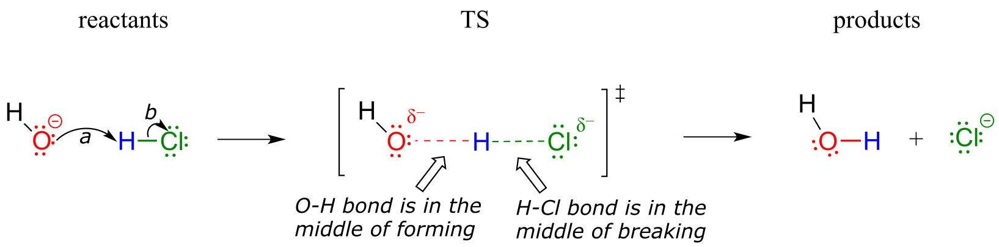

fig 2a

Notice in the drawing above that both the oxygen and the chlorine bear
*partial* negative charges at the transition state: the formal charge on
oxygen changes from -1 to 0 during the course of the reaction step,
while the formal charge on chlorine changes from 0 to -1.

While it can sometimes be instructive to include a transition state
drawing in an organic mechanism diagram, they are not 'obligatory'
elements of such a diagram. When asked to draw a reaction mechanism in
the exercises and problems in this book, you need not include TS
drawings in your answer unless specifically directed to do so.

<u>Exercise</u> 6.1: Draw electron movement arrows to illustrate
mechanism of the acid-base reaction between acetic acid,
CH3CO2H, and ammonia, NH3. Draw out the
Lewis structures of reactants and products, including all lone pairs and
formal charges. Include a transition state drawing in your mechanism.

<u>Exercise 6.2</u>: Draw electron movement arrows to illustrate the
mechanism of the *reverse* of the reaction in Exercise 6.1: the
acid-base reaction between acetate ion
(CH3CO2-, acting as a base) and
ammonium (NH4+), acting as an acid). Again, draw
out the Lewis structures of reactants and products, including all lone
pairs and formal charges.

### 6.1B: A one-step nucleophilic substitution reaction 

The reaction between hydroxide and HCl is a simple example of a Brønsted
acid-base (proton transfer) reaction. We now continue our introduction
to the essential ideas of organic reactivity with a different type of
reaction in which bonds to a *carbon* atom are rearranged. Consider what
might happen if a hydroxide ion encountered a chloromethane molecule.
The hydroxide is an electron-rich species, and thus might be expected to
act as a base and ‘attack’ a hydrogen as it did in the previous example
with hydrochloric acid. In this case, though, the three hydrogens on
chloromethane are not electron-poor, as they are bound not to chlorine
but to carbon, which is not very electronegative. However, there *is* a
relatively electron-poor atom in chloromethane: the carbon itself.

fig 3

Due to the relative electronegativity of chlorine, the carbon-chlorine
bond is polar. It stands to reason that a lone pair of electrons on the
electron-rich hydroxide oxygen will be attracted to the electron-poor
carbon nucleus.

fig 4

In the mechanism drawing above, curved arrow (a) shows the lone pair
electrons on the hydroxide oxygen moving to fill up an *sp3*
orbital on chloromethane, forming a new carbon-oxygen σ bond. However,
in order for this new bond to form, one of the bonds already on the
carbon must simultaneously break - otherwise, there will be five bonds
to carbon and the octet rule will be violated (remember that the 'octet
rule' tells us that elements in the second row of the periodic table can
have a maximum of eight valence electrons). Curved arrow (b) illustrates
how the two electrons in the carbon-chloride bond break out of their σ
bond and become a lone pair on the chloride ion product. In other words,
arrow (b) illustrates the breaking of the carbon-chlorine bond. (We will
see a transition state drawing for this reaction in chapter 8, when we
study this type of reaction mechanism in much greater detail).

The reaction mechanism illustrated above called a **nucleophilic
substitution**. The 'substitution' term is easy to understand: just
recognize how hydroxide *substitutes* for chlorine as the fourth bond to
the central carbon. The term 'nucleophilic' means 'nucleus-loving' and
refers to the electron-rich species, the hydroxide oxygen. This oxygen
is a **nucleophile**: it is electron-rich and attracted to the
electron-poor nucleus of the carbon atom, and 'attacks' with a lone pair
to form a new covalent bond.

There are two more terms that come into play here, both of which you
will see again and again as you continue to study organic reactions.
Because the carbon atom in methyl chloride is electron-poor, it is
attracted to anything that is electron rich - anything nucleophilic, in
other words. Thus, the carbon is referred to in this context as an
**electrophile**. The chlorine, because it leaves with two electrons to
become a chloride ion, is termed a **leaving group.**

fig 5

<u>Exercise 6.3:</u> In each of the nucleophilic substitution reactions
below, identify the nucleophile, electrophile, and leaving group, and
fill in the missing product.

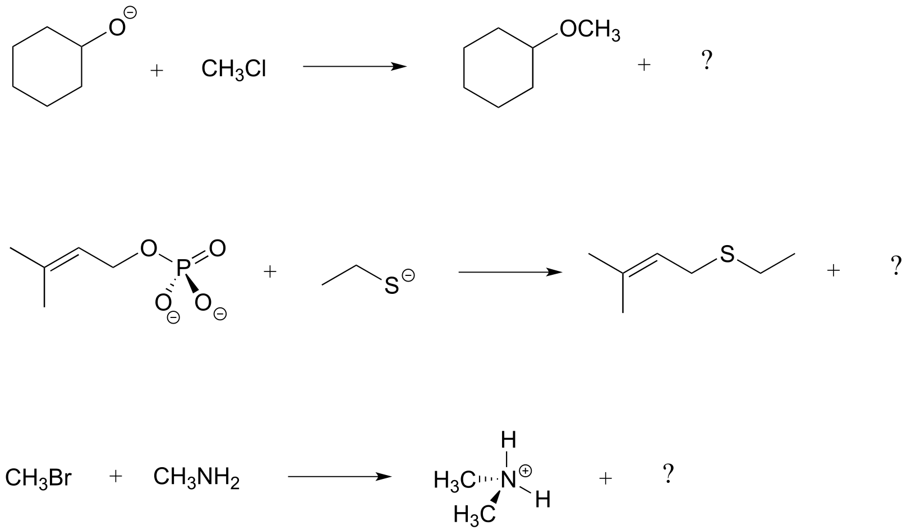

fig 6

### 6.1C: A two-step nucleophilic substitution mechanism 

Reaction mechanisms describe not only the electron movement that occurs
in a chemical reaction, but also the *order* in which bond-breaking and
bond-forming events occur. Some nucleophilic substitution reactions, for
example, can occur by a two-step mechanism that is different from the
one-step mechanism we just saw between hydroxide ion and chloromethane.
Look, for example, at the substitution reaction between acetate ion and
2-chloro-2-methyl propane (common name *tert*-butyl chloride).

fig 7

Unlike the chloromethane plus hydroxide reaction, in which the
substitution process took place in a single, concerted step, it turns
out that this mechanism involves two separate steps. The leaving group,
chloride anion, leaves first, *before* the acetate nucleophile attacks.

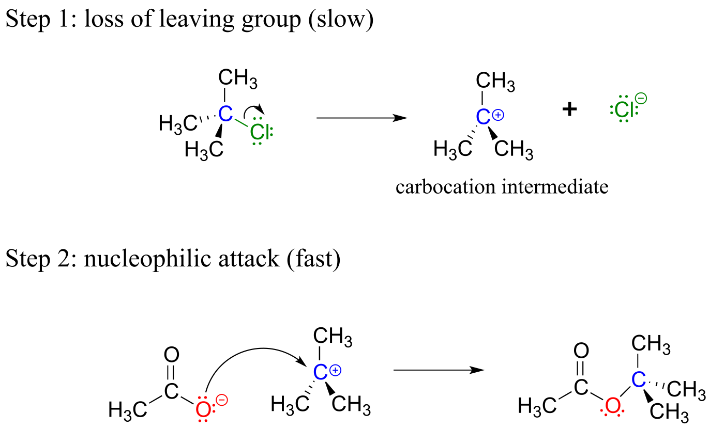

fig 8

Because the central carbon (colored blue in the figure above) has lost
its share of the two electrons in what was the carbon-chlorine bond, it
is now positively charged. Recall from section 2.1C that we can picture
a carbocation as a planar, *sp2*-hybridized carbon center
with three bonds, an empty *p* orbital, and a full positive charge.

fig 8a

The carbocation is highly reactive, and does not exist for very long
before participating in a subsequent bond-forming event. In the language
of organic mechanisms, it is referred to as a **reaction**
**intermediate**.

With its empty *p* orbital, the carbocation intermediate is clearly
electron-poor, and thus is a powerful electrophile. The negatively
charged acetate ion is electron dense and a nucleophile, and as such is
strongly attracted to the carbocation electrophile. Attack by the
nucleophile results in a new carbon-oxygen σ bond and formation of the
substitution product.

We will have much more to say about nucleophilic substitutions,
nucleophiles, electrophiles, and leaving groups in chapter 8. The take
home message at this point, however, is simply that two reactions that
look quite similar in terms of the reactants and products can occur by
different mechanisms.

You can probably appreciate by now how essential it is to understand and
be able to work with curved arrows - it is something that will use
constantly during the remainder of your study of organic reactivity.

For example, although you are not yet familiar with the relevant
reaction mechanism (it is the HIV protease reaction, covered in chapter
11), given reactant and intermediate structures:

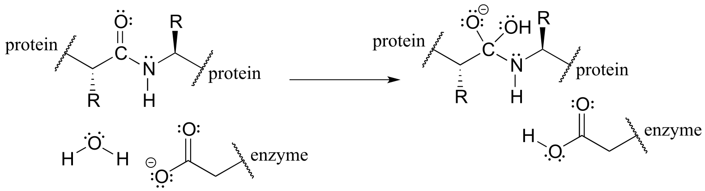

fig 8b

with practice you should at this point be able to recognize the
bond-forming and bond-breaking electron movement that is taking place,
and draw the appropriate curved arrows:

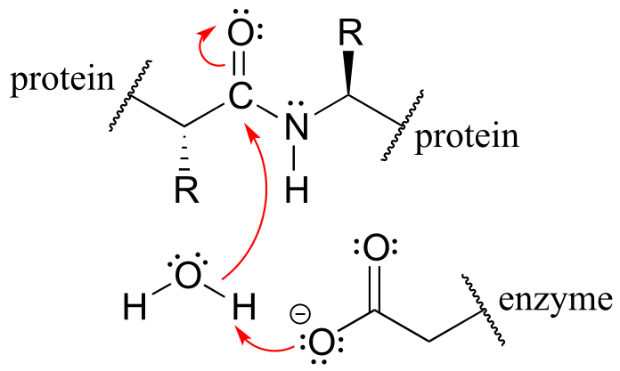

fig 8c

An additional word of caution: many beginning organic students make the
mistake of using curved arrows to depict the motion of *atoms*. This is
incorrect! The curved arrows in an organic mechanism ***always*** refer
to the motion of *electrons*.

## Section 6.2: A brief review of thermodynamics and kinetics

You may recall from general chemistry that it is often convenient to
illustrate the energetics of a chemical reaction with a **reaction
coordinate diagram**. In a reaction coordinate diagram, the vertical
axis represents the overall potential energy of the reactants, while the
horizontal axis is the ‘reaction coordinate’, tracing from left to right
the progress of the reaction from starting reactants R to final products
P. (Many students find it helpful to envision the horizontal axis in an
reaction coordinate diagram as being analogous to the progress bar at
the bottom of a youtube vieo). The diagram for a typical one-step
nucleophilic substitution reaction such as that between hydroxide and
methyl chloride might look like this:

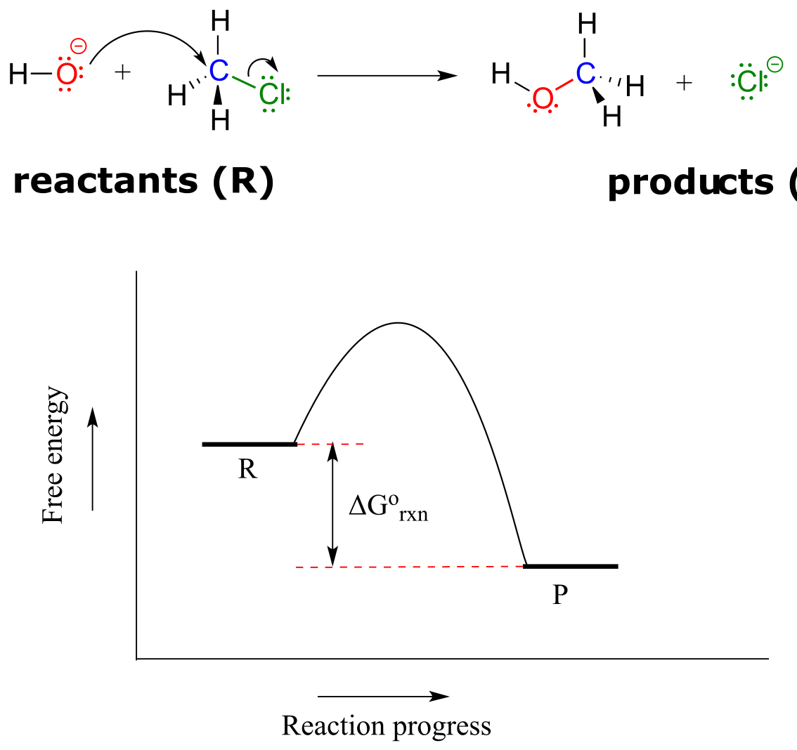

fig 9

Despite its apparent simplicity, this diagram conveys some very
important ideas about the thermodynamics and kinetics of the reaction.
Recall that when we talk about the **thermodynamics** of a reaction, we
are concerned primarily with the difference in energy between reactants
(R) and products (P): whether the reaction as a whole is uphill or
downhill. When we talk about **kinetics**, on the other hand, we are
concerned with the *rate* of the reaction: how fast it goes from
reactants to products, regardless of whether that transformation is
energetically uphill or downhill.

### 6.2A: Thermodynamics

First, a quick review of some key thermodynamics terms (you may also
want to go back to your General Chemistry text for a more complete
review). Recall that the **standard** **Gibbs free-energy change of a
reaction (∆G˚)** is the difference in energy between reactants and
products at standard conditions. Gibbs free-energy change is a
combination of enthalpy change (∆Ho) and entropy change
(∆So):

∆G = ∆Ho - T∆So

. . .where T is the temperature in Kelvin (recall that the Kelvin
temperature is simply the Celsius temperature plus 273.15).

**Enthalpy change (∆Ho)** is the heat released or absorbed by
the reaction.

**Entropy change (∆So)** is the change in disorder from
reactants to products. In a reaction in which one molecule cleaves into
two smaller molecules, for example, disorder increases, so
(∆So) is positive.

The **equilibrium constant (Keq)** for a reaction is an
expression of the relative concentrations of reactants and products
*after the reaction has reached equilibrium*. The equilibrium constant
is defined as:

fig 9a

Now, let’s review what the above energy diagram tells us about the
thermodynamics of the reaction. Note that the energy level of the
products is *lower* than that of the reactants. This tells us that the
Gibbs free-energy change for the reaction is negative, and the step is
**exergonic**, or energy releasing. We can also say the reaction is
'thermodynamically favorable', or, more informally, 'downhill'.

Recall from General Chemistry that the standard Gibbs free energy change
for a reaction can be related to the reaction's equilibrium constant
(Keq) by the equation:

∆G˚ = -RT lnKeq

. . . where R is the gas constant (8.314 J/mol⋅K) and T is the
temperature in Kelvin (K).

If you do the math, you see that a negative value for ∆G˚rnx
(an exergonic reaction) corresponds to Keq being greater than
1, an equilibrium constant which favors product formation.

Conversely, an **endergonic** reaction is one in which the products are
higher in energy than the reactants, and energy is absorbed. An
endergonic reaction has a positive value of ∆G˚rnx, and a
Keq between 0 and 1.

fig 9b

Acid-base reactions provide convenient examples of thermodynamically
favorable and unfavorable reactions. The reaction of a strong acid like
HCl with a strong base like hydroxide ion, for example, is highly
favorable, and has an equilibrium constant much greater than one. The
reaction of a weak acid such as acetic acid with a weak base such as
water, on the other hand, is unfavorable and has an equilibrium constant
that is a very small (much less than 1) positive number: we can
visualize this in a reaction coordinate diagram as an 'uphill' reaction,
in which ∆G˚rnx is positive.

When talking about exergonic, or 'downhill' reactions, chemists
sometimes use the term **'driving force'** to describe the chemical
factor or factors that drive the reaction from higher energy reactant to
lower energy product. Using the 'downhill' analogy again, when water
flows downhill, the driving force is gravity. In an exergonic chemical
reaction, the driving force generally is based on a combination of two
factors: a) the stability of positive and negative charges in the
product relative to those in the reactant, and b) the total bond energy
in the product relative to the reactant. That may not make a lot of
sense right now, but keep it in the back of your mind and we will come
back to the idea of driving force when we study different reaction types
in greater detail.

Now, let's move to kinetics. Look again at the diagram for an exergonic
reaction: although it is ‘downhill’ overall, it isn’t a straight
downhill run.

fig 9c

First, an ‘energy barrier’ must be overcome to get to the product side.
The height of this energy barrier is called the **standard free energy
of activation (**∆G˚‡**)**. The activation energy, in
combination with the temperature at which the reaction is being run,
determines the rate of a reaction: the higher the activation energy, the
slower the reaction. At the very top of the energy barrier, the reaction
is at its **transition state** (TS), which you should recall is defined
as the highest energy structure in the transition from reactant to
product.

Consider the hypothetical reaction coordinate diagrams below.

Both reaction A and reaction B are slightly endergonic, or uphill:
∆G˚rxn for both is positive, meaning that Keq for
both is between 0 and 1. However, the energy of activation is higher for
reaction B. From this observation, we know that reaction A will proceed
faster than reaction B in both forward and reverse directions
(temperature and other conditions being equal), so reaction A will reach
equilibrium in less time.

<u>Exercise 6.4</u>: Consider the hypothetical reaction coordinate
diagrams below, and assume that they are on the same scale.

fig 9d

a)Which of the diagrams describe(s) a reaction with Keq \< 1
?

b\) Which of the diagrams describes the fastest reaction?

c\) Which of the diagrams describes the reaction with the highest value
of Keq?

d\) Which of the diagrams describes the reaction with the largest
∆G˚‡ for the *reverse* reaction?

e\) Copy the diagram for your answer to part (d), and add a label which
graphically illustrates the value of ∆G˚‡ for the reaction in
the *reverse* direction.

We turn our attention next to a two-step reaction mechanism, such as the
nucleophilic substitution reaction between acetate and *tert*-butyl
chloride. The reaction coordinate diagram for this reaction looks
somewhat different from what we have seen until now:

fig 10

Because there are two steps involved, there are also two transition
states and two activation energies to consider, as well as a carbocation
intermediate (denoted by the letter I). The first, bond-breaking step
from R to I, passing over transition state TS1, can be
depicted as a highly endergonic (uphill) reaction, because the
carbocation-chloride ion pair is significantly higher in energy than the
reactants. The second step, attack on the carbocation electrophile by
the acetate nucleophile and formation of the new carbon-oxygen bond, is
a highly exergonic step that passes over a second, lower energy
transition state TS2. The intermediate (I) is thus depicted
as an energy 'valley' (a local energy minimum) situated between the two
energy peaks TS1 and TS2.

Notice that the activation energy for the first step is higher than the
activation energy for the second, meaning that the first step is slower.
This should make intuitive sense, because the first step involves
bond-breaking, separation of charge, and formation of a carbocation,
which is high in energy due to lacking a complete octet. Conversely, the
second step involves bond-forming and neutralization of charge. In a
multi-step reaction, the slowest step - the step with the highest energy
of activation - is referred to as the **rate-determining step** (rds).
The rds can be thought of as the 'bottleneck' of the reaction: a factor
which affects the rds will affect the overall rate of the reaction.
Conversely, a factor which affects a much faster step will not
significantly affect the rate of the overall reaction.

<u>Exercise 6.5</u>: Imagine that you are trying to extinguish a burning
campfire using buckets of water filled from a faucet some distance from
the fire. It takes 20 seconds to fill a bucket at the faucet, and two
seconds to carry the bucket to the fire and dump it on the flames. You
have plenty of people to carry the buckets, but only one faucet so you
can only fill one bucket at a time.

a\) If you double the speed at which you carry the buckets by running
instead of walking, what effect will this have on how fast you get water
to the fire?

b\) If, instead, you realize you can double the speed at which you fill
up the buckets by using a second faucet, what effect will this have on
how fast you get water to the fire?

c\) What is the rate-determining step for the process?

<u>Exercise 6.6</u>: Use the reaction coordinate diagram below to answer
the questions.

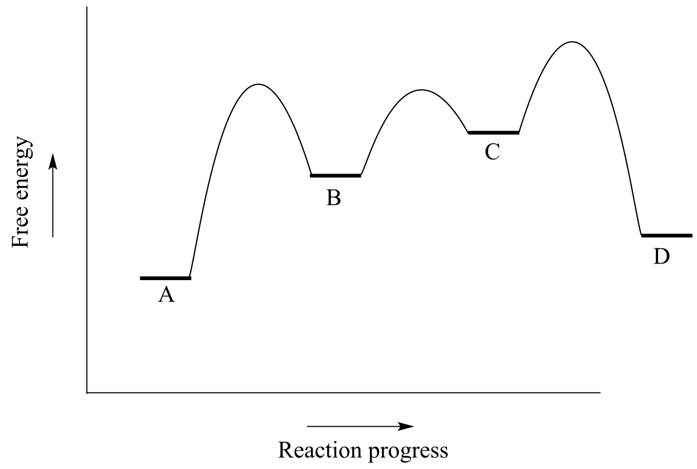

fig 10a

a\) Is the overall reaction endergonic or exergonic in the forward (A to
D) direction?

b\) How many steps does the reaction mechanism have?

c\) How many intermediates does the reaction mechanism have?

d\) Redraw the diagram and add a label showing the activation energy for
the rate-determining step of the forward reaction.

e\) Add a label showing ∆Gorxn for the *reverse*
reaction (D to A).

f\) What is the fastest reaction step, considering *both* the forward
and reverse directions?

**  
**

## Section 6.3: Catalysis 

Consider a hypothetical reaction R → P described by the diagram below.

fig 10a

We notice two things about this reaction: it is exergonic, and it has a
high activation energy. What this means is that although it is
thermodynamically favorable, it is also slow: in other words,
equilibrium favors product over reactants, but it will take a long time
to reach equilibrium.

There are three ways that we could increase the rate of the reaction.
First, we could add energy to the system by increasing the temperature,
which gives the reacting molecules more energy to pass over the
transition state. Increasing the temperature will increase the value of
the rate constant *k* in the rate expression:

rate = *k* \[R\]

In the laboratory, many organic reactions are run at high temperatures
for this very purpose. We could also increase the concentration of the
reaction R, which would increase the rate of the reaction without
increasing the value of *k*.

When talking about the biochemical reactions happening in a living cell,
however, increasing the reaction temperature or reactant concentration
is not a reasonable option. As an alternative, we could provide a *new
route* from point R to point P in which the activation energy is lower.
The role of a **catalyst** is to accelerate a reaction by stabilizing
the transition state, and thus lowering the activation energy.

fig 10c

Catalysts, while they participate in the mechanism, are not consumed, so
one catalyst molecule can catalyze multiple reaction cycles. Notice also
that while the catalyst lowers the energy of the transition state (and
thus the activation energy), it has no effect on ∆Grxn. ***A
catalyst increases the rate of a reaction, but does not get consumed in
the reaction and does not alter the equilibrium constant***. In other
words, a catalyst affects the *kinetics* of a reaction, but not the
*thermodynamics*. Catalysts play a hugely important role in biochemical
reactions.

Most organic reactions involve more than a single mechanistic step.
Below is a reaction coordinate diagram illustrating rate acceleration of
a two-step reaction by a catalyst:

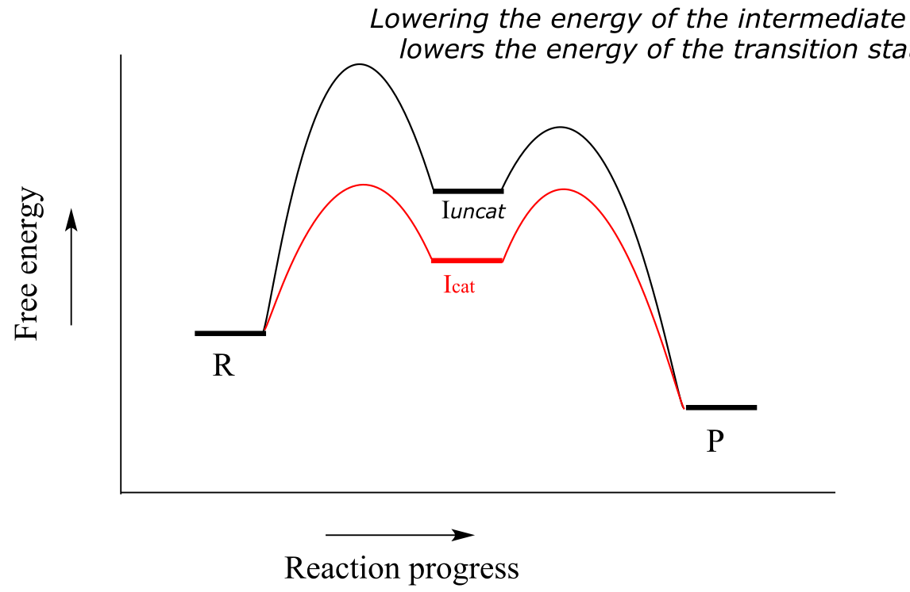

Notice that the catalyst lowers the energy of the intermediate species.
A concept known as the **Hammond Postulate** (the details of which are
beyond our scope here) tells us that ***when a catalyst lowers the
energy of an intermediate, it also lowers the energy of the adjacent
transition states.*** Note in this diagram above that the energy barrier
for the rate-determining first step is much lower in the catalyzed
reaction - thus, the overall reaction is faster. When studying how an
enzyme catalyzes a biochemical reaction, chemists often are actually
looking at how the enzyme interacts with - and stabilizes - an
intermediate species following a rate-determining step. The Hammond
postulate tells us that an understanding of enzyme-*intermediate*
interactions will also apply to enzyme-*transition state* interactions.

fig 10d

Acids and bases as are commonly used as catalysts in organic chemistry,
and chemists have come up with a huge arsenal of catalysts, many of them
metals, to speed up the rates of useful laboratory reactions. Almost all
biochemical reactions are catalyzed by **enzymes**, which are protein
catalysts. In the introduction to this chapter, we heard the story of
the discovery of a heat-stable DNA polymerizing enzyme which turned out
to be very useful to the scientific world.

How do enzymes accomplish their role as biochemical catalysts? Recall
from section 1.3D that enzymes have an active site pocket in which
substrates (reactant molecules) are bound. It is inside these active
site pockets that most biochemical reactions take place. Enzymes achieve
catalysis in the active site by some combination of the following:

I: By positioning two reacting molecules close to each other in the
active site, in precisely the orientation necessary for them to react.
Compare this to an uncatalyzed reaction in which completion depends on
the two reactant molecules happening to collide, by chance, in the
correct orientation.

II: By binding substrates in such a way that they assume the proper
conformation necessary for a reaction to occur.

III: By increasing the reactivity of the substrates: making acidic
protons more acidic, nucleophiles more nucleophilic, electrophiles more
electrophilic, and leaving groups better at leaving. Very often, these
feats are accomplished with acidic and/or basic amino acid side chains
lining the active site pocket. As we go on to study many different types
of biochemical reactions, we get a better of how this works.

IV: By stabilizing the transition states of the slower, rate-determining
steps of the reaction. If a transition state has a negative charge, for
example, the enzyme might provide a positively charged amino acid side
chain, or a bound metal cation such as Zn+2, as a stabilizing
factor. A lower-energy transition state, of course, means a lower
activation energy and a faster reaction step.

Enzymes are capable of truly amazing rate acceleration. Typical enzymes
will speed up a reaction by anywhere from a million to a billion times,
and the most efficient enzyme currently known to scientists is believed
to accelerate its reaction by a factor of about 1017 over the
uncatalyzed reaction (see *Chemical and Engineering News*, March 13,
2000, p. 42 for an interesting discussion about this nucleotide
biosynthesis enzyme called 'orotidine monophosphate decarboxylase').

At this point, it is not necessary for you to fully understand the four
ideas listed above: just keep them in mind as we go on to study a
variety of common biological organic reactions and see in greater detail
how enzymes have evolved to catalyze them.

[Animated tutorial on how enzymes
work](https://www.youtube.com/watch?list=UUBkuiMC1rIybuTcyMK-jWKw&v=yk14dOOvwMk)

<u>Exercise 6.7</u>: Table sugar, or sucrose, is a high-energy dietary
compound, as are the fats in vegetable oil. Conversion of these
compounds, along with oxygen gas (O2), to water and carbon
dioxide releases a lot of energy. If they are both so high in energy (in
other words, thermodyamically *unstable*), how can they sit for years on
your kitchen shelf without reacting?

Another very important point to keep in mind about enzymes is the
*specificity* with which they catalyze reactions. We have already
discussed, in chapter 3, the idea that enzymes exert a very high level
of control over the stereochemistry of a reaction: if two or more
stereoisomeric products could potentially form in a reaction, an enzyme
will likely only catalyze the formation of one stereoisomer, with
negligible formation of other side products. Likewise, enzymes
demonstrate remarkable control of **regiochemistry** in their reactions.
The glycolysis pathway enzyme glucose-6-kinase, for example, transfers a
phosphate group specifically to the hydroxyl group on carbon \#6 of
glucose, and not to any of the other four hydroxyl groups. We'll look
more closely at this reaction and others like it in chapter 9.

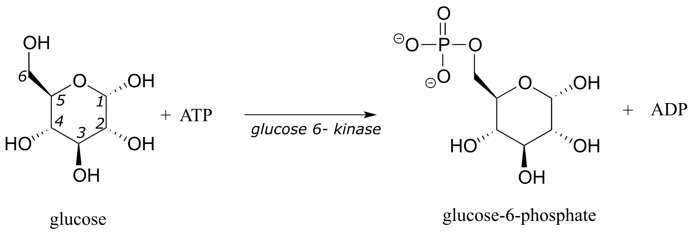

fig 11

Finding ways to maintain control over stereochemistry and regiochemistry
is a constant challenge for synthetic organic chemists working with
non-enzymatic reactions, and the techniques that have been developed in
this arena are a big part of what you will study if you go on to take a
more advanced course focusing on organic synthesis.

Finally, we will encounter many biochemical reactions in this book in
which the enzyme catalyzing the reaction does so with the assistance of
a **coenzyme**. A coenzyme is a small (relative to a protein) molecule
that binds in the active site of a partner enzyme and participates in
some manner with the reaction being catalyzed. Table 6 at the back of
the book shows the structures of several coenzymes commonly seen in
biochemical reactions.

## Section 6.4: Comparing biological reactions to laboratory reactions 

The focus of this book is on organic chemistry in a biological context.
At various points in our investigation of organic reactivity, however,
we will also be considering some non-biological, laboratory counterparts
of reactions that occur in living cells. The reason for this is
two-fold: first of all, it is often instructive to compare and contrast
similar reactions taking place in very different environments, and
sometimes the similarities are quite striking. Secondly, even those who
intend to pursue a career in the life or health sciences can benefit
from some exposure to the kind of challenges that professional organic
or medicinal chemists work on: if you are working as a biologist for a
pharmaceutical company for example, you will be better able to
appreciate the contributions of your chemist colleagues if you are able
to make the intellectual connection between the reactions they are
running in flasks and the those that are taking place in the cells you
are studying.

Below we briefly outline the differences between laboratory and
biological reactions:

<u>Catalysts</u>: The vast majority of biological organic reactions are
catalyzed by enzymes. While chemists synthesizing molecules in the
laboratory sometimes make use of enzyme-catalyzed reactions, it is much
more common to use non-biological catalysts (often containing transition
metals), acids or bases as catalysts, or no catalyst at all.

<u>Solvent</u>: Biological organic reactions occur in the aqueous
environment of the cell. In the laboratory, organic reactions can be run
in a wide variety of solvents, ranging from the very nonpolar (such as
hexane) to the very polar, such as methanol,water, or even ionic
liquids. Most commonly, though, laboratory reactions are run in
relatively non-polar solvents such as diethyl ether or dichloromethane.

<u>Reactant mixture</u>: The aqueous environment of a cell is an
extremely complex mixture of thousands of different biomolecules in
solution at low concentrations (usually nanomolar to millimolar),
whereas the components of a laboratory reaction have usually been
purified, and are present in much higher concentrations.

<u>Temperature</u>: Biological reactions take place within a narrow
temperature range specific to the organism: a little too cold and the
enzymes catalyzing the reactions are 'frozen', a little too hot and the
enzymes will come unfolded, or 'denature'. Laboratory reactions can be
run at a variety of temperatures, sometimes at room temperature,
sometimes at the boiling point of the solvent, and sometimes at very low
temperatures (such as when a reaction flask is immersed in a dry
ice-acetone bath).

<u>pH</u>: Biological reactions take place in aqueous solution buffered
to a specific pH: about pH 7 for most living things. Accordingly, highly
acidic or basic species are unlikely to be reactants or intermediates in
a biological reaction mechanism. Laboratory reactions are often carried
out in the presence of strong acids or bases.

## Key concepts for review

You should be confident in interpreting and using the **curved arrow**
drawing convention for showing two-electron movement. Given a set of
curved arrows describing a reaction step, you should be able to draw the
product indicated by the arrows. Alternatively, given the starting
structure and a product for a reaction step, you should be able to draw
the curved arrows showing how bonds were broken and formed. You need not
understand (yet) the chemistry behind these steps, you just need to be
able to use the drawing formality.

You should be able to recognize three reaction mechanism types: an
**acid-base reaction,** a **one-step nucleophilic substitution**, and a
**two-step nucleophilic substitution**.

Given an example reaction, you should be able to identify a
**nucleophile**, **electrophile**, and in many cases a **leaving
group**.

Given an example reaction mechanism, you should be able to recognize one
or more **reaction intermediates**.

Given a reaction coordinate diagram for a hypothetical reaction, you
should be able to recognize whether the reaction is endergonic or
exergonic, and whether the equilibrium constant is greater than or less
than 1. You should be able to identify the point(s) on the diagram
corresponding to **transition state**(s**)** and reaction
intermediate(s). In a multi-step reaction diagram, you should be able to
identify the **rate determining step**.

Given a detailed reaction process showing starting reactant(s),
intermediate(s), and product(s) with associated curved arrows, you
should be able to sketch a reaction coordinate diagram that that is
consistent with the details of the reaction mechanism.

You should be able to explain the role of a **catalyst** in a reaction.

You should be able to list the major differences between a typical
biological reaction and a typical laboratory reaction.

## Problems

**P6.1:** For each of the nucleophilic substitution reactions below,
identify the atoms which are acting as nucleophile, electrophile, and
leaving group, and draw a curved-arrow diagram showing a *one-step*
mechanism.

a\)

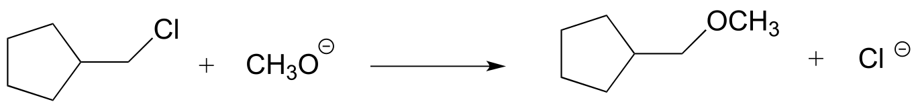

b\)

c\)

d\)

**P6.2:** Below is a reaction coordinate diagram for a hypothetical
reaction.

a\) What can you say about the value of Keq for the overall A
to D transformation?

b\) What is the rate determining step for the overall A to D
transformation?

c\) Which step is faster, A to B or B to C?

d\) Which transformation is more thermodynamically favorable, A to B or
C to D?

e\) Below is a diagram of a hypothetical reaction. Step 2 is the
rate-determining step, C is the least stable species, B is higher energy
than D, and the overall reaction has an equilibrium constant
Keq = 0.33. Draw a diagram that corresponds to all of this
information.

**P6.3:** Illustrated below are individual steps in some biochemical
reaction mechanisms that we will be studying later. For each step, draw
the products or intermediate species that would form according to the
electron-movement arrows given. Be sure to include all formal charges.
You do not need to show stereochemistry.

a\)

b\)

c\)

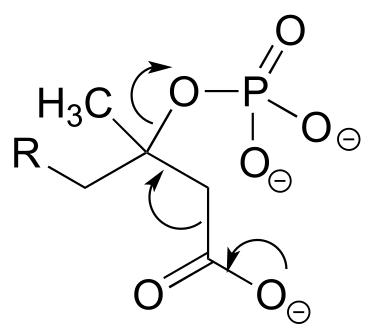

d\)

e\)

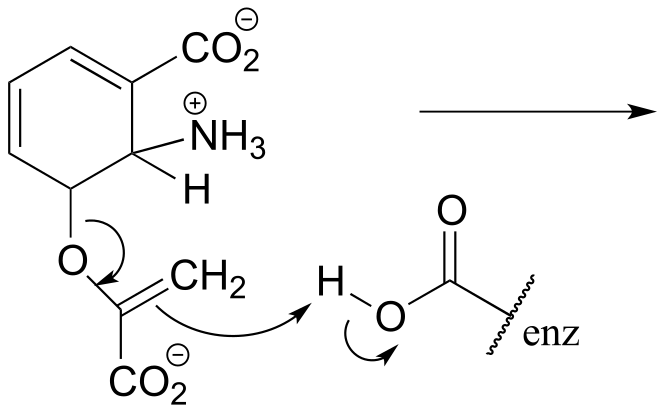

**P6.4:** Shown below are individual steps in some biochemical reaction
mechanisms that we will be studying later. For each, draw curved arrows
showing the electron movement taking place.

a\)

b\)

c\)

**P6.5:**

a\) In the biochemical nucleophilic substitution reactions illustrated
below, identify the atoms which are acting as nucleophile, electrophile,
and leaving group.

Reaction 1:

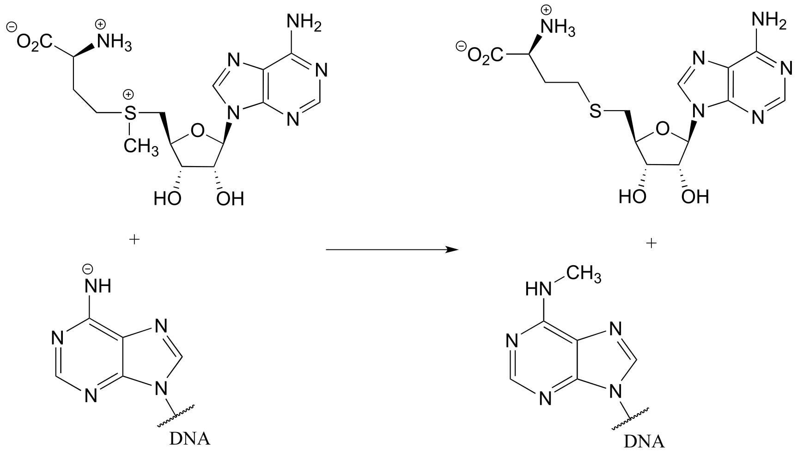

Reaction 2:

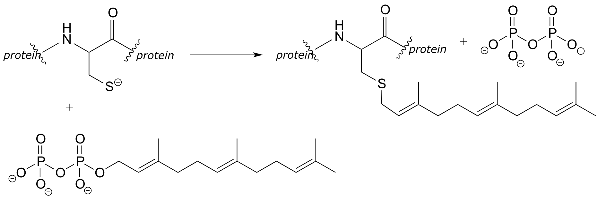

b\) Using appropriate 'R' abbreviations for regions of the molecules
that are not directly involved in bond-breaking or bond-forming events
above, draw curved arrows showing the electron movement that takes place
in each step. Assume that both are one-step mechanisms.

# 7: Acid-base reactions

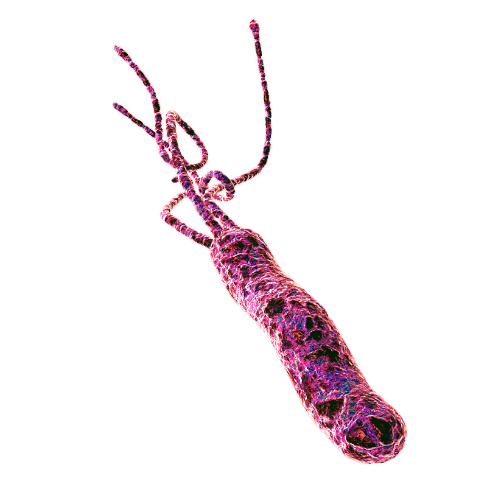

***Helicobacter pylori***

Credit: https://www.flickr.com/photos/ajc1/

The glass flask sitting on a bench in Dr. Barry Marshall's lab in Perth,
Western Australia, contained about thirty milliliters of a distinctly
unappetizing murky, stinking yellowish liquid.

A few days earlier, Dr. Marshall, in consultation with his mentor and
research partner Dr. J. Robin Warren, had poured a nutrient broth into
the flask, then dropped in a small piece of tissue sample taken from the
stomach of a patient suffering from chronic gastritis. Gastritis is an
inflammation of the stomach lining characterized by lingering pain,
nausea, and vomiting, and is often is the precursor to a peptic ulcer.
Now, after several days of incubating in a warm water bath, the flask
contained a living liquid culture, swarming with billions of bacterial
cells. According to the medical textbooks lining Dr. Marshall's
bookshelves, the bacteria should not have been there – nothing should
have grown in the broth, because the highly acidic environment inside
the stomach was supposed to be sterile. Also according to the textbooks,
the cause of his patient's stomach ailment was stress, or perhaps a poor
diet – but most definitely not a bacterial infection.

Dr. Marshall took a good, long, look at the contents of the flask. Then
he gave it a final swirl, and drank it down.

Five days later, his stomach started to hurt.

This is the story of how two doctors dared to think what no one else had
thought, and turned an established medical doctrine upside-down. Dr. J.
Robin Warren was a pathologist at the Royal Perth Hospital in Perth,
Western Australia. One day, when examining an image taken from a stomach
biopsy from a patient with severe gastritis, he noticed what appeared to
be spiral-shaped bacteria in the tissue, a surprising observation given
the medical consensus that bacteria could not live in the stomach.

The microbe-like shapes were very hard to see, but when he tried
treating the sample with a silver stain they became much more apparent.
He decided to start looking at silver-stained sections of every stomach
biopsy he examined, and before long he noticed a pattern: the presence
of the spiral bacteria coincided with gastritis in the patient, and the
tissues which were more severely inflamed seemed also to have more
bacteria present. Could there be a causal link between the bacteria and
the illness?

When he discussed his observations with colleagues, they dismissed the
results as coincidental contamination – nothing important.

Warren wasn't willing to just let it go. He was able to interest Barry
Marshall, a young internal medicine resident training at the same
hospital, in taking on a research project to try and solve the mystery
of the bacteria that were not supposed to exist. Marshall started by
doing a thorough search of the literature, and found that his mentor was
not the first to report seeing spiral-shaped bacteria in stomach tissue
– there were in fact several such observations in the literature, the
oldest going back to the middle of the 19th century. All of
them had been dismissed as unimportant artifacts.

Warren and Marshall started sending stomach biopsies from gastritis
patients to the microbiology lab in the hospital, to see if bacteria
from the samples could be cultured in a petri dish. For many months,
they got nothing. Then one Tuesday morning, right after the four-day
Easter holiday, Marshall got a call from an excited microbiology
technician: he had neglected to dispose of the latest round of test
cultures before going home for the holiday, and instead had left them in
the incubator the whole time. After growing for a full five days, the
dishes had colonies of bacteria growing in them. All this time, the
technicians had been throwing the cultures away after two days when no
bacterial growth was evident – standard procedure when working with
other bacteria – but apparently these bacteria were especially
slow-growing.

Now that he could culture the bacteria in the lab, he was able to
isolate and study them in more detail, and gave them the name
*Helicobacter pylori*. Marshall confirmed Warren's earlier observation
of a correlation between stomach bacteria and gastritis: only those
patients suffering from gastritis or ulcers seemed to have the bacteria
in their stomachs. There seemed to be strong evidence that *H. pylori*
infection led to gastritis, which in turn lead eventually to stomach
ulcers.

Despite the new data, Warren and Marshall's colleagues in the
gastroenterology field were still unconvinced of the link between
bacteria and gastritis or ulcers. Scientists are inherently skeptical
people, and it was difficult to overcome the long-entrenched theory that
the stomach was sterile, and that ulcers were caused by stress.
Interviewed much later by Discovery Magazine, Marshall recalled: “To
gastroenterologists, the concept of a germ causing ulcers was like
saying that the Earth is flat”.

Poring once more over the available literature, Marshall learned that
acid-reducing drugs – an enormously profitable product– were able to
relieve ulcer symptoms, but only temporarily. One interesting piece of
information stood out to him, though: an over-the-counter antacid
containing the element bismuth (similar the brand-name medicine
Pepto-Bismol) provided much longer-lasting relief compared to the other
drugs – and in some cases seemed to effect a permanent cure. Marshall
soaked a small circle of filter paper in the bismuth medicine, and
placed it on a petri dish that he had inoculated with *H. pylori*. After
five days in the incubator, there was a clear circle of non-growth
around the filter paper. The medicine had killed the bacteria.

Everything seemed to fit together: almost all patients with gastritis or
ulcers had *H. pylori* infections, and a drug which was able to kill the
bacteria was also effective against the stomach ailment. But to convince
the medical community that the root cause of ulcers was *H. pylori*
infection, Warren and Marshall needed more direct evidence: they had to
show that a healthy stomach – free from gastritis and uninfected by *H.
pylori* – would develop gastritis as a result of intentional infection,
and that clearing up the infection would also cure the gastritis. They
tried experiments with pigs first, then rats, and then mice, but to no
avail – they were not able to induce an *H. pylori* infection in the
animal models. Marshall was getting desperate: all around him he saw
patients suffering terribly, getting only temporary relief from acid
blockers and eventually needing to have parts of their stomachs removed,
and he was convinced that simple antibiotic therapy would cure them if
only their doctors could be convinced to try it. Because animal models
had failed, he decided to move to a model system that he knew would
work: humans. Ethical and regulatory considerations prevented him from
intentionally infecting human volunteers - so his only option was to use
himself as a guinea pig.

We are now at the point in the story where Barry Marshall, in the name
of science and medicine, took his disgusting but undeniably courageous
gulp of bacteria-laden broth. He had already undergone an endoscopy to
ascertain that his stomach was free from both inflammation and *H.
pylori*. As we already know, he started to develop symptoms of gastritis
about five days after drinking the bacteria – the same amount of time
that it took for *H. pylori* colonies to appear in the petri dish
cultures. After a few more days, he underwent another endoscopy, and was
overjoyed to be told that his stomach was indeed inflamed, and was
infested with spiral-shaped bacteria. He initially wanted to carry on
the experiment for a few more days of further tests, but his wife had a
different opinion on the matter and convinced him to begin antibiotic
treatment, which quickly cleared up both his infection and his stomach
inflammation.

Marshall and Warren now had clear, direct evidence that the stomach
inflammation which leads to ulcers was caused by bacteria, and could be
cured with antibiotics. They submitted a summary of their results for
presentation at a meeting of the Gastroenterological Society of
Australia, but were rejected. Apparently, 67 submissions had come in and
there was only time for 56 presentations; unfortunately their results
were not considered important enough to make the cut. They persevered,
and eventually published their findings in the June, 1984 issue of the
British medical journal *The Lancet.*

The paper gained some notice, especially from microbiologists, but did
not have an immediate impact in clinical practice. Around the world,
gastroenterologists continued to treat ulcers with acid blockers.
Outside of the mainstream medical community, however, word was getting
out that two Australian doctors had a cure for ulcers, and more people
started coming to them for treatment. Stories about Warren and Marshall
appeared in places like Reader's Digest and The National Enquirer, and
eventually in the United States the National Institutes of Health and
the Food and Drug Administration responded by fast-tracking the clinical
testing and approval process, and publicizing the new treatment option.

Stomach ulcers, which have been tormenting human beings since the
beginning of recorded history, are today considered an easily curable
condition, and the idea that they are caused by *H. pylori* infection is
fully accepted by the medical community. Drs. J. Robin Warren and Barry
Marshall shared the 2005 Nobel Prize in Medicine.

The now-discredited idea that the stomach is a sterile place made
perfectly good biochemical sense at the time: the stomach is like a
bathtub full of hydrochloric acid, which you probably recall from
previous chemistry classes and labs is a very strong, dangerously
corrosive acid. It is very difficult to imagine how a microbe could
survive in such an environment. We now know that *H. pylori* can thrive
there in part because its spiral shape allows it to burrow deep into the
protective layer of mucus that coats the stomach wall. In addition, *H.
pylori* cells produce large amounts of an enzyme called urease, which
catalyzes a reaction between urea and water to form carbon dioxide and
ammonia.

fig 1a

Ammonia - the main component of window-washing liquid - is a fairly
strong base, and reacts rapidly and completely with hydrochloric acid to
neutralize it.

fig1b

Although scientists are still unsure of all the details, it is likely
that these two protective strategies used by *H. pylori* somehow play a
role in causing the inflammation that can lead to peptic ulcers, where
the stomach lining becomes exposed to the harsh action of hydrochloric
acid.

The idea of acidity is at the heart of our story about the discovery of
*H. pylori*, and is the subject of this chapter. From here on in our
study of organic chemistry, we will be learning about how organic
molecules react, and how their structure determines their reactivity.
The reaction between an acid and a base - where a proton is donated from
the former and accepted by the latter - is the first kind of organic
reaction that we will explore. After reviewing some basic ideas about
acid-base equilibria with which you are probably already familiar from
General Chemistry, we will dive into some very challenging new waters,
as we attempt to use our understanding of organic structure to predict
how different organic functional groups will react in an acid-base
context. Many of the ideas that are introduced in this chapter, though
perhaps difficult to grasp at first, will be crucial to understanding
not only acid base chemistry but all of the other organic reaction types
that we will see throughout the remainder of the book.

<u>Additional reading</u>:

*Discover Magazine*, March 7, 2010. [*The Dr. Who Drank Infectious
Broth, Gave Himself an Ulcer, and Solved a Medical
Mystery*](http://discovermagazine.com/2010/mar/07-dr-drank-broth-gave-ulcer-solved-medical-mystery)

## Section 7.1: Overview of acid-base reactions

### 7.1A: The Brønsted-Lowry definition of acidity and basicity

We’ll begin our discussion of acid-base chemistry with a couple of
essential definitions. The first of these was proposed in 1923 by the
Danish chemist Johannes Brønsted and the English chemist Thomas Lowry,
and has come to be known as the **Brønsted-Lowry definition of acidity
and basicity**. An acid, by the Brønsted-Lowry definition, is a species
which acts as a proton donor, while a base is a proton acceptor. We have
already discussed in the previous chapter one of the most familiar
examples of a Brønsted-Lowry acid-base reaction, between hydrochloric
acid and hydroxide ion:

fig 1

In this reaction, a proton is transferred from HCl (the acid, or proton
*donor*) to hydroxide ion (the base, or proton *acceptor*). As we
learned in the previous chapter, curved arrows depict the movement of
electrons in this bond-breaking and bond-forming process.

After a Brønsted-Lowry acid donates a proton, what remains is called the
**conjugate base**. Chloride ion is thus the conjugate base of
hydrochloric acid. Conversely, when a Brønsted-Lowry base accepts a
proton it is converted into its **conjugate acid** form: water is thus
the conjugate acid of hydroxide ion.

Here is an organic acid-base reaction, between acetic acid and
methylamine:

fig 2

In the reverse of this reaction, acetate ion is the base and
methylammonium ion (protonated methylamine) is the acid.

fig 2

What makes a compound acidic (likely to donate a proton) or basic
(likely to accept a proton)? Answering that question is one of our main
jobs in this chapter, and will require us to put to use much of what we
learned about organic structure in the first two chapters, as well as
the ideas about thermodynamics that we reviewed in chapter 6.

For now, let's just consider one common property of bases: *in order to
act as a base, a molecule must have a reactive pair of electrons*. In
all of the acid-base reactions we'll see in this chapter, the basic
species has an atom with a lone pair of electrons. When methylamine acts
as a base, for example, the lone pair of electrons on the nitrogen atom
is used to form a new bond to a proton.

Clearly, methylammonium ion cannot act as a base – it does not have a
reactive pair of electrons with which to accept a proton.

fig 3

Later, in chapter 14, we will study reactions in which a pair of
electrons in a π bond of an alkene or aromatic ring act in a basic
fashion - but for now, will concentrate on the basicity of non-bonding
(lone pair) electrons.

<u>Exercise 7.1</u>: Complete the reactions below - in other words, draw
structures for the missing conjugate acids and conjugate bases that
result from the curved arrows provided.

fig 4

### 7.1B: The Lewis definition of acidity and basicity

The Brønsted-Lowry picture of acids and bases as proton donors and
acceptors is not the only definition in common use. A broader definition
is provided by the **Lewis definition of acidity and basicity**, in
which a **Lewis acid** is an electron-pair acceptor and a **Lewis base**
is an electron-pair donor. This definition covers Brønsted-Lowry proton
transfer reactions, but also includes reactions in which no proton
transfer is involved. The interaction between a magnesium cation
(Mg+2) and a carbonyl oxygen is a common example of a Lewis
acid-base reaction in enzyme-catalyzed biological reactions. The
carbonyl oxygen (the Lewis base) donates a pair of electrons to the
magnesium cation (the Lewis acid).

fig 5

While it is important to be familiar with the Lewis definition of
acidity, the focus throughout the remainder of this chapter will be on
acid-base reactions of the (proton-transferring) Brønsted-Lowry type.

## Section 7.2: The acidity constant

### 7.2A: Defining the acidity constant

You are no doubt aware that some acids are stronger than others. The
relative acidity of different compounds or functional groups – in other
words, their relative capacity to donate a proton to a common base under
identical conditions – is quantified by a number called the **acidity
constant**, abbreviated **Ka**. The common base chosen for
comparison is water.

We will consider acetic acid as our first example. If we make a dilute
solution of acetic acid in water, an acid-base reaction occurs between
the acid (proton donor) and water (proton acceptor).

fig 7

Acetic acid is a weak acid, so the equilibrium favors reactants over
products - it is thermodynamically 'uphill'. This is indicated in the
figure above by the relative length of the forward and reverse reaction
arrows.

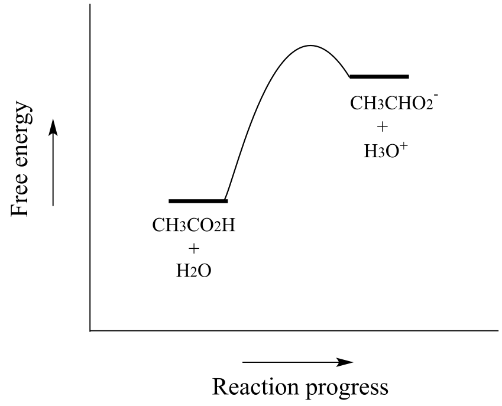

fig 7a

The equilibrium constant Keq is defined as:

fig 8

Remember that this is a dilute aqueous solution: we added a small amount
of acetic acid to a large amount of water. Therefore, in the course of
the reaction, the concentration of water (approximately 55.6 mol/L)
changes very little, and can be treated as a constant.

If we move the constant term for the concentration of water to the left
side of the equilibrium constant expression, we get the expression for
Ka, the acid constant for acetic acid:

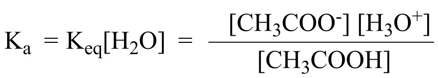

fig 9

In more general terms, the dissociation constant for a given acid HA or
HB+ is expressed as:

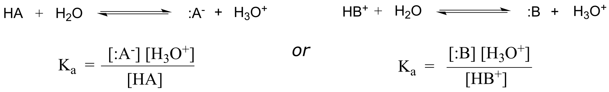

fig 10

The value of Ka for acetic acid is 1.75 x 10-5 -
much less than 1, indicating there is much more acetic acid in solution
at equilibrium than acetate and hydronium ions.

Conversely, sulfuric acid, with a Ka of approximately
109, or hydrochloric acid, with a Ka of
approximately 107, both undergo essentially complete
dissociation in water: they are very strong acids.

A number like 1.75 x 10- 5 is not very easy either to say,
remember, or visualize, so chemists usually use a more convenient term
to express relative acidity. The **pKa** value of an acid is simply the
log (base 10) of its Ka value.

pKa = -log Ka Ka = 10-pKa

Doing the math, we find that the pKa of acetic acid is 4.8. The pKa of
sulfuric acid is

-10, and of hydrochloric acid is -7. The use of pKa values allows us to
express the relative acidity of common compounds and functional groups
on a numerical scale of about –10 (for a very strong acid) to 50 (for a
compound that is not acidic at all). ***The lower the pKa value, the
stronger the acid.***

The ionizable (proton donating or accepting) functional groups relevant
to biological organic chemistry generally have pKa values ranging from
about 5 to about 20. The most important of these are summarized below,
with *very rough* pKa values for the conjugate acid forms. More acidic
groups with pKa values near zero are also included for reference.

**Typical pKa values**

**group *approximate* pKa**

hydronium ion (H3O+) 0

protonated alcohol 0

protonated carbonyl 0

carboxylic acids 5

protonated imines 7

protonated amines 10

phenols 10

thiols 10

alcohols, water 15

α-carbon acids \* 20

*\*α-carbon acids will be explained in section 7.6A*

It is highly recommended to commit these rough values to memory now -
then if you need a more precise value, you can always look it up in a
more complete pKa table. The appendix to this book contains a more
detailed table of typical pKa values, and much more complete tables are
available in resources such as the *Handbook of Chemistry and Physics*.

**  
**

**pKa vs. pH**

It is important to realize that pKa is *not* the same thing as pH: the
former is an inherent property of a compound or functional group, while
the latter is a measure of hydronium ion concentration in a given
aqueous solution:

pH = -log \[H3O+\]

Knowing pKa values not only allows us to compare acid strength, it also
allows us to compare base strength. The key idea to remember is this:
***the stronger the conjugate acid, the weaker the conjugate base*.** We
can determine that hydroxide ion is a stronger base than ammonia
(NH3), because ammonium ion (NH4+, pKa
= 9.2) is a stronger acid than water (pKa = 15.7).

<u>Exercise 7.2</u>: Which is the stronger base,
CH3O- or CH3S-? Acetate ion
or ammonia? Hydroxide ion or acetate ion?

Let's put our understanding of the pKa concept to use in the context of
a more complex molecule. For example, what is the pKa of the compound
below?

fig 11

We need to evaluate the potential acidity of *four* different types of
protons on the molecule, and find the most acidic one. The aromatic
protons are not all acidic - their pKa is about 45. The amine group is
also not acidic, its pKa is about 35. (Remember, uncharged amines are
basic: it is positively-charged *protonated* amines, with pKa values
around 10, that are weakly acidic.) The alcohol proton has a pKa of
about 15, and the phenol proton has a pKa of about 10: thus, the most
acidic group on the molecule above is the phenol. (Be sure that you can
recognize the difference between a phenol and an alcohol - remember, in
a phenol the OH group is bound *directly* to the aromatic ring). If this
molecule were to react with one molar equivalent of a strong base such
as sodium hydroxide, it is the phenol proton which would be donated to
form a phenolate anion.

<u>Exercise 7.3</u>: Identify the most acidic functional group on each
of the molecules below, and give its approximate pKa.

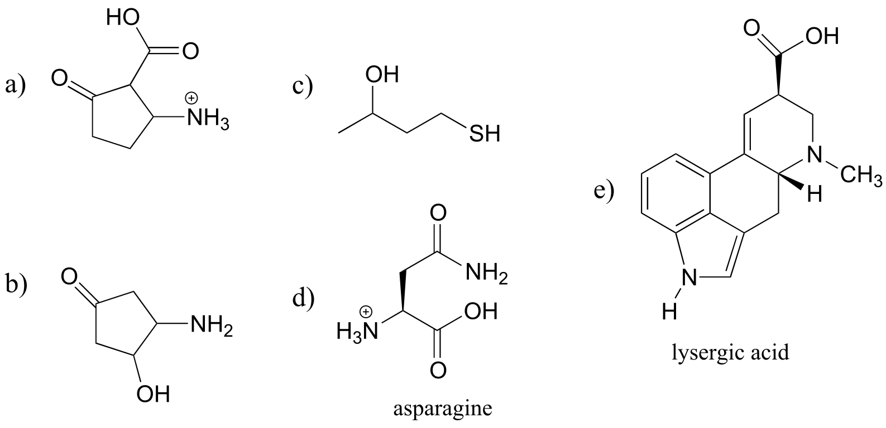

fig 12

### 7.2B: Using pKa values to predict reaction equilibria

By definition, the pKa value tells us the extent to which an acid will
react with water as the base, but by extension we can also calculate the
equilibrium constant for a reaction between any acid-base pair.
Mathematically, it can be shown that:

Keq = 10∆pKa

where ∆pKa = (pKa of product acid minus pKa of reactant acid)

Consider a reaction between methylamine and acetic acid:

fig 13

The first step is to identify the acid species on either side of the
equation, and look up or estimate their pKa values. On the left side,
the acid is of course acetic acid while on the right side the acid is
methyl ammonium ion (in other words, methyl ammonium ion is the acid in
the reaction going from right to left). We can look up the precise pKa
values in table 7 (at the back of the book), but we already know
(because we have this information memorized, right?!) that the pKa of
acetic acids is about 5, and methyl ammonium is about 10. More precise
values are 4.8 and 10.6, respectively.

Without performing any calculations at all, you should be able to see
that this equilibrium lies far to the right-hand side: acetic acid has a
lower pKa, meaning it is a stronger acid than methyl ammonium, and thus
it wants to give up its proton more than methyl ammonium does. Doing the
math, we see that

Keq = 10∆pKa = 10(10.6 – 4.8) =
105.8 = 6.3 x 105

So Keq is a very large number (much greater than 1) and the
equilibrium for the reaction between acetic acid and methylamine lies
far to the right-hand side of the equation, just as we had predicted.
This also tells us that the reaction has a negative Gibbs free energy
change, and is thermodynamically favorable.

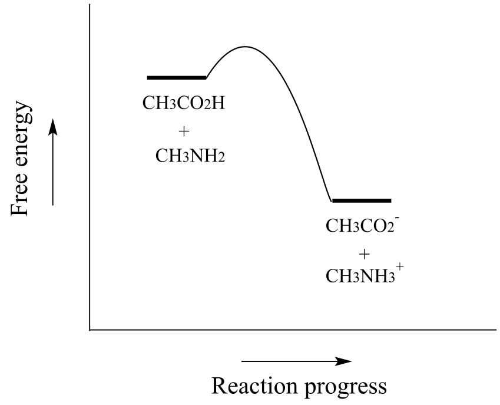

fig 13b

If you had just wanted to quickly approximate the value of Keq without
benefit of precise pKa information or a calculator, you could have
approximated pKa \~ 5 (for the carboxylic acid) and pKa \~10 (for the
ammonium ion) and calculated in your head that the equilibrium constant
should be somewhere in the order of 105.

<u>Exercise 7.4</u> Show the products of the following acid-base
reactions, and roughly estimate the value of Keq.

> 
>
> fig 14

### 7.2C: Organic molecules in buffered solution: the Henderson-Hasselbalch equation

The environment inside a living cell, where most biochemical reactions
take place, is an aqueous buffer with pH \~ 7. Recall from your General
Chemistry course that a buffer is a solution of a weak acid and its
conjugate base. The key equation for working with buffers is the
Henderson-Hasselbalch equation:

**The Henderson-Hasselbalch equation**

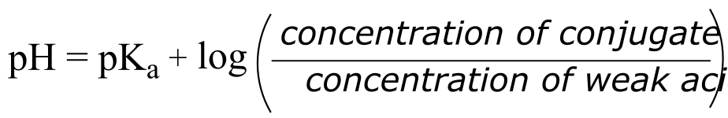

fig 15

The equation tells us that if our buffer is an equimolar solution of a
weak acid and its conjugate base, the pH of the buffer will equal the
pKa of the acid (because the log of 1 is equal to zero). If there is
more of the acid form than the base, then of course the pH of the buffer
is lower than the pKa of the acid.

<u>Exercise 7.5</u>: What is the pH of an aqueous buffer solution that
is 30 mM in acetic acid and 40 mM in sodium acetate? The pKa of acetic
acid is 4.8.

The Henderson-Hasselbalch equation is particularly useful when we want
to think about the protonation state of different biomolecule functional
groups in a pH 7 buffer. When we do this, we are always assuming that
the concentration of the biomolecule is small compared to the
concentration of the buffer components. (The actual composition of
physiological buffer is complex, but it is primarily based on phosphoric
and carbonic acids).

Imagine an aspartic acid residue located on the surface of a protein in
a human cell. Being on the surface, the side chain is in full contact
with the pH 7 buffer surrounding the protein. In what state is the side
chain functional group: the protonated state (a carboxylic acid) or the
deprotonated state (a carboxylate ion)? Using the Henderson-Hasselbalch
equation, we fill in our values for the pH of the buffer and a rough pKa
approximation of pKa = 5 for the carboxylic acid functional group. Doing
the math, we find that the ratio of carboxylate to carboxylic acid is
about 100 to 1: the carboxylic acid is almost completely ionized (in the
deprotonated state) inside the cell. This result extends to all other
carboxylic acid groups you might find on natural biomolecules or drug
molecules: in the physiological environment, carboxylic acids are almost
completely deprotonated.

Now, let's use the equation again, this time for an amine functional
group, such as the side chain of a lysine residue: inside a cell, are we
likely to see a neutral amine (R-NH2) or an ammonium cation
(R-NH3+?) Using the equation with pH = 7 (for the
biological buffer) and pKa = 10 (for the ammonium group), we find that
the ratio of neutral amine to ammonium cation is about 1 to 100: the
group is close to completely protonated inside the cell, so we will see
R-NH3+, not R-NH2.

We can do the same rough calculation for other common functional groups
found in biomolecules.

**At physiological pH:**

Carboxylic acids are deprotonated (in the carboxylate anion form)

Amines are protonated (in the ammonium cation form)

Thiols, phenols, alcohols, and amides are uncharged

Imines are a mixture of the protonated (cationic) and deprotonated
(neutral) states.

We will talk about the physiological protonation state of phosphate
groups in chapter 9.

<u>Exercise 7.6</u>: The molecule below is not drawn in the protonation
state that we would expect to see it at physiological pH. Redraw it in
the physiologically relevant protonation state.

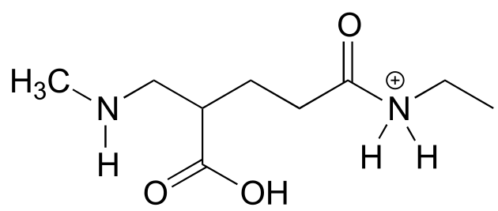

fig 16

While we are most interested in the state of molecules at pH 7, the
Henderson-Hasselbalch equation can of course be used to determine the
protonation state of functional groups in solutions buffered to other pH
levels. The exercises below provide some practice in this type of
calculation.

<u>Exercise 7.7</u>: What is the ratio of acetate ion to neutral acetic
acid when a small amount of acetic acid (pKa = 4.8) is dissolved in a
buffer of pH 2.8? pH 3.8? pH 4.8? pH 5.8? pH 6.8?

<u>Exercise 7.8</u>: Would you expect phenol to be soluble in an aqueous
solution buffered to pH 2? pH 7? pH 12? Explain your answer.

<u>Exercise 7.9</u>: Methylamine is dissolved in a pH 9.0 buffer. What
percent of the solute molecules are charged? What is the average charge
on solute molecules?

<u>Exercise 7.10</u>: What is the approximate net charge on a
tetrapeptide Cys-Asp-Lys-Glu in pH 7 buffer?

## Section 7.3: Structural effects on acidity and basicity

Now that we know how to quantify the strength of an acid or base, our
next job is to gain an understanding of the fundamental reasons behind
*why* one compound is more acidic or more basic than another. This is a
big step: we are, for the first time, taking our knowledge of organic
*structure* and applying it to a question of organic *reactivity*. Many
of the ideas that we’ll see for the first here will continue to apply
throughout the book as we tackle many other organic reaction types.

### 7.3A: Periodic trends

First, we will focus on individual atoms, and think about trends
associated with the position of an element on the periodic table. We’ll
use as our first models the simple organic compounds ethane,
methylamine, and ethanol, but the concepts apply equally to more complex
biomolecules with the same functionalities, for example the side chains
of the amino acids alanine (alkane), lysine (amine), and serine
(alcohol).

**  
**

**Horizontal periodic trend in acidity and basicity**

fig 17

We can see a clear trend in acidity as we move from left to right along
the second row of the periodic table from carbon to nitrogen to oxygen.
The key to understanding this trend is to consider the hypothetical
conjugate base in each case*: the more stable (weaker) the conjugate
base, the stronger the acid*. Look at where the negative charge ends up
in each conjugate base. In the conjugate base of ethane, the negative
charge is borne by a carbon atom, while on the conjugate base of
methylamine and ethanol the negative charge is located on a nitrogen and
an oxygen, respectively. Remember from section 2.4A that
electronegativity also increases as we move from left to right along a
row of the periodic table, meaning that oxygen is the most
electronegative of the three atoms, and carbon the least.

*The more electronegative an atom, the better able it is to bear a
negative charge. Weaker bases have negative charges on more
electronegative atoms; stronger bases have negative charges on less
electronegative atoms.*

Thus, the methoxide anion is the most stable (lowest energy, least
basic) of the three conjugate bases, and the ethyl carbanion anion is
the least stable (highest energy, most basic). Conversely, ethanol is
the strongest acid, and ethane the weakest acid.

When moving vertically within a given column of the periodic table, we
again observe a clear periodic trend in acidity. This is best
illustrated with the haloacids and halides: basicity, like
electronegativity, increases as we move up the column.

**  
**

**Vertical periodic trend in acidity and basicity**

fig 18

Conversely, acidity in the haloacids increases as we move *down* the
column.

In order to make sense of this trend, we will once again consider the
stability of the conjugate bases. Because fluorine is the most
electronegative halogen element, we might expect fluoride to also be the
least basic halogen ion. But in fact, it is the *least* stable, and the
most basic! It turns out that when moving vertically in the periodic
table, the *size* of the atom trumps its electronegativity with regard
to basicity. The atomic radius of iodine is approximately twice that of
fluorine, so in an iodide ion, the negative charge is spread out over a
significantly larger volume:

fig 19

This illustrates a fundamental concept in organic chemistry:

*Electrostatic charges, whether positive or negative, are more stable
when they are ‘spread out’ over a larger area.*

We will see this idea expressed again and again throughout our study of
organic reactivity, in many different contexts. For now, we are applying
the concept only to the influence of atomic radius on base strength.
Because fluoride is the least stable (most basic) of the halide
conjugate bases, HF is the least acidic of the haloacids, only slightly
stronger than a carboxylic acid. HI, with a pKa of about -9, is almost
as strong as sulfuric acid.

More importantly to the study of biological organic chemistry, this
trend tells us that ***thiols are more acidic than alcohols***. The
pKa of the thiol group on the cysteine side chain, for
example, is approximately 8.3, while the pKa for the alcohol group on
the serine side chain is on the order of 17.

Remember the concept of 'driving force' that was introduced in section
6.2A? Recall that the driving force for a reaction is usually based on
two factors: relative charge stability, and relative total bond energy.
Let's see how this applies to a simple acid-base reaction between
hydrochloric acid and fluoride ion:

HCl + F- → HF + Cl-

We know that HCl (pKa -7)
is a stronger acid than HF (pKa 3.2), so the equilibrium for the
reaction lies on the product side: the reaction is exergonic, and a
'driving force' pushes reactant to product.

What explains this driving force? Consider first the charge factor: as
we just learned, chloride ion (on the product side) is more stable than
fluoride ion (on the reactant side). This partially accounts for the
driving force going from reactant to product in this reaction: we are
going from less stable ion to a more stable ion.

What about total bond energy, the other factor in driving force? If you
consult a table of bond energies, you will see that the H-F bond on the
product side is more energetic (stronger) than the H-Cl bond on the
reactant side: 570 kJ/mol vs 432 kJ/mol, respectively). This also
contributes to the driving force: we are moving from a weaker (less
stable) bond to a stronger (more stable) bond.

### 7.3B: Resonance effects

In the previous section we focused our attention on periodic trends -
the differences in acidity and basicity between groups where the
exchangeable proton was bound to different elements. Now, it is time to
think about how the structure of different organic groups contributes to
their relative acidity or basicity, even when we are talking about *the
same element acting as the proton donor/acceptor*. The first model pair
we will consider is ethanol and acetic acid, but the conclusions we
reach will be equally valid for all alcohol and carboxylic acid groups.

Despite the fact that they are both oxygen acids, the pKa values of
ethanol and acetic acid are strikingly different. What makes a
carboxylic acid so much more acidic than an alcohol? As before, we begin
by considering the stability of the conjugate bases, remembering that a
more stable (weaker) conjugate base corresponds to a stronger acid.

fig 20

In both species, the negative charge on the conjugate base is located on
oxygen, so periodic trends cannot be invoked. For acetic acid, however,
there is a key difference: two resonance contributors can be drawn for
the conjugate base, and the negative charge can be delocalized (shared)
over two oxygen atoms. In the ethoxide ion, by contrast, the negative
charge is localized, or ‘locked’ on the single oxygen – it has nowhere
else to go. This makes the ethoxide ion much less stable.

Recall the important general statement that we made a little earlier:
'Electrostatic charges, whether positive or negative, are more stable
when they are ‘spread out’ than when they are confined to one location.'
Now, we are seeing this concept in another context, where a charge is
being ‘spread out’ (in other words, delocalized) *by resonance*, rather
than simply by the size of the atom involved.

The delocalization of charge by resonance has a very powerful effect on
the reactivity of organic molecules, enough to account for the
difference of over 12 pKa units between ethanol and acetic acid (and
remember, pKa is a log expression, so we are talking about a factor of
1012 between the Ka values for the two molecules!)

The resonance effect also nicely explains why a nitrogen atom is basic
when it is in an amine, but *not* basic when it is part of an amide
group. Recall that in an amide, there is significant double-bond
character to the carbon-nitrogen bond, due to a minor but still
important resonance contributor in which the nitrogen lone pair is part
of a π bond.

fig 21

Whereas the lone pair of an amine nitrogen is ‘stuck’ in one place, the
lone pair on an amide nitrogen is delocalized by resonance. Notice that
in this case, we are extending our central statement to say that
*electron density* – in the form of a lone pair – is stabilized by
resonance delocalization, even though there is not a negative charge
involved. Here’s another way to think about it: the lone pair on an
amide nitrogen is not available for bonding with a proton – these two
electrons are too ‘comfortable’ being part of the delocalized π-bonding
system. The lone pair on an amine nitrogen, by contrast, is not so
comfortable - it is *not* part of a delocalized π system, and is
available to form a bond with any acidic proton that might be nearby.

If an amide group is protonated, it will be at the oxygen rather than
the nitrogen.

<u>Exercise 7.11:</u>

a\) Draw the Lewis structure of nitric acid, HNO3.

b\) Nitric acid is a strong acid - it has a pKa of -1.4. Make a
structural argument to account for its strength. Your answer should
involve the structure of the conjugate base of nitric acid.

<u>Exercise 7.12</u>: Rank the compounds below from most acidic to least
acidic, and explain your reasoning.

fig 22

<u>Exercise 7.13</u> (challenging): Often it requires some careful
thought to predict the most acidic proton on a molecule. Ascorbic acid,
also known as Vitamin C, has a pKa of 4.1 - the fact that this is in the
range of carboxylic acids suggest to us that the negative charge on the
conjugate base can be delocalized by resonance to *two* oxygen atoms.
Which if the four OH protons on the molecule is most acidic? Draw the
structure of ascorbate, the conjugate base of ascorbic acid, then draw a
second resonance contributor showing how the negative charge is
delocalized to a second oxygen atom. Hint - try deprotonating each OH
group in turn, then use your resonance drawing skills to figure out
whether or not delocalization of charge can occur.

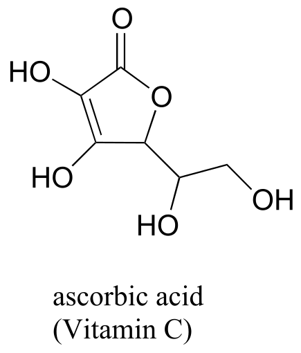

fig 23

### 7.3C: Inductive effects

Compare the pKa values of acetic acid and its mono-, di-, and
tri-chlorinated derivatives:

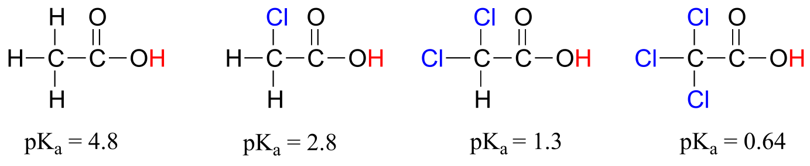

fig 24

The presence of the chlorine atoms clearly increases the acidity of the
carboxylic acid group, but the argument here does not have to do with
resonance delocalization, because no additional resonance contributors
can be drawn for the chlorinated molecules. Rather, the explanation for
this phenomenon involves something called the **inductive effect**. A
chlorine atom is more electronegative than a hydrogen, and thus is able
to ‘induce’, or ‘pull’ electron density towards itself, away from the
carboxylate group. In effect, the chlorine atoms are helping to further
spread out the electron density of the conjugate base, which as we know
has a stabilizing effect. In this context, the chlorine substituent can
be referred to as an **electron-withdrawing group**. Notice that the
pKa-lowering effect of each chlorine atom, while significant, is not as
dramatic as the delocalizing resonance effect illustrated by the
difference in pKa values between an alcohol and a carboxylic acid. In
general, *resonance effects are more powerful than inductive effects*.

Because the inductive effect depends on electronegativity, fluorine
substituents have a more pronounced pKa-lowered effect than chlorine
substituents.

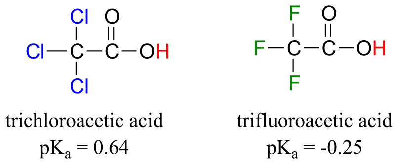

fig 25

In addition, the inductive takes place through covalent bonds, and its
influence decreases markedly with distance – thus a chlorine two carbons
away from a carboxylic acid group has a decreased effect compared to a
chlorine just one carbon away.

fig 26

<u>Exercise 7.14</u>: Rank the compounds below from most acidic to least
acidic, and explain your reasoning.

fig 27

## Section 7.4: Acid-base properties of phenols

Resonance effects involving aromatic structures can have a dramatic
influence on acidity and basicity. Notice, for example, the difference
in acidity between phenol and cyclohexanol.

fig 28

Looking at the conjugate base of phenol, we see that the negative charge
can be delocalized by resonance to three different carbons on the
aromatic ring.

fig 29

Although these are all minor resonance contributors (negative charge is
placed on a carbon rather than the more electronegative oxygen), they
nonetheless have a significant effect on the acidity of the phenolic
proton. Essentially, the benzene ring is acting as an
electron-withdrawing group by resonance.

As we begin to study in detail the mechanisms of biological organic
reactions, we’ll see that the phenol side chain of the amino acid
tyrosine (see table 5 at the back of the book), with its relatively
acidic pKa of 9-10, often acts as a catalytic proton donor/acceptor in
enzyme active sites.

<u>Exercise 7.15</u>: Draw the conjugate base of 2-napthol (the major
resonance contributor), and on your drawing indicate with arrows all of
the atoms to which the negative charge can be delocalized by resonance.

> 

fig 30

The base-stabilizing effect of an aromatic ring can be accentuated by
the presence of an additional electron-withdrawing substituent, such as
a carbonyl. For the conjugate base of the phenol derivative below, an
additional resonance contributor can be drawn in which the negative
formal charge is placed on the carbonyl oxygen.

fig 31

Now the negative charge on the conjugate base can be spread out over
*two* oxygens (in addition to three aromatic carbons). The phenol acid
therefore has a pKa similar to that of a carboxylic acid, where the
negative charge on the conjugate base is also delocalized to two oxygen
atoms. The ketone group is acting as an electron withdrawing group - it
is 'pulling' electron density towards itself, through both inductive and
resonance effects.

<u>Exercise 7.16</u>: The position of the electron-withdrawing
substituent relative to the phenol hydroxyl is very important in terms
of its effect on acidity. Which of the two substituted phenols below is
more acidic? Use resonance drawings to explain your answer.

fig 32a

<u>Exercise 7.17</u>: Rank the four compounds below from most acidic to
least.

fig 32

<u>Exercise 7.18</u>: Nitro groups are very powerful
electron-withdrawing groups. The phenol derivative picric acid has a pKa
of 0.25, lower than that of trifluoroacetic acid.

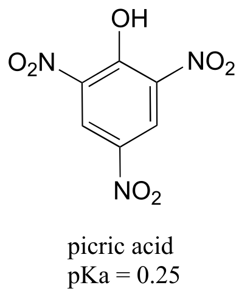

Use a resonance argument to explain why picric acid has such a low pKa.

Consider the acidity of 4-methoxyphenol, compared to phenol.

fig 34

Notice that the methoxy group increases the pKa of the phenol group - it
makes it *less* acidic. Why is this? At first inspection, you might
assume that the methoxy substituent, with its electronegative oxygen,
would be an electron-withdrawing group by induction. That is correct,
but only to a point. The oxygen atom does indeed exert an
electron-withdrawing inductive effect, but the lone pairs on the oxygen
cause the exact opposite effect – *the methoxy group is an
**electron-donating group by resonance***. A resonance contributor can
be drawn in which a formal negative charge is placed on the carbon
adjacent to the negatively-charged phenolate oxygen.

fig 35

Because of like-charge repulsion, this *destabilizes* the negative
charge on the phenolate oxygen, making it more basic. It may help to
visualize the methoxy group ‘pushing’ electrons towards the lone pair
electrons of the phenolate oxygen, causing them to be less 'comfortable'
and more reactive.

**When resonance and induction compete, resonance usually wins!**

The example above is a somewhat confusing but quite common situation in
organic chemistry - a functional group, in this case a methoxy group, is
exerting both an inductive effect and a resonance effect, *but in
opposite directions* (the inductive effect is electron-withdrawing, the
resonance effect is electron-donating). As stated earlier, as a general
rule a resonance effect is more powerful than an inductive effect - so
overall, the methoxy group is acting as an electron donating group.

<u>Exercise 7.19</u>: Rank the three compounds below from lowest pKa to
highest, and explain your reasoning. *Hint* - think about both resonance
and inductive effects!

f ig 36

## Section 7.5: Acid-base properties of nitrogen-containing functional groups

Many of the acid-base reactions we will see throughout our study of
biological organic chemistry involve functional groups which contain
nitrogen. In general, a nitrogen atom with three bonds and a lone pair
of electrons can potentially act as a proton-acceptor (a base) - but
basicity is reduced if the lone pair electrons are stabilized somehow.
We already know that amines are basic, and that the pKa for a protonated
amine is in the neighborhood of 10. We also know that, due to resonance
with the carbonyl bond, amide nitrogens are not basic (in fact they are
very slightly acidic, with a pKa around 20).

fig 38

Next, let's consider the basicity of some other nitrogen-containing
functional groups.

### 7.5A: Anilines 

Aniline, the amine analog of phenol, is substantially less basic than an
amine.

fig 39

We can use the same reasoning that we used when comparing the acidity of
a phenol to that of an alcohol. In aniline, the lone pair on the
nitrogen atom is stabilized by resonance with the aromatic π system,
making it less available for bonding and thus less basic.

fig 40

<u>Exercise 7.20</u>: With anilines just as with phenols, the resonance
effect of the aromatic ring can be accentuated by the addition of an
electron-withdrawing group, and diminished by the addition of an
electron-donating group. Which of the two compounds below is expected to
be more basic? Use resonance drawings to explain your reasoning.

### 7.5B: Imines

Imines are somewhat less basic than amines: pKa for a protonated imine
is in the neighborhood of 5-7, compared to \~10 for protonated amines.
Recall that an imine functional group is characterized by an
*sp2*-hybridized nitrogen double-bonded to a carbon.

fig 41

The lower basicity of imines compared to amines can be explained in the
following way:

- The lone pair electrons on an imine nitrogen occupy an
  *sp2* hybrid orbital, while the lone pair electrons on an
  amine nitrogen occupy an *sp3* hybrid orbital.

- *sp2* orbitals are composed of one part *s* and two parts
  *p* atomic orbitals, meaning that they have about 33% *s* character.
  *sp*3 orbitals, conversely, are only 25% *s* character (one
  part *s*, three parts *p*).

- An *s* atomic orbital holds electrons closer to the nucleus than a *p*
  orbital, thus *s* orbitals are more electronegative than *p* orbitals.
  Therefore, sp2 hybrid orbitals, with their higher
  *s*-character, are more electronegative than *sp3* hybrid
  orbitals.

- Lone pair electrons in the more electronegative *sp2*
  hybrid orbitals of an imine are held more tightly to the nitrogen
  nucleus, and are therefore less 'free' to break away and form a bond
  to a proton - in other words, they are less basic.

The aromatic compound pyridine, with an imine nitrogen, has a pKa of
5.3. Recall from section 2.2C that the lone pair electrons on the
nitrogen atom of pyridine occupy an *sp2*-hybrid orbital, and
are *not* part of the aromatic sextet - thus, they are available for
bonding with a proton.

> 

fig 42

### 7.5C: Pyrrole

In the aromatic ring of pyrrole, the nitrogen lone pair electrons *are*
part of the aromatic sextet, and are therefore much less available for
forming a new bonding to a proton. Pyrrole is a very weak base: the
conjugate acid is a strong acid with a pKa of 0.4.

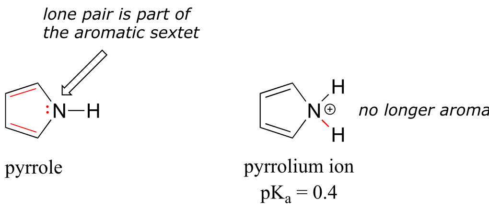

fig 43

Below is a summary of the five common bonding arrangements for nitrogen
and their relative basicity:

| **nitrogen group** | **structure**                               | **pKa of conjugate acid**          |
|--------------------|---------------------------------------------|------------------------------------|
| amide              |   | NA (amide nitrogens are not basic) |
| amine              |   | \~ 10                              |
| imine              |   | \~ 5 - 7                           |
| aniline            |   | \~ 5                               |
| pyrrole            |   | \~ 0                               |

fig 44

Learning and being able to recognize these five different 'types' of
nitrogen can be very helpful in making predictions about the reactivity
of a great variety of nitrogen-containing biomolecules. The side chain
of the amino acid tryptophan, for example, contains a non-basic
'pyrrole-like' nitrogen (the lone pair electrons are part of the
10-electron aromatic system), and the peptide chain nitrogen, of course,
is an amide. The nucleotide base adenine contains three types of
nitrogen.

.

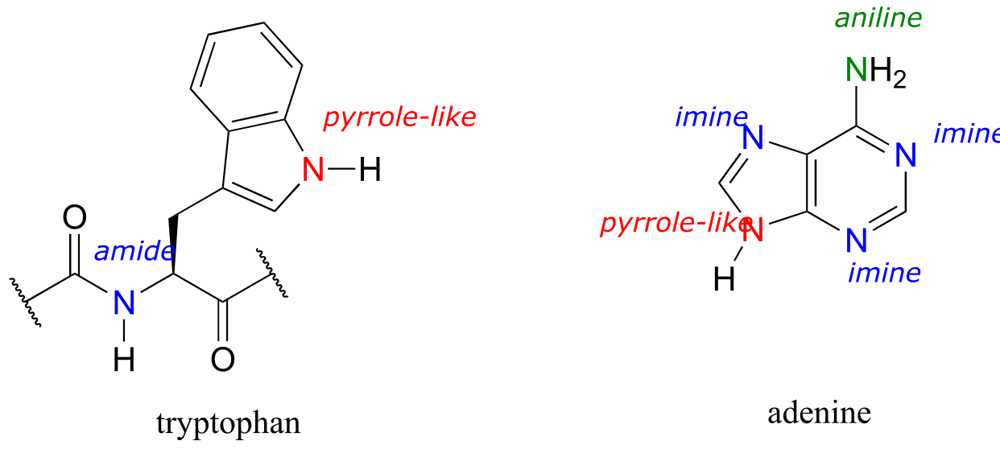

fig 45

The side chain on a histidine amino acid has both a 'pyrrole-like'
nitrogen and an imine nitrogen. The pKa of a protonated histidine
residue is approximately 7, meaning that histidine will be present in
both protonated and deprotonated forms in physiological buffer.
Histidine residues in the active site of enzymes are common proton
donor-acceptor groups in biochemical reactions.

fig 46

<u>Exercise 7.21</u>: Below are the structures of four 'coenzyme'
molecules necessary for human metabolism (we will study the function of
all of these in chapter 17).

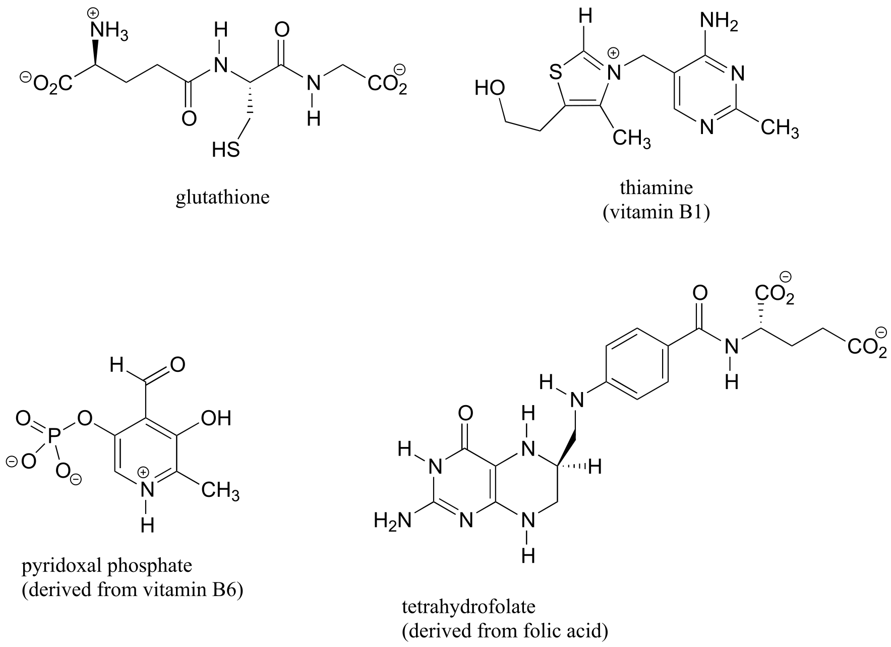

fig 47

a\) When appropriate, assign a label to each nitrogen atom using the
basicity classifications defined in this section ('pyrrole-like', etc.).

b\) There is one nitrogen that does not fall into any of these types -
is it basic? Why or why not? What would be a good two-word term to
describe the group containing this nitrogen?

## Section 7.6: Carbon acids 

So far, we have limited our discussion of acidity and basicity to
heteroatom acids, where the acidic proton is bound to an oxygen,
nitrogen, sulfur, or halogen. However, **carbon acids** - in which the
proton to be donated is bonded to a carbon atom - play an integral role
in biochemistry.

### 7.6A: The acidity of α-protons

A hydrogen on an alkane is not at all acidic – its pKa is somewhere on
the order of 50, about as non-acidic as it gets in the organic chemistry
world. The reason for this is that if the hydrogen were to be
abstracted, the electrons from the broken bond would be localized on a
single carbon atom.

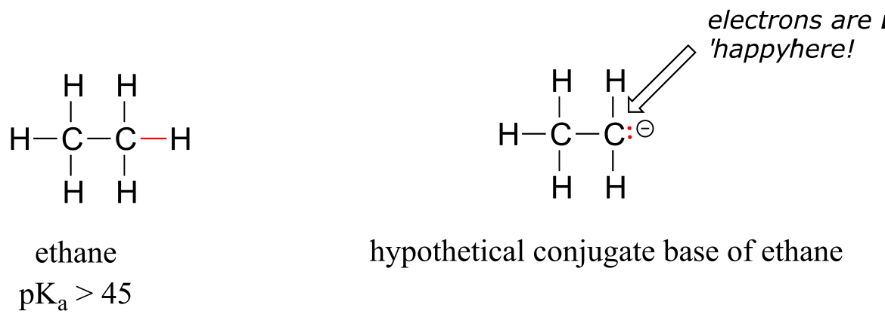

fig 48

Because carbon is not electronegative and is terrible at holding a
negative charge, such carbanion species are extremely unstable.

How, then, can a proton bonded to a carbon be acidic? Remember that an
acid becomes stronger if the conjugate base is stabilized, an in
particular if the negative charge on the conjugate base can be
delocalized to an electronegative atom such as an oxygen. This is
possible when a carbon is located adjacent to a carbonyl group.
Consider, for example, the conjugate base of acetone.

fig 49

One resonance contributor puts the negative charge on the carbon \#1.
Due to the presence of the adjacent carbonyl group, however, a second
resonance contributor can be drawn in which the negative charge is
located on the carbonyl oxygen, where it is much more stable. This type
of stabilized carbanion species is specifically referred to as an
**enolate**. Acetone is in fact weakly acidic, with a pKa of about 19.
The importance of the position of the carbonyl group is evident when we
consider 2-butanone: here, the protons on carbons \#1 and \#3 are
somewhat acidic (in the neighborhood of pKa = 20), but the protons on
carbon \#4 are not acidic at all, because carbon \#4 is not adjacent to
the carbonyl.

fig 50

A carbon that is located next to a carbonyl group is referred to as an
**α-carbon**, and any proton bound to it is an **α-proton**. In
2-butanone, carbons \#1 and \#3 are α-carbons, and their five protons
are α-protons. Carbon \#4 is a **β-carbon**, as it is two positions
removed from the carbonyl carbon

An **active methylene** is a carbon in the α position relative to *two*
carbonyl groups rather than just one. Protons on active methylene
carbons are more acidic than other α-protons, because the charge on the
conjugate base can be localized to *two* different oxygen atoms, not
just one. This keto-ester compound, for example, has a pKa of
approximately 11, close to that of phenol.

fig 51

As we alluded to above, the acidity of α-protons is an extremely
important concept in biological organic chemistry. Look through a
biochemistry textbook, and you will see reaction after reaction in which
the first mechanistic step is the abstraction of an α-proton to form an
enolate intermediate. Two chapters in this book (chapters 12 and 13) are
devoted to such reactions, and the initial proton-extraction step of
three example reactions are previewed below. Reaction A is from fatty
acid oxidation, while reactions B and C are both part of carbohydrate
metabolism.

> 

fig 52

<u>Exercise 7.22</u>: For each molecule shown below,

a\) Show the location of all α-protons.

b\) Draw the structure(s) of all possible enolate conjugate bases.

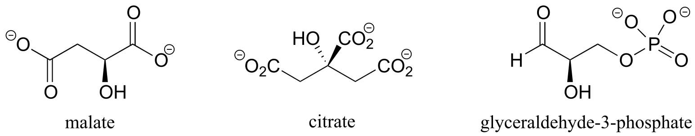

fig 53

### 7.6B: Keto-enol tautomers

An enolate ion can, of course, be reprotonated at the α-carbon to return
the molecule to the ketone or aldehyde form. An alternate possibility is
that the oxygen atom, rather than the α-carbon, could be protonated. The
species that results from this step is referred to as an **enol** (this
term reflects the fact that an enol contains structural elements of both
an akl**en**e and an alcoh**ol**).

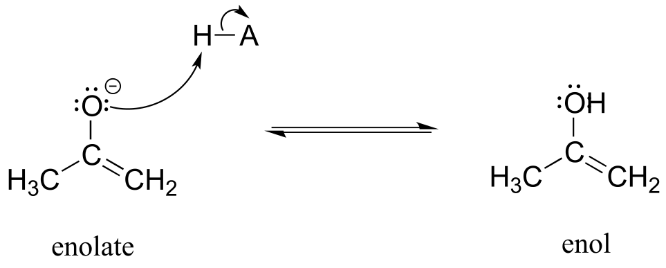

fig53c

In fact, most ketones and aldehydes exist in rapid equilibrium with
their enol form. A ketone/aldehyde and its corresponding enol are
**tautomers**: a pair of constitutional isomers which can be rapidly and
reversibly interconverted, and which vary in terms of the site of
protonation and location of a double bond. As we will see going forward,
**tautomerization** - the interconversion of two tautomers - is a
ubiquitous step in biological organic chemistry. Often, when discussing
tautomerization, the ketone (or aldehyde) isomer is referred as the
**keto** form.

As a general rule, the keto form is lower in energy than the
corresponding enol form, and thus the keto form predominates at
equilibrium. Acetone, for example, is present at \>99% keto form at
equilibrium, and the enol form at less than 1%.

fig 53e

The 'driving force' for the enol to keto conversion can be understood in
terms of the energies of the three bonds involved in the process: the
sum of the three bond energies is about 48 kJ/mol greater in the keto
form than in the enol form.

fig 53d

<u>Exercise 7.23</u>: Draw all of the possible enol forms of the
following aldehydes/ketones.

a\) 3-pentanone

b\) acetaldehyde (IUPAC name ethaldehyde)

c\) cyclohexanone

d\) 2-pentanone

<u>Exercise 7.24</u>: Draw three examples of aldehyde or ketone
compounds for which there is no possible enol form.

<u>Exercise 7.25</u>: In some special cases, the enol form of a compound
is more stable than the keto form and thus predominates at equilibrium.
Curcumin is the compound mainly responsible for the characteristic
yellowish color of tumeric, a ubiquitous spice in south/southeast asian
cuisine. The extended system of π bonds present in the enol form causes
it to be lower in energy than the tautomer in which there are two ketone
groups (called the diketo form). Draw the diketo form of curcumin, and
explain how the conjugated π system is disrupted.

fig 53a

<u>Exercise 7.26</u>: The phenol functional group can also be thought of
a kind of enol.

a\) Draw the 'keto' form of phenol.

b\) The 'keto' form of phenol is highly disfavored compared to the
'enol' form - why?

Keto-enol tautomerization steps can be found in many biochemical
reactions. For example, there is an enol to keto tautomerization step in
the glycolysis reaction catalyzed by pyruvate kinase (EC 2.7.1.40).
Shown below is just the tautomerization part of this reaction; we will
see the complete reaction in chapter 9.

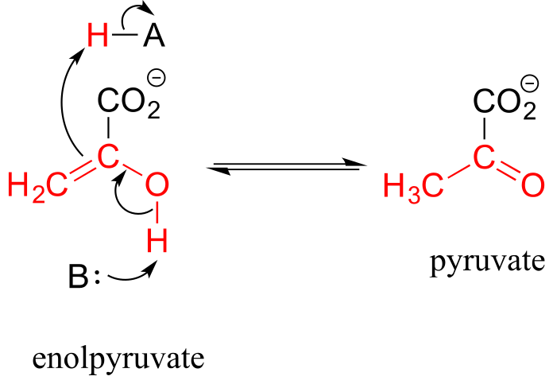

fig 53b

### 7.6C: Imine-enamine tautomers

Another common tautomeric relationship in biological organic chemistry
is the equilibrium between imines (also known as Schiff bases) and
**enamines**, which are essentially the nitrogen equivalents of enols.

Mechanism for imine - enamine tautomerization

fig 54a

The degradation of serine, for example, involves an enamine to imine
tautomerization step: (EC 4.2.1.13)

fig 54b

<u>Exercise 7.27</u>: The structures below all contain either an imine
or an enamine group. For each, draw the structure of an alternate
tautomer.

fig 54c

### 7.6D: Acidity of terminal alkynes

Terminal alkynes are another kind of carbon acid which are relevant more
to laboratory organic chemistry than to biological chemistry.

fig 54

Terminal alkynes are more acidic than alkenes or alkanes for the same
reason that protonated imines are more acidic than protonated amines:
the alkyne carbon is *sp*-hybridized, meaning that it has 50%
*s*-orbital character and is therefore more electronegative. With a pKa
of approximately 26, alkynes are only weakly acidic, but nonetheless can
be fully deprotonated through the use of a strong base such as sodium
amide (NaNH2).

<u>Exercise 7.28</u>: Hydrogen cyanide, HCN, is another example of a
relatively strong carbon acid, with a pKa of 9.2. Suggest a rationale
for the acidity of this proton.

## Section 7.7: Polyprotic acids

Polyprotic acids are capable of donating more than one proton. The most
important polyprotic acid group from a biological standpoint is
triprotic phosphoric acid. Because phosphoric acid has three acidic
protons, it also has three pKa values.

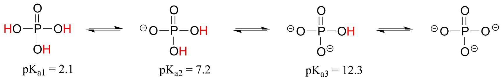

fig 55

The pKa values for any polyprotic acid always get progressively higher,
because it becomes increasingly difficult to stabilize the additional
electron density that results from each successive proton donation.
H3PO4 is a strong acid because the (single)
negative charge on its conjugate base
H2PO4- can be delocalized over two
oxygen atoms.

H2PO4- is substantially less acidic,
because proton donation now results in the formation of an additional
negative charge: a –2 charge is inherently higher in energy than a –1
charge because of negative-negative electrostatic repulsion. The third
deprotonation, resulting in formation of a third negative charge, has an
even higher pKa. We will have more to say about the acidity of phosphate
groups in chapter 9, when we study the reactions of phosphate groups on
biomolecules.

<u>Exercise 7.29</u>: In a buffer at physiological pH, what form(s) of
phosphoric acid predominate? What is the average net charge?

Free amino acids are polyprotic, with pKa values of approximately 2 for
the carboxylic acid group and 9-10 for the ammonium group. Alanine, for
example, has the acid constants pKa1 = 2.3 and
pKa2 = 9.9.

fig 56

The Henderson-Hasselbalch equation tells us that alanine is almost fully
protonated and positively charged when dissolved in a solution that is
buffered to pH 0.5. At pH 7, alanine has lost one proton from the
carboxylic acid group, and thus is a **zwitterion** (it has both a
negative and a positive formal charge). At pH levels above 12, the
ammonium group is fully deprotonated, and alanine has a negative overall
charge.

Some amino acids (arginine, lysine, aspartate, glutamate, tyrosine, and
histidine) are triprotic, with a third pKa value associated with an
ionizable functional group on the side chain.

Many biological organic molecules have several potentially ionizable
functional groups and thus can be considered polyprotic acids. Citric
acid, found in abundance in oranges, lemons, and other citrus fruits,
has three carboxylic acid groups and pKa values of 3.1, 4.8, and 6.4.

## Section 7.8: Effects of enzyme microenvironment on acidity and basicity

Virtually all biochemical reactions take place inside the active site
pocket of an enzyme, rather than free in aqueous solution. The
**microenvironment** inside an enzyme's active site can often be very
different from the environment outside in the aqueous solvent. Consider,
for example, the side chain carboxylate on an aspartate residue in an
enzyme. The literature pKa of this carboxylic acid group is listed as
3.9, but this estimate assumes that the group is positioned on the
surface of the protein, exposed to water. In the physiological buffer of
pH \~ 7, a carboxylic acid group with pKa = 3.9 will be fully
deprotonated and negatively charged. If, however, an aspartate side
chain happens to be buried deep inside the interior of the protein’s
active site, and is surrounded primarily by nonpolar side chains such as
alanine, phenylalanine, tryptophan, etc., the situation is very
different.

fig 59

Cut off from the environment of the bulk solvent, the carboxylate group
(red in the above figure) is now in a very nonpolar microenvironment, a
situation in which the protonated, uncharged state is stabilized
relative to the deprotonated, negatively charged state (this is simply
another application of the 'like dissolves like' principle you learned
in General Chemistry - a charged group is highly destabilized by a
nonpolar environment). The overall effect is that the pKa for this
aspartate residue is actually higher than 3.9 – it is less acidic, and
more likely to be in its protonated form inside the protein.

A similar effect would be observed in a situation where the side chain
carboxylate groups of two aspartate residues are located in close
proximity to one another in an enzyme active site. Two negatively
charged groups close to each other represents a very high energy,
repulsive situation, and this can be relieved if one of the two side
chains is protonated.

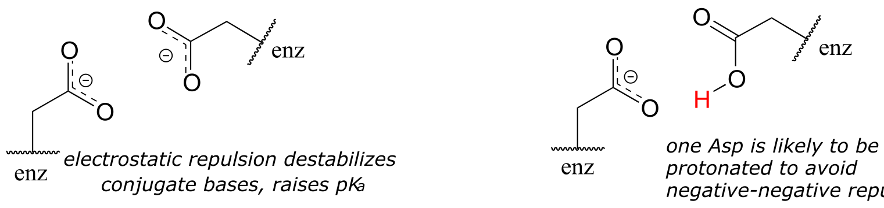

fig 60

In this microenvironment, the proximity of one amino acid group directly
effects the pKa of its neighbor.

Now consider a situation where a metal ion such as magnesium
(Mg+2) or zinc (Zn+2) is bound in the interior of
the enzyme, in close contact with an aspartate side chain. With a cation
to interact with, the anionic, deprotonated state of the amino acid is
stabilized, so the pKa of this Asp residue is likely to be substantially
*lower* than 3.9.

fig 61

The metal ion in this situation is considered to be acting as a Lewis
acid, accepting electron density from the carboxylate group.

The pKa-lowering effect of a metal cation can be dramatic – it has been
estimated that a water molecule coordinated to a Cu+2 or
Zn+2 ion can have a pKa as low as 7 (compare this to the
‘normal’ water pKa of 15.7!) (*J. Am. Chem. Soc.* **1984**,
*106*, 630.)

<u>Exercise 7.30</u>: A lysine residue located deep in the interior of a
protein is surrounded by nonpolar residues. In what direction will this
alter the 'normal' pKa of the lysine side chain, and why?

<u>Exercise 7.31</u>: In many biochemical reactions which involve the
formation of an enolate intermediate, the carbonyl oxygen of the
substrate is coordinated to a divalent metal ion (usually zinc or
magnesium) in the active site. Explain, with structural drawings, how
this ion-dipole interaction effects the acidity of the α-protons of
dihydroxyacetone phosphate (DHAP), an intermediate compound in the
glycolysis pathway.

>  style="width:1.49097in;height:1.49097in" />

fig 62

[Video tutorials: organic acid-base
chemistry](https://www.khanacademy.org/science/organic-chemistry/organic-structures/acid-base-review/v/acid-base-lewis-bronsted-lowry)~~  
~~**<u>Summary of key concepts</u>**

*Before you move on to the next chapter, you should:*

Know the **Bronsted-Lowry** **definition of acidity and** basicity: a
Bronsted acid is a proton donor, a Bronsted base is a proton acceptor.

Know the **Lewis definition of acidity and basicity**: a Lewis acid is
an electron acceptor, a Lewis base is an electron donor.

Understand that the Lewis definition is broader: all Bronsted acids are
also Lewis acids, but not all Lewis acids are also Bronsted acids.

Be able to draw a curved arrow mechanism for both Bronsted and Lewis
acid-base reactions.

Know the expressions for **Ka** and **pKa**.

Commit to memory the approximate pKa values for the following functional
groups:

H3O+, protonated alcohol, protonated carbonyl (\~
0)

carboxylic acids (\~ 5)

imines (\~ 7)

protonated amines, phenols, thiols (\~ 10)

water, alcohols (\~ 15)

α-carbon acids (\~ 20)

Be able to use pKa values to compare acidity: a lower pKa corresponds to
a stronger acid.

Know that:

> For a given pair of acids, the stronger acid will have the weaker
> conjugate base.
>
> For a given pair of basic compounds, the stronger base will have the
> weaker conjugate acid.

Be able to identify the most acidic/basic groups on a polyfunctional
molecule.

Be able to calculate the equilibrium constant of an acid base equation
from the pKa values of the acids on either side of the equation.

Be able to use the **Henderson-Hasselbalch equation** to determine the
protonation state/charge of an organic compound in an aqueous buffer of
a given pH.

Understand the idea that the best way to compare the strength of two
acids is to compare the stability of their conjugate bases: the more
stable (weaker) the conjugate base, the stronger the acid.

Be able to compare the acidity or basicity of compounds based on
**periodic trends**:

> acidity increases left to right on the table, so alcohols are more
> acidic than amines
>
> acidity increases top to bottom on the table, so a thiol is more
> acidic than an alcohol.

Be able to compare the acidity or basicity of compounds based on
protonation state: H3O+ is more acidic than
H2O, NH4+ is more acidic than
NH3.

Understand how the **inductive effect** exerted by electronegative
groups influences acidity.

Understand how **resonance delocalization** of electron density
influences acidity.

Be able to explain/predict how orbital hybridization affects the
relative acidity of terminal alkynes, alkenes, and alkanes.

Be able to explain why phenols are more acidic than alcohols, and how
electron-withdrawing or donating groups influence the acidity of
phenols.

Be able to identify the relative basicity of a nitrogen-containg group
in a compound, based on whether it is an amine, amide, imine, aniline,
or 'pyrrole-like'.

Be able to identify **α-carbon**(s) on a carbonyl compound, and explain
why α−protons are weakly acidic. You should be able to draw the enolate
conjugate base of a carbonyl compound.

Be able to identify **tautomeric** relationships, specifically keto-enol
and imine-enamine tautomers.

Understand what a **polyprotic acid** is, what is meant by multiple pKa
values, and why these values get progressively higher.

~~  
~~

## Problems

**P7.1**: For each pair of molecules below, choose the stronger acid,
and explain your choice.

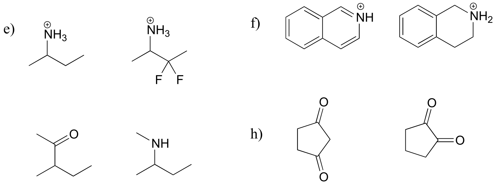

**P7.2:** For each pair of molecules below, choose the stronger base,
and explain your choice.

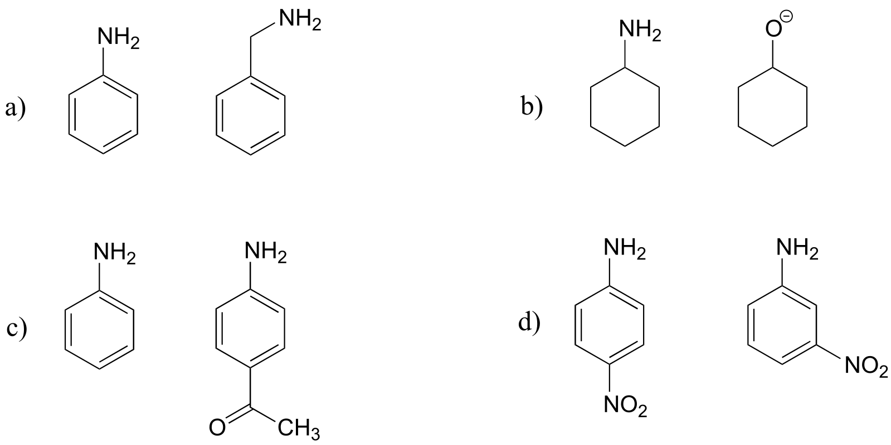

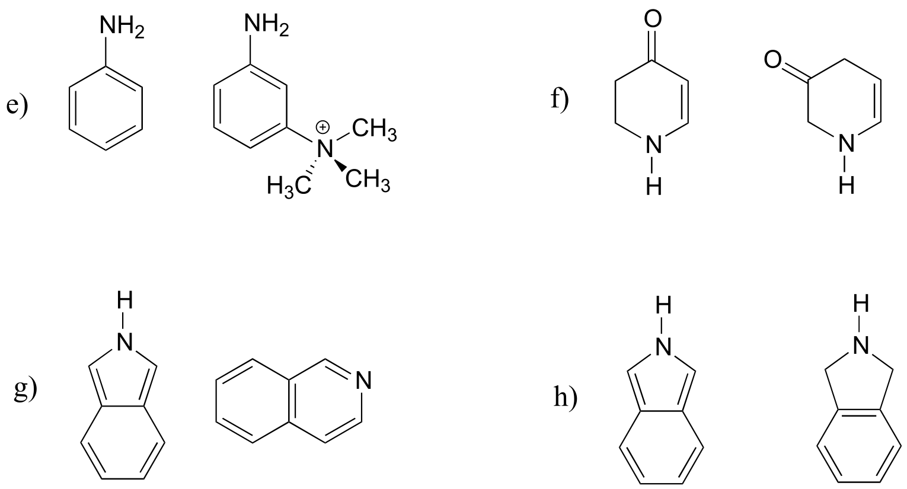

**P7.3:** Below are the structures of some well-known drugs.

a\) What is the most acidic proton on Lipitor? What is its approximate
pKa value?  
(Lipitor is a brand name for atorvastatin, a cholesterol-lowering drug.)

b\) What is the most acidic proton on Zocor? What is its approximate pKa
value?

(Zocor is a brand name for simvastatin, a cholesterol-lowering drug.)

c\) Where is the most basic site on Plavix? What is the approximate pKa
value of the conjugate acid? (Plavix is a brand name for clopidogrel, a
drug to prevent blood clots after a stroke.)

d\) Identify the most acidic proton on methadone, and draw the conjugate
base that would form if this proton were abstracted by a base.
(Methadone is an opiate used in the treatment of heroin addiction.)

**P7.4:**

a\) Porphobilinogen is a precuror to the biosynthesis of chlorophyll and
many other biological molecules. Draw the form of the molecule with a +1
net charge. What would the net charge of the molecule be at
physiological pH?

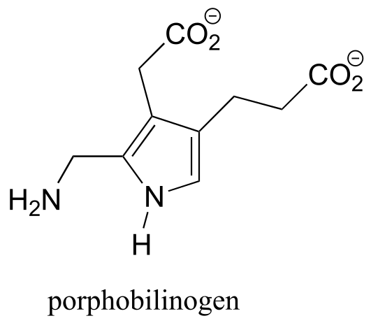

b\) Look up the structures of the hormones adrenaline and estrogen
(estrone). Estrogen can diffuse across a cell membrane, while adrenaline
cannot. Use your knowledge of cell membranes, physical properties of
organic molecules, and acid-base chemistry to explain this observation.

**P7.5:** Classify each of the nitrogen atoms in the coenzyme
S-adenosylmethionine as an amine, amide, 'aniline-like',
'pyridine-like', or 'pyrrole-like'. Which nitrogen is most basic? Which
is least basic?

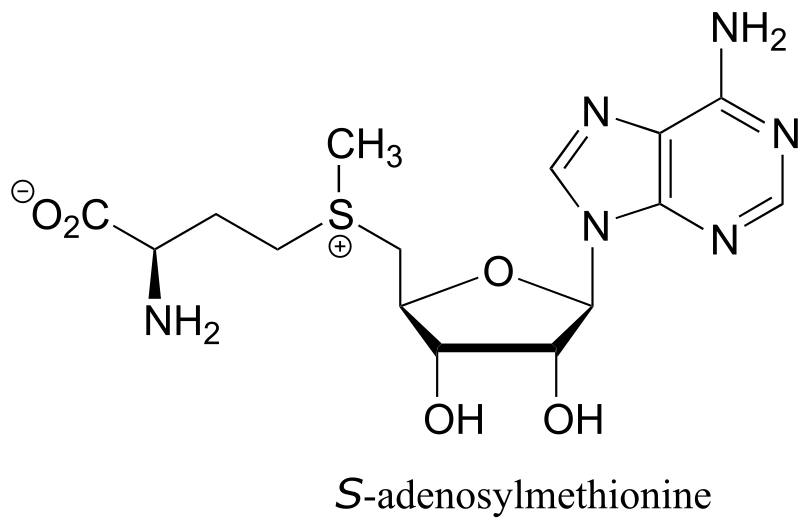

**P7.6:** Uric acid, an intermediate in the catabolism (breakdown) of
the nucleotide adenosine, has four protons. Which would you expect to be
the least acidic? Use resonance structures to explain your reasoning.
*Hint*: consider protons 1-4 in turn, and what the conjugate base would
look like if each proton were donated to a base: how well could the
resulting negative charge be stabilized by resonance?

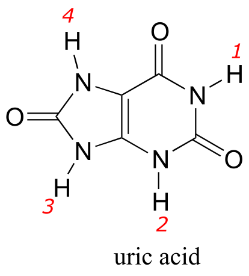

**P7.7:** Estimate the net charge on a peptide with the sequence
P-E-P-T-I-D-E (single-letter amino acid code), when it is dissolved in a
buffer with pH = 7 (don’t forget to consider the terminal amino and
carboxylate groups).

**P7.8:** Estimate the net charge on a dipeptide of sequence D-I.

a\) in a buffer with pH = 4.0

b\) in a buffer with pH = 7.3

c\) in a buffer with pH = 9.6

**P7.9:** Show the structures of species X and Y in the following
acid-base reactions, and estimate the value of Keq using the pKa table.
Assume that reactions involve equimolar amounts of acid and base.

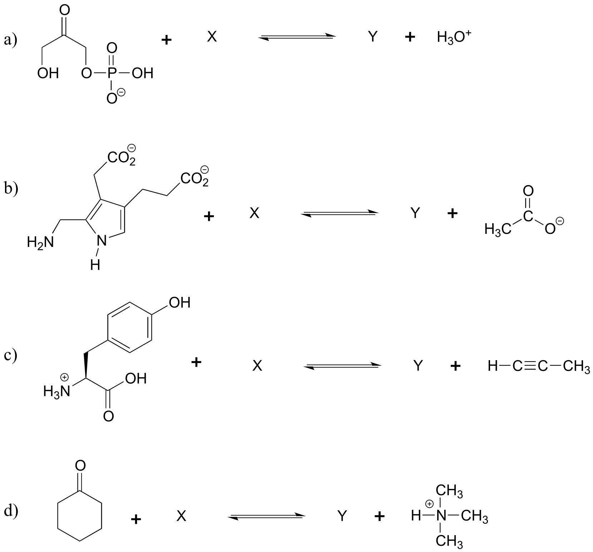

**P7.10:** Locate the most basic site on the structure of the
hallucinogenic drug known as LSD.

**P7.11:**

a\) Identify the most acidic proton on the antibiotic tetracycline, and
explain your choice.

b\) Identify two additional protons which would be expected to have pKa
values close to 5.

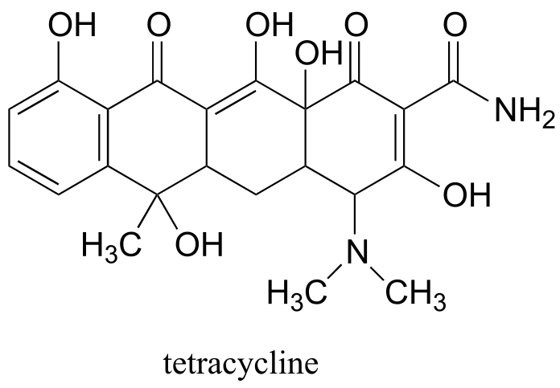

**P7.12:** In an enzyme active site, a lysine side chain is surrounded
by phenylalanine, alanine, tryptophan, and leucine residues. Another
lysine side chain is located on the surface of the protein, pointing out
into the surrounding water. Which residue has the higher pKa, and why?

**P7.13:** (a-d) How would the immediate proximity of a magnesium ion
affect the pKa of the side chains of the following amino acids (relative
to the ‘typical’ pKa values given in the text)? Assume that all residues
are located in the interior of the protein structure, not in direct
contact with the outside buffer solution.

a\) a glutamate residue?

b\) a lysine residue?

c\) a histidine residue?

d\) a tyrosine residue?

e\) How would contact with a magnesium ion effect the pKa of a bound
water molecule in the interior of a protein?

**P7.14:** The side chain of lysine has a pKa of approximately 10.5,
while the pKa of the arginine side chain is approximately 12.5. Use
resonance structures to rationalize this difference.

**P7.15:** The α-protons of ketones are, in general, significantly more
acidic than those of esters. Account for this observation using
structural arguments.

**P7.16:** 2-amino-2-hydroxymethylpropane-1,3-diol, (commonly known as
'Tris') and imidazole are very commonly used as buffers in biochemistry
and molecular biology laboratories. You make two buffer solutions: One
is 50 mM Tris at pH 7.0, the other 50 mM imidazole/imidazolium at pH 7.0
For each solution, calculate the concentration of buffer molecules in
the cationic protonation state.

**P7.17**: The compound pictured below is an unusual carbon acid (pKa \~
16) that does not contain any heteroatoms. Explain why it is so much
more acidic than other hydrocarbons.

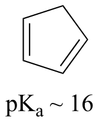

# 8: Nucleophilic substitution reactions

(Credit: https://www.flickr.com/photos/12567713@N00/)

**Introduction**

Dr. Tim Spector, Professor of Genetic Epidemiology at Kings College in
London, knows a thing or two about twins. He should: as head of the
Department of Twin Research at Kings College, Spector works with about
3500 pairs of identical twins, researching the influence of a person's
genetic blueprint on everything from how likely they are to be obese, to
whether or not they hold religious beliefs, to what kind of person they
fall in love with. Anyone who is a twin, or has ever known a pair of
identical twins, can attest to how remarkably similar they are to each
other, even in the rare cases of adopted twins raised in separate homes.
Dr. Spector, however, has over the course of his research become much
more interested in how they are different.

A recent article about Spector in the British newspaper *The Guardian*
(June 1, 2013) begins with an introduction to two middle-aged twin
sisters named Barbara and Christine, one of the pairs of twins in the
Kings College study group. Although they were treated almost as a single
person when growing up, with identical haircuts and clothes, the twins
began to diverge in their teenage years as they gained the freedom to
make their own choices. They began to dress quite differently, with
Christine choosing much more conservative styles than Barbara. Christine
describes herself as being self-conscious, while Barbara has always been
more confident. Christine suffers from depression, but Barbara does not.

Given that they were born with the exact same DNA and were raised in the
same home, where do these differences come from? In public debates about
why people are the way they are, a catch phrase that often comes up is
'nature vs. nurture': people argue, in other words, about the relative
influence of a person's genes vs. the influence of their environment. In
Barbara and Christine's case, one would assume that the 'nature' is
identical, and given that they grew up in the same house, the 'nurture'
side of the equation should also be quite similar.

As it turns out, the 'nature' component may not be so identical after
all. Based on his work with twins, Spector now thinks that subtle
changes to Barbara's and Christine's DNA *after* conception - and
indeed, throughout their lifetimes - may be a much more important
determinant of their physical and psychological characteristics than was
previously believed. As we age from infants to adulthood, some of our
DNA bases are modified by methylation: in other words, a methyl
(CH3) group replaces a hydrogen. In humans and other mammals,
this mainly happens to cytosine (C) bases, while in bacteria it is
mainly adenosine (A) bases which are methylated. The biomolecule that
serves as the methyl group donor in both cases is called *S*-adenosyl
methionine, or 'SAM' for short.

Methylation of cytosine:

Methylation of adenine:

fig 1b

In mammals, gene methylation seems to occur in different patterns in
different people - even in identical twins - in response to
environmental factors. Methylation also seems to have the effect of
amplifying or muting a gene's function, by altering how it interacts
with regulatory proteins. The combined effect of many gene methylation
events can be profound, as groups of interrelated genes are 'turned up'
or 'turned down' in concert. Professor Spector thinks that the many
differences between Barbara and Christine probably stem, at least in
part, from differences in how their genes have been methylated over the
course of their lives so far.

In this chapter, we delve for the first time into 'real' organic
reactions, beyond the simple proton transfer events of Bronsted
acid-base reactions that we looked at in chapter 7. The methylation of
DNA is an excellent example of a type of organic reaction called
*nucleophilic substitution*, to which we were introduced briefly in
chapter 6 as a model for learning about some of the fundamental concepts
of organic reactivity. Now we will delve more deeply into three crucial
players in this bond-forming and bond-breaking process: the nucleophile,
the electrophile, and the leaving group. In doing so, we will get a
chance to practice and refine our skills in drawing organic reaction
mechanisms using the curved arrow formality, and we will think about
what a transition state and a reactive intermediate of a reaction might
look like, and how the structure of these species determines the
regiochemical and stereochemical outcome of a nucleophilic substitution
reaction. Perhaps, in the time spent working on this chapter, some of
the cytosines in your DNA will undergo nucleophilic substitution
reactions to become methylated - and who knows how this will influence
who you go on to become?

<u>Additional Reading:</u>

Spector, Tim, 2013. [*Identically Different: Why We Can Change Our
Genes*](https://www.amazon.com/dp/B00X76SVYQ/ref=rdr_kindle_ext_tmb).
Overlook Hardcover. ISBN 978-1468306606

## Section 8.1: Two mechanistic models for nucleophilic substitution 

As we begin our study of nucleophilic substitution reactions, we will
focus at first on simple alkyl halide compounds. While the specific
reactions we'll initially consider do not occur in living things, it is
nonetheless useful to start with alkyl halides as a model to illustrate
some fundamental ideas that we must cover. Later, we will move on to
apply what we have earned about alkyl halides to the larger and more
complex biomolecules that are undergoing nucleophilic substitution right
now in your own cells.

### 8.1A: The SN2 mechanism

You may recall from our brief introduction to the topic in chapter 6
that there are two mechanistic models for how a nucleophilic
substitution reaction can proceed. In one mechanism, the reaction is
**concerted**: it takes place in a single step, and bond-forming and
bond-breaking occur simultaneously. This is illustrated by the reaction
between chloromethane and hydroxide ion:

An SN2 mechanism:

fig 1

Recall that the hydroxide ion in this reaction is acting as a
**nucleophile** (an electron-rich, nucleus-loving species), the carbon
atom of chloromethane is acting as an **electrophile** (an electron-poor
species which is attracted to electrons), and the chloride ion is the
**leaving group** (where the name is self-evident).

Organic chemists refer to this mechanism by the term
'**SN2',** where *S* stands for 'substitution', the subscript
*N* stands for 'nucleophilic', and the number *2* refers to the fact
that this is a **bimolecular** **reaction**: the overall rate depends on
a step in which two separate species collide. A potential energy diagram
for this reaction shows the transition state (TS) as the highest point
on the pathway from reactants to products.

The geometry of an SN2 reaction is specific: the reaction can
only occur when the nucleophile collides with the electrophilic carbon
from the *opposite* side relative to the leaving group. This is referred
to as **backside attack**. Approach from the front side simply doesn't
work: the leaving group - which, like the nucleophile is an
electron-rich group - blocks the way.

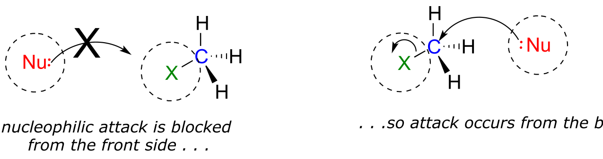

fig 2

The result of backside attack is that the bonding geometry at the
electrophilic carbon *inverts* (turns inside-out) as the reaction
proceeds.

fig 3

The transition state of the reaction is illustrated by drawing dotted
lines to represent the covalent bonds that are in the process of
breaking or forming. Because the formal charge on the oxygen nucleophile
changes from negative one to zero as the reaction proceeds, and
conversely the charge on the chlorine leaving group changes from zero to
negative one, at the transition state both atoms are shown bearing a
*partial* negative charge (the symbol δ-). One other drawing
convention for transition states is to use brackets, with the
double-dagger symbol in subscript.

Notice that the transition state for an SN2 reaction has
**trigonal bipyramidal geometry**: the nucleophile, electrophile, and
leaving group form a straight line, and the three substituents on carbon
(all hydrogen atoms in this case) are arranged in the same plane at
120o angles.

<u>Exercise 8.1</u>: What is the measure in degrees) of the H-C-O angle
in the SN2 transition state illustrated above?

Consider what would happen if we were to replace one of the hydrogen
atoms in chloromethane with deuterium (the 2H isotope), and
one with tritium (the radioactive 3H isotope). Now, because
it has four different substituents, our carbon electrophile is a chiral
center. We'll arbitrarily assume that we start with the *S* enantiomer.

fig 4

As the hydroxide nucleophile attacks from the backside and the bonding
geometry at carbon inverts, we see that the stereochemistry of the
product reflects this inversion: we end up with the *R* enantiomer of
the chiral product.

SN2 reactions proceed with inversion of stereochemical
configuration at the electrophilic carbon.

[video tutorial/animation: inversion of configuration during SN2
reactions](https://www.youtube.com/watch?v=h5xvaP6bIZI)

### 8.1B: The SN1 mechanism

A second model for the nucleophilic substitution reaction is called the
**SN1** **mechanism**. The '1' in SN1 indicates
that the rate-determining step of the reaction is *unimolecular*: in
other words, the rate-determining step involves a single molecule
breaking apart (rather than two molecules colliding as was the case in
the SN2 mechanism.)

In an SN1 mechanism the carbon-leaving group bond breaks
*first*, before the nucleophile approaches, resulting in formation of a
carbocation intermediate (step 1):

An SN1 mechanism:

fig 7

A carbocation is a powerful electrophile: because the carbon lacks a
complete octet of valence electrons, it is 'electron-hungry'. In step 2,
a lone pair of electrons on the water nucleophile fills the empty *p*
orbital of the carbocation to form a new bond.

Notice that this is actually a three-step mechanism, with a final, rapid
acid-base step leading to the alcohol product.

A potential energy diagram for this SN1 reaction shows that
each of the two positively-charged intermediate stages (I1
and I2 in the diagram) can be visualized as a valley in the
path of the reaction, higher in energy than both the reactant and
product but lower in energy than the transition states.

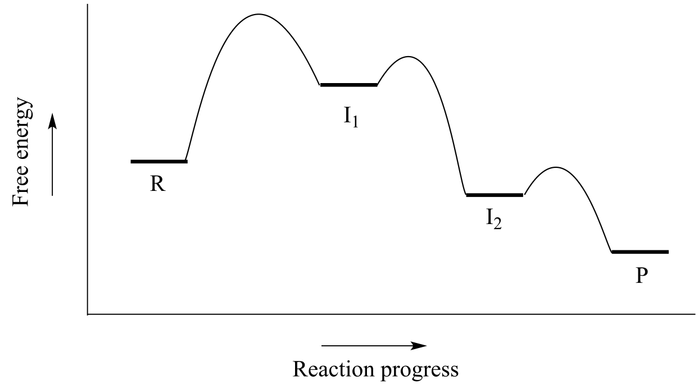

fig 7a

The first, bond-breaking step is the slowest, rate-determining step -
notice it has the highest activation energy and leads to the
highest-energy species (I1, the carbocation intermediate).
Step 2 is rapid: a new covalent bond forms between a carbocation and and
a water nucleophile, and no covalent bonds are broken. Recall from
chapter 7 that Bronsted-Lowry proton transfer steps like step 3 are
rapid, with low activation energies.

**Hydrolysis**

The nucleophilic substitution reactions we have seen so far are examples
of **hydrolysis**. This term is one that you will encounter frequently
in organic and biological chemistry. Hydrolysis means *'breaking with
water'*: in a hydrolysis reaction, a water molecule (or hydroxide ion)
participates in the breaking of a covalent bond. There are many reaction
types other than nucleophilic substitution that can accurately be
described as hydrolysis, and we will see several examples throughout the
remaining chapters of this book.

**Solvolysis** is a more general term, used when a bond in a reagent is
broken by a solvent molecule: usually, the solvent in question is water
or an alcohol such as methanol or ethanol.

<u>Exercise 8.2</u>: Draw a mechanism for the SN1 solvolysis
of *tert*-butyl chloride in methanol. What new functional group has been
formed?

We saw that SN2 reactions result in inversion of
stereochemical configuration at the carbon center. What about the
stereochemical outcome of SN1 reactions? Recall that a
carbocation is *sp2*-hybridized, with an empty *p* orbital
perpendicular to the plane formed by the three sigma bonds:

fig 8

In the second step of an SN1 reaction, the nucleophile can
attack from *either side* of the carbocation (the leaving group is
already gone, and thus cannot block attack from one side like in an
SN2 reaction).

fig 9

Consider an SN1 reaction with a chiral tertiary alkyl
chloride:

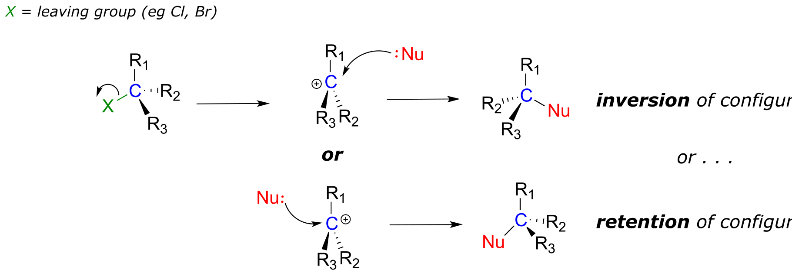

fig 10

Because the nucleophile is free to attack from either side of the
carbocation electrophile, the reaction leads to a 50:50 mixture of two
stereoisomeric products. In other words:

In general *nonenzymatic* SN1 reaction can occur with either
**retention** or **inversion** of configuration at the electrophilic
carbon, leading to **racemization** if the carbon is chiral.

For an example, consider the hydrolysis of
(*S*)-3-chloro-3-methylhexane.

fig 11

The result of this (nonenzymatic) reaction is a racemic mixture of
chiral alcohols.

It is important to remember, however, that *enzymatic* reactions are in
almost all cases very specific with regard to stereochemical outcome. A
biochemical SN1 reaction, as we shall see later, can result
in either inversion or retention of configuration at the electrophilic
carbon, but generally *not* a mixture of both: the two reactants are
bound with specific geometry in the enzyme's active site, so that the
nucleophile can approach from one side only.

*(The following exercises refer to <u>nonbiological</u> reactions)*

<u>Exercise 8.3</u>:

a\) Draw a complete mechanism for the hydrolysis reaction in the
previous figure, showing all bond-breaking and bond-forming steps, and
all intermediate species.

b\) Draw structures representing TS1 and TS2 in
the reaction. Use the solid/dash wedge convention to show three
dimensions.

c\) What is the expected optical rotation of the product mixture?

d\) Could the two organic products be separated on a silica column
chromatography?

<u>Exercise 8.4</u>:

a\) Draw the product(s) of the hydrolysis of (R)-3-chloro-3-methyl
heptane.

b\) What can you predict, if anything, about the optical rotation of the
product(s)?

c\) Draw the product(s) of the hydrolysis of
(3R,5R)-3-chloro-3,5-dimethyl heptane.

d\) What can you predict, if anything, about the optical rotation of the
product(s)?

Before we go on to look at some actual biochemical nucleophilic
substitution reactions, we first need to lay the intellectual groundwork
by focusing more closely on the characteristics of the three principal
partners in the nucleophilic substitution reaction: the nucleophile, the
electrophile, and the leaving group. In addition, we need to consider
the carbocation intermediate that plays such a key role in the
SN1 mechanism. For the sake of simplicity, we will continue
to use simple, non-biological organic molecules and reaction examples as
we work through the basic concepts.

[Video tutorial/animation: SN1
reactions](https://www.youtube.com/watch?v=JmcVgE2WKBE)

## Section 8.2: Nucleophiles

### 8.2A: What is a nucleophile?

A nucleophile is an atom or functional group with a pair of electrons
(usually a non-bonding, or lone pair) that can be shared. The same,
however, can be said about a base: in fact, bases can act as
nucleophiles, and nucleophiles can act as bases. What, then, is the
difference between a base and a nucleophile?

A Bronsted-Lowry base, as you will recall from chapter 7, uses a lone
pair of electrons to form a new bond with an acidic proton. We spent
much of chapter 7 discussing how to evaluate how basic a species is.
Remember that when we evaluate basicity - the strength of a base - we
speak in terms of *thermodynamics*: where does equilibrium lie in a
reference acid-base reaction?

fig 12a

We will spend much of this section discussing how to evaluate how
nucleophilic a species is - in other words, its **nucleophilicity**. A
nucleophile shares its lone pair of electrons with an electrophile - an
electron-poor atom other than a hydrogen, usually a carbon. When we
evaluate nucleophilicity, we are thinking in terms of *kinetics* - how
fast does the nucleophile react with a reference electrophile?

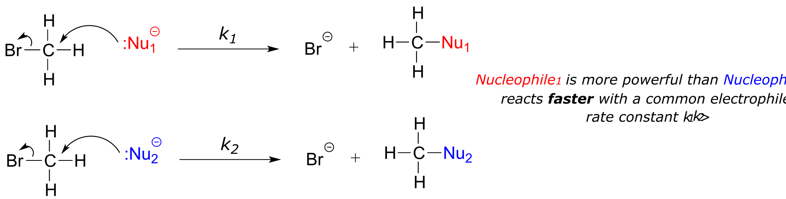

fig 12a

In both laboratory and biological organic chemistry, the most common
nucleophilic atoms are oxygen, nitrogen, and sulfur, and the most common
nucleophilic compounds and functional groups are water/hydroxide ion,
alcohols, phenols, amines, thiols, and sometimes carboxylates.

In laboratory (non-biological) reactions, halide (I-,
Br-, Cl-, F-) and azide
(N3-) anions are also commonly seen acting as
nucleophiles in addition to the groups mentioned above.

Carbon atoms can also be nucleophiles - enolate ions (section 7.6) are
common carbon nucleophiles in biochemical reactions, while the cyanide
ion (CN-) is just one example of a carbon nucleophile
commonly used in the laboratory.

fig 12

Understanding carbon nucleophiles will be critical when we study, in
chapters 12 and 13, the enzyme-catalyzed reactions in which new
carbon-carbon bonds are formed in the synthesis of biomolecules such as
DNA and fatty acids. In the present chapter, however, we will focus on
heteroatom (non-carbon) nucleophiles.

Now, let's consider a number of factors that influence how nucleophilic
an atom or functional group is. We'll start with protonation state.

### 8.2B: Protonation state

The protonation state of a group has a very large effect on its
nucleophilicity. A negatively-charged hydroxide ion is much more
nucleophilic (and basic) than a water molecule. In practical terms, this
means that a hydroxide nucleophile will react in an SN2
reaction with chloromethane several orders of magnitude faster than will
a water nucleophile.

Likewise, a thiolate anion is more nucleophilic than a neutral thiol,
and a neutral amine is nucleophilic, whereas an ammonium cation is not.

In a non-biological context, SN2 reactions tend to occur with
more powerful, anionic nucleophiles, where the nucleophile can be
thought of as actively displacing ('pushing') the leaving group off the
carbon. SN1 reactions, in contrast, tend to be solvolysis
reactions, with a weak, neutral nucleophile such as water or an alcohol.

### 8.2C: Periodic trends in nucleophilicity

Just as with basicity, there are predictable periodic trends associated
with nucleophilicity. Moving horizontally across the second row of the
periodic table, the trend in nucleophilicity parallels the trend in
basicity:

**The horizontal periodic trend in nucleophilicity**

*more nucleophilic* NH2- \> OH- \>
F- *less nucleophilic*

*more nucleophilic* R-NH2 \> R-OH *less nucleophilic*

Recall from section 7.3A that the basicity of atoms decreases as we move
vertically down a column on the periodic table: thiolate ions are less
basic than alkoxide ions, for example, and bromide ion is less basic
than chloride ion, which in turn is less basic than fluoride ion. Recall
also that this trend can be explained by considering the increasing size
of the 'electron cloud' around the larger ions: the electron density
inherent in the negative charge is spread around a larger volume, which
tends to increase stability (and thus reduce basicity).

The vertical periodic trend for nucleophilicity is somewhat more
complicated that that for basicity, and depends on the solvent in which
the reaction is taking place. Take the general example of the
SN2 reaction below:

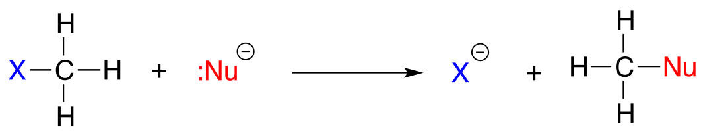

fig 13

. . .where Nu- is one of the halide ions: fluoride, chloride,
bromide, or iodide, and X is a common leaving group. If this reaction is
occurring in a **protic solvent** (that is, a solvent that has a
hydrogen atom bonded to an oxygen or nitrogen - water, methanol and
ethanol are protic solvents), then *the reaction will go fastest when
iodide is the nucleophile, and slowest when fluoride is the
nucleophile*, reflecting the relative strength of the nucleophile.

**  
**

**The vertical periodic trend in nucleophilicity in water and other
protic solvents**

*(opposite of the trend in basicity!)*

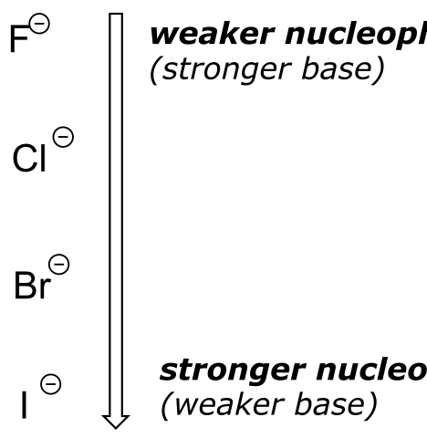

fig 14

This is the *opposite* of the vertical periodic trend in basicity
(section 7.3A), where iodide is the *least* basic. What is going on
here? Shouldn't the stronger base, with its more reactive unbonded
valence electrons, also be the stronger nucleophile?

As mentioned above, it all has to do with the solvent. Remember, we are
talking now about the reaction running in a *protic* solvent like water.
Protic solvent molecules form strong noncovalent interactions with the
electron-rich nucleophile, essentially creating a 'solvent cage' of
hydrogen bonds:

*artwork needed*

fig 16

For the nucleophile to attack in an SN2 reaction, the
nucleophile-solvent hydrogen bonds must be disrupted - in other words,
the nucleophilic electrons must 'escape through the bars' of the solvent
cage. A weak base like iodide ion interacts weakly with the protons of
the solvent, so these interactions are more readily disrupted.
Furthermore, because the valence electrons on iodide ion are far from
the nucleus, the electron cloud is **polarizable** - electron density
can readily be pulled away from the nucleus, through the solvent cage
and toward the electrophile.

A smaller, more basic anion such as fluoride is more highly shielded by
stronger interactions with the solvent molecules. The electron cloud of
the fluoride ion is smaller and much less polarizable than that of an
iodide ion: in water solvent, the larger iodide ion is a more powerful
nucleophile than the smaller fluoride ion.

The above discussion of the vertical periodic trend in nucleophilicity
applies to biochemical reactions, because the biological solvent is
water. The picture changes for laboratory reactions if we switch to a
**polar** **aprotic solvent**, such as acetone, which is polar enough to
solvate the polar and ionic compounds in the reaction but *is not a
hydrogen bond donor*, and does not form a strong 'solvent cage' like
water does. In acetone and other polar aprotic solvents, the trend in
nucleophilicity is the same as the trend in basicity: fluoride is the
strongest base *and* the strongest nucleophile.

Structures of some of the most common polar aprotic solvents are shown
below. These solvents are commonly used in laboratory nucleophilic
substitution reactions.

fig 17

In biological chemistry, the most important implication of the vertical
periodic trend in nucleophilicity is that *thiols are more nucleophilic
than alcohols*. The thiol group in a cysteine amino acid residue, for
example, is more nucleophilic than the alcohol group on a serine, and
cysteine often acts as a nucleophile in enzymatic reactions. The thiol
group on coenzyme A is another example of a nucleophile we will see
often in enzymatic reactions later on. Of course, reactions with oxygen
and nitrogen nucleophiles are widespread in biochemistry as well.

fig 18

### 8.2D: Resonance effects on nucleophilicity

Resonance effects also come into play when comparing the inherent
nucleophilicity of different molecules. The reasoning involved is the
same as that which we used to understand resonance effects on basicity
(see section 7.3B). If the electron lone pair on a heteroatom is
delocalized by resonance, it is inherently less reactive - meaning less
nucleophilic, and also less basic. An alkoxide ion, for example, is more
nucleophilic and more basic than a carboxylate group, even though in
both cases the nucleophilic atom is a negatively charged oxygen. In an
alkoxide, the negative charge is localized on a single oxygen, while in
the carboxylate the charge is delocalized over two oxygen atoms by
resonance.

fig 19

The nitrogen atom on an amide is less nucleophilic than the nitrogen of
an amine, due to the resonance stabilization of the nitrogen lone pair
provided by the amide carbonyl group.

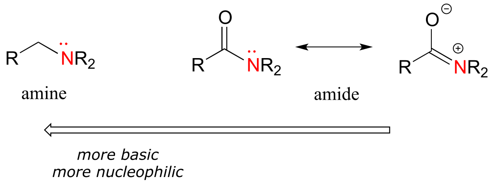

fig 20

<u>Exercise 8.5</u>: Which amino acid has the more nucleophilic side
chain - serine or tyrosine? Explain.

### 8.2E: Steric effects on nucleophilicity

Steric hindrance is an important consideration when evaluating
nucleophility. For example, tert-butanol is less potent as a nucleophile
than methanol. The comparatively bulky methyl groups on the tertiary
alcohol effectively block the route of attack by the nucleophilic
oxygen, slowing the reaction down considerably (imagine trying to walk
through a narrow doorway while carrying three large suitcases!).

fig 21

A final note: when it comes to comparing the rate of nucleophilic
substitution reactions, the strength of the nucleophile only matters for
SN2 reactions. It is irrelevant for SN1 reactions,
because the rate-determining step (when the leaving group departs and a
carbocation intermediate forms) does *not* involve the nucleophile.

[Video tutorial:
nucleophiles](https://www.khanacademy.org/science/organic-chemistry/substitution-elimination-reactions/nucleophilicity-basicity-sal/v/nucleophilicity-nucleophile-strength)

<u>Exercise 8.6</u>: Which is the better nucleophile - a cysteine side
chain or a methionine side chain? A serine or a threonine? Explain.

<u>Exercise 8.7</u>: In each of the following pairs of molecules/ions,
which is expected to

react more rapidly with CH3Cl in acetone solvent? Explain
your choice.

a\) phenolate (deprotonated phenol) or benzoate (deprotonated benzoic
acid)?

b\) water or hydronium ion?

c\) trimethylamine or triethylamine?

d\) chloride anion or iodide anion?

e\) CH3NH- or
CH3CH2NH2?

f\) acetate or trichloroacetate?

g\) aniline or 4-methoxyaniline?

h\) phenolate or 2,6-dimethylphenolate?

## Section 8.3: Electrophiles and carbocation stability

Next, we turn to electrophiles. In the vast majority of the nucleophilic
substitution reactions you will see in this and other organic chemistry
texts, the electrophilic atom is a carbon bonded to an electronegative
atom, usually oxygen, nitrogen, sulfur, or a halogen. The concept of
electrophilicity is relatively simple: an electron-poor atom is an
attractive target for something that is electron-rich, *i.e*. a
nucleophile. However, we must also consider the effect of steric
hindrance on electrophilicity.

<u>  
</u>

### 8.3A: Steric hindrance at the electrophile

One of the most important factors to consider when looking at the
electrophile in a nucleophilic substitution reaction is *steric
hindrance*. Consider two hypothetical SN2 reactions: one in
which the electrophile is a methyl carbon and another in which it is
tertiary carbon.

fig 22

Because the three substituents on the methyl electrophile are hydrogen
atoms, the nucleophile has a relatively clear path for backside attack,
and the SN2 reaction will take place readily. However,
backside attack on the *tertiary* carbon electrophile is blocked by the
bulky methyl groups, preventing access to the site of electrophilicity.

SN2 reactions occur at methyl, primary, and secondary carbon
electrophiles. The degree of steric hindrance determines relative rates
of reaction: unhindered methyl electrophiles react fastest, and more
hindered secondary carbon electrophiles react slowest, assuming all
other reactions conditions are identical. SN2 reactions do
*not* occur to an appreciable extent at tertiary carbon electrophiles.

fig 22a

<u>Exercise 8.8</u>: Which would be expected to react more rapidly in an
SN2 reaction with an azide ion (N3-)
nucleophile in acetone solvent: 1-bromo-2,2-dimethylbutane or
1-bromo-3-methylbutane?

What about the SN1 pathway? Steric hindrance around the
electrophilic carbon is *not* a significant factor in slowing down an
SN1 reaction. This makes perfect sense from a geometric point
of view: the limitations imposed by sterics are significant in an
SN2 displacement because the electrophile being attacked is
an *sp3*-hybridized tetrahedral carbon with relatively
‘tight’ angles of 109.5o. Remember that in an SN1
mechanism, the leaving group leaves first, and then the nucleophile
attacks an *sp2*-hybridized carbocation intermediate, which
has trigonal planar geometry with ‘open’ 120o angles.

*artwork needed*

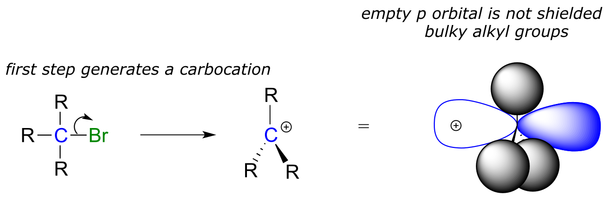

fig 23

With this open geometry, the empty *p* orbital of the carbocation is no
longer significantly shielded from the approaching nucleophile by the
bulky alkyl groups, and is an 'easy target' for a nucleophile: this step
is fast, and is *not* the rate-determining step for an SN1
reaction.

### 8.3B: Carbocation stability 

What, then, are the characteristics of an electrophile that favor an
SN1 reaction pathway as opposed to an SN2 pathway?
We know that the rate-limiting step of an SN1 reaction is the
first step: loss of the leaving group and formation of the carbocation
intermediate. Accordingly, ***the rate of an SN1 reaction
depends to a large extent on the stability of the carbocation
intermediate.***

The critical question now becomes:

***What stabilizes a carbocation?***

Think back to Chapter 7, when we were learning how to evaluate the
strength of an acid. The critical question there was: “how stable is the
conjugate base that results when this acid donates its proton”? In many
cases, this conjugate base was an anion – a center of excess electron
density. Anything that can draw some of this electron density away– in
other words, any electron withdrawing group – will stabilize the anion.

Conversely, a carbocation is stabilized by an electron *donating* group,
and **de**stabilized by an electron withdrawing group.

fig 26

A positively charged species such as a carbocation is electron-poor, and
thus anything which donates electron density to the center of electron
poverty will help to stabilize it. Alkyl groups, because of the
electrons in their carbon-carbon and carbon-hydrogen bonds, are weak
electron-donating groups, and will stabilize nearby carbocations. What
this means is that, in general, ***more substituted carbocations are
more stable***: a *tert*-butyl carbocation, for example, is more stable
than an isopropyl carbocation. Primary carbocations are highly unstable
and not often observed as reaction intermediates; methyl cations are
even less stable.

More substituted carbocations are more stable:

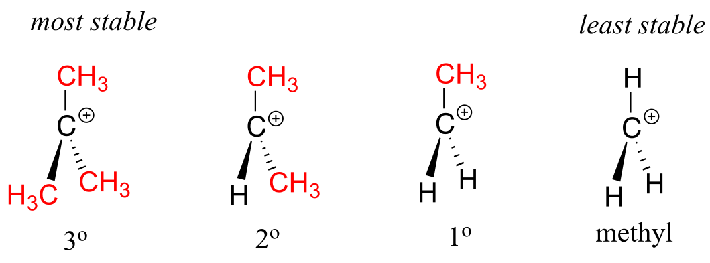

fig 27

Another way to explain this trend in carbocation stability involves the
phenomenon of **hyperconjugation**, in which the empty *p* orbital of a
carbocation is stabilized by overlap with a σ bond on an adjacent
carbon. This overlap effectively spreads the positive charge over a
larger area. The figure below shows the empty π orbital of a secondary
carbocation being stabilized by hyperconjugation with an adjacent C-H
σ bond.

fig 27a

Hyperconjugation is not possible with a methyl cation as there is no
adjacent s bond available to overlap the empty p orbital. As the degree
of substitution on a carbocation increases, so does the capacity for
stabilizing hyperconjugation interactions.

The presence of an electron-withdrawing group - such as a fluorine
atom - will significantly *destabilize* a carbocation through the
inductive effect.

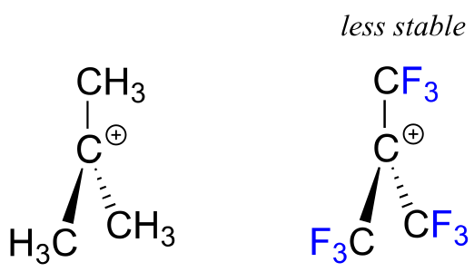

fig 28

Carbonyl groups are electron-withdrawing by inductive effects, due to
the polarity of the C=O double bond. It is possible to demonstrate in
the laboratory (we'll see how in problem 14.x) that carbocation A below
is more stable than carbocation B, even though A is a primary
carbocation and B is secondary.

fig 29

The positive charge in cation B is closer to the electron withdrawing
carbonyl substitution, and as we learned in section 7.3C, the inductive
effect of an electron withdrawing group decreases with distance.

Stabilization of a carbocation can also occur through resonance effects.
Recall from section 7.4 that the negative charge on a phenolate ion is
stabilized by resonance, because the charge can be delocalized to three
of the carbons on the aromatic ring.

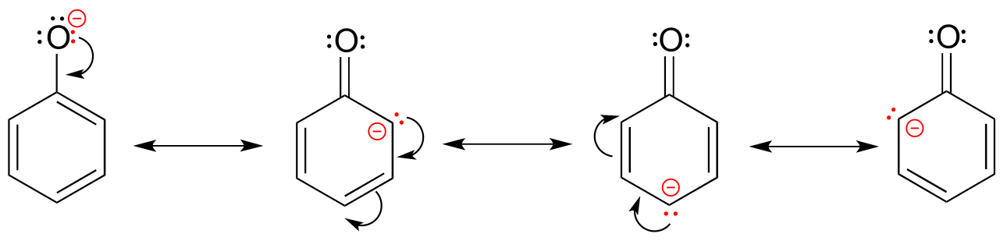

fig 30

A positive charge is also stabilized when it can be delocalized over
more than one atom. Consider a **benzylic carbocation**, where the
positively-charged carbon is bonded directly to an aromatic ring. A
benzylic carbocation is stabilized by the resonance electron-donating
effect of the aromatic ring. Three additional resonance structures can
be drawn for the carbocation in which the positive charge is located on
one of three aromatic carbons:

fig 31

<u>Exercise 8.9</u>: Fill in the missing numbers in this statement: The
conjugated *p* system in the benzylic carbocation above is composed of
\_\_\_\_\_\_ *p* orbitals overlapping to share \_\_\_\_\_\_ π electrons.

**Allylic** **carbocations**, where the positively charged carbon is
adjacent to a double bond, are stabilized by resonance delocalization of
the posive charge.

fig 32

Often, we must consider more than one factor when predicting carbocation
stability. For example, the carbocation on the right in the figure below
is more stable than the carbocation on the left. Both are allylic with
the charge delocalized over two carbons, but on the more stable
carbocation, one of the carbons is tertiary.

fig 32a

Because heteroatoms such as oxygen and nitrogen are more electronegative
than carbon, you might expect that they would be
carbocation-destabilizing electron withdrawing groups. In fact, the
opposite is often true: if the oxygen or nitrogen atom is in the right
position, the overall effect can be carbocation *stabilization*.
Although these heteroatoms are indeed electron withdrawing groups by
induction, they can be electron *donating* groups by resonance, and, as
we learned earlier (section 7.3) in the context of acid-base chemistry,
resonance effects are in general more powerful than inductive effects
when the two operate in opposite directions.

Consider the two pairs of carbocation species below:

fig 33

In the more stable carbocations, the heteroatom acts as an electron
*donating* group by resonance: in effect, the lone pair on the
heteroatom is available to delocalize the positive charge. Note also
that every atom in the major resonance contributor has a complete octet
of valence electrons.

<u>Exercise 8.10</u>: rank the following carbocations from most to least
stable:

fig 33a

Finally, **vinylic** carbocations, in which the positive charge resides
on a double-bonded carbon, are highly unstable.

fig 34

<u>Exercise 8.11:</u> Explain why vinylic carbocations are unstable.
(Hint: think about hybridization and electronegativity)

<u>Exercise 8.12:</u> The carbocation below is an intermediate species
in a reaction that is part of the biosynthesis of a hallucinogenic
compound in a fungus. Draw a resonance contributor that shows how it is
stabilized by resonance with the nitrogen atom.

fig 35

For the most part, carbocations - even 'relatively stable' carbocations
such as those that are tertiary and/or benzylic - are still highly
reactive, transient intermediate species in organic reactions, which
briefly form and then react again right away. However, there are some
unusual examples of carbocation species that are so stable that they can
be put in a jar and stored on the shelf as a salt. Crystal violet is the
common name for the chloride salt of the carbocation whose structure is
shown below. Notice the structural possibilities for extensive resonance
delocalization of the positive charge, and the presence of three
electron-donating amine groups.

fig 36

<u>Exercise 8.13</u>:

a\) Draw a resonance structure of the crystal violet cation in which the
positive charge is delocalized to one of the nitrogen atoms.

b\) Notice that crystal violet is deeply colored. Explain why you could
have predicted this from looking at its chemical structure.

c\) The conjugated system of crystal violet consists of how many
overlapping *p* orbitals sharing how many π electrons?

**Summary of factors influencing carbocation stability**:

I: More substituted carbocations are more stable than less substituted
carbocation (eg. tertiary carbocations are more stable than secondary
carbocations).

II: Nearby electronegative atoms can decrease carbocation stability by
the inductive effect.

III: Allylic and benzylic carbocations are stabilized by resonance
delocalization of the positive charge .

IV: Delocalization of the positive charge by resonance with the lone
pair electrons on a heteroatom contributes to carbocation stability.

Below are three examples illustrating how we can make predictions about
relative carbocation stability:

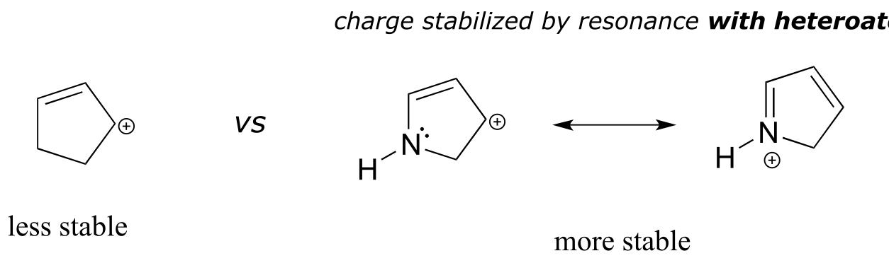

fig 36a

<u>Exercise 8.14</u>: State which carbocation in each pair below is more
stable, or if they are expected to be approximately equal. Explain your
reasoning.

fig 37

Now, back to our
discussion of the electrophile in an SN1 reaction:

An SN1 reaction requires a stabilized carbocation
intermediate. The more stable the relevant carbocation intermediate, the
more favored the SN1 reaction pathway.

SN1 reactions
in general *do not* occur at methyl or primary carbon electrophiles: the
carbocation intermediates involved would be too unstable and the
rate-determining (carbocation-generating) step would have a very high
energy barrier. Substitution on these electrophiles will occur through
the SN2 pathway.

The SN1 reaction pathway *is* possible, however, with
secondary and tertiary carbon electrophiles, or with any other carbon
electrophile in which departure of the leaving group generates a
carbocation which is stabilized by resonance.

For example: a primary alkyl bromide would *not* be expected to undergo
nucleophilic substitution by the SN1 pathway. An allylic
primary alkyl bromide, on the other hand, would generate a relatively
stable allylic carbocation and thus the SN1 pathway is
possible.

fig 37b

An allylic secondary alkyl bromide would undergo SN1
substitution more rapidly than the allylic primary alkyl bromide,
because the relevant carbocation is more substituted and thus more
stable.

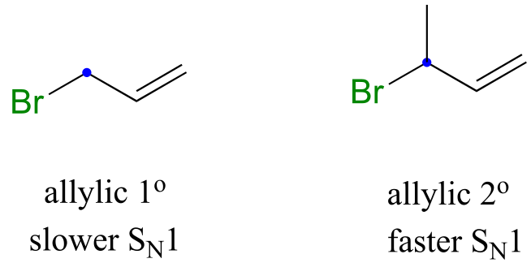

<u>*sp2*-hybridized carbons</u>

**Nucleophilic substitution generally does *not* occur at
*sp2*-hybridized carbons**, either by the SN2 or
SN1 pathway.

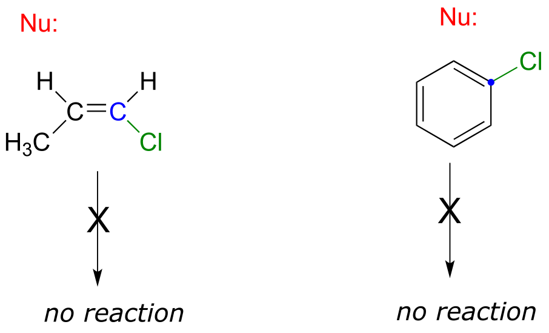

fig 6

Bonds on *sp2*-hybridized carbons are inherently shorter and
stronger than bonds on *sp*3-hybridized carbons, meaning that
it is harder to break the bond between an *sp2* carbon and a
potential leaving group (such as the chlorine atom in the figure above).
In addition, steric considerations play a part here: in order to attack
from behind the leaving group in an SN2-like fashion, the
nucleophile would need to approach *in the plane* of the carbon-carbon
double bond.

Substitution by an SN1 pathway is equally unlikely because of
the inherent instability of a vinylic (double-bonded) carbocation.

## Section 8.4: Leaving groups

Next, we investigate what makes a good leaving group. It's really quite
straightforward: everything that we learned in chapter 7 about
evaluating base strength will apply to leaving groups:

***Weaker bases are better leaving groups.***

In our general discussion of nucleophilic substitution reactions, we
have until now been using chloride ion as our common leaving group.
Alkyl chlorides are indeed common reactants in laboratory nucleophilic
substitution reactions, as are alkyl bromides and alkyl iodides. Iodide,
which is the *least* basic of the four common halides (F, Cl, Br, and
I), is the *best* leaving group among them. Fluoride is the least
effective leaving group among the halides, because fluoride anion is the
most basic. This rule applies to both SN2 and SN1
reactions, because in both cases the rate-determining step involves loss
of the leaving group.

*best leaving group* I- \> Br- \> Cl-
\> F- *worst leaving group*

This trend is evident when you compare the relative rates of
SN2 reactions of four halomethanes with a common nucleophile
and solvent: iodomethane reacts fastest, fluoromethane the slowest.

*fastest SN2 reaction* CH3I \> CH3Br \>
CH3Cl \> CH3F *slowest SN2 reaction*

The conjugate base of toluenesulfonic acid is a leaving group commonly
used in the organic synthesis laboratory. Toluenesulfonic acid is a
strong organic acid with a pKa of -2.8, so its conjugate base is a weak
base and excellent leaving group.

fig 6a

<u>Exercise 8.15</u>: In each pair (A and B) below, which electrophile
would be expected to react more rapidly with cyanide ion nucleophile in
acetone solvent? Explain your reasoning.

fig 25

Beginning later in this chapter and throughout the rest of our study of
organic reactivity, we will see examples of leaving group 'activation':
in other words, conversion of a strong base/poor leaving group into a
weak base/good leaving group. In some cases this is as simple as
protonation: an acidic group may be positioned in the active site in
order to protonate a poor leaving group (eg. hydroxide ion in the case
of an alcohol) as it leaves, thus converting it into a weak base and
good leaving group. In many other enzymatic reactions, alcohols are
converted into phosphates, which can be excellent biochemical leaving
groups. We will learn much more about the structure and reactions of
organic phosphate compounds in chapter 9.

## Section 8.5: Regiochemistry of SN1 reactions with allylic electrophiles

SN1 reactions with allylic electrophiles can often lead to
more than one possible regiochemical outcome - resonance delocalization
of the carbocation intermediate means that more than one carbon is
electrophilic. For example, hydrolysis of this allylic alkyl bromide
leads to a mixture of primary and secondary allylic alcohols.

fig 37a

In an enzyme-catalyzed reaction of this kind, however, generally only
one product will form, because enzymes maintain strict control over the
regiochemistry and stereochemistry of the reactions they catalyze. The
nucleophilic and electrophilic substrates are bound specifically in the
active site so that nucleophilic attack is directed at one - and only
one - electrophilic carbon. Problem 15, 17, and 19 at the end of this
chapter provide some examples of regio- and stereospecific biochemical
substitution reactions at allylic carbon electrophiles.

## Section 8.6: SN1 or SN2? Predicting the mechanism

First of all, it is important to understand that the SN1 and
SN2 mechanism models are just that: models. While many
nucleophilic substitution reactions can be described as proceeding
through 'pure' SN1 or SN2 pathways, other
reactions - in particular some important biochemical reactions we'll see
later - lie somewhere in the continuum between the SN1 and
the SN2 model (more on this later). With that being said,
here are some guidelines to help you predict whether a reaction is
likely to have more of an SN1 or SN2 character.

First, look at the electrophile: as stated above, an SN1
reaction requires that a relatively **stable carbocation intermediate**
be able to form. An SN2 reaction requires a relatively
**unhindered electrophilic center**. Therefore, methyl and primary
carbon electrophiles will react by the SN2 pathway, and
tertiary carbon electrophiles will react by the SN1 pathway.

Secondary carbon electrophiles, or primary carbon electrophiles adjacent
to a potential carbocation-stabilizing group (double bond or heteroatom)
can react by either or both pathways. The reasoning here is that these
electrophiles are unhindered (favoring SN2), but can also
form stabilized carbocation intermediates (favoring SN1)

fig 37g

Next, look at the nucleophile. More powerful nucleophiles, particularly
anionic nucleophiles such as hydroxides, alkoxides or thiolates, favor
an SN2 pathway: picture the powerful nucleophile 'pushing'
the leaving group off the electrophile. Weaker, uncharged nucleophiles
like water, alcohols, and amines, favor the SN1 pathway: they
are not nucleophilic enough to displace the leaving group, but will
readily attack a carbocation intermediate.

Finally look at the solvent in the reaction. As a general rule, water
and other protic solvents (for example methanol or ethanol) favor
SN1 pathways, due to the ability of the solvents to stabilize
carbocation intermediates, combined with their tendency to weaken the
nucleophile by enclosing it in a 'solvent cage'. In laboratory
reactions, the presence of a polar aprotic solvent such as acetone or
dimethylformamide points to the probability of an SN2
reaction.

**Factors favoring the SN1 pathway**:

hindered electrophile

potential for a tertiary, secondary, or resonance-stabilized carbocation
intermediate

uncharged nucleophile

protic solvent such as water

**Factors favoring the SN2 pathway:  
**

Unhindered (methyl or primary) electrophile

powerful, anionic nucleophile

polar aprotic solvent

[Video tutorial: nucleophilic substitution
reactions](https://www.khanacademy.org/science/organic-chemistry/substitution-elimination-reactions/sn1-sn2-tutorial/v/nucleophile-electrophile-and-the-schwartz-rules)

## Section 8.7: Biological nucleophilic substitution reactions

The nucleophilic substitution reactions we have seen so far have all
been laboratory reactions, rather than biochemical ones. Now, finally,
let's take a look at a few examples of nucleophilic substitutions in a
biological context. All of the principles we have learned so far still
apply to these biochemical reactions, but in addition we need to
consider the roles of the enzyme catalysts.

A word of encouragement:

This is the first time that we will be seeing 'real' biological organic
reaction mechanisms. ***Do not be intimidated by the size and complexity
of the reacting biomolecules*** - they are just organic molecules, with
the same bonding patterns and functional groups that you are already
familiar with. Focus on the *reacting* parts of the molecule: what is
the nucleophile? The electrophile? The leaving group? In most biological
organic reactions, the main bulk of the biomolecule is just 'going along
for the ride', and can often be abbreviated with an 'R group' (section
1.2C) to simplify the picture.

<u>8.7A: A biochemical SN2 reaction</u>

One very important class of nucleophilic substitution reactions in
biochemistry are the SN2 reactions catalyzed by
***S*-adenosyl methionine** (SAM) – dependent **methyltransferase**
enzymes. SAM is a coenzyme (section 6.3) that plays the role of methyl
group donor: you can think of SAM in this context as being simply a
methyl carbon electrophile attached to a sulfide leaving group.

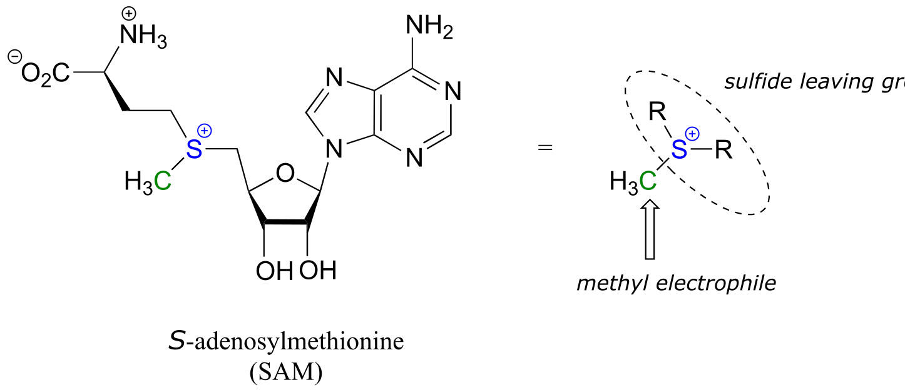

fig42

There are many variations of SAM-dependent methylation reactions in
nature. In the introduction to this chapter, we were introduced to a
reaction occurring in bacterial DNA in which a methyl carbon is
transferred from SAM to a nitrogen atom on adenine (this type of
reaction is often referred to as *N*-methylation).

fig 43(*Nucleic Acids* *Res*. **2000**, *28*, 3950).

In the figure above, we are showing how an aspartate residue in the
active site of the enzyme acts as a catalytic base: transfer of a proton
from substrate to the aspartate side chain begins to enhance the
nucleophilicity of the amine nitrogen as it approaches the electrophilic
methyl carbon of SAM, and formation of the new N-C bond and cleavage of
the C-S bond begins. These four bond-rearranging events probably take
place in concerted fashion. A likely transition state is approximated
below:

fig 43a

Of course, there are many other noncovalent interactions between active
site enzyme residues and the substrate (the adenine base) and cofactor
(SAM), but in the interest of clarity these are not shown. These
interactions, many of which are hydrogen-bonds, help to position the
adenine base and SAM in just the right relative orientation inside the
active site for the nucleophilic attack to take place. (If you have
access to American Chemical Society journals, a paper about an enzyme
catalyzing a similar *N*-methylation reaction contains some detailed
figures showing hydrogen-bond and charge-dipole interactions between the
enzyme active site and the two substrates: see [*Biochemistry* **2003**,
*42*, 8394](http://pubs.acs.org/doi/full/10.1021/bi034245a), figure 4).

The electrophile is a methyl carbon, so there is little steric hindrance
to slow down the nucleophilic attack. The carbon is electrophilic
(electron-poor) because it is bonded to a positively-charged sulfur,
which is a powerful electron withdrawing group. The positive charge on
the sulfur also makes it an excellent leaving group, because as it
leaves, it becomes a neutral and very stable sulfide. All in all, we
have a good nucleophile (enhanced by the catalytic base), an unhindered
electrophile, and an excellent leaving group. We can confidently predict
that this reaction is SN2. An SN1 mechanism is
extremely unlikely: a methyl cation is very unstable and thus is not a
reasonable intermediate to propose.

Notice something else about the SAM methylation mechanism illustrated in
the previous figure. It is ***ter**molecular*: there are *three* players
acting in concert: the catalytic base, the nucleophile, and the
electrophile. This is possible because the all three players are bound
in a very specific geometry in the active site of the enzyme. In a
reaction that takes place free in solution, rather than in an active
site, the likelihood of three separate molecules colliding all at once,
with just the right geometry for a reaction to take place, is very, very
low. You should notice going forward that when we illustrate the
mechanism of a reaction that takes place free in solution, we will only
see *bimolecular* steps - *two* molecules colliding. Almost all of the
biochemical reactions we see in this book will be enzyme-catalyzed - and
termolecular steps will be common - while almost all of the laboratory
reactions we see will take place free in solution, so we will only see
unimolecular and bimolecular steps. (Synthetic chemists often employ
non-biological catalysts that mimic enzyme active sites, but these
examples are well beyond the scope of our discussion).

<u>Exercise 8.16</u>: Think back to the acid-base chapter: the pKa of a
protonated ether is approximately zero, indicating that an ether is a
very weak base. Considering periodic trends in acidity and basicity,
what can you say about the relative basicity of a sulfide?

Another SAM-dependent methylation reaction is catalyzed by an enzyme
called catechol-*O*-methyltransferase. The substrate here is
epinephrine, also known as adrenaline, and the reaction is part of the
pathway by which adrenaline is degraded in the body.

fig 44

Notice that in this example, the attacking nucleophile is a phenol
oxygen rather than a nitrogen (that’s why the enzyme is called an
*O*-methyltransferase). In many cases when drawing biochemical reaction
mechanisms, we use the abbreviations B: for a catalytic base and H-A for
a catalytic acid, in order to keep the drawings from getting too 'busy'
(it's also possible that the identity of the acidic or basic group may
not be known).

<u>Exercise 8.17</u>: SAM is formed by a nucleophilic substitution
reaction between methionine and adenosine triphosphate (ATP). Draw a
mechanism for this reaction, and explain why you chose either an
SN1 or and SN2 pathway.

<u>  
</u>

### 8.7B: A biochemical SN1 reaction

As we will see in chapter 10, enzyme-catalyzed SN1 reactions
play a critical role in carbohydrate and DNA/RNA nucleotide metabolism.
The reaction below is part of nucleotide biosynthesis:

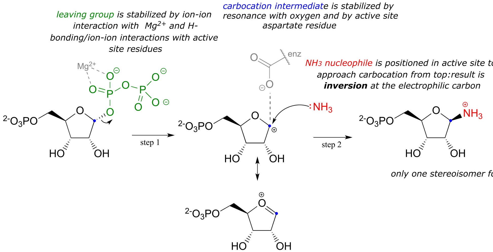

fig 48

Notice a few things here: first, the diphosphate leaving group is
stabilized by interactions with Mg+2 ion bound in the active
site and also by hydrogen-bonding with active site amino acid residues
(not shown). The carbocation intermediate is stabilized by resonance
with the lone pairs on the oxygen (see section 8.5), and also by an
active site aspartate side chain. The ammonia nucleophile is positioned
in the active site so that it approaches from the 'top' side of the
planar carbocation intermediate, and the substitution results in
inversion of configuration. Remember: SN1 reactions which
occur free in solution tend to result in a mixture of stereoisomers, but
enzyme-catalyzed reactions - including enzymatic SN1 reactions such as
this one - are generally stereo- and regio-specific, meaning that they
almost always result in a *single* isomeric product, not a mixture of
products.

Recall the statement from section 8.4 that poor leaving groups often
need to be converted into good leaving groups. Backing up one metabolic
step from the reaction depicted above, we see that a poor (hydroxide)
leaving group on ribose-5-phosphate is first converted to a good
(diphosphate) leaving group, which can stabilized through interactions
with the active site of the enzyme catalyzing the SN1
reaction.

fig 48b

This preliminary phosphorylation step, which requires ATP (adenosine
triphosphate) as the donor of the diphosphate group, is a reaction that
we will study in much more detail in chapter 9.

### 8.7C: A biochemical SN1/SN2 hybrid reaction

The cysteine residues of certain proteins are modified by addition of a
15-carbon isoprene chain (section 1.3A) to the side chain thiol group.

fig 6

fig 46

The mechanistic details of this reaction are of particular interest to
biomedical scientists. The proteins that are substrates for this type of
modification are involved in cell signaling processes, and they are not
able to carry out their biological functions unless they are anchored to
a cell’s lipid membrane. The hydrocarbon group that becomes attached to
a cysteine residue in this reaction serves as the anchor.

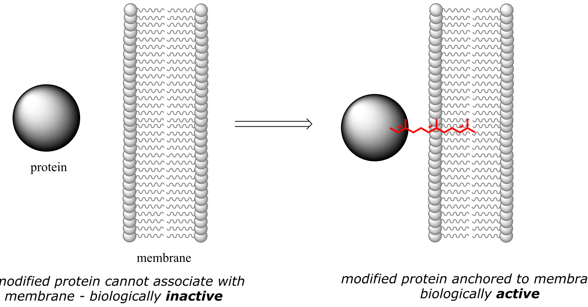

fig 47

Some of these proteins have been implicated in tumor formation.
Scientists hope that if they can find a way to shut down the cysteine
modification reaction, the tumor-causing proteins will not be able to
anchor to cell membranes and thus will remain inactive. The search is on
for an effective inhibitor of this enzyme to serve as a potential
anti-tumor drug.

How does the enzyme lower the energy barrier for this reaction?
Experimental evidence indicates that when a substrate protein is bound
to the active site of the enzyme, the cysteine thiol associates with a
zinc ion bound in the active site. As we learned in section 7.8, this
association will lower the pKa of the thiol to the point where it loses
a proton and exists as a thiolate anion in the active site - a thiolate
is a *very* potent nucleophile! Studies also show that the diphosphate
group forms stabilizing interactions with several amino acid residues
(two lysines, an arginine, a histidine, and a tyrosine) in the enzyme's
active site, making it a weaker base and thus a better leaving group.

*Biochemistry* **1998**, *37*, 16601

fig 46a

Is protein prenylation an SN1 or SN2 reaction? In
other words, to what extent does the nucleophile displace, or 'push' the
leaving group off, or to what extent does the leaving group leave on its
own, without a 'push' from the nucleophile? Along the same lines, to
what extent does a positive charge develop on the carbon center
(development of a full positive charge implies an SN1
mechanism). First, consider the electrophile: it is a primary allylic
carbon, so either pathway is possible (it is relatively unhindered for
SN2 attack, but could also form a resonance-stabilized
carbocation intermediate in an SN1 pathway). The nucleophile
is a very powerful thiolate ion, suggestive of an SN2
mechanism where a strong nucleophile actively displaces the leaving
group.

In fact, experiments designed to address this very question (see problem
P8.19) have provided evidence that the reaction is a mechanistic hybrid:
essentially SN2, but with *elements* of SN1. In
other words, at the transition state the electrophilic carbon takes on
some degree of positive charge, but a true carbocation intermediate does
not form. The take-home message here is that the SN1 and
SN2 mechanistic pictures we have studied in this chapter are
models, and while they are useful for learning about chemical principles
and accurate for describing many substitution reactions, other reactions
are not necessarily 'pure' SN1 or SN2, but
actually lie somewhere in between.

## Section 8.8: Nucleophilic substitution in the organic synthesis laboratory

### 8.8A: The Williamson ether synthesis

Synthetic organic chemists often make use of a reaction that is
conceptually very similar to the SAM-dependent methylation reactions we
saw earlier. The 'Williamson ether synthesis' is named for Alexander
William Williamson, who developed the reaction in 1850.

In the Williamson ether synthesis, an alcohol is first deprotonated by a
strong base, typically sodium hydride. An alkyl halide is then added to
the reaction mixture, and the alkoxide ion, a powerful nucleophile,
displaces the halide leaving group in an SN2 reaction.

fig 48a

For example, below we see methyl bromide performing the role of methyl
group donor, analogous to the role played by SAM in biochemical
methylation reactions:

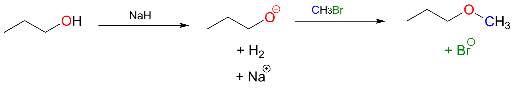

fig 49

Notice the difference between this non-biological laboratory reaction
and the biological, enzyme-catalyzed SAM methylation reaction we saw
earlier. Deprotonation of the nucleophile occurs as a separate step,
before the nucleophile attacks. Contrast this solution reaction (with
two bimolecular steps) to the enzyme-catalyzed SN2 reaction
(SAM methylation) we saw earlier, which involves a single, concerted
trimolecular step. Also notice that this non-biological reaction
involves a highly basic reagent (sodium hydride) and intermediate
(propanoate anion), which would be unreasonable to propose for a
reaction taking place under physiological conditions.

The Williamson ether synthesis will only work with methyl or primary
alkyl halides. If a secondary or tertiary alkyl halide is used, the
result will be formation of an *alkene* in what is called an
'elimination' reaction:

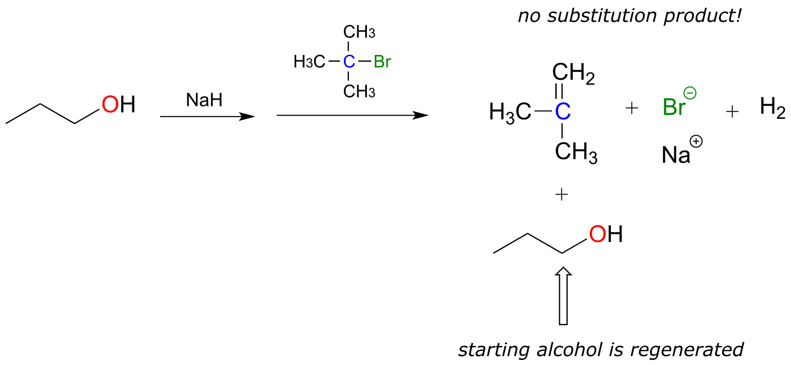

fig 50

We will study elimination reactions in chapter 14.

<u>Exercise 8.18</u>: A rookie organic chemist ran the reaction shown
above, hoping to synthesize an ether. Instead, he got the alkene shown.
What alkyl halide/alcohol combination should he have used instead to get
the ether product he was trying for?

<u>8.8B: Turning a poor leaving group into a good one - tosylates</u>

In section 8.4 it was mentioned how, in metabolic pathways, the
relatively poor OH leaving group of an alcohol can be converted into a
phosphate or diphosphate, which when stabilized by noncovalent
interactions inside an enzyme active site can be a very good leaving
group.

In laboratory synthesis, a similar goal can be accomplished by
converting an alcohol (a poor leaving group)to an organic **tosylate**
(a good leaving group) using tosyl chloride (the terms 'tosylate' and
'OTs', are abbreviations for *para*-toluene sulfonate). The alcohol to
tosylate reaction is not something we are equipped yet to understand,
but if we consider that the pKa of *para*-toluene sulfonic acid is -2.8,
we realize that the *para*-toluene sulfonate anion is a very weak base
and thus an very good leaving group. Conversion of alcohols to organic
tosylates is a very common step in organic synthesis schemes.

fig 24

## Key Concepts to Review

*Before you move on to the next chapter, you should be comfortable with
the following concepts and skills:*

<u>Nucleophilic substitution basics:</u>

Draw a complete mechanism for an SN2 reaction

Illustrate the transition state for an SN2 reaction

Understand how SN2 reactions result in inversion of
configuration at the electrophilic carbon.

Draw a complete mechanism for an SN1 reaction, in particular
a hydrolysis or other solvolysis SN1 reaction.

Draw an energy diagram illustrating the energy profile of a typical
SN1 solvolysis reaction.

Illustrate all transition states that are part of an SN1
reaction.

Understand that *non-enzymatic* SN1 reactions result in both
inversion and retention of configuration (racemization) at the
electrophilic carbon. *Enzymatic* SN1 reactions are
stereospecific, usually resulting in inversion at the electrophilic
carbon.

<u>Nucleophiles:</u>

Understand the factors that influence nucleophilicity. Be able to
evaluate the relative nucleophilicity of two or more compounds, and
predict relative rates of SN2 reactions with different
nucleophiles and a common electrophile.

Be able to recognize the nucleophile, electrophile, and leaving group in
an SN1 or SN2 reaction.

Understand that – with the exception of the vertical periodic trend in
protic solvents – *in most cases anything that makes something a
stronger base also makes it a more powerful nucleophile:*

> The horizontal periodic trend in nucleophilicity: for example,
> NH3 is a better nucleophile than H2O.
>
> The vertical periodic trend in nucleophilicity *for reactions in polar
> aprotic solvents*: chloride ion is a better nucleophile than bromide
> ion in acetone solvent.
>
> Protonation state: for example, hydroxide ion is a better nucleophile
> than water.
>
> Inductive effect: electron-withdrawing groups decrease nucleophilicity
>
> Resonance effects:
>
> Delocalization of negative charge/electron density decreases
> nucleophilicity. For example, methoxide ion
> (CH3O-) is a stronger nucleophile than acetate
> ion.

In addition:

> Steric effects: less sterically hindered nucleophiles are more
> powerful. For example, ethanol is less hindered and more nucleophilic
> than *tert*-butyl alcohol.
>
> The vertical periodic trend *in protic solvent* (water or alcohol) is
> opposite the trend in basicity: for example, thiols are more
> nucleophilic than alcohols.

<u>Electrophiles</u>

Electrophiles are electron poor atoms: for our present purposes this
means a carbon bonded to an electronegative atom.

Less hindered electrophiles will react faster in SN2
reactions: for example chloromethane is a better electrophile than a
primary alkyl chloride.

<u>Leaving groups</u>

The trends in leaving groups parallel trends in basicity. *A good
leaving group is a weak base.*

Common laboratory leaving groups are halides and para-toluenesulfonate
(abbreviated tosyl, or OTs).

Common biochemical leaving groups are phosphates and sulfide.

<u>Carbocation stability</u>

Understand that, in general, factors which destabilize a negative charge
will stabilize a positive charge.

More substituted carbocations are more stable: for example, a tertiary
carbocation is more stable than a secondary carbocation.

Allylic and benzylic carbocations, in which the positive charge is
delocalized by resonance, are relatively stable.

The presence of electron-withdrawing groups (by inductive or resonance
effects) decreases carbocation stability.

The presence of electron-donating groups (by inductive or resonance
effects) increases carbocation stability.

The presence of a heteroatom can stabilize a nearby carbocation by the
resonance-based electron donating effect. Otherwise, heteroatoms act as
weakly electron withdrawing carbocation-destabilizing groups by
inductive effects.

<u>General concepts and skills</u>

Be able to predict whether a given substitution reaction is likely to
proceed by SN2 or SN1 mechanisms, based on the
identity of the nucleophile, the electrophile, and the solvent.

> SN2 reactions involve strong nucleophiles and unhindered
> electophiles, and are accelerated by the use of polar, aprotic
> solvents.
>
> SN1 reactions involve weaker nucleophiles relatively stable
> carbocations, and are accelerated by protic solvents.

Given a nucleophile and electrophile, be able to predict the product(s)
of a nonenzymatic substitution reaction, and predict a mechanisms
(SN1 or SN2). Be able to predict different
regiochemical and stereochemical outcomes leading to formation of more
than one product.

Be able to 'think backwards' to show the starting compounds in a
substitution reaction, given a product or products.

Be able to recognize and draw a complete mechanism for a biochemical
nucleophilic substitution reaction. Be able to evaluate the nucleophile,
electrophile, and leaving group in the reaction, and predict whether the
reaction is likely to have more SN2 or SN1
character.

Understand how S-adenosylmethionine (SAM) acts as a methyl group donor
in biochemical SN2 reactions.

Be able to select appropriate alkyl halide and alcohol starting
compounds to synthesize a given ether product, using the Williamson
ether synthesis procedure.

## Problems

**P8.1:** Rank the following molecules in order of how fast they would
be expected to react with CH3SNa in acetone.
(CH3SNa is simply the sodium salt of
CH3S-. Na+ is a spectator ion.)

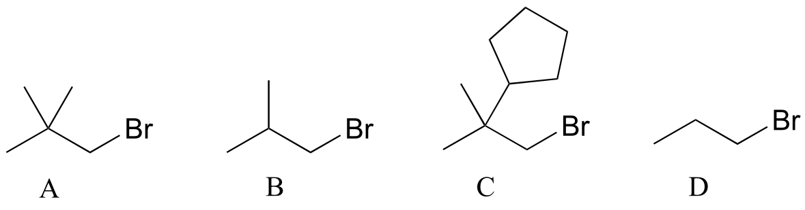

**P8.2:** Draw line structures representing the *most stable* cation
with the given molecular formula:

a\) C3H7+ b)
C4H9+ c)
C3H8N+ d)
C4H7+

**P8.3:** For each pair of carbocations below, choose the one that is
more stable, and explain your reasoning.

**  
**

**P8.4:** Arrange the following species in order of increasing
nucleophilicity in protic solvent:

**P8.5:** Predict the organic products of the following nucleophilic
substitution reactions, all of which are carried out in polar aprotic
solvent. Show stereochemistry at chiral carbons. Hints:
Na2CO3, sodium carbonate, is a weak base. For part
(f): What is the conjugate acid of NH2-? What is
the pKa of this conjugate acid, and what is the pKa of a terminal
alkyne?

**P8.6:** Which of the reactions in the previous problem has a
*unimolecular* rate determining step? Explain.

**P8.7:** From the following pairs, select the compound that would react
more rapidly with bromomethane in acetone solvent.

a\) water or hydroxide ion

b\) CH3S- or CH3OH

c\) CH2S- or CH3SH

d\) acetate ion or hydroxide ion

e\) diethyl sulfide or diethyl ether

f\) dimethylamine or diethylether

g\) trimethylamine or 2,2-dimethylpropane

**P8.8:** Methyl iodide (0.10 mole) is added to a solution that contains
0.10 mole NaOCH3 and 0.10 mole NaSCH3.

a\) Predict the most abundant neutral organic product that would form,
and explain your reasoning.

b\) Assume that you isolate a mixture the major product (which you
predicted in part) along with a smaller amount of a different
nucleophilic substitution product. Explain briefly but specifically how
you could use 1H-NMR to determine the ratio of the two
products in the mixture.

**P8.9:** For each pair of compounds, predict which will more rapidly
undergo solvolysis in methanol solution.

**P8.10:** Predict the solvolysis product(s) of each of the reactions
below. Consider both regiochemistry and stereochemistry.

e\) Draw a complete curved-arrow mechanism for the formation of the
secondary allylilc alcohol product in part (a).

**P8.11:** Show starting compounds that would lead to the following
products through nucleophilic substitution reactions.

**P8.12:** The fused ring compound shown below is very unreactive to
nucleophilic substitution, even with a powerful nucleophile.. Explain.
(Hint – consider bond geometry - a model will be very helpful!)

**P8.13** Laboratory synthesis of isopentenyl diphosphate - the
'building block' molecule used by nature for the construction of
isoprenoid molecules (section 1.3A) - was accomplished by first
converting isopentenyl alcohol into an alkyl tosylate then displacing
the tosylate group with an inorganic pyrophosphate nucleophile. Based on
this verbal description, draw a mechanism for the second (nucleophilic
substitution) step, showing starting and ending compounds for the step
and curved arrows for electron movement. (*J. Org. Chem* **1986**, *51*,
4768).

**P8.14:** Choline, an important neutotransmitter in the nervous system,
is formed from 2-(*N,N*-dimethylamino)ethanol:

a\) Besides the enzyme and the starting compound, what other important
biomolecule do you expect plays a part in the reaction?

b\) Draw a mechanism for the reaction.

c\) Briefly explain how 1H-NMR could be used to distinguish
between the substrate and the product of this reaction.

P8.15 The following is a reaction in the biosynthesis of morphine in
opium poppies. (*Science* 1967, *155*, 170; *J. Biol. Chem* 1995, *270*,
31091).

a)Draw a complete mechanism, assuming an SN1 pathway.

b\) What would you expect to be the most noticeable difference between
the IR spectrum of the product and that of the substrate?

c\) This reaction is an example of the regiospecificity of enzymatic
nucleophilic substitution reactions noted earlier in the chapter. Draw
two alternate nucleophilic, ring-closing steps for this reaction
(leading to different products from what is shown above), and explain
why these alternate pathways are both less favorable than the actual
reaction catalyzed by the enzyme.

**P8.16:** The enzymatic reaction below, which is part of the metabolism
of nucleic acids, proceeds by an SN1 mechanism. The new bond
formed in the substitution is indicated.

a\) Predict the structures of the two substrates A and B.

b\) Draw a complete mechanism, and use resonance drawings to illustrate
how both the carbocation intermediate and the leaving group are
stabilized.

P8.17: Below is the first step of the reaction catalyzed by anthranilate
synthase, an enzyme involved in biosynthesis of the amino acid
tryptophan.

a\) This reaction is somewhat unusual in that the leaving group is a
hydroxide anion, which is of course is normally thought to be a very
poor leaving group. However, studies show that an Mg+2 ion is
bound in the active site close to the hydroxide. Explain how the
presence of the magnesium ion contributes to the viability of hydroxide
as a leaving group.

b\) Draw a complete mechanism for the reaction, assuming an
SN1 pathway.

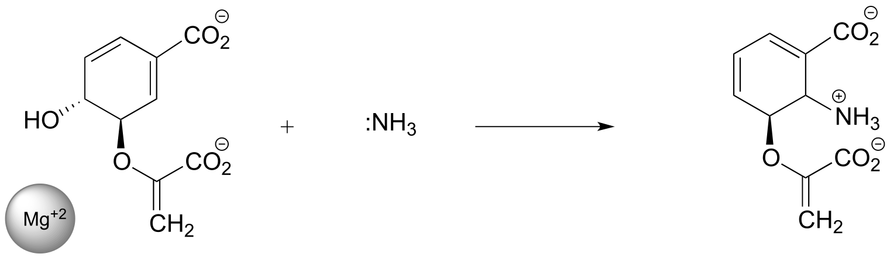

**P8.18:** The reaction below is part of the biosynthesis of
peptidoglycan, a major component of bacterial cell walls. Is it likely
to proceed by a nucleophilic substitution mechanism? Explain.

**P8.19:** Compare the reaction below, catalyzed by the enzyme AMP-DMAPP
transferase, to the protein prenyltransferase reaction we learned about
in section 8.8C, the mechanism of which, as we discussed, is thought to
be *mostly* SN2-like with some SN1-like character.

a\) Is the AMP-DMAPP transferase reaction below likely to have more or
less SN1-like character compared to the protein
prenyltransferase reaction? Explain.

b\) Given your answer to part (a), which reaction is likely to be more
dramatically slowed down when a fluorinated isoprenoid substrate analog
is substituted for the natural substrate? Explain.

**P8.20:** In a classic experiment in physical organic chemistry,
(*R*)-2-iodooctane was allowed to react (non-enzymatically) with a
radioactive isotope of iodide ion, and the researchers monitored how
fast the radioactive iodide was incorporated into the alkane (the rate
constant of incorporation, k*i* ) and also how fast optical
activity was lost (the rate constant of racemization, k*r*).
They found that the rate of racemization was, within experimental error,
equal to twice the rate of incorporation. Discuss the significance of
this result - what does it say about the actual mechanism of the
reaction?

# Tables

**<u>List of tables:</u>**

**Table 1:** Some characteristic absorption frequencies in IR
spectroscopy

**Table 2**: Typical values for 1H-NMR chemical shifts

**Table 3**: Typical values for 13C-NMR chemical shifts

**Table 4**: Typical coupling constants in NMR

**Table 5:** The 20 common amino acids

**Table 6**: Structures of common coenzymes

**Table 7:** Representative acid constants

**Table 8:** Some common laboratory solvents, acids, and bases

**Table 9:** Examples of common functional groups in organic chemistry

##  Table 1: Some characteristic absorption frequencies in IR spectroscopy

| **<u>Bond type</u>**          | **<u>frequency (cm-1)</u>** |
|-------------------------------|----------------------------------------|
| C-H alkanes                   | 2950 – 2850                            |
| C-H alkenes                   | 3080 – 3020                            |
| C-H aldehyde                  | \~2900                                 |
| C-H alkyne                    | \~3300                                 |
| alkyne triple bond            | 2250 – 2100 (s)                        |
| alkene double bond            | 1680 - 1620(s)                         |
| carbonyl, ketone              | 1725 – 1700 (s)                        |
| carbonyl, aldehyde            | 1740 – 1720 (s)                        |
| carbonyl, ester               | 1750 – 1730 (s)                        |
| carbonyl, acid                | 1725 – 1700 (s)                        |
| carbonyl, amide               | 1690 – 1650 (s)                        |
| O-H, alcohols                 | 3600 – 3200 (s, broad)                 |
| O-H, acids                    | 3000 – 2500 (broad)                    |
| C-O, alcohols, esters, ethers | 1300 - 1000                            |

s = strong absorbance

##  Table 2: Typical values for 1H-NMR chemical shifts

| **<u>Hydrogen type</u>**                                              | **<u>Chemical shift (ppm)</u>** |
|-----------------------------------------------------------------------|---------------------------------|
| RC**<u>H</u>**3                                            | 0.9 - 1.0                       |
| RC**<u>H</u>**2R                                           | 1.2 - 1.7                       |
| R3C**<u>H</u>**                                            | 1.5 – 2.0                       |
|                             | 2.0 – 2.3                       |
|                             | 1.5 – 1.8                       |
| RN**<u>H</u>**2                                            | 1 - 3                           |
| ArC**<u>H</u>**3                                           | 2.2 – 2.4                       |
|                             | 2.3 – 3.0                       |
|                             | 3.7 – 3.9                       |
| 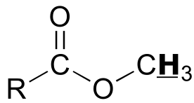 | 3.7 – 3.9                       |
| RO**<u>H</u>**                                                        | 1 - 5                           |
|                             | 3.7 – 6.5                       |
|                             | 5 - 9                           |
| Ar**<u>H</u>**                                                        | 6.0 – 8.7                       |
|                             | 9.5 – 10.0                      |
|                             | 10 - 13                         |

Chemical shift values are in parts per million (ppm) relative to
tetramethylsilane.

##  Table 3: Typical values for 13C-NMR chemical shifts

<table>
<colgroup>
<col style="width: 37%" />
<col style="width: 62%" />
</colgroup>
<thead>
<tr class="header">
<th><strong><u>Carbon type</u></strong></th>
<th><strong><u>Chemical shift (ppm)</u></strong></th>
</tr>
</thead>
<tbody>
<tr class="odd">
<td>R<strong><u>C</u></strong>H3</td>
<td>13 - 16</td>
</tr>
<tr class="even">
<td>R<strong><u>C</u></strong>H2R</td>
<td>16 - 25</td>
</tr>
<tr class="odd">
<td>R3<strong><u>C</u></strong>H</td>
<td>25 - 35</td>
</tr>
<tr class="even">
<td></td>
<td>18 - 22</td>
</tr>
<tr class="odd">
<td></td>
<td>28 - 32</td>
</tr>
<tr class="even">
<td>R<strong><u>C</u></strong>H2NHR</td>
<td>35 - 45</td>
</tr>
<tr class="odd">
<td>R<strong><u>C</u></strong>H2OH</td>
<td>50 - 65</td>
</tr>
<tr class="even">
<td></td>
<td>65 - 70</td>
</tr>
<tr class="odd">
<td>RO<strong><u>C</u></strong>H2R</td>
<td>50 - 75</td>
</tr>
<tr class="even">
<td></td>
<td>50 - 75</td>
</tr>
<tr class="odd">
<td></td>
<td>115 - 120</td>
</tr>
<tr class="even">
<td></td>
<td>125 - 140</td>
</tr>
<tr class="odd">
<td>aromatic carbon</td>
<td>125 - 150</td>
</tr>
<tr class="even">
<td>

(carboxylic acid derivatives)
</td>
<td>165 - 185</td>
</tr>
<tr class="odd">
<td></td>
<td>190 - 200</td>
</tr>
<tr class="even">
<td></td>
<td>200 - 220</td>
</tr>
</tbody>
</table>

##  Table 4: Typical coupling constants in NMR

| **<u>H-H coupling</u>**                     | **<u>J (Hz)</u>** |     | **<u>C-H coupling</u>**                     | **<u>J (Hz)</u>** |
|---------------------------------------------|-------------------|-----|---------------------------------------------|-------------------|
| 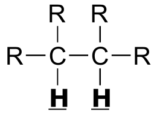  | 6 -8              |     |   | 125 - 130         |
|   | 2 - 3             |     |   | 150 - 170         |
|   | 12 - 18           |     |                                             |                   |
|   | 6 - 12            |     |                                             |                   |
|   | 0 - 2             |     |                                             |                   |
|   | 6 - 10            |     |                                             |                   |
|   | 1- 3              |     |                                             |                   |

##  Table 5: The 20 common amino acids

<table>
<colgroup>
<col style="width: 19%" />
<col style="width: 23%" />
<col style="width: 21%" />
<col style="width: 16%" />
<col style="width: 18%" />
</colgroup>
<thead>
<tr class="header">
<th></th>
<th></th>
<th></th>
<th>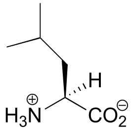</th>
<th>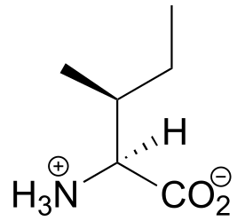</th>
</tr>
</thead>
<tbody>
<tr class="odd">
<td><strong>Glycine 
</strong>(Gly, G)</td>
<td><strong>Alanine 
</strong>(Ala, A)</td>
<td><strong>Valine 
</strong>(Val, V)</td>
<td><strong>Leucine 
</strong>(Leu, L)</td>
<td><strong>Isoleucine 
</strong>(Ile, I)</td>
</tr>
<tr class="even">
<td></td>
<td></td>
<td></td>
<td></td>
<td></td>
</tr>
<tr class="odd">
<td><strong>Phenylalanine 
</strong>(Phe, F)</td>
<td>
<strong>Tyrosine</strong>

(Tyr, Y)
</td>
<td>
<strong>Tryptophan</strong>

(Trp, W)
</td>
<td>
<strong>Methionine</strong>

(Met, M)
</td>
<td>
<strong>Cysteine</strong>

(Cys, C)
</td>
</tr>
<tr class="even">
<td>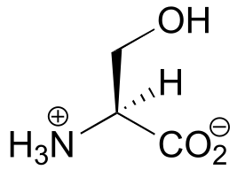</td>
<td></td>
<td></td>
<td></td>
<td></td>
</tr>
<tr class="odd">
<td>
<strong>Serine</strong>

(Ser, S)
</td>
<td>
<strong>Threonine</strong>

(Thr, T)
</td>
<td>
<strong>Arginine</strong>

(Arg, R)
</td>
<td>
<strong>Lysine</strong>

(Lys, K)
</td>
<td>
<strong>Histidine</strong>

(His, H)
</td>
</tr>
<tr class="even">
<td>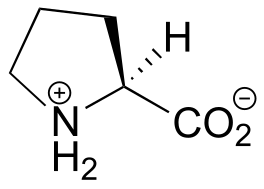</td>
<td>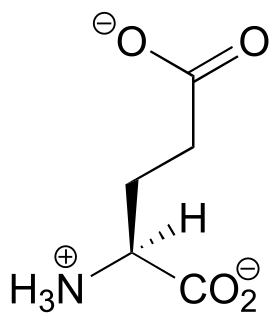</td>
<td></td>
<td></td>
<td></td>
</tr>
<tr class="odd">
<td>
<strong>Proline</strong>

(Pro, P)
</td>
<td>
<strong>Glutamate</strong>

(Glu, E)
</td>
<td>
<strong>Aspartate</strong>

(Asp, D)
</td>
<td>
<strong>Glutamine</strong>

(Gln, Q)
</td>
<td>
<strong>Asparagine</strong>

(Asn, N)
</td>
</tr>
</tbody>
</table>

##  Table 6: Structures of common coenzymes

Table 5

##  

## Table 7: Representative acid constants. 

| **<u>acid</u>**                                                        | **<u>pKa</u>** | **<u>conjugate base</u>**                                             |
|------------------------------------------------------------------------|---------------------------|-----------------------------------------------------------------------|
| 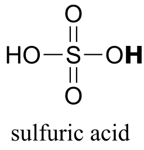                             | -10                       | 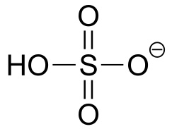                            |
| HCl                                                                    | -7                        | Cl-                                                        |
| H3O+                                             | -1.7                      | H2O                                                        |
|                              | -1.4                      | 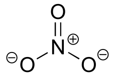                            |
| 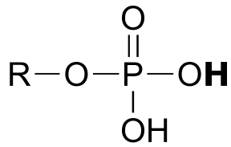                             | 1.0(i)         |                             |
|                              | 2.2(ii)        |                             |
| HF                                                                     | 3.2                       | F-                                                         |
|                              | 4.6                       |                             |
|   | 4-5                       |  |
|  | 5.3(ii)        |                             |

| **<u>acid</u>**                             | **<u>pKa</u>** | **<u>conjugate base</u>**                   |
|---------------------------------------------|---------------------------|---------------------------------------------|
|   | 6.4                       |   |
|   | 6.5(i)         |   |
|   | 7.2(ii)        |   |
| 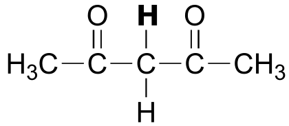  | 9.0                       |   |
| HCN                                         | 9.2                       | CN-                              |
| 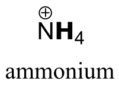  | 9.2                       |   |
|   | 9.9(ii)        | 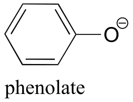  |
|   | 10.3(ii)       |   |
| RS**H**                                     | 10-11                     | RS-                              |
| RNH3+                 | 10 -11                    | RNH2                             |
|   | 12.3(i)        |   |
| H2O                              | 15.7                      | OH-                              |

**<u>  
</u>**

<table>
<colgroup>
<col style="width: 38%" />
<col style="width: 31%" />
<col style="width: 29%" />
</colgroup>
<thead>
<tr class="header">
<th><strong><u>acid</u></strong></th>
<th><strong><u>pKa</u></strong></th>
<th><strong><u>conjugate base</u></strong></th>
</tr>
</thead>
<tbody>
<tr class="odd">
<td></td>
<td>17</td>
<td></td>
</tr>
<tr class="even">
<td>RCH2O<strong>H</strong></td>
<td>16</td>
<td>RCH2O-</td>
</tr>
<tr class="odd">
<td></td>
<td>19-20</td>
<td></td>
</tr>
<tr class="even">
<td>
RCC<strong>H</strong>

terminal alkyne
</td>
<td>25</td>
<td>RCC-</td>
</tr>
<tr class="odd">
<td>H2</td>
<td>35</td>
<td>H-</td>
</tr>
<tr class="even">
<td>
NH3

ammonia
</td>
<td>38</td>
<td>NH2-</td>
</tr>
</tbody>
</table>

All pKa values, unless otherwise noted, are taken from March,
Jerry, <u>Advanced Organic Chemistry, Fourth Edition</u>, Wiley, New
York, 1992.

(i) Silva, J.J.R. Fraústo da, <u>The Biological Chemistry of
the Elements: the Inorganic Chemistry of Life, 2nd
Edition</u>, Oxford, New York, 2001.

(ii)Lide, David R. (ed.) <u>The CRC Handbook of Chemistry and
Physics</u>, CRC Press, Boca Raton, FL, 1995.

**Table 8:** Some common laboratory solvents, acids, and bases (fig 10)

S**olvents**

**Acids**

**Bases**

*very strong bases:*

*weaker bases:*

  
**Table 9:** Examples of common functional groups in organic chemistry

<table>
<colgroup>
<col style="width: 21%" />
<col style="width: 28%" />
<col style="width: 21%" />
<col style="width: 28%" />
</colgroup>
<thead>
<tr class="header">
<th><strong>alkane</strong></th>
<th></th>
<th><strong>ketone</strong></th>
<th></th>
</tr>
</thead>
<tbody>
<tr class="odd">
<td><strong>alkene</strong></td>
<td></td>
<td><strong>aldehyde</strong></td>
<td></td>
</tr>
<tr class="even">
<td><strong>alkyne</strong></td>
<td></td>
<td>
<strong>imine</strong>

<strong>(Schiff base)</strong>
</td>
<td></td>
</tr>
<tr class="odd">
<td><strong>aromatic hydrocarbon</strong></td>
<td></td>
<td><strong>carboxylic acid</strong></td>
<td></td>
</tr>
<tr class="even">
<td><strong>alkyl halide</strong></td>
<td></td>
<td><strong>ester</strong></td>
<td></td>
</tr>
<tr class="odd">
<td><strong>alcohol</strong></td>
<td></td>
<td><strong>thioester</strong></td>
<td>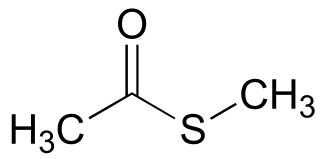</td>
</tr>
<tr class="even">
<td><strong>thiol</strong></td>
<td></td>
<td><strong>amide</strong></td>
<td>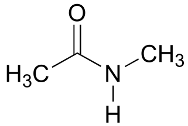</td>
</tr>
<tr class="odd">
<td><strong>amine</strong></td>
<td></td>
<td><strong>acyl phosphate</strong></td>
<td></td>
</tr>
<tr class="even">
<td><strong>ether</strong></td>
<td></td>
<td><strong>acid chloride</strong></td>
<td></td>
</tr>
<tr class="odd">
<td><strong>sulfide</strong></td>
<td></td>
<td><strong>phosphate ester</strong></td>
<td>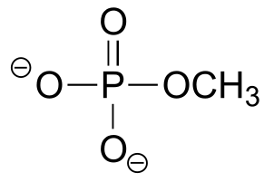</td>
</tr>
<tr class="even">
<td><strong>phenol</strong></td>
<td></td>
<td><strong>phosphate diester</strong></td>
<td>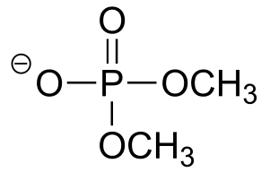</td>
</tr>
</tbody>
</table>
