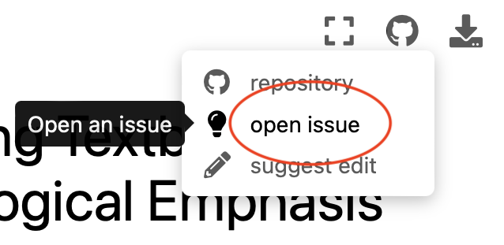

## Welcome to the Unofficial Living Textbook: Organic Chemistry With a Biological Emphasis

This page was created as a resource for organic chemistry students at Dickinson College. We'll be using it to update the textbook and add new content! *If you're here to suggest edits to the textbook for extra credit, see the guide below.*

### How to suggest edits

We'll be keeping track of changes to the textbook via a coding collaboration tool called "GitHub". Thus, to suggest edits, you'll need to [create a GitHub account](https://github.com/signup?ref_cta=Sign+up&ref_loc=header+logged+out&ref_page=%2F&source=header-home) if you don't have one already.

If you think that you've found an error and would like to suggest an edit, navigate to the relevant chapter (using the sidebar on the left) and click the dropdown "suggest edit" as shown below:

This will take you to the source code on GitHub where you'll need to log in and create a new "pull request". You can then edit the page and submit the pull request. This will allow me to review the change before it gets merged into the textbook.

### Formatting

The formatting of the textbook (including this page) is written in [markdown](https://en.wikipedia.org/wiki/Markdown), which is sort of a coding language of it's own designed for writing. You don't have to worry about using markdown too much (unless you want to). I'll format your changes if your edits look wonky.

### Images and Figures

I already know that there are a some images in the text that are not exactly right. The Chemdraws converted strangely when I pulled them out of the original Word Doc. *Please do not submit edits for wonky looking figures with overlapping text.* However, if you find an *error* in a figure, you can submit that change as an "issue" in the dropdown:

Please provide the chapter and figure number in the description of the issue, and I'll make the change when I get a chance to draw up the new figure.

**The cover page contents of the original textbook continue below:**

## Organic Chemistry With a Biological Emphasis

**Tim Soderberg, University of Minnesota, Morris, January 2016**

This work is licensed under the Creative Commons
Attribution-NonCommercial-ShareAlike 4.0 International License.

https://creativecommons.org/licenses/by-nc-sa/4.0/

**Notes to the reader:**

This textbook is intended for a sophomore-level, two-semester course in
Organic Chemistry targeted at Biology, Biochemistry, and Health Science
majors. It is assumed that readers have taken a year of General
Chemistry and college level Introductory Biology, and are concurrently
enrolled in the typical Biology curriculum for sophomore Biology/Health
Sciences majors.

This textbook is meant to be a constantly evolving work in progress, and
as such, feedback from students, instructors, and all other readers is
greatly appreciated. Please send any comments, suggestions, or
notification of errors to the author at soderbt@morris.umn.edu.

If you are looking at a black and white printed version of this
textbook, please be aware that most of the figures throughout are meant
to contain color, which is used to help the reader to understand the
concepts being illustrated. It will often be very helpful to refer to
the full-color figures in a digital version of the book, either at the
Chemwiki site (see below) or in a PDF version which is available for
free download at:

http://facultypages.morris.umn.edu/\~soderbt/textbook_website.htm

An online version is accessible as part of the **Chemwiki** project at
the University of California, Davis:

> http://chemwiki.ucdavis.edu/Organic_Chemistry/Organic_Chemistry_With_a\_Biological_Emphasis.

This online version contains some additional hyperlinks to animations,
interactive 3D figures, and online lectures that you may find useful.
*Note*: The online (Chemwiki) version currently corresponds to the older
(2012) edition of this textbook. It is scheduled to be updated to this
2016 edition during the spring and summer of 2016.

*Where is the index?* There is no printed index. However, an electronic
index is available simply by opening the digital (pdf) version of the
text (see above) and using the 'find' or 'search' function of your pdf
viewer.

