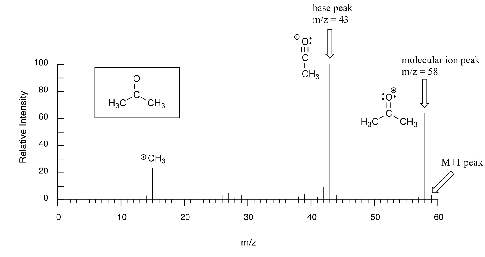
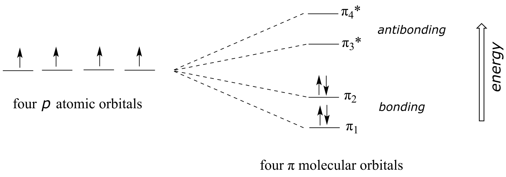
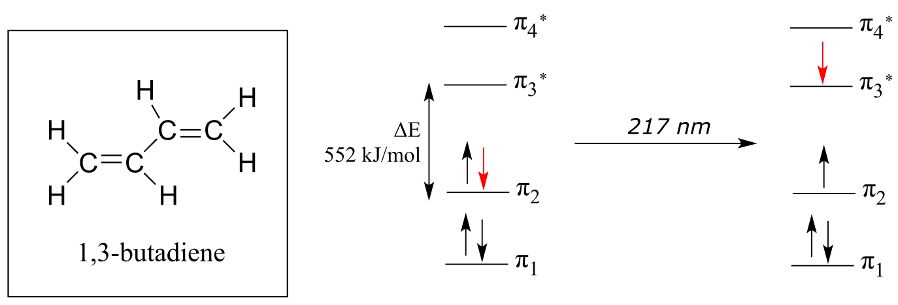
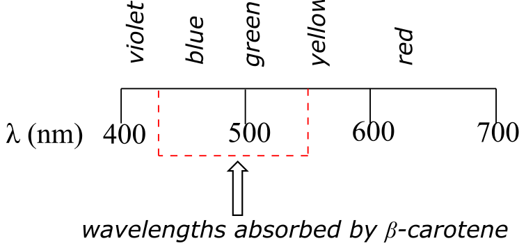

# 4: Structure determination, part I: Mass spectrometry, infrared, and UV-visible spectroscopy

(Photo credit: https://www.flickr.com/photos/vamapaull/)

In the end, it was a 'funky yellow color' that led to the demise of
Charles Heller's not-so-illustrious career in the world of collectable
art.

[William Aiken
Walker](https://en.wikipedia.org/wiki/William_Aiken_Walker) was a
19th-century 'genre' painter, known for his small scenes of
sharecroppers working the fields in the post-Civil War south. For much
of his career, he traveled extensively, throughout the southern states
but also to New York City and even as far as Cuba. He earned a decent
living wherever he went by setting up shop on the sidewalk and selling
his paintings to tourists, usually for a few dollars each. While he
never became a household name in the art world, he was prolific and
popular, and his paintings are today considered collectible, often
selling for upwards of ten thousand dollars.

In August, 1994, Robert Hicklin, an art gallery owner in Charleston,
South Carolina, was appraising a Walker painting brought to him by
another South Carolina art dealer named Rick Simons. Hicklin's years of
experience with Walker paintings told him that something just wasn't
right with this one - he was particularly bothered by one of the
pigments used, which he later described in a story in the *Maine Antique
Digest* as a 'funky yellow color'. Reluctantly, he told Simons that it
almost certainly was a fake.

Hoping that Hicklin was wrong, Simons decided to submit his painting to
other experts for analysis, and eventually it ended up in the laboratory
of James Martin, whose company *Orion Analytical* specializes in
forensic materials analysis. Using a technique called infrared
spectroscopy, Martin was able to positively identify the suspicious
yellow pigment as an organic compound called ['Pigment Yellow
3'](http://www.colorrich.net/products-148731-0-item-268944.html).

fig 1a

As it turns out, Pigment Yellow 3 had not become available in the United
States until many years after William Aiken Walker died.

Simons had purchased his painting from a man named Robert Heller for
\$9,500. When Heller approached him again to offer several more Walker
paintings for sale, Simons contacted the FBI. A few days later, with FBI
agents listening in, Simons agreed to buy two more Walker paintings.
When he received them, they were promptly analyzed and found to be fake.
Heller, who turned out to be a convicted felon, was arrested and
eventually imprisoned.

(You may want to check out a [short
article](http://pubs.acs.org/doi/abs/10.1021/cen-v085n037.p028) from the
September 10, 2007 issue of *Chemical and Engineering* News for more
about this story).

In the first three chapters of this text, we have focused our efforts on
learning about the structure of organic compounds. Now that we know what
organic molecules look like, we can begin to address, in the next two
chapters, the question of *how* we get this knowledge in the first
place. How are chemists able to draw with confidence the bonding
arrangements in organic molecules, even simple ones such as acetone or
ethanol? How was James Martin at Orion Analytical able to identify the
chemical structure of the pigment compound responsible for the 'funky
yellow color' in the forged William Aiken Walker painting?

This chapter is devoted to three very important techniques used by
chemists to learn about the structures of organic molecules. First, we
will learn how **mass spectrometry** can provide us with information
about the mass of a molecule as well as the mass of fragments into which
the molecule has been broken. Then, we will begin our investigation of
**molecular spectroscopy**, which is the study of how electromagnetic
radiation at different wavelengths interacts in different ways with
molecules - and how these interactions can be quantified, analyzed, and
interpreted to gain information about molecular structure. After a brief
overview of the properties of light and the elements of a molecular
spectroscopy experiment, we will move to a discussion of **infrared (IR)
spectroscopy**, the key technique used in the detection of the Walker
forgery, and a way to learn about functional groups present in an
organic compound. Then, we will consider **ultraviolet-visible (UV-vis)
spectroscopy**, with which chemists gain information about conjugated
π-bonding systems in organic molecules, and how these conjugated systems
are the basis for the color of some organic compounds, including pigment
yellow \#3. We will see how information from UV-vis spectroscopy can be
used to measure the concentration of biomolecules in solution.

Looking ahead, Chapter 5 will be devoted to **nuclear magnetic resonance
(NMR) spectroscopy**, where we use ultra-strong magnets and radio
frequency radiation to learn about the electronic environment of
individual atoms in a molecule and use this information to determine the
atom-to-atom bonding arrangement. For most organic chemists, NMR is one
of the most powerful analytical tools available in terms of the wealth
of detailed information it can provide about the structure of a
molecule.

In summary, the structure determination techniques we will be studying
in this chapter and the next primarily attempt to address the following
questions about an organic molecule:

<u>Chapter 4:</u>

 Mass spectrometry (MS): *What is the atomic weight of the molecule and
 its common fragments?*

 Infrared (IR) spectroscopy: *what functional groups does the molecule
 contain?*

 Ultraviolet-visible (UV-Vis) spectroscopy: *What is the nature of
 conjugated π-bonding systems in the molecule?*

<u>Chapter 5:</u>

 Nuclear magnetic resonance spectroscopy (NMR): *What is the overall
 bonding framework of the molecule?*

##  4.1: Mass Spectrometry

Mass spectrometry (MS) is a powerful analytical technique widely used by
chemists, biologists, medical researchers, and environmental and
forensic scientists, among others. With MS, we are looking at the mass
of a molecule, or of different fragments of that molecule.

### 4.1A: Overview of mass spectrometry

There are many different types of MS instruments, but they all have the
same three essential components:

 1\) First, there is an ionization source, where the molecule is given
 a positive electrical charge, either by removing an electron or by
 adding a proton.

 2\) Depending on the ionization method used, the ionized molecule may
 or may not break apart into a population of smaller fragments

 3\) Next in line there is a mass analyzer, where the
 positively-charged fragments are separated according to mass.

 4\) Finally, there is a detector, which detects and quantifies the
 separated ions.

One of the more common types of MS techniques used in the organic
laboratory is **electron ionization** (EIMS). Although biomolecules are
usually too polar for this technique, it is useful for the analysis of
intermediates and products in laboratory synthesis, and is a good
starting place to learn about MS in general. In a typical EIMS
experiment, the sample molecule is bombarded by a high-energy electron
beam, which has the effect of knocking a valence electron off of the
molecule to form a **radical cation**. Because a great deal of energy is
transferred by this bombardment process, the radical cation quickly
begins to break up into smaller **fragments**, some of which are cations
(both radical and non-radical) and some of which are neutral. A subset
of the initially formed radical cations do not fragment at all - these
are referred to as **molecular ions**. The neutral fragments are either
adsorbed onto the walls of the chamber or are removed by a vacuum
source. The molecular ion and all other cationic fragments are
accelerated down a curved tube by an electric field.

fig 26

[another
image](http://www.chem.ucalgary.ca/courses/351/Carey5th/Ch13/1334.gif)

As they travel down the curved tube, the ions are deflected by a strong
magnetic field. Cations of different **mass to charge (*m/z*) ratios**
are deflected to a different extent, resulting in a sorting of ions by
mass (virtually all ions have charges of *z* = +1, so sorting by the
mass to charge ratio is essentially the same thing as sorting by mass).
A detector at the end of the curved flight tube records and quantifies
the sorted ions.

### 4.1B: Looking at mass spectra

Below is typical output for an electron-ionization MS experiment (MS
data in the section is derived from the [Spectral Database for Organic
Compounds](http://sdbs.db.aist.go.jp/sdbs/cgi-bin/cre_index.cgi), a
free, web-based database of spectra.)

fig 27

The sample is acetone. On the horizontal axis is the value for *m/z* (as
we stated above, the charge *z* is almost always +1, so in practice this
is the same as mass). On the vertical axis is the relative abundance of
each ion detected. On this scale, the most abundant ion, called the
**base peak**, is set to 100%, and all other peaks are recorded relative
to this value. In the acetone spectrum above, the base peak is at *m/z*
= 43, representing a fragment of acetone with a mass of 43 amu. The
molecular weight of acetone is 58, so we can identify the peak at *m/z*
= 58 as that corresponding to the **molecular ion peak**, or **parent
peak**. In some mass spectra, the molecular ion peak is the most
abundant peak, and so it is also the base peak by definition.

The data collected in a mass spectrum - a series of m/z values, each
associated with a relative abundance value - is a unique 'fingerprint'
of the compound being analyzed, so the spectrum of an unknown sample can
be used to search a computer database of MS spectra to come up with a
'hit', just as fingerprint information can be used by the police to
identify a suspect from a fingerprint database. In fact, mass
spectrometry is a powerful tool in criminal forensics.

An experienced chemist can gain a wealth of useful structural
information from a mass spectrum, even without access to a reference
database. The parent peak provides the molecular weight of the compound
being analyzed, which of course is a very useful piece of information.
However, much of the utility in electron-ionization MS comes from the
fact that the radical cations generated in the electron-bombardment
process tend to fragment in predictable ways. The base peak at *m/z* =
43 in the acetone spectrum, for example, is the result of the molecule
breaking apart into what is termed an acylium cation and a methyl
radical. The methyl radical fragment has a mass of 15 amu, but is not
detected because it is neutral, not a cation.

fig 29

Notice that we do in fact see a peak in the spectrum at m/z = 15, which
corresponds to a methyl cation, formed in a different fragmentation
event in which the second product is a neutral (and thus undetected)
radical fragment.

<u>Exercise 4.1</u>: Using the fragmentation patterns for acetone above
as a guide, predict the signals that you would find in the mass spectra
of:

a\) 2-butanone; b) 3-hexanone; c) cyclopentanone.

Many other organic functional groups and bonding arrangements have
predictable fragmentation patterns. As a rule, the cationic fragments
that form in greatest abundance are those which are, relatively
speaking, the most stable (we will learn about carbocation stability in
chapter 8). A discussion of the mechanisms for fragmentation in mass
spectrometry is outside the scope of this book, but will be covered if
you take more advanced courses in organic or analytical chemistry.

Notice in the mass spectrum of acetone that there is a small peak at
*m/z* = 59: this is referred to as the **M+1 peak**. How can there be an
ion that has a greater mass than the molecular ion? A small fraction -
about 1.1% - of all carbon atoms in nature are actually the
13C rather than the 12C isotope. The
13C isotope has an extra neutron in its nucleus, and thus is
heavier than 12C by 1 mass unit. The M+1 peak corresponds to
those few acetone molecules in the sample which contained a
13C.

Molecules with several oxygen atoms sometimes show a small **M+2 peak**
(2 *m/z* units greater than the parent peak) in their mass spectra, due
to the presence of a small amount of 18O (the most abundant
isotope of oxygen is 16O). Because there are two abundant
isotopes of both chlorine (about 75% 35Cl and 25%
37Cl) and bromine (about 50% 79Br and 50%
81Br), chlorinated and brominated compounds have very large
and recognizable M+2 peaks. Fragments containing both isotopes of
bromine can be seen in the mass spectrum of bromoethane: notice that the
equal abundance of the two isotopes is reflected in the equal height of
their corresponding peaks.

fig 28

The spectrum for chloroethane shows a parent peak at *m/z* = 64, and an
M+2 peak at 1/3 the height of the parent peak. These characteristic M+2
patterns are useful for identifying the presence of bromine or chlorine
in a sample.

<u>Exercise 4.2:</u> Predict some signals that you would expect to see
in a mass spectrum of 2-chloropropane.

<u>Exercise 4.3</u>: The mass spectrum of an aldehyde shows a parent
peak at *m/z* = 58 and a base peak at *m/z* = 29. Propose a structure,
and identify the two species whose *m/z* values were listed. (

### 4.1C: Gas Chromatography - Mass Spectrometry

Quite often, mass spectrometry is used in conjunction with a separation
technique called gas chromatography (GC). The combined GC-MS procedure
is very useful when dealing with a sample that is a mixture of two or
more different compounds, because the various compounds are separated
from one another before being subjected individually to MS analysis. We
will not go into the details of gas chromatography here, although if you
are taking an organic laboratory course you might well get a chance to
try your hand at GC, and you will almost certainly be exposed to the
conceptually analogous techniques of thin layer and column
chromatography. Suffice it to say that in GC, a very small amount of a
liquid sample is vaporized, injected into a long, coiled capillary
column, and pushed though the column by an inert gas, usually helium.
Along the way, different compounds in the sample stick to the walls of
the capillary column to different extents, and thus travel at different
speeds and emerge separately from the end of the column. In GC-MS, each
separated compound is sent directly from the end of the GC column into
the MS instrument, so in the end we get a separate mass spectrum for
each of the components in the original mixed sample.

[Schematic of a GC-MS
instrument](https://www.researchgate.net/profile/Gaojin_Lyu/publication/221927526/figure/fig1/AS:304730011127825@1449664704989/Fig-1-Schematic-of-a-GC-MS-system.png)

Ideally, this data can be used to search an MS database and identify
each compound in the sample.

The extremely high sensitivity of modern GC-MS instrumentation makes it
possible to detect and identify very small trace amounts of organic
compounds. GC-MS is being used increasingly by environmental chemists to
detect the presence of harmful organic contaminants in food and water
samples.

### 4.1D: Mass spectrometry of biomolecules

*Methods Enzymol*. **2005**, *402*, 3.

As was mentioned earlier, electron ionization mass spectrometry is
generally not very useful for analyzing biomolecules: their high
polarity makes it difficult to get them into the vapor phase, the first
step in EIMS. Mass spectrometry of biomolecules has undergone a
revolution over the past few decades, with many new ionization and
separation techniques being developed. Generally, the strategy for
biomolecule analysis involves **soft ionization**, in which much less
energy (compared to techniques such as EIMS) is imparted to the molecule
being analyzed during the ionization process. Usually, soft ionization
involves adding protons rather than removing electrons: the cations
formed in this way are significantly less energetic than the radical
cations formed by removal of an electron. The result of soft ionization
is that little or no fragmentation occurs, so the mass being measured is
that of an intact molecule. Typically, large biomolecules are digested
into smaller pieces using chemical or enzymatic methods, then their
masses determined by 'soft' MS.

New developments in soft ionization MS technology have made it easier to
detect and identify proteins that are present in very small quantities
in biological samples. In **electrospray ionization** (ESI), the protein
sample, in solution, is sprayed into a tube and the molecules are
induced by an electric field to pick up extra protons from the solvent.
Another common 'soft ionization' method is 'matrix-assisted laser
desorption ionization' (**MALDI**). Here, the protein sample is adsorbed
onto a solid matrix, and protonation is achieved with a laser.

Typically, both electrospray ionization and MALDI are used in
conjunction with a time-of-flight (TOF) mass analyzer component.

fig 30

[another schematic of
MALDI-TOF](http://1.bp.blogspot.com/-DFjr9HnXktE/Ugvj7PQlmvI/AAAAAAAABtc/w383gMpx5mA/s1600/maldi-tof-principle.jpg)

The proteins are accelerated by an electrode through a column, and
separation is achieved because lighter ions travel at greater velocity
than heavier ions with the same overall charge. In this way, the many
proteins in a complex biological sample (such as blood plasma, urine,
etc.) can be separated and their individual masses determined very
accurately. Modern protein MS is extremely sensitive – recently,
scientists were even able to detect the presence of *Tyrannosaurus rex*
protein in a fossilized skeleton! ([*Science* **2007**, *316*,
277](http://science.sciencemag.org/content/316/5822/277)).

Soft ionization mass spectrometry has become in recent years an
increasingly important tool in the field of
[**proteomics**](https://www.ebi.ac.uk/training/online/course/proteomics-introduction-ebi-resources/what-proteomics).
Traditionally, protein biochemists tend to study the structure and
function of individual proteins. Proteomics researchers, in contrast,
want to learn more about how large numbers of proteins in a living
system interact with each other, and how they respond to changes in the
state of the organism. One important subfield of proteomics is the
search for protein 'biomarkers' for human disease: in other words,
proteins which are present in greater quantities in the tissues of a
sick person than in a healthy person. Detection in a healthy person of a
known biomarker for a disease such as diabetes or cancer could provide
doctors with an early warning that the patient may be especially
susceptible to the disease, so that preventive measures could be taken
to prevent or delay onset.

In a 2005 study, MALDI-TOF mass spectrometry was used to compare fluid
samples from lung transplant recipients who had suffered from tissue
rejection to samples from recipients who had not suffered rejection.
Three peptides (short proteins) were found to be present at elevated
levels specifically in the tissue rejection samples. It is hoped that
these peptides might serve as biomarkers to identify patients who are at
increased risk of rejecting their transplanted lungs. ([*Proteomics*
**2005**, *5*,
1705](http://onlinelibrary.wiley.com/doi/10.1002/pmic.200401036/abstract)).
More recently, MALDI-TOF MS was used to identify protein biomarkers for
Alzheimer's disease in the blood, which could lead to an early diagnosis
method for Alzheimer's which is much less expensive than brain scans,
the only detection method currently available ([*Nature* **2018**,
*554*, 249](https://www.nature.com/articles/nature25456)).

##  4.2: Introduction to molecular spectroscopy

### 4.2A: The electromagnetic spectrum

Electromagnetic radiation, as you may recall from a previous chemistry
or physics class, is composed of oscillating electrical and magnetic
fields. Visible light is electromagnetic radiation. So are the gamma
rays that are emitted by spent nuclear fuel, the x-rays that a doctor
uses to visualize your bones, the ultraviolet light that causes a
painful sunburn when you forget to apply sun block, the infrared light
that the army uses in night-vision goggles, the microwaves you use to
heat up your frozen burritos, and the radio-frequency waves of your cell
phone signal.

While the speed of a wave in the ocean can vary, the speed of
electromagnetic waves – commonly referred to as the speed of light – is
a constant, approximately 300 million meters per second, whether we are
talking about gamma radiation, visible light, or FM radio waves.
Electromagnetic radiation is defined by its **wavelength**, which is the
distance between one wave crest to the next.

Because electromagnetic radiation travels at a constant speed, each
wavelength corresponds to a given **frequency**, which is the number of
times per second that a crest passes a given point. Longer waves have
lower frequencies, and shorter waves have higher frequencies. Frequency
is commonly reported in hertz (Hz), meaning ‘cycles per second’, or
‘waves per second’. The equivalent standard unit for frequency is
s-1.

When talking about electromagnetic waves, we can refer either to
wavelength or to frequency - the two values are inversely proportional:

equation 4.1 λυ = *c*

where λ (Greek '*lambda*') is wavelength, υ (Greek ‘*nu’*) is frequency
in s-1 (or Hz), and *c* is the speed of light, a constant
value of 3.0 x 108 m·s-1.

Electromagnetic radiation transmits energy in discreet quantum
'packages' called **photons**. Shorter wavelengths (and higher
frequencies) correspond to higher energy.

High energy radiation, such as gamma radiation and x-rays, is composed
of very short waves – as short as 10-16 m. Longer wavelengths
are far less energetic, and thus are less dangerous to living things.
Visible light waves are in the range of 400 – 700 nm (nanometers, or
10-9 m), while radio waves can be several hundred meters in
length.

The energy of a particular wavelength of electromagnetic radiation can
be expressed as:

equation 4.2 E = *hc*/λ = *h*ν

where E is energy in kJ/mol of photons and *h* is 3.99 x
10-13 kJ·s·mol-1, a number known as **Planck’s
constant**.

Using equations 4.1 and 4.2, we can calculate, for example, that visible
red light with a wavelength of 700 nm has a frequency of 4.29 x
1014 Hz, and an energy of 171 kJ per mole of photons.

The full range of electromagnetic radiation wavelengths is referred to
as the **electromagnetic spectrum**.

fig 1

[another
image](https://imagine.gsfc.nasa.gov/Images/science/EM_spectrum_compare_level1_lg.jpg)

Notice in the figure above that visible light takes up just a narrow
band of the full spectrum. White light from the sun or a light bulb is a
mixture of all of the visible wavelengths plus some UV. You see the
visible region of the electromagnetic spectrum divided into its
different wavelengths every time you see a rainbow: violet light has the
shortest wavelength, and red light has the longest.

<u>Exercise 4.4</u>: Visible light has a wavelength range of about
400-700 nm. What is the corresponding frequency range? What is the
corresponding energy range, in kJ/mol of photons?

### 4.2B: Overview of the molecular spectroscopy experiment

In a molecular spectroscopy experiment, electromagnetic radiation of a
specified range of wavelengths is allowed to pass through a sample
containing a compound of interest. The sample molecules absorb energy
from some of the wavelengths, and as a result jump from a low energy
‘ground state’ to some higher energy ‘excited state’. Other wavelengths
are *not* absorbed by the sample molecule, so they pass on through. A
detector records which wavelengths were absorbed, and to what extent
they were absorbed.

[General schematic of molecular
spectroscopy](https://upload.wikimedia.org/wikipedia/commons/thumb/f/f2/Spectroscopy_overview.svg/1200px-Spectroscopy_overview.svg.png)

As we will see in this chapter, we can learn a lot about the structure
of an organic molecule by quantifying how it absorbs (or does not
absorb) different wavelengths in the electromagnetic spectrum. Three of
the most useful types of molecular spectroscopy for organic chemists
involve absorption of radiation in the infrared, ultraviolet/visible,
and radio regions of the electromagnetic spectrum. We will focus first
on infrared spectroscopy.

##  4.3: Infrared spectroscopy

Covalent bonds in organic molecules are not rigid sticks – rather, they
behave more like springs. At room temperature, organic molecules are
always in motion, as their bonds stretch, bend, and twist. These complex
vibrations can be broken down mathematically into individual
**vibrational modes**, a few of which are illustrated below.

fig 3

[interactive: vibrational modes of
water](http://www.chemtube3d.com/vibrationsH2O.htm)

Each vibrational mode for any bond in an organic molecule has a
characteristic ground state frequency of vibration, which will be
somewhere between 1013 and 1014 vibrations per
second. This range of frequencies corresponds to the infrared region of
the electromagnetic spectrum.

If a molecule is exposed to electromagnetic radiation that matches the
frequency of one of its vibrational modes, it will absorb energy from
the radiation and jump to a higher vibrational energy state - the
*amplitude* of the vibration will increase, but the vibrational
*frequency* will remain the same. The difference in energy between the
two vibrational states is equal to the energy associated with the
wavelength of radiation that was absorbed.

Let's take 2-hexanone as an example. Picture the carbonyl bond of the
ketone group as a spring. This spring is constantly bouncing back and
forth, stretching and compressing, pushing the carbon and oxygen atoms
further apart and then pulling them together. This is the **stretching
mode** of the carbonyl bond. In the space of one second, the spring
'bounces' back and forth 5.15 x 1013 times - in other words,
its stretching frequency is 5.15 x 1013 Hz (remember that Hz
means 'per second').

[animation of carbonyl stretching in several organic
molecules](https://www.youtube.com/watch?v=ho224YwTsG8)

If our ketone sample is irradiated with infrared light, the carbonyl
bond will absorb light of a frequency matching its stretching frequency
of 5.15 x 1013 Hz, which by equations 4.1 and 4.2 corresponds
to a wavelength of λ = 5.83 x 10-6 m and an energy of 20.5
kJ/mol. When the carbonyl bond absorbs this energy, it jumps up to its
excited vibrational state.

fig 4

The molecule does not remain in the excited vibrational state for very
long, but quickly releases energy to the surrounding environment in form
of heat, and returns to the ground state.

In an [**infrared
spectrophotometer**](http://www.chemhume.co.uk/ASCHEM/Unit%202/Ch10%20Alkenes/infrared_spectrometer.jpg),
light in the infrared region (frequencies ranging from about
1013 to 1014 Hz) is passed though our sample of
2-hexanone. Most frequencies pass right through the sample. The 5.15 x
1013 Hz carbonyl stretching frequency, however, is absorbed
by the 2-hexanone sample, and a detector in the instrument records that
the intensity of this frequency, after having passed through the sample,
is something less than 100% of its initial value.

The vibrations of a 2-hexanone molecule are not, of course, limited to
the simple stretching of the carbonyl bond. The various carbon-carbon
bonds also stretch and bend, as do the carbon-hydrogen bonds, and all of
these vibrational modes also absorb different frequencies of infrared
light.

The power of infrared spectroscopy arises from the observation that *the
bonds characterizing different functional groups have different
characteristic absorption frequencies*. The carbonyl bond in a ketone,
as we saw with our 2-hexanone example, typically absorbs in the range of
5.11 - 5.18 x 1013 Hz, depending on the molecule. The
carbon-carbon triple bond of an alkyne, on the other hand, absorbs in
the range of 6.30 - 6.80 x 1013 Hz. The technique is
therefore very useful as a means of identifying which functional groups
are present in a molecule of interest. If we pass infrared light through
an unknown sample and find that it absorbs in the carbonyl frequency
range but not in the alkyne range, we can infer that the molecule
contains a carbonyl group but not an alkyne.

Some bonds absorb infrared light more strongly than others, and some
bonds do not absorb at all. *In order for a vibrational mode to absorb
infrared light, it must result in a periodic (repeating) change in the
dipole moment of the molecule*. Such vibrations are said to be
**infrared active**. In general, the greater the polarity of the bond,
the stronger its IR absorption. The carbonyl bond is very polar, and
therefore absorbs very strongly. The carbon-carbon triple bond in most
alkynes, in contrast, is much less polar, and thus a stretching
vibration does not result in a large change in the overall dipole moment
of the molecule. We will see below that IR signals for carbonyl bonds
are very strong, but the signals for carbon-carbon double and triple
bonds are relatively weak.

Some kinds of vibrations are **infrared inactive**. The stretching
vibrations of completely symmetrical double and triple bonds, for
example, do not result in a change in dipole moment, and therefore do
not result in any absorption of light (but other bonds and vibrational
modes in these molecules *do* absorb IR light).

fig 6

Now, let's look at some actual output from IR spectroscopy experiments.
Below is the IR spectrum for 2-hexanone.

fig 7

There are a number of things that need to be explained in order for you
to understand what it is that we are looking at. On the horizontal axis
we see IR wavelengths expressed in terms of a unit called **wavenumber**
(cm-1), which tells us how many waves fit into one
centimeter.

equation 4.3: wavenumber (in cm-1) = 1/100λ ν/100*c*

where λ is the wavelength in meters, v is frequency in s-1,
and *c* is the speed of light, 3.0 x 108 m/s. Wavenumber
units are typically used in IR spectra, but you may also occasionally
see micrometer (μm) units) on the horizontal axis.

On the vertical axis we see ‘% transmittance’, which tells us how
strongly light was absorbed at each frequency (100% transmittance, at
the high end of the axis, means no absorption occurred at that
frequency). The solid line traces the values of % transmittance for
every wavelength passed through the sample – the downward-pointing
**absorbance bands** show regions of strong absorption.

Exercise 4.5: Express the wavenumber value of 3000 cm-1 in
terms of wavelength (in meter units) frequency (in Hz), and associated
energy (in kJ/mol).

The key absorption band in this spectrum is that from the carbonyl
double bond, at

1716 cm-1, corresponding to a wavelength of 5.86 μm, a
frequency of 5.15 x 1013 Hz, and a ∆E value of 20.5 kJ/mol.
Notice how strong this band is, relative to the others on the spectrum:
*a strong absorbance band in the 1650-1750 cm-1 region tells
us that a carbonyl group is present*. Within that range, carboxylic
acids, esters, ketones, and aldehydes tend to absorb in the shorter
wavelength end (1700-1750 cm-1), while conjugated unsaturated ketones
and amides tend to absorb on the longer wavelength end (1650-1700
cm-1).

The jagged band at approximately 2900-3000 cm-1 is
characteristic of the stretching modes of *sp3*-hybridized
carbon-hydrogen bonds. This band is not terribly useful, as just about
every organic molecule that you will have occasion to analyze has these
bonds. Nevertheless, it can serve as a familiar reference point to
orient yourself in a spectrum.

You will notice that there are many additional band in this spectrum in
the longer-wavelength 400 -1400 cm-1 region. This part of the
spectrum is called the **fingerprint region**. While it is usually very
difficult to pick out anything specific to a functional group from this
region, the fingerprint region nevertheless contains valuable
information. Just like a human fingerprint, the pattern of absorbance
bands in the fingerprint region is unique to every molecule, meaning
that the data from an unknown sample can be compared to a database of IR
spectra of known standards in order to make a positive identification.
In our introductory story about the forged paintings, it was the IR
fingerprint region of the suspicious yellow paint that allowed for its
identification as a pigment that could not possibly have been used by
the purported artist, William Aiken Walker. (Recall from earlier in this
chapter that a mass spectrum of a molecule can also be thought of as a
kind of 'fingerprint' by which the molecule can be identified.)

Now, let’s take a look at the IR spectrum for 1-hexanol.

fig 8

As expected, there is no carbonyl band at around 1700 cm-1,
but we can see a very broad ‘mountain’ centered at about 3400
cm-1. This signal is characteristic of the O-H stretching
mode of alcohols, and tells us that our sample has an alcohol group. The
breadth of this signal is a consequence of hydrogen bonding between
molecules.

The spectrum for 1-octene shows two bands that are characteristic of
alkenes: the one at 1642 cm-1 is due to stretching of the
carbon-carbon double bond, and the one at 3079 cm-1 is due to stretching
of the σ bond between the *sp2*-hybridized alkene carbons and
their attached hydrogens.

fig 10

[IR spectrum of
(Z)-2-octene](https://image.slidesharecdn.com/theoryofirspectroscopy-160622080111/95/theory-of-ir-spectroscopy-41-638.jpg?cb=1466582588)

Alkynes have characteristic weak but sharp IR absorbance bands in the
range of 2100-2250 cm-1 due to stretching of the
carbon-carbon triple bond, and terminal alkynes can be identified by
their absorbance at about 3300 cm-1, due to stretching of the
bond between the *sp*-hybridized carbon and the terminal hydrogen.)

[IR spectrum of
1-hexyne](http://orgchemboulder.com/Spectroscopy/irtutor/images/hexyne.gif)

<u>Exercise 4.6</u>: Explain how you could use the C-C and C-H
stretching frequencies in IR spectra to distinguish between four
constitutional isomers: 1,2-dimethylcyclohexene, 1,3-octadiene,
3-octyne, and 1-octyne.

Other functional groups can be identified IR, but we will confine our
discussion here to a small set of the most easily identifiable groups.
These are summarized below.

**Characteristic IR absorbances**

| **Functional group** | **Characteristic IR absorbance(s) (cm-1)** | **Source of signal**    |
|----------------------|-------------------------------------------------------|-------------------------|
| carbonyl             | 1650-1750 (strong)                                    | C=O stretching          |
| alcohol              | 3200 - 3600 (broad)                                   | O-H stretching          |
| carboxylic acid      | 1700-1725 (strong)                                    | C=O stretching          |
|                      | 2500-3000 (broad)                                     | O-H stretching          |
| alkene               | 1620 - 1680 (weak)                                    | C=C stretching          |
|                      | 3020 - 3080                                           | vinylic C-H stretching  |
| alkyne               | 1620 - 1680 (weak)                                    | triple bond stretching  |
|                      | 3250-3350                                             | terminal C-H stretching |

A more detailed summary is provided
[here](http://classes.kvcc.edu/chm220/Images/table1a_IR.jpg) and in
Table 1 at the end of this book.

An IR spectrum usually does not provide enough information for us to
figure out the complete structure of a molecule. In conjunction with
other analytical methods, however, IR spectroscopy can prove to be a
very valuable tool, given the information it provides about the presence
or absence of key functional groups. IR can also be a quick and
convenient way for a chemist to check to see if a reaction has proceeded
as planned. If we were to run a reaction in which we wished to convert
cyclohexanone to cyclohexanol, for example, a quick comparison of the IR
spectra of starting compound and product would tell us if we had
successfully converted the ketone group to an alcohol.

[IR spectrum of a carboxylic acid (propionic
acid)](https://www2.chemistry.msu.edu/faculty/reusch/virttxtjml/spectrpy/Images/propacid.gif)

[IR spectrum of an amide
(N-methylaceetamide)](http://1.bp.blogspot.com/-UJ061-CyE6Y/UMqqoaJk9OI/AAAAAAAADLs/BPDj6bVJFS4/s1600/Introduction_to_Spectroscopy+(1).pdf+-+SumatraPDF_2012-12-13_21-26-52.png)

[IR spectrum of
diethylamine](http://orgchemboulder.com/Spectroscopy/irtutor/images/dietham.gif)

<u>Exercise 4.7</u>: Using the online [Spectral Database for Organic
Compounds](http://sdbs.db.aist.go.jp/sdbs/cgi-bin/cre_index.cgi), look
up IR spectra for the following compounds, and identify absorbance bands
corresponding to those listed in the table above. List actual
frequencies for each signal to the nearest cm-1 unit, using
the information in tables provided on the site.

a\) 1-methylcyclohexanol

b\) 4-methylcyclohexene

c\) 1-hexyne

d\) 2-hexyne

e\) 3-hexyne-2,5-diol

<u>Exercise 4.8</u>: A carbon-carbon single bond absorbs in the
fingerprint region, and we have already seen the characteristic
absorption wavelengths of carbon-carbon double and triple bonds.
Rationalize the trend in wavelengths. (*Hint* - remember, we are
thinking of bonds as springs, and looking at the frequency at which they
'bounce').

##  4.4: Ultraviolet and visible spectroscopy

Ultraviolet and visible (UV-Vis) spectroscopy provides us with
information about aromatic groups and other conjugated π systems in
organic compounds. In looking at IR spectroscopy, we saw how interaction
with infrared light causes molecules to undergo vibrational transitions.
The shorter wavelength, higher energy radiation in the UV (200-400 nm)
and visible (400-700 nm) range of the electromagnetic spectrum causes
organic molecules with conjugated π bonds to undergo **electronic
transitions**.

### 4.4A: The electronic transition

Recall from chapter 2 that molecular orbital (MO) theory can be a useful
way to think about covalent bonding in molecules containing conjugated
double bonds and aromatic rings. Keep in mind that molecular orbitals
result from the mathematical combination of two or more atomic orbitals,
and describe a region in space around a *group of atoms* (rather than a
single atom) in which electrons are likely to be found. We'll see here
that MO theory is indispensible to a discussion of ultraviolet and
visible spectroscopy.

A **chromophore** is any molecule or part of a molecule that has the
property of absorbing light in the ultraviolet or visible region of the
spectrum. 1,3-butadiene is a chromophore. Recall from section 2.2B that
the conjugated π bonds in1,3-butadiene can be pictured as four parallel,
overlapping *p* orbitals sharing four electrons:

fig 11

Using the language of MO theory, we can say that the four *p* atomic
orbitals combine to form four π molecular orbitals. The two lower energy
orbitals π1 and π2 are bonding orbitals, while the
two higher energy orbitals π3\* and π4\* are
antibonding orbitals.

fig 12

In the electronic ground state, all four π electrons in the conjugated
system reside in the two bonding orbitals. A **π **→ **π\* transition**
occurs when an electron in π2, the **highest occupied
molecular orbital (HOMO)** jumps up to π3\*, the **lowest
unoccupied molecular orbital (LUMO)**. The gap between these two
molecule orbitals is often called the **HOMO-LUMO energy gap**.

For 1,3-butadiene, the energy difference in the HOMO-LUMO gap is 552
kJ/mol. This energy corresponds to light with a wavelength of 217 nm,
which is in the ultraviolet region of the spectrum. When a sample of
1,3-butadiene is irradiated with UV radiation, the molecule absorbs the
light at 217 nm as an electron undergoes a π-π\* transition.

fig 13

The absorbance due to the π → π\* transition in 1,3,5-hexatriene occurs
at 258 nm, corresponding to a HOMO-LUMO gap of 464 kJ/mol.

fig 14

Notice what happened here: when the conjugated π system was extended by
two carbons, the HOMO-LUMO energy gap shrunk from 552 to 464 kJ/mol. A
lower energy transition corresponds to longer wavelength absorbance
(look again at equation 4.2 in the previous section). In general:

*As conjugated π systems become more extended,*

*a) the HOMO-LUMO gap shrinks, and*

*b) the wavelength of absorbed light becomes longer*.

In molecules with very large, extended conjugated π systems, the π → π\*
energy gap becomes so small that absorption occurs in the visible rather
than the UV region of the electromagnetic spectrum.

The visible region of the electromagnetic spectrum:

fig 14a

β-carotene, with its system of 11 conjugated double bonds, absorbs light
in a broad band between approximately 420-550 nm, with a λmax
at 470 nm, spanning the blue and green regions of the visible spectrum.
Because blue/green wavelengths are absorbed while those in the red and
yellow regions are able to pass through the sample, β-carotene appears
to our eyes as orange. β-carotene is abundant in carrots, and is the
compound mainly responsible for their orange color.

fig 15

<u>Exercise 4.9</u>: What is the energy of the photons (in kJ/mol) of
light with wavelength of 470 nm, the λmax of β-carotene?

<u>Exercise 4.10</u>: Which of the following molecules would you expect
absorb at a longer wavelength in the UV region of the electromagnetic
spectrum? Explain your answer.

 

fig19a

**Protecting yourself from sunburn**

Human skin can be damaged by exposure to ultraviolet light from the sun.
We naturally produce a pigment, called melanin, which protects the skin
by absorbing much of the ultraviolet radiation. Melanin is a complex
polymer, two of the most common monomers units of which are shown below.

Overexposure to the sun is still dangerous, because there is a limit to
how much radiation our melanin can absorb. Most commercial sunscreens
claim to offer additional protection from both UV-A and UV-B radiation:
UV-A refers to wavelengths between 315-400 nm, UV-B to shorter, more
harmful wavelengths between 280-315 nm. PABA (*para*-aminobenzoic acid)
was used in sunscreens in the past, but its relatively high polarity
meant that it was not very soluble in oily lotions, and it tended to
rinse away when swimming. Many sunscreens today contain, among other
active ingredients, a more hydrophobic derivative of PABA called
[Padimate O](https://en.wikipedia.org/wiki/Padimate_O).

fig 19b

(*J. Investigative Derm*. **1991**, *97*, 340; *Photchem Photobiol*.
**1982**, *35*, 581)

### 4.4B: Looking at UV-vis spectra

We have been talking in general terms about how molecules absorb UV and
visible light – now let's look at some actual examples of data from a
UV-vis absorbance spectrophotometer. The setup is conceptually the same
as for IR spectroscopy: radiation with a range of wavelengths is
directed through a sample of interest, and a detector records which
wavelengths were absorbed and to what extent the absorption occurred.
Below is the absorbance spectrum of an important biological molecule
called nicotinamide adenine dinucleotide, abbreviated NAD+.
The adenine nucleotide base in the compound absorbs light in the
neighborhood of 260 nm, which is within the UV range of the
electromagnetic spectrum.

fig 16

The convention in UV-vis spectroscopy is to show the baseline at the
bottom of the graph with the absorbance bands pointing up (opposite to
the way IR spectra are normally plotted). Wavelength values on the
x-axis are generally displayed in nanometer (nm) units. On the y-axis is
a measure of how much light was absorbed at each wavelength, expressed
as **absorbance (A)**. The absorbance value contains the same
information as the 'percent transmittance' number usually used in IR
spectroscopy, just expressed in different terms. To calculate absorbance
at a given wavelength, the computer in the spectrophotometer simply
takes the intensity of light at that wavelength *before* it passes
through the sample (I0), divides this value by the intensity
of the same wavelength *after* it passes through the sample (I), then
computes the log10 of that number.

equation 4.4 A = log (I0/I)

Note that in this expression the units cancel, so A is a unitless value.

Typically, there are two things that we look for and record from a
UV-Vis spectrum. The first is **λmax**, the
wavelength at maximal absorbance, which visually is the very top of the
broad absorbance band. We also record the value of A at λmax,
which depends on the concentration of the sample. The NAD+
spectrum above shows a maximal absorbance of 1.0 at 260 nm. In the next
section, we will see how we can use this data to calculate the
concentration of NAD+ in the sample.

<u>Exercise 4.11</u>: Express A = 1.0 in terms of percent transmittance
(%T, the unit usually used in IR spectroscopy (and sometimes in UV-vis
as well).

Here is the absorbance spectrum of the common food coloring Red \#3:

fig 17

Here, we see that the extended system of conjugated π bonds causes the
molecule to absorb light in the visible range - specifically, with a
λmax of 524 nm, which is in the blue/green range. Red
wavelengths pass through without being absorbed, so the solution appears
red to our eyes.

Now, take a look at the spectrum of another food coloring, Blue \#1:

fig 18

Maximum absorbance is at 630 nm, in the orange range of the visible
spectrum, and the compound appears blue.

### 4.4D: Applications of UV spectroscopy in organic and biological chemistry

UV-Visible spectroscopy has many applications in organic and biological
chemistry. The **Beer - Lambert Law** is often used to determine the
concentration of a UV-active sample. You most likely have performed a
Beer – Lambert experiment in a General Chemistry lab. The law is simply
an application of the observation that, within certain ranges, the
absorbance of UV-active compound at a given wavelength varies in a
linear fashion with its concentration: the higher the concentration, the
greater the absorbance.

fig 31

If, for a particular sample, we divide the observed value of A at
λmax by the concentration of the sample (*c*, in mol/L), we
obtain the **molar absorptivity**, or **extinction coefficient** (ε),
which is a characteristic value for a given compound that we can look
up.

equation 4.5 ε = A/*cl*

In the above equation, '*l* ' is **path length** - the distance that the
beam of light travels though the sample - expressed in cm. Most sample
holders are designed with a path length of1.0 cm, so the conventional
unit for molar absorptivity is L⋅mol-1⋅cm-1. In
all UV-Vis discussion or problems in this book, you should assume that
the relevant path length is 1.0 cm.

For example: In the spectrum of NAD+ (section 4.3C), we see
that A = 1.0 at the λmax of 260 nm. We look up the molar
absorptivity of NAD+ at 260 nm and find that it is listed as
ε(260) = 18,000 L⋅mol-1⋅cm-1. Using equation 4.4,
it is easy to calculate that the concentration of the sample is 5.6 x
10-5 M.

The bases of DNA and RNA are good chromophores:

fig 20

Biochemists and molecular biologists often determine the concentration
of a DNA or oligonucleotide sample by assuming an average value of
ε(260) = 0.020 μL⋅ng-1⋅cm-1 for double-stranded
DNA at its λmax of 260 nm (notice that concentration here is
expressed in terms of mass rather than moles: nanograms per microliter
is a convenient unit for DNA concentration when doing molecular
biology).

<u>Exercise 4.12</u>: 50 μL of an aqueous sample of double stranded DNA
is dissolved in 950 μL of water. This diluted solution has a maximal
absorbance of 0.326 at 260 nm. What is the concentration of the original
(more concentrated) DNA sample, expressed in ug/μL?

Because the extinction coefficient of double stranded DNA is slightly
lower than that of single stranded DNA, we can use UV spectroscopy to
monitor a process known as DNA melting, an important factor in molecular
cloning experiments. If a short stretch of double stranded DNA is
gradually heated up, it will begin to ‘melt’, or break apart, as the
temperature increases (recall that two strands of DNA are held together
by a specific pattern of hydrogen bonds formed by ‘base-pairing’).

fig 21

As melting proceeds, the absorbance value for the sample increases,
eventually reaching a high plateau as all of the double-stranded DNA has
melted into two strands. The mid-point of this process, called the
‘melting temperature’, provides a good indication of how tightly the two
complementary strands of DNA are able to bind to each other.

In chapter 15 we will see how the Beer - Lambert Law and UV spectroscopy
provides us with a convenient way to follow the progress of many
different enzymatic redox (oxidation-reduction) reactions. In
biochemistry, oxidation of an organic molecule often occurs concurrently
with reduction of nicotinamide adenine dinucleotide (NAD+,
the compound whose spectrum we saw earlier in this section) to NADH:

fig 22

Proteins absorb light in the UV range due to the presence of the
aromatic amino acids tryptophan, phenylalanine, and tyrosine, all of
which are chromophores. Many coenzymes are also UV-active.

fig 24

Biochemists have used UV spectroscopy to study conformational changes in
proteins - how they change shape in response to different conditions.
When a protein undergoes a conformational shift (due to binding of a
ligand, for example), the resulting change in the environment around an
aromatic amino acid or coenzyme chromophore can cause the UV spectrum of
the protein to be altered.

Note: It will be very helpful for you to look at many more real examples
of mass spectrometry and infrared /ultraviolet-visible spectroscopy data
than are provided in this chapter - you can do this at the Spectral
Database for Organic Compounds.

## Key concepts for review

<u>Mass spectrometry:</u>

Understand the fundamentals of an MS experiment.

In a given mass spectrum, recognize the molecular ion peak along with
M+1 and M+2 peaks and be able to explain what these are and why they are
there.

Recognize characteristic mass spectral data for chloro- and
bromo-alkanes (M+2 peaks in 1:1 or 3:1 ratios, respectively).

<u>Spectrometry basics:</u>

Be able to put the following regions of the electromagnetic spectrum in
order from shortest to longest wavelength: gamma radiation, x-rays,
ultraviolet, blue visible light, red visible light, infrared, microwave,
radio wave.

Be able to mathematically convert among the following: wavelength
expressed in meters, wavelength expressed in wavenumbers (cm-1),
frequency, and energy in kJ/mol of photons. Non-quantitatively, you
should be able to quickly recognize relationships between the above: in
other words, you should have internalized the idea that radiation with
shorter wavelengths corresponds to higher wavenumbers, higher frequency,
and higher energy.

Be able to describe, in 'generic' terms, a molecular spectroscopy
experiment, and understand its elements: a spectrum of wavelengths
passing into a sample, a quantum transition from a ground to an excited
state in the sample molecules with absorbance of corresponding
wavelength(s) of radiation, and detection of wavelengths absorbed along
with the intensity of each absorbance.

<u>IR spectroscopy:</u>

Understand the basic idea of a vibrational transition

Be able to identify IR-active and inactive functional groups, and
predict which functional groups will lead to more intense absorbance
(ie., those with greater dipole moments)

Based on an IR spectrum, be confident in predicting the presence (or
absence) of the functional groups listed in table x.

<u>UV-visible spectroscopy</u>:

Understand the basic idea of an electronic (π → π\*; *n* → π\*)
transition.

Be able to recognize a chromophore.

Be able to predict trends in absorbance maxima based on degree of
conjugation. Be able to use the Beer-Lambert Law to do simple
calculations (eg. figuring out concentration of a compound based on
observed A and literature value of molar absorptivity).

## Problems 

**P4.1:** Which represents a higher energy frequency of electromagnetic
radiation, 1690

cm-1 or 3400 cm-1? Express each of these in terms
of wavelength (meters) and frequency (Hz).

**P4.2:** Calculate the value, in kJ/mol, of the ∆E associated with a
typical alkyne carbon-carbon stretching frequency at 2100
cm-1.

**P4.3:** Explain how you could use IR spectroscopy to distinguish
between compounds I, II, and III.

**P4.4:** Explain how you could use IR spectroscopy to distinguish
between compounds A, B, and C.

**P4.5:** Explain how you could use IR spectroscopy to distinguish
between compounds X, Y, and Z.

**P4.6:** A 0.725 mL aqueous solution of NADH shows an absorbance at 340
nm of A = 0.257. Express (in nanomole (nm) units) how much NADH is
contained in the sample.

**P4.7:** A 1 mL enzymatic reaction mixture contains NADH as one of the
reactants, and has a starting A340 = 0.345. After the
reaction is allowed to run for five minutes, the researcher records a
value of A340 = 0.125. How many nm of NADH are used up per
minute, on average, in this reaction?

**P4.8:** The reaction below is of a type that we will study in Chapter
11. While the two starting materials are only slightly colored, the
product is an intense orange-red. Account for this observation.

**P4.9:** Which would be more useful in distinguishing the two compounds
shown below: IR or UV spectroscopy? Explain.

**P4.10:** Which analytical technique – IR, UV, or MS - could best be
used to distinguish between the two compounds below? Explain.

**P4.11:** One would expect the mass spectrum of cyclohexanone to show a
molecular ion peak at m/z = 98. However, the m/z = 98 peak in the
cyclohexanone spectrum is unusually abundant, compared to the molecular
ion peaks in the mass spectra of other ketones such as 2-hexanone or
3-hexanone. Explain.

