# 8: Nucleophilic substitution reactions

(Credit: https://www.flickr.com/photos/12567713@N00/)

**Introduction**

Dr. Tim Spector, Professor of Genetic Epidemiology at Kings College in
London, knows a thing or two about twins. He should: as head of the
Department of Twin Research at Kings College, Spector works with about
3500 pairs of identical twins, researching the influence of a person's
genetic blueprint on everything from how likely they are to be obese, to
whether or not they hold religious beliefs, to what kind of person they
fall in love with. Anyone who is a twin, or has ever known a pair of
identical twins, can attest to how remarkably similar they are to each
other, even in the rare cases of adopted twins raised in separate homes.
Dr. Spector, however, has over the course of his research become much
more interested in how they are different.

A recent article about Spector in the British newspaper *The Guardian*
(June 1, 2013) begins with an introduction to two middle-aged twin
sisters named Barbara and Christine, one of the pairs of twins in the
Kings College study group. Although they were treated almost as a single
person when growing up, with identical haircuts and clothes, the twins
began to diverge in their teenage years as they gained the freedom to
make their own choices. They began to dress quite differently, with
Christine choosing much more conservative styles than Barbara. Christine
describes herself as being self-conscious, while Barbara has always been
more confident. Christine suffers from depression, but Barbara does not.

Given that they were born with the exact same DNA and were raised in the
same home, where do these differences come from? In public debates about
why people are the way they are, a catch phrase that often comes up is
'nature vs. nurture': people argue, in other words, about the relative
influence of a person's genes vs. the influence of their environment. In
Barbara and Christine's case, one would assume that the 'nature' is
identical, and given that they grew up in the same house, the 'nurture'
side of the equation should also be quite similar.

As it turns out, the 'nature' component may not be so identical after
all. Based on his work with twins, Spector now thinks that subtle
changes to Barbara's and Christine's DNA *after* conception - and
indeed, throughout their lifetimes - may be a much more important
determinant of their physical and psychological characteristics than was
previously believed. As we age from infants to adulthood, some of our
DNA bases are modified by methylation: in other words, a methyl
(CH3) group replaces a hydrogen. In humans and other mammals,
this mainly happens to cytosine (C) bases, while in bacteria it is
mainly adenosine (A) bases which are methylated. The biomolecule that
serves as the methyl group donor in both cases is called *S*-adenosyl
methionine, or 'SAM' for short.

Methylation of cytosine:

Methylation of adenine:

fig 1b

In mammals, gene methylation seems to occur in different patterns in
different people - even in identical twins - in response to
environmental factors. Methylation also seems to have the effect of
amplifying or muting a gene's function, by altering how it interacts
with regulatory proteins. The combined effect of many gene methylation
events can be profound, as groups of interrelated genes are 'turned up'
or 'turned down' in concert. Professor Spector thinks that the many
differences between Barbara and Christine probably stem, at least in
part, from differences in how their genes have been methylated over the
course of their lives so far.

In this chapter, we delve for the first time into 'real' organic
reactions, beyond the simple proton transfer events of Bronsted
acid-base reactions that we looked at in chapter 7. The methylation of
DNA is an excellent example of a type of organic reaction called
*nucleophilic substitution*, to which we were introduced briefly in
chapter 6 as a model for learning about some of the fundamental concepts
of organic reactivity. Now we will delve more deeply into three crucial
players in this bond-forming and bond-breaking process: the nucleophile,
the electrophile, and the leaving group. In doing so, we will get a
chance to practice and refine our skills in drawing organic reaction
mechanisms using the curved arrow formality, and we will think about
what a transition state and a reactive intermediate of a reaction might
look like, and how the structure of these species determines the
regiochemical and stereochemical outcome of a nucleophilic substitution
reaction. Perhaps, in the time spent working on this chapter, some of
the cytosines in your DNA will undergo nucleophilic substitution
reactions to become methylated - and who knows how this will influence
who you go on to become?

<u>Additional Reading:</u>

Spector, Tim, 2013. [*Identically Different: Why We Can Change Our
Genes*](https://www.amazon.com/dp/B00X76SVYQ/ref=rdr_kindle_ext_tmb).
Overlook Hardcover. ISBN 978-1468306606

##  8.1: Two mechanistic models for nucleophilic substitution 

As we begin our study of nucleophilic substitution reactions, we will
focus at first on simple alkyl halide compounds. While the specific
reactions we'll initially consider do not occur in living things, it is
nonetheless useful to start with alkyl halides as a model to illustrate
some fundamental ideas that we must cover. Later, we will move on to
apply what we have earned about alkyl halides to the larger and more
complex biomolecules that are undergoing nucleophilic substitution right
now in your own cells.

### 8.1A: The SN2 mechanism

You may recall from our brief introduction to the topic in chapter 6
that there are two mechanistic models for how a nucleophilic
substitution reaction can proceed. In one mechanism, the reaction is
**concerted**: it takes place in a single step, and bond-forming and
bond-breaking occur simultaneously. This is illustrated by the reaction
between chloromethane and hydroxide ion:

An SN2 mechanism:

fig 1

Recall that the hydroxide ion in this reaction is acting as a
**nucleophile** (an electron-rich, nucleus-loving species), the carbon
atom of chloromethane is acting as an **electrophile** (an electron-poor
species which is attracted to electrons), and the chloride ion is the
**leaving group** (where the name is self-evident).

Organic chemists refer to this mechanism by the term
'**SN2',** where *S* stands for 'substitution', the subscript
*N* stands for 'nucleophilic', and the number *2* refers to the fact
that this is a **bimolecular** **reaction**: the overall rate depends on
a step in which two separate species collide. A potential energy diagram
for this reaction shows the transition state (TS) as the highest point
on the pathway from reactants to products.

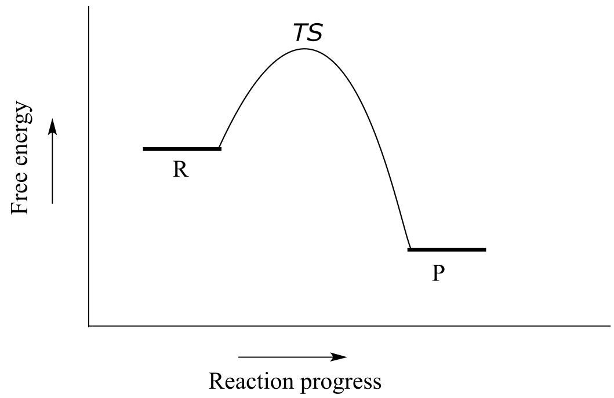

The geometry of an SN2 reaction is specific: the reaction can
only occur when the nucleophile collides with the electrophilic carbon
from the *opposite* side relative to the leaving group. This is referred
to as **backside attack**. Approach from the front side simply doesn't
work: the leaving group - which, like the nucleophile is an
electron-rich group - blocks the way.

fig 2

The result of backside attack is that the bonding geometry at the
electrophilic carbon *inverts* (turns inside-out) as the reaction
proceeds.

fig 3

The transition state of the reaction is illustrated by drawing dotted
lines to represent the covalent bonds that are in the process of
breaking or forming. Because the formal charge on the oxygen nucleophile
changes from negative one to zero as the reaction proceeds, and
conversely the charge on the chlorine leaving group changes from zero to
negative one, at the transition state both atoms are shown bearing a
*partial* negative charge (the symbol δ-). One other drawing
convention for transition states is to use brackets, with the
double-dagger symbol in subscript.

Notice that the transition state for an SN2 reaction has
**trigonal bipyramidal geometry**: the nucleophile, electrophile, and
leaving group form a straight line, and the three substituents on carbon
(all hydrogen atoms in this case) are arranged in the same plane at
120o angles.

<u>Exercise 8.1</u>: What is the measure in degrees) of the H-C-O angle
in the SN2 transition state illustrated above?

Consider what would happen if we were to replace one of the hydrogen
atoms in chloromethane with deuterium (the 2H isotope), and
one with tritium (the radioactive 3H isotope). Now, because
it has four different substituents, our carbon electrophile is a chiral
center. We'll arbitrarily assume that we start with the *S* enantiomer.

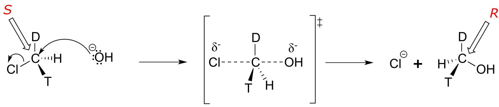

fig 4

As the hydroxide nucleophile attacks from the backside and the bonding
geometry at carbon inverts, we see that the stereochemistry of the
product reflects this inversion: we end up with the *R* enantiomer of
the chiral product.

SN2 reactions proceed with inversion of stereochemical
configuration at the electrophilic carbon.

[video tutorial/animation: inversion of configuration during SN2
reactions](https://www.youtube.com/watch?v=h5xvaP6bIZI)

### 8.1B: The SN1 mechanism

A second model for the nucleophilic substitution reaction is called the
**SN1** **mechanism**. The '1' in SN1 indicates
that the rate-determining step of the reaction is *unimolecular*: in
other words, the rate-determining step involves a single molecule
breaking apart (rather than two molecules colliding as was the case in
the SN2 mechanism.)

In an SN1 mechanism the carbon-leaving group bond breaks
*first*, before the nucleophile approaches, resulting in formation of a
carbocation intermediate (step 1):

An SN1 mechanism:

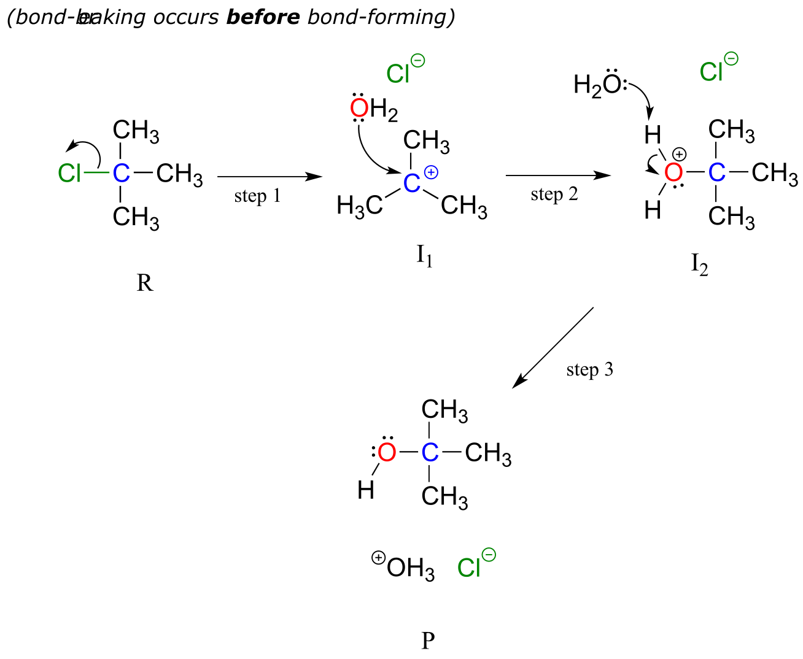

fig 7

A carbocation is a powerful electrophile: because the carbon lacks a
complete octet of valence electrons, it is 'electron-hungry'. In step 2,
a lone pair of electrons on the water nucleophile fills the empty *p*
orbital of the carbocation to form a new bond.

Notice that this is actually a three-step mechanism, with a final, rapid
acid-base step leading to the alcohol product.

A potential energy diagram for this SN1 reaction shows that
each of the two positively-charged intermediate stages (I1
and I2 in the diagram) can be visualized as a valley in the
path of the reaction, higher in energy than both the reactant and
product but lower in energy than the transition states.

fig 7a

The first, bond-breaking step is the slowest, rate-determining step -
notice it has the highest activation energy and leads to the
highest-energy species (I1, the carbocation intermediate).
Step 2 is rapid: a new covalent bond forms between a carbocation and and
a water nucleophile, and no covalent bonds are broken. Recall from
chapter 7 that Bronsted-Lowry proton transfer steps like step 3 are
rapid, with low activation energies.

**Hydrolysis**

The nucleophilic substitution reactions we have seen so far are examples
of **hydrolysis**. This term is one that you will encounter frequently
in organic and biological chemistry. Hydrolysis means *'breaking with
water'*: in a hydrolysis reaction, a water molecule (or hydroxide ion)
participates in the breaking of a covalent bond. There are many reaction
types other than nucleophilic substitution that can accurately be
described as hydrolysis, and we will see several examples throughout the
remaining chapters of this book.

**Solvolysis** is a more general term, used when a bond in a reagent is
broken by a solvent molecule: usually, the solvent in question is water
or an alcohol such as methanol or ethanol.

<u>Exercise 8.2</u>: Draw a mechanism for the SN1 solvolysis
of *tert*-butyl chloride in methanol. What new functional group has been
formed?

We saw that SN2 reactions result in inversion of
stereochemical configuration at the carbon center. What about the
stereochemical outcome of SN1 reactions? Recall that a
carbocation is *sp2*-hybridized, with an empty *p* orbital
perpendicular to the plane formed by the three sigma bonds:

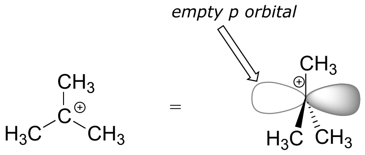

fig 8

In the second step of an SN1 reaction, the nucleophile can
attack from *either side* of the carbocation (the leaving group is
already gone, and thus cannot block attack from one side like in an
SN2 reaction).

fig 9

Consider an SN1 reaction with a chiral tertiary alkyl
chloride:

fig 10

Because the nucleophile is free to attack from either side of the
carbocation electrophile, the reaction leads to a 50:50 mixture of two
stereoisomeric products. In other words:

In general *nonenzymatic* SN1 reaction can occur with either
**retention** or **inversion** of configuration at the electrophilic
carbon, leading to **racemization** if the carbon is chiral.

For an example, consider the hydrolysis of
(*S*)-3-chloro-3-methylhexane.

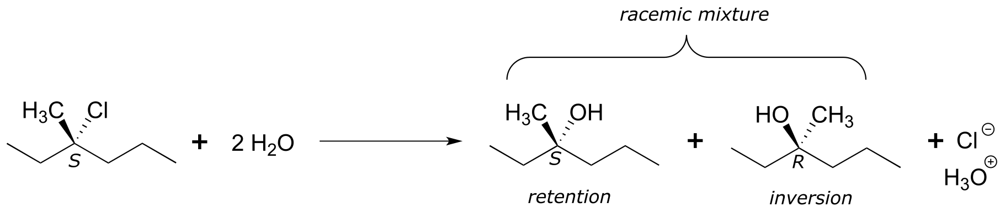

fig 11

The result of this (nonenzymatic) reaction is a racemic mixture of
chiral alcohols.

It is important to remember, however, that *enzymatic* reactions are in
almost all cases very specific with regard to stereochemical outcome. A
biochemical SN1 reaction, as we shall see later, can result
in either inversion or retention of configuration at the electrophilic
carbon, but generally *not* a mixture of both: the two reactants are
bound with specific geometry in the enzyme's active site, so that the
nucleophile can approach from one side only.

*(The following exercises refer to <u>nonbiological</u> reactions)*

<u>Exercise 8.3</u>:

a\) Draw a complete mechanism for the hydrolysis reaction in the
previous figure, showing all bond-breaking and bond-forming steps, and
all intermediate species.

b\) Draw structures representing TS1 and TS2 in
the reaction. Use the solid/dash wedge convention to show three
dimensions.

c\) What is the expected optical rotation of the product mixture?

d\) Could the two organic products be separated on a silica column
chromatography?

<u>Exercise 8.4</u>:

a\) Draw the product(s) of the hydrolysis of (R)-3-chloro-3-methyl
heptane.

b\) What can you predict, if anything, about the optical rotation of the
product(s)?

c\) Draw the product(s) of the hydrolysis of
(3R,5R)-3-chloro-3,5-dimethyl heptane.

d\) What can you predict, if anything, about the optical rotation of the
product(s)?

Before we go on to look at some actual biochemical nucleophilic
substitution reactions, we first need to lay the intellectual groundwork
by focusing more closely on the characteristics of the three principal
partners in the nucleophilic substitution reaction: the nucleophile, the
electrophile, and the leaving group. In addition, we need to consider
the carbocation intermediate that plays such a key role in the
SN1 mechanism. For the sake of simplicity, we will continue
to use simple, non-biological organic molecules and reaction examples as
we work through the basic concepts.

[Video tutorial/animation: SN1
reactions](https://www.youtube.com/watch?v=JmcVgE2WKBE)

##  8.2: Nucleophiles

### 8.2A: What is a nucleophile?

A nucleophile is an atom or functional group with a pair of electrons
(usually a non-bonding, or lone pair) that can be shared. The same,
however, can be said about a base: in fact, bases can act as
nucleophiles, and nucleophiles can act as bases. What, then, is the
difference between a base and a nucleophile?

A Bronsted-Lowry base, as you will recall from chapter 7, uses a lone
pair of electrons to form a new bond with an acidic proton. We spent
much of chapter 7 discussing how to evaluate how basic a species is.
Remember that when we evaluate basicity - the strength of a base - we
speak in terms of *thermodynamics*: where does equilibrium lie in a
reference acid-base reaction?

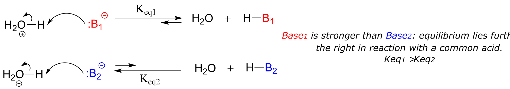

fig 12a

We will spend much of this section discussing how to evaluate how
nucleophilic a species is - in other words, its **nucleophilicity**. A
nucleophile shares its lone pair of electrons with an electrophile - an
electron-poor atom other than a hydrogen, usually a carbon. When we
evaluate nucleophilicity, we are thinking in terms of *kinetics* - how
fast does the nucleophile react with a reference electrophile?

fig 12a

In both laboratory and biological organic chemistry, the most common
nucleophilic atoms are oxygen, nitrogen, and sulfur, and the most common
nucleophilic compounds and functional groups are water/hydroxide ion,
alcohols, phenols, amines, thiols, and sometimes carboxylates.

In laboratory (non-biological) reactions, halide (I-,
Br-, Cl-, F-) and azide
(N3-) anions are also commonly seen acting as
nucleophiles in addition to the groups mentioned above.

Carbon atoms can also be nucleophiles - enolate ions (section 7.6) are
common carbon nucleophiles in biochemical reactions, while the cyanide
ion (CN-) is just one example of a carbon nucleophile
commonly used in the laboratory.

fig 12

Understanding carbon nucleophiles will be critical when we study, in
chapters 12 and 13, the enzyme-catalyzed reactions in which new
carbon-carbon bonds are formed in the synthesis of biomolecules such as
DNA and fatty acids. In the present chapter, however, we will focus on
heteroatom (non-carbon) nucleophiles.

Now, let's consider a number of factors that influence how nucleophilic
an atom or functional group is. We'll start with protonation state.

### 8.2B: Protonation state

The protonation state of a group has a very large effect on its
nucleophilicity. A negatively-charged hydroxide ion is much more
nucleophilic (and basic) than a water molecule. In practical terms, this
means that a hydroxide nucleophile will react in an SN2
reaction with chloromethane several orders of magnitude faster than will
a water nucleophile.

Likewise, a thiolate anion is more nucleophilic than a neutral thiol,
and a neutral amine is nucleophilic, whereas an ammonium cation is not.

In a non-biological context, SN2 reactions tend to occur with
more powerful, anionic nucleophiles, where the nucleophile can be
thought of as actively displacing ('pushing') the leaving group off the
carbon. SN1 reactions, in contrast, tend to be solvolysis
reactions, with a weak, neutral nucleophile such as water or an alcohol.

### 8.2C: Periodic trends in nucleophilicity

Just as with basicity, there are predictable periodic trends associated
with nucleophilicity. Moving horizontally across the second row of the
periodic table, the trend in nucleophilicity parallels the trend in
basicity:

**The horizontal periodic trend in nucleophilicity**

*more nucleophilic* NH2- \> OH- \>
F- *less nucleophilic*

*more nucleophilic* R-NH2 \> R-OH *less nucleophilic*

Recall from section 7.3A that the basicity of atoms decreases as we move
vertically down a column on the periodic table: thiolate ions are less
basic than alkoxide ions, for example, and bromide ion is less basic
than chloride ion, which in turn is less basic than fluoride ion. Recall
also that this trend can be explained by considering the increasing size
of the 'electron cloud' around the larger ions: the electron density
inherent in the negative charge is spread around a larger volume, which
tends to increase stability (and thus reduce basicity).

The vertical periodic trend for nucleophilicity is somewhat more
complicated that that for basicity, and depends on the solvent in which
the reaction is taking place. Take the general example of the
SN2 reaction below:

fig 13

. . .where Nu- is one of the halide ions: fluoride, chloride,
bromide, or iodide, and X is a common leaving group. If this reaction is
occurring in a **protic solvent** (that is, a solvent that has a
hydrogen atom bonded to an oxygen or nitrogen - water, methanol and
ethanol are protic solvents), then *the reaction will go fastest when
iodide is the nucleophile, and slowest when fluoride is the
nucleophile*, reflecting the relative strength of the nucleophile.

**  
**

**The vertical periodic trend in nucleophilicity in water and other
protic solvents**

*(opposite of the trend in basicity!)*

fig 14

This is the *opposite* of the vertical periodic trend in basicity
(section 7.3A), where iodide is the *least* basic. What is going on
here? Shouldn't the stronger base, with its more reactive unbonded
valence electrons, also be the stronger nucleophile?

As mentioned above, it all has to do with the solvent. Remember, we are
talking now about the reaction running in a *protic* solvent like water.
Protic solvent molecules form strong noncovalent interactions with the
electron-rich nucleophile, essentially creating a 'solvent cage' of
hydrogen bonds:

*artwork needed*

fig 16

For the nucleophile to attack in an SN2 reaction, the
nucleophile-solvent hydrogen bonds must be disrupted - in other words,
the nucleophilic electrons must 'escape through the bars' of the solvent
cage. A weak base like iodide ion interacts weakly with the protons of
the solvent, so these interactions are more readily disrupted.
Furthermore, because the valence electrons on iodide ion are far from
the nucleus, the electron cloud is **polarizable** - electron density
can readily be pulled away from the nucleus, through the solvent cage
and toward the electrophile.

A smaller, more basic anion such as fluoride is more highly shielded by
stronger interactions with the solvent molecules. The electron cloud of
the fluoride ion is smaller and much less polarizable than that of an
iodide ion: in water solvent, the larger iodide ion is a more powerful
nucleophile than the smaller fluoride ion.

The above discussion of the vertical periodic trend in nucleophilicity
applies to biochemical reactions, because the biological solvent is
water. The picture changes for laboratory reactions if we switch to a
**polar** **aprotic solvent**, such as acetone, which is polar enough to
solvate the polar and ionic compounds in the reaction but *is not a
hydrogen bond donor*, and does not form a strong 'solvent cage' like
water does. In acetone and other polar aprotic solvents, the trend in
nucleophilicity is the same as the trend in basicity: fluoride is the
strongest base *and* the strongest nucleophile.

Structures of some of the most common polar aprotic solvents are shown
below. These solvents are commonly used in laboratory nucleophilic
substitution reactions.

fig 17

In biological chemistry, the most important implication of the vertical
periodic trend in nucleophilicity is that *thiols are more nucleophilic
than alcohols*. The thiol group in a cysteine amino acid residue, for
example, is more nucleophilic than the alcohol group on a serine, and
cysteine often acts as a nucleophile in enzymatic reactions. The thiol
group on coenzyme A is another example of a nucleophile we will see
often in enzymatic reactions later on. Of course, reactions with oxygen
and nitrogen nucleophiles are widespread in biochemistry as well.

fig 18

### 8.2D: Resonance effects on nucleophilicity

Resonance effects also come into play when comparing the inherent
nucleophilicity of different molecules. The reasoning involved is the
same as that which we used to understand resonance effects on basicity
(see section 7.3B). If the electron lone pair on a heteroatom is
delocalized by resonance, it is inherently less reactive - meaning less
nucleophilic, and also less basic. An alkoxide ion, for example, is more
nucleophilic and more basic than a carboxylate group, even though in
both cases the nucleophilic atom is a negatively charged oxygen. In an
alkoxide, the negative charge is localized on a single oxygen, while in
the carboxylate the charge is delocalized over two oxygen atoms by
resonance.

fig 19

The nitrogen atom on an amide is less nucleophilic than the nitrogen of
an amine, due to the resonance stabilization of the nitrogen lone pair
provided by the amide carbonyl group.

fig 20

<u>Exercise 8.5</u>: Which amino acid has the more nucleophilic side
chain - serine or tyrosine? Explain.

### 8.2E: Steric effects on nucleophilicity

Steric hindrance is an important consideration when evaluating
nucleophility. For example, tert-butanol is less potent as a nucleophile
than methanol. The comparatively bulky methyl groups on the tertiary
alcohol effectively block the route of attack by the nucleophilic
oxygen, slowing the reaction down considerably (imagine trying to walk
through a narrow doorway while carrying three large suitcases!).

fig 21

A final note: when it comes to comparing the rate of nucleophilic
substitution reactions, the strength of the nucleophile only matters for
SN2 reactions. It is irrelevant for SN1 reactions,
because the rate-determining step (when the leaving group departs and a
carbocation intermediate forms) does *not* involve the nucleophile.

[Video tutorial:
nucleophiles](https://www.khanacademy.org/science/organic-chemistry/substitution-elimination-reactions/nucleophilicity-basicity-sal/v/nucleophilicity-nucleophile-strength)

<u>Exercise 8.6</u>: Which is the better nucleophile - a cysteine side
chain or a methionine side chain? A serine or a threonine? Explain.

<u>Exercise 8.7</u>: In each of the following pairs of molecules/ions,
which is expected to

react more rapidly with CH3Cl in acetone solvent? Explain
your choice.

a\) phenolate (deprotonated phenol) or benzoate (deprotonated benzoic
acid)?

b\) water or hydronium ion?

c\) trimethylamine or triethylamine?

d\) chloride anion or iodide anion?

e\) CH3NH- or
CH3CH2NH2?

f\) acetate or trichloroacetate?

g\) aniline or 4-methoxyaniline?

h\) phenolate or 2,6-dimethylphenolate?

##  8.3: Electrophiles and carbocation stability

Next, we turn to electrophiles. In the vast majority of the nucleophilic
substitution reactions you will see in this and other organic chemistry
texts, the electrophilic atom is a carbon bonded to an electronegative
atom, usually oxygen, nitrogen, sulfur, or a halogen. The concept of
electrophilicity is relatively simple: an electron-poor atom is an
attractive target for something that is electron-rich, *i.e*. a
nucleophile. However, we must also consider the effect of steric
hindrance on electrophilicity.

<u>  
</u>

### 8.3A: Steric hindrance at the electrophile

One of the most important factors to consider when looking at the
electrophile in a nucleophilic substitution reaction is *steric
hindrance*. Consider two hypothetical SN2 reactions: one in
which the electrophile is a methyl carbon and another in which it is
tertiary carbon.

fig 22

Because the three substituents on the methyl electrophile are hydrogen
atoms, the nucleophile has a relatively clear path for backside attack,
and the SN2 reaction will take place readily. However,
backside attack on the *tertiary* carbon electrophile is blocked by the
bulky methyl groups, preventing access to the site of electrophilicity.

SN2 reactions occur at methyl, primary, and secondary carbon
electrophiles. The degree of steric hindrance determines relative rates
of reaction: unhindered methyl electrophiles react fastest, and more
hindered secondary carbon electrophiles react slowest, assuming all
other reactions conditions are identical. SN2 reactions do
*not* occur to an appreciable extent at tertiary carbon electrophiles.

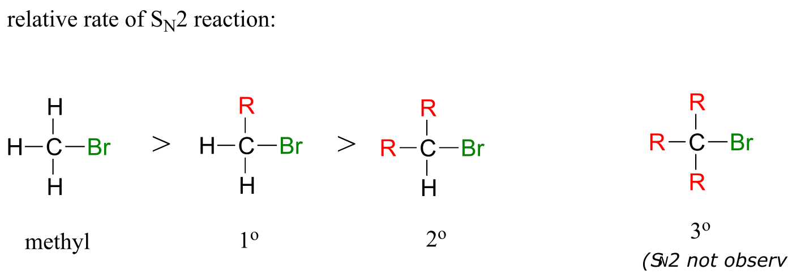

fig 22a

<u>Exercise 8.8</u>: Which would be expected to react more rapidly in an
SN2 reaction with an azide ion (N3-)
nucleophile in acetone solvent: 1-bromo-2,2-dimethylbutane or
1-bromo-3-methylbutane?

What about the SN1 pathway? Steric hindrance around the
electrophilic carbon is *not* a significant factor in slowing down an
SN1 reaction. This makes perfect sense from a geometric point
of view: the limitations imposed by sterics are significant in an
SN2 displacement because the electrophile being attacked is
an *sp3*-hybridized tetrahedral carbon with relatively
‘tight’ angles of 109.5o. Remember that in an SN1
mechanism, the leaving group leaves first, and then the nucleophile
attacks an *sp2*-hybridized carbocation intermediate, which
has trigonal planar geometry with ‘open’ 120o angles.

*artwork needed*

fig 23

With this open geometry, the empty *p* orbital of the carbocation is no
longer significantly shielded from the approaching nucleophile by the
bulky alkyl groups, and is an 'easy target' for a nucleophile: this step
is fast, and is *not* the rate-determining step for an SN1
reaction.

### 8.3B: Carbocation stability 

What, then, are the characteristics of an electrophile that favor an
SN1 reaction pathway as opposed to an SN2 pathway?
We know that the rate-limiting step of an SN1 reaction is the
first step: loss of the leaving group and formation of the carbocation
intermediate. Accordingly, ***the rate of an SN1 reaction
depends to a large extent on the stability of the carbocation
intermediate.***

The critical question now becomes:

***What stabilizes a carbocation?***

Think back to Chapter 7, when we were learning how to evaluate the
strength of an acid. The critical question there was: “how stable is the
conjugate base that results when this acid donates its proton”? In many
cases, this conjugate base was an anion – a center of excess electron
density. Anything that can draw some of this electron density away– in
other words, any electron withdrawing group – will stabilize the anion.

Conversely, a carbocation is stabilized by an electron *donating* group,
and **de**stabilized by an electron withdrawing group.

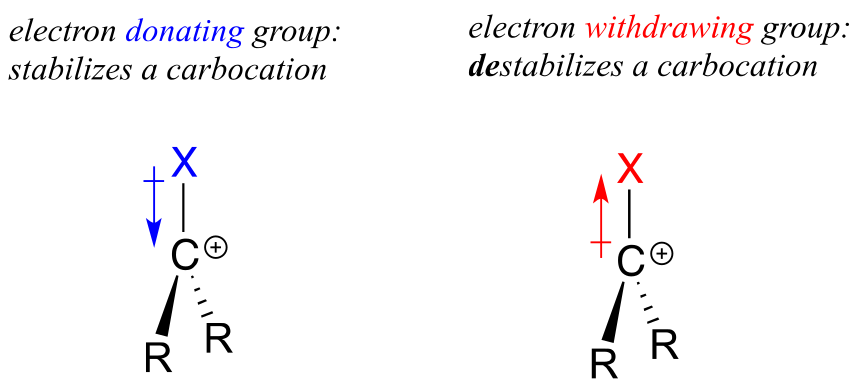

fig 26

A positively charged species such as a carbocation is electron-poor, and
thus anything which donates electron density to the center of electron
poverty will help to stabilize it. Alkyl groups, because of the
electrons in their carbon-carbon and carbon-hydrogen bonds, are weak
electron-donating groups, and will stabilize nearby carbocations. What
this means is that, in general, ***more substituted carbocations are
more stable***: a *tert*-butyl carbocation, for example, is more stable
than an isopropyl carbocation. Primary carbocations are highly unstable
and not often observed as reaction intermediates; methyl cations are
even less stable.

More substituted carbocations are more stable:

fig 27

Another way to explain this trend in carbocation stability involves the
phenomenon of **hyperconjugation**, in which the empty *p* orbital of a
carbocation is stabilized by overlap with a σ bond on an adjacent
carbon. This overlap effectively spreads the positive charge over a
larger area. The figure below shows the empty π orbital of a secondary
carbocation being stabilized by hyperconjugation with an adjacent C-H
σ bond.

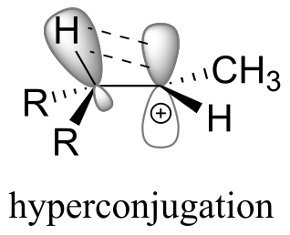

fig 27a

Hyperconjugation is not possible with a methyl cation as there is no
adjacent s bond available to overlap the empty p orbital. As the degree
of substitution on a carbocation increases, so does the capacity for
stabilizing hyperconjugation interactions.

The presence of an electron-withdrawing group - such as a fluorine
atom - will significantly *destabilize* a carbocation through the
inductive effect.

fig 28

Carbonyl groups are electron-withdrawing by inductive effects, due to
the polarity of the C=O double bond. It is possible to demonstrate in
the laboratory (we'll see how in problem 14.x) that carbocation A below
is more stable than carbocation B, even though A is a primary
carbocation and B is secondary.

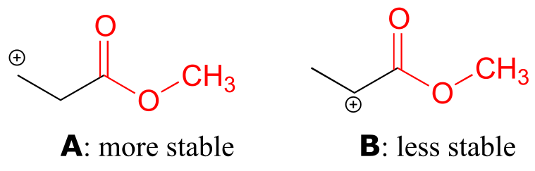

fig 29

The positive charge in cation B is closer to the electron withdrawing
carbonyl substitution, and as we learned in section 7.3C, the inductive
effect of an electron withdrawing group decreases with distance.

Stabilization of a carbocation can also occur through resonance effects.
Recall from section 7.4 that the negative charge on a phenolate ion is
stabilized by resonance, because the charge can be delocalized to three
of the carbons on the aromatic ring.

fig 30

A positive charge is also stabilized when it can be delocalized over
more than one atom. Consider a **benzylic carbocation**, where the
positively-charged carbon is bonded directly to an aromatic ring. A
benzylic carbocation is stabilized by the resonance electron-donating
effect of the aromatic ring. Three additional resonance structures can
be drawn for the carbocation in which the positive charge is located on
one of three aromatic carbons:

fig 31

<u>Exercise 8.9</u>: Fill in the missing numbers in this statement: The
conjugated *p* system in the benzylic carbocation above is composed of
\_\_\_\_\_\_ *p* orbitals overlapping to share \_\_\_\_\_\_ π electrons.

**Allylic** **carbocations**, where the positively charged carbon is
adjacent to a double bond, are stabilized by resonance delocalization of
the posive charge.

fig 32

Often, we must consider more than one factor when predicting carbocation
stability. For example, the carbocation on the right in the figure below
is more stable than the carbocation on the left. Both are allylic with
the charge delocalized over two carbons, but on the more stable
carbocation, one of the carbons is tertiary.

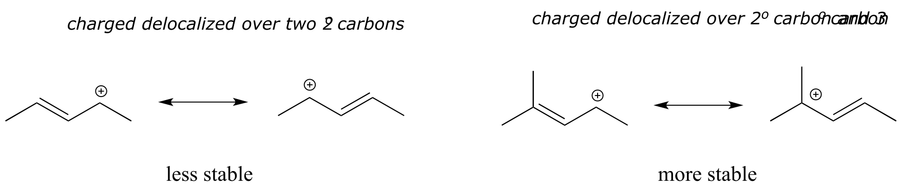

fig 32a

Because heteroatoms such as oxygen and nitrogen are more electronegative
than carbon, you might expect that they would be
carbocation-destabilizing electron withdrawing groups. In fact, the
opposite is often true: if the oxygen or nitrogen atom is in the right
position, the overall effect can be carbocation *stabilization*.
Although these heteroatoms are indeed electron withdrawing groups by
induction, they can be electron *donating* groups by resonance, and, as
we learned earlier (section 7.3) in the context of acid-base chemistry,
resonance effects are in general more powerful than inductive effects
when the two operate in opposite directions.

Consider the two pairs of carbocation species below:

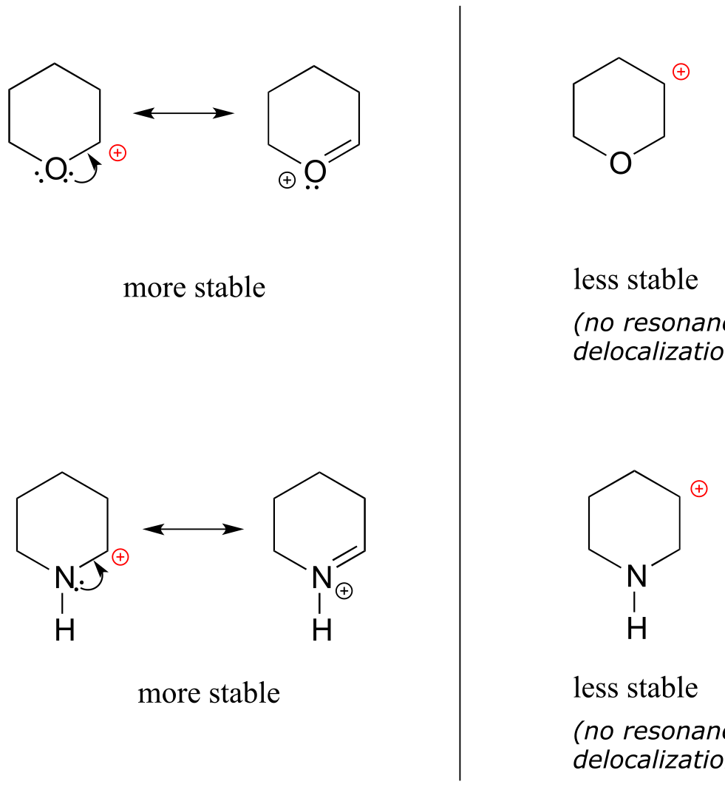

fig 33

In the more stable carbocations, the heteroatom acts as an electron
*donating* group by resonance: in effect, the lone pair on the
heteroatom is available to delocalize the positive charge. Note also
that every atom in the major resonance contributor has a complete octet
of valence electrons.

<u>Exercise 8.10</u>: rank the following carbocations from most to least
stable:

fig 33a

Finally, **vinylic** carbocations, in which the positive charge resides
on a double-bonded carbon, are highly unstable.

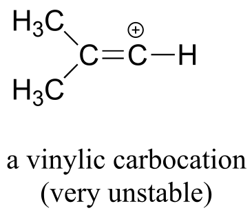

fig 34

<u>Exercise 8.11:</u> Explain why vinylic carbocations are unstable.
(Hint: think about hybridization and electronegativity)

<u>Exercise 8.12:</u> The carbocation below is an intermediate species
in a reaction that is part of the biosynthesis of a hallucinogenic
compound in a fungus. Draw a resonance contributor that shows how it is
stabilized by resonance with the nitrogen atom.

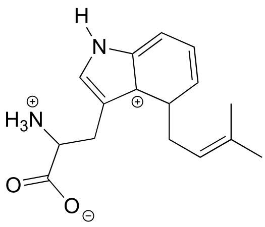

fig 35

For the most part, carbocations - even 'relatively stable' carbocations
such as those that are tertiary and/or benzylic - are still highly
reactive, transient intermediate species in organic reactions, which
briefly form and then react again right away. However, there are some
unusual examples of carbocation species that are so stable that they can
be put in a jar and stored on the shelf as a salt. Crystal violet is the
common name for the chloride salt of the carbocation whose structure is
shown below. Notice the structural possibilities for extensive resonance
delocalization of the positive charge, and the presence of three
electron-donating amine groups.

fig 36

<u>Exercise 8.13</u>:

a\) Draw a resonance structure of the crystal violet cation in which the
positive charge is delocalized to one of the nitrogen atoms.

b\) Notice that crystal violet is deeply colored. Explain why you could
have predicted this from looking at its chemical structure.

c\) The conjugated system of crystal violet consists of how many
overlapping *p* orbitals sharing how many π electrons?

**Summary of factors influencing carbocation stability**:

I: More substituted carbocations are more stable than less substituted
carbocation (eg. tertiary carbocations are more stable than secondary
carbocations).

II: Nearby electronegative atoms can decrease carbocation stability by
the inductive effect.

III: Allylic and benzylic carbocations are stabilized by resonance
delocalization of the positive charge .

IV: Delocalization of the positive charge by resonance with the lone
pair electrons on a heteroatom contributes to carbocation stability.

Below are three examples illustrating how we can make predictions about
relative carbocation stability:

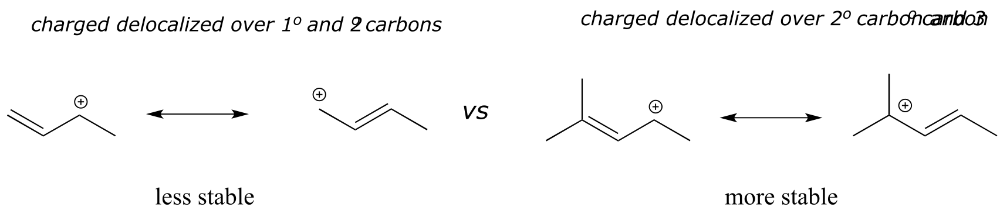

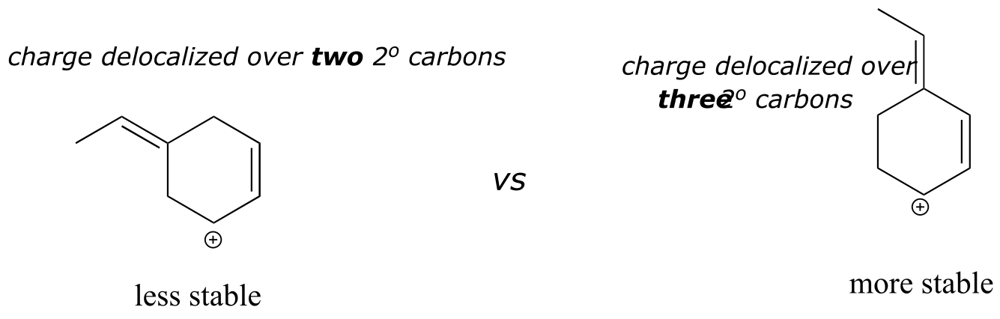

fig 36a

<u>Exercise 8.14</u>: State which carbocation in each pair below is more
stable, or if they are expected to be approximately equal. Explain your
reasoning.

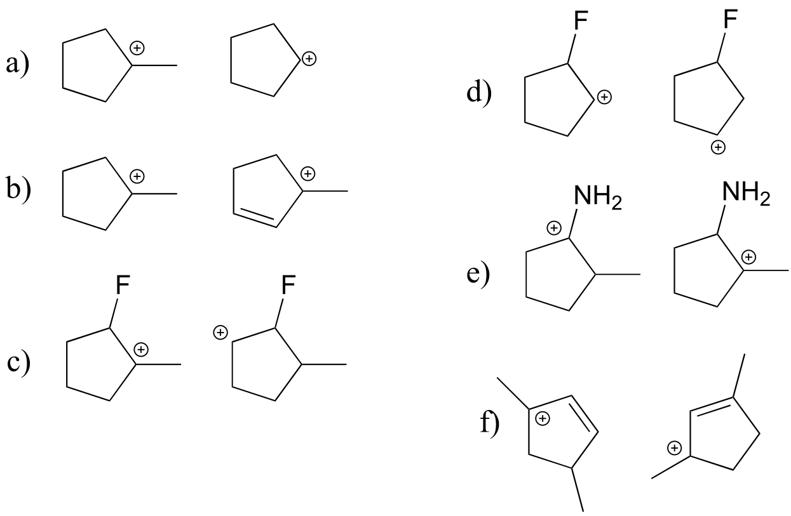

fig 37

Now, back to our
discussion of the electrophile in an SN1 reaction:

An SN1 reaction requires a stabilized carbocation
intermediate. The more stable the relevant carbocation intermediate, the
more favored the SN1 reaction pathway.

SN1 reactions
in general *do not* occur at methyl or primary carbon electrophiles: the
carbocation intermediates involved would be too unstable and the
rate-determining (carbocation-generating) step would have a very high
energy barrier. Substitution on these electrophiles will occur through
the SN2 pathway.

The SN1 reaction pathway *is* possible, however, with
secondary and tertiary carbon electrophiles, or with any other carbon
electrophile in which departure of the leaving group generates a
carbocation which is stabilized by resonance.

For example: a primary alkyl bromide would *not* be expected to undergo
nucleophilic substitution by the SN1 pathway. An allylic
primary alkyl bromide, on the other hand, would generate a relatively
stable allylic carbocation and thus the SN1 pathway is
possible.

fig 37b

An allylic secondary alkyl bromide would undergo SN1
substitution more rapidly than the allylic primary alkyl bromide,
because the relevant carbocation is more substituted and thus more
stable.

<u>*sp2*-hybridized carbons</u>

**Nucleophilic substitution generally does *not* occur at
*sp2*-hybridized carbons**, either by the SN2 or
SN1 pathway.

fig 6

Bonds on *sp2*-hybridized carbons are inherently shorter and
stronger than bonds on *sp*3-hybridized carbons, meaning that
it is harder to break the bond between an *sp2* carbon and a
potential leaving group (such as the chlorine atom in the figure above).
In addition, steric considerations play a part here: in order to attack
from behind the leaving group in an SN2-like fashion, the
nucleophile would need to approach *in the plane* of the carbon-carbon
double bond.

Substitution by an SN1 pathway is equally unlikely because of
the inherent instability of a vinylic (double-bonded) carbocation.

##  8.4: Leaving groups

Next, we investigate what makes a good leaving group. It's really quite
straightforward: everything that we learned in chapter 7 about
evaluating base strength will apply to leaving groups:

***Weaker bases are better leaving groups.***

In our general discussion of nucleophilic substitution reactions, we
have until now been using chloride ion as our common leaving group.
Alkyl chlorides are indeed common reactants in laboratory nucleophilic
substitution reactions, as are alkyl bromides and alkyl iodides. Iodide,
which is the *least* basic of the four common halides (F, Cl, Br, and
I), is the *best* leaving group among them. Fluoride is the least
effective leaving group among the halides, because fluoride anion is the
most basic. This rule applies to both SN2 and SN1
reactions, because in both cases the rate-determining step involves loss
of the leaving group.

*best leaving group* I- \> Br- \> Cl-
\> F- *worst leaving group*

This trend is evident when you compare the relative rates of
SN2 reactions of four halomethanes with a common nucleophile
and solvent: iodomethane reacts fastest, fluoromethane the slowest.

*fastest SN2 reaction* CH3I \> CH3Br \>
CH3Cl \> CH3F *slowest SN2 reaction*

The conjugate base of toluenesulfonic acid is a leaving group commonly
used in the organic synthesis laboratory. Toluenesulfonic acid is a
strong organic acid with a pKa of -2.8, so its conjugate base is a weak
base and excellent leaving group.

fig 6a

<u>Exercise 8.15</u>: In each pair (A and B) below, which electrophile
would be expected to react more rapidly with cyanide ion nucleophile in
acetone solvent? Explain your reasoning.

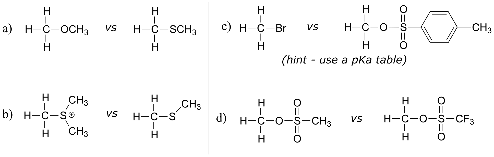

fig 25

Beginning later in this chapter and throughout the rest of our study of
organic reactivity, we will see examples of leaving group 'activation':
in other words, conversion of a strong base/poor leaving group into a
weak base/good leaving group. In some cases this is as simple as
protonation: an acidic group may be positioned in the active site in
order to protonate a poor leaving group (eg. hydroxide ion in the case
of an alcohol) as it leaves, thus converting it into a weak base and
good leaving group. In many other enzymatic reactions, alcohols are
converted into phosphates, which can be excellent biochemical leaving
groups. We will learn much more about the structure and reactions of
organic phosphate compounds in chapter 9.

##  8.5: Regiochemistry of SN1 reactions with allylic electrophiles

SN1 reactions with allylic electrophiles can often lead to
more than one possible regiochemical outcome - resonance delocalization
of the carbocation intermediate means that more than one carbon is
electrophilic. For example, hydrolysis of this allylic alkyl bromide
leads to a mixture of primary and secondary allylic alcohols.

fig 37a

In an enzyme-catalyzed reaction of this kind, however, generally only
one product will form, because enzymes maintain strict control over the
regiochemistry and stereochemistry of the reactions they catalyze. The
nucleophilic and electrophilic substrates are bound specifically in the
active site so that nucleophilic attack is directed at one - and only
one - electrophilic carbon. Problem 15, 17, and 19 at the end of this
chapter provide some examples of regio- and stereospecific biochemical
substitution reactions at allylic carbon electrophiles.

##  8.6: SN1 or SN2? Predicting the mechanism

First of all, it is important to understand that the SN1 and
SN2 mechanism models are just that: models. While many
nucleophilic substitution reactions can be described as proceeding
through 'pure' SN1 or SN2 pathways, other
reactions - in particular some important biochemical reactions we'll see
later - lie somewhere in the continuum between the SN1 and
the SN2 model (more on this later). With that being said,
here are some guidelines to help you predict whether a reaction is
likely to have more of an SN1 or SN2 character.

First, look at the electrophile: as stated above, an SN1
reaction requires that a relatively **stable carbocation intermediate**
be able to form. An SN2 reaction requires a relatively
**unhindered electrophilic center**. Therefore, methyl and primary
carbon electrophiles will react by the SN2 pathway, and
tertiary carbon electrophiles will react by the SN1 pathway.

Secondary carbon electrophiles, or primary carbon electrophiles adjacent
to a potential carbocation-stabilizing group (double bond or heteroatom)
can react by either or both pathways. The reasoning here is that these
electrophiles are unhindered (favoring SN2), but can also
form stabilized carbocation intermediates (favoring SN1)

fig 37g

Next, look at the nucleophile. More powerful nucleophiles, particularly
anionic nucleophiles such as hydroxides, alkoxides or thiolates, favor
an SN2 pathway: picture the powerful nucleophile 'pushing'
the leaving group off the electrophile. Weaker, uncharged nucleophiles
like water, alcohols, and amines, favor the SN1 pathway: they
are not nucleophilic enough to displace the leaving group, but will
readily attack a carbocation intermediate.

Finally look at the solvent in the reaction. As a general rule, water
and other protic solvents (for example methanol or ethanol) favor
SN1 pathways, due to the ability of the solvents to stabilize
carbocation intermediates, combined with their tendency to weaken the
nucleophile by enclosing it in a 'solvent cage'. In laboratory
reactions, the presence of a polar aprotic solvent such as acetone or
dimethylformamide points to the probability of an SN2
reaction.

**Factors favoring the SN1 pathway**:

hindered electrophile

potential for a tertiary, secondary, or resonance-stabilized carbocation
intermediate

uncharged nucleophile

protic solvent such as water

**Factors favoring the SN2 pathway:  
**

Unhindered (methyl or primary) electrophile

powerful, anionic nucleophile

polar aprotic solvent

[Video tutorial: nucleophilic substitution
reactions](https://www.khanacademy.org/science/organic-chemistry/substitution-elimination-reactions/sn1-sn2-tutorial/v/nucleophile-electrophile-and-the-schwartz-rules)

##  8.7: Biological nucleophilic substitution reactions

The nucleophilic substitution reactions we have seen so far have all
been laboratory reactions, rather than biochemical ones. Now, finally,
let's take a look at a few examples of nucleophilic substitutions in a
biological context. All of the principles we have learned so far still
apply to these biochemical reactions, but in addition we need to
consider the roles of the enzyme catalysts.

A word of encouragement:

This is the first time that we will be seeing 'real' biological organic
reaction mechanisms. ***Do not be intimidated by the size and complexity
of the reacting biomolecules*** - they are just organic molecules, with
the same bonding patterns and functional groups that you are already
familiar with. Focus on the *reacting* parts of the molecule: what is
the nucleophile? The electrophile? The leaving group? In most biological
organic reactions, the main bulk of the biomolecule is just 'going along
for the ride', and can often be abbreviated with an 'R group' (section
1.2C) to simplify the picture.

<u>8.7A: A biochemical SN2 reaction</u>

One very important class of nucleophilic substitution reactions in
biochemistry are the SN2 reactions catalyzed by
***S*-adenosyl methionine** (SAM) – dependent **methyltransferase**
enzymes. SAM is a coenzyme (section 6.3) that plays the role of methyl
group donor: you can think of SAM in this context as being simply a
methyl carbon electrophile attached to a sulfide leaving group.

fig42

There are many variations of SAM-dependent methylation reactions in
nature. In the introduction to this chapter, we were introduced to a
reaction occurring in bacterial DNA in which a methyl carbon is
transferred from SAM to a nitrogen atom on adenine (this type of
reaction is often referred to as *N*-methylation).

fig 43(*Nucleic Acids* *Res*. **2000**, *28*, 3950).

In the figure above, we are showing how an aspartate residue in the
active site of the enzyme acts as a catalytic base: transfer of a proton
from substrate to the aspartate side chain begins to enhance the
nucleophilicity of the amine nitrogen as it approaches the electrophilic
methyl carbon of SAM, and formation of the new N-C bond and cleavage of
the C-S bond begins. These four bond-rearranging events probably take
place in concerted fashion. A likely transition state is approximated
below:

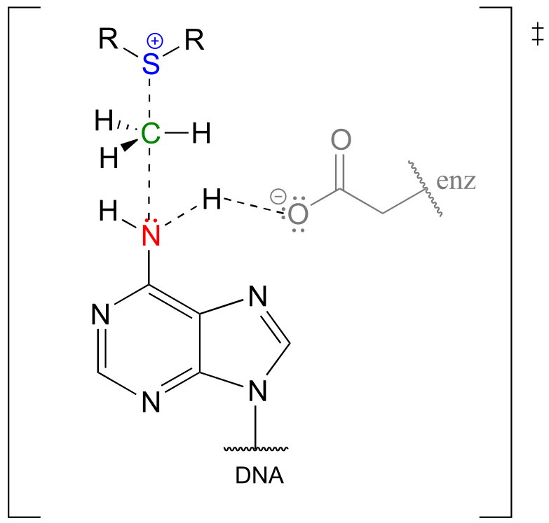

fig 43a

Of course, there are many other noncovalent interactions between active
site enzyme residues and the substrate (the adenine base) and cofactor
(SAM), but in the interest of clarity these are not shown. These
interactions, many of which are hydrogen-bonds, help to position the
adenine base and SAM in just the right relative orientation inside the
active site for the nucleophilic attack to take place. (If you have
access to American Chemical Society journals, a paper about an enzyme
catalyzing a similar *N*-methylation reaction contains some detailed
figures showing hydrogen-bond and charge-dipole interactions between the
enzyme active site and the two substrates: see [*Biochemistry* **2003**,
*42*, 8394](http://pubs.acs.org/doi/full/10.1021/bi034245a), figure 4).

The electrophile is a methyl carbon, so there is little steric hindrance
to slow down the nucleophilic attack. The carbon is electrophilic
(electron-poor) because it is bonded to a positively-charged sulfur,
which is a powerful electron withdrawing group. The positive charge on
the sulfur also makes it an excellent leaving group, because as it
leaves, it becomes a neutral and very stable sulfide. All in all, we
have a good nucleophile (enhanced by the catalytic base), an unhindered
electrophile, and an excellent leaving group. We can confidently predict
that this reaction is SN2. An SN1 mechanism is
extremely unlikely: a methyl cation is very unstable and thus is not a
reasonable intermediate to propose.

Notice something else about the SAM methylation mechanism illustrated in
the previous figure. It is ***ter**molecular*: there are *three* players
acting in concert: the catalytic base, the nucleophile, and the
electrophile. This is possible because the all three players are bound
in a very specific geometry in the active site of the enzyme. In a
reaction that takes place free in solution, rather than in an active
site, the likelihood of three separate molecules colliding all at once,
with just the right geometry for a reaction to take place, is very, very
low. You should notice going forward that when we illustrate the
mechanism of a reaction that takes place free in solution, we will only
see *bimolecular* steps - *two* molecules colliding. Almost all of the
biochemical reactions we see in this book will be enzyme-catalyzed - and
termolecular steps will be common - while almost all of the laboratory
reactions we see will take place free in solution, so we will only see
unimolecular and bimolecular steps. (Synthetic chemists often employ
non-biological catalysts that mimic enzyme active sites, but these
examples are well beyond the scope of our discussion).

<u>Exercise 8.16</u>: Think back to the acid-base chapter: the pKa of a
protonated ether is approximately zero, indicating that an ether is a
very weak base. Considering periodic trends in acidity and basicity,
what can you say about the relative basicity of a sulfide?

Another SAM-dependent methylation reaction is catalyzed by an enzyme
called catechol-*O*-methyltransferase. The substrate here is
epinephrine, also known as adrenaline, and the reaction is part of the
pathway by which adrenaline is degraded in the body.

fig 44

Notice that in this example, the attacking nucleophile is a phenol
oxygen rather than a nitrogen (that’s why the enzyme is called an
*O*-methyltransferase). In many cases when drawing biochemical reaction
mechanisms, we use the abbreviations B: for a catalytic base and H-A for
a catalytic acid, in order to keep the drawings from getting too 'busy'
(it's also possible that the identity of the acidic or basic group may
not be known).

<u>Exercise 8.17</u>: SAM is formed by a nucleophilic substitution
reaction between methionine and adenosine triphosphate (ATP). Draw a
mechanism for this reaction, and explain why you chose either an
SN1 or and SN2 pathway.

<u>  
</u>

### 8.7B: A biochemical SN1 reaction

As we will see in chapter 10, enzyme-catalyzed SN1 reactions
play a critical role in carbohydrate and DNA/RNA nucleotide metabolism.
The reaction below is part of nucleotide biosynthesis:

fig 48

Notice a few things here: first, the diphosphate leaving group is
stabilized by interactions with Mg+2 ion bound in the active
site and also by hydrogen-bonding with active site amino acid residues
(not shown). The carbocation intermediate is stabilized by resonance
with the lone pairs on the oxygen (see section 8.5), and also by an
active site aspartate side chain. The ammonia nucleophile is positioned
in the active site so that it approaches from the 'top' side of the
planar carbocation intermediate, and the substitution results in
inversion of configuration. Remember: SN1 reactions which
occur free in solution tend to result in a mixture of stereoisomers, but
enzyme-catalyzed reactions - including enzymatic SN1 reactions such as
this one - are generally stereo- and regio-specific, meaning that they
almost always result in a *single* isomeric product, not a mixture of
products.

Recall the statement from section 8.4 that poor leaving groups often
need to be converted into good leaving groups. Backing up one metabolic
step from the reaction depicted above, we see that a poor (hydroxide)
leaving group on ribose-5-phosphate is first converted to a good
(diphosphate) leaving group, which can stabilized through interactions
with the active site of the enzyme catalyzing the SN1
reaction.

fig 48b

This preliminary phosphorylation step, which requires ATP (adenosine
triphosphate) as the donor of the diphosphate group, is a reaction that
we will study in much more detail in chapter 9.

### 8.7C: A biochemical SN1/SN2 hybrid reaction

The cysteine residues of certain proteins are modified by addition of a
15-carbon isoprene chain (section 1.3A) to the side chain thiol group.

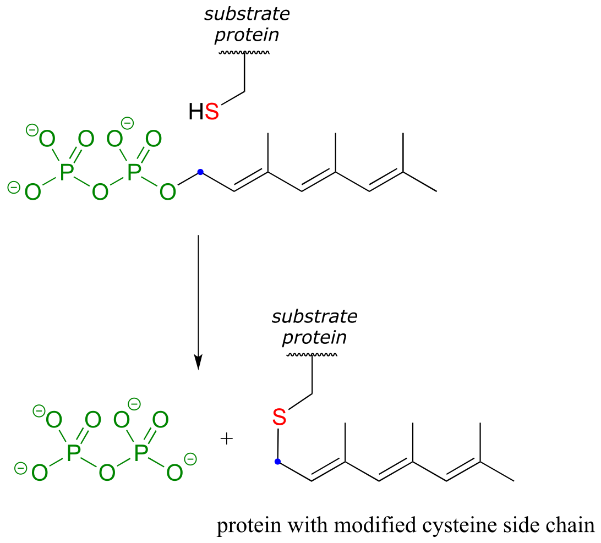

fig 6

fig 46

The mechanistic details of this reaction are of particular interest to
biomedical scientists. The proteins that are substrates for this type of
modification are involved in cell signaling processes, and they are not
able to carry out their biological functions unless they are anchored to
a cell’s lipid membrane. The hydrocarbon group that becomes attached to
a cysteine residue in this reaction serves as the anchor.

fig 47

Some of these proteins have been implicated in tumor formation.
Scientists hope that if they can find a way to shut down the cysteine
modification reaction, the tumor-causing proteins will not be able to
anchor to cell membranes and thus will remain inactive. The search is on
for an effective inhibitor of this enzyme to serve as a potential
anti-tumor drug.

How does the enzyme lower the energy barrier for this reaction?
Experimental evidence indicates that when a substrate protein is bound
to the active site of the enzyme, the cysteine thiol associates with a
zinc ion bound in the active site. As we learned in section 7.8, this
association will lower the pKa of the thiol to the point where it loses
a proton and exists as a thiolate anion in the active site - a thiolate
is a *very* potent nucleophile! Studies also show that the diphosphate
group forms stabilizing interactions with several amino acid residues
(two lysines, an arginine, a histidine, and a tyrosine) in the enzyme's
active site, making it a weaker base and thus a better leaving group.

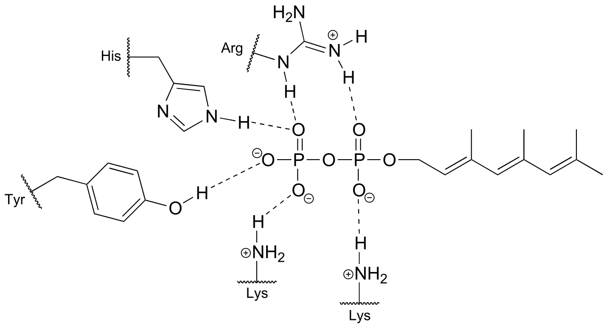

*Biochemistry* **1998**, *37*, 16601

fig 46a

Is protein prenylation an SN1 or SN2 reaction? In
other words, to what extent does the nucleophile displace, or 'push' the
leaving group off, or to what extent does the leaving group leave on its
own, without a 'push' from the nucleophile? Along the same lines, to
what extent does a positive charge develop on the carbon center
(development of a full positive charge implies an SN1
mechanism). First, consider the electrophile: it is a primary allylic
carbon, so either pathway is possible (it is relatively unhindered for
SN2 attack, but could also form a resonance-stabilized
carbocation intermediate in an SN1 pathway). The nucleophile
is a very powerful thiolate ion, suggestive of an SN2
mechanism where a strong nucleophile actively displaces the leaving
group.

In fact, experiments designed to address this very question (see problem
P8.19) have provided evidence that the reaction is a mechanistic hybrid:
essentially SN2, but with *elements* of SN1. In
other words, at the transition state the electrophilic carbon takes on
some degree of positive charge, but a true carbocation intermediate does
not form. The take-home message here is that the SN1 and
SN2 mechanistic pictures we have studied in this chapter are
models, and while they are useful for learning about chemical principles
and accurate for describing many substitution reactions, other reactions
are not necessarily 'pure' SN1 or SN2, but
actually lie somewhere in between.

##  8.8: Nucleophilic substitution in the organic synthesis laboratory

### 8.8A: The Williamson ether synthesis

Synthetic organic chemists often make use of a reaction that is
conceptually very similar to the SAM-dependent methylation reactions we
saw earlier. The 'Williamson ether synthesis' is named for Alexander
William Williamson, who developed the reaction in 1850.

In the Williamson ether synthesis, an alcohol is first deprotonated by a
strong base, typically sodium hydride. An alkyl halide is then added to
the reaction mixture, and the alkoxide ion, a powerful nucleophile,
displaces the halide leaving group in an SN2 reaction.

fig 48a

For example, below we see methyl bromide performing the role of methyl
group donor, analogous to the role played by SAM in biochemical
methylation reactions:

fig 49

Notice the difference between this non-biological laboratory reaction
and the biological, enzyme-catalyzed SAM methylation reaction we saw
earlier. Deprotonation of the nucleophile occurs as a separate step,
before the nucleophile attacks. Contrast this solution reaction (with
two bimolecular steps) to the enzyme-catalyzed SN2 reaction
(SAM methylation) we saw earlier, which involves a single, concerted
trimolecular step. Also notice that this non-biological reaction
involves a highly basic reagent (sodium hydride) and intermediate
(propanoate anion), which would be unreasonable to propose for a
reaction taking place under physiological conditions.

The Williamson ether synthesis will only work with methyl or primary
alkyl halides. If a secondary or tertiary alkyl halide is used, the
result will be formation of an *alkene* in what is called an
'elimination' reaction:

fig 50

We will study elimination reactions in chapter 14.

<u>Exercise 8.18</u>: A rookie organic chemist ran the reaction shown
above, hoping to synthesize an ether. Instead, he got the alkene shown.
What alkyl halide/alcohol combination should he have used instead to get
the ether product he was trying for?

<u>8.8B: Turning a poor leaving group into a good one - tosylates</u>

In section 8.4 it was mentioned how, in metabolic pathways, the
relatively poor OH leaving group of an alcohol can be converted into a
phosphate or diphosphate, which when stabilized by noncovalent
interactions inside an enzyme active site can be a very good leaving
group.

In laboratory synthesis, a similar goal can be accomplished by
converting an alcohol (a poor leaving group)to an organic **tosylate**
(a good leaving group) using tosyl chloride (the terms 'tosylate' and
'OTs', are abbreviations for *para*-toluene sulfonate). The alcohol to
tosylate reaction is not something we are equipped yet to understand,
but if we consider that the pKa of *para*-toluene sulfonic acid is -2.8,
we realize that the *para*-toluene sulfonate anion is a very weak base
and thus an very good leaving group. Conversion of alcohols to organic
tosylates is a very common step in organic synthesis schemes.

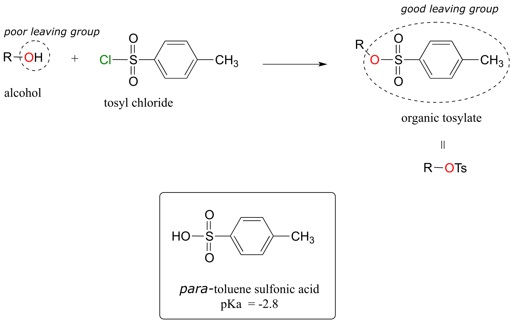

fig 24

## Key Concepts to Review

*Before you move on to the next chapter, you should be comfortable with
the following concepts and skills:*

<u>Nucleophilic substitution basics:</u>

Draw a complete mechanism for an SN2 reaction

Illustrate the transition state for an SN2 reaction

Understand how SN2 reactions result in inversion of
configuration at the electrophilic carbon.

Draw a complete mechanism for an SN1 reaction, in particular
a hydrolysis or other solvolysis SN1 reaction.

Draw an energy diagram illustrating the energy profile of a typical
SN1 solvolysis reaction.

Illustrate all transition states that are part of an SN1
reaction.

Understand that *non-enzymatic* SN1 reactions result in both
inversion and retention of configuration (racemization) at the
electrophilic carbon. *Enzymatic* SN1 reactions are
stereospecific, usually resulting in inversion at the electrophilic
carbon.

<u>Nucleophiles:</u>

Understand the factors that influence nucleophilicity. Be able to
evaluate the relative nucleophilicity of two or more compounds, and
predict relative rates of SN2 reactions with different
nucleophiles and a common electrophile.

Be able to recognize the nucleophile, electrophile, and leaving group in
an SN1 or SN2 reaction.

Understand that – with the exception of the vertical periodic trend in
protic solvents – *in most cases anything that makes something a
stronger base also makes it a more powerful nucleophile:*

 The horizontal periodic trend in nucleophilicity: for example,
 NH3 is a better nucleophile than H2O.

 The vertical periodic trend in nucleophilicity *for reactions in polar
 aprotic solvents*: chloride ion is a better nucleophile than bromide
 ion in acetone solvent.

 Protonation state: for example, hydroxide ion is a better nucleophile
 than water.

 Inductive effect: electron-withdrawing groups decrease nucleophilicity

 Resonance effects:

 Delocalization of negative charge/electron density decreases
 nucleophilicity. For example, methoxide ion
 (CH3O-) is a stronger nucleophile than acetate
 ion.

In addition:

 Steric effects: less sterically hindered nucleophiles are more
 powerful. For example, ethanol is less hindered and more nucleophilic
 than *tert*-butyl alcohol.

 The vertical periodic trend *in protic solvent* (water or alcohol) is
 opposite the trend in basicity: for example, thiols are more
 nucleophilic than alcohols.

<u>Electrophiles</u>

Electrophiles are electron poor atoms: for our present purposes this
means a carbon bonded to an electronegative atom.

Less hindered electrophiles will react faster in SN2
reactions: for example chloromethane is a better electrophile than a
primary alkyl chloride.

<u>Leaving groups</u>

The trends in leaving groups parallel trends in basicity. *A good
leaving group is a weak base.*

Common laboratory leaving groups are halides and para-toluenesulfonate
(abbreviated tosyl, or OTs).

Common biochemical leaving groups are phosphates and sulfide.

<u>Carbocation stability</u>

Understand that, in general, factors which destabilize a negative charge
will stabilize a positive charge.

More substituted carbocations are more stable: for example, a tertiary
carbocation is more stable than a secondary carbocation.

Allylic and benzylic carbocations, in which the positive charge is
delocalized by resonance, are relatively stable.

The presence of electron-withdrawing groups (by inductive or resonance
effects) decreases carbocation stability.

The presence of electron-donating groups (by inductive or resonance
effects) increases carbocation stability.

The presence of a heteroatom can stabilize a nearby carbocation by the
resonance-based electron donating effect. Otherwise, heteroatoms act as
weakly electron withdrawing carbocation-destabilizing groups by
inductive effects.

<u>General concepts and skills</u>

Be able to predict whether a given substitution reaction is likely to
proceed by SN2 or SN1 mechanisms, based on the
identity of the nucleophile, the electrophile, and the solvent.

 SN2 reactions involve strong nucleophiles and unhindered
 electophiles, and are accelerated by the use of polar, aprotic
 solvents.

 SN1 reactions involve weaker nucleophiles relatively stable
 carbocations, and are accelerated by protic solvents.

Given a nucleophile and electrophile, be able to predict the product(s)
of a nonenzymatic substitution reaction, and predict a mechanisms
(SN1 or SN2). Be able to predict different
regiochemical and stereochemical outcomes leading to formation of more
than one product.

Be able to 'think backwards' to show the starting compounds in a
substitution reaction, given a product or products.

Be able to recognize and draw a complete mechanism for a biochemical
nucleophilic substitution reaction. Be able to evaluate the nucleophile,
electrophile, and leaving group in the reaction, and predict whether the
reaction is likely to have more SN2 or SN1
character.

Understand how S-adenosylmethionine (SAM) acts as a methyl group donor
in biochemical SN2 reactions.

Be able to select appropriate alkyl halide and alcohol starting
compounds to synthesize a given ether product, using the Williamson
ether synthesis procedure.

## Problems

**P8.1:** Rank the following molecules in order of how fast they would
be expected to react with CH3SNa in acetone.
(CH3SNa is simply the sodium salt of
CH3S-. Na+ is a spectator ion.)

**P8.2:** Draw line structures representing the *most stable* cation
with the given molecular formula:

a\) C3H7+ b)
C4H9+ c)
C3H8N+ d)
C4H7+

**P8.3:** For each pair of carbocations below, choose the one that is
more stable, and explain your reasoning.

**  
**

**P8.4:** Arrange the following species in order of increasing
nucleophilicity in protic solvent:

**P8.5:** Predict the organic products of the following nucleophilic
substitution reactions, all of which are carried out in polar aprotic
solvent. Show stereochemistry at chiral carbons. Hints:
Na2CO3, sodium carbonate, is a weak base. For part
(f): What is the conjugate acid of NH2-? What is
the pKa of this conjugate acid, and what is the pKa of a terminal
alkyne?

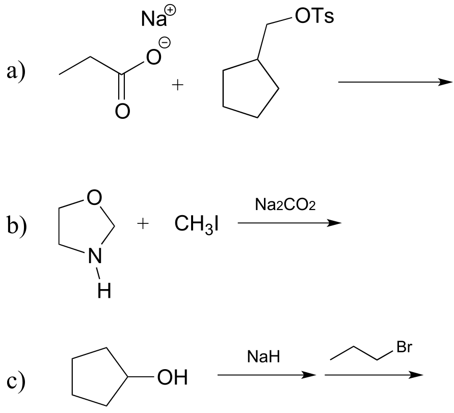

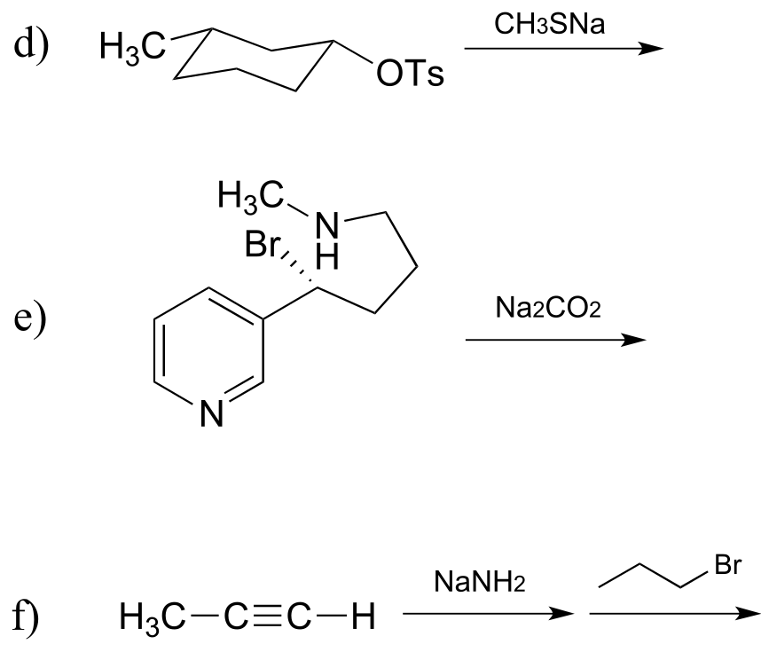

**P8.6:** Which of the reactions in the previous problem has a
*unimolecular* rate determining step? Explain.

**P8.7:** From the following pairs, select the compound that would react
more rapidly with bromomethane in acetone solvent.

a\) water or hydroxide ion

b\) CH3S- or CH3OH

c\) CH2S- or CH3SH

d\) acetate ion or hydroxide ion

e\) diethyl sulfide or diethyl ether

f\) dimethylamine or diethylether

g\) trimethylamine or 2,2-dimethylpropane

**P8.8:** Methyl iodide (0.10 mole) is added to a solution that contains
0.10 mole NaOCH3 and 0.10 mole NaSCH3.

a\) Predict the most abundant neutral organic product that would form,
and explain your reasoning.

b\) Assume that you isolate a mixture the major product (which you
predicted in part) along with a smaller amount of a different
nucleophilic substitution product. Explain briefly but specifically how
you could use 1H-NMR to determine the ratio of the two
products in the mixture.

**P8.9:** For each pair of compounds, predict which will more rapidly
undergo solvolysis in methanol solution.

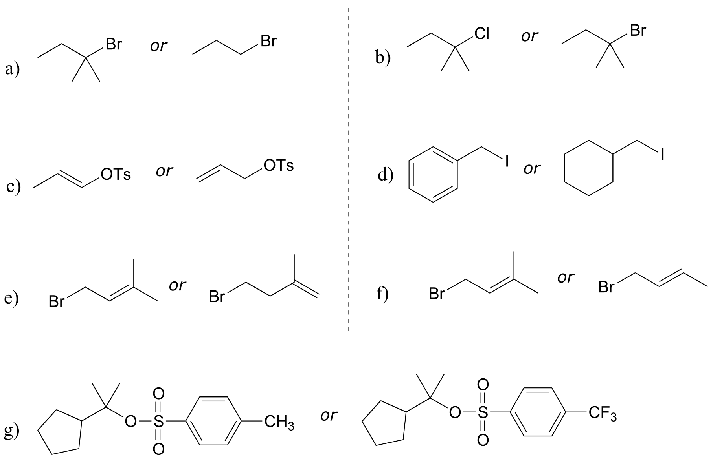

**P8.10:** Predict the solvolysis product(s) of each of the reactions
below. Consider both regiochemistry and stereochemistry.

e\) Draw a complete curved-arrow mechanism for the formation of the
secondary allylilc alcohol product in part (a).

**P8.11:** Show starting compounds that would lead to the following
products through nucleophilic substitution reactions.

**P8.12:** The fused ring compound shown below is very unreactive to
nucleophilic substitution, even with a powerful nucleophile.. Explain.
(Hint – consider bond geometry - a model will be very helpful!)

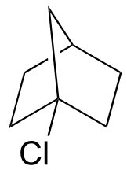

**P8.13** Laboratory synthesis of isopentenyl diphosphate - the
'building block' molecule used by nature for the construction of
isoprenoid molecules (section 1.3A) - was accomplished by first
converting isopentenyl alcohol into an alkyl tosylate then displacing
the tosylate group with an inorganic pyrophosphate nucleophile. Based on
this verbal description, draw a mechanism for the second (nucleophilic
substitution) step, showing starting and ending compounds for the step
and curved arrows for electron movement. (*J. Org. Chem* **1986**, *51*,
4768).

**P8.14:** Choline, an important neutotransmitter in the nervous system,
is formed from 2-(*N,N*-dimethylamino)ethanol:

a\) Besides the enzyme and the starting compound, what other important
biomolecule do you expect plays a part in the reaction?

b\) Draw a mechanism for the reaction.

c\) Briefly explain how 1H-NMR could be used to distinguish
between the substrate and the product of this reaction.

P8.15 The following is a reaction in the biosynthesis of morphine in
opium poppies. (*Science* 1967, *155*, 170; *J. Biol. Chem* 1995, *270*,
31091).

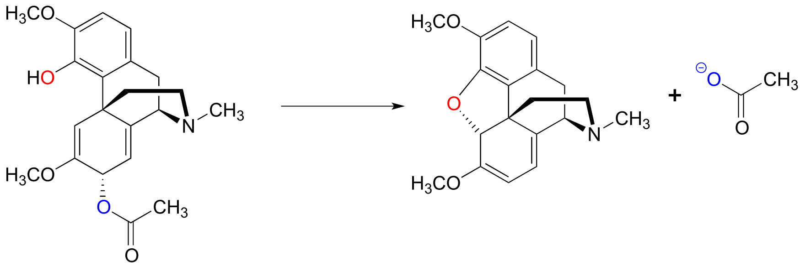

a)Draw a complete mechanism, assuming an SN1 pathway.

b\) What would you expect to be the most noticeable difference between
the IR spectrum of the product and that of the substrate?

c\) This reaction is an example of the regiospecificity of enzymatic
nucleophilic substitution reactions noted earlier in the chapter. Draw
two alternate nucleophilic, ring-closing steps for this reaction
(leading to different products from what is shown above), and explain
why these alternate pathways are both less favorable than the actual
reaction catalyzed by the enzyme.

**P8.16:** The enzymatic reaction below, which is part of the metabolism
of nucleic acids, proceeds by an SN1 mechanism. The new bond
formed in the substitution is indicated.

a\) Predict the structures of the two substrates A and B.

b\) Draw a complete mechanism, and use resonance drawings to illustrate
how both the carbocation intermediate and the leaving group are
stabilized.

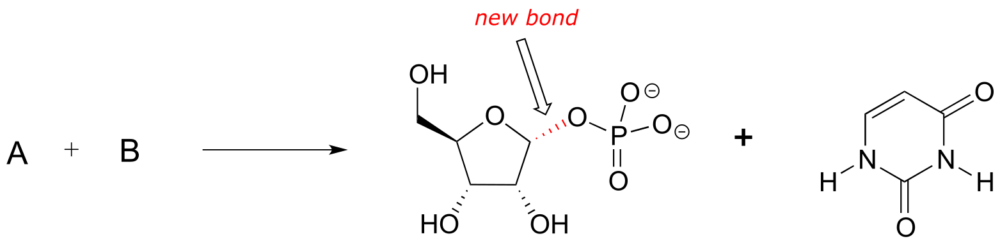

P8.17: Below is the first step of the reaction catalyzed by anthranilate
synthase, an enzyme involved in biosynthesis of the amino acid
tryptophan.

a\) This reaction is somewhat unusual in that the leaving group is a
hydroxide anion, which is of course is normally thought to be a very
poor leaving group. However, studies show that an Mg+2 ion is
bound in the active site close to the hydroxide. Explain how the
presence of the magnesium ion contributes to the viability of hydroxide
as a leaving group.

b\) Draw a complete mechanism for the reaction, assuming an
SN1 pathway.

**P8.18:** The reaction below is part of the biosynthesis of
peptidoglycan, a major component of bacterial cell walls. Is it likely
to proceed by a nucleophilic substitution mechanism? Explain.

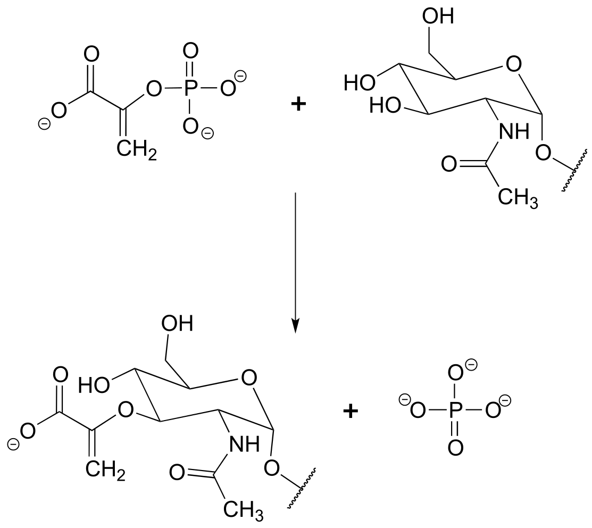

**P8.19:** Compare the reaction below, catalyzed by the enzyme AMP-DMAPP
transferase, to the protein prenyltransferase reaction we learned about
in section 8.8C, the mechanism of which, as we discussed, is thought to
be *mostly* SN2-like with some SN1-like character.

a\) Is the AMP-DMAPP transferase reaction below likely to have more or
less SN1-like character compared to the protein
prenyltransferase reaction? Explain.

b\) Given your answer to part (a), which reaction is likely to be more
dramatically slowed down when a fluorinated isoprenoid substrate analog
is substituted for the natural substrate? Explain.

**P8.20:** In a classic experiment in physical organic chemistry,
(*R*)-2-iodooctane was allowed to react (non-enzymatically) with a
radioactive isotope of iodide ion, and the researchers monitored how
fast the radioactive iodide was incorporated into the alkane (the rate
constant of incorporation, k*i* ) and also how fast optical
activity was lost (the rate constant of racemization, k*r*).
They found that the rate of racemization was, within experimental error,
equal to twice the rate of incorporation. Discuss the significance of
this result - what does it say about the actual mechanism of the
reaction?

