# 10: Nucleophilic addition to carbonyl groups

(photo credit: https://www.flickr.com/photos/gzlu/)

## Introduction

It's possible that the fuel for the car you drive thirty years from now
will come from the back end of a panda. Not literally, of course – but
it just might turn out that future biofuel technology will be derived in
part from the stuff that workers have to clean out of the enclosure
housing Ya Ya and Le Le, the two resident pandas at the Memphis Zoo in Tennessee.
At least, that's the hope of Dr. Ashli Brown, a biochemistry professor
at Tennessee State University.

First, a little background. If you are like most people in the United
States, you are already burning ethanol every time you drive: in 2012,
the U.S. Department of Energy reports that over 13 million gallons of
ethanol were sold at gas stations nationwide, most often as a 10%
mixture along with 90% conventional gasoline. The ethanol we burn today
is made by fermenting the sugars present in edible corn. The use of corn
ethanol, while a significant step forward in the effort to move away
from petroleum fuels and towards carbon-neutral, renewable energy
sources, is far from a permanent, sustainable solution to the world's
ever-increasing energy needs. Growing corn crops requires a lot of
energy and expense, from running the large equipment used to plow and
harvest the fields, to manufacturing and applying pesticides and
fertilizers, all the way to trucking the corn to the ethanol plant. In
fact, some calculation methods suggest that more energy goes into
producing a gallon of corn-based ethanol than is released when the
ethanol is burned.

Moreover, growing corn requires a lot of water, and takes up land which
otherwise could be used for growing food, or preserved as a natural
habitat. A recent study by scientists in South Dakota reported that
between 2006 and 2011, a full 1.3 million acres of wetland and prairie
were plowed over and converted to biofuel crop production in five
midwestern states.

What would be much better in the long run is if we could produce ethanol
or other biofuels not from resource-intensive food crops like corn, but
from non-edible plant materials: grasses, trees, and agricultural
byproducts such as the cobs and stalks from corn plants. Switchgrass,
for example, is a native North American prairie grass that is thought to
have high potential for biofuel production.

So if we can make ethanol from corn, couldn't we just change over to
switchgrass using the same technology?

Unfortunately, it's not nearly that simple. Ethanol is made by 'feeding'
glucose to living yeast cells, allowing them to break down the sugar
into ethanol – a metabolic process called fermentation. Corn kernels
contain sugar in the form of starch, a polysaccharide of linked glucose
molecules. Enzymes called 'amylases' are used to break up the starch
polymer into individual glucose molecules (as well as two-glucose units
called cellobiose), which are then fermented by the yeast.

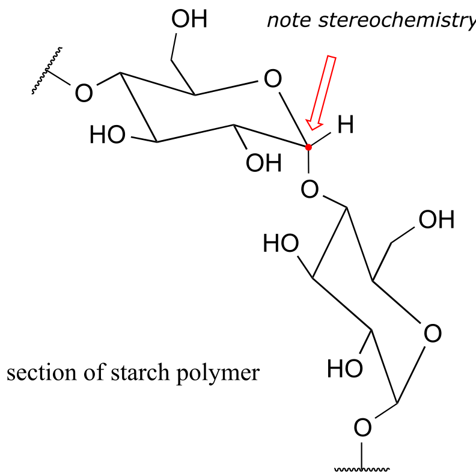

fig1b

The rest of the corn plant – the stalks, leaves, and cobs – is composed
in large part of another glucose polymer called cellulose.

fig 1c

Cellulose is a major component of plant cell walls, and is the most
abundant organic compound on the planet - an enormous source of glucose
for fermentation! The problem, from a renewable energy perspective, is
how to get at the glucose monomers that make up the polymer. Look
closely at the bond connecting two glucose monomers in starch, and then
compare it to the same bond in cellulose. They both link the same two
carbons of glucose, but with opposite stereochemistry. Recall that
enzymes are very sensitive to the stereochemical configuration of their
substrate molecules. It should come as no surprise, then, that the
amylase enzymes which are so efficient at breaking apart starch are
completely ineffective at breaking apart cellulose. Other enzymes, known
as cellulases, are needed for this job. These enzymes do exist in
nature: just think about what happens to tree branches, leaves, and
other cellulose-rich plant matter that lies on the forest floor. These
slowly rot away, the cellulose broken apart by cellulase enzymes in
microscopic fungi.

The key word here, though, is 'slowly'. Fungi living on the forest floor
are not in any great hurry to degrade the leaves and wood around them –
the cellulose is not going anywhere. Fungal cellulases are,
comparatively speaking, very slow, inefficient enzymes. Herein lies the
biggest challenge to the development of economically viable production
of ethanol from cellulosic sources such as switchgrass or wood. Breaking
the glucose-glucose bonds in cellulose is the main bottleneck in the
whole process.

This is where the pandas come in.

Pandas live primarily on a diet of bamboo, obtaining their energy from
the cellulose in the plant. Like other plant-eaters such as cows,
horses, and sheep, pandas do not make their own cellulase enzymes.
Rather, they rely on a diverse population of symbiotic microbes
inhabiting their digestive tracts to do the job of cellulose digestion
for them. Unlike the microbes living the slow-paced lifestyle of the
forest floor, though, the panda's microbes don't have a lot of time to
spare - the food is moving through the system pretty quickly. In theory,
evolutionary pressure should have resulted in panda-gut microbes with
speedy cellulase enzymes, and that is what Dr. Ashli Brown at Tennessee
State was hoping to find as she and her research students analyzed panda
feces from the Memphis Zoo. They have had some success: at the fall,
2013 meeting of the American Chemical Society, Dr. Brown announced that
her group, working in cooperation with colleagues at the University of
Wisconsin, had found over forty cellulose-digesting bacteria, courtesy
of Ya Ya and Le Le. The next step is to clone the cellulase- encoding
genes, use the DNA to produce recombinant enzyme, and see just how fast
they are.

Other less cuddly and photogenic animals are also being studied with
similar goals in mind. Dr. Falk Warnecke, working at the U.S. Department
of Energy Joint Genome Institute in Northern California, has been
investigating the microbes that live in the guts of wood-eating
termites, and many other researchers around the world are interested in
the symbiotic bugs which inhabit the rumen of cows and sheep.

The problematic chemical reaction catalyzed by cellulase enzymes is, in
organic chemistry terminology, an 'acetal hydrolysis'. Acetals are
derived from aldehydes. The reactions that occur at the carbonyl carbon
of aldehydes and ketones is absolutely central to the chemistry of
carbohydrates such as starch and cellulose, and it is this chemistry
that is the subject of the chapter we are about to begin.

##  10.1 Nucleophilic addition to aldehydes and ketones: an overview

### 10.1A: The aldehyde and ketone functional groups

Recall from chapter 1 that the ketone functional group is made up of a
carbonyl bonded to two carbons, while in an aldehyde one (or both) of
the neighboring atoms is a hydrogen.

fig1d

You probably are familiar with the examples shown below: acetone, the
simplest ketone compound, is the solvent in nail polish remover,
benzaldehyde is the flavoring in maraschino cherries, and formaldehyde
(a special case in which the carbonyl carbon is bonded to hydrogens on
both sides) is the nasty-smelling stuff that was used to preserve the
unlucky frog that you dissected in high school biology class. The male
sex hormone testosterone contains a ketone group in addition to alcohol
and alkene groups.

fig 1e

Recall from chapter 2 the bonding picture in a ketone or aldehyde: the
carbonyl carbon is *sp2* hybridized, with its three trigonal
planar *sp2* orbitals forming σ bonds with orbitals on the
oxygen and on the two carbon or hydrogen atoms. The remaining
unhybridized *2p* orbital is perpendicular to the plane formed by the
*sp2* orbitals, and forms a π bond through a side-by-side overlap with a
*2p* orbital on the oxygen. The σ and *p* bonds between the carbon and
oxygen combine to make the C=O double bond that defines the carbonyl
functionality.

fig 1

### 10.1B: Nucleophilic addition

The carbon-oxygen double bond is polar: oxygen is more electronegative
than carbon, so electron density is higher on the oxygen end of the bond
and lower on the carbon end. Recall that bond polarity can be depicted
with a dipole arrow (A in the figure below), or by showing the oxygen as
bearing a partial negative charge and the carbonyl carbon a partial
positive charge (B).

fig 2

A third way to illustrate the carbon-oxygen dipole (C in the figure
above) is to consider the two main resonance contributors: the major
form, which is what you typically see drawn in Lewis structures, and a
minor but very important contributor in which both electrons in the π
bond are localized on the oxygen, giving it a full negative charge. The
latter depiction shows the carbon with an empty *2p* orbital and a full
positive charge.

However the bond polarity is depicted, the end result is that the
carbonyl carbon is electron-poor - in other words, it is an
electrophile. In addition, the trigonal planar geometry means that the
carbonyl group is unhindered). Thus, it is an excellent target for
attack by an electron-rich nucleophilic group, a mechanistic step called
**nucleophilic addition**:

Nucleophilic addition to an aldehyde or ketone (enzymatic)

fig 3

Notice the acid-base catalysis that is going on in this generalize
mechanism: in the enzyme active site, a basic group is poised to
deprotonate the nucleophile (thus enhancing its nucleophilicity) as
begins to attack the carbonyl carbon, while at the same time an acidic
proton on another active site group is poised just above the carbonyl
oxygen (thus enhancing the electrophilicity of the carbon), ready to
protonate the oxygen and neutralize any negative charge that builds up.

### 10.1C: Stereochemistry of nucleophilic addition to a carbonyl

Recall from section 3.11B that when the two groups adjacent to a
carbonyl are not the same, we can distinguish between the *re* and *si*
'faces' of the planar structure.

The concept of a trigonal planar group having two distinct faces comes
into play when we consider the stereochemical outcome of a nucleophilic
addition reaction. Notice that in the course of a carbonyl addition
reaction, the hybridization of the carbonyl carbon changes from
*sp2* to *sp3*, meaning that the bond geometry
changes from trigonal planar to tetrahedral. If the two R groups are not
equivalent, then a chiral center is created upon addition of the
nucleophile. The configuration of the new chiral center depends upon
which side of the carbonyl plane the nucleophile attacks from.

fig 4

If the reaction is catalyzed by an enzyme, the stereochemistry of
addition is (as you would expect) tightly controlled, and leads to one
stereoisomer exclusively- the nucleophilic and electrophilic substrates
are bound in specific positions within the active site, so that attack
must occur specifically from one side and not the other. Nonenzymatic
reactions of this type often result in a 50:50 mixture of stereoisomers,
but it is also possible that one stereoisomer may be more abundant,
depending on the structure of the reactants and the conditions under
which the reaction takes place. We'll see some examples of this
phenomenon soon when we look at cyclic forms of sugar molecules.

##  10.2: Hemiacetals, hemiketals, and hydrates

### 10.2A: Overview

One of the most important examples of a nucleophilic addition reaction
in biochemistry, and in carbohydrate chemistry in particular, is the
addition of an alcohol to a ketone or aldehyde. When an alcohol adds to
an aldehyde, the result is called a **hemiacetal**; when an alcohol adds
to a ketone the resulting product is a **hemiketal**.

fig 5

(The prefix ‘*hemi’* (half) is used in each term because, as we shall
soon see, addition of a second alcohol nucleophile can occur, resulting
in species called **acetals** and **ketals**.)

The conversion of an alcohol and aldehyde (or ketone) to a hemiacetal
(or hemiketal) is a reversible process. The generalized mechanism for
the process at physiological pH is shown below.

Biochemical mechanism of hemiacetal formation:

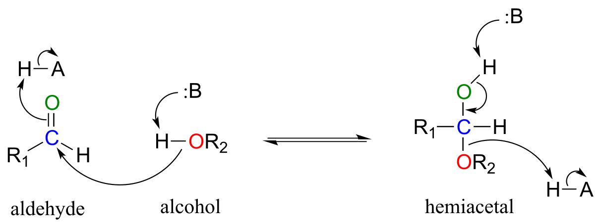

fig 6

In general, hemiacetals (and hemiketals) are higher in energy than their
aldehyde-alcohol components, so the equilibrium for the reaction lies to
the left. As we will soon see in the context of glucose and other
sugars, however, five- and six-membered *cyclic* hemiacetals are
considerably lower in energy, and are favored at equilibrium: recall
from chapter 3 the inherent stability of five- and six-membered rings.

Aldehydes and ketones, when in aqueous solution, exist in equilibrium
with their **hydrate** form. A hydrate forms as the result of a water
molecule adding to the carbonyl carbon of the aldehyde or ketone.

fig 6a

Although you should be aware that aldehyde and ketone groups may exist
to a considerable extent in their hydrated forms when in aqueous
solution (depending upon their structure), they are usually drawn in
their non-hydrated form for the sake of simplicity.

The mechanism we just saw for hemiacetal formation applies to
biochemical reactions occurring at physiological pH. In the organic
laboratory, however, hemiacetal and hemiketal formation usually takes
place in the presence of a strong acid. The acid catalyzes the reaction
by protonating the carbonyl oxygen, thus increasing the electrophilicity
of the carbonyl carbon. Notice in the mechanism below that highly acidic
intermediates are drawn which would be unreasonable to propose for the
corresponding biochemical mechanisms occurring at physiological pH.

Acid-catalyzed hemiacetal formation (non-biological):

fig 6b

### 10.2B: Sugars as intramolecular hemiacetals and hemiketals 

As stated above, the reactions of hemiacetals and hemiketals are central
to the chemistry of carbohydrates. Recall that sugar molecules generally
contain either an aldehyde or a ketone functional group, in addition to
multiple alcohol groups. Aldehyde sugars are often referred to as
**aldoses**; ketone sugars as **ketoses**. For example, glucose is an
aldose, and fructose is a ketose - their structures are drawn below in
Fischer projection:

fig 8

<u>Exercise 10.1</u>: What term describes the *relationship* between
glucose and fructose (in other words, what kind of isomers are they)?

Glucose and fructose are shown above in their open-chain form. However,
recall from section 1.3C that in aqueous solution, glucose, fructose,
and other sugars of five or six carbons rapidly interconvert between
straight-chain and cyclic forms. This occurs through the formation of
*intramolecular* hemiacetals and hemiketals. This simply means that the
'R' group of the alcohol is already covalently attached to the 'R 'group
of the aldehyde (R1 in our general mechanism).

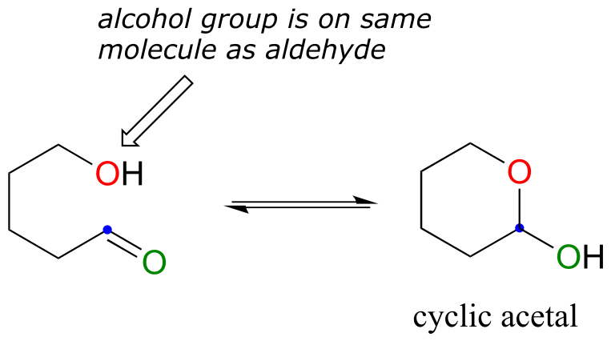

fig 9a

Unlike most of the biochemical reactions you will see in this text,
sugar cyclization reactions *are not catalyzed by enzymes*: they occur
spontaneously and reversibly in aqueous solution. For most five- and
six-carbon sugars, the cyclic forms predominate in equilibrium.

The cyclic form of glucose is a six-membered ring, with an
intramolecular hemiacetal formed by attack of the hydroxl on carbon \#5
to the aldehyde carbon (carbon \#1, also called the **anomeric carbon**
in carbohydrate terminology).

fig 9

The cyclic form of glucose is called **glucopyranose**. As was discussed
above, nucleophilic attack on a planar carbonyl group can occur at
either face of the plane, leading to two different stereochemical
outcomes - in this case, to two different diastereomers. In carbohydrate
nomenclature, these two diastereomers are referred to as the α and β
**anomers** of glucopyranose.

Because the formation of glucopyranose occurs spontaneously without
enzyme catalysis, shouldn’t equal amounts of these two anomers form? In
fact, this does not happen: there is almost twice as much of one anomer
than the other at equilibrium. Why is this? Remember (section 3.2) that
six-membered rings exist predominantly in the chair conformation, and
that the lower energy chair conformation is that in which unfavorable
interactions between substituents are minimized – in most cases, this is
the conformation in which larger substituents are in the *equatorial*
position. In the lower-energy chair conformation of the major β anomer
of glucopyranose, all of the hydroxyl groups are in the equatorial
position, but in the minor α anomer one hydroxyl group is forced into
the axial position. As a result, the α anomer is higher in energy, and
less abundant at equilibrium.

fig 10

<u>Exercise 10.2</u>: Draw a mechanism for the conversion of
α-glucopyranose to open-chain glucose.

Fructose in aqueous solution forms a six-membered cyclic hemiketal
called **fructopyranose** when the hydroxyl oxygen on carbon \#6 attacks
the ketone carbon (carbon \#2, the anomeric carbon in fructose).

fig 11

In this case, the β anomer is heavily favored in equilibrium by a ratio
of 70:1, because in the minor α anomer the bulkier CH2OH
group occupies an axial position.

Notice in the above figure that the percentages of α and β anomers
present at equilibrium do not add up to 100%. Fructose also exists in
solution as a *five*-*membered* cyclic hemiketal, referred to in
carbohydrate nomenclature as **fructofuranose**. In the formation of
fructofuranose from open-chain fructose, the hydroxyl group on the
*fifth* carbon attacks the ketone.

fig 12)

In aqueous solution, then, fructose exists as an equilibrium mixture of
70% β-fructopyranose, 23% β-fructofuranose, and smaller percentages of
the open chain and cyclic α-anomers. The β-pyranose form of fructose is
one of the sweetest compounds known, and is the main component of
high-fructose corn syrup. The β-furanose form is much less sweet.

Although we have been looking at specific examples for glucose and
fructose, other five- and six-carbon monosaccharides also exist in
solution as equilibrium mixtures of open chais and cyclic hemiacetals
and hemiketals. Shorter monosaccharides are unlikely to undergo
analogous ring-forming reactions, however, due to the inherent
instability of three and four-membered rings.

<u>Exercise 10.3</u>:

a\) Identify the anomeric carbon of each of the sugars shown below, and
specify whether the structure shown is a hemiacetal or hemiketal.

b\) Draw mechanisms for cyclization of the open-chain forms to the
cyclic forms shown.

fig 12a

##  10.3: Acetals and ketals

### 10.3A: Overview

Hemiacetals and hemiketals can react with a second alcohol nucleophile
to form an acetal or ketal. The second alcohol may be the same as the
first (ie*.* if R2 = R3 in the scheme below), or
different.

fig 13

Although we focus here on biological reactions, it is instructive in
this case to consider non-biological acetal-forming reactions before we
look at their biochemical counterparts. In a non-enzymatic context,
acetal/ketal formation - just like hemiacetal/hemiketal formation - is
generally catalyzed by a strong acid.

Acid-catalyzed acetal formation (non-biological)

fig 18b

The role of the acid catalyst is to protonate the OH group of the
acetal, thus making it a good leaving group (water). Notice something
important here***: the conversion of a hemiacetal to an acetal is simply
an SN1 reaction, with an alcohol nucleophile and water
leaving group.*** The carbocation intermediate in this SN1
mechanism is stabilized by resonance due to the oxygen atom already
bound to the electrophilic carbon.

Below are some examples of simple, non-biological acetal and ketals.

fig

13a

<u>Exercise 10.4</u>: For each acetal/ketal A-D in the figure above,
specify the required aldehyde/ketone and alcohol starting materials.

<u>Exercise 10.5</u>: Categorize each of the following molecules as a
hemiacetal, hemiketal, acetal, ketal, hydrate of an aldehyde, or hydrate
of a ketone.

fig 15c

<u>Exercise 10.6:</u> Specify the acetal/ketal that would form from a
reaction between the given starting compounds.

fig 15d

<u>Exercise 10.7</u>: Specify the aldehyde/ketone and alcohol
combination that would be required to form the compounds in exercise
10.5.

### 10.3B: Glycosidic bond formation

Now, let's consider acetal formation in a biochemical context. A very
important example of the acetal/ketal group in biochemistry is the
glycosidic bonds which link individual sugar monomers to form
polysaccharides (see section 1.3C for a quick review). Look at the
glycosidic bond between two glucose monomers in a cellulase chain:

fig 16

If you look carefully, you should recognize that carbon \#1, the
anomeric carbon on the left-side glucose monomer, is the central carbon
of an acetal group. Biochemists refer to this as a β-1,4 linkage,
because the stereochemistry at carbon \#1 is β in the specialized
carbohydrate nomenclature system, and it is linked to carbon \#4 of the
next glucose on the chain. The vast structural diversity of
carbohydrates stems in large part from the different linkages that are
possible - both in terms of which two carbons are linked, and also the
stereochemistry of the linkage. You will see many more variations of
glycosidic bond linkage patterns if you study carbohydrate biochemistry
in greater depth.

Reactions in which new glycosidic bonds are formed are catalyzed by
enzymes called **glycosyltransferases**, and in organic chemistry terms
these reactions represent the conversion of a hemiacetal to an acetal
(remember that sugar monomers in their cyclic form are hemiacetals and
hemiketals). The mechanism for glycosidic bond formation in a living
cell parallels the acid-catalyzed (non-biological) acetal-forming
mechanism, with an important difference: rather than being protonated,
*the OH group of the hemiacetal is converted to a good leaving group by
phosphorylation* (this is a pattern that we are familiar with from
chapters 9 and 10). The specific identity of the activating phosphate
group varies for different reactions, so it is generalized in the figure
below.

Mechanism for (biochemical) acetal formation:

Hemiacetal activation phase:

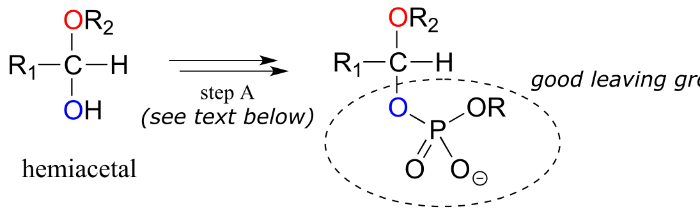

acetal formation phase:

fig 18

 Step A (Activation phase): This phase of the reaction varies according
 to the particular case, but always involves phosphate group transfer
 steps that are familiar from chapter 9. What is most important for our
 present discussion, however, is simply that the hydroxyl group on the
 hemiacetal has been activated - ie. made into a good leaving group -
 by phosphorylation.

 Step 1: Now that the leaving group has been activated, it does its job
 and leaves, resulting in a resonance stabilized carbocation.

 Step 2: A nucleophilic alcohol on the growing cellulose chain attacks
 the highly electrophilic carbocation to form an acetal. Here is where
 the stereochemistry of the new glycosidic bond is determined:
 depending on the reaction, the alcohol nucleophile could approach from
 either side of the planar carbocation.

To reiterate: it is important to recognize the familiar SN1
mechanistic pattern in play here: in step A, a poor leaving group is
converted into a good leaving group, in step 1 the leaving group leaves
and a stabilized carbocation is left behind, and in step 2 a nucleophile
attacks to form a new bond and complete the substitution process. Look
back at the SN1 reactions we saw in chapter 8 if you are
having trouble making this mechanistic connection.

Now, let's look specifically at the glycosyl transferase reaction
mechanism in which a new glycosidic bond is formed on a growing
cellulose chain. Glucose (a hemiacetal) is first activated through two
enzymatic phosphate transfer steps: step A1, a phosphate isomerization
reaction with a mechanism similar to the reaction in problem P9.13,
followed by a UTP-dependent step A2, for which you were invited to
propose a mechanism in problem P9.12.

fig 19a

The UDP group on glucose-UDP then leaves (step 1 below), forming a
resonance-stabilized carbocation intermediate. Attack by the alcohol
group on the growing cellulose chain in step 2 forms the glycosidic
(acetal) bond. Note the inversion of stereochemistry. *Mol. Plant*
**2011**, *4*, 199

fig 19

### 10.3C: Glycosidic bond hydrolysis

Acetals can be hydrolyzed back to hemiacetals. Notice that an acetal to
hemiacetal conversion is an SN1-type reaction with a water
nucleophile and an alcohol leaving group.

Mechanism for acetal hydrolysis (enzyme-catalyzed):

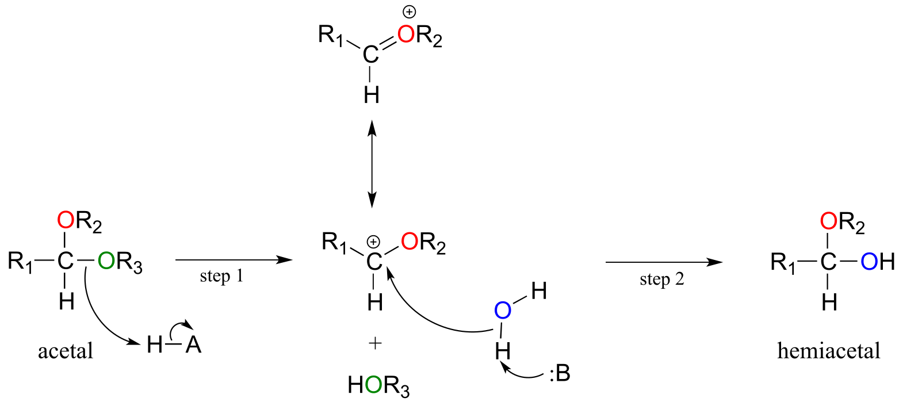

fig 20

In step 1, an alcohol is protonated by a nearby acid group as it breaks
away to form a resonance-stabilized carbocation intermediate. The
carbocation is attacked by a nucleophilic water molecule in step 2 to
form a hemiacetal.

The general mechanism above applies to reactions catalyzed by
**glycosidase** enzymes, which catalyze the cleavage of glycosidic bonds
in carbohydrates. In the introduction to this chapter, we learned about
ongoing research in the field of cellulosic ethanol. Recall that the
main bottleneck in the production of ethanol from sources such as
switchgrass or wood is the **cellulase**-catalyzed step in which the
glycosidic bonds in cellulose are cleaved. Cellulose-digesting microbes
have several different but closely related forms of cellulase enzymes,
all working in concert to cleave cellulose into smaller and smaller
pieces until individual glucose molecules are free to be converted to
ethanol by the fermentation process. Below is a representative mechanism
for a cellulase reaction.

Cellulase mechanism:

fig 21

The starch-digesting amylase enzymes used in the corn ethanol production
process catalyze similar glycoside hydrolysis reactions, the main
difference being the opposite stereochemistry at the anomeric carbon of
the substrate.

<u>Exercise 10.8</u>: Notice that the cellulose glycososide
bond-*forming* reaction requires the cell to 'spend' a high-energy UTP
molecule, but the cellulase glycoside bond-*breaking* reaction does not.
Use your knowledge of chemical thermodynamics to explain this
observation.

<u>Exercise 10.9</u>: Below is the structure of the artificial sweetener
sucralose. Identify the two anomeric carbons in the disaccharide.

<u>Exercise 10.10</u>: Robinose is a disaccharide found in 'Chenille
Plant', a flowering shrub native to the Pacific Islands.

fig 21c

a\) Identify the two anomeric carbons and the glycosidic bond in
robinose.

b\) Using the same carbon numbering system as for glucose in the earlier
figure, fill in in the carbon numbers (#1 through \#6) for each of the
monosaccharides that make up robinose.

c\) Based on what you know of glycosidic bond-forming reactions in
nature, propose a reasonable mechanism for the linking of the two
monosaccharides, starting with the activated hemiacetal species,
assuming that it is a UDP species as in the cellulose gycosidic
bond-forming reaction.

d\) Draw the open chain form of each of the monosaccharides

<u>Exercise 10.11</u>: Look again at the structures of the two-glucose
fragments of cellulose and amylose shown the introduction to this
chapter. A structural feature of the cellulose polymer makes it
inherently more resistant to enzymatic hydrolysis compared to starch.
Explain. (Hint: think about intermolecular interactions.)

**  
**

##  10.4: *N*-glycosidic bonds

We have just seen that when a second alcohol attacks a hemiacetal or
hemiketal, the result is an acetal or ketal, with the glycosidic bonds
in carbohydrates providing a biochemical example. But if a hemiacetal is
attacked not by a second alcohol but by an amine, what results is a kind
of ‘mixed acetal’ in which the anomeric carbon is bonded to one oxygen
and one nitrogen.

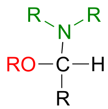

fig 22a

This arrangement is referred to by biochemists as an ***N*-glycosidic
bond.** You may recognize these as the bonds in nucleosides and
nucleotides that link the G, C, A, T, or U base to the sugar.

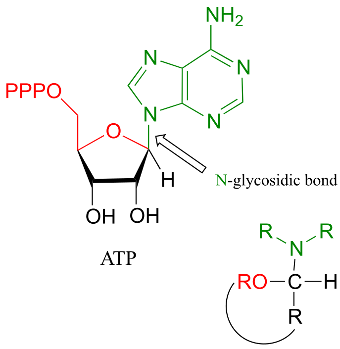

fig 22

The formation of *N*-glycosidic bonds in ribonucleotides is closely
analogous to the formation of glycosidic bonds in carbohydrates – again,
it is an SN1-like process with an activated water leaving
group. Typically, the hemiacetal is activated by diphosphorylation, as
illustrated in step A of the general mechanism below.

Mechanism for formation of an *N-*glycosidic bond:

fig 22b

The starting point for the biosynthesis of purine (G and A)
ribonucleotides is a five-carbon sugar called ribose-5-phosphate, which
in solution takes the form of a cyclic hemiacetal. The critical
*N*-glycosidic bond is established through substitution of
NH3 for OH at the anomeric carbon of the ribose. The anomeric
OH group is first activated (step A below) to form an activated
intermediate called phosphoribosylpyrophosphate (PRPP). The inorganic
pyrophosphate then leaves to generate a resonance-stabilized carbocation
(step 1) which is attacked by a nucleophilic ammonia in step 2 to
establish the *N*-glycosidic bond.

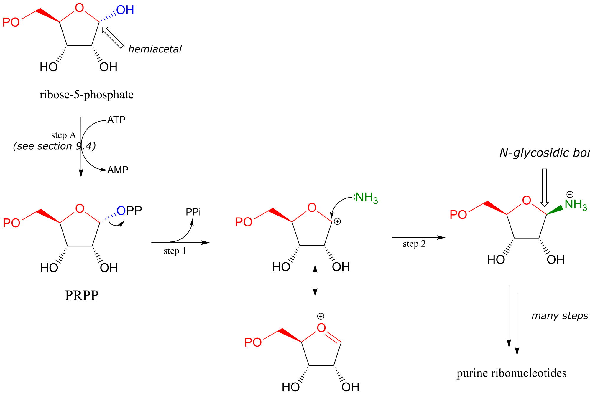

fig 23

With the *N*-glycosidic bond in place, the rest of the purine base is
assembled piece by piece by other biosynthetic enzymes.

(The mechanism above should look familiar - we saw step A in chapter 9
as an example of alcohol diphosphorylation , and steps 1 and 2 in
chapter 8 as an example of a biochemical SN1 reaction).

Establishment of the *N*-glycosidic bond in biosynthesis of the
pyrimidine ribonucleotides and (U, C and T) also begins with PRPP, but
here the ring structure of the nucleotide base part of the biomolecule
has already been 'pre-fabricated' in the form of orotate:

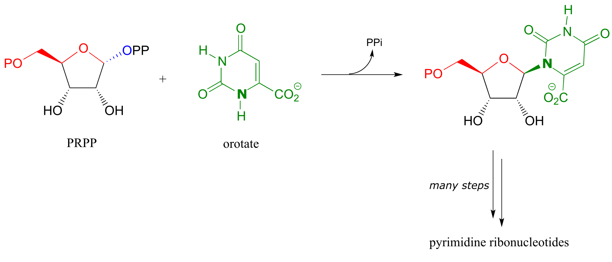

fig 23a

<u>Exercise 10.12</u>: We have just seen an illustration of the
formation of an *N*-glycosidic bond in a biosynthetic pathway. In the
catabolic (degradative) direction, an *N*-glycosidic bond must be
broken, in a process which is analogous to the hydrolysis of a
glycosidic bond (illustrated earlier). In the catabolism of guanosine
nucleoside, the *N*-glycosidic bond is broken by inorganic phosphate
(not water!) apparently in a *concerted* (SN2-like)
displacement reaction (*Biochemistry* **2011**, *50*, 9158). Predict the
products of this reaction, and draw a likely mechanism.

<u>Exercise 10.13</u>: Glycoproteins are proteins that are linked, by
glycosidic or *N*-glycosidic bonds, to sugars or carbohydrates through
an asparagine, serine, or threonine side chain on the protein. As in
other glycosylation and *N*-glycosylation reactions, the hemiacetal of
the sugar must be activated prior to glycosidic bond formation. Below is
the structure of the *activated* sugar hemiacetal substrate in an
asparagine glycosylation reaction. (*Nature* **2011**, *474*, 350)

fig 21a

Draw the product of the asparagine glycosylation reaction, assuming
inversion of configuration of the anomeric carbon.

**  
**

##  10.5: Imines and iminium ions

The electrophilic carbon atom of aldehydes and ketones can be the target
of nucleophilic attack by amines as well as alcohols. The end result of
attack by an amine nucleophile is a functional group in which the C=O
double bond is replaced by a C=N double bond, and is known as an
**imine.** (An equivalent term is **'Schiff base'**, but we will use
'imine' throughout this book). Recall from section 7.5B that imines have
a pKa of approximately 7, so at physiological pH they can be
accurately drawn as either protonated (**iminium** **ion** form) or
neutral (imine).

Iminium ion formation

Mechanism (enzymatic):

fig 25

Mechanistically, the formation of an imine involves two steps. First,
the amine nitrogen attacks the carbonyl carbon in a nucleophilic
addition step (step 1) which is closely analogous to hemiacetal and
hemiketal formation. Based on your knowledge of the mechanism of acetal
and ketal formation, you might expect that the next step would be attack
by a second amine to form a compound with a carbon bound to two amine
groups – the nitrogen version of a ketal or acetal. Instead, what
happens next (step 2 above) is that the nitrogen lone pair electrons
‘push’ the oxygen off of the carbon, forming a C=N double bond (an
iminium) and a displaced water molecule.

The conversion of an iminium back to an aldehyde or ketone is a
hydrolytic process (bonds are broken by a water molecule), and
mechanistically is simply the reverse of iminiom formation:

Hydrolysis of an iminium ion:

Mechanism (enzymatic):

fig 26

Carbon-carbon bond forming enzymes called aldolases (which we'll cover
in detail in chapter 12) often form iminium links between a carbonyl
carbon on a substrate and a lysine residue from the active site of the
enzyme, as in this aldolase reaction from the Calvin Cycle:

fig 27

After the carbon-carbon bond forming part of an aldolase reaction is
completed, the iminium linkage is hydrolyzed, freeing the product so
that it can diffuse out of the active site and allow another catalytic
cycle to begin.

In chapter 17, we will learn about reactions that are dependent upon a
coenzyme called pyridoxal phosphate (PLP), also known as vitamin
B6. In these reactions, the aldehyde carbon of PLP links to
an enzymatic lysine in the active site:

fig 27c

Then, the PLP-lysine imine linkage is traded for an imine linkage
between PLP and the amino group on the substrate, in what can be
referred to as a **transimination**.

The mechanism for a transimination is very similar to that of imine
formation:

Transimination reaction:

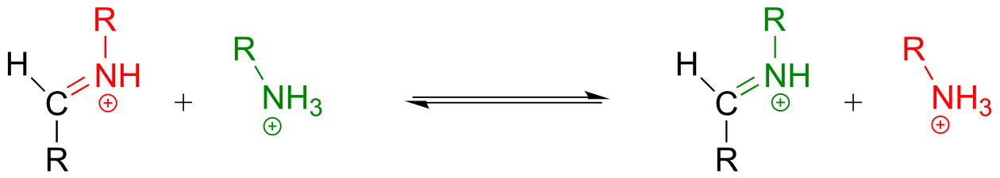

Mechanism:

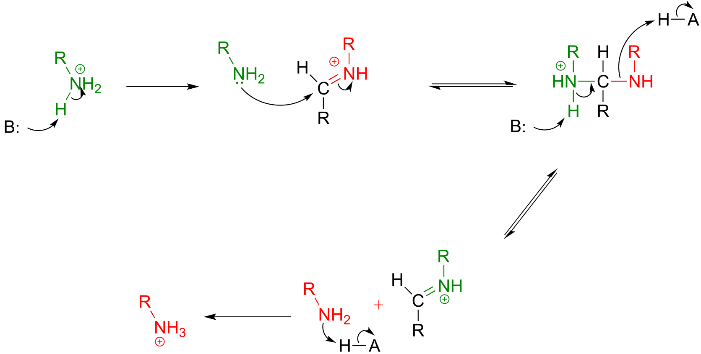

fig 27e

<u>Exercise 10.14:</u> Draw an imine that could be formed between each
pair of compounds.

a\)

b\)

c\)

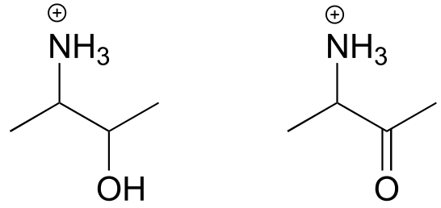

fig 28a

<u>Exercise 10.15</u>: Draw the imminium hydrolysis product for each of
the following compounds.

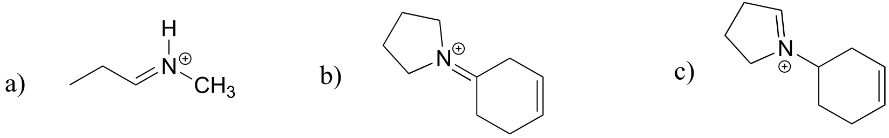

fig 28b

<u>Exercise 10.16</u>:

a\) The metabolic intermediate shown below undergoes an intramolecular
imine formation as a step in the biosynthesis of lysine (EC 4.3.3.7).
Draw the product of this intramolecular imine formation step.

fig 27a

b\) Predict the product of this iminium hydrolysis step (EC 2.3.1.117)
from the proline degradation pathway.

##  10.6: A look ahead: addition of carbon and hydride nucleophiles to carbonyls

We have seen in this chapter a number of reactions in which oxygen and
nitrogen nucleophiles add to carbonyl groups. Other nucleophiles are
possible in carbonyl addition mechanisms: in chapters 12 and 13, for
example, we will examine in detail some enzyme-catalyzed reactions where
the attacking nucleophile is a resonance stabilized carbanion (usually
an enolate ion):

fig 28

Then in chapter 15, we will see how the carbonyl groups on aldehydes and
ketones can be converted to alcohols through the nucleophilic addition
of what is essentially a hydride (H-) ion.

fig 29

##  Key concepts for review

Before moving on to the next chapter, you should be confident in your
ability to:

Recognize aldehyde and ketone groups in organic biomolecules

Draw/explain the bonding picture for aldehyde and ketone groups

Explain why the carbonyl carbon in an aldehyde or ketone is
electrophilic

Draw complete curved arrow mechanisms for the following reaction types:

formation of a hemiacetal/hemiketal

collapse of a hemiacetal/hemiketal to revert to an aldehyde/ketone

formation and hydrolysis of an acetal/ketal

formation and hydrolysis of an *N*-glycosidic bond

formation and hydrolysis of an imine

transimination

Explain how the carbocation intermediates in glycosidic bond formation
and hydrolysis reactions are stabilized by resonance

Explain the stereochemical considerations of a nucleophilic addition to
an aldehyde/ketone, especially in the context of glycosidic bond
formation. Be able to identify the *re* and *si* faces of an aldehyde,
ketone, or imine.

In addition to these fundamental skills, you should develop your
confidence in working with end-of-chapter problems involving more
challenging, multi-step biochemical reactions.

## Problems

**P10.1** Draw a mechanism showing the formation of an imine linkage
between a lysine side chain and α-ketobutyrate (this is the first step
in the degradation of lysine, EC 1.5.1.8).

**P10.2:** Draw four possible cyclic hemiketal isomers of the compound
below.

**P10.3:** A downstream intermediate in the lysine degradation pathway
undergoes imine hydrolysis to release two amino acid products (EC
1.5.1.1). Draw a mechanism for this hydrolysis reaction, and show the
structures of the two products formed.

**P10.4:** Below is the structure of lactose, the sugar found in dairy
products.

Lactose is a disaccharide of galactose and glucose. People who are
lactose intolerant do not produce enough lactase - the enzyme that
hydrolyzes the glycosidic bond linking the two monosaccharides - to be
able to fully digest dairy products.

a\) Draw a likely stabilized carbocation intermediate in the hydrolysis
reaction catalyzed by lactase.

b\) Draw, in the chair conformation, the structure of what you predict
would be the most abundant form of the galactose monosaccharide in
aqueous solution.

c\) Is galactose an aldose or a ketose?

d\) Draw, showing sterochemistry, the open-chain form of galactose.

**P10.5:** You probably know that ascorbic acid (vitamin C) acts as an
antioxidant in the body. When vitamin C does its job, it ends up being
oxidized to dehydroascobate, which is usually drawn as shown below, in
the so-called tricarbonyl form.

Evidence suggests, however, that the most important form of
dehydroascorbate in a physiological context is one in which one of the
ketone groups is in its hydrated form, and the other is an
intramolecular hemiketal (see *Chemical and Engineering News*, Aug. 25,
2008, p. 36). Show the structure of this form of dehydroascorbic acid.

**P10.6:** The compound below is the product of a ring-opening imine
hydrolysis step in the degradation pathway for proline, one of the amino
acids. Draw the structure of the starting compound.

**P10.7:** The rearrangement below was proposed to proceed via imine
formation followed by nucleophilic substitution. Propose a mechanism
that fits this description. (J. Biol. Chem. 280, 12858, scheme 2 part 2)
.

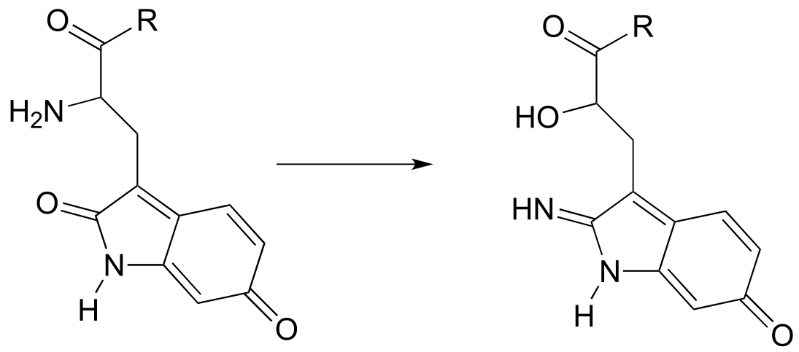

**P10.8:** The biochemical acetal-forming reactions we learned about in
this chapter all require activation of the hemiacetal through
phosphorylation. In the organic synthesis lab, non-enzymatic
acetal-forming reactions are carried out with a catalytic amount of
strong acid, which serves to activate the hemiacetal. Predict the
product of the following acetal forming reaction, and propose a
reasonable mechanism for the reaction. Remember that the reaction is
carried out under acidic conditions, which means that the protonation
state of intermediates will be different than biochemical reactions
occurring at neutral pH.

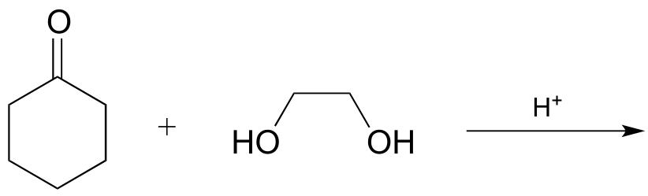

*Problems 9-15 all involve variations on, and combinations of, the
nucleophilic addition steps that we studied in this chapter. Although
the reactants and/or products may look somewhat different from the
simpler aldehydes, acetals, imines, etc. that we used as examples in the
chapter, the key steps still involve essentially the same mechanistic
patterns. Before attempting these problems, you may want to review
**tautomerization** reactions in section 7.6.*

**P10.9:** The final step in the biosynthesis of inosine monophosphate
(IMP, a precursor to both AMP and GMP), is a ring-closing reaction in
which a new nitrogen-carbon bond (indicated by an arrow in the structure
below) is formed. Predict the starting substrate for this reaction, and
propose a mechanism that involves a slight variation on typical imine
formation. (EC 3.5.4.10)

**P10.10:** Propose a mechanism for these steps in nucleotide
metabolism:

a\) (EC 3.5.4.5)(

b\) (EC 3.5.4.4)

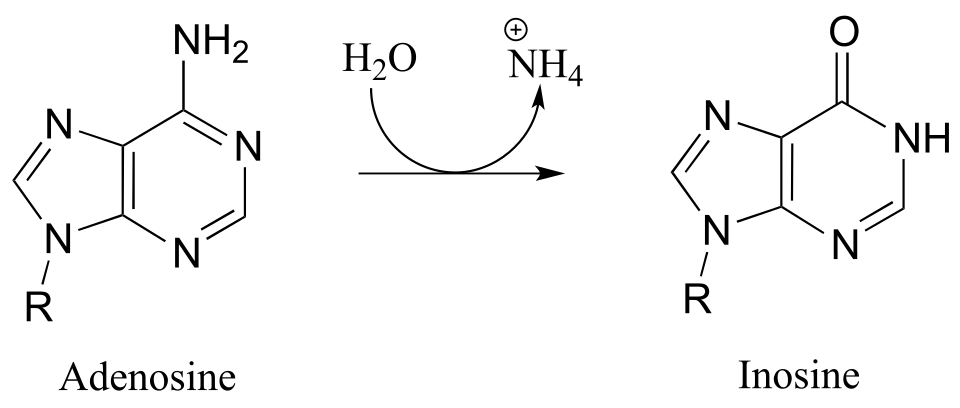

**P10.11**

a\) Draw the structure (including stereochemistry) of the compound that
results when the cyclic hemiketal shown below coverts to an open-chain
compound with two ketone groups.

b\) The compound shown below undergoes a ring-opening reaction to form a
species that can be described as both an enol and an enamine. Draw the
structure (including stereochemistry) of this product, and a likely
mechanism for its formation. (EC 5.3.1.24)

**P10.12:** Tetrahydrofolate (THF) is a coenzyme that serves as a
single-carbon donor in many biochemical reactions. Unlike
S-adenosylmethionine (SAM, see section 8.8), the carbon being
transferred in a THF-dependent reaction is often part of a carbonyl.
Below is a reaction in the histidine degradation pathway (EC 3.5.3.8).
The mechanism involved is thought to be an transimination, followed by a
imine-to-imine tautomerization, followed by an imine hydrolysis. Propose
a reasonable mechanism that fits this description. *Hint*: first
identify the carbon atom being transferred.

**P10.13:** Hydrazones are close relatives of imines, formed in
reactions between aldehydes/ketones and hydrazines, a functional group
containing a nitrogen-nitrogen bond. The mechanism for hydrazone
formation is analogous to that of imine formation.

Guanafuracin, a known antibiotic compound, is a hydrazone, and can be
prepared easily in the laboratory by combining equimolar amounts of the
appropriate aldehyde and hydrazine in water (no heat or acid catalyst is
required, and the reaction is complete in seconds).

Determine the starting materials required for the synthesis of
guanafuracin, and propose a likely mechanism for the reaction.

**P10.14:** Propose reasonable mechanisms for the following steps from
the histidine biosynthesis pathway, and predict the structure of
intermediate A (which is open-chain, not cyclic).

***The last several problems are quite challenging!***

**P10.15:** Propose a likely mechanism for the synthesis of glucosamine
6-phosphate from fructose-6-phosphate. One of several intermediates is
shown. (EC 2.6.1.16.)

**P10.16 :** α-chloromethyl ketones (structure below) are effective
irreversible inhibitors of proteolytic (peptide-bond breaking) enzymes
such as chymotrypsin. In these enzymes, a nucleophilic serine plays a
key role in the reaction. The mechanism for inactivation of
α-chymotrypsin is thought to involve, as a first step, nucleophilic
attack by the active site serine on the carbonyl of the inhibitor.
However, when the inactivated enzyme is analyzed, an active site
histidine rather than the serine, is found to be covalently modified by
the inhibitor. The structure of the modified histidine is shown below.
The mechanism of inactivation is thought to involve an epoxide
intermediate - with this in mind, propose a reasonable mechanism of
inactivation.

**P10.17:** An enzyme in *E. coli* bacteria catalyzes the hydrolysis of
α-glucose-GDP to glucose.

1H-NMR analysis of the reaction in progress showed the
initial appearance of a doublet at 4.64 ppm with J = 7.9 Hz (the
spectrum contained other signals as well, of course). After 20 minutes
(at which point the hydrolysis reaction has been complete for some
time), another doublet began to appear slightly downfield, this one with
J = 4.0 Hz. Over time, the strength of the downfield signal gradually
increased and that of the upfield signal gradually decreased, until they
stabilized at constant levels.

Draw a mechanism for the enzymatic hydrolysis reaction, and correlate
your mechanism to the NMR data (including the appearance of the second
doublet).

**C11.4:** Arginine deaminase, an enzyme in the arginine degradation
pathway, catalyzes the transformation of (L)-arginine to (L)-citrulline
via a covalent substrate-cysteine intermediate.

This enzyme is the target for the development of drugs for cancer and
immunological diseases such as arthritis. However, rather than
completely and permanently shutting down the enzyme (eg. with an
irreversible inhibitor), researchers are looking for a way to
temporarily 'turn down' the activity of the enzyme. One strategy that
has recently been reported involves the use of an oxygen-containing
arginine analog, called canavanine, which reacts in the same way as
arginine except that the second (hydrolysis) step is very slow. While
the enzyme is covalently attached to the inhibitor (in the S-alkyl
thiuronium stage), it is inactivated.

a\) Show a mechanism for the reaction catalyzed by arginine deaminase.

b\) Explain how the electronic effect of the oxygen substituent would
slow down the hydrolysis step of the reaction, and why the rate of the
hydrolysis step is more affected by the oxygen substitution than the
S-alkylthiuronium-forming step.
