# 11: Nucleophilic acyl substitution reactions

## Introduction

> The 26th of *July*, Notice is given to the Sheriffs, that in the
> Street of *Lescalle*, a Part of the old Town inhabited only by poor
> People, Fifteen Persons are suddenly fallen sick: They dispatch
> thither Physicians and Surgeons; they examine into the Distemper, and
> make Report; some, that 'tis a Malignant Fever; others, a contagious
> or pestilential Fever, occasioned by bad Food, which Want had long
> forced those poor Creatures to live upon . . .
>
> The 27th, Eight of those Sick dye; the Sheriffs themselves go to their
> Houses to cause them to be searched; Buboes \[*swelling of the lymph
> nodes*\] are found on Two of them: The Physicians and Surgeons still
> hold the same Language, and impute the Cause of the Distemper to
> unwholsome Food. Notwithstanding which, as soon as Night comes, M.
> *Moustier* repairs to the Place, sends for Servants from the
> Infirmaries, makes them willingly or by Force, take up the Bodies,
> with all due Precautions; they are carried to the Infirmaries, where
> they are buried with Lime; and all the rest of the Night he causes the
> remaining Sick, and all those of their Houses, to be removed to the
> Infirmaries.
>
> The 28th, very early in the Morning, Search is made every where for
> those who had Communication with them, in order to confine them: Other
> Persons in the same Street fall sick, and some of those who first
> sicken'd dye. ..
>
> The People who love to deceive themselves, and will have it absolutely
> not to be the Plague, urge a Hundred false Reasons on that Side. Would
> the Plague, say they, attack none but such poor People? Would it
> operate so slowly?
>
> Let them have but a few Days Patience, and they will see all attacked
> without Distinction, with the swiftest Rage, and the most dreadful
> Havock, that ever was heard of.

(source: Gutenberg Project

http://www.gutenberg.org/files/45673/45673-h/45673-h.htm)

In late May of 1720, a ship arrived in the Mediterranean port city of
Marseille, having recently departed from Cyprus and Tripoli. Although
several crew members had fallen ill and died during the journey, the
ship was allowed to unload after only a very brief quarantine, the
result of political pressure on port authorities from local businessmen
who wanted quick access to the valuable silk and cotton waiting in the
ship's hold.

Along with silk and cotton, the hold carried rats. The rats, in turn,
carried fleas. The fleas carried a microscopic mass murderer: *Yersinia
pestis*, the species of bacteria that causes bubonic plague.

It is next to impossible to estimate how many people have died from
bubonic plague over the course of human history. In the time of the
'Black Death' in the 14th century, it wiped out more than
half the population of Europe. In the Great Plague of Marseille in 1720,
over 100,000 people succumbed to *Y. pestis* infection in the city and
surrounding provinces. At the height of the outbreak, corpses piled up
in city streets, and a fortified wall, the '*mur de la peste*' was
constructed in an attempt to prevent people from traveling north to the
neighboring city of Aix.

Throughout history, bacteria have been the cause of untold human death
and suffering, making the threat posed by more obviously frightening
species - lions and bears, spiders and snakes – seem inconsequential by
comparison. As recently as the mid-1940s, a minor cut or cold could
become a life-threatening event if a bacterial infection were to set in,
and even in developed countries, one in twenty infants did not survive
to celebrate their first birthday.

Since then, the infant mortality rate in developed countries has
declined by a factor of ten. You probably don't worry very much when a
small cut on your hand becomes infected. The idea of half of the
population of the United States dying in a plague is, in most people's
minds, the stuff of zombie movies, not reality. Bacteria are, for now at
least, no longer public enemy \#1.

How did this happen?

For an answer, we move to a September morning in 1928, in the laboratory
of Alexander Fleming, a Scottish bacteriologist working at St. Mary's
Hospital in London. As a young man serving in the British Medical Corps
during World War I, Fleming saw first-hand how deadly bacteria could be,
as he watched countless soldiers in his battlefield hospital die from
infected wounds. After returning to civilian life, he began to study
*Staphylococci* bacteria, a common source of life-threatening infections
in humans, hoping to discover new antibacterial agents that were more
effective than those he had used in the war. He spent a lot of his time
growing *Staphylococcus* cultures in petri dishes for his experiments,
and, notoriously untidy, he tended to leave piles of culture dishes
lying around his lab. One morning, he returned from a short vacation to
find that one of the cultures he had left out had some mold growing on
it. He was about to throw it away, but happened to notice something
curious: surrounding the small spot of mold was a circle of clear
medium, where no bacteria were growing. He realized that the mold must
be secreting something that killed bacteria.

As it turned out, the mold was a of strain called *Penicillium notatum*,
and the 'something' killing the bacteria was an organic compound that
came to be known as penicillin.

Fleming published his findings in the *British Journal of Experimental
Pathology*, but made only passing reference to the potential therapeutic
value of penicillin. The paper received little attention.

Fast-forward now to early February 1941, with the world once again at
war. One morning, a policeman named Albert Alexander living in Oxford,
England, had an unfortunate gardening accident. While he was trimming
some roses on his day off, his shears slipped and gave him a nasty cut
on the side of his mouth. The cut became infected, and after a few days
it appeared as if the infection would kill him. Then, he got a visit in
his hospital room from some chemists at nearby Oxford University.

For the last few years, the chemists had been hard at work isolating
pure penicillin from mold cultures, a tricky job because the compound
tends to degrade during purification. It is a feat that Alexander
Fleming -who, after all, was a bacteriologist, not a chemist - had never
been able to accomplish, but the Oxford researchers had realized how
valuable penicillin might be to the war effort, and had finally met with
some success. They needed a human subject on whom to test the ability of
their compound to treat infected wounds, and Albert was their man for
the job. They injected him with penicillin, and within a day his
infection cleared up. It was a new day in the history of medicine.

At the heart of a penicillin molecule is an amide functional group -
more specifically, a *cyclic* amide, or 'lactam'. To understand how
penicillin works at the molecular level as it prevents bacteria from
multiplying, we first need to know more about the chemistry of amides
and other carboxylic acid derivative functional groups, and a type of
organic reaction mechanism called 'nucleophilic acyl substitution'.
Understanding the reactivity of carboxylic acid derivative groups will
also allow us to appreciate why penicillin is so prone to degradation,
and why - very significantly for all of us - the era of not having to
worry about bacterial infections may be near an end, as common toxic
bacterial species such as *Staphylococcus* develop increasingly robust
resistance to antibiotics.

## Section 11.1: Carboxylic acid derivatives 

The functional groups at the heart of this chapter are called
**carboxylic acid derivatives**: they include carboxylic acids
themselves, carboxylates (deprotonated carboxylic acids), amides,
esters, thioesters, and acyl phosphates.

fig 1

*Cyclic* esters and amides are referred to as **lactones** and
**lactams**, respectively.

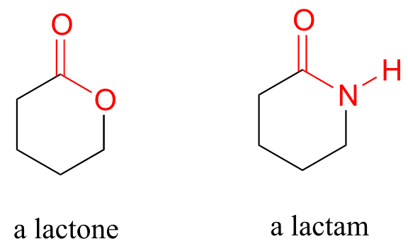

fig 2a

Carboxylic acid anyhydrides and acid chlorides, which also fall under
the carboxylic acid derivative category, are not generally found in
biomolecules but are useful intermediates in laboratory synthesis. They
are discussed in a section on laboratory reactions at the end of this
chapter.

fig 2

Carboxylic acid derivatives can be distinguished from aldehydes and
ketones by the presence of a group containing an electronegative
heteroatom - usually oxygen, nitrogen, or sulfur – bonded directly to
the carbonyl carbon. You can think of a carboxylic acid derivative as
having two sides. One side is the **acyl** group, which is the carbonyl
plus the attached alkyl (R) group. In the specific cases where R is a
hydrogen or methyl, chemists use the terms **formyl** and **acetyl**
group, respectively. One the other side is the heteroatom-linked group:
in this text, we will sometimes refer to this component as the ‘acyl X'
group (this, however, is *not* a standard term in organic chemistry).

fig 3

Notice that the acyl X groups are simply deprotonated forms of other
functional groups linked to the acyl group: in an amide, for example,
the acyl X group is an amine, while in an ester the acyl X group is an
alcohol.

ig 4

<u>Exercise 11.1</u>: What is the ‘acyl X’ group in:

a\) an acid anhydride?

b\) a thioester?

c\) a carboxylic acid?

d\) an acyl phosphate?

<u>Exercise 11.2</u>: Draw the structures indicated:

a\) compound A after is has been acetylated (ie. an acetyl group added)

b\) compound B after it has been formylated

c\) compound C after it has been formylated

d\) Compound D after it has been acetylated

'Fatty acid' molecules such as stearate are carboxylates with long
carbon chains for acyl groups.

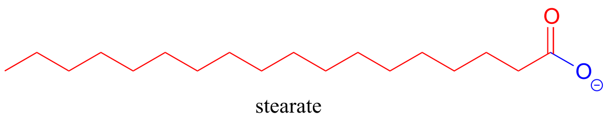

fig 5

The aromas of many fruits come from small ester-containing molecules:

fig 6

The 'peptide bonds' that link amino acids together in proteins are
amides.

fig 7

Acetyl-Coenzyme A, a very important two carbon (acetyl group) 'building
block' molecule in metabolism, is characterized by reactions at its
thioester functional group:

fig 8

<u>Exercise 11.3</u>: There are two amide groups in acetyl-CoA: identify
them.

<u>Exercise 11. 4</u>: Name all carboxylic acid derivative groups in the
molecules below.

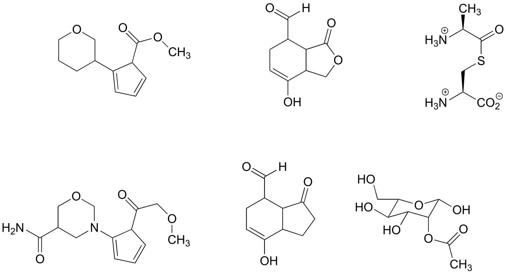

fig 8a

## Section 11.2: The nucleophilic acyl substitution mechanism

The fact that one of the atoms adjacent to the carbonyl carbon in
carboxylic acid derivatives is an electronegative heteroatom – rather
than a carbon like in ketones or a hydrogen like in aldehydes - is
critical to understanding the reactivity of carboxylic acid derivatives.
The most significant difference between a ketone/aldehyde and a
carboxylic acid derivative is that the latter has a potential leaving
group - what we are calling the 'acyl X group' - bonded to the carbonyl
carbon.

fig 9a

As a result, carboxylic acid derivatives undergo **nucleophilic acyl
substitution** reactions, rather than nucleophilic additions like
ketones and aldehydes.

A nucleophilic acyl substitution reaction starts with nucleophilic
attack at the carbonyl, leading to a tetrahedral intermediate (step 1
below). In step 2, the tetrahedral intermediate collapses and the acyl X
group is expelled, usually accepting a proton from an enzymatic acid in
the process.

Mechanism for a nucleophilic acyl substitution reaction:

fig 9

Notice that in the product, the nucleophile becomes the new acyl X
group. This is why this reaction type is called a nucleophilic acyl
*substitution*: one acyl X group is substituted for another. For
example, in the reaction below, one alcohol 'X group' (methanol),
substitutes for by another alcohol 'X group' (3-methyl-1-butanol) as one
ester is converted to another.

fig 10

Another way of looking at this reaction is to picture the *acyl* group
being transferred from one acyl X group to another: in the example
above, the acetyl group (in green) is transferred from
3-methyl-1-butanol (blue) to methanol (red). For this reason,
nucleophilic acyl substitutions are also commonly referred to as **acyl
transfer** reactions.

Enzymes catalyzing nucleophilic acyl substitution reactions have evolved
ways to stabilize the negatively charged, tetrahedral intermediate, thus
lowering the activation energy of the first, rate-determining step
(nucleophilic attack). The late transition state of the first step
resembles the tetrahedral intermediate that results: recall from chapter
6 that the Hammond postulate tells us that anything that stabilizes the
tetrahedral intermediate will also stabilize the transition state. In
many cases, for example, enzymatic amino acid residues are positioned in
the active site so as to provide stabilizing hydrogen bond donating
interactions with the negatively-charged oxygen. This arrangement is
sometimes referred to in the biochemistry literature as an **oxanion
hole**. The figure below shows a tetrahedral intermediate stabilized by
hydrogen bond donation from two main chain (amide) nitrogen atoms.

fig 9b

## <u>Section 11.3:</u> The relative reactivity of carboxylic acid derivatives

In carboxylic acid derivatives, the partial positive charge on the
carbonyl carbon is stabilized by electron donation from nonbonding
electrons on the adjacent heteroatom, which has the effect of decreasing
electrophilicity.

fig 11

Among the carboxylic acid derivatives, carboxylate groups are the least
reactive towards nucleophilic acyl substitution, followed by amides,
then carboxylic esters and carboxylic acids, thioesters, and finally
acyl phosphates, which are the most reactive among the biologically
relevant acyl groups. Acid anhydrides and acid chlorides are laboratory
reagents that are analogous to thioesters and acyl phosphates, in the
sense that they too are highly reactive carboxylic acid derivatives.
Section 11.8 near the end of this chapters includes information about
the chemistry of these two reagents.

Relative reactivity of carboxylic acid derivatives:

fig 12

The reactivity trend of the carboxylic acid derivatives can be
understood by evaluating the basicity of the leaving group (acyl X
group) - remember from section 8.4 that *weaker bases are better leaving
groups*. A thioester is more reactive than an ester, for example,
because a thiolate (RS-) is a weaker base and better leaving
group than an alcoxide (RO-). Recall from chapter 7 that the
pKa of a thiol is about 10, while the pKa of an alcohol is 15 or higher:
a stronger conjugate acid means a weaker conjugate base.

In general, if the incoming nucleophile is a weaker base than the ‘acyl
X’ group that is already there, it will also be the better leaving
group, and thus the first nucleophilic step will simply reverse itself
and we’ll get the starting materials back:

fig 13

In general, acyl substitution reactions convert higher energy carboxylic
acid derivatives into derivatives of lower energy. Thioesters, for
example, are often converted directly into carboxylic esters in
biochemical reactions, but not the other way around. To go 'uphill' -
from a carboxylate to a thioester, for example, requires the 'coupling'
of the uphill reaction to an energetically favorable reaction. We will
see how this works in the next section.

## Section 11.4: Acyl phosphates 

Acyl phosphates, because they are so reactive towards acyl
substitutions, are generally seen as reaction intermediates rather than
stable metabolites in biochemical pathways. Acyl phosphates usually take
one of two forms: a simple acyl monophosphate, or acyl-adenosine
monophosphate.

fig 14

Both forms are highly reactive to acyl substitution reactions, and are
often referred to as ‘**activated acyl groups**’ or ‘**activated
carboxylic acids**’ for reasons that will become clear soon. The
tendency of phosphates to form stabilizing complexes with one or more
magnesium ions in an enzyme's active site contributes in a large way to
the reactivity of acyl phosphates.

fig 15

A magnesium ion acts as a Lewis acid, accepting electron density from
the oxygen end of the acyl carbonyl bond, which greatly increases the
degree of partial positive charge - and thus the electrophilicity - of
the carbonyl carbon. The magnesium ion also balances negative charge on
the phosphate, making it a weak base and excellent leaving group.

We have already learned that the carboxylate functional group is the
*least* reactive substrate for an enzyme-catalyzed acyl substitution
reactions. In biology, though, carboxylates are frequently transformed
into thioesters, carboxylic esters, and amides, all of which are higher
in energy, meaning that these transformations are thermodynamically
'uphill'.

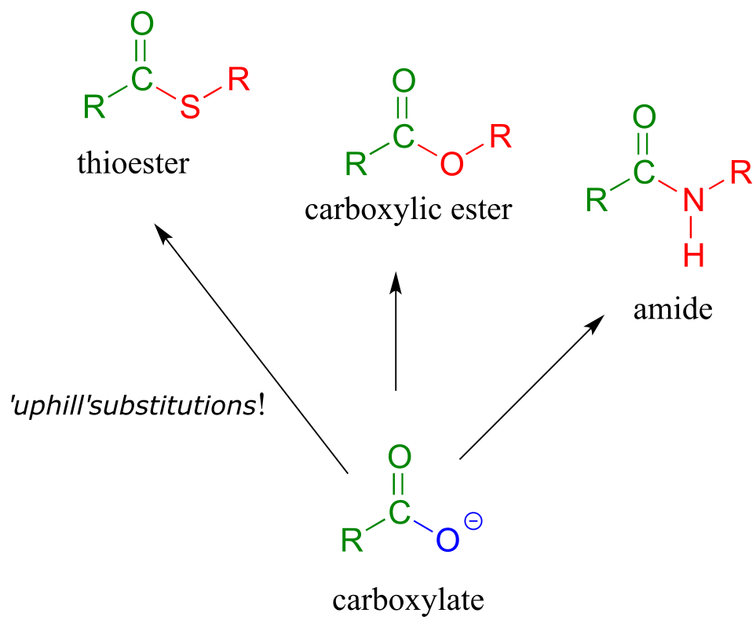

fig 16

How are these uphill substitutions accomplished? They are not carried
out directly:

like all thermodynamically unfavorable reactions in biochemistry, they
are linked to an energy-releasing, 'downhill' reaction. In this case,
(and many others), the linked reaction that 'pays for' the uphill
reaction is hydrolysis of ATP.

*In order to undergo an acyl substitution reaction, a carboxylate must
first be activated by phosphorylation.* You are already familiar with
this phosphoryl group transfer process from chapter 9.

In many cases, enzymes activate a carboxylate group by converting it to
an acyl phosphate (the most reactive of the carboxylic acid
derivatives), at the expense of an ATP: the mechanism for this type of
transformation is shown in Section 9.5.

Formation of an acyl phosphate (see section 9.5 for the complete
mechanism):

fig 18a

As a common alternative, some enzymatic reactions begin with the
conversion of a carboxylate to an acyl-AMP intermediate:

Formation of an acyl -AMP (see section 9.5 for the complete mechanism):

fig 19a

In either case, once the carboxylate group has been activated, the
reactive acyl phosphate/acyl-AMP intermediate can go on to act as the
electrophile in an energetically favorable nucleophilic acyl
substitution reaction.

fig 19b

You have probably heard ATP referred to as the 'energy currency'
molecule. The reactions in this section provide a more concrete
illustration of that concept. A lower-energy group (a carboxylate) is
converted to a higher-energy group (a thioester, for example) by
'spending' a high-energy ATP.

## Section 11.5: Formation of thioesters, carboxylic esters, and amides

### 11.5A: Thioester formation

Thioesters, which are themselves quite reactive in acyl substitution
reactions (but less so than acyl phosphates), play a crucial role in the
metabolism of fatty acids The ‘acyl X group’ in a thioester is a thiol.

**Coenzyme A** is a thiol-containing coenzyme that plays a key role in
metabolism. Coenzyme A is often abbreviated 'HSCoA' in order to
emphasize the importance of the thiol functionality.

fig 22

Coenzyme A serves as a 'carrier' group in lipid biosynthesis, and is
attached by a thioester linkage to growing fatty acid chains. Palmityl
is shown below as an example of a typical fatty acyl-CoA thioester.

fig 23

As we look at reactions involving thioesters in this and future
sections, we will frequently see Coenzyme A playing a key role. We will
also see the formation and breaking of thioester linkages between an
acyl group and other thiol-containing species, such as a cysteine
residue on the enzyme:

fig 24

The term 'thioesterification' refers to the formation of a thioester
functional group. In a typical biochemical thioesterification reaction,
a carboxylate is first converted into an acyl phosphate (in other words,
it is activated), then the acyl phosphate undergoes an acyl substitution
reaction with a thiol nucleophile.

Thioesterification reaction:

Mechanism:

activation phase:

acyl substitution phase:

fig 25

Fatty acids such as palmitate , from fats and oils in your food, are
converted to a coenzyme A thioester prior to being broken down by the
fatty acid degradation pathway.

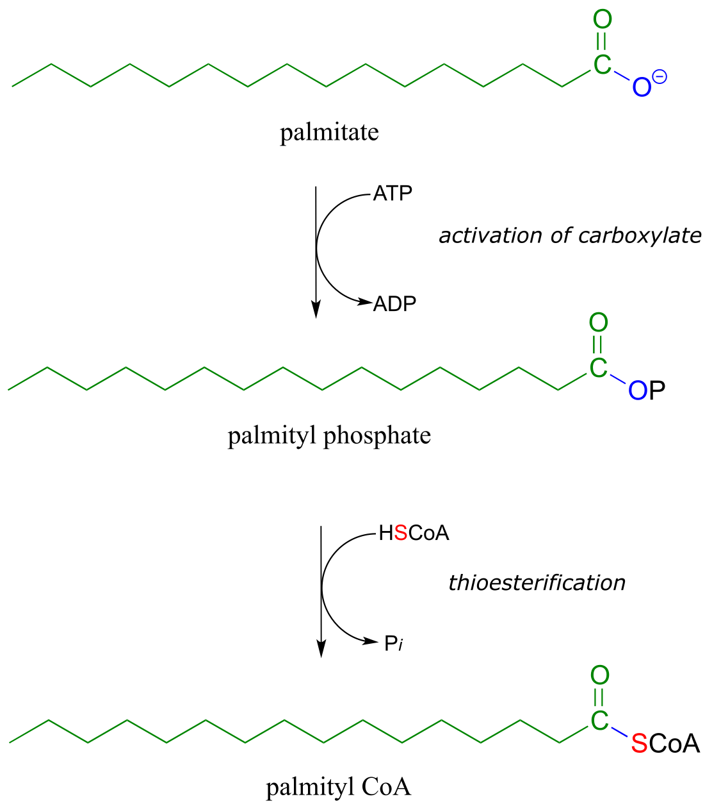

fig 27

A **transthioesterification** reaction is a thioester to thioester
conversion - in other words, an acyl group is transferred from one thiol
to another.

Transthioesterification:

Mechanism:

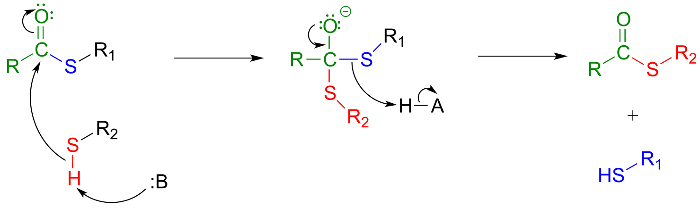

fig 28

For example, when your body synthesizes fatty acids, the two-carbon
fatty acid 'building block' acetyl CoA is first converted to acetyl
**ACP** (EC 2.3.1.38). ACP is an abbreviation for **'Acyl Carrier
Protein'**, a modified protein with a thiol-containing prosthetic group
attached to one of its serine side chains. Throughout the fatty acid
chain elongation process, the growing hydrocarbon chain remains linked
to ACP.

fig 29

> <u>Exercise 11.5</u>: The pyruvate dehydrogenase complex (EC 1.2.4.1)
> catalyzes one of the most central of all central metabolism reactions,
> the conversion of pyruvate to acetyl-CoA, which links the gycolytic
> pathway to the citric acid (Krebs) cycle. The reaction is quite
> complex, and we are not yet equipped to follow it through from start
> to finish (we will finally be ready to do this in section 17.3). The
> final step, however, we can understand: it is a
> transthioesterification, involving a dithiol coenzyme called
> dihydrolipoamide and coenzyme A. Given the information below, draw out
> a reasonable mechanism for the reaction.
>
>  style="width:3.51111in;height:0.86667in" />
>
> fig 31
>
> <u>Exercise 11.6:</u> Ubiquitin is a protein which plays a key role in
> many cellular processes by reversibly attaching to other proteins,
> thus altering or regulating their function. Recently, a team of
> researchers uncovered details of the mechanism by which ubiquitin
> (abbreviated Ub) is transferred by the ubiquitin activating enzyme
> (abbreviated E1) to target proteins. In the first part of this
> process, the carboxy terminus of ubiquitin is linked to a cysteine
> side chain on E1, as shown in the incomplete reaction sequence below.
> Complete the figure by drawing the structures of species A and B.
>
> 
>
> fig 31b

### 11.5B: Formation of esters

**Esterification** refers to the formation of a new ester functional
group.

In a typical biochemical esterification, a thioester is subjected to
nucleophilic attack from an alcohol, leading to the formation of an
ester and a thiol.

Esterification reaction (from thioester):

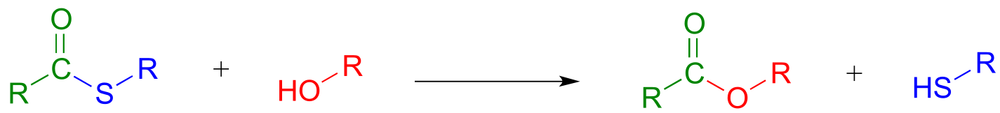

Mechanism:

fig 32

The reaction below is from the synthesis of triacylglycerol, the form in
which fat is stored in our bodies.

Phase 1 (transthioesterification):

Phase 2 (esterification):

fig 33

The reaction, catalyzed by monoacylglycerol acyltransferase (EC
2.3.1.22), begins (phase 1 above) with a preliminary
transthioesterification step in which the fatty acyl group is
transferred from coenzyme A to a cysteine residue in the active site of
the enzyme. Recall that it is a common strategy for enzymes to first
form a covalent link to one substrate before catalyzing the 'main'
chemical reaction.

In phase 2 of the reaction, the fatty acyl group is now ready to be
transferred to glycerol, trading its thioester linkage to the cysteine
for a new ester linkage to one of the alcohol groups on glycerol.

An esterification reaction has tremendous importance in the history of
drug development, a story that we heard in the introduction to this
chapter. The discovery of **penicillin** was arguably one of the most
important events in the history of modern medicine. The key functional
group in penicillin is the four-membered lactam (recall that a lactam is
a cyclic amide).

fig 42

Penicillin, and later generations of antibiotic drugs, have saved
countless lives from once-deadly bacterial infections. The elucidation
of the chemical mechanism of penicillin action was also a milestone in
our developing understanding of how drugs function on a molecular level.
We now know that penicillin, and closely related drugs such as
ampicillin and amoxycillin, work by inhibiting an enzyme that is
involved in the construction of the peptide component bacterial cell
walls. The details of the wall-building reaction itself are outside the
scope of this discussion, but it is enough to know that the process
involves the participation of a nucleophilic serine residue in the
active site of the enzyme. The penicillin molecule is able to enter the
active site, and once inside, the lactam group serves as an
electrophilic 'bait' for the nucleophilic serine:

fig 43

Although you might expect that an amide-to-ester conversion such as what
is shown above would be energetically unfavorable based on the
reactivity trends we have learned, this lactam is in fact much more
reactive than an ordinary amide group due to the effect of ring strain:
recall from section 3.2 that four-membered rings are highly strained,
and considerable energy is released when they are opened.

Ring strain also accounts for why penicillin has a tendency to degrade:
when in contact with water, the lactam will spontaneously hydrolyze over
time, which opens the ring and forms a carboxylate group.

Unfortunately, many strains of bacteria have acquired an enzyme called
**β-lactamase** (EC 3.5.2.6), that catalyzes rapid hydrolysis of the
lactam ring in penicillin-based drugs, rendering them inactive. These
bacteria are consequently resistant to penicillin and related
antibiotics. As you are probably aware, the evolution of drug resistance
in bacteria is a major, world-wide health problem, and scientists are
engaged in a constant battle to develop new antibiotics as the older
ones become less and less effective.

In a **transesterification** reaction, one ester is converted into
another by an acyl substitution reaction.

Mechanism for a transesterification reaction:

fig 34

If studying organic chemistry sometimes gives you a headache, you might
want to turn to a transesterification reaction for help. Prostaglandins
are a family of molecules that promote a wide range of biological
processes, including inflammation. Acetylsalicylic acid, commonly known
as aspirin, acts by transferring - through a transesterification
reaction - an acetyl group to a serine residue on the enzyme responsible
for the biosynthesis of prostaglandin H2 (one member of the
prostaglandin family).

fig 35

Acetylation of this serine blocks a channel leading to the active site,
effectively shutting down the enzyme, impeding prostaglandin production,
and inhibiting the inflammation process that causes headaches.

In section 11.8, we will see two laboratory acyl substitution reactions
that lead to the formation of aspirin and ibuprofen.

<u>Exercise 11.7</u>: Discuss the key structural feature of aspirin that
makes it so effective at transferring its acetyl group - in other words,
why is the ester group in aspirin more reactive than a typical ester?

<u>  
</u>

### 11.5C: Amide formation

An activated carboxylate group (in other words, acyl phosphate or
acyl-AMP) can be converted to an amide through nucleophilic attack by an
amine.

Mechanism for amide formation:

fig 18

The amino acid biosynthesis pathways provide examples of amide formation
in biology. The amino acid glutamine is synthesized in most species by
converting the carboxylate side chain of glutamate (another amino acid)
to an amide, after first activating the carboxylate by
monophosphorylation: (EC 6.3.1.2)

fig 20

A similar process takes place in the synthesis of asparagine from
aspartate, except that the activated carboxylate in this case is an
acyl-AMP:

fig 21

*\*In the asparagine synthesis reaction, the ammonia nucleophile
actually comes from hydrolysis of a glutamine molecule.*

<u>Exercise 11.8</u>: A enzyme in bacteria is thought to be responsible
for resistance to a class of antibiotics that includes apramycin,
ribostamycin and paromomycin. The enzyme catalyzes acetylation of the
antibiotic compound with acetyl-CoA as an additional substrate. The
structure of acetylated apramycin is shown below.

fig 21a

> a\) Identify the acetyl group that has been transferred to apramycin,
> (and thus inactivating it).
>
> b\) What functional group acts as an acetyl group *donor*? What
> functional group acts as an acetyl group?
>
> c\) What is the coproduct of the reaction?

## Section 11.6: Hydrolysis of thioesters, esters, and amides

So far we have been looking at the *formation* of thioesters, carboxylic
esters, and amides, starting from carboxylates. In hydrolytic acyl
substitution reactions, nucleophilic water is the incoming nucleophile
and a carboxylate group is the final product. Because carboxylates are
the least reactive among the carboxylic acid derivatives, these
hydrolysis reactions are thermodynamically favorable, with thioester
hydrolysis the most favorable of the three.

Thioester, carboxylic ester, and amide hydrolysis:

Mechanism:

fig 37

In the citric acid (Krebs) cycle, (*S*)-citryl CoA is hydrolyzed to
citrate (EC 2.3.3.8):

fig 38

**Acetylcholinesterase** (EC 3.1.1.7), an enzyme present in the synapse,
catalyzes hydrolysis of the ester group in acetylcholine, a
neurotransmitter that triggers muscle contraction.

(fig 39)

Like many other hydrolytic enzymes, the acetylcholinesterase reaction
proceeds in two phases: first, a covalent enzyme-substrate intermediate
is formed when the acyl group of acetylcholine is transferred to an
active-site serine on the enzyme (a transesterification reaction). A
water nucleophile then attacks this ester, driving off acetate and
completing the hydrolysis.

<u>Exercise 11.9</u>: Based on the above description, draw the structure
of the covalent enzyme-substrate intermediate in the
acetylcholinesterase reaction.

If the action of acetylcholinesterase is inhibited, acetylcholine in the
synapse does not get hydrolyzed and thus accumulates, resulting in
paralysis and death in severe cases. **Sarin** nerve gas is a potent
inhibitor of acetylcholinasterase action. Some victims of the Tokyo
subway sarin attack in 1995 who were exposed to low levels of the gas
reported that they initially realized that something was wrong when they
noticed how dark everything seemed around them. This was due to
uncontrolled contraction of their pupils. You will be invited to
consider the mechanism of inhibition by sarin in problem 11.12.

Peptide (amide) bonds in proteins and polypeptides are subject to
spontaneous (nonenzymatic) hydrolysis in water.

fig 40

Although this amide to carboxylate conversion is *thermodynamically* a
downhill reaction, peptide bonds are *kinetically* very stable (they
react slowly) at neutral pH. In fact, the half-life for uncatalyzed
hydrolysis of a peptide bond in pH 7 water is by some estimates as high
as 1000 years. (*Ann. Rev. Biochem*. **2011**, *80*, 645.)

The stability of peptides bonds makes good physiological sense: we would
all be in trouble if our enzymes, receptors, and structural proteins
were hydrolyzing away while we slept! That being said, it is also true
that *controlled, specific* hydrolysis of peptide bonds, catalyzed by a
large, diverse class of enzymes called **proteases**, is a critical
biochemical reaction type that can occur very rapidly, in many different
biological contexts. For example, many proteins only become active after
they have been ‘processed' - in other words, hydrolyzed at a specific
amino acid location by a specific protease.

Although all proteases catalyze essentially the same reaction – amide
hydrolysis - different protease subfamilies have evolved different
catalytic strategies to accomplish the same result. **HIV protease** is
the target of some the most recently-developed anti-HIV drugs. It plays
a critical role in the life cycle if the HIV virus, hydrolyzing specific
peptide bonds of essential viral proteins in order to convert them to
their active forms. HIV protease is a member of the **aspartyl
protease** subfamily, so-named because of the two aspartate residues
located in the active sites of these enzymes. HIV protease is also, as
you are probably aware, the target of **HIV protease inhibitor** drugs,
which are a component of the most effective treatment currently
available for HIV infection.

In HIV protease and other aspartyl proteases, the two enzymatic
aspartates residues (shaded grey and abbreviated 'Asp1' and
'Asp2 'in the figure below) work in concert to activate the
electrophile, nucleophile, and leaving group in the reaction.

fig 41

Exactly how this works is a subject of some debate and the details may
well vary according to the enzyme in question, but one likely mechanism
is illustrated in the figure above, where Asp1, which is
initially in its protonated form, contributes a hydrogen bond to draw
electron density away from the carbonyl carbon, making it more
electrophilic. At the same time, Asp2, which begins the
reaction cycle in its anionic form, deprotonates the water molecule to
make it more nucelophilic. In step 2, Asp2 donates a proton
back to the nitrogen, making it a better leaving group.

HIV protease inhibitors shut down this reaction, which prevents the
virus from processing the proteins that it uses to bond to host cells.

[Animation of HIV protease and
inhibitors](https://www.youtube.com/watch?v=dDo_s6a3wcM&list=UUBkuiMC1rIybuTcyMK-jWKw&index=7)

<u>Exercise 11.10</u>**:** Lactonase (EC 3.1.1.17), the second enzyme in
the oxidative branch of the pentose phosphate pathway, catalyzes
hydrolysis of the lactone (cyclic ester) group in
6-phosphogluconolactone. Draw the structure of 6-phosphogluconate, the
product of this reaction.

fig 41a

<u>Exercise 11.11</u>: Draw the product of the β-lactamase-catalyzed
hydrolysis of penicillin as described in section 11.6.

<u>Exercise 11.12</u>: What is the missing product (designated below by
question marks) in the reaction below, which is part of degradation
pathway for the amino acid tryptophan? How could you describe this
reaction in organic chemistry terminology?

fig 41b

## Section 11.7: Protein synthesis on the ribosome

Recall from section 1.3D that the 'peptide bonds' which link amino acids
to form polypeptides and proteins are in fact amide functional groups.
The figure below shows the first four amino acid residues in a protein,
starting at the amino terminus.

fig 56

Let’s take a look at the chemistry behind the formation of a new peptide
bond between the first two amino acids - which we will call aa-1 and
aa-2 - in a growing protein molecule. This process takes place on the
ribosome, which is essentially a large biochemical 'factory' in the
cell, composed up of many enzymes and RNA molecules, and dedicated to
the assembly of proteins. You will learn more in a biochemistry or cell
biology course about the complex but fascinating process of ribosomal
protein synthesis. For now, we will concentrate on the enzyme-catalyzed
organic transformation that is taking place: the formation of an amide
from a carboxylate and an amine.

We have seen amide-forming reactions before – think back to the
glutamine and asparagine synthetase reactions (section 11.5C). The same
ideas that we learned for those reactions hold true for peptide bond
formation: the carboxylate group on a substrate amino acid must first be
activated, and the energy for this activation comes from ATP.

The carboxylate group of aa-1 is first transformed to an acyl-AMP
intermediate through a nucleophilic substitution reaction at the
α-phosphate of ATP.

fig 57

In the next step, the amino acid is transferred to a special kind of RNA
polymer called transfer RNA, or tRNA for short. We need not concern
ourselves here with the structure of tRNA molecules- all we need to know
for now is that the nucleophile in this reaction is a hydroxyl group on
the terminal adenosine of a tRNA molecule. Because this tRNA molecule is
specific to aa-1, we will call it tRNA-1

fig 58

The incoming nucleophile is an alcohol, thus what we are seeing is an
esterification: an acyl substitution reaction between the activated
carboxylate of aa-1 and an alcohol on tRNA-1 to form an ester.

fig 59

This reaction, starting with activation of the amino acid, is catalyzed
by a class of enzymes called **aminoacyl-tRNA synthetases** (there are
many such enzymes in the cell, each one recognizing its own amino acid -
tRNA pair).

The first amino acid is now linked via an ester group to tRNA-1. The
actual peptide bond-forming reaction occurs when a second amino acid
(aa-2) also linked to its own tRNA-2 molecule, is positioned next to the
first amino acid on the ribosome. In another acyl substitution reaction,
catalyzed by an enzymatic component of the ribosome called **peptidyl
transferase** (EC 2.3.2.12), the amino group on aa-2 displaces tRNA1:
thus, an ester has been converted to an amide (thermodynamically
downhill, so ATP is not required).

fig 60

This process continues on the ribosome, as one amino acid after another
is added to the growing protein chain:

fig 61

When a genetically-coded signal indicates that the chain is complete, an
*ester hydrolysis* reaction – as opposed to another amide formation -
occurs on the last amino acid, which we will call aa-*n*. This reaction
is catalyzed by proteins called **release factors** (RFs).

fig 62

This hydrolysis event frees the mature protein from the ribosome, and
results in the formation of a free carboxylate group at the end of the
protein (this is called the carboxy-terminus, or *C*-terminus of the
protein, while the other end – the ‘starting’ end – is called the
*N*-terminus).

## Section 11.8: Nucleophilic substitution at activated amides and carbamides

In discussing the nucleophilic acyl substitution reactions of acyl
phosphates, thioesters, esters, and amides, we have seen many slight
variations on one overarching mechanistic theme. Let’s now look at a
reaction that can be thought of as a ‘cousin’ of the nucleophilic acyl
substitution, one that follows the same general pattern but differs in
several details. Below is a generic illustration of this reaction type:

fig 62a

Looking at this reaction, you can see that substitution is occurring at
an amide group, but the atom that gets expelled is the amide *oxygen*
rather than the amide nitrogen. Also, we see that the substituting
nucleophile is an amine, and the product is a functional group referred
to as an **amidinium** ion (the uncharged conjugate base is called an
**amidine**, and the pKa of the group is close enough to 7 that it can
be shown in either protonated or deprotonated form in a biological
context). As we learned previously in this chapter, amides are
comparatively stable to nucleophilic substitution, and thus it stands to
reason that the starting amide must be *activated* before the reaction
can take place. This occurs, as you might predict, through the formation
of an acyl phosphate intermediate at the expense of one ATP molecule.
The amide *oxygen* acts as a nucleophile, attacking the α-phosphate of
ATP to form the activated acyl-AMP intermediate:

Substitution at an activated amide, phase 1 (activation):

fig 62b

Next, a kind of acyl substitution occurs that we have not yet seen: an
amine nitrogen attacks the electrophilic carbon of a carbon-*nitrogen*
double bond, and the reaction proceeds through a tetrahedral
intermediate before the AMP group is expelled, taking with it what was
originally the carbonyl oxygen of the starting amide.

Substitution at an activated amide, phase 2:

fig 62c

**Carbamides**, a kind of 'double amide' functional group in which a
carbonyl oxygen is bonded to *two* nitrogens, also undergo this type of
reaction, leading to the formation of a **guanidinium/gaunidine**
functional group (look again at the structure of the amino acid
[arginine](http://www.sigmaaldrich.com/content/dam/sigma-aldrich/structure4/054/mfcd00002635.eps/_jcr_content/renditions/mfcd00002635-medium.png)
and you will see that it contains a guanidinium group on the side
chain).

The reaction catalyzed by argininosuccinate synthetase (EC 6.3.4.5) is
the second step in the urea cycle, a four-step series of reactions in
which ammonia is converted into urea for elimination in urine. Note that
the substitution takes place at the carbamide group of citrulline, the
nucleophilic amine is on aspartate, and the product has a guanidinium
functional group.

<u>Exercise 11.13</u>

a\) Draw the structure of the 'activated carbamide' intermediate in the
reaction above.

b\) Draw the structure of the cyclic product of a *hypothetical*
intramolecular substitution reaction of citrulline (ie. aspartate is not
involved).

## Section 11.9: Nucleophilic acyl substitution reactions in the lab

All of the biological nucleophilic acyl substitution reactions we have
seen so far have counterparts in laboratory organic synthesis.
Mechanistically, one of the biggest differences between the biological
and the lab versions is that the lab reactions usually are run with a
strong acid or base as a catalyst, whereas biological reactions are of
course taking place at physiological pH. When proposing mechanisms,
then, care must be taken to draw intermediates in their reasonable
protonation states: for example, a hydronium ion
(H3O+) intermediate is reasonable to propose in an
acidic reaction, but a hydroxide (OH-) intermediate is not.

<u>  
</u>

### 11.9A: Ester reactions - bananas, soap and biodiesel 

Acid-catalyzed synthesis of flavor compounds such as isopentyl acetate
(an ester with the flavor of banana) is simple to carry out in the lab.
In this esterification reaction, acetic acid is combined with isopentyl
alcohol along with a catalytic amount of sulfuric acid.

Acid-catalyzed esterification (laboratory reaction):

Mechanism:

fig 46

The carbonyl oxygen of acetic acid is first protonated (step 1), which
draws electron density away from the carbon and increases its
electrophilicity. In step 2, the alcohol nucleophile attacks: notice
that under acidic conditions, the nucleophile is not deprotonated
simultaneously as it attacks (as we would show in a biochemical
mechanism), and the tetrahedral intermediate is a cation rather than an
anion. In step 3, a proton is transferred from one oxygen atom to
another, creating a good leaving group (water) which is expelled in step
4. Finally (step 5), the carbonyl oxygen on the ester is deprotonated,
regenerating the catalytic acid.

This reaction is highly reversible, because carboxylic acids are
approximately as reactive as esters. In order to obtain good yields of
the ester, an excess of acetic acid can be used, which by Le Chatelier's
principle (see your General Chemistry textbook for a review) shifts the
equilibrium toward the ester product.

**Saponification** is a common term for base-induced hydrolysis of an
ester. For example, methyl benzoate will hydrolize to benzoate and
methanol when added to water with a catalytic amount of sodium
hydroxide.

Mechanism of base-catalyzed ester hydrolysis (saponification):

fig 47

Addition of the base provides hydroxide ion to act as a nucleophile
(hydroxide is of course a better nucleophile than water) in step 1. The
tetrahedral intermediate (anionic in this case, because the reaction
conditions are basic) then collapses in step 2, and the alkoxide
(CH3O-) leaves. We are not used to seeing
alkoxides or hydroxides as leaving groups in biochemical reactions,
because they are strong bases - but in a basic solution, this is a
reasonable chemical step. Step 3 is simply an acid-base reaction between
the carboxylic acid and the alkoxide. Note that this is referred to as
base-*induced* rather than base-catalyzed because hydroxide is not
regenerated, and thus a full molar equivalent of base must be used.

The saponification process derives its name from the ancient craft of
soap-making, in which the ester groups of triacylglycerols in animal
fats are hydrolized under basic conditions to glycerol and fatty acyl
anions (see section 2.5A for a reminder of how fatty acyl anions work as
soap).

fig 48

We learned earlier about transesterification reactions in the context of
the chemical mechanism of aspirin. Transesterification also plays a key
role in a technology that is already an important component in the
overall effort to develop environmentally friendly, renewable energy
sources: biodeisel. You may have heard stories about people running
their cars on biodeisel from used french fry oil. To make biodeisel,
triacylglycerols in fats and oils can be transesterified with methanol
or ethanol under basic conditions. The fatty acyl methyl and ethyl ester
products are viable motor fuels.

> fig 36

<u>Exercise 11.14</u>: Draw structures of the carboxylic acid and
alcohol starting materials that could be used to synthesize the fragrant
fruit esters shown in section 11.1.

<u>Exercise 11.15</u>: What would happen if you tried to synthesize
isopentyl acetate (banana oil) with basic rather than acidic conditions?
Would this work?

<u>Exercise 11.16</u>: Consider the reverse direction of the
acid-catalyzed esterification reaction. What would you call this
reaction in organic chemistry terms?

<u>Exercise 11.17</u>: An alternative way to synthesize esters is to
start with a carboxylate and an alkyl halide. Draw a mechanism for such
a synthesis of methyl benzoate - what type of reaction mechanism is
this?

### 11.9B: Acid chlorides and acid anhydrides

In the cell, acyl phosphates and thioesters are the most reactive of the
carboxylic acid derivatives. In the organic synthesis lab, their
counterparts are acid chlorides and acid anhydrides, respectively. Of
the two, acid chlorides are the more reactive, because the chloride ion
is a weaker base and better leaving group than the carboxylate ion (the
pKa of HCl is -7, while that of carboxylic acids is about 4.5: remember,
a stronger conjugate acid means a weaker conjugate base).

Acid chlorides can be prepared from carboxylic acids using
SOCl2:

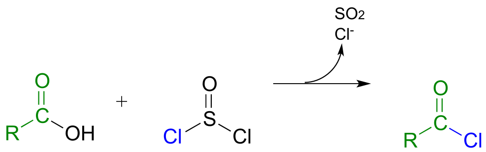

fig 49

Acid anhydrides can be prepared from carboxylic acids and an acid
chloride under basic conditions:

fig 50

Acetic anhydride is often used to prepare acetate esters and amides from
alcohols and amines, respectively. The synthesis of aspirin and
acetaminophen are examples:

fig 51

A carboxylic acid cannot be *directly* converted into an amide because
the amine nucleophile would simply act as a base and deprotonate the
carboxylic acid:

fig 52

Instead, the carboxylic acid is first converted to an acid chloride (in
other words, the carboxylic acid is *activated*), then the acid chloride
is combined with an amine to make the amide.

fig 53

This sequence of reactions is a direct parallel to the biochemical
glutamine and asparagine synthase reactions we saw earlier in the
chapter (section 11.5A), except that the activated form of carboxylic
acid is an acid chloride instead of an acyl phosphate or acyl-AMP.

<u>Exercise 11.18</u>: For the preparation of the amide below, show a
starting carboxylate and amine and the intermediate acid chloride
species.

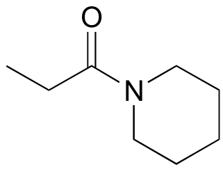

### 11.9C: Polyesters and polyamides

If you have ever had the misfortune of undergoing surgery or having to
be stitched up after a bad cut, it is likely that you benefited from our
increasing understanding of polymers and carboxylic ester chemistry.
Polyglycolic acid is a material commonly used to make dissolving
sutures. It is a **polyester** - a polymer linked together by ester
groups - and is formed from successive acyl substitution reactions
between the alcohol group on one end of a glycolic acid monomer and the
carboxylic acid group on a second:

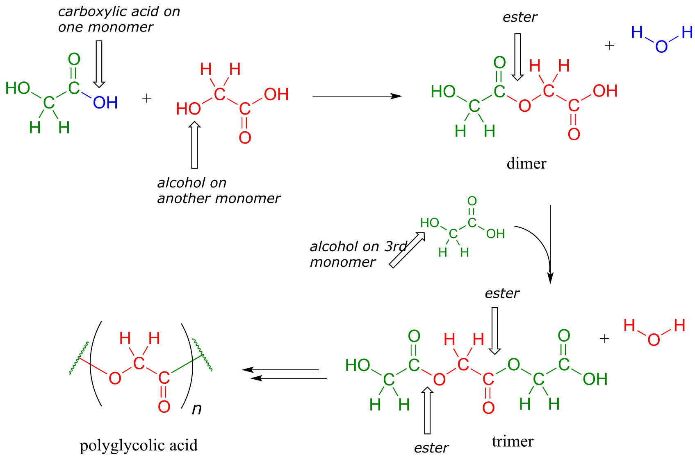

fig 44

The resulting polymer - in which each strand is generally several
hundred to a few thousand monomers long - is strong, flexible, and not
irritating to body tissues. It is not, however, permanent: the ester
groups are reactive to gradual, spontaneous hydrolysis at physiological
pH, which means that the threads will dissolve naturally over several
weeks, eliminating the need for them to be cut out by a doctor.

<u>Exercise 11.19</u>: Dacron, a polyester used in clothing fiber, is
made of *alternating* dimethyl terephthalate and ethylene glycol
monomers.

fig 54

a\) Draw the structure of a Dacron tetramer (in other words, four
monomers linked together).

b\) Water is a side product of glycolic acid polymerization. What is the
equivalent side product in Dacron production?

<u>Exercise 11.20</u>: Nylon 6,6 is a widely used poly***amide***
composed of alternating monomers. Nylon 6,6 has the structure shown
below -the region within the parentheses is the repeating unit, with
'*n'* indicating a large number of repeats. Identify the two monomeric
compounds used to make the polymer.

fig 55

### 11.9D: The Gabriel synthesis of primary amines

The Gabriel synthesis, named after the 19th-century German chemist
Siegmund Gabriel, is a useful way to convert alkyl halides to amines and
another example of SN2 and acyl substitution steps in the
laboratory. The nitrogen in the newly introduced amine group comes from
phthalimide. In the first step of the reaction, phthalimide is
deprotonated by hydroxide, then in step 2 it acts as a nucleophile to
displace a halide in an SN2 reaction (phthalimide is not a
very powerful nucleophile, so this reaction works only with unhindered
primary or methyl halides).

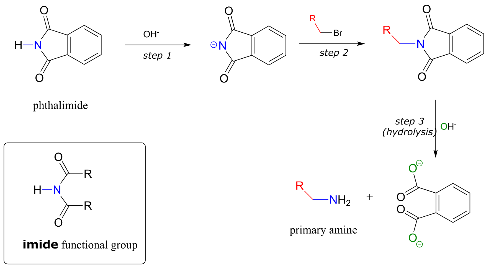

fig 55a

Step 3 is simply a pair of hydrolytic acyl substitution steps to release
the primary amine, with an aromatic dicarboxylate by-product.

<u>Exercise 11.21</u>: Phthalimide contains an 'imide' functional group,
and has a pKa of approximately 10. What makes the imide group so much
more acidic than an amide, which has a pKa of approximately 17?

As an alternative procedure, release of the amine in step 3 can be
carried out with hydrazine (H2NNH2) instead of
hydroxide. Again, this occurs through two nucleophilic acyl substitution
reactions.

fig 55b

In 2000, chemists at MIT synthesizing a porphyrin-containing molecule
introduced two amine groups using the Gabriel synthesis with hydrazine.
Porphyrins, which include the 'heme' in our red blood cells, are an
important family of biomolecules with a variety of biochemical function
(*J. Org. Chem*. **2000**, *65*, 5298).

fig 55c

## Section 11.10: A look ahead - acyl substitution reactions with a carbon or hydride nucleophile

Although we have seen many different types of nucleophilic acyl
substitutions in this chapter, we have not yet encountered a reaction in
which the incoming nucleophile is a carbanion or a hydride. Recall that
in the previous chapter on aldehydes and ketones, we also postponed
discussion of nucleophilic carbonyl addition reactions in which a
carbanion or a hydride is the nucleophile. The reason for putting off
these discussions is that these topics are both important and diverse
enough to warrant their own dedicated chapters.

In the next chapter, we will see many carbonyl addition and acyl
substitution reactions where the nucleophilic species is a
resonance-stabilized *carbanion* such as an enolate (section 7.6B). Then
in chapter 14, we will encounter nucleophilic addition and acyl
substitution reactions in which a *hydride ion* (H-)
essentially plays the part of a nucleophile. In these chapters we will
see how nucleophilic carbanion and hydride species are generated in a
biochemical context. For now, see if you can predict the result of the
following biochemical reactions.

<u>Exercise 11.22</u>: Predict the products of the following
nucleophilic acyl substitution reactions, both of which are part of the
biosynthesis of isoprenoid compounds such as cholesterol and lycopene:

a\) acetoacetyl CoA acetyltransferase reaction (enolate nucleophile)

(Fig 24)

b\) HMG-CoA reductase reaction (to repeat, the nucleophile here is not
*literally* an isolated hydride ion, which would be a very unlikely
species in a physiological environment. We will learn in chapter 16 what
is actually going on, but for the time being, just predict the result of
an acyl substitution reaction with a "hydride ion" nucleophile.)

fig 45

## Key concepts to review

Be able to recognize and draw examples of carboxylic acid derivative
functional groups:

carboxylic acids/carboxylates

acyl phosphates (both acyl monophosphate and acyl-AMP)

thioesters

esters

amides

acid chlorides

carboxylic acid anhydrides

Know the meaning of the terms 'acyl', 'acetyl', 'formyl', 'lactone', and
'lactam'.

You need not memorize the structure of coenzyme A, but you should
recognize that it contains a key thiol group and often forms thioester
linkages, particularly in fatty acid metabolism.

Understand what happens in a nucleophilic acyl substitution (also called
acyl transfer reaction), and be able to draw mechanistic arrows for a
generalized example.

Know the trends in relative reactivity for the carboxylic acid
derivatives:

> in a biological context (acyl phosphates and thioesters as activated
> acyl groups)
>
> in a laboratory context (acid chlorides and carboxylic acid anhydrides
> as activated acyl groups)

Recognize and understand the most important types of nucleophilic acyl
substitution reactions in biology:

> How a carboxylate group, which is unreactive to nucleophilic acyl
> substitution reactions, is activated in the cell by ATP-dependent
> phosphorylation to either acyl monophosphate or acyl-AMP.
>
> Conversion of an acyl phosphate to a thioester, a (carboxylic) ester,
> or an amide.
>
> Transthioesterification, esterification, and transesterification
> reactions.
>
> Conversion of a thioester or ester to an amide
>
> Hydrolysis of a thioester, a (carboxylic) ester, or an amide to a
> carboxylate.

Understand the energetics of the above reactions:

> Carboxylate to acyl phosphate is 'uphill' energetically, paid for by
> coupling to hydrolysis of one ATP
>
> Other conversions above are 'downhill': it is unlikely, for example,
> to see a direct conversion of an amide to an ester.
>
> (Notable exception: the lactam (cyclic amide) group in penicillin is
> very reactive due to ring strain, and forms an ester with an active
> site serine residue in the target protein)

You need not memorize all of the details of peptide bond formation on
the ribosome, but you should be able to follow the description in
section 7 and recognize the nucleophilic acyl substitution reactions
that are occuring.

Be able to draw complete mechanisms for the following lab reactions:

acid-catalyzed esterification of a carboxylic acid

> saponification (base-catalyzed hydrolysis of an ester), application to
> soap-making

base-catalyzed transesterification, application to biodiesel production

Understand how acid chlorides and carboxylic acid anhydrides serve as
activated acyl groups in laboratory synthesis. Be able to describe how
an amide to ester conversion could be carried out in the laboratory.

Understand how polyesters and polyamides are formed. Given the structure
of a polymer be able to identify monomer(s), and vice-versa.

Be able to recognize, predict products of, and draw mechanisms for the
Gabriel synthesis of primary amines, using either hydroxide ion or
hydrazine to release the amine product.

## Problems

**P11.1**: Here is some practice in recognizing carboxylic acid
derivative functional groups in large, complex biological molecules.
There are seven amide and four ester groups in the molecules below - see
if you can find them all.

**P11.2**: (EC 6.3.4.16)

a\) Predict the structures of intermediate compounds A, B, and C in the
reaction below (EC 6.3.4.16). Compound C contains an activated
carboxylate functionality. Use abbreviations as appropriate.

b\) Draw a reasonable mechanism for the A to B step

**P11.3:** Imagine that acetylcholine is combined with
acetylcholinesterase (section 11.6) in a buffer made from
18O-labeled water. Where would you expect to find the
18O label in the products?

**P11.4**: Predict the products of this hydrolysis reaction (EC
3.5.1.18):

**P11.5:** The breakdown of fat in our bodies begins with the action of
lipase enzymes, which catalyze the cleavage of fatty acids from the
glycerol backbone of triacylglycerol (see section 1.3A for a reminder of
the structure of triacylglycerol). A serine residue in the lipase active
site plays a key nucleophilic role in the reaction. Draw the *single
mechanistic step* in which the covalent link between a fatty acid and
the glyceryl backbone is broken, using curved arrow notation and
appropriate abbreviation.

**P11.6**: Before long-chain fatty acids are transported across the
inner mitochondrial membrane, they are temporarily transferred from
Coenzyme A to a transport molecule called carnitine, to which they are
linked by an ester group (EC 2.3.1.21).

> 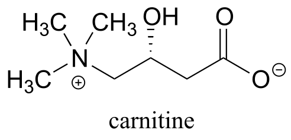 style="width:1.65556in;height:0.81111in" />

Draw the structure of fatty acyl carnitine (use R to denote the
hydrocarbon chain of the fatty acid)

**P11.7:** Below is a reaction from carbohydrate metabolism (EC
2.3.1.157). Identify the compound designated with a question mark.

**P11.8**: Propose the most likely enzymatic hydrolysis product of the
substrate below (hint - think about electrophilicity when considering
regiochemical outcomes!) (EC 3.5.2.2) J. Biol. Chem. 2006, 281, 13762
scheme 2)

**P11.9:** The coenzyme tetrahydrofolate (THF) participates in
single-carbon transfer reactions. One derivative of THF, called
10-formyl-THF (abbreviated structure shown below), transfers a formyl
group early in purine ribonucleotide biosynthesis to glycinamide
ribonucleotide.

Draw a nucleophilic attack step for this reaction (assume that acyl
transfer between the two substrates is direct, without any covalent
enzyme-substrate intermediates being formed).

**P11.10**: One of the key steps in the biosynthesis of purine
nucleotides (guanosine and adenosine) in archaea is shown below.

Identify the missing compounds X and Y in the figure above, and draw the
structure of an acyl phosphate intermediate.

**P11.11**: The reactions below are part of nucleotide biosynthesis.
Predict the structures of compounds A and B. Compound A contains a
carboxylate group, and the reaction that forms compound B is of the type
discussed in section 11.8, in which an amine group substitutes at an
activated amide to form an amidine/amidinium group.

**P11.12:** Recall from section 11.6 that acetylcholinesterase catalyzes
the hydrolysis of the ester group in acetylcholine, going through an
intermediate in which the acetyl group on the substrate is transferred
to a serine on the enzyme by a transesterification reaction. The nerve
gas sarin acts by blocking this initial transesterification step: the
drug enters the active site and attaches to the active site serine.
Given the structure of sarin below, propose a mechanism for how this
happens.

**P11.13**: Propose a mechanism for the following reaction from
histidine biosynthesis (EC 3.5.4.19).

**P11.14** (Challenging!) In the final step of the urea cycle (a phase
of amino acid degradation pathways), the amino acid arginine is
hydrolyzed to urea and ornithine (EC 3.5.3.1). Propose a reasonable
mechanism.

**P11.15**: In the biosynthetic pathway for the DNA/RNA bases uridine
and cytidine, a reaction occurs in which carbamoyl phosphate condenses
with aspartate, and the resulting intermediate cyclizes to form
dihydroorotate. Propose a mechanism for this transformation. *Hint*: in
a very unusual step, a carboxylate group is at one point in the process
*directly* subjected to an acyl transfer reaction, without prior
activation by phosphorylation. The enzyme accomplishes this with the
help of two bo.und zinc ions, which serve to stabilize the negative
charge on a hydroxide leaving group. (EC 3.5.2.3) *(Biochemistry*
**2001**, *40*, 6989, Scheme 2)

**P11.16**: Propose a reasonable mechanism for the reaction below (from
lysine biosynthesis), and fill in the missing species indicated by
question marks.

**P11.17**: In a step in the citric acid cycle, hydrolysis of
succinyl-CoA is coupled to phosphorylation of GDP. The mechanism
involves the transient phosphorylation of an active site histidine.
Suggest a (multi-step) mechanism for this process (EC 6.2.1.4).

**P11.18**: A 14C-labeled diazoketone compound (structure
below) was used to irreversibly inactivate an enzyme called glutaminase
A. Inactivation was shown to occur with 14C labeling of an
active site cysteine.

a\) Propose a mechanism of inactivation and cysteine labeling.

b\) To a lesser extent, inactivation of the enzyme and labeling of the
cysteine was found to occur with release of a radioactive compound from
the active site. Propose a mechanism for the mode of inactivation.

**P11.19**: Dehelogenase enzymes catalyze the cleavage of carbon-halogen
bonds, and are of interest to scientists looking for new ways to
detoxify organohalogen pollutants that make their way into the
environment. One such dehalogenase catalyzes the following reaction:

An active site aspartate is thought to carry out the initial
nucleophilic attack that expels the chloride.

a\) Draw a likely mechanism for the complete reaction shown above. Look
carefully at the stereochemical progress!

b\) When the active site aspartate was mutated to asparagine, the enzyme
still maintained activity. Mass spectrometry analysis indicated that, at
one point in the catalytic cycle of the mutant enzyme, the asparagine
exists as a cyanoalanine. Draw a likely mechanism for the reaction as
catalyzed by the mutant enzyme, including formation of the transient
cyanoalanine residue and subsequent regeneration of the asparagine.

