# 13: Reactions at the ⍺-carbon, part II

Photo credit: http://www.mixedfitness.com/

## Introduction

We begin this chapter with the story of two men, and two chemical
reactions.

The two men couldn't be more different. One was an acclaimed scientist
who lived and continued to work productively into his eighties. The
other was struck down as a young boy by what was assumed at the time to
be a fatal disease. With the heroic support of his parents and
caregivers, though, he lived to his thirtieth birthday and provided the
inspiration for development of a medical treatment that could
potentially save thousands of lives.

The two chemical reactions in this story are closely related, and both
involve the metabolism of fats in the human body. One serves to build up
fatty acid chains by repeatedly linking together two-carbon units, while
the other does the reverse, progressively breaking off two-carbon pieces
from a long chain fatty acid molecule. The life and work of the two men
are inextricably linked to the two reactions, and while we will be
learning all about the reactions in the main part of this chapter, we'll
begin with the stories of the two men.

On a Saturday in January of 2007, Dr. Hugo Moser passed away in the
Johns Hopkins Hospital in Baltimore, succumbing to pancreatic cancer. He
was 82 years old. A neurologist who had taught and researched for much
of his career at Johns Hopkins, he was well known for his workaholic
nature: he had signed off on his last grant application while on the way
to the hospital for major surgery just a few months previously. Two days
after his death, his wife and colleague Ann Moser was back in their lab,
because, she said, “He gave us all a mandate to continue with the work”.
Dr. Moser was a highly esteemed scientist who had devoted his life to
understanding and eventually curing a class of devastating
neurodegenerative diseases, most notably adrenoleukodystrophy, or ALD.
In his work he was careful, rational, painstaking, and relentless – a
classic scientist. But in the minds of many movie fans, he became a
Hollywood villain.

Only 17 months after the death of Dr. Moser, newspapers around the world
published moving obituaries marking the passing, at age 30, of Lorenzo
Odone. In one, written by his older sister and published in the British
newspaper The Guardian, Lorenzo as a young boy is described as “lively
and charming . . .he displayed a precocious gift for languages as he
mastered English, Italian and French. He was funny, articulate and
favored opera over nursery rhymes.” But for more than 20 years leading
up to his death, he had been confined to a wheelchair, blind, paralyzed,
and unable to communicate except by blinking his eyes. Because he was
unable to swallow, he needed an attendant to be with him around the
clock to suction saliva from his mouth so he wouldn't choke.

When he was he six years old, Lorenzo started to show changes in
behavior: a shortening attention span, moodiness. More disturbing to his
parents, Augusto and Michaela Odone, was their suspicion that he was
having trouble hearing. They took him in to be examined, and although
his hearing was fine, the doctors noticed other behavioral symptoms that
concerned them, and so ordered more neurological tests. The results were
a kick to the stomach: Lorenzo had a fatal neurodegenerative disease
called adrenoleukodystrophy. There was no cure; his nervous system would
continue to degenerate, and he would probably be dead within two years.

What happened next became such a compelling story that it was eventually
retold by director George Miller in the 1992 movie *Lorenzo's Oil*,
starring Nick Nolte and Susan Sarandon as Augusto and Michaela Odone and
Peter Ustinov as a character based on Dr. Hugo Moser. The Odones were
unwilling to accept the death sentence for their son and, despite having
no scientific or medical training, set about to learn everything they
could about ALD.

They found out that the cause of ALD is a mutation in a gene that plays
an important role in the process by which saturated fatty acids of 26 or
more carbons are broken down in the body. When these 'very long chain
fatty acids' (VLCFAs) accumulate to excessive levels, they begin to
disrupt the structure of the myelin sheath, a protective fatty coating
around nerve axons, leading eventually to degradation of the nervous
system.

Researchers had found that restricting dietary intake of VLCFAs did not
help – apparently much of the damage is done by the fats that are
naturally synthesized by the body from shorter precursors. The Odones
realized that the key to preventing destruction of the myelin sheath
might be to somehow disrupt the synthesis of VLCFAs in Lorenzo's cells.
The breakthrough came when they came across studies showing that the
carbon chain-elongating enzyme responsible for producing VLCFAs is
inhibited by oleic and erucic acids, which are monounsaturated fatty
acids of 18 and 22 carbons, respectively and are found in vegetable
oils.

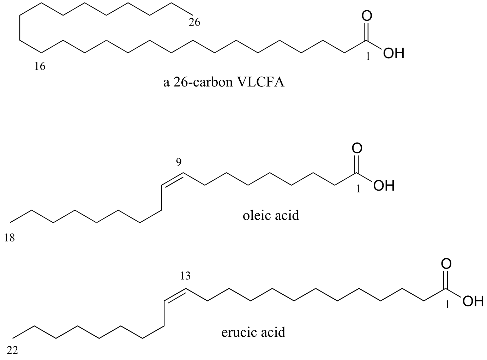

fig 38a

Administration of a mixture of these two oils, which eventually came to
be known as 'Lorenzo's Oil' , was shown to lead to a marked decrease in
levels of VLCFAs in ALD patients.

This was, however, a therapy rather than a miracle cure – and tragically
for the Odones and the families of other children afflicted with ALD,
the oil did not do anything to reverse the neurological damage that had
already taken place in Lorenzo's brain. Although he was profoundly
disabled, with round-the-clock care and a daily dosage of the oil
Lorenzo was able to live until a day after his 30th birthday,
22 years longer than his doctors had predicted.

The story does not end there. Although the discovery of the treatment
that bears his name came too late for Lorenzo Odone, might daily
consumption of the oil by young children who are at a high genetic risk
for ALD possibly prevent onset of the disease in the first place,
allowing them to live normal lives? This proposal was not without a lot
of controversy. Many ALD experts were very skeptical of the Lorenzo's
oil treatment as there was no rigorous scientific evidence for its
therapeutic effectiveness, and indeed erucic oil was thought to be
potentially toxic in the quantities ingested by Lorenzo. Most doctors
declined to prescribe the oil for their ALD patients until more studies
could be carried out. The Hollywood version of Lorenzo's story cast the
medical and scientific establishment, and Dr. Hugo Moser in particular,
in a strikingly negative light – they were portrayed as rigid, callous
technocrats who cared more about money and academic prestige than the
lives of real people. Dr. Moser was not mentioned by name in the movie,
but the character played by Peter Ustinov was based closely on him: as
his obituary in the Washington Post recounts, Dr. Moser once told an
interviewer "The good guys were given real names. The bad guys were
given pseudonyms."

What Hugo Moser in fact did was what a good scientist should always do:
he kept an open mind, set up and performed careful, rigorous
experiments, and looked at what the evidence told him. In a 2005 paper,
Moser was finally able to confidently report his results: when young
children at risk of developing ALD were given a daily dose of Lorenzo's
oil, they had significantly better chance of avoiding the disease later
on.

When he died, Dr. Moser was tantalizingly close to demonstrating
conclusively that a simple and rapid blood test that he and his team had
developed could reliably identify newborns at high risk of developing
ALD – but it was not until after his death that his colleagues,
including his wife, Ann Moser, were able to publish results showing that
the test worked. The hope is that many lives might be saved by routinely
screening newborns for ALD and responding with appropriate preventive
treatments - possibly including Lorenzo's oil.

The biochemical reactions at the heart of the Lorenzo's oil story – the
carbon-carbon bond forming and bond breaking steps in the synthesis and
degradation of fatty acids - both involve chemistry at the α-carbon and
proceed through enolate intermediates, much like the aldol and
isomerization reactions we studied in chapter 11. They are known as
'Claisen condensation' and 'retro-Claisen cleavage' reactions,
respectively, and represent another basic mechanistic pattern - in
addition to the aldol reaction - that is ubiquitous in metabolism as a
means of forming or breaking carbon-carbon bonds.

To begin this chapter, we will first learn about 'carboxylation' and
'decarboxylation' reactions, in which organic molecules gain or lose a
bond to carbon dioxide, respectively, in a mechanism that is really just
an extension of the aldol/retro-aldol reactions we learned about in the
previous chapter. As part of this discussion, we will work through the
mechanism of the carbon-fixing enzyme in plants commonly known as
'Rubisco', which is thought to be the most abundant enzyme on the
planet. Then, we will move to the Claisen reactions that are so central
to lipid metabolism and the story of Lorenzo Odone. Finally, we will
study 'conjugate additions' and 'β-eliminations', common reaction
patterns that involve double bonds in the α−β position relative to a
carbonyl group, and which, again, proceed via enolate intermediates.

##  13.1: Decarboxylation

Many carbon-carbon bond-forming and bond-breaking processes in
biological chemistry involve the gain or loss, by an organic molecule,
of a single carbon atom in the form of CO2. You undoubtedly
have seen this chemical equation before in an introductory biology or
chemistry class:

6CO2(g) + 6H2O(l) + energy →
C6H12O6(aq) + 6O2(g)

This of course represents the photosynthetic process, by which plants
(and some bacteria) harness energy from the sun to build glucose from
individual carbon dioxide molecules. The key chemical step in plants in
which a carbon dioxide molecule is 'fixed' (linked to a larger organic
molecule) is a **carboxylation** reaction, and is catalyzed by the
enzyme ribulose 1,5-bisphosphate carboxylase, commonly known as Rubisco.

The reverse chemical equation is also probably familiar to you:

C6H12O6(*aq*) + 6O2(*g*) →
6CO2(*g*) + 6H2O(*l*) + energy

This equation expresses what happens in the process known as
respiration: the oxidative breakdown of glucose to form carbon dioxide,
water, and energy (in a non-biological setting, it is also the equation
for the uncatalyzed *combustion* of glucose). In respiration, each of
the carbon atoms of glucose is eventually converted to a CO2
molecule. The process by which a carbon atom - in the form of carbon
dioxide - breaks off from a larger organic molecule is called
**decarboxylation**.

We will look now at the biochemical mechanism of decarboxylation
reactions. Later in the chapter, we will look at the carboxylation
reaction catalyzed by the Rubisco enzyme.

Decarboxylation steps occur at many points throughout central
metabolism. Most often, the substrate for a decarboxylation step is a
β-carboxy ketone or aldehyde.

Decarboxylation of a β-carboxy ketone or aldehyde:

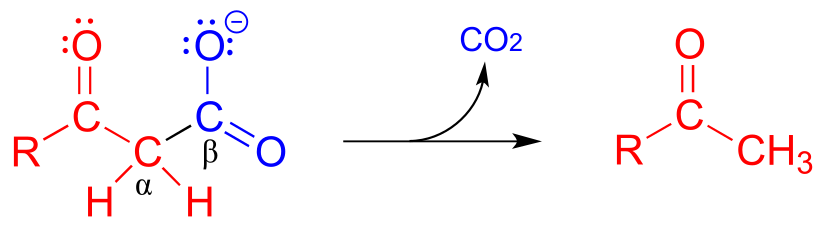

Mechanism:

fig 40

Just as in a retro-aldol reaction, a carbon-carbon bond is broken, and
the electrons from the broken bond must be stabilized for the step to
take place. Quite often, the electrons are stabilized by the formation
of an enolate, as is the case in the general mechanism pictured above.

The electrons from the breaking carbon-carbon bond can also be
stabilized by a conjugated imine group and/or by a more extensively
conjugated carbonyl.

fig 42

The key in understanding decarboxylation reactions is to first mentally
'push' the electrons away from the carboxylate group, then ask yourself:
where do these electrons go? If the electrons cannot 'land' in a
position where they are stabilized, usually by resonance with an oxygen
or nitrogen, then a decarboxylation is very unlikely.

The compound below is *not* likely to undergo decarboxylation:

fig 41

Be especially careful, when drawing decarboxylation mechanisms, to
resist the temptation to treat the CO2 molecule as the
leaving group in a mechanistic sense:

fig 43

The above is *not* what a decarboxylation looks like! (Many a point has
been deducted from an organic chemistry exam for precisely this
mistake!) Remember that in a decarboxylation step, it is the *rest* *of*
the molecule that is, in fact, the leaving group, 'pushed off' by the
electrons on the carboxylate.

Decarboxylation reactions are generally thermodynamically favorable due
to the entropic factor: one molecule is converted into two, one of which
is a gas - this represents an increase in disorder (entropy). Enzymatic
decarboxylation steps in metabolic pathways are also generally
irreversible.

Below are two decarboxylation steps (EC 1.1.1.42; EC 1.1.1.43) in
central catabolic metabolism (specifically the citric acid cycle and
pentose phosphate pathway catabolism, respectively). Each step
representing a point at which a carbon atom derived from the food we eat
is released as carbon dioxide:

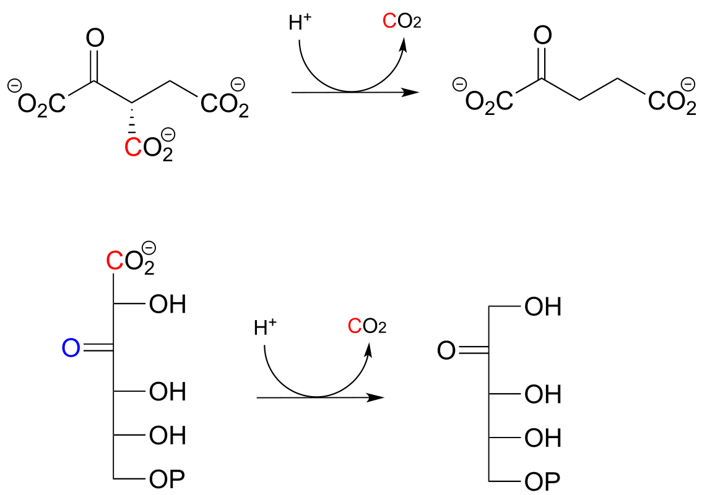

fig 44

<u>Exercise 13.1</u>:

Draw mechanistic arrows showing the carbon-carbon bond breaking step in
each of the reactions shown above.

The reaction catalyzed by acetoacetate decarboxylase (EC 4.1.1.4) relies
on an imminium (protonated imine) link that forms temporarily between
the substrate and a lysine residue in the active site, in a strategy
that is similar to that of the enamine-intermediate aldolase reactions
we saw in chapter 12. (Recall from section 7.5 that the pKa of an
imminium cation is approximately 7, so it is generally accurate to draw
either the protonated imminium or the neutral imine in a biological
organic mechanism).

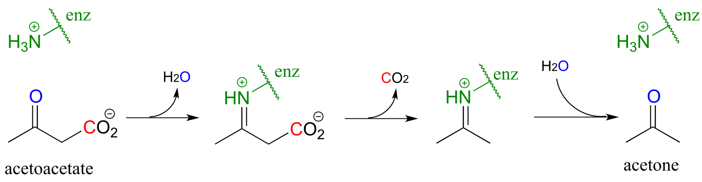

fig 45

<u>Exercise 13.2</u>: Draw a mechanism for the carbon-carbon bond
breaking step in the acetoacetate decarboxylase reaction.

<u>Exercise 13.3:</u> Which of the following compounds could be expected
to potentially undergo decarboxylation? Draw the mechanistic arrows for
the decarboxylation step of each one you choose, showing how the
electrons from the breaking carbon-carbon bond can be stabilized by
resonance.

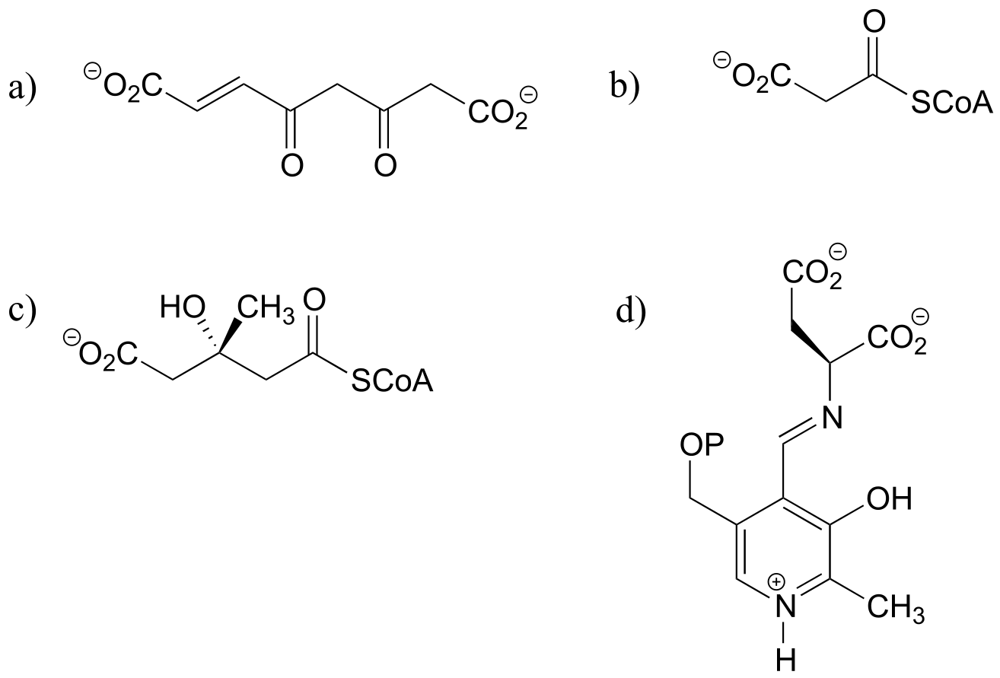

fig45a

##  13.2: An overview of fatty acid metabolism

In the introduction to this chapter, we learned about a patient
suffering from a rare disease affecting fatty acid metabolism. The
reaction mechanisms that we are about to learn about in the next two
sections are central to the process by which fatty acids are assembled
(synthesis) and taken apart (degradation), so it is worth our time to go
through a brief overview before diving into the chemical details.

Fatty acid metabolism is a two-carbon process: in the synthetic
directions, two carbons are added at a time to a growing fatty acid
chain, and in the degradative direction, two carbons are removed at a
time. In each case, there is a four-step reaction cycle that gets
repeated over and over. We will learn in this chapter about steps I and
III in the synthesis direction, and steps II and IV in the degradative
direction. The remaining reactions, and the roles played by the
coenzymes involved, are the main topic of chapter 15.

**Fatty acid synthesis:**

*'ACP' stands for 'acyl carrier protein', which is a protein that links
to growing fatty acid chains through a thioester group (see section
11.5A)*

Step I: Condensation (covered in section 13.3A)

Step II: Ketone hydrogenation (covered in section 15.3)

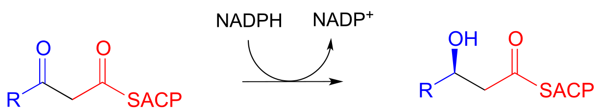

Step III: Elimination (covered in section 13.4)

Step IV: Alkene hydrogenation (covered in section 15.4)

. . . back to step I, add another malonyl-ACP, repeat.

fig 31a

**Fatty acid degradation:**

Step I: Alkane oxidation (covered in section 15.4)

Step II: Addition of water (covered in section 13.4)

Step III: Oxidation of alcohol (covered in section 15.3)

Step IV: Cleavage (covered in section 13.3C)

. . . back to step I

fig 31b

When looking at these two pathways, it is important to recognize that
they are *not* the reverse of each other. Different coenzymes are in
play, different thioesters are involved (coenzyme A in the degradative
direction, acyl carrier protein in the synthetic direction), and even
the stereochemistry is different (compare the alcohols in steps II/III
of both pathways). As you will learn in more detail in a biochemistry
course, metabolic pathways that work in opposite directions are
generally not the exact reverse of each other. In some, like fatty acid
biosynthesis, all of the steps are catalyzed by different enzymes in the
synthetic and degradative directions. Other 'opposite direction'
pathways, such as glycolysis/gluconeogenesis, contain mostly reversible
reactions (each catalyzed by one enzyme working in both directions), and
a few irreversible 'check points' where the reaction steps are different
in the two directions. As you will learn when you study metabolism in
biochemistry course, this has important implications in how two
'opposite direction' metabolic pathways can be regulated independently
of one another.

Recall that in Chapter 12 we emphasized the importance of two reaction
types - the aldol addition and the Claisen condensation - in their role
in forming (and breaking) most of the carbon-carbon bonds in a living
cell. We have already learned about the aldol addition, and its reverse,
the retro-aldol cleavage. Now, we will study the Claisen condensation
reaction, and its reverse, the retro-Claisen cleavage. Step I in fatty
acid synthesis is a Claisen condensation, and step IV in fatty acid
degradation is a retro-Claisen cleavage.

In section 13.4, we will look more closely at the reactions taking place
in step III of fatty acid synthesis (an elimination) and step II of
fatty acid degradation (a conjugate addition)

##  13.3: Claisen condensation

### 13.3A: Claisen condensation - an overview

Recall the general mechanism for a nucleophilic acyl substitution
mechanism, which we studied in chapter 10:

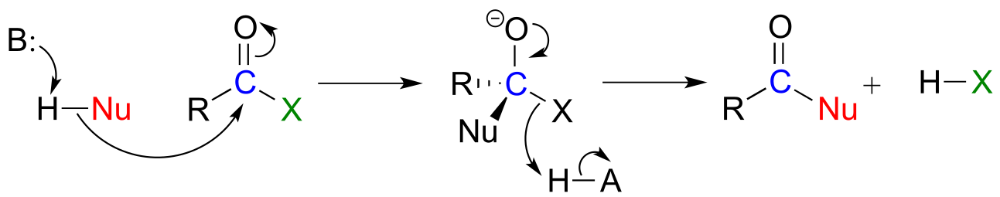

fig 31

The major points to recall are that a nucleophile attacks a carboxylic
acid derivative, leading to a tetrahedral intermediate, which then
collapses to expel the leaving group (X). The whole process results in
the formation of a different carboxylic acid derivative.

A typical nucleophilic acyl substitution reaction might have an alcohol
nucleophile attacking a thioester, driving off a thiol and producing an
ester.

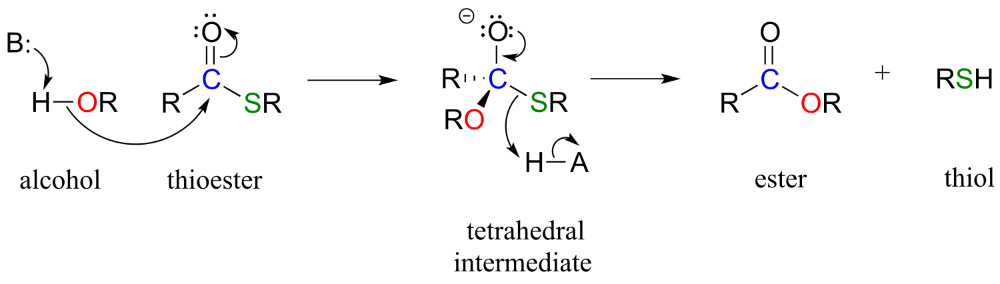

fig 32

If, however, the attacking nucleophile in an acyl substitution reaction
is the *α-carbon of an enolate*, a new carbon-carbon bond is formed.
This type of reaction is called a **Claisen condensation**, after the
German chemist Ludwig Claisen (1851-1930).

A Claisen condensation reaction

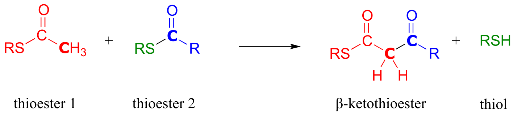

Mechanism:

fig 33

In step 1, the α−carbon of one thioester substrate is deprotonated to
form an enolate, which then goes on to attack the second thioester
substrate (step 2). Then the resulting tetrahedral intermediate
collapses (step 3), expelling the thiol leaving group and leaving us
with a β-keto thioester product (a thioester with a ketone group two
carbons away).

To reiterate: *A Claisen condensation reaction is simply a nucleophilic
acyl substitution (Chapter 11) reaction with an **enolate** carbon
nucleophile.*

### 13.3B: Biochemical Claisen condensation examples

A Claisen condensation between two acetyl CoA molecules (EC 2.3.1.9)
serves as the first step in the biosynthesis of cholesterol and other
isoprenoid compounds in humans (see section 1.3A for a reminder of what
isoprenoids are). First, a transthioesterase reaction transfers the
acetyl group of the first acetyl CoA to a cysteine side chain in the
enzyme's active site (steps a, b). (This preliminary event is typical of
many enzyme-catalyzed Claisen condensation reactions, and serves to link
the electrophilic substrate covalently to the active site of the
enzyme).

In the 'main' part of the Claisen condensation mechanism, the α-carbon
of a second acetyl CoA is deprotonated (step 1), forming a nucleophilic
enolate.

fig 34

The enolate carbon attacks the electrophilic thioester carbon, forming a
tetrahedral intermediate (step 2) which collapses to expel the cysteine
thiol (step 3).

<u>Exercise 13.4</u>: Draw curved arrows for the carbon-carbon
bond-forming step in mechanism for this condensation reaction between
two fatty acyl-thioester substrates. R1 and R2 can
be hydrocarbon chains of various lengths. (*J. Biol. Chem*. **2011**,
*286*, 10930.)

 

fig 34a

In an alternative mechanism, Claisen condensations in biology are often
initiated by decarboxylation at the α−carbon of a thioester, rather than
by deprotonation:

Decarboxylation/Claisen condensation:

Mechanism:

fig 45d

The thing to notice here is that the nucleophilic enolate (in red) is
formed in the first step by decarboxylation, rather than by
deprotonation of an α-carbon. Other than that, the reaction looks just
like the Claisen condensation reactions we saw earlier.

Now, we can finally understand the fatty acid chain-elongation step that
we heard about in the chapter introduction in the context of the
Lorenzo's oil story, which is a decarboxylation/Claisen condensation
between malonyl-ACP (the donor of a two-carbon unit) and a growing fatty
acyl CoA molecule. Notice that, again, the electrophilic acyl group is
first transferred to an active site cysteine, which then serves as the
leaving group in the carbon-carbon bond forming process.

Chain elongating (Claisen condensation) reaction in fatty acid
biosynthesis

*(step 1 in fatty acid synthesis cycle)*

Mechanism:

fig 45b

<u>Exercise 13.5</u>: Curcumin is the compound that is primarily
responsible for the distinctive yellow color of turmeric, a spice used
widely in Indian cuisine. The figure below shows the final step in the
biosynthesis of curcumin. Draw a mechanism for this step.

### 13.3C: Retro-Claisen cleavage

Just like the aldol mechanism, Claisen condensation reactions often
proceed in the 'retro', bond-breaking direction in metabolic pathways.

A typical Retro-Claisen cleavage reaction

(thiol nucleophile)

Mechanism:

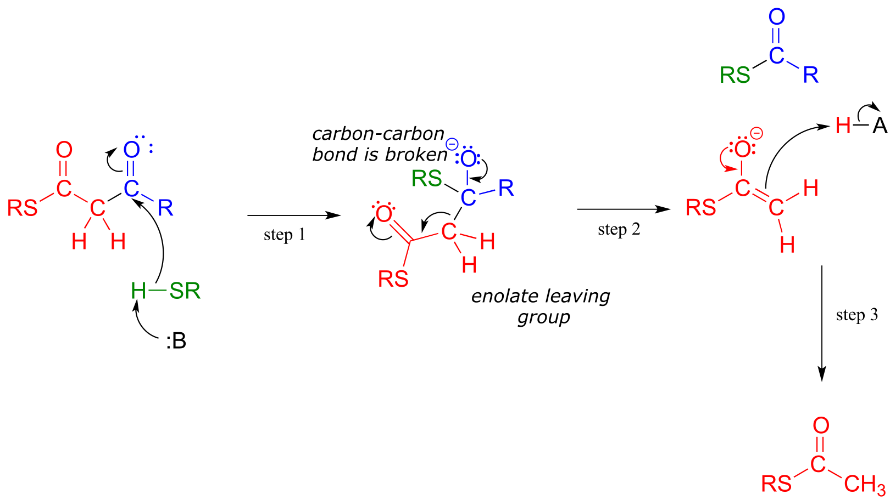

fig 35

In a typical retro-Claisen reaction, a thiol (or other nucleophile such
as water) attacks the carbonyl group of a β-thioester substrate (step
1), and then the resulting tetrahedral intermediate collapses to expel
an enolate leaving group (step 2) - this is the key carbon-carbon
bond-breaking step. The leaving enolate reprotonates (step 3) to bring
us back to where we started, with two separate thioesters. You should
look back at the general mechanism for a forward Claisen condensation
and convince yourself that the retro-Claisen mechanism illustrated
aboveis a step-by-step reverse process.

<u>Exercise 13.6</u>: Is a decarboxylation/Claisen condensation step
also likely to be metabolically relevant in the 'retro' direction?
Explain.

When your body 'burns' fat to get energy, it is a retro-Claisen cleavage
reaction (EC 2.3.1.16) that is responsible for breaking the
carbon-carbon bonds in step IV of the fatty acid degradative pathway. A
cysteine thiol on the enzyme serves as the incoming nucleophile (step 1
in the mechanism below), driving off the enolate leaving group as the
tetrahedral intermediate collapses (step 2). The enolate is then
protonated to become acetyl CoA (step 3), which goes on to enter the
citric acid (Krebs) cycle. Meanwhile, a transthioesterification reaction
occurs (steps a and b) to free the enzyme's cysteine residue,
regenerating a fatty acyl CoA molecule which is two carbons shorter than
the starting substrate.

The retro-Claisen reaction (step IV) in fatty acid degradation

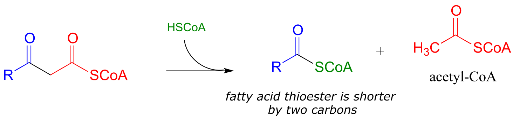

Mechanism:

fig 36

<u>Exercise 13.7</u>: In a step in the degradation if the amino acid
isoleucine, the intermediate compound 2-methyl-3-keto-butyryl CoA
undergoes a retro-Claisen cleavage. Predict the products..

fig 36a

<u>Exercise 13.8</u>: Many biochemical retro-Claisen steps are
hydrolytic, meaning that water, rather than a thiol as in the example
above, is the incoming nucleophile that cleaves the carbon-carbon bond.
One example (EC 3.7.1.2) occurs in the degradation pathway for tyrosine
and phenylalanine:

fig 36a

a\) Propose a likely mechanism for the reaction shown.

b\) The β-diketone substrate in the reaction above could hypothetically
undergo a different retro-Claisen cleavage reaction in which the
nucleophilic water attacks the other ketone group. Predict the products
of this hypothetical reaction.

##  13.4: Conjugate addition and β-elimination

In this section, we will look at two more common biochemical reactions
that proceed through enolate intermediates. In a typical **conjugate
addition**, a nucleophile and a proton are 'added' to the two carbons of
an alkene which is conjugated to a carbonyl (i.e. in the α−β position).
In a **β-elimination** step, the reverse process occurs:

fig 46

In chapter 9 we learned about nucleophilic carbonyl addition reactions,
including the formation of hemiacetals, hemiketals, and imines. In all
of these reactions, a nucleophile *directly* attacks a carbonyl carbon.

fig 47

If, however, the electrophilic carbonyl is β-unsaturated - if, in other
words, it contains a double bond conjugated to the carbonyl - a
different reaction pathway is possible. A resonance structure can be
drawn in which the β-carbon has a positive charge, meaning that the
β-carbon also has the potential to be an electrophilic target.

fig 48

If a nucleophile attacks at the β-carbon, an enol or enolate
intermediate results (step 1 below). In many cases this intermediate
collapses and the α-carbon is protonated (step 2). This type of reaction
is known as a **conjugate addition**.

Mechanism of a conjugate addition reaction

fig 49

The reverse of a conjugate addition is a **β-elimination**, and is
referred to mechanistically the abbreviation **E1cb**.

Mechanism of an E1cB elimination

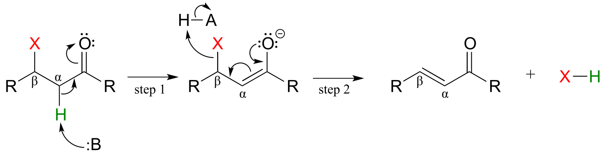

fig 50

The E stands for 'elimination'; the numeral 1 refers to the fact that,
like the SN1 mechanism, it is a stepwise reaction with first
order kinetics. The 'cB' designation refers to the intermediate, which
is the **<u>c</u>**onjugate **<u>b</u>**ase of the starting compound. In
step 1, an α-carbon is deprotonated to produce an enolate, just like in
aldol and Claisen reactions we have already seen. In step 2, the excess
electron density on the enolate expels a leaving group at the β position
(designated 'X' in the figure above). Notice that the α and β carbons
change from *sp*3 to *sp*2 hybridization with the
formation of a conjugated double bond.

(In chapter 14 we will learn about alternate mechanisms for alkene
addition and β-elimination reactions in which there is *not* an adjacent
carbonyl (or imine) group, and in which the key intermediate species is
a resonance-stabilized carbo**cation**. )

Step II of fatty acid degradation is a conjugate addition of water, or
hydration.

fig 51

Note the specific stereochemical outcome: in the active site, the
nucleophilic water is bound *behind* the plane of the conjugated system
(as drawn in the figure above), and the result is *S* configuration in
the β-hydroxy thioester product.

In step III of the fatty acid *synthesis* cycle we saw an E1cb
β-elimination of water (**de**hydration):

fig 52

Notice that the stereochemistry at the β-carbon of the starting alcohol
is *R*, whereas the hydration pathway (step II) reaction in the fatty
acid degradation cycle pathway results in the *S* stereoisomer. These
two reactions are *not* the reverse of one another!

Here are two more examples of β-elimination reactions, with phosphate
and ammonium respectively, as leaving groups. The first,
3-dehydroquinate synthase (EC 4.2.3.4) is part of the biosynthesis of
aromatic amino acids, the second, aspartate ammonia lyase (EC 4.3.1.1)
is part of amino acid catabolism.

fig 53

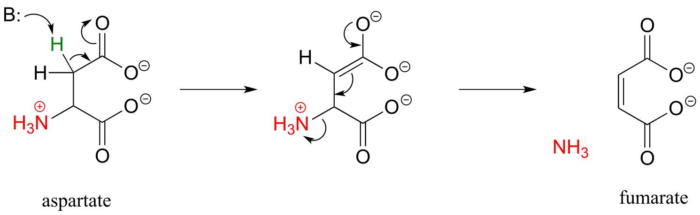

fig 53b

[figure showing active site interactions for aspartate ammonia
lyase](http://pubs.acs.org/appl/literatum/publisher/achs/journals/content/bichaw/2011/bichaw.2011.50.issue-27/bi200497y/production/images/large/bi-2011-00497y_0005.jpeg)

*(Biochemistry* **2011**, *50*, 6055)

<u>Exercise 13.9:</u> In the glycolysis pathway, the enzyme 'enolase'
(EC 4.2.1.11) catalyzes the E1cb dehydration of 2-phosphoglycerate.
Predict the product of this enzymatic step.

<u>Exercise13.10:</u> *N*-ethylmaleimide (NEM) is an irreversible
inhibitor of many enzymes that contain active site cysteine residues.
Inactivation occurs through conjugate addition of cysteine to NEM: show
the structure of the labeled residue. (Michael addition)

fig 54

<u>Exercise 13.11</u>: Argininosuccinate lyase (4.3.2.1), an enzyme in
the metabolic pathway that serves to eliminate nitrogen from your body
in the form of urea in urine, catalyzes this β-elimination step:

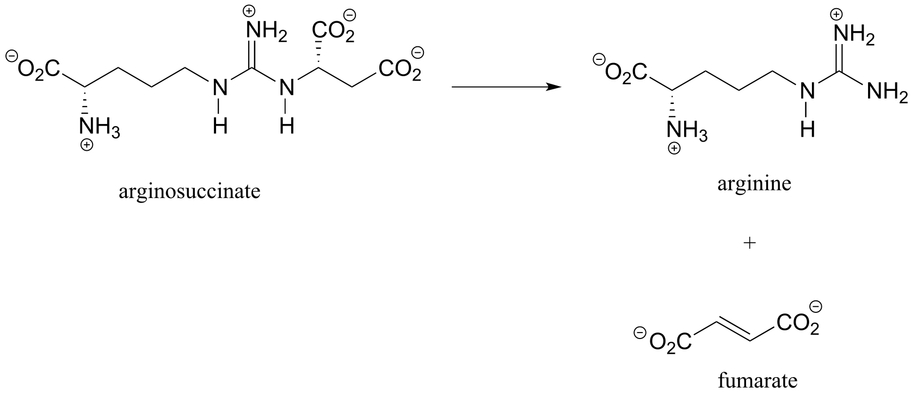

fig 54

Propose a complete mechanism. *Hint*: Don't be intimidated by the size
or complexity of the substrate - review the β-elimination mechanism,
then identify the leaving group and breaking bond, the α-carbon which
loses a proton, the carbonyl that serves to stabilize the
negatively-charged (enolate) intermediate, and the double bond that
forms as a result of the elimination. You may want to designate an
appropriate 'R' group to reduce the amount of drawing.

##  13.5: Carboxylation by the Rubisco enzyme

It is difficult to overstate the importance to biology and ecology of
the enzymatic reaction we are going to see next: ribulose
1,5-bisphosphate carboxylase (Rubisco) plays a key role in closing the
'carbon cycle' in our biosphere, catalyzing the incorporation of a
carbon atom - in the form of carbon dioxide from the atmosphere - into
organic metabolites and eventually into carbohydrates, lipids, nucleic
acids, and all of the other organic molecules in living things. Rubisco
is probably the most abundant enzyme on the planet.

You can think of a carboxylation reaction as essentially a special kind
of aldol reaction, except that the carbonyl electrophile being attacked
by the enolate is CO2 rather than a ketone or aldehyde:

Mechanism for carboxylation of an enolate

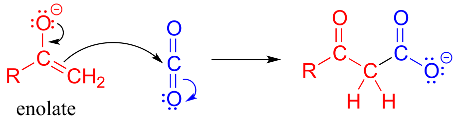

fig 38

Here is the full Rubisco reaction. Notice that the carbon dioxide (in
blue) becomes incorporated into one of the two phosphoglycerate
products.

The Rubisco reaction

Mechanism:

fig 37 fig 39

The mechanism for the Rubisco reaction is somewhat involved, but if we
break it down into its individual steps, it is not terribly difficult to
follow. In step 1, an α-carbon on ribulose 1,5-bisphosphate is
deprotonated to form an enolate. In step 2, the oxygen at carbon \#3 is
deprotonated while the oxygen at carbon \#2 is protonated: combined,
these two steps have the effect of creating a different enolate
intermediate and making carbon \#2, rather than carbon \#3, into the
nucleophile for an aldol-like addition to CO2 (step 3).
Carbon dioxide has now been 'fixed' into organic form - it has become a
carboxylate group on a six-carbon sugar derivative. Steps 4, 5, and 6
make up a hydrolytic retro-Claisen cleavage reaction (in other words,
water is the bond-breaking nucleophile) producing two molecules of
3-phosphoglycerate. Phosphoglycerate is channeled into the
gluconeogenesis pathway to eventually become glucose.

<u>Exercise 13.12</u>: Draw out the full mechanism for steps 4-6 in the
Rubisco reaction.

## Key learning objectives for this chapter 

Before moving on to the next chapter, you should:

Be able to draw reasonable mechanisms for reactions of the following
type:

Decarboxylation of a β-carboxy ketone or aldehyde

Claisen condensation and retro-Claisen cleavage

Hybrid decarboxylation-Claisen condensation

Conjugate addition

E1cb elimination

Understand (though not necessarily memorize) the fatty acid synthesis
and degradation cycles, and how the Claisen. retro-Claisen, conjugate
addition, and E1cb elimination steps fit in.

Be able to draw a complete mechanism for the Rubisco reaction.

## Problems

**P13.1:** Tetrahydrolipastatin, a potent inhibitor of lipase enzymes
(see section 11.6) is being tested as a possible anti-obesity drug.
Lipastatin, a close derivative, is synthesized by the bacterium
S*treptomyces toxytricini*. The biosynthetic pathway involves the
following step shown below - draw a likely mechanism*.* ([*J. Biol.
Chem.* **1997**, *272*,
867](https://www.ncbi.nlm.nih.gov/pubmed/8995375)).

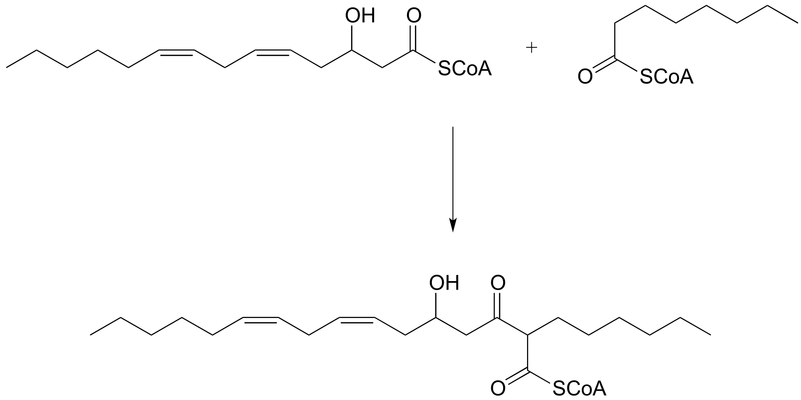

**P13.2:** The metabolism of camphor by some bacteria involves the step
below. Draw a likely mechanism. *(*[*J. Biol. Chem* **2004**, *279*,
31312](https://www.ncbi.nlm.nih.gov/pubmed/15138275))

**P13.3**: The glucogeogenesis pathway, by which glucose is synthesized
from pyruvate, begins with a reaction catalyzed by pyruvate carboxylase.
The enzyme requires the CO2-carrying biotin to function, but
the final step is thought to be the simple carboxylation of pyruvate by
free carbon dioxide (*Biochem. J.* **2008**, *413*, 369). Draw a
mechanism for this step.

**P13.4:** Draw a reasonable mechanism for this decarboxylation step in
tryptophan biosynthesis (EC 4.1.1.45). *Hint*: a tautomerization step
precedes the decarboxylation.

**P13.5:** The biosynthetic pathway for the antibiotic compound
rabelomycin begins with the condensation of malonyl CoA and acetyl CoA.
Predict the product of this reaction, and propose a likely mechanism.
(*Org. Lett.* **2010** *12*, 2814.)

**P13.6** Predict the product of this decarboxylation step in the
biosynthesis of the amino acid tyrosine. *Hint*: think about comparative
stability when you are considering where protonation will occur!

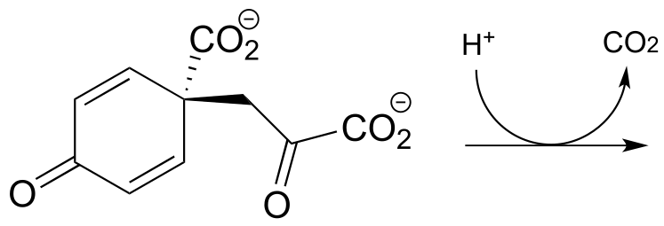

**P13.7:** Show a likely mechanism for this reaction from lysine
biosynthesis:

**P13.8:** Compound A undergoes hydrolytic cleavage in some fungi to
form the products shown. Predict the structure of A. (*J. Biol. Chem*.
**2007**, *282*, 9581)

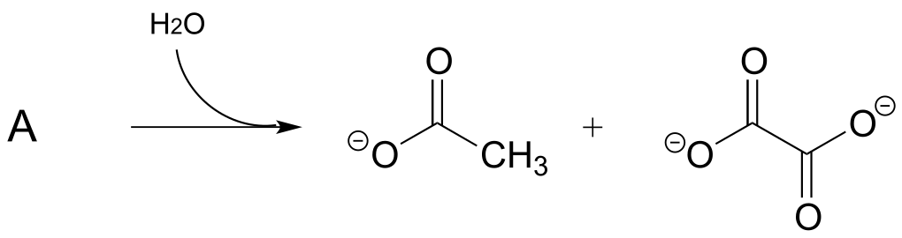

**P13.9:** Propose a mechanism for the following reaction from the
gluconeogenesis pathway (EC 4.1.1.32):

**P13.10:** Dehydroquinate undergoes dehydration (EC 4.2.1.10) in
aromatic amino acid biosynthesis. Experimental and genomic evidence
points to a lysine-linked iminium intermediate. More than one
dehydration product is possible for dehydroquinate, but in this case the
most stable product is the one that forms. Predict the structure of the
product, explain why it is the more stable of the possible dehydration
products, and draw a mechanism for its formation.

**P13.11:** The enzyme catalyzing the reaction below, thought to
participate in the fermentation of lysine in bacteria, was recently
identified and characterized *(J. Biol. Chem*. **2011**, *286*, 27399).
Propose a likely mechanism. Hint: the mechanism involves two separate
carbon-carbon bond forming and bond breaking steps. C1 of
acetyl CoA is identified with a red dot to help you trace it through to
the product.

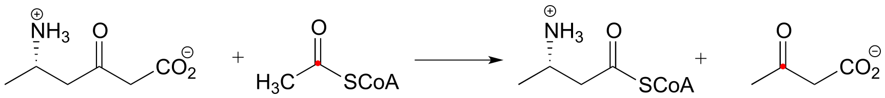

**P13.12:** Menaquinone (Vitamin K) biosynthesis in bacteria includes
the following step:

Propose a likely mechanism. *Hint*: the mechanism involves a Claisen
condensation step which is unusual in that the electrophile is a
carboxylic acid group rather than a thioester. What is the driving force
that allows this unusual step to occur? (*J. Biol. Chem*. **2010**,
*285*, 30159)

**P13.13:** 4-maleylacetoacetate isomerase (EC 5.2.1.2) catalyzes the
following *cis* to *trans* alkene isomerization as part of the
degradation of the aromatic amino acids phenylalanine and tyrosine.

fig5

The enzyme uses the thiol-containing coenzyme glutathione, which is also
involved in the formation of disulfide bonds in proteins, but in this
case glutathione serves as a 'thiol group for hire'. The mechanism for
the reaction is essentially a reversible conjugate addition of
glutathione. Draw out the steps for this mechanism, showing how the
*cis-trans* isomerization could be accomplished. Also, explain why the
equilibrium for this reaction favors 4-fumarylacetoacetate. The
structure of glutathione is shown, but you can use the abbreviation GSH
in your mechanism.

**P13.14:** Based on the mechanistic patterns you have studied in this
chapter, propose a likely mechanism for this final reaction in the
degradation of the amino acid cysteine in mammals.

**P13.15:** Propose a mechanism for the following carboxylation reaction
(EC 6.4.1.4) in the leucine degradation pathway. The complete reaction
is dependent on the CO2-carrying coenzyme biotin as well as
ATP, but assume in your mechanism that the actual carboxylation step
occurs with free CO2 (you don’t need to account for the role
played by biotin or ATP).58, bottom)

**P13.16:** Propose a mechanism for the following reaction, which is
part of the degradation pathway for the nucleotide uridine.

(

**P13.17:** Illustrated below is a series of reactions in the
degradation pathway for the amino acid methionine. In step 1, an alcohol
group on C3 is oxidized to a ketone, and in step 4 the ketone
is reduced back to an alcohol - we will study these reactions in chapter
X. In steps 2 and 3, the thiol (homocysteine) is replaced by water - but
this does NOT involve a nucleophilic substitution process.

a\) Draw a likely mechanism for step 2

b\) Draw a likely mechanism for step 3

c\) How does the involvement of the redox steps (steps 1 and 4) provide
evidence that overall substitution of water for homocysteine is not a
nucleophilic substitution?

**P13.18**: (Challenging!) A recently discovered reaction in the
biosynthesis of rhizoxin, a potent virulence factor in the rice-seedling
blight fungus *Rhizopus microsporus, is illustrated below (Angewandte
Chemie* **2009**, *48*, 5001). The reaction takes place at the
intersection of two 'modules' of a multi-enzyme complex, and provides an
example of a biochemical conjugate addition step that results in the
formation of a new carbon-carbon bond (conjugate addition of a carbon
nucleophile is referred to as a **Michael addition**). Draw a likely
mechanism.

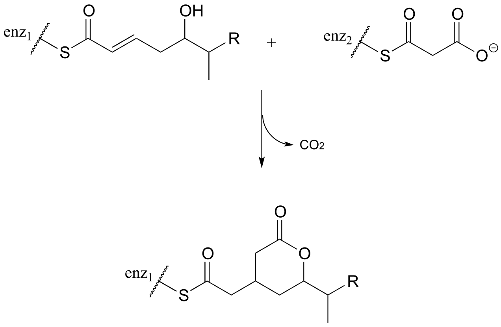

**P13.19:**

a\) The 'acetoacetic ester synthesis' is a useful carbon-carbon
bond-forming reaction in the laboratory. The reaction mechanism is
described as α-carbon deprotonation to form an enolate, followed by
SN2 alkylation, ester hydrolysis, and decarboxylation. Below
is an example:

 Draw out a reasonable
mechanism, taking care to propose reactive intermediates that are
appropriate given the basic or acidic conditions present (note that the
reaction starts under basic conditions, then is later acidified).

b\) Suggest starting compounds for the synthesis of 4-phenyl-2-butanone
by the acetoacetic ester reaction.

c\) A very useful ring-forming reaction in laboratory synthesis is
called 'Robinson annulation' (Sir Robert Robinson was an English chemist
who won the 1947 Nobel Prize in Chemistry, and the term ‘annulation’
comes from the Latin *annulus*, meaning ‘ring’.) The reaction, which
takes place in basic conditions, consists of a conjugate (Michael)
addition step, followed by aldol addition and finally dehydration
(β-elimination of water). A typical example is shown below, with carbons
numbered to help you to follow the course of the reaction.

Draw a mechanism for this reaction (when proposing intermediate species,
keep in mind that the reaction is occurring in a basic environment, and
choose protonation states accordingly).

d\) Propose starting compounds for the Robinson annulation synthesis of
the following product:

**P13.20:** The reaction shown below, catalyzed by orotidine
monophosphate decarboxylase (EC 4.1.1.23), is one of the most
extensively studied enzymatic transformations. It is known to occur
without the participation of any coenzymes.

(

a\) Look at the reaction closely: what is unique about it?

b\) In 1997, a paper was published in which the authors predicted, based
on theoretical calculations, that this reaction proceeded through a
carbene intermediate (carbenes are not covered in this text – you may
need to look them up). This was prior to the publication of an x-ray
crystal structure. What kind of active site environment does this imply?

c\) When the crystal structure was published a few years later, we
learned that an aspartate residue (predicted to be negatively charged)
is positioned very near the substrate carboxylate group, and a lysine
residue (predicted to be positively charged) is positioned nearby on the
opposite side (see figure below). What roles do you think were predicted
for these two active site residues?

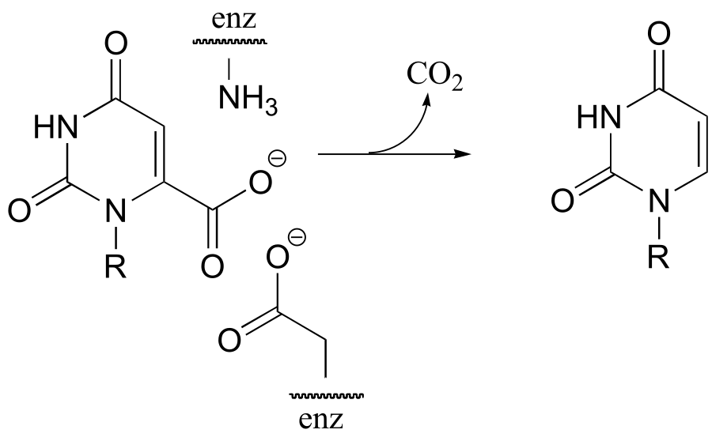

**P13.21**: In the histidine degradation pathway, histidine undergoes
elimination of ammonia to form *trans*-urocanate. The enzyme catalyzing
this reaction (E.C. 4.3.1.3) has been shown to use an unusual
'coenzyme', 4-methylideneimidazole-5-one (MIO), which is formed from the
cyclization of an alanine-serine-glycine stretch of the enzyme itself.

A mechanism has been proposed in which the MIO coenzyme plays the role
of electron sink, and the intermediate shown below forms.

Propose a full mechanism for this reaction according to this
information.

**P13.22:** The product that forms in the reaction between
[benzaldehyde](https://en.wikipedia.org/wiki/Benzaldehyde) and
[acetophenone](https://en.wikipedia.org/wiki/Acetophenone) (along with a
catalytic amount of sodium hydroxide) has a 1H-NMR spectrum
in which all of the signals are between 7-8 ppm. Give the structure of
product.

